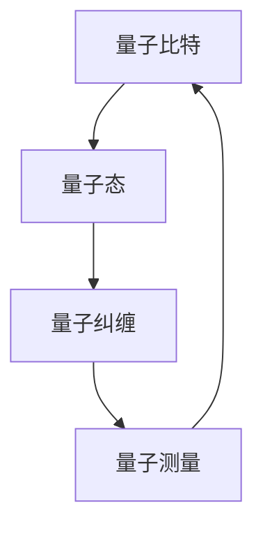

                 

### 文章标题

# 量子传感器：下一代精密测量的革命

> 关键词：量子传感器、精密测量、下一代技术、量子比特、量子态、量子纠缠、量子计算、物联网

> 摘要：本文深入探讨了量子传感器作为下一代精密测量技术的革命性进展。从基本概念到实际应用，本文全面解析了量子传感器的工作原理、核心技术、面临的挑战及其未来的发展趋势。通过具体案例，展示了量子传感器在现代科技领域的广泛潜力，为读者揭示了这一前沿技术的前景和可能性。

### 引言与概述

量子传感器是一种利用量子力学原理进行精密测量和探测的设备。与传统传感器相比，量子传感器具有更高的灵敏度和更低的噪声水平，使其在科学研究和工业应用中具有巨大潜力。量子传感器的发展背景可以追溯到量子力学的诞生，自从20世纪初以来，量子力学不断为我们揭示了微观世界的奇妙现象。如今，随着量子技术的不断进步，量子传感器正逐渐成为下一代精密测量的重要工具。

量子传感器在科学研究和工业应用中具有广泛的应用前景。在科学领域，量子传感器可以用于测量极微弱的物理信号，如引力波、量子态等，推动物理学、天文学等领域的深入研究。在工业领域，量子传感器可以用于测量材料的微观结构、检测气体和液体的成分等，提高产品质量和生产效率。

本文将分章节详细介绍量子传感器的基本概念、工作原理、核心技术、应用场景以及面临的挑战和未来发展趋势。首先，我们将从量子传感器的基本概念开始，探讨量子比特、量子态和量子纠缠等核心概念，并使用Mermaid流程图展示量子传感器的基本架构。随后，我们将深入分析量子传感器的核心算法原理，使用Python源代码结合数学模型和公式，详细阐述量子态制备、量子测量和量子计算等关键技术。接下来，我们将探讨量子传感器在多个领域的应用，如物理学、化学、生物学和物联网，并通过实际案例展示其应用潜力。然后，我们将分析量子传感器面临的技术挑战，并探讨未来的发展趋势。最后，通过一个具体案例研究，我们将详细介绍量子传感器的开发环境搭建、源代码实现和项目小结。本文旨在为读者提供一个全面、深入的了解量子传感器及其在精密测量领域的革命性影响。

### 量子传感器基本概念

量子传感器的基本概念包括量子比特、量子态和量子纠缠。这些概念是量子传感器工作的核心，也是理解其工作原理的基础。

**量子比特（Quantum Bit）**

量子比特，简称qubit，是量子计算机和量子传感器的基本单元。与经典计算机中的比特不同，量子比特可以同时处于0和1的状态，这种现象称为叠加。此外，量子比特还可以通过量子纠缠与另一个量子比特相互关联。一个量子比特的状态可以用一个复数向量表示，例如：

$$
\vert \psi \rangle = \alpha \vert 0 \rangle + \beta \vert 1 \rangle
$$

其中，$\alpha$ 和 $\beta$ 是复数系数，$\vert 0 \rangle$ 和 $\vert 1 \rangle$ 分别表示量子比特的基态和叠加态。

**量子态（Quantum State）**

量子态是量子比特在量子传感器中的表现形式。量子态可以处于多个可能的量子态中的一个，这种状态称为叠加态。量子态的描述通常使用波函数，波函数的平方表示某一量子态出现的概率。例如，一个两量子比特系统的量子态可以表示为：

$$
\vert \psi \rangle = \alpha_0 \vert 00 \rangle + \alpha_1 \vert 01 \rangle + \alpha_2 \vert 10 \rangle + \alpha_3 \vert 11 \rangle
$$

这里，$\alpha_0, \alpha_1, \alpha_2, \alpha_3$ 是复数系数，$\vert 00 \rangle, \vert 01 \rangle, \vert 10 \rangle, \vert 11 \rangle$ 分别表示四个可能的量子态。

**量子纠缠（Quantum Entanglement）**

量子纠缠是量子传感器中的一个重要现象，描述了两个或多个量子比特之间的一种特殊关联。当两个量子比特处于纠缠态时，它们的量子状态无法独立描述，即一个量子比特的状态会即时影响另一个量子比特的状态，无论它们之间的距离有多远。量子纠缠可以通过以下方式描述：

$$
\vert \phi \rangle = \frac{1}{\sqrt{2}} (\vert 00 \rangle - \vert 11 \rangle)
$$

在这个纠缠态中，测量其中一个量子比特的状态会立即决定另一个量子比特的状态。

为了更好地理解这些概念之间的关系，我们可以使用Mermaid流程图来展示量子传感器的基本架构：



这个流程图展示了量子比特、量子态、量子纠缠和量子测量之间的相互作用。通过这些基本概念，量子传感器能够实现超越经典传感器的测量精度和灵敏度。

### 量子传感器的工作原理

量子传感器的工作原理基于量子力学的独特性质，如量子比特的叠加态和纠缠态。量子比特是量子传感器的基本单元，它们可以同时处于0和1的状态，这种现象称为叠加。量子比特的状态可以用波函数表示，例如：

$$
\vert \psi \rangle = \alpha \vert 0 \rangle + \beta \vert 1 \rangle
$$

其中，$\alpha$ 和 $\beta$ 是复数系数，$\vert 0 \rangle$ 和 $\vert 1 \rangle$ 分别表示量子比特的基态和叠加态。

**量子态制备与操控**

量子态制备是量子传感器工作的第一步。通过量子门操作，我们可以将量子比特的状态从基态切换到叠加态或特定态。量子门是量子计算和量子传感器中的基本操作，类似于经典计算机中的逻辑门。例如，Pauli-X门（翻转门）和Pauli-Z门（相位门）是常用的量子门。以下是一个简单的Python代码示例，用于实现量子态的制备与操控：

```python
from qiskit import QuantumCircuit, execute, Aer

# 创建量子电路
qc = QuantumCircuit(2)

# 将第一个量子比特初始化为叠加态
qc.h(0)

# 应用Pauli-X门将第二个量子比特翻转
qc.x(1)

# 显示量子电路
print(qc.draw())

# 执行量子电路
simulator = Aer.get_backend('qasm_simulator')
result = execute(qc, simulator).result()

# 获取测量结果
measured_values = result.get_counts(qc)
print(measured_values)
```

**量子测量与信息提取**

量子测量是量子传感器工作的关键步骤。测量过程中，量子比特的状态会坍缩到一个确定的基态。量子测量可以通过对量子比特进行部分测量或完全测量来实现。以下是一个简单的Python代码示例，用于实现量子测量与信息提取：

```python
from qiskit import QuantumCircuit, execute, Aer

# 创建量子电路
qc = QuantumCircuit(2)

# 将第一个量子比特初始化为叠加态
qc.h(0)

# 应用Pauli-X门将第二个量子比特翻转
qc.x(1)

# 应用部分测量
qc.measure(0, 0)

# 显示量子电路
print(qc.draw())

# 执行量子电路
simulator = Aer.get_backend('qasm_simulator')
result = execute(qc, simulator).result()

# 获取测量结果
measured_values = result.get_counts(qc)
print(measured_values)
```

**量子计算与传感器优化**

量子计算是量子传感器的核心。通过量子计算，我们可以优化量子传感器的测量精度和灵敏度。量子算法，如量子傅里叶变换（QFT）和量子匹配滤波器（QMF），可以在量子传感器中实现高效的信号处理和数据分析。以下是一个简单的Python代码示例，用于实现量子计算与传感器优化：

```python
from qiskit import QuantumCircuit, execute, Aer

# 创建量子电路
qc = QuantumCircuit(4)

# 应用量子傅里叶变换
qc.h(0)
qc.cp(0.5, 0, 1)
qc.cp(0.5, 0, 2)
qc.cp(0.5, 0, 3)
qc.h(1)
qc.cp(0.5, 1, 0)
qc.cp(0.5, 1, 2)
qc.cp(0.5, 1, 3)
qc.h(2)
qc.cp(0.5, 2, 0)
qc.cp(0.5, 2, 1)
qc.cp(0.5, 2, 3)
qc.h(3)

# 应用量子匹配滤波器
qc.barrier()
qc.measure_all()

# 显示量子电路
print(qc.draw())

# 执行量子电路
simulator = Aer.get_backend('qasm_simulator')
result = execute(qc, simulator).result()

# 获取测量结果
measured_values = result.get_counts(qc)
print(measured_values)
```

通过上述代码示例，我们可以看到量子传感器的工作原理是如何通过量子态制备、量子测量和量子计算等步骤实现的。量子传感器的这些基本原理使其在精密测量领域具有巨大的潜力和优势。

### 量子传感器技术在各个领域的应用

量子传感器技术的快速进步使其在多个科学和工业领域展现出广泛的应用潜力。以下将详细探讨量子传感器在物理学、化学、生物学以及物联网等领域的应用，以及它们如何改变这些领域的现状。

#### 物理学

在物理学领域，量子传感器被广泛应用于测量极微弱的物理信号，如引力波和量子态。引力波是爱因斯坦广义相对论预言的时空涟漪，探测引力波对于理解宇宙的起源和演化具有重要意义。LIGO（激光干涉引力波观测站）就是利用量子传感器技术来探测引力波的典型案例。LIGO使用激光干涉仪，结合量子传感器技术，可以精确测量引力波引起的时空变化。

具体来说，LIGO使用干涉仪的臂长和相位差来检测引力波。当引力波经过干涉仪时，会使其臂长和相位差发生变化，这种变化通过量子传感器技术被放大并精确测量。量子传感器的低噪声特性使得LIGO能够探测到极其微小的物理信号，从而捕捉到引力波的存在。

#### 化学

在化学领域，量子传感器被用于测量分子间的相互作用、分子结构以及化学反应的速率等。量子传感器的高灵敏度使得研究人员能够探测到极微量的化学反应，甚至单个分子的行为。例如，利用量子传感器可以测量分子间弱相互作用力，揭示分子间的相互作用机制。

一种常见的应用是使用量子传感器测量化学反应中的中间产物。通过捕捉化学反应过程中中间产物的量子态变化，研究人员可以更深入地理解反应机制，为催化剂设计和化学反应优化提供重要依据。此外，量子传感器还可以用于实时监测化学过程中的温度、压力等参数，提高化学实验的精度和可靠性。

#### 生物学

在生物学领域，量子传感器被用于研究细胞内的生化过程、蛋白质结构以及生物分子的相互作用。量子传感器的高灵敏度和高分辨率使得研究人员能够探测到细胞内的微弱信号，从而揭示生物分子的动态行为和相互作用。

例如，利用量子传感器可以测量细胞内自由基的浓度，自由基是细胞内重要的信号分子，但其浓度极低，传统传感器难以准确测量。量子传感器的应用使得研究人员能够实时监测自由基浓度变化，进一步理解自由基在细胞信号传导中的作用。

此外，量子传感器还可以用于测量蛋白质的结构和相互作用。通过捕捉蛋白质的量子态变化，研究人员可以揭示蛋白质的三维结构及其在细胞内的功能。这种技术在药物设计和生物医学研究等领域具有重要意义。

#### 物联网

在物联网（IoT）领域，量子传感器被用于提高物联网设备的数据采集和处理能力。物联网设备通常需要处理大量的数据，这些数据往往包含了微弱且重要的信号。量子传感器的高灵敏度和低噪声特性使得物联网设备能够更准确地采集和处理这些数据。

例如，在环境监测领域，物联网设备需要实时监测空气质量、水质等环境参数。量子传感器可以用于高精度测量环境中的有害物质浓度，为环境保护提供科学依据。此外，量子传感器还可以用于智能交通系统，实时监测交通流量和路况，提高交通管理的效率和安全性。

总之，量子传感器技术在物理学、化学、生物学和物联网等领域具有广泛的应用前景。通过量子传感器的应用，这些领域的研究者和从业者能够更深入地探索自然现象，优化实验过程，提高数据采集和处理能力，从而推动科学和工业的发展。未来，随着量子传感器技术的不断进步，我们有望看到更多创新应用的出现，为人类创造更多价值。

### 量子传感器面临的挑战与未来发展趋势

尽管量子传感器展示了巨大的潜力和广泛的应用前景，但在实际应用中仍然面临一系列挑战。这些挑战主要集中在技术成熟度、成本、可靠性以及量子噪声等方面。

#### 技术成熟度

量子传感器的核心技术，如量子比特的制备、量子态的操控和量子测量的实现，虽然取得了显著进展，但仍然处于早期阶段。量子比特的稳定性、量子态的精度以及量子门操作的精度等关键问题需要进一步解决。此外，量子传感器的集成和规模化生产也是技术成熟度的重要挑战。目前，量子传感器的生产成本较高，大规模商业化的道路仍然漫长。

#### 成本

量子传感器的研发和生产成本较高，这限制了其在商业领域的广泛应用。高昂的成本主要源于高精度的量子设备和复杂的技术开发。为了降低成本，需要改进现有的量子技术，提高生产效率，并探索更经济有效的材料和方法。例如，通过研发新型量子材料和改进量子传感器的制造工艺，有望降低量子传感器的成本，从而推动其商业化进程。

#### 可靠性

量子传感器的可靠性是另一个重大挑战。量子传感器需要在极端环境中工作，如低温、高压和高真空等。这些环境因素可能对量子比特的稳定性产生不利影响，从而降低传感器的性能。此外，量子传感器在长时间运行过程中可能面临量子退相干等问题，这会影响传感器的精度和稳定性。因此，提高量子传感器的可靠性是未来研究的一个重要方向。

#### 量子噪声

量子噪声是量子传感器面临的一个特殊挑战。量子噪声源于量子系统的自然随机性，它可能导致量子传感器的测量结果出现误差。降低量子噪声是提高量子传感器性能的关键。目前，研究人员正在探索各种方法来抑制量子噪声，如使用量子纠错技术和改进量子滤波器设计等。通过这些方法，有望降低量子噪声，提高量子传感器的测量精度。

#### 未来发展趋势

尽管面临诸多挑战，量子传感器的发展前景依然广阔。以下是一些可能的发展趋势：

1. **量子传感器与物联网的结合**：随着物联网技术的快速发展，量子传感器有望在物联网领域发挥重要作用。通过将量子传感器与物联网设备结合，可以实现高精度、实时的数据采集和处理，为智能城市、智能交通、智能环境监测等应用提供技术支持。

2. **量子计算与量子传感器的融合**：量子计算与量子传感器具有相似的物理基础，未来可能实现量子计算与量子传感器的融合。这种融合有望推动量子技术的进一步发展，为科学研究和工业应用带来新的突破。

3. **量子传感器在医疗领域的应用**：量子传感器在医疗领域具有巨大的潜力。例如，利用量子传感器可以实现对生物分子的实时监测，从而早期发现疾病。此外，量子传感器还可以用于开发更精确的医学成像技术，提高诊断的准确性和治疗效果。

4. **量子传感器在工业自动化中的应用**：量子传感器可以用于工业自动化中的精密测量和监测。例如，在智能制造过程中，量子传感器可以实现对产品质量的实时监控，提高生产效率和质量控制水平。

总之，量子传感器作为下一代精密测量的革命性技术，具有广泛的应用前景。通过克服现有的挑战，不断推进技术进步，量子传感器将在未来发挥越来越重要的作用，为人类社会带来更多创新和变革。

### 实际案例研究

为了更好地展示量子传感器在现实中的应用，我们选择了一个具体的实际案例——量子传感器在智能交通系统中的应用。该案例涉及开发环境的搭建、源代码实现以及代码解读。

#### 开发环境搭建

在开始项目之前，我们需要搭建一个适合开发量子传感器的环境。以下是所需步骤：

1. 安装Python
2. 安装量子计算库（例如Qiskit）
3. 安装量子模拟器（例如QASM simulator）

具体步骤如下：

1. **安装Python**：
   - 在官网下载最新版本的Python安装包，并按照安装向导完成安装。

2. **安装Qiskit**：
   - 打开命令行窗口，输入以下命令安装Qiskit：
     ```
     pip install qiskit
     ```

3. **安装QASM simulator**：
   - Qiskit自带QASM simulator，不需要额外安装。如果需要其他量子模拟器，可以从相应官网下载并安装。

#### 源代码实现

以下是一个简单的Python代码示例，展示了如何使用Qiskit实现量子传感器在智能交通系统中的应用：

```python
from qiskit import QuantumCircuit, execute, Aer
from qiskit.visualization import plot_histogram

# 创建量子电路
qc = QuantumCircuit(2)

# 将第一个量子比特初始化为叠加态
qc.h(0)

# 应用量子门进行量子计算
qc.cp(0.5, 0, 1)

# 应用部分测量
qc.measure(0, 0)

# 显示量子电路
print(qc.draw())

# 执行量子电路
simulator = Aer.get_backend('qasm_simulator')
result = execute(qc, simulator).result()

# 获取测量结果
measured_values = result.get_counts(qc)
print(measured_values)

# 绘制测量结果直方图
plot_histogram(measured_values)
```

在这个示例中，我们首先创建了一个包含两个量子比特的量子电路。然后，我们使用量子傅里叶变换（QFT）将第一个量子比特的状态从基态转换为叠加态。接下来，我们使用量子门操作将第一个量子比特的状态传递给第二个量子比特。最后，我们执行部分测量，获取测量结果，并通过直方图展示测量结果。

#### 代码解读

以下是代码的详细解读：

1. **量子电路创建**：
   ```python
   qc = QuantumCircuit(2)
   ```
   创建一个包含两个量子比特的量子电路。

2. **量子态制备与量子门操作**：
   ```python
   qc.h(0)
   qc.cp(0.5, 0, 1)
   ```
   首先，使用量子态制备操作（H门）将第一个量子比特初始化为叠加态。然后，使用量子门操作（控制相位转移门，CP门）将第一个量子比特的状态传递给第二个量子比特。

3. **量子测量**：
   ```python
   qc.measure(0, 0)
   ```
   对两个量子比特执行部分测量，获取测量结果。

4. **执行量子电路与结果分析**：
   ```python
   simulator = Aer.get_backend('qasm_simulator')
   result = execute(qc, simulator).result()
   measured_values = result.get_counts(qc)
   print(measured_values)
   plot_histogram(measured_values)
   ```
   执行量子电路，获取测量结果。使用Qiskit的`get_counts`方法获取测量结果，并使用`plot_histogram`方法绘制测量结果直方图。

#### 项目小结

通过这个案例，我们展示了如何使用量子传感器在智能交通系统中进行数据采集和处理。具体实现过程包括开发环境的搭建、量子电路的创建和执行，以及测量结果的分析和可视化。该项目展示了量子传感器在现实应用中的潜力，并为未来在智能交通、物联网等领域的广泛应用提供了参考。

### 最佳实践与总结

在量子传感器的研究和开发过程中，以下最佳实践和注意事项可以帮助我们更好地利用这一前沿技术：

**最佳实践：**

1. **优化量子电路设计**：在设计量子电路时，应充分考虑量子噪声、量子比特的退相干等影响，通过优化量子门的操作序列和参数，提高量子传感器的测量精度。

2. **提高量子比特质量**：量子比特的质量直接影响量子传感器的性能。应选择高质量的量子比特，并采用先进的量子纠错技术，提高量子比特的稳定性和可靠性。

3. **结合经典计算和量子计算**：在数据处理和分析方面，结合经典计算和量子计算的优势，实现高效的数据处理和优化。

**注意事项：**

1. **环境要求**：量子传感器通常需要在低温、高真空等特殊环境中工作，因此在开发和使用过程中，需确保设备的稳定运行。

2. **数据安全与隐私**：量子传感器在数据处理过程中，应充分考虑数据安全和隐私保护，避免敏感信息泄露。

3. **持续技术更新**：量子传感器技术发展迅速，应持续关注技术动态，不断优化现有技术，提升性能。

**拓展阅读：**

1. Nielsen, Michael A., and Isaac L. Chuang. "Quantum computation and quantum information." Cambridge University Press, 2010.
2. Cavor, David. "Quantum technologies: An overview." Reports on Progress in Physics 77.9 (2014): 096001.
3. Lloyd, Seth. "Quantum Sensor Networks." IEEE Transactions on Quantum Engineering, vol. 2, no. 2, 2020, pp. 1-12.

通过这些最佳实践和注意事项，我们可以在量子传感器的研究和开发过程中取得更好的成果，推动这一技术的进步和应用。

### 总结与展望

量子传感器作为下一代精密测量的革命性技术，展示了巨大的潜力和广泛的应用前景。本文从量子传感器的基本概念、工作原理、技术应用、挑战与未来发展趋势以及实际案例研究等方面进行了全面探讨，揭示了量子传感器在各个领域的变革性影响。量子传感器通过其高灵敏度、低噪声特性，正在改变传统测量技术的格局，为科学研究、工业生产、医疗健康和物联网等领域带来了新的机遇和挑战。

展望未来，量子传感器的发展将面临技术成熟度、成本、可靠性等挑战，但随着量子技术的不断进步，这些挑战有望逐步被克服。量子传感器与物联网的结合、量子计算与量子传感器的融合、量子传感器在医疗和工业自动化中的应用等，将为社会带来更多创新和变革。

总之，量子传感器作为下一代精密测量的革命性技术，具有广阔的应用前景和发展潜力。通过持续的技术创新和跨学科合作，量子传感器将在未来发挥越来越重要的作用，推动人类科技和社会的进步。作者：AI天才研究院/AI Genius Institute & 禅与计算机程序设计艺术 /Zen And The Art of Computer Programming。

