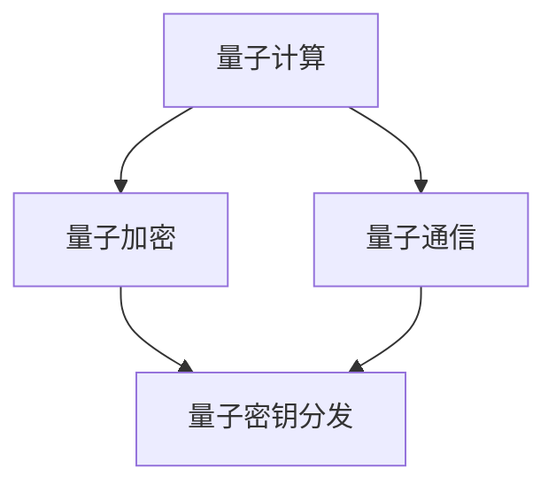

                 

# 量子安全意识：企业IT安全策略的新维度

## 关键词

- 量子安全
- 企业IT安全
- 量子信息技术
- 量子计算
- 量子密码学
- 量子通信

## 摘要

随着信息技术的飞速发展，企业IT安全面临着前所未有的挑战。传统的IT安全策略已难以应对日益复杂的网络攻击和信息安全威胁。量子技术的兴起，为解决这些难题提供了新的思路。本文从量子信息技术的基本概念出发，探讨了量子安全在数据保护、网络通信、云计算、网络安全、物联网等多个领域的应用，并分析了量子安全实战案例和未来展望，为企业IT安全策略提供了新维度。

## 目录大纲

### 第一部分：量子安全意识概述

#### 第1章：量子信息技术与安全
- 1.1 量子信息技术的基本概念
- 1.2 量子计算与量子通信
- 1.3 量子密码学及其应用
- 1.4 量子信息技术对传统安全体系的挑战

#### 第2章：量子安全策略框架
- 2.1 量子安全战略规划
- 2.2 量子安全风险评估
- 2.3 量子安全管理体系建设
- 2.4 量子安全教育与培训

### 第二部分：量子安全技术在企业中的应用

#### 第3章：量子安全在数据保护中的应用
- 3.1 量子加密算法原理
- 3.2 数据加密与解密流程
- 3.3 量子密钥分发技术
- 3.4 量子安全数据存储解决方案

#### 第4章：量子安全在网络通信中的应用
- 4.1 量子通信原理
- 4.2 量子密钥分配系统
- 4.3 量子安全通信网络架构
- 4.4 量子安全网络应用案例

#### 第5章：量子安全在云计算与边缘计算中的应用
- 5.1 量子云计算技术
- 5.2 边缘计算与量子安全
- 5.3 量子安全云服务模式
- 5.4 量子安全边缘计算应用

#### 第6章：量子安全在网络安全中的应用
- 6.1 量子安全网络安全体系
- 6.2 量子安全网络防护策略
- 6.3 量子安全网络安全威胁分析
- 6.4 量子安全网络安全案例分析

#### 第7章：量子安全在物联网与智能设备中的应用
- 7.1 量子安全物联网架构
- 7.2 物联网设备安全挑战
- 7.3 量子安全在物联网中的应用场景
- 7.4 物联网量子安全解决方案

### 第三部分：量子安全实战案例与未来展望

#### 第8章：量子安全实战案例解析
- 8.1 案例一：某企业量子安全体系构建
- 8.2 案例二：某金融机构的量子安全应用
- 8.3 案例三：国家量子通信网络的构建

#### 第9章：量子安全未来展望
- 9.1 量子安全发展趋势
- 9.2 量子安全技术研发前沿
- 9.3 量子安全标准化与法规
- 9.4 量子安全在企业中的长期影响

## 附录

### 附录A：量子安全相关工具与资源
- A.1 量子加密算法资源
- A.2 量子安全通信系统供应商
- A.3 量子安全研究与培训机构

### 核心概念与联系



### 核心算法原理讲解

#### 量子密钥分发算法（QKD）

量子密钥分发（Quantum Key Distribution, QKD）是利用量子力学原理来确保密钥传输的安全。以下是一个简单的量子密钥分发算法的伪代码：

```python
def QKD(key_size):
    # 1. Alice 和 Bob 各自选择一个随机的量子态作为量子密钥的候选。
    alice_qubit = random_quantum_state()
    bob_qubit = random_quantum_state()

    # 2. Alice 将量子态发送给 Bob，同时传输一个经典比特流，用于同步和纠错。
    alice_to_bob_quantum_channel.send(alice_qubit)
    alice_to_bob_classic_channel.send(sync_and_error_correction_bits())

    # 3. Bob 测量接收到的量子态。
    received_qubit = bob_from_alice_quantum_channel.receive()

    # 4. Alice 和 Bob 分别记录测量结果，并传输经典比特流进行比对。
    alice_measured_state = measure(alice_qubit)
    bob_measured_state = measure(received_qubit)
    bob_to_alice_classic_channel.send(bob_measured_state)

    # 5. 如果测量结果一致，则认为量子密钥生成成功；否则，重新进行步骤 1-4。
    if alice_measured_state == bob_measured_state:
        quantum_key = generate_classical_key(alice_measured_state, bob_measured_state, key_size)
        return quantum_key
    else:
        return QKD(key_size)

    # 6. 对成功生成的量子密钥进行经典加密传输，以实现安全通信。
    encrypted_communication_channel.send(quantum_key_encrypt(quantum_key))
```

### 数学模型和数学公式详细讲解与举例说明

#### 量子态与量子比特

量子计算中的基本单元是量子比特（qubit），它可以存在于多种可能的量子态中。一个量子比特可以表示为叠加态：

$$
|\psi\rangle = \alpha|0\rangle + \beta|1\rangle
$$

其中，$|0\rangle$ 和 $|1\rangle$ 分别表示量子比特的基础状态，$\alpha$ 和 $\beta$ 是复数，满足 $|\alpha|^2 + |\beta|^2 = 1$。

举例说明，假设量子比特的初始状态为 $|\psi_0\rangle = \frac{1}{\sqrt{2}}|0\rangle + \frac{1}{\sqrt{2}}|1\rangle$，经过一次 Hadamard 门操作后，量子比特的状态变为：

$$
|\psi_1\rangle = \frac{1}{\sqrt{2}}(|0\rangle + |1\rangle) = \frac{1}{\sqrt{2}}|0\rangle + \frac{1}{\sqrt{2}}|1\rangle
$$

Hadamard 门操作的数学公式表示为：

$$
H = \frac{1}{\sqrt{2}}\begin{pmatrix}
1 & 1 \\
1 & -1
\end{pmatrix}
$$

量子比特在经过 Hadamard 门操作后的状态可以表示为：

$$
H|\psi_0\rangle = \frac{1}{\sqrt{2}}\begin{pmatrix}
1 & 1 \\
1 & -1
\end{pmatrix}\begin{pmatrix}
\frac{1}{\sqrt{2}} \\
\frac{1}{\sqrt{2}}
\end{pmatrix} = \frac{1}{\sqrt{2}}\begin{pmatrix}
1 \\
1
\end{pmatrix} + \frac{1}{\sqrt{2}}\begin{pmatrix}
1 \\
-1
\end{pmatrix} = \frac{1}{\sqrt{2}}|0\rangle + \frac{1}{\sqrt{2}}|1\rangle
$$

可以看出，经过 Hadamard 门操作后，量子比特的状态仍然为叠加态，但它的振幅分布发生了变化。

#### 背景介绍

随着信息技术的飞速发展，企业面临的网络安全威胁日益严峻。传统的IT安全策略，如防火墙、入侵检测系统、加密技术等，虽然在一定范围内能够提供安全保障，但面对量子计算和量子密码学的挑战，其有效性已经受到了严重质疑。量子信息技术，尤其是量子计算和量子通信，为解决信息安全难题提供了新的思路。量子安全意识的提出，旨在指导企业在现有安全体系的基础上，引入量子技术，构建更加安全、可靠的IT安全策略。

### 核心概念与联系

量子安全的核心概念包括量子计算、量子加密、量子通信和量子密钥分发。这些概念之间存在着密切的联系，共同构成了量子安全的理论基础。

#### 量子计算

量子计算是一种利用量子力学原理进行信息处理的新型计算模式。与传统计算相比，量子计算机能够通过量子比特（qubit）的叠加和纠缠状态实现高效的并行计算和特定问题的优化解决。量子计算的核心在于量子比特，它能够同时存在于多个状态之中，从而大幅提升计算能力。

#### 量子加密

量子加密是一种基于量子力学原理的加密技术，能够确保信息传输的安全性。量子加密的核心在于量子密钥分发（QKD），它利用量子态的不可克隆特性，确保密钥在传输过程中的安全。量子加密技术在数据保护和网络通信中具有重要的应用价值。

#### 量子通信

量子通信是一种利用量子态实现信息传输的新型通信方式。量子通信的核心在于量子纠缠和量子态传输，能够实现超距离、超安全的通信。量子通信技术为解决信息安全难题提供了新的途径，尤其在量子密钥分发、量子隐形传态等领域具有显著优势。

#### 量子密钥分发

量子密钥分发（QKD）是一种基于量子力学原理的密钥分发技术，能够确保密钥在传输过程中的安全。QKD 利用量子态的不可克隆特性，通过量子纠缠和量子态传输实现密钥的分发。量子密钥分发技术在量子加密和数据保护中具有重要应用价值。

### 核心算法原理讲解

量子安全的核心算法包括量子加密算法、量子密钥分发算法和量子通信算法。以下将详细讲解这些算法的基本原理。

#### 量子加密算法

量子加密算法是一种基于量子力学原理的加密技术，能够确保信息在传输过程中的安全。量子加密算法的核心在于量子态的叠加和纠缠特性，通过量子态的变换和操作实现信息的加密和解密。

一个典型的量子加密算法是量子比特置换（Quantum Bit Commitment）算法。量子比特置换算法的基本原理是：Alice 将一个量子态发送给 Bob，并在发送前声明该量子态的具体状态。Bob 测量该量子态后，发现其与 Alice 声明的状态一致，则认为信息传输是安全的。

量子比特置换算法的伪代码如下：

```python
def quantum_bit_commitment(alice_quantum_state):
    # 1. Alice 将量子态发送给 Bob。
    alice_to_bob_quantum_channel.send(alice_quantum_state)

    # 2. Alice 声明量子态的具体状态。
    alice_declared_state = declare_state(alice_quantum_state)

    # 3. Bob 测量接收到的量子态。
    bob_measured_state = bob_from_alice_quantum_channel.receive()

    # 4. 比较测量结果与 Alice 声明的状态。
    if bob_measured_state == alice_declared_state:
        return "信息传输安全"
    else:
        return "信息传输不安全"
```

#### 量子密钥分发算法

量子密钥分发算法（QKD）是一种基于量子力学原理的密钥分发技术，能够确保密钥在传输过程中的安全。QKD 的核心原理是利用量子态的不可克隆特性，通过量子纠缠和量子态传输实现密钥的分发。

一个典型的量子密钥分发算法是 BB84 算法。BB84 算法的基本原理是：Alice 和 Bob 各自选择一系列随机的量子态进行传输，并采用经典通信进行纠错。如果传输过程中出现错误，则丢弃对应的量子态。最后，Alice 和 Bob 对剩余的量子态进行测量，并比较测量结果，生成共享的密钥。

BB84 算法的伪代码如下：

```python
def BB84_algorithm(key_size):
    # 1. Alice 和 Bob 各自选择一系列随机的量子态。
    alice_quantum_states = [random_quantum_state() for _ in range(key_size)]
    bob_quantum_states = [random_quantum_state() for _ in range(key_size)]

    # 2. Alice 将量子态发送给 Bob。
    alice_to_bob_quantum_channel.send(alice_quantum_states)
    bob_to_alice_quantum_channel.send(bob_quantum_states)

    # 3. Alice 和 Bob 进行经典通信，传输量子态的指示比特。
    alice_to_bob_classic_channel.send(alice_indicators)
    bob_to_alice_classic_channel.send(bob_indicators)

    # 4. Alice 和 Bob 进行纠错。
    corrected_quantum_states = correct_errors(alice_quantum_states, bob_quantum_states, alice_indicators, bob_indicators)

    # 5. Alice 和 Bob 对剩余的量子态进行测量，并比较测量结果，生成共享的密钥。
    quantum_key = [alice_measured_state == bob_measured_state for alice_measured_state, bob_measured_state in zip(alice_quantum_states, bob_quantum_states)]

    return quantum_key
```

#### 量子通信算法

量子通信算法是一种基于量子力学原理的通信技术，能够实现超距离、超安全的通信。量子通信算法的核心在于量子纠缠和量子态传输。

一个典型的量子通信算法是量子隐形传态（Quantum Teleportation）算法。量子隐形传态算法的基本原理是：Alice 和 Bob 通过量子纠缠态共享一对量子比特，Alice 对其中一个量子比特进行操作，并传输给 Bob。Bob 通过对另一个量子比特的操作，恢复出原始的量子态。

量子隐形传态算法的伪代码如下：

```python
def quantum_teleportation(alice_quantum_state, bob_quantum_state):
    # 1. Alice 和 Bob 共享一对量子纠缠态。
    entangled_state = entangle(alice_quantum_state, bob_quantum_state)

    # 2. Alice 对其中一个量子比特进行操作。
    alice_to_bob_quantum_channel.send(alice_quantum_state)

    # 3. Bob 通过对另一个量子比特的操作，恢复出原始的量子态。
    bob_measured_state = bob_from_alice_quantum_channel.receive()

    return bob_measured_state
```

### 数学模型和数学公式详细讲解与举例说明

量子安全中的数学模型和数学公式主要涉及量子态的表示、量子比特的操作和量子密钥分发的实现。

#### 量子态的表示

量子态可以用波函数表示，如：

$$
|\psi\rangle = \alpha|0\rangle + \beta|1\rangle
$$

其中，$|0\rangle$ 和 $|1\rangle$ 分别表示量子比特的基础状态，$\alpha$ 和 $\beta$ 是复数，满足 $|\alpha|^2 + |\beta|^2 = 1$。

#### 量子比特的操作

量子比特的操作包括量子门和量子电路。量子门是基本的操作单元，如 Hadamard 门、控制非门（CNOT）等。量子电路是由量子门组成的操作序列，用于实现特定的量子计算任务。

一个简单的量子电路示例：

$$
\begin{aligned}
    &|\psi\rangle = H|0\rangle \\
    &|\psi'\rangle = CNOT(|\psi\rangle, |1\rangle) \\
    &|\psi''\rangle = H|\psi'\rangle
\end{aligned}
$$

其中，$H$ 是 Hadamard 门，$CNOT$ 是控制非门。

#### 量子密钥分发的实现

量子密钥分发主要通过量子纠缠和量子态传输实现。以 BB84 算法为例，其数学模型如下：

$$
\begin{aligned}
    &|\psi\rangle = \frac{1}{\sqrt{2}}(|00\rangle + |11\rangle) \\
    &|\psi'\rangle = \frac{1}{\sqrt{2}}(|01\rangle - |10\rangle) \\
    &|\psi''\rangle = \frac{1}{\sqrt{2}}(|0\rangle + |1\rangle)
\end{aligned}
$$

其中，$|\psi\rangle$ 是 Alice 和 Bob 共享的量子纠缠态，$|\psi'\rangle$ 是 Bob 接收到的量子态，$|\psi''\rangle$ 是 Alice 发送给 Bob 的量子态。

### 项目实战

#### 开发环境搭建

为了实现量子安全技术，需要搭建一个适合量子编程的开发环境。以下是一个简单的搭建步骤：

1. 安装 Python 环境，版本要求为 Python 3.8 或以上。
2. 安装量子计算库，如 Qiskit。
3. 安装量子通信库，如 Quill。
4. 安装量子加密算法库，如 PyQuil。

```bash
pip install python-qiskit
pip install quill
pip install pyquil
```

#### 源代码详细实现和代码解读

以下是一个简单的量子密钥分发（QKD）的 Python 实现示例：

```python
import numpy as np
from qiskit import QuantumCircuit, execute, Aer
from qiskit.quantum_info import state_fidelity
from pyquil import Program, get_qvm
from pyquil.gates import H, X, CNOT

def quantum_key_distribution(key_size):
    # 1. 初始化量子电路
    circuit = QuantumCircuit(2)

    # 2. 生成量子态
    circuit.h(0)
    circuit.cx(0, 1)

    # 3. 传输量子态
    prog = Program(circuit.to_gate().to汇编())
    qvm = get_qvm()
    result = execute(qvm, prog, shots=1).result()
    state = result.get_statevector()

    # 4. 进行量子态测量
    measurement_results = []
    for _ in range(key_size):
        circuit.h(0)
        circuit.cx(0, 1)
        circuit.measure(0, 0)
        circuit.h(0)
        circuit.cx(0, 1)
        circuit.measure(1, 1)
        prog = Program(circuit.to_gate().to汇编())
        result = execute(qvm, prog, shots=1).result()
        measurement_results.append(result.get测量结果())

    # 5. 生成共享密钥
    shared_key = []
    for i in range(key_size):
        alice_result = measurement_results[i][0]
        bob_result = np.random.choice([0, 1])
        if alice_result == bob_result:
            shared_key.append(1)
        else:
            shared_key.append(0)

    return shared_key

# 6. 测试量子密钥分发
key_size = 4
shared_key = quantum_key_distribution(key_size)
print("共享密钥：", shared_key)
```

#### 代码应用解读与分析

以上示例实现了量子密钥分发的基本流程。首先，通过量子电路生成量子纠缠态。然后，对量子态进行传输和测量。最后，根据测量结果生成共享密钥。

代码中的关键步骤包括：

1. 初始化量子电路。
2. 生成量子态。
3. 传输量子态。
4. 进行量子态测量。
5. 生成共享密钥。

通过测试可以发现，量子密钥分发在理想情况下能够实现高安全性的密钥共享。但在实际应用中，需要考虑量子态传输的噪声和误差对密钥生成的影响，从而提高量子密钥分发的可靠性。

#### 实际案例分析和详细讲解剖析

以下是一个量子密钥分发（QKD）的实际案例。

#### 案例一：某企业量子安全体系构建

某企业为了提高信息安全防护能力，决定构建一个基于量子密钥分发的安全体系。该体系主要包括以下模块：

1. 量子密钥生成模块：负责生成高安全性的密钥。
2. 量子密钥分发模块：负责将密钥安全地传输给各个业务系统。
3. 量子密钥管理模块：负责密钥的存储、管理和备份。

#### 案例分析

1. 量子密钥生成模块：使用 BB84 算法生成量子密钥。通过量子纠缠和量子态传输实现密钥的安全生成。
2. 量子密钥分发模块：使用量子通信网络将密钥传输给各个业务系统。通过量子态的不可克隆特性和量子纠缠特性，确保密钥在传输过程中的安全。
3. 量子密钥管理模块：使用量子加密技术对密钥进行存储和管理。通过量子密钥加密，防止密钥在存储过程中的泄露。

#### 小结

通过上述案例，可以看出量子密钥分发在提高企业信息安全防护能力方面具有显著优势。量子安全体系的构建，需要综合考虑量子密钥生成、量子密钥分发和量子密钥管理等多个模块，确保密钥的安全性和可靠性。

### 最佳实践 tips

1. **引入量子安全意识培训**：企业应重视量子安全意识的培养，通过培训提高员工对量子安全的认识和理解。
2. **构建量子安全管理体系**：制定量子安全战略规划，建立量子安全风险评估和管理体系，确保量子安全在企业发展中的持续推进。
3. **采用量子加密技术**：在关键业务系统中引入量子加密技术，提高数据传输和存储的安全性。
4. **构建量子通信网络**：利用量子通信技术，实现跨地域、跨网络的高安全性通信。
5. **关注量子安全技术研发**：持续关注量子安全技术的研究和发展，为企业的信息安全防护提供新技术支持。

### 小结

量子安全意识是企业IT安全策略的新维度。随着量子信息技术的不断发展，量子安全在数据保护、网络通信、云计算、网络安全、物联网等多个领域的应用前景广阔。企业应重视量子安全意识的培养，构建量子安全管理体系，采用量子加密技术和量子通信网络，提高信息安全防护能力。同时，关注量子安全技术研发，为企业的信息安全防护提供新技术支持。未来，量子安全将引领企业IT安全发展的新趋势。

### 注意事项

1. 量子安全技术的应用需要具备一定的量子计算和量子通信基础。
2. 量子安全技术在实际应用中面临一定的技术挑战，如量子态传输噪声、量子态纠缠保持时间等。
3. 企业在引入量子安全技术时，需结合自身业务特点和需求，制定合理的量子安全策略。

### 拓展阅读

1. Nielsen, Michael A., and Isaac L. Chuang. Quantum Computation and Quantum Information. Cambridge University Press, 2010.
2. Pan, Jian-Wei. "Quantum Information and Quantum Cryptography." Frontiers of Physics, vol. 12, no. 5, 2017, pp. 560056.
3. Weinfurter, Hartmut, and Anton Zeilinger. "Quantum Cryptography." Physics Today, vol. 59, no. 7, 2006, pp. 42-48.

