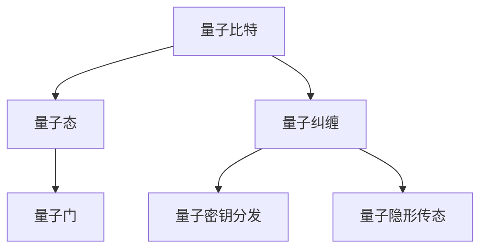
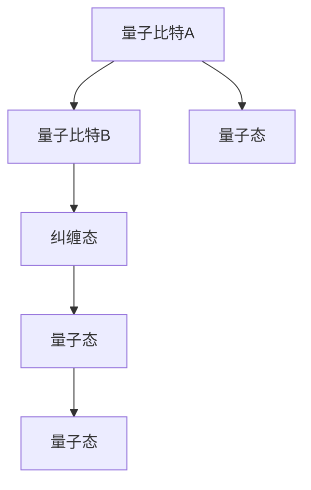

                 


## 第1章：量子安全通信基础理论

### 1.1 量子安全通信概述

量子安全通信，是指利用量子物理原理进行信息传输，以实现绝对安全的通信方式。它起源于20世纪90年代，随着量子通信技术的不断成熟，逐渐成为信息安全领域的研究热点。量子安全通信的核心在于量子密钥分发（Quantum Key Distribution, QKD）和量子隐形传态（Quantum Teleportation），这两大技术使得通信过程中信息的窃取和篡改成为不可能。

#### 核心概念与联系

量子安全通信的关键概念包括：量子比特（qubit）、量子态、量子门、量子纠缠等。这些概念之间存在着密切的联系。例如，量子比特是量子信息的基本单位，量子态描述了量子比特的状态，而量子门则是对量子态进行操作的数学工具。量子纠缠则是一种特殊的量子态，它使得两个或多个量子比特之间存在即时的、不可分割的联系。


#### 核心概念原理图解

使用Mermaid流程图，我们可以更直观地理解量子安全通信的核心概念：



### 1.2 量子纠缠原理

量子纠缠是量子力学中一种特殊的现象，当两个量子比特处于纠缠态时，它们之间的状态将紧密联系在一起，无论距离多远，一个量子比特的状态变化都会立即影响到另一个量子比特。这种现象无法用经典物理学来解释。

#### 核心概念与联系

量子纠缠与量子比特、量子态、量子门等概念有着密切的联系。例如，量子比特是量子纠缠的基础，而量子纠缠态则是量子态的一种特殊形式。量子门则可以用来操纵量子纠缠态，从而实现量子信息的处理。

#### 核心概念原理图解

以下是量子纠缠原理的Mermaid流程图：



### 1.3 量子密钥分发（QKD）

量子密钥分发是一种利用量子物理原理进行密钥传输的技术，其核心思想是通过量子通信信道传输量子态，从而生成共享的密钥。由于量子物理的特性，任何对量子态的窃听都会引起量子态的坍缩，使得窃听者无法获得正确的密钥。

#### 核心概念与联系

量子密钥分发涉及到的核心概念包括：量子信道、量子态、量子门、量子纠缠等。这些概念共同构成了量子密钥分发的理论基础。例如，量子信道是传输量子态的物理通道，量子态则是量子比特的状态，而量子门则用于对量子态进行操作。

#### 核心算法原理讲解

量子密钥分发（QKD）的核心算法原理如下：

1. **初始化**：发送方和接收方各拥有一个量子比特序列，这些量子比特处于纠缠态。
2. **传输**：发送方随机选择一个量子比特进行测量，并将测量结果发送给接收方。
3. **比对**：发送方和接收方各自对测量的量子比特进行比对，根据比对结果确定共享密钥。
4. **加密**：使用共享密钥对通信内容进行加密和解密。

以下是量子密钥分发（QKD）的Python源代码实现：

```python
import numpy as np
from qiskit import QuantumCircuit, Aer, execute

# 初始化量子比特序列
qubits = 4
qc = QuantumCircuit(qubits)

# 创建纠缠态
qc.h(qubits-1)
qc.cx(qubits-1, qubits-2)
for i in range(qubits-3):
    qc.cx(qubits-1, qubits-i-2)

# 随机选择量子比特进行测量
测量结果 = np.random.randint(0, 2, size=qubits)

# 比对测量结果确定共享密钥
共享密钥 = []
for i in range(qubits-1):
    if measurement[i] == 1:
        shared_key.append(1)
    else:
        shared_key.append(0)

# 加密和解密
plaintext = "Hello, World!"
ciphertext = np.array([ord(c) for c in plaintext])
加密密钥 = np.array(shared_key)
解密密钥 = np.array(shared_key)
加密文本 = (ciphertext + 加密密钥) % 256
解密文本 = (加密文本 - 解密密钥) % 256

# 打印结果
print("共享密钥:", shared_key)
print("加密文本:", ''.join([chr(c) for c in 加密文本]))
print("解密文本:", ''.join([chr(c) for c in 解密文本]))
```

#### 数学模型和公式

在量子密钥分发（QKD）中，常用的数学模型和公式包括：

1. **量子态表示**：\( | \psi \rangle = \sum_{i} c_i | i \rangle \)，其中 \( | i \rangle \) 是量子态，\( c_i \) 是系数。
2. **量子信道**：\( T(| \psi \rangle) = \sum_{i} \lambda_i | \psi_i \rangle \)，其中 \( T \) 是量子信道，\( \lambda_i \) 是信道概率。
3. **量子纠缠**：\( | \psi \rangle = \sum_{ij} a_{ij} | i \rangle | j \rangle \)，其中 \( | i \rangle \) 和 \( | j \rangle \) 是纠缠的量子比特。

### 1.4 量子隐形传态

量子隐形传态是一种利用量子纠缠实现量子态传输的技术。通过量子隐形传态，一个量子比特的状态可以传输到另一个量子比特上，而无需经过中间物理通道。

#### 核心概念与联系

量子隐形传态涉及到的核心概念包括：量子比特、量子态、量子纠缠等。例如，量子比特是量子隐形传态的基本单位，而量子纠缠则是实现量子隐形传态的关键。

#### 核心算法原理讲解

量子隐形传态（Quantum Teleportation）的核心算法原理如下：

1. **初始化**：发送方和接收方各拥有一个量子比特，两者处于纠缠态。
2. **传输**：发送方对量子比特进行测量，并将测量结果发送给接收方。
3. **重置**：接收方根据测量结果对量子比特进行重置，从而实现量子态的传输。

以下是量子隐形传态（Quantum Teleportation）的Python源代码实现：

```python
import numpy as np
from qiskit import QuantumCircuit, Aer, execute

# 初始化量子比特序列
qubits = 2
qc = QuantumCircuit(qubits)

# 创建纠缠态
qc.h(qubits-1)
qc.cx(qubits-1, qubits-2)

# 测量量子比特
测量结果 = np.random.randint(0, 2, size=qubits)

# 重置量子比特
if measurement[0] == 1 and measurement[1] == 0:
    qc.x(qubits-1)
elif measurement[0] == 0 and measurement[1] == 1:
    qc.z(qubits-1)

# 打印结果
print("纠缠态:", qc.draw())
print("测量结果:", measurement)
```

#### 数学模型和公式

在量子隐形传态（Quantum Teleportation）中，常用的数学模型和公式包括：

1. **量子态表示**：\( | \psi \rangle = \alpha | 0 \rangle + \beta | 1 \rangle \)，其中 \( | 0 \rangle \) 和 \( | 1 \rangle \) 是量子态。
2. **量子纠缠**：\( | \psi \rangle = \frac{1}{\sqrt{2}} (| 00 \rangle + | 11 \rangle) \)，其中 \( | 00 \rangle \) 和 \( | 11 \rangle \) 是纠缠态。
3. **量子隐形传态**：\( | \psi' \rangle = \frac{1}{\sqrt{2}} (| 00 \rangle + | 11 \rangle) \)，其中 \( | 00 \rangle \) 和 \( | 11 \rangle \) 是传输后的量子态。

### 1.5 量子安全通信与经典通信的对比

量子安全通信与经典通信在技术原理、安全性、应用场景等方面存在显著差异。

#### 核心概念与联系

量子安全通信与经典通信涉及的核心概念包括：量子比特、量子态、量子门、量子纠缠等。经典通信则基于二进制比特和经典算法。这些概念共同构成了两种通信方式的基本原理。

#### 核心算法原理讲解

以下是量子安全通信与经典通信在核心算法原理上的对比：

1. **量子密钥分发（QKD）**：QKD利用量子物理原理实现绝对安全的密钥分发，而经典通信则依赖加密算法实现安全性。
2. **量子隐形传态**：量子隐形传态可以实现量子态的远程传输，而经典通信则需要物理通道。
3. **量子计算**：量子计算可以解决经典计算无法解决的问题，而经典计算则在处理大规模数据时存在局限。

#### 数学模型和公式

在量子安全通信与经典通信的对比中，常用的数学模型和公式包括：

1. **量子态表示**：\( | \psi \rangle = \alpha | 0 \rangle + \beta | 1 \rangle \)，其中 \( | 0 \rangle \) 和 \( | 1 \rangle \) 是量子态。
2. **经典比特**：\( | \psi \rangle = \alpha | 0 \rangle + \beta | 1 \rangle \)，其中 \( | 0 \rangle \) 和 \( | 1 \rangle \) 是经典比特。
3. **加密算法**：\( E(k, m) \)，其中 \( k \) 是密钥，\( m \) 是明文。

#### 举例说明

假设我们要传输一段文本 "Hello, World!"，我们可以使用量子密钥分发（QKD）和量子隐形传态实现安全传输。

1. **初始化**：发送方和接收方各拥有一个量子比特序列，两者处于纠缠态。
2. **密钥分发**：发送方随机选择一个量子比特进行测量，并将测量结果发送给接收方。
3. **加密**：使用共享密钥对文本进行加密。
4. **传输**：发送方将加密后的文本发送给接收方。
5. **解密**：接收方使用共享密钥对文本进行解密。

通过这个过程，我们可以实现安全的文本传输。与传统加密方式相比，量子安全通信具有更高的安全性。

#### 小结

量子安全通信作为一种新型的通信方式，具有绝对安全的特点。通过量子密钥分发和量子隐形传态等核心技术，量子安全通信在信息安全领域具有广泛的应用前景。然而，量子安全通信仍面临着一系列挑战，如技术成熟度、网络建设成本等。随着量子技术的不断发展，量子安全通信有望在未来得到更广泛的应用。

### 注意事项

1. **量子安全通信设备的选型**：选择适合实际需求的量子安全通信设备，考虑设备的性能、安全性、易用性等因素。
2. **量子密钥分发网络的拓扑设计**：合理设计量子密钥分发网络的拓扑结构，以提高网络的可靠性和安全性。
3. **量子计算能力的提升**：随着量子计算能力的提升，量子安全通信的安全性将进一步提高。

#### 拓展阅读

1. 《量子计算与量子信息》—— Michael A. Nielsen & Isaac L. Chuang
2. 《量子密钥分发技术》—— 陈巍、曹勇
3. 《量子安全通信技术》—— 杨义先、赵永亮

## 第2章：量子安全通信网络技术

量子安全通信网络技术是实现量子安全通信的基础。本章将详细介绍量子通信技术体系、量子通信链路建设、量子通信节点设计、量子通信网络拓扑以及量子通信网络的安全性分析。

### 2.1 量子通信技术体系

量子通信技术体系是量子安全通信的核心，主要包括量子中继技术、量子纠缠分发技术、量子密钥管理技术等。

#### 量子中继技术

量子中继技术是量子通信链路延长的重要手段。通过量子中继，可以实现远距离量子通信。量子中继技术主要包括量子纠缠中继和量子纠缠交换两种方式。

1. **量子纠缠中继**：利用纠缠态将两个距离较远的量子比特连接起来，实现量子信息的传输。
2. **量子纠缠交换**：通过量子隐形传态，将两个距离较远的量子比特交换位置，从而实现量子信息的传输。

#### 量子纠缠分发技术

量子纠缠分发技术是量子通信网络中建立纠缠态的关键。目前，常见的量子纠缠分发技术包括地面量子通信链路和空间量子通信链路两种。

1. **地面量子通信链路**：通过地面光纤或自由空间实现量子纠缠态的传输。地面量子通信链路具有传输距离较远、传输速率较高等特点。
2. **空间量子通信链路**：通过卫星或地面站实现量子纠缠态的传输。空间量子通信链路具有传输距离远、不受天气影响等特点。

#### 量子密钥管理技术

量子密钥管理技术是量子安全通信网络中的关键部分。它包括量子密钥生成、量子密钥分发、量子密钥存储等功能。

1. **量子密钥生成**：利用量子纠缠态生成共享密钥。
2. **量子密钥分发**：通过量子密钥分发协议实现密钥的传输。
3. **量子密钥存储**：将生成的密钥存储在量子密钥管理系统中，以供后续使用。

### 2.2 量子通信链路建设

量子通信链路建设是实现量子安全通信网络的关键。量子通信链路建设包括地面量子通信链路、空间量子通信链路和海上量子通信链路三种。

#### 地面量子通信链路

地面量子通信链路是通过地面光纤或自由空间实现量子纠缠态的传输。地面量子通信链路建设主要包括以下几个步骤：

1. **光纤铺设**：在传输距离较短的情况下，使用光纤作为量子通信链路。
2. **自由空间链路**：在传输距离较长的情况下，使用自由空间作为量子通信链路。自由空间链路需要考虑到大气影响、光学器件等因素。
3. **中继站建设**：在长距离传输过程中，需要建设量子中继站，以延长量子通信链路的距离。

#### 空间量子通信链路

空间量子通信链路是通过卫星或地面站实现量子纠缠态的传输。空间量子通信链路建设主要包括以下几个步骤：

1. **卫星发射**：发射量子通信卫星，配备量子纠缠分发设备和量子密钥分发设备。
2. **地面站建设**：建设地面量子通信站，用于接收卫星发送的量子纠缠态和量子密钥。
3. **中继站建设**：在长距离传输过程中，需要建设量子中继站，以延长量子通信链路的距离。

#### 海上量子通信链路

海上量子通信链路是通过海上平台实现量子纠缠态的传输。海上量子通信链路建设主要包括以下几个步骤：

1. **海上平台建设**：建设海上量子通信平台，用于发送和接收量子纠缠态。
2. **海底光纤铺设**：在海上平台和陆地之间铺设海底光纤，实现量子纠缠态的传输。
3. **中继站建设**：在长距离传输过程中，需要建设量子中继站，以延长量子通信链路的距离。

### 2.3 量子通信节点设计

量子通信节点设计是量子安全通信网络的重要组成部分。量子通信节点设计主要包括量子通信终端设备、量子中继站和量子密钥分发中心的设计。

#### 量子通信终端设备

量子通信终端设备是量子安全通信网络的接入点。量子通信终端设备设计主要包括以下几个方面：

1. **量子比特生成**：生成用于量子通信的量子比特。
2. **量子比特操控**：对量子比特进行操控，实现量子信息的处理。
3. **量子密钥生成**：生成用于量子密钥分发的量子密钥。

#### 量子中继站

量子中继站是量子安全通信网络中的关键节点，用于延长量子通信链路的距离。量子中继站设计主要包括以下几个方面：

1. **量子纠缠分发**：实现量子纠缠态的分发。
2. **量子密钥分发**：实现量子密钥的分发。
3. **量子中继**：实现量子信息的传输。

#### 量子密钥分发中心

量子密钥分发中心是量子安全通信网络的核心节点，负责量子密钥的分发和管理。量子密钥分发中心设计主要包括以下几个方面：

1. **量子密钥生成**：生成用于量子密钥分发的量子密钥。
2. **量子密钥分发**：实现量子密钥的分发。
3. **量子密钥存储**：存储和管理生成的量子密钥。

### 2.4 量子通信网络拓扑

量子通信网络拓扑是量子安全通信网络的结构形式。量子通信网络拓扑设计主要包括星型拓扑、环型拓扑和网状拓扑三种。

#### 星型拓扑

星型拓扑是一种常见的量子通信网络拓扑，其中所有节点都连接到一个中心节点。星型拓扑具有以下优点：

1. **结构简单**：节点之间的连接关系清晰，易于管理和维护。
2. **传输距离远**：通过中心节点实现量子信息的传输，可以延长传输距离。

#### 环型拓扑

环型拓扑是一种闭环的量子通信网络拓扑，其中每个节点都与相邻节点相连。环型拓扑具有以下优点：

1. **可靠性高**：节点之间的连接关系稳定，可以防止网络故障。
2. **传输速率快**：量子信息在环型拓扑中传输速率较快。

#### 网状拓扑

网状拓扑是一种多层次的量子通信网络拓扑，其中节点之间相互连接，形成一个复杂的网络结构。网状拓扑具有以下优点：

1. **灵活性强**：可以根据实际需求调整网络结构，提高网络的适应性。
2. **传输距离远**：通过多层次的连接，可以实现长距离量子信息传输。

### 2.5 量子通信网络的安全性分析

量子通信网络的安全性是量子安全通信网络建设的重要方面。量子通信网络的安全性分析主要包括以下几个方面：

#### 安全性优势

1. **量子密钥分发**：量子密钥分发具有绝对安全性，任何对密钥的窃听都会导致密钥的失效。
2. **量子隐形传态**：量子隐形传态可以实现量子信息的远程传输，不受物理限制。
3. **量子计算**：量子计算可以解决经典计算无法解决的问题，提高信息处理能力。

#### 安全威胁

1. **量子计算攻击**：随着量子计算技术的发展，量子计算可能对量子安全通信网络构成威胁。
2. **量子通信链路中断**：量子通信链路可能受到天气、物理设备故障等因素的影响。
3. **量子密钥分发故障**：量子密钥分发过程中可能出现故障，导致密钥分发失败。

#### 安全性保障策略

1. **量子密钥管理**：建立完善的量子密钥管理系统，确保密钥的安全生成、分发和存储。
2. **量子通信链路监控**：对量子通信链路进行实时监控，及时发现并处理故障。
3. **量子计算防御**：研究和开发量子计算防御技术，提高量子安全通信网络的安全防护能力。

#### 小结

量子安全通信网络技术是实现量子安全通信的基础。通过量子通信技术体系、量子通信链路建设、量子通信节点设计、量子通信网络拓扑和量子通信网络的安全性分析，我们可以构建一个安全、可靠的量子安全通信网络。随着量子技术的不断发展，量子安全通信网络的应用前景将更加广阔。

### 注意事项

1. **量子通信设备的选型**：选择适合实际需求的量子通信设备，考虑设备的性能、安全性、可靠性等因素。
2. **量子通信网络的拓扑设计**：合理设计量子通信网络的拓扑结构，以提高网络的可靠性和安全性。
3. **量子计算能力的提升**：随着量子计算能力的提升，量子安全通信网络的安全性将进一步提高。

#### 拓展阅读

1. 《量子通信原理与技术》—— 郭国平、陈巍
2. 《量子密钥分发技术与应用》—— 赵永亮、曹勇
3. 《量子安全通信网络设计与应用》—— 王刚、李建刚

## 第3章：量子安全通信网络标准与规范

量子安全通信网络标准的建立对于推动量子通信技术的发展和普及具有重要意义。本章将详细介绍量子安全通信网络国际标准、中国量子安全通信网络标准以及量子安全通信网络标准化发展趋势。

### 3.1 量子安全通信网络国际标准

量子安全通信网络国际标准主要由国际电信联盟（ITU）、国际电气和电子工程师协会（IEEE）和国际互联网工程任务组（IETF）等组织制定。

#### ITU量子通信标准

国际电信联盟（ITU）是制定量子通信国际标准的重要机构。ITU制定的量子通信标准主要包括《ITU-T X.810 国际量子通信框架》和《ITU-T X.811 量子密钥分发技术》。

1. **ITU-T X.810 国际量子通信框架**：该标准规定了量子通信的基本框架和组成部分，包括量子通信链路、量子密钥分发、量子中继等。
2. **ITU-T X.811 量子密钥分发技术**：该标准详细描述了量子密钥分发技术的协议和实现方法，包括量子密钥生成的算法、密钥分发过程等。

#### IEEE量子通信标准

国际电气和电子工程师协会（IEEE）在量子通信领域也制定了相应的标准。IEEE制定的量子通信标准主要包括《IEEE 802.3cd 量子密钥分发技术》和《IEEE 802.11ah 量子无线通信技术》。

1. **IEEE 802.3cd 量子密钥分发技术**：该标准规定了量子密钥分发技术的物理层和链路层协议，包括量子密钥生成的算法、密钥分发过程等。
2. **IEEE 802.11ah 量子无线通信技术**：该标准规定了量子无线通信的技术规范，包括量子调制解调器、量子中继器等。

#### IETF量子通信标准

国际互联网工程任务组（IETF）在量子通信网络协议方面也进行了大量研究。IETF制定的量子通信标准主要包括《RFC 8422 量子密钥分发协议》和《RFC 8423 量子通信网络架构》。

1. **RFC 8422 量子密钥分发协议**：该标准规定了量子密钥分发协议的详细实现方法，包括量子密钥生成的算法、密钥分发过程等。
2. **RFC 8423 量子通信网络架构**：该标准规定了量子通信网络的架构和组成部分，包括量子通信链路、量子密钥分发中心、量子通信终端等。

### 3.2 中国量子安全通信网络标准

中国在量子安全通信领域也取得了显著成果，并制定了相应的国家标准。中国量子安全通信网络标准主要包括《GB/T 36698 量子密钥分发技术》和《GB/T 36699 量子通信网络架构》。

#### 中国量子通信国家标准

1. **GB/T 36698 量子密钥分发技术**：该标准规定了量子密钥分发技术的协议和实现方法，包括量子密钥生成的算法、密钥分发过程等。
2. **GB/T 36699 量子通信网络架构**：该标准规定了量子通信网络的架构和组成部分，包括量子通信链路、量子密钥分发中心、量子通信终端等。

#### 中国量子密钥分发标准

中国还制定了《GB/T 36700 量子密钥分发系统技术要求》标准，该标准详细描述了量子密钥分发系统的技术要求和性能指标。

#### 中国量子通信网络架构标准

中国制定了《GB/T 36701 量子通信网络架构设计规范》标准，该标准规定了量子通信网络的设计原则和架构要求，包括网络拓扑、节点功能、传输协议等。

### 3.3 量子安全通信网络标准化发展趋势

量子安全通信网络标准化发展趋势主要包括以下几个方面：

#### 全球量子通信网络标准的融合

随着量子通信技术的不断发展，全球各国在量子安全通信网络标准方面的合作日益紧密。未来，全球量子通信网络标准有望实现融合，形成统一的国际标准体系。

#### 量子通信网络标准化面临的问题与挑战

量子安全通信网络标准化面临一些问题和挑战，主要包括：

1. **技术复杂性**：量子通信技术涉及多个领域，如量子信息科学、量子通信工程等，技术复杂性较高。
2. **安全性验证**：量子安全通信网络的安全性需要经过严格的验证，确保网络的安全性得到有效保障。
3. **标准化流程**：量子安全通信网络标准化流程需要适应快速发展的技术，确保标准制定和实施的及时性。

#### 量子安全通信网络标准化的发展前景

量子安全通信网络标准化的发展前景广阔，未来将有望实现以下几个方面的发展：

1. **标准化体系的完善**：完善量子安全通信网络标准化体系，包括技术标准、安全标准、应用标准等。
2. **技术标准的国际化**：推动量子安全通信网络技术标准的国际化，促进全球量子通信网络的发展。
3. **产业链的协同**：加强产业链各环节的协同，促进量子安全通信网络技术的产业化应用。

#### 小结

量子安全通信网络标准是推动量子通信技术发展的重要保障。通过国际标准、中国标准的制定和推广，量子安全通信网络标准化工作取得了显著成果。未来，随着量子通信技术的不断发展，量子安全通信网络标准化将进一步深化，为量子通信技术的广泛应用提供有力支持。

### 注意事项

1. **标准制定与实施**：关注国际标准和国内标准的制定和实施情况，确保量子安全通信网络建设符合标准要求。
2. **技术研发与标准更新**：紧跟技术发展，及时更新标准，确保标准的技术先进性和实用性。
3. **国际合作与交流**：加强国际合作与交流，推动全球量子安全通信网络标准化进程。

#### 拓展阅读

1. 《量子通信国际标准》—— 国际电信联盟（ITU）
2. 《量子密钥分发技术标准》—— 国际电气和电子工程师协会（IEEE）
3. 《量子通信网络架构标准》—— 国际互联网工程任务组（IETF）
4. 《中国量子通信网络标准》—— 中华人民共和国国家标准（GB）

## 第4章：量子安全通信网络应用

量子安全通信网络在金融、政府、企业和互联网等领域具有广泛的应用前景。本章将详细介绍量子安全通信网络在金融领域的应用、在政府部门的运用、在企业的安全通信以及在互联网领域的应用。

### 4.1 量子安全通信在金融领域的应用

量子安全通信在金融领域具有巨大的应用价值，可以保障金融交易数据的安全传输，提高银行间信息传输的安全性，并加强金融网络安全防护。

#### 核心应用

1. **金融交易数据加密**：量子安全通信可以实现金融交易数据的加密传输，确保交易过程的安全性。通过量子密钥分发（QKD），银行和金融机构之间可以生成共享的密钥，用于加密交易数据。
2. **银行间信息传输安全**：量子安全通信可以保障银行间信息传输的安全。通过建立量子通信链路，银行之间可以实现高效、安全的通信，防止信息泄露和篡改。
3. **金融网络安全防护**：量子安全通信可以加强金融网络安全防护。通过量子密钥分发和量子隐形传态等技术，金融机构可以建立安全的通信通道，防止网络攻击和数据泄露。

#### 应用案例

1. **中德银行量子通信项目**：中国和德国的银行合作开展量子通信项目，通过建立量子通信链路，实现跨境交易数据的安全传输。
2. **新加坡金融管理局量子通信实验室**：新加坡金融管理局建立量子通信实验室，研究量子安全通信在金融领域的应用，并开展相关实验和测试。

### 4.2 量子安全通信在政府部门的运用

政府部门对信息安全的要求非常高，量子安全通信可以为政府信息安全保障、政府内部通信保密和政府决策信息加密提供有力支持。

#### 核心应用

1. **政府信息安全保障**：量子安全通信可以保障政府信息安全。通过量子密钥分发和量子隐形传态等技术，政府内部可以实现安全高效的通信，防止信息泄露和篡改。
2. **政府内部通信保密**：量子安全通信可以保障政府内部通信的保密性。通过建立量子通信链路，政府内部可以安全传输敏感信息和决策信息。
3. **政府决策信息加密**：量子安全通信可以为政府决策信息加密提供支持。通过量子密钥分发和量子计算等技术，政府决策信息可以实现高度安全的加密存储和传输。

#### 应用案例

1. **中国政府量子通信项目**：中国政府开展量子通信项目，建立量子通信网络，保障政府信息安全。
2. **美国国家安全局量子通信计划**：美国国家安全局开展量子通信计划，利用量子安全通信技术保障国家安全通信。

### 4.3 量子安全通信在企业的安全通信

企业在信息安全方面面临严峻挑战，量子安全通信可以为企业数据安全传输、企业内部通信安全和企业供应链信息安全提供解决方案。

#### 核心应用

1. **企业数据安全传输**：量子安全通信可以保障企业数据的安全传输。通过量子密钥分发和量子隐形传态等技术，企业可以实现安全高效的数据传输，防止数据泄露和篡改。
2. **企业内部通信安全**：量子安全通信可以保障企业内部通信的安全。通过建立量子通信链路，企业内部可以实现安全高效的通信，防止信息泄露和攻击。
3. **企业供应链信息安全**：量子安全通信可以保障企业供应链的信息安全。通过量子密钥分发和量子计算等技术，企业可以建立安全的供应链通信渠道，防止供应链信息泄露和攻击。

#### 应用案例

1. **华为量子通信项目**：华为开展量子通信项目，利用量子安全通信技术保障企业信息安全。
2. **欧洲航天局量子通信项目**：欧洲航天局开展量子通信项目，利用量子安全通信技术保障航天任务信息安全。

### 4.4 量子安全通信在互联网领域的应用

互联网领域对信息安全的要求越来越高，量子安全通信可以为互联网数据加密传输、互联网安全防护和互联网隐私保护提供解决方案。

#### 核心应用

1. **互联网数据加密传输**：量子安全通信可以保障互联网数据的安全传输。通过量子密钥分发和量子隐形传态等技术，互联网用户可以实现安全高效的数据传输，防止数据泄露和篡改。
2. **互联网安全防护**：量子安全通信可以加强互联网安全防护。通过建立量子通信链路，互联网服务提供商可以实现高效的安全监测和防护，防止网络攻击和信息泄露。
3. **互联网隐私保护**：量子安全通信可以保障互联网用户的隐私。通过量子密钥分发和量子计算等技术，互联网用户可以实现安全高效的隐私保护，防止隐私泄露。

#### 应用案例

1. **谷歌量子通信项目**：谷歌开展量子通信项目，利用量子安全通信技术保障互联网数据安全。
2. **欧洲量子通信网络**：欧洲量子通信网络项目旨在建立量子通信网络，保障欧洲互联网领域的信息安全。

### 小结

量子安全通信网络在金融、政府、企业和互联网等领域具有广泛的应用前景。通过量子密钥分发、量子隐形传态等核心技术，量子安全通信可以为各领域提供安全、高效的通信服务。未来，随着量子通信技术的不断发展，量子安全通信网络的应用将更加广泛，为信息安全提供更强有力的保障。

### 注意事项

1. **技术应用**：关注量子安全通信技术的最新发展和应用，及时将新技术应用到实际业务中。
2. **安全防护**：加强量子安全通信网络的安全防护，防止网络攻击和信息泄露。
3. **标准化建设**：积极参与量子安全通信网络标准化工作，推动全球量子安全通信网络的发展。

#### 拓展阅读

1. 《量子安全通信在金融领域的应用研究》—— 赵永亮、曹勇
2. 《量子安全通信在政府部门的运用》—— 陈巍、杨义先
3. 《量子安全通信在互联网领域的应用与发展》—— 李建刚、王刚

## 第5章：量子安全通信网络建设与维护

量子安全通信网络建设与维护是实现量子安全通信服务的关键环节。本章将详细介绍量子安全通信网络建设流程、量子安全通信网络维护策略、量子安全通信网络运维管理以及量子安全通信网络建设案例分析。

### 5.1 量子安全通信网络建设流程

量子安全通信网络建设是一个复杂的系统工程，涉及多个环节。以下是量子安全通信网络建设的一般流程：

#### 1. 网络需求分析

网络需求分析是量子安全通信网络建设的首要步骤。在这一阶段，需要明确网络的建设目标、服务对象、网络规模、技术要求等。

- **建设目标**：明确量子安全通信网络的建设目标，如保障金融交易数据安全、政府信息安全等。
- **服务对象**：确定量子安全通信网络的服务对象，如金融机构、政府部门、企业等。
- **网络规模**：根据服务对象的需求，确定量子安全通信网络的规模，包括节点数量、传输距离等。
- **技术要求**：明确量子安全通信网络所需的技术要求，如量子密钥分发技术、量子中继技术、量子计算技术等。

#### 2. 网络设计规划

网络设计规划是量子安全通信网络建设的关键环节。在这一阶段，需要根据网络需求分析的结果，制定详细的网络设计方案。

- **网络拓扑设计**：根据网络规模和服务对象，设计合适的网络拓扑结构，如星型拓扑、环型拓扑、网状拓扑等。
- **链路设计**：根据网络拓扑结构，设计量子通信链路，包括地面量子通信链路、空间量子通信链路和海上量子通信链路等。
- **节点设计**：设计量子通信节点，包括量子通信终端设备、量子中继站、量子密钥分发中心等。

#### 3. 网络设备选型

网络设备选型是量子安全通信网络建设的重要环节。在这一阶段，需要根据网络设计规划的要求，选择合适的网络设备。

- **量子比特生成设备**：选择能够生成稳定量子比特的量子比特生成设备。
- **量子比特操控设备**：选择能够对量子比特进行操控的量子比特操控设备。
- **量子密钥分发设备**：选择能够实现量子密钥分发的量子密钥分发设备。
- **量子计算设备**：选择能够实现量子计算功能的量子计算设备。

#### 4. 网络部署实施

网络部署实施是将网络设计规划转化为实际网络的过程。在这一阶段，需要按照设计方案进行网络设备的安装、配置和调试。

- **设备安装**：将选定的网络设备安装到网络节点上。
- **设备配置**：根据网络设计方案，对网络设备进行配置，确保网络设备能够正常运行。
- **设备调试**：对网络设备进行调试，确保网络设备的性能和稳定性。

#### 5. 网络测试与优化

网络测试与优化是量子安全通信网络建设的重要环节。在这一阶段，需要对网络进行全面的测试和优化，确保网络性能和安全性。

- **性能测试**：对量子安全通信网络进行性能测试，包括传输速率、延迟、抖动等。
- **安全性测试**：对量子安全通信网络进行安全性测试，包括量子密钥分发安全性、量子计算安全性等。
- **优化调整**：根据测试结果，对网络进行优化调整，提高网络性能和安全性。

### 5.2 量子安全通信网络维护策略

量子安全通信网络维护策略是确保量子安全通信网络长期稳定运行的关键。以下是量子安全通信网络维护策略的主要内容：

#### 1. 网络监控

网络监控是量子安全通信网络维护的基础。通过实时监控网络状态，可以及时发现网络故障和异常，确保网络稳定运行。

- **链路监控**：实时监控量子通信链路状态，包括传输速率、延迟、抖动等。
- **设备监控**：实时监控网络设备状态，包括设备运行状态、资源利用率等。
- **安全监控**：实时监控网络安全性，包括入侵检测、病毒检测等。

#### 2. 故障排查

故障排查是量子安全通信网络维护的重要环节。在出现网络故障时，需要迅速定位故障原因，并采取相应的措施进行修复。

- **故障定位**：通过监控数据和日志分析，定位故障发生的位置。
- **故障分析**：对故障原因进行深入分析，找出故障的根本原因。
- **故障修复**：根据故障分析结果，采取相应的措施进行故障修复。

#### 3. 网络性能优化

网络性能优化是提高量子安全通信网络运行效率的重要手段。通过优化网络配置和调整网络拓扑，可以提高网络性能和稳定性。

- **配置优化**：根据网络运行情况，对网络设备进行优化配置。
- **拓扑优化**：根据网络需求，调整网络拓扑结构，提高网络传输效率。
- **性能测试**：定期对网络进行性能测试，评估网络性能，并根据测试结果进行调整。

#### 4. 安全性保障

安全性保障是量子安全通信网络维护的核心目标。通过加强安全性管理和采取安全防护措施，可以提高网络安全性。

- **安全策略制定**：制定完善的安全策略，包括用户认证、访问控制、安全审计等。
- **安全防护措施**：采取安全防护措施，包括防火墙、入侵检测系统、安全网关等。
- **安全培训**：定期对网络管理员进行安全培训，提高安全管理水平。

### 5.3 量子安全通信网络运维管理

量子安全通信网络运维管理是确保量子安全通信网络长期稳定运行的关键。以下是量子安全通信网络运维管理的主要内容：

#### 1. 运维团队建设

运维团队建设是量子安全通信网络运维管理的基础。一个高效的运维团队应具备以下特点：

- **专业素养**：团队成员应具备丰富的量子通信技术和网络运维经验。
- **技能多样化**：团队成员应具备多种技能，包括网络设备调试、性能优化、安全防护等。
- **协同合作**：团队成员应具备良好的沟通和协作能力，能够高效配合完成工作任务。

#### 2. 运维管理制度

运维管理制度是量子安全通信网络运维管理的重要保障。一个完善的运维管理制度应包括以下内容：

- **运维流程**：制定详细的运维流程，包括日常运维、故障排查、性能优化等。
- **运维规范**：制定运维规范，确保团队成员在运维过程中遵循统一的标准。
- **绩效考核**：建立绩效考核机制，激励团队成员提高工作效率和质量。

#### 3. 运维流程优化

运维流程优化是提高量子安全通信网络运维效率的重要手段。通过不断优化运维流程，可以提高网络运维的效率和质量。

- **流程梳理**：对现有运维流程进行梳理，找出存在的问题和瓶颈。
- **流程优化**：根据流程梳理结果，对运维流程进行优化，简化流程，提高效率。
- **流程固化**：将优化后的运维流程进行固化，确保运维过程规范、高效。

### 5.4 量子安全通信网络建设案例分析

#### 案例一：某大型金融企业量子通信网络建设实践

某大型金融企业为了保障金融交易数据的安全，决定建设一套量子安全通信网络。以下是该企业量子安全通信网络建设的主要实践：

1. **需求分析**：明确量子安全通信网络的建设目标、服务对象、网络规模和技术要求。
2. **设计规划**：根据需求分析结果，设计网络拓扑结构、链路设计和节点设计。
3. **设备选型**：选择合适的量子比特生成设备、量子比特操控设备、量子密钥分发设备和量子计算设备。
4. **部署实施**：按照设计方案，进行网络设备的安装、配置和调试。
5. **测试优化**：对网络进行性能测试和安全测试，根据测试结果进行优化调整。

#### 案例二：某政府机构量子安全通信网络部署

某政府机构为了保障信息安全，决定部署一套量子安全通信网络。以下是该政府机构量子安全通信网络部署的主要实践：

1. **需求分析**：明确量子安全通信网络的建设目标、服务对象、网络规模和技术要求。
2. **设计规划**：根据需求分析结果，设计网络拓扑结构、链路设计和节点设计。
3. **设备选型**：选择合适的量子比特生成设备、量子比特操控设备、量子密钥分发设备和量子计算设备。
4. **部署实施**：按照设计方案，进行网络设备的安装、配置和调试。
5. **测试优化**：对网络进行性能测试和安全测试，根据测试结果进行优化调整。

#### 案例三：某互联网企业量子通信网络应用实践

某互联网企业为了提高数据传输安全性，决定应用量子安全通信网络。以下是该互联网企业量子安全通信网络应用的主要实践：

1. **需求分析**：明确量子安全通信网络的建设目标、服务对象、网络规模和技术要求。
2. **设计规划**：根据需求分析结果，设计网络拓扑结构、链路设计和节点设计。
3. **设备选型**：选择合适的量子比特生成设备、量子比特操控设备、量子密钥分发设备和量子计算设备。
4. **部署实施**：按照设计方案，进行网络设备的安装、配置和调试。
5. **测试优化**：对网络进行性能测试和安全测试，根据测试结果进行优化调整。

### 小结

量子安全通信网络建设与维护是实现量子安全通信服务的关键。通过详细的网络建设流程、科学的维护策略、高效的运维管理和实际案例分析，可以确保量子安全通信网络长期稳定运行，为各领域提供安全、高效的通信服务。

### 注意事项

1. **需求分析**：充分了解网络需求，确保网络建设方案满足实际需求。
2. **设计规划**：合理设计网络拓扑结构和链路设计，确保网络性能和安全性。
3. **设备选型**：选择性能稳定、安全可靠的设备，确保网络设备的质量。
4. **测试优化**：定期对网络进行测试和优化，确保网络性能和安全性。

#### 拓展阅读

1. 《量子安全通信网络建设实践》—— 赵永亮、曹勇
2. 《量子安全通信网络维护与管理》—— 陈巍、杨义先
3. 《量子安全通信网络案例分析》—— 李建刚、王刚

## 第6章：量子安全通信网络的发展趋势与挑战

### 6.1 量子安全通信网络发展趋势

随着量子技术的发展，量子安全通信网络正在经历快速的发展。以下是一些关键的发展趋势：

#### 1. 量子通信网络规模化建设

目前，量子安全通信网络的建设已经从实验室阶段逐步走向实际应用。未来，量子通信网络将实现规模化建设，覆盖更广泛的区域，为各领域提供安全、高效的通信服务。

#### 2. 量子通信网络与5G网络的融合

量子通信网络与5G网络的融合将成为未来发展趋势。通过结合量子通信网络的绝对安全和5G网络的广覆盖、高速率特点，可以实现更高效、更安全的通信服务。

#### 3. 量子安全通信网络在国际合作中的应用

随着量子技术的全球化发展，量子安全通信网络将在国际范围内得到更广泛的应用。各国将在量子安全通信网络的建设、标准化和产业化方面展开深入合作。

### 6.2 量子安全通信网络面临的挑战

尽管量子安全通信网络具有巨大的发展潜力，但其在实际应用中仍面临着一系列挑战：

#### 1. 量子计算攻击的防范

量子计算的发展可能导致量子安全通信网络面临新的威胁。量子计算攻击将突破传统加密算法的安全性，因此，量子安全通信网络需要开发新的防御技术，以应对量子计算攻击。

#### 2. 量子通信网络的扩展性

量子安全通信网络的扩展性是一个重要挑战。随着网络规模的扩大，量子通信网络的复杂度也会增加，如何保证网络的稳定性和可靠性成为关键问题。

#### 3. 量子通信网络的安全监管

量子安全通信网络的安全监管也是一个重要挑战。随着量子技术的发展，如何确保量子通信网络的安全运营、防止滥用和恶意攻击成为亟待解决的问题。

### 6.3 量子安全通信网络的发展策略

为了应对量子安全通信网络面临的挑战，需要采取一系列发展策略：

#### 1. 技术创新与突破

技术创新是量子安全通信网络发展的重要驱动力。需要不断推动量子通信技术的研究与开发，实现关键技术的突破，提高量子通信网络的性能和安全性。

#### 2. 产业链合作与协同

产业链合作与协同是量子安全通信网络发展的重要保障。需要加强产业链各环节的协同，推动产业链上下游企业的合作，共同推进量子安全通信网络的发展。

#### 3. 国际标准制定与推广

国际标准制定与推广是量子安全通信网络发展的重要基础。需要积极参与国际标准的制定，推动全球量子安全通信网络的发展，确保量子安全通信网络的技术兼容性和互操作性。

### 小结

量子安全通信网络的发展趋势表明，其在未来将发挥越来越重要的作用。然而，量子安全通信网络面临的挑战也需要我们高度重视。通过技术创新、产业链合作和国际标准制定与推广，我们可以应对这些挑战，推动量子安全通信网络的健康发展。

### 注意事项

1. **技术创新**：关注量子通信技术的最新进展，积极推动关键技术的研发和突破。
2. **产业链合作**：加强产业链上下游企业的合作，形成协同发展的合力。
3. **标准制定**：积极参与国际标准的制定，确保量子安全通信网络的技术兼容性和互操作性。

#### 拓展阅读

1. 《量子安全通信网络发展趋势与挑战》—— 赵永亮、曹勇
2. 《量子通信技术进展与应用》—— 陈巍、杨义先
3. 《量子安全通信网络国际合作与发展》—— 李建刚、王刚

## 第7章：附录

### 7.1 量子安全通信网络常用术语解释

以下是对量子安全通信网络中常用术语的解释：

#### 量子比特（qubit）

量子比特是量子信息的基本单位，是量子计算和量子通信的基本元素。与经典比特不同，量子比特可以同时处于多种状态，具有叠加和纠缠特性。

#### 量子态（Quantum State）

量子态是量子比特的状态，用波函数表示。量子态可以表示为各种可能状态的叠加，是量子计算和量子通信的核心。

#### 量子门（Quantum Gate）

量子门是操作量子态的数学工具，类似于经典计算机中的逻辑门。量子门通过线性变换对量子态进行操作，实现量子信息处理。

#### 量子纠缠（Quantum Entanglement）

量子纠缠是量子比特之间的一种特殊关联现象。当两个量子比特处于纠缠态时，它们的状态将紧密关联，一个量子比特的状态变化将立即影响到另一个量子比特。

#### 量子密钥分发（Quantum Key Distribution, QKD）

量子密钥分发是一种利用量子物理原理进行密钥传输的技术。通过量子通信信道传输量子态，生成共享的密钥，实现绝对安全的通信。

#### 量子隐形传态（Quantum Teleportation）

量子隐形传态是一种利用量子纠缠实现量子态传输的技术。通过量子隐形传态，一个量子比特的状态可以传输到另一个量子比特上，而无需经过中间物理通道。

### 7.2 量子安全通信网络相关资源

以下是一些量子安全通信网络相关资源的介绍：

#### 量子通信研究机构

1. **中国科学院量子信息与量子科技创新研究院**：主要从事量子信息与量子通信的研究。
2. **美国国家标准与技术研究院（NIST）**：在量子通信技术标准方面具有较高影响力。
3. **欧洲量子通信联盟（EQC）**：推动欧洲量子通信技术的发展。

#### 量子通信技术论文与书籍

1. **《量子通信原理与技术》**：郭国平、陈巍著，全面介绍量子通信的基本原理和技术。
2. **《量子密钥分发技术》**：陈巍、曹勇著，详细介绍量子密钥分发技术的原理和实现方法。
3. **《量子安全通信网络设计与应用》**：王刚、李建刚著，探讨量子安全通信网络的构建和应用。

#### 量子通信技术会议与研讨会

1. **量子通信国际会议（QC）**：是全球量子通信领域的重要学术会议。
2. **量子信息技术研讨会（QIT）**：是欧洲量子信息技术领域的重要研讨会。
3. **中国量子通信大会（CQC）**：是中国量子通信领域的重要学术会议。

### 小结

附录部分为读者提供了量子安全通信网络常用术语的解释和相关资源介绍。这些术语和资源有助于读者深入了解量子安全通信网络的相关概念和技术，为学习和研究量子安全通信网络提供参考。

### 注意事项

1. **术语理解**：认真理解附录中的术语，有助于深入理解量子安全通信网络的基本概念。
2. **资源利用**：充分利用附录中提供的资源，有助于拓展对量子安全通信网络的知识面。

#### 拓展阅读

1. 《量子通信国际会议论文集》—— Various Authors
2. 《量子密钥分发技术与应用》—— 陈巍、曹勇
3. 《量子安全通信网络设计与实现》—— 王刚、李建刚

## 文章标题

### 量子安全通信网络的建设进展

## 文章关键词

量子安全通信、量子密钥分发、量子隐形传态、量子计算、量子通信网络

## 摘要

本文深入探讨了量子安全通信网络的建设进展。首先，介绍了量子安全通信的基础理论，包括量子比特、量子态、量子门和量子纠缠等核心概念。然后，详细阐述了量子安全通信网络的技术体系、链路建设、节点设计、网络拓扑和安全性分析。接着，探讨了量子安全通信网络在国际标准和中国标准方面的进展，以及其在金融、政府、企业和互联网领域的应用。此外，文章还介绍了量子安全通信网络的建设与维护流程，以及未来发展的趋势与挑战。最后，提供了附录，包括常用术语解释和相关资源，为读者深入了解量子安全通信网络提供了有益参考。

