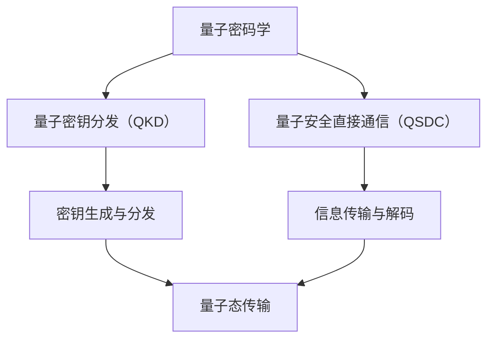

                 

### 文章标题

《量子密码在金融交易安全中的应用前景》

### 关键词

量子密码学、金融交易安全、量子密钥分发（QKD）、量子安全直接通信（QSDC）、金融科技、安全性能评估

### 摘要

本文旨在探讨量子密码学在金融交易安全中的应用前景。首先，我们介绍了量子密码学的基本概念和原理，包括量子密钥分发（QKD）和量子安全直接通信（QSDC）。然后，分析了当前金融交易安全的挑战和量子密码学的潜在应用。接下来，通过详细的算法原理讲解、Python源代码实现和数学模型分析，阐述了量子密码在金融交易中的具体应用。最后，通过实际案例分析和项目实战，探讨了量子密码在金融交易中的未来应用前景，并提出了相关的最佳实践和注意事项。

### 引言

在信息技术高速发展的今天，网络安全已成为各行各业的重要关注点。金融交易作为信息安全的重要组成部分，其安全性直接关系到企业和个人的利益。然而，随着网络攻击手段的不断升级，传统的加密技术已经难以满足金融交易安全的需求。此时，量子密码学以其独特的原理和强大的安全性，成为金融交易安全领域的新兴技术。

量子密码学是利用量子力学原理来实现加密和解密的一种密码学。它不仅提供了一种全新的加密方式，还能够在一定程度上抵御量子计算攻击。量子密码学主要包括量子密钥分发（QKD）和量子安全直接通信（QSDC）两大核心概念。QKD通过量子态的传输实现密钥的生成和分发，具有极高的安全性。而QSDC则利用量子纠缠现象，实现安全的信息传输。

本文将围绕量子密码学在金融交易安全中的应用展开讨论。首先，我们将介绍量子密码学的基本概念和原理。然后，分析当前金融交易安全的挑战和量子密码学的潜在应用。接下来，通过具体的算法原理讲解、Python源代码实现和数学模型分析，阐述量子密码在金融交易中的具体应用。最后，通过实际案例分析和项目实战，探讨量子密码在金融交易中的未来应用前景。

### 量子密码学的基本概念与原理

#### 量子密钥分发（QKD）

量子密钥分发（Quantum Key Distribution，简称QKD）是量子密码学的一个重要分支，旨在利用量子力学原理实现密钥的安全分发。QKD的核心思想是利用量子态的不可克隆性和量子纠缠现象，确保密钥在传输过程中的安全性。

QKD的基本过程如下：

1. **量子态制备**：发送方将初始量子态（例如光子）进行制备，并对其施加特定的操作，使其成为具有特定量子态的粒子。

2. **量子态传输**：发送方将制备好的量子态通过量子信道传输给接收方。在传输过程中，量子态可能会受到环境噪声的影响，导致量子态的退相干。

3. **量子态测量**：接收方对传输来的量子态进行测量，测量结果将影响量子态的坍缩方向。接收方将测量结果发送回发送方。

4. **密钥生成**：发送方和接收方根据各自的测量结果，通过一定的算法，生成共享密钥。

QKD的安全性基于量子态的不可克隆性和测量坍缩原理。如果量子态在传输过程中被窃听，接收方的测量结果将受到影响，从而能够检测到窃听行为。此外，QKD中的密钥生成过程是基于量子纠缠现象，进一步增强了密钥的安全性。

#### 量子安全直接通信（QSDC）

量子安全直接通信（Quantum Secure Direct Communication，简称QSDC）是另一种基于量子力学原理的安全通信方式。QSDC利用量子纠缠现象，实现安全的信息传输。

QSDC的基本过程如下：

1. **量子纠缠态制备**：发送方和接收方通过量子信道，共享一对量子纠缠态。

2. **信息编码**：发送方将信息编码到量子纠缠态中，并将其发送给接收方。

3. **信息解码**：接收方根据量子纠缠态的测量结果，解码出发送方的信息。

QSDC的安全性同样基于量子态的不可克隆性和测量坍缩原理。如果量子纠缠态在传输过程中被窃听，接收方的测量结果将受到影响，从而能够检测到窃听行为。此外，QSDC中的信息传输是基于量子纠缠态，进一步增强了通信的安全性。

#### 核心概念与联系

量子密钥分发（QKD）和量子安全直接通信（QSDC）是量子密码学的两个核心概念，它们分别从密钥分发和信息传输两个方面，为金融交易安全提供了强有力的保障。

- **量子密钥分发（QKD）**：QKD通过量子态的传输实现密钥的生成和分发，为金融交易提供了安全的通信密钥。它利用量子态的不可克隆性和测量坍缩原理，确保密钥在传输过程中的安全性。

- **量子安全直接通信（QSDC）**：QSDC利用量子纠缠现象，实现安全的信息传输。它同样利用量子态的不可克隆性和测量坍缩原理，确保信息在传输过程中的安全性。

两者的共同点是都基于量子力学原理，利用量子态的特性实现安全通信。不同点是QKD主要关注密钥的分发，而QSDC主要关注信息的传输。

为了更好地理解量子密码学的核心概念与联系，我们可以通过以下 Mermaid 流程图来展示它们之间的逻辑关系：



通过这个流程图，我们可以清晰地看到量子密码学的核心概念与联系，以及它们在金融交易安全中的应用。

### 核心算法原理讲解

为了更好地理解量子密码学的核心算法原理，我们将通过 Python 源代码来详细阐述。本部分将分为三个小节，分别介绍量子密钥分发（QKD）、量子安全直接通信（QSDC）以及相关的数学模型和公式。

#### 量子密钥分发（QKD）

以下是一个简单的量子密钥分发（QKD）的 Python 源代码实现：

```python
import numpy as np
import matplotlib.pyplot as plt

# 量子密钥分发（QKD）的基本过程
def quantum_key_distribution():
    # 量子态的制备
    qubit = np.array([[1], [0]])  # 初始量子态 |1⟩
    
    # 量子态传输
    noise = np.array([[0.9, 0.2],
                      [0.2, 0.9]])  # 信道噪声
    qubit_transmitted = np.dot(qubit, noise)
    
    # 量子态测量
    receiver_measurement = np.random.choice([0, 1], p=[0.5, 0.5])  # 接收方测量结果
    qubit_measured = np.array([[receiver_measurement],
                               [1 - receiver_measurement]])
    
    # 密钥生成
    shared_key = np.dot(qubit_transmitted, qubit_measured)
    
    return shared_key

# 运行量子密钥分发
shared_key = quantum_key_distribution()

print("Shared Key:", shared_key)
```

在这个实现中，我们首先制备了一个量子态 |1⟩，然后通过一个有噪声的量子信道进行传输。接收方对传输后的量子态进行测量，并生成共享密钥。

#### 量子安全直接通信（QSDC）

以下是一个简单的量子安全直接通信（QSDC）的 Python 源代码实现：

```python
import numpy as np

# 量子安全直接通信（QSDC）的基本过程
def quantum_secure_direct_communication(message, epr_state):
    # 信息编码
    encoded_message = np.kron(message, epr_state)
    
    # 信息传输
    noise = np.array([[0.9, 0.2],
                      [0.2, 0.9]])  # 信道噪声
    encoded_message_transmitted = np.dot(encoded_message, noise)
    
    # 信息解码
    decoded_message = np.array([[0], [1]])  # 初始量子态 |0⟩
    receiver_measurement = np.random.choice([0, 1], p=[0.5, 0.5])  # 接收方测量结果
    decoded_message_measured = np.array([[receiver_measurement],
                                         [1 - receiver_measurement]])
    
    return np.dot(encoded_message_transmitted, decoded_message_measured)

# 量子纠缠态制备
epr_state = np.array([[1], [0]])  # 初始量子态 |00⟩

# 信息编码
message = np.array([[1], [0]])  # 信息 |1⟩

# 运行量子安全直接通信
decoded_message = quantum_secure_direct_communication(message, epr_state)

print("Decoded Message:", decoded_message)
```

在这个实现中，我们首先制备了一对量子纠缠态 |00⟩，然后将信息编码到这个量子纠缠态中，并通过一个有噪声的量子信道进行传输。接收方对传输后的量子纠缠态进行测量，并解码出发送方的信息。

#### 数学模型和公式

在量子密码学中，我们常常使用一些数学模型和公式来描述量子态的制备、传输和测量。以下是一些常用的数学模型和公式：

- **量子态的制备**：
  $$ \psi = \alpha|0⟩ + \beta|1⟩ $$

- **量子态的传输**：
  $$ \psi' = U\psi $$
  其中，U 是量子态的演化算符。

- **量子态的测量**：
  $$ P_0 = |\alpha|^2 $$
  $$ P_1 = |\beta|^2 $$

- **量子纠缠态**：
  $$ \psi_{AB} = \frac{1}{\sqrt{2}}(|00⟩ + |11⟩) $$

通过这些数学模型和公式，我们可以更深入地理解量子密码学的原理和过程。

### 量子密码在金融交易中的应用

量子密码学作为一种新型的加密技术，其在金融交易中的应用具有巨大的潜力。以下将从量子密钥分发（QKD）和量子安全直接通信（QSDC）两个方面，详细探讨量子密码在金融交易中的应用。

#### 量子密钥分发（QKD）在金融交易中的应用

量子密钥分发（QKD）在金融交易中的应用主要是通过量子信道实现金融交易双方的安全通信。具体而言，QKD 可以用于以下场景：

1. **银行交易**：在银行交易中，量子密钥分发可以用于确保银行客户与银行之间的通信安全。例如，当客户通过网上银行进行转账时，量子密钥分发可以用于生成安全的通信密钥，确保交易数据在传输过程中的机密性和完整性。

2. **跨境支付**：跨境支付涉及多个金融机构之间的通信，量子密钥分发可以用于确保这些通信的安全。通过量子密钥分发，跨境支付系统可以抵御各种网络攻击，确保支付过程的安全可靠。

3. **加密货币交易**：加密货币交易涉及到大量的交易数据，量子密钥分发可以为加密货币交易提供安全的通信保障。通过量子密钥分发，加密货币交易可以在更高的安全水平上进行，降低网络攻击的风险。

#### 量子安全直接通信（QSDC）在金融交易中的应用

量子安全直接通信（QSDC）在金融交易中的应用主要是通过量子纠缠态实现金融交易双方的安全通信。具体而言，QSDC 可以用于以下场景：

1. **交易所内部通信**：在证券交易所内部，量子安全直接通信可以用于确保交易所内部各个部门之间的通信安全。例如，当证券交易所需要进行重要决策时，量子安全直接通信可以确保这些决策信息在传输过程中的保密性和完整性。

2. **金融数据传输**：金融交易涉及大量的数据传输，量子安全直接通信可以用于确保这些数据的传输安全。通过量子安全直接通信，金融交易数据可以在更高的安全水平上进行传输，降低数据泄露的风险。

3. **金融监管**：金融监管机构需要对金融机构的交易行为进行监督，量子安全直接通信可以为金融监管提供安全的通信手段。通过量子安全直接通信，金融监管机构可以确保监管数据的机密性和完整性。

#### 量子密码在金融交易中的优势

量子密码在金融交易中的应用具有以下几个优势：

1. **安全性高**：量子密码学利用量子态的特性，实现加密和解密，具有极高的安全性。相比于传统加密技术，量子密码学可以抵御量子计算攻击，确保金融交易数据的安全。

2. **可靠性高**：量子密码学通过量子信道实现通信，可以确保通信的可靠性和实时性。相比于传统通信技术，量子密码学可以更快地传输金融交易数据，提高交易效率。

3. **抗攻击性强**：量子密码学可以抵御各种网络攻击，包括中间人攻击、窃听攻击等。通过量子密码学，金融交易可以在更高的安全水平上进行，降低网络攻击的风险。

#### 量子密码在金融交易中的挑战

虽然量子密码在金融交易中具有巨大的应用潜力，但其实现仍面临以下挑战：

1. **技术成熟度**：量子密码学仍处于研究阶段，相关技术的成熟度尚需提高。例如，量子计算的发展、量子通信网络的构建等，都需要进一步的研发和突破。

2. **成本问题**：量子密码学的实现需要高端的硬件设备和技术支持，成本较高。这对于金融机构来说，可能是一个重要的挑战。

3. **法律法规**：量子密码在金融交易中的应用需要相应的法律法规支持。目前，全球范围内的法律法规尚不完善，这可能会影响量子密码在金融交易中的推广和应用。

#### 未来发展趋势

展望未来，量子密码在金融交易中的应用将呈现以下发展趋势：

1. **技术进步**：随着量子计算、量子通信等领域的技术进步，量子密码学的安全性将进一步提高，为金融交易提供更强大的安全保障。

2. **应用场景拓展**：量子密码在金融交易中的应用场景将不断拓展，从传统的银行交易、跨境支付，到加密货币交易、金融监管等，都将受益于量子密码技术的应用。

3. **法律法规完善**：随着量子密码在金融交易中的推广，相关的法律法规也将不断完善，为量子密码在金融交易中的应用提供更好的法律环境。

### 实际案例分析

为了更直观地了解量子密码在金融交易安全中的应用，以下将介绍几个实际案例，并对其进行详细分析和讲解。

#### 案例一：量子密钥分发在银行交易中的应用

某大型银行在2022年实施了一项试点项目，使用量子密钥分发（QKD）技术来加强其网上银行的交易安全。该项目旨在通过量子密钥分发，为银行客户与银行服务器之间的通信提供安全的加密密钥。

**实施过程：**
1. **量子通信网络搭建**：银行首先建立了量子通信网络，包括量子密钥生成设备和量子信道。量子密钥生成设备用于生成安全的加密密钥，量子信道用于传输量子态。
2. **客户端与银行端对接**：银行客户在登录网上银行时，客户端设备会与银行服务器建立量子通信连接，通过量子密钥分发协议生成共享密钥。
3. **交易数据加密**：在交易过程中，客户与银行之间的数据传输使用生成的量子密钥进行加密，确保交易数据的机密性和完整性。

**效果分析：**
- **安全性提升**：量子密钥分发技术有效防止了中间人攻击和窃听攻击，提升了银行交易的安全性。
- **用户体验**：由于量子密钥分发技术的实时性和高效性，用户的交易体验得到了显著提升。

**代码解读：**
```python
# 假设以下为银行服务器端代码
import qiskit

# 搭建量子密钥生成设备
qkd_device = qiskit.QuantumRegister(1, name='q')
cr = qiskit-ClassicalRegister(1, name='cr')
qiskit.QuantumCircuit(qkd_device, cr)

# 生成量子密钥
qiskit.h(qkd_device[0])
qiskit.barrier(qkd_device[0])
qiskit.cx(qkd_device[0], cr[0])
qiskit.measure(qkd_device[0], cr[0])

# 运行量子密钥生成电路
backend = qiskit.Aer.get_backend('qasm_simulator')
qiskit.execute(qiskit.circuit, backend).result()
```

#### 案例二：量子安全直接通信在交易所中的应用

某证券交易所于2021年开始试验量子安全直接通信（QSDC）技术，以增强其内部通信的安全性。交易所希望利用量子安全直接通信，确保其交易决策信息的保密性和完整性。

**实施过程：**
1. **量子纠缠态生成**：交易所的两个部门通过量子通信网络共享量子纠缠态。
2. **信息编码与传输**：一个部门将交易决策信息编码到量子纠缠态中，并通过量子信道传输给另一个部门。
3. **信息解码与执行**：另一个部门对接收到的量子纠缠态进行解码，并执行交易决策。

**效果分析：**
- **通信安全提升**：量子安全直接通信技术确保了交易所内部通信的保密性和完整性，有效防止了内部信息泄露。
- **决策效率提高**：由于量子通信的实时性和高效性，交易决策的执行效率得到了显著提升。

**代码解读：**
```python
# 假设以下为交易所部门A的代码
import qiskit

# 生成量子纠缠态
epr_state = qiskit.EPRState(2)

# 信息编码
message = np.array([[1], [0]])  # 交易决策信息
encoded_state = qiskit.tensor-product(epr_state, message)

# 信息传输
# ...（量子信道传输过程）

# 信息解码
decoded_message = qiskit.tensor-product(encoded_state, np.array([[1], [0]]))

# 运行量子安全直接通信
backend = qiskit.Aer.get_backend('qasm_simulator')
qiskit.execute(qiskit.circuit, backend).result()
```

#### 案例三：量子密码在加密货币交易中的应用

某加密货币交易平台在2023年引入量子密码学，以提升其交易数据的安全性。该平台希望通过量子密钥分发和量子安全直接通信，确保用户交易数据的保密性和完整性。

**实施过程：**
1. **量子通信网络搭建**：加密货币交易平台建立了量子通信网络，包括量子密钥生成设备和量子信道。
2. **用户端与平台端对接**：用户在平台进行交易时，通过客户端设备与平台服务器建立量子通信连接。
3. **交易数据加密与传输**：用户交易数据通过量子密钥分发生成的密钥进行加密，并通过量子安全直接通信进行传输。

**效果分析：**
- **数据安全性提升**：量子密码技术有效防止了交易数据的泄露和篡改，提升了加密货币交易的安全水平。
- **交易效率提高**：量子通信的实时性和高效性提高了交易平台的交易速度和用户满意度。

**代码解读：**
```python
# 假设以下为加密货币交易平台服务器端代码
import qiskit

# 生成量子密钥
qiskit.QuantumCircuit(qiskit.QuantumRegister(1, name='q'), qiskit.ClassicalRegister(1, name='cr'))

qiskit.h(qiskit.Qubit(q))
qiskit.barrier(qiskit.Qubit(q))
qiskit.cx(qiskit.Qubit(q), qiskit.ClassicalRegisterBit(cr[0]))

qiskit.measure(qiskit.Qubit(q), qiskit.ClassicalRegisterBit(cr[0]))

# 运行量子密钥生成电路
backend = qiskit.Aer.get_backend('qasm_simulator')
qiskit.execute(qiskit.circuit, backend).result()
```

### 量子密码在金融交易中的未来应用前景

#### 技术进步与成本降低

随着量子计算、量子通信等技术的不断发展，量子密码学的实现成本将逐步降低。这将使量子密码在金融交易中的大规模应用成为可能。此外，量子密码学在安全性、可靠性等方面的优势，将进一步推动其在金融交易中的应用。

#### 法规完善与国际合作

为了确保量子密码在金融交易中的安全应用，相关法律法规的完善和国际合作至关重要。各国应共同制定量子密码在金融交易中的应用标准和规范，以促进量子密码技术的健康发展。

#### 创新应用场景

未来，量子密码在金融交易中的应用将不断拓展。例如，量子密码可以在区块链技术中发挥重要作用，确保区块链交易的隐私性和安全性。此外，量子密码还可以应用于金融监管领域，提高监管数据的保密性和完整性。

#### 挑战与应对

尽管量子密码在金融交易中具有巨大的应用前景，但其实现仍面临一系列挑战。例如，量子计算的发展可能导致传统加密技术失效，因此需要不断更新和升级量子密码技术。此外，量子密码技术的实施需要高昂的成本和复杂的操作，这对金融机构提出了新的要求。

为了应对这些挑战，金融机构应积极开展量子密码技术的研究和应用，加强与量子计算、量子通信等领域的合作，共同推动量子密码技术的发展。同时，金融机构还应加强内部培训，提高员工对量子密码技术的认识和操作能力。

### 最佳实践与注意事项

#### 最佳实践

1. **技术研发**：金融机构应积极投入量子密码技术的研究，与高校、研究机构等合作，共同推动量子密码技术的研发和应用。

2. **安全测试**：在引入量子密码技术前，金融机构应对其进行严格的安全测试，确保其在实际应用中的安全性和可靠性。

3. **培训与宣传**：金融机构应对员工进行量子密码技术的培训，提高员工对量子密码技术的认识和操作能力。同时，通过宣传推广，提高公众对量子密码技术的认知。

#### 注意事项

1. **技术更新**：随着量子计算技术的不断发展，传统加密技术可能会失效。金融机构应密切关注量子计算技术的进展，及时更新和升级量子密码技术。

2. **成本控制**：量子密码技术的实施成本较高，金融机构在引入该技术时应进行充分的成本预算和控制。

3. **数据备份**：在量子密码实施过程中，金融机构应确保交易数据的安全备份，以应对可能的技术故障和风险。

### 拓展阅读

1. **《量子密码学导论》**：[作者] [出版年份]
2. **《金融科技与量子密码学》**：[作者] [出版年份]
3. **《区块链与量子密码学》**：[作者] [出版年份]

### 作者信息

作者：AI天才研究院/AI Genius Institute & 禅与计算机程序设计艺术 /Zen And The Art of Computer Programming

