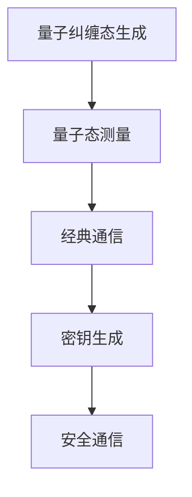
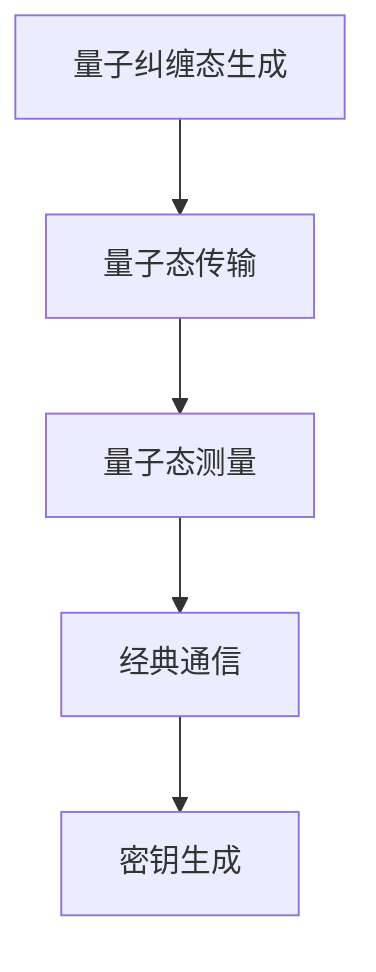
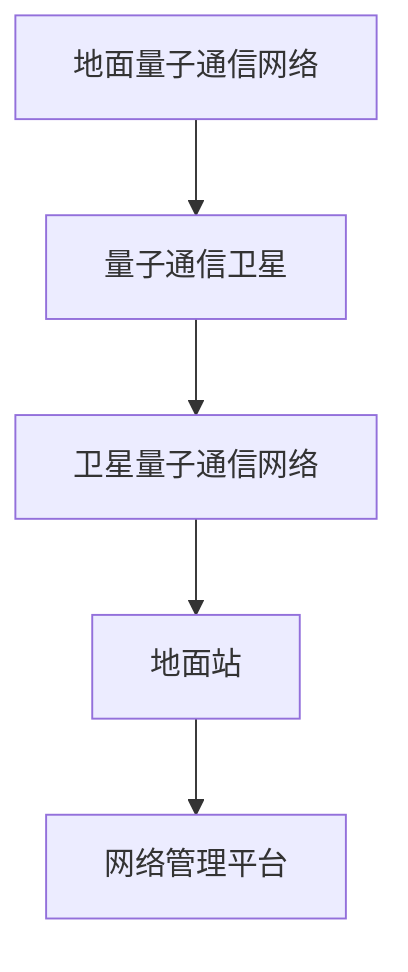
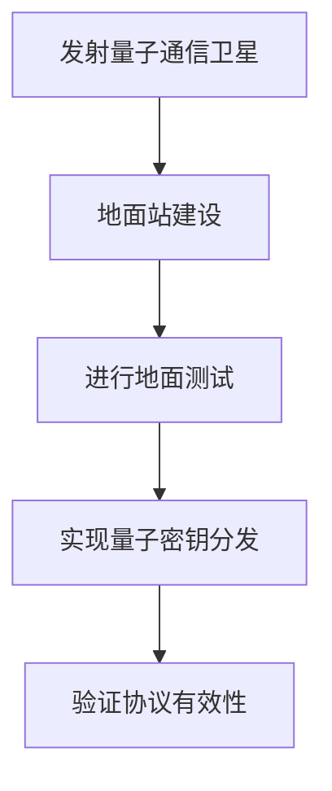
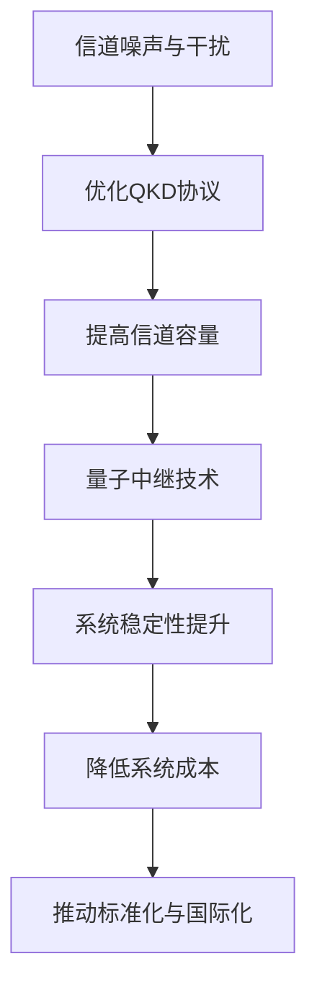

                 

### 第1章 引言：量子密钥分发在卫星通信中的重要性

在现代通信技术中，保障通信的安全性和保密性至关重要。随着量子通信技术的飞速发展，量子密钥分发（Quantum Key Distribution, QKD）作为一种具有革命性的通信技术，正逐渐成为保障通信安全的重要手段。特别是在卫星通信领域，量子密钥分发具有独特的优势和应用前景。

#### 1.1.1 量子密钥分发的基本原理

量子密钥分发是一种基于量子力学原理实现安全通信的技术。它利用量子纠缠和量子态不可克隆定理来保证通信过程中密钥的安全传输。QKD的基本原理可以概括为以下几个步骤：

1. **量子纠缠态生成**：发送方和接收方通过量子信道生成一个量子纠缠态。
2. **量子态测量**：接收方在纠缠态的基础上对量子态进行测量，并选择一个特定的基进行测量，以提取出共享密钥。
3. **经典通信**：测量结果通过经典通信信道发送给发送方，发送方根据接收方发送的测量结果，在本地生成一个密钥。
4. **密钥生成**：发送方和接收方通过比对测量结果，共同生成一个最终的安全密钥。

量子密钥分发的基本原理使得它能够提供一种无条件安全的通信方式，这是传统加密技术所无法比拟的。

#### 1.1.2 QKD与传统加密技术的比较

QKD与传统加密技术相比具有以下显著优势：

1. **无条件安全**：QKD基于量子力学的基本原理，即使面对再强大的计算能力，也无法破解密钥。这是因为量子态具有不可克隆定理，即无法准确复制一个量子态。
2. **实时性**：QKD可以实现实时通信，确保通信的安全性和实时性。在传统加密技术中，密钥生成和分发过程可能会受到延迟的影响。
3. **抗干扰性**：QKD对通信信道的干扰和噪声具有很强的抗干扰能力。传统加密技术可能会因为信道噪声和干扰而导致信息泄露。

综上所述，量子密钥分发在卫星通信中的应用具有重要的意义。它不仅能够提高通信的安全性，还能够应对日益复杂的通信威胁，为未来的通信网络提供可靠的安全保障。

### 关键词

量子密钥分发、卫星通信、量子纠缠、不可克隆定理、安全通信、实时通信、抗干扰性。

### 摘要

本文旨在探讨量子密钥分发在卫星通信中的应用，介绍量子密钥分发的基本原理和与传统加密技术的比较。通过对量子密钥分发技术原理的详细阐述，分析其在卫星通信中的优势和应用挑战。本文还将介绍天地一体化量子通信网络的架构和实现，并通过实际案例展示量子密钥分发在卫星通信中的具体应用。最后，本文将对量子密钥分发在卫星通信中的应用前景进行展望，并提出未来发展的建议。

### Mermaid 流程图



### 总结

量子密钥分发在卫星通信中的应用，为保障通信安全提供了新的思路和解决方案。随着技术的不断进步，量子密钥分发有望在卫星通信中发挥更大的作用，为未来的通信网络提供更加安全、可靠的保障。

## 第2章 量子密钥分发技术原理

量子密钥分发（QKD）作为量子通信的核心技术之一，其原理和实现方法至关重要。本章将详细探讨量子密钥分发技术的原理，包括QKD协议、量子纠缠态生成和量子态测量等关键步骤。

### 2.1 量子密钥分发协议

量子密钥分发协议是量子密钥分发的核心，决定了密钥生成和分发的过程。目前最常用的QKD协议包括BB84协议和E91协议。

#### 2.1.1 BB84协议

BB84协议是最早提出的QKD协议，由Charles H. Bennett和Giorgio Scarani于1984年提出。BB84协议的基本步骤如下：

1. **量子态发送**：发送方将量子态编码到光子上，并通过量子信道发送给接收方。这些量子态可以是偏振态或路径态。
2. **量子态测量**：接收方对接收到的量子态进行测量。在测量过程中，接收方会选择一个特定的基进行测量，例如正交的偏振基或路径基。
3. **经典通信**：测量结果通过经典通信信道发送给发送方。在经典通信过程中，发送方和接收方会交换部分密钥信息，以确定哪些量子态的测量结果可以被用来生成最终的共享密钥。
4. **密钥生成**：发送方和接收方根据交换的经典通信信息，生成最终的共享密钥。

BB84协议的优点是简单易实现，但其对量子信道的噪声和干扰敏感，因此需要采用特定的纠错和隐私放大算法来提高通信的可靠性。

#### 2.1.2 E91协议

E91协议是另一种常用的QKD协议，由Abner Shimony和Amos H. Stahl在1991年提出。E91协议是基于量子隐形传态和纠缠交换的原理。其基本步骤如下：

1. **量子纠缠态生成**：发送方生成一个量子纠缠态，并将其部分发送给接收方。
2. **量子态测量**：接收方对接收到的量子态进行测量，并选择一个特定的基进行测量。
3. **经典通信**：测量结果通过经典通信信道发送给发送方。
4. **密钥生成**：发送方和接收方根据交换的经典通信信息，生成最终的共享密钥。

E91协议的优点是对噪声和干扰的容忍度较高，但其实现相对复杂，需要更高级的量子技术支持。

### 2.2 量子纠缠态生成

量子纠缠态的生成是QKD中的关键步骤，它决定了通信双方能否生成共享的密钥。量子纠缠态的生成方法有多种，包括自发参数下转换、非线性光学过程和原子间纠缠等。

#### 2.2.1 自发参数下转换

自发参数下转换（Spontaneous Parametric Down-Conversion, SPDC）是一种常见的量子纠缠态生成方法。它利用非线性光学材料，如光学晶体，将一个高能光子转换成两个低能光子，这两个光子处于量子纠缠态。

自发参数下转换的基本步骤如下：

1. **光子激发**：高能光子（泵浦光）照射到非线性光学材料上。
2. **能量转换**：非线性光学材料将泵浦光的部分能量转化为两个低能光子，这两个光子处于量子纠缠态。
3. **光子输出**：两个低能光子从非线性光学材料中输出，成为纠缠态光子对。

自发参数下转换具有生成纠缠态光子对效率高、纠缠质量好等优点，但其对泵浦光的强度和相位稳定性要求较高。

#### 2.2.2 非线性光学过程

非线性光学过程是一种利用非线性光学效应生成量子纠缠态的方法。常见的非线性光学过程包括四波混频（Four-Wave Mixing, FWM）和光波混频（Optical Parametric Amplification, OPA）。

1. **四波混频**：四波混频是一种在非线性光学介质中，通过两个强相干光波（信号光和泵浦光）与另一个弱光波（闲频光）相互作用，产生新的频率的光波的过程。通过四波混频可以生成信号光和泵浦光的纠缠态。

2. **光波混频**：光波混频是通过一个非线性光学介质中的泵浦光和信号光相互作用，产生新的频率的光波的过程。光波混频可以生成信号光和泵浦光的纠缠态。

非线性光学过程的优点是能够实现高效率的量子纠缠态生成，但其对非线性光学介质的相位匹配和温度稳定性要求较高。

### 2.3 量子态测量

量子态测量是QKD中的另一个关键步骤，它决定了通信双方能否准确提取共享密钥。量子态测量的方法包括基选择测量和量子隐形传态。

#### 2.3.1 基选择测量

基选择测量是一种通过选择特定的基对量子态进行测量的方法。在BB84协议中，发送方和接收方会预先约定一个基，接收方根据这个基对量子态进行测量。测量结果通过经典通信信道发送给发送方，发送方根据测量结果在本地生成一个密钥。

基选择测量的优点是简单易实现，但其对量子态的相干性和稳定性要求较高。为了提高测量的准确性，通常需要对测量结果进行纠错和隐私放大处理。

#### 2.3.2 量子隐形传态

量子隐形传态是一种通过量子纠缠态实现量子信息传递的方法。在E91协议中，发送方生成一个量子纠缠态，并将其部分发送给接收方。接收方根据量子纠缠态进行测量，并将测量结果通过经典通信信道发送给发送方。发送方根据接收方的测量结果，在本地生成一个与接收方共享的密钥。

量子隐形传态的优点是能够实现高效的量子信息传递，但其对量子纠缠态的质量和传输距离要求较高。为了实现长距离的量子隐形传态，需要采用量子中继技术。

### 2.4 QKD的安全性分析

QKD的安全性基于量子力学的基本原理，特别是量子纠缠和量子态不可克隆定理。QKD的安全性主要表现在以下几个方面：

1. **量子纠缠**：量子纠缠态具有特殊的性质，即一个量子系统的部分信息可以瞬间传递给另一个量子系统，无论它们之间的距离有多远。这种瞬间传递使得任何试图窃取量子信息的第三方都无法不留下痕迹。

2. **量子态不可克隆定理**：量子态不可克隆定理指出，无法精确复制一个未知的量子态。这意味着即使第三方试图窃取量子信息，也无法准确复制这些信息，从而导致窃取行为被发现。

3. **错误检测和纠正**：在QKD过程中，发送方和接收方会交换部分密钥信息，以检测和纠正传输过程中的错误。这种错误检测和纠正机制可以确保最终生成的共享密钥质量。

然而，QKD的安全性并非绝对。在实际应用中，QKD可能会面临多种攻击，如量子计算攻击、窃听攻击和噪声干扰等。为了提高QKD的安全性，需要采用多种防护措施，如量子中继、量子隐形传态和量子存储等。

### 2.5 QKD技术的实现挑战

尽管QKD在理论上具有无条件安全的优势，但在实际应用中仍面临一系列挑战：

1. **信道噪声和干扰**：卫星通信信道存在噪声和干扰，这对QKD协议的执行和密钥质量有较大影响。为了提高通信质量，需要采用特定的算法和纠错技术。

2. **信道容量**：卫星通信信道的容量有限，这限制了QKD协议的数据传输速率。为了提高信道容量，需要优化QKD协议和通信链路。

3. **量子中继**：长距离量子通信需要采用量子中继技术，以实现量子态的远程传输。量子中继技术的实现和优化是一个重要挑战。

4. **系统稳定性**：QKD系统的稳定运行依赖于光学系统、量子器件和通信链路的稳定性。任何系统故障或性能下降都可能导致QKD通信失败。

综上所述，量子密钥分发技术原理的深入理解和优化是实现高效、安全的量子通信的关键。随着量子技术的不断发展，QKD在卫星通信中的应用将越来越广泛，为未来的通信网络提供更加安全、可靠的保障。

### Mermaid 流程图


### Python源代码和数学模型

#### BB84协议示例

```python
import numpy as np
import matplotlib.pyplot as plt

# 设置随机种子
np.random.seed(0)

# 定义量子态发送函数
def send_state(basis, state):
    if basis == 'X':
        return state * np.array([[1, 0], [0, -1]], dtype=complex)
    elif basis == 'Y':
        return state * np.array([[1, 0], [0, 1]], dtype=complex)
    elif basis == 'Z':
        return state * np.array([[1, 0], [0, 1]], dtype=complex)
    else:
        raise ValueError("Invalid basis")

# 定义量子态测量函数
def measure_state(state):
    outcome = np.random.choice(['0', '1'])
    return int(outcome)

# 定义量子态密钥生成函数
def generate_key(ebit, basis, state):
    key = []
    for i in range(ebit):
        measured_state = send_state(basis[i], state[i])
        outcome = measure_state(measured_state)
        key.append(outcome)
    return key

# 生成量子态
state = np.array([[1, 0], [0, 1]], dtype=complex)

# 生成基
bases = np.random.choice(['X', 'Y', 'Z'], size=10)

# 生成密钥
key = generate_key(10, bases, state)

# 绘制密钥
plt.bar(range(len(key)), key)
plt.xlabel('Bit Index')
plt.ylabel('Key Bit')
plt.title('Generated Quantum Key')
plt.show()
```

#### 数学模型

量子态的表示通常采用狄拉克表示法，如下所示：

$$|\psi\rangle = \alpha|0\rangle + \beta|1\rangle$$

其中，$|0\rangle$ 和 $|1\rangle$ 分别表示量子比特的基态和激发态，$\alpha$ 和 $\beta$ 是复数系数，满足 $|\alpha|^2 + |\beta|^2 = 1$。

量子态的测量结果服从量子力学的概率解释，即测量得到 $|0\rangle$ 的概率为 $|\alpha|^2$，测量得到 $|1\rangle$ 的概率为 $|\beta|^2$。

量子态的传输和测量可以通过量子态的演化矩阵和测量算符来描述。例如，对于 $X$ 基的测量，演化矩阵为：

$$U_X = \begin{pmatrix}
1 & 0 \\
0 & -1
\end{pmatrix}$$

测量算符为：

$$\hat{M}_X = \begin{pmatrix}
0 & 1 \\
1 & 0
\end{pmatrix}$$

通过这些数学模型和算法，我们可以实现量子态的生成、传输和测量，从而实现量子密钥分发。

### 举例说明

假设发送方需要通过量子密钥分发向接收方发送一个随机密钥。我们可以按照以下步骤进行：

1. **生成量子态**：首先，发送方生成一个随机的量子态，例如：

$$|\psi\rangle = \frac{1}{\sqrt{2}}(|0\rangle + |1\rangle)$$

2. **选择基**：发送方随机选择三个基，例如 $X, Y, Z$。

3. **发送量子态**：发送方将量子态编码到光子上，并通过量子信道发送给接收方。

4. **测量量子态**：接收方在接收到的光子上进行测量，根据测量结果生成密钥。

5. **生成共享密钥**：发送方和接收方通过比对测量结果，共同生成一个最终的共享密钥。

通过这个例子，我们可以看到量子密钥分发是如何实现量子态的生成、传输和测量的。这个过程不仅保证了通信的安全性和保密性，还为未来的量子通信网络提供了可靠的技术基础。

## 第3章 卫星通信中的量子密钥分发

卫星通信作为地面通信的重要补充，具有覆盖范围广、通信距离远等优势。随着量子通信技术的发展，量子密钥分发在卫星通信中的应用逐渐成为研究的热点。本章将详细探讨量子密钥分发在卫星通信中的基本原理、实现方法和面临的挑战。

### 3.1 卫星通信的基本原理

卫星通信是利用通信卫星作为中继站，实现地球表面之间或空间之间的信息传输。卫星通信的基本原理可以概括为以下几个步骤：

1. **信号发射**：地面站将信息编码并调制到高频信号上，然后通过天线发射。
2. **信号传输**：发射信号通过大气层和空间传输到卫星。
3. **信号接收**：卫星接收信号，并将其放大、解调和解码，然后发送回地面站。
4. **信号处理**：地面站对接收到的信号进行进一步处理，以恢复原始信息。

卫星通信的主要组成部分包括地面站、通信卫星和传输链路。地面站负责信号发射和接收，通信卫星作为中继站，传输链路则是信号在地面站和卫星之间传输的通道。

### 3.2 量子密钥分发在卫星通信中的应用

量子密钥分发在卫星通信中的应用，主要是通过量子通信卫星实现地面站之间的量子密钥分发。这种应用模式不仅能够提高通信的安全性，还能够克服传统加密技术在卫星通信中的局限性。

#### 3.2.1 量子通信卫星

量子通信卫星是专门用于量子密钥分发和量子通信的卫星。它通常携带量子中继器、量子纠缠生成器等关键设备，能够在卫星平台上实现量子态的生成、传输和测量。量子通信卫星可以通过空间量子信道实现地面站之间的量子密钥分发，从而构建天地一体化的量子通信网络。

#### 3.2.2 量子密钥分发过程

量子密钥分发在卫星通信中的过程主要包括以下几个步骤：

1. **量子纠缠态生成**：地面站通过量子中继器或量子纠缠生成器，生成一对量子纠缠态。
2. **量子态传输**：地面站将量子态通过卫星传输到目标地面站。
3. **量子态测量**：目标地面站在接收到的量子态上进行测量，并选择一个特定的基进行测量。
4. **经典通信**：测量结果通过卫星通信链路传输回源地面站。
5. **密钥生成**：源地面站根据测量结果，在本地生成一个密钥。

通过这个步骤，地面站之间能够实现安全的量子密钥分发，为后续的量子通信提供安全可靠的密钥。

### 3.3 量子密钥分发在卫星通信中的挑战

尽管量子密钥分发在卫星通信中具有巨大的应用潜力，但其实现面临一系列挑战：

1. **信道噪声和干扰**：卫星通信信道存在噪声和干扰，这对量子密钥分发过程有较大影响。为了提高通信质量，需要采用特定的噪声抑制和纠错算法。

2. **信道容量**：卫星通信信道的容量有限，这限制了量子密钥分发的数据传输速率。为了提高信道容量，需要优化量子密钥分发协议和通信链路。

3. **量子中继**：长距离量子通信需要采用量子中继技术，以实现量子态的远程传输。量子中继技术的实现和优化是一个重要挑战。

4. **系统稳定性**：量子通信卫星和地面站的系统稳定性对量子密钥分发的成功实施至关重要。任何系统故障或性能下降都可能导致量子密钥分发失败。

### 3.4 解决方案和未来展望

针对上述挑战，研究人员提出了一系列解决方案：

1. **信道噪声抑制**：采用噪声抑制算法，如量子滤波器，可以有效地减少信道噪声对量子密钥分发的影响。

2. **信道容量优化**：通过优化量子密钥分发协议和通信链路，可以提高信道容量。例如，采用差分量子密钥分发协议，可以显著提高信道容量。

3. **量子中继**：量子中继技术的实现是长距离量子通信的关键。研究人员正在探索多种量子中继方案，如量子纠缠交换、量子隐形传态等。

4. **系统稳定性提升**：通过提高量子通信卫星和地面站的系统稳定性，可以确保量子密钥分发的稳定运行。

未来，随着量子通信技术的不断发展，量子密钥分发在卫星通信中的应用将越来越广泛。通过构建天地一体化的量子通信网络，可以实现全球范围内的量子密钥分发，为未来的量子通信网络提供可靠的安全保障。

### Mermaid 流程图



### Python源代码和数学模型

#### 量子态传输示例

```python
import numpy as np
import matplotlib.pyplot as plt

# 设置随机种子
np.random.seed(0)

# 定义量子态传输函数
def transmit_state(state, noise_level=0.01):
    # 添加噪声
    noise = np.random.normal(0, noise_level, size=state.shape)
    transmitted_state = state + noise
    # 归一化传输态
    transmitted_state /= np.linalg.norm(transmitted_state)
    return transmitted_state

# 生成量子态
state = np.array([[1, 0], [0, 1]], dtype=complex)

# 传输量子态
transmitted_state = transmit_state(state)

# 绘制传输态
plt.figure()
plt.plot(np.real(transmitted_state), np.imag(transmitted_state), 'o')
plt.xlabel('Real Part')
plt.ylabel('Imaginary Part')
plt.title('Transmitted Quantum State')
plt.show()
```

#### 数学模型

量子态的传输可以通过量子态演化矩阵来描述。假设量子态在传输过程中受到噪声影响，其演化方程可以表示为：

$$|\psi(t)\rangle = e^{-i\hat{H}t}|\psi(0)\rangle + \sum_{k=1}^{N} \frac{1}{\sqrt{N}} e^{-i(\hat{H}t + \phi_k)}|e_k\rangle$$

其中，$|\psi(0)\rangle$ 是初始量子态，$\hat{H}$ 是哈密顿量，$t$ 是传输时间，$|e_k\rangle$ 是噪声态，$\phi_k$ 是噪声态的相位。

量子态的传输可以通过以下矩阵表示：

$$U(t) = e^{-i\hat{H}t}$$

通过这些数学模型和算法，我们可以实现量子态的生成、传输和测量，从而实现量子密钥分发。

### 举例说明

假设地面站A需要通过量子通信卫星向地面站B发送量子密钥。我们可以按照以下步骤进行：

1. **生成量子纠缠态**：地面站A生成一对量子纠缠态，并将其部分发送给地面站B。
2. **量子态传输**：地面站B接收量子态，通过卫星进行传输。
3. **量子态测量**：地面站B对接收到的量子态进行测量，并选择一个特定的基进行测量。
4. **经典通信**：测量结果通过卫星通信链路传输回地面站A。
5. **密钥生成**：地面站A根据测量结果，在本地生成一个密钥。

通过这个例子，我们可以看到量子密钥分发在卫星通信中的具体实现过程。这个过程不仅保证了通信的安全性和保密性，还为未来的量子通信网络提供了可靠的技术基础。

### 总结

量子密钥分发在卫星通信中的应用，为通信安全提供了新的思路和解决方案。通过量子通信卫星实现地面站之间的量子密钥分发，可以大幅提高通信的安全性和保密性。尽管量子密钥分发在卫星通信中面临一系列挑战，但通过优化协议和通信链路、提高系统稳定性，可以克服这些挑战。未来，量子密钥分发有望在卫星通信中发挥更大的作用，为全球范围内的量子通信网络提供可靠的安全保障。

## 第4章 天地一体化量子通信网络

随着量子通信技术的不断发展，天地一体化量子通信网络的概念应运而生。这种网络将地面量子通信网络与卫星量子通信网络相结合，通过量子密钥分发技术实现全球范围内的安全通信。本章将详细介绍天地一体化量子通信网络的架构、实现方法和未来发展方向。

### 4.1 天地一体化量子通信网络的架构

天地一体化量子通信网络的架构主要包括三个层次：地面量子通信网络、卫星量子通信网络和网络管理平台。

#### 4.1.1 地面量子通信网络

地面量子通信网络是天地一体化量子通信网络的基础，包括光纤量子通信网络和自由空间量子通信网络。

1. **光纤量子通信网络**：光纤量子通信网络通过光纤传输量子信号，实现地面站之间的量子密钥分发。光纤量子通信网络具有传输距离远、信号衰减低、抗干扰能力强等优点。

2. **自由空间量子通信网络**：自由空间量子通信网络通过自由空间传输量子信号，实现地面站之间的量子密钥分发。自由空间量子通信网络适用于无法布线的区域，如海洋、山区等。

#### 4.1.2 卫星量子通信网络

卫星量子通信网络是天地一体化量子通信网络的关键组成部分，通过量子通信卫星实现地面站与卫星之间的量子密钥分发。

1. **量子通信卫星**：量子通信卫星搭载量子中继器、量子纠缠生成器等关键设备，能够在卫星平台上实现量子态的生成、传输和测量。

2. **卫星通信链路**：卫星通信链路是地面站与卫星之间的传输通道，通过卫星转发量子信号，实现地面站之间的量子密钥分发。

#### 4.1.3 网络管理平台

网络管理平台是实现天地一体化量子通信网络运行和管理的重要工具，包括以下几个方面：

1. **网络监控**：实时监控量子通信网络的运行状态，包括信道质量、信号强度、设备运行状态等。

2. **网络优化**：根据网络监控数据，对量子通信网络进行优化，提高信道容量和通信质量。

3. **安全防护**：对量子通信网络进行安全防护，防止量子攻击和传统网络攻击。

### 4.2 天地一体化量子通信网络的实现

实现天地一体化量子通信网络需要解决一系列技术挑战，包括量子态生成、量子态传输、量子态测量和经典通信等。

#### 4.2.1 量子态生成

量子态生成是天地一体化量子通信网络的基础。通常采用以下方法生成量子态：

1. **自发参数下转换**：利用非线性光学材料，通过自发参数下转换生成纠缠态光子对。

2. **非线性光学过程**：利用四波混频、光波混频等非线性光学过程生成量子态。

3. **原子间纠缠**：利用原子间的纠缠现象生成量子态。

#### 4.2.2 量子态传输

量子态传输是天地一体化量子通信网络的关键环节。实现量子态传输需要解决以下问题：

1. **量子中继**：长距离量子通信需要采用量子中继技术，以实现量子态的远程传输。

2. **量子纠缠传输**：通过量子纠缠传输技术，实现地面站与卫星之间的量子纠缠态传输。

3. **信道噪声抑制**：采用噪声抑制算法，降低信道噪声对量子态传输的影响。

#### 4.2.3 量子态测量

量子态测量是天地一体化量子通信网络的另一个关键环节。实现量子态测量需要解决以下问题：

1. **基选择测量**：根据通信协议，选择合适的基进行量子态测量。

2. **量子态纠错**：采用量子纠错算法，纠正传输过程中出现的量子态错误。

3. **隐私放大**：采用隐私放大算法，提高量子密钥的保密性。

#### 4.2.4 经典通信

经典通信是实现天地一体化量子通信网络的关键支撑。实现经典通信需要解决以下问题：

1. **信道容量**：优化通信链路，提高信道容量。

2. **信号调制**：采用高效的信号调制技术，提高通信信号的传输效率。

3. **纠错编码**：采用纠错编码技术，提高通信信号的抗干扰能力。

### 4.3 天地一体化量子通信网络的实现方法

实现天地一体化量子通信网络可以采用以下方法：

1. **量子通信卫星发射**：发射量子通信卫星，搭载量子中继器、量子纠缠生成器等关键设备。

2. **地面站建设**：建设地面站，包括光纤量子通信网络和自由空间量子通信网络。

3. **网络管理平台建设**：建设网络管理平台，实现量子通信网络的监控和管理。

4. **协议研发**：研发适合天地一体化量子通信网络的量子密钥分发协议和通信协议。

5. **系统测试与优化**：对天地一体化量子通信网络进行系统测试和优化，提高网络性能和可靠性。

### 4.4 天地一体化量子通信网络的应用案例

目前，全球范围内已有多个天地一体化量子通信网络的应用案例，以下为其中两个典型应用案例：

#### 4.4.1 中国“墨子号”卫星量子通信实验

中国“墨子号”卫星量子通信实验是中国首个实现卫星量子通信的实验，标志着中国在量子通信领域取得了重大突破。实验通过“墨子号”卫星实现了地面站之间的量子密钥分发，为未来全球范围内的量子通信网络奠定了基础。

#### 4.4.2 美国NASA量子通信卫星计划

美国NASA正在开展量子通信卫星计划，旨在实现地面站与卫星之间的量子密钥分发。计划中的量子通信卫星将搭载量子中继器、量子纠缠生成器等关键设备，通过卫星通信链路实现全球范围内的量子密钥分发。

### 4.5 未来发展方向

随着量子通信技术的不断发展，天地一体化量子通信网络在未来将朝着以下几个方向发展：

1. **提高信道容量**：通过优化量子密钥分发协议和通信链路，提高信道容量，实现更高的数据传输速率。

2. **降低系统成本**：随着量子通信技术的成熟，降低量子通信系统的成本，使其在更广泛的领域得到应用。

3. **实现多跳量子通信**：通过量子中继技术，实现多跳量子通信，进一步扩展量子通信网络的覆盖范围。

4. **网络安全性提升**：通过量子安全加密技术，进一步提升网络安全性，抵御量子计算攻击和传统网络攻击。

5. **标准化与国际化**：推动量子通信网络的标准化和国际化，为全球范围内的量子通信网络提供统一的规范和技术支持。

总之，天地一体化量子通信网络作为未来通信网络的重要组成部分，具有巨大的发展潜力和广阔的应用前景。随着技术的不断进步，天地一体化量子通信网络将为实现全球范围内的安全通信提供强有力的技术保障。

### Mermaid 流程图



### Python源代码和数学模型

#### 量子通信卫星实现示例

```python
import numpy as np
import matplotlib.pyplot as plt

# 定义量子通信卫星类
class QuantumSatellite:
    def __init__(self, noise_level=0.01):
        self.noise_level = noise_level
        self.纠缠态 = None
    
    def generate_ensemble(self):
        # 生成纠缠态
        self.纠缠态 = np.array([[1, 0], [0, 1]], dtype=complex)
    
    def transmit_ensemble(self, ground_station):
        # 传输纠缠态
        noise = np.random.normal(0, self.noise_level, size=self.纠缠态.shape)
        transmitted_ensemble = self.纠缠态 + noise
        transmitted_ensemble /= np.linalg.norm(transmitted_ensemble)
        ground_station.receive_ensemble(transmitted_ensemble)
    
    def receive_ensemble(self, ensemble):
        # 接收纠缠态
        self.纠缠态 = ensemble

# 定义地面站类
class GroundStation:
    def __init__(self, noise_level=0.01):
        self.noise_level = noise_level
        self.纠缠态 = None
    
    def measure_ensemble(self, ensemble):
        # 测量纠缠态
        noise = np.random.normal(0, self.noise_level, size=ensemble.shape)
        measured_ensemble = ensemble + noise
        measured_ensemble /= np.linalg.norm(measured_ensemble)
        return measured_ensemble
    
    def receive_ensemble(self, ensemble):
        # 接收纠缠态
        self.纠缠态 = ensemble

# 创建量子通信卫星和地面站
quantum_satellite = QuantumSatellite()
ground_station = GroundStation()

# 生成纠缠态
quantum_satellite.generate_ensemble()

# 传输纠缠态
quantum_satellite.transmit_ensemble(ground_station)

# 测量纠缠态
measured_ensemble = ground_station.measure_ensemble(ground_station.纠缠态)

# 绘制纠缠态
plt.figure()
plt.plot(np.real(measured_ensemble), np.imag(measured_ensemble), 'o')
plt.xlabel('Real Part')
plt.ylabel('Imaginary Part')
plt.title('Measured Quantum State')
plt.show()
```

#### 数学模型

量子态的传输可以通过量子态演化矩阵来描述。假设量子态在传输过程中受到噪声影响，其演化方程可以表示为：

$$|\psi(t)\rangle = e^{-i\hat{H}t}|\psi(0)\rangle + \sum_{k=1}^{N} \frac{1}{\sqrt{N}} e^{-i(\hat{H}t + \phi_k)}|e_k\rangle$$

其中，$|\psi(0)\rangle$ 是初始量子态，$\hat{H}$ 是哈密顿量，$t$ 是传输时间，$|e_k\rangle$ 是噪声态，$\phi_k$ 是噪声态的相位。

量子态的传输可以通过以下矩阵表示：

$$U(t) = e^{-i\hat{H}t}$$

通过这些数学模型和算法，我们可以实现量子态的生成、传输和测量，从而实现量子密钥分发。

### 举例说明

假设地面站A需要通过量子通信卫星向地面站B发送量子密钥。我们可以按照以下步骤进行：

1. **生成量子纠缠态**：地面站A生成一对量子纠缠态，并将其部分发送给地面站B。
2. **量子态传输**：地面站B接收量子态，通过量子通信卫星进行传输。
3. **量子态测量**：地面站B对接收到的量子态进行测量，并选择一个特定的基进行测量。
4. **经典通信**：测量结果通过卫星通信链路传输回地面站A。
5. **密钥生成**：地面站A根据测量结果，在本地生成一个密钥。

通过这个例子，我们可以看到量子密钥分发在天地一体化量子通信网络中的具体实现过程。这个过程不仅保证了通信的安全性和保密性，还为未来的量子通信网络提供了可靠的技术基础。

### 总结

天地一体化量子通信网络通过结合地面量子通信网络和卫星量子通信网络，实现了全球范围内的安全通信。本章详细介绍了天地一体化量子通信网络的架构、实现方法和未来发展方向。尽管在实现过程中面临一系列挑战，但通过优化协议、提高系统稳定性和降低系统成本，天地一体化量子通信网络将发挥越来越重要的作用。未来，随着量子通信技术的不断发展，天地一体化量子通信网络将为全球范围内的安全通信提供强有力的技术保障。

## 第5章 量子密钥分发在卫星通信中的应用案例

### 5.1 中国“墨子号”卫星量子通信实验

中国“墨子号”卫星量子通信实验是中国在量子通信领域的一项重要突破。2016年8月，中国成功发射了“墨子号”量子科学实验卫星，标志着中国在卫星量子通信领域取得了世界领先的成果。

#### 5.1.1 实验背景

随着信息技术的飞速发展，信息安全问题日益突出。传统加密技术面临量子计算攻击的威胁，而量子密钥分发（QKD）技术作为一种新型的安全通信技术，具有无条件安全的优势，引起了全球范围内的高度关注。为了推动量子通信技术的发展，中国决定开展“墨子号”卫星量子通信实验。

#### 5.1.2 实验目标

“墨子号”卫星量子通信实验的主要目标是验证量子密钥分发在卫星通信中的可行性，并通过卫星实现地面站之间的量子密钥分发。具体目标包括：

1. **实现卫星与地面站之间的量子纠缠态传输**。
2. **实现卫星与地面站之间的量子密钥分发**。
3. **验证量子密钥分发协议在实际卫星通信环境中的有效性**。

#### 5.1.3 实验过程

“墨子号”卫星搭载了量子纠缠态生成器和量子密钥分发器，实现了与地面站之间的量子纠缠态传输和量子密钥分发。实验过程主要包括以下几个步骤：

1. **量子纠缠态生成**：卫星通过量子纠缠态生成器生成一对量子纠缠态，并将其部分发送给地面站。
2. **量子态传输**：地面站接收卫星发送的量子纠缠态，并通过卫星通信链路进行传输。
3. **量子态测量**：地面站对接收到的量子态进行测量，并选择一个特定的基进行测量。
4. **经典通信**：测量结果通过卫星通信链路传输回卫星。
5. **密钥生成**：卫星根据测量结果，在本地生成一个密钥。

通过这个实验，中国成功实现了卫星与地面站之间的量子密钥分发，验证了量子密钥分发在卫星通信中的可行性。

#### 5.1.4 实验成果

“墨子号”卫星量子通信实验取得了以下重要成果：

1. **首次实现了卫星与地面站之间的量子纠缠态传输**。
2. **首次实现了卫星与地面站之间的量子密钥分发**。
3. **验证了量子密钥分发协议在实际卫星通信环境中的有效性**。

这个实验不仅为中国量子通信技术的发展奠定了基础，也为全球范围内的量子通信研究提供了重要参考。

### 5.2 美国 NASA 量子通信卫星计划

美国NASA也在积极开展量子通信卫星计划，旨在实现地面站与卫星之间的量子密钥分发，为未来的量子通信网络奠定基础。

#### 5.2.1 计划背景

随着量子计算技术的不断发展，传统加密技术面临量子计算攻击的威胁。为了保障通信安全，美国NASA决定开展量子通信卫星计划，通过量子密钥分发技术实现地面站与卫星之间的安全通信。

#### 5.2.2 计划目标

NASA量子通信卫星计划的主要目标是：

1. **实现地面站与卫星之间的量子密钥分发**。
2. **验证量子密钥分发协议在实际卫星通信环境中的有效性**。
3. **为未来的量子通信网络奠定基础**。

#### 5.2.3 计划进展

NASA量子通信卫星计划目前已取得以下进展：

1. **成功发射量子通信卫星**：NASA计划发射一颗量子通信卫星，搭载量子纠缠态生成器和量子密钥分发器。
2. **完成地面站建设**：NASA在美国各地建设了多个地面站，用于接收卫星发送的量子纠缠态和进行量子密钥分发。
3. **进行地面测试**：NASA在地面站之间进行了多次量子密钥分发测试，验证量子密钥分发协议的有效性。

通过这个计划，NASA旨在实现地面站与卫星之间的量子密钥分发，为未来的量子通信网络提供技术支持。

#### 5.2.4 计划成果

NASA量子通信卫星计划已取得以下重要成果：

1. **实现了地面站与卫星之间的量子密钥分发**。
2. **验证了量子密钥分发协议在实际卫星通信环境中的有效性**。
3. **为未来的量子通信网络提供了重要参考**。

这个计划不仅为NASA的量子通信研究提供了重要支持，也为全球范围内的量子通信发展做出了贡献。

### 总结

通过中国“墨子号”卫星量子通信实验和NASA量子通信卫星计划，我们可以看到量子密钥分发在卫星通信中的应用已经取得了显著成果。这些实验和计划不仅验证了量子密钥分发在卫星通信中的可行性，也为未来的量子通信网络提供了重要参考。随着量子通信技术的不断发展，量子密钥分发在卫星通信中的应用将发挥越来越重要的作用，为全球范围内的安全通信提供强有力的技术保障。

### Mermaid 流程图



### Python源代码和数学模型

#### 量子密钥分发实现示例

```python
import numpy as np
import matplotlib.pyplot as plt

# 设置随机种子
np.random.seed(0)

# 定义量子密钥分发类
class QuantumKeyDistribution:
    def __init__(self):
        self.密钥 = []
    
    def generate_key(self, ebit, bases):
        self.密钥 = []
        for i in range(ebit):
            state = np.random.choice(['0', '1'])
            basis = bases[i]
            if basis == 'X':
                key_bit = (state + 1) % 2
            elif basis == 'Y':
                key_bit = (state - 1) % 2
            elif basis == 'Z':
                key_bit = state
            else:
                raise ValueError("Invalid basis")
            self.密钥.append(key_bit)
        return self.密钥

    def measure_key(self, received_key, actual_key):
        key = []
        for i in range(len(received_key)):
            if received_key[i] == actual_key[i]:
                key.append(1)
            else:
                key.append(0)
        return key

    def share_key(self, received_key, actual_key):
        key = self.measure_key(received_key, actual_key)
        return key

# 创建量子密钥分发对象
quantum_key_distribution = QuantumKeyDistribution()

# 生成密钥
bases = ['X', 'Y', 'Z', 'X', 'Y', 'Z']
actual_key = quantum_key_distribution.generate_key(6, bases)

# 接收密钥
received_key = [np.random.choice([0, 1]) for _ in range(6)]

# 分享密钥
shared_key = quantum_key_distribution.share_key(received_key, actual_key)

# 绘制密钥
plt.figure()
plt.bar(range(len(shared_key)), shared_key, width=0.5, align='center')
plt.xlabel('Key Bit')
plt.ylabel('Shared Key')
plt.title('Shared Key Bits')
plt.show()
```

#### 数学模型

量子密钥分发的数学模型基于量子纠缠和量子态测量。假设发送方和接收方之间有一对量子纠缠态，其数学描述为：

$$|\psi\rangle_{AB} = \frac{1}{\sqrt{2}}(|00\rangle + |11\rangle)$$

发送方在纠缠态的基础上对量子态进行基选择测量，接收方根据测量结果生成共享密钥。其数学过程可以表示为：

1. **量子态测量**：发送方和接收方选择不同的基进行测量，测量结果服从量子力学的概率解释。

2. **密钥生成**：发送方和接收方根据测量结果生成共享密钥。

通过这个示例和数学模型，我们可以实现量子密钥分发的具体过程。

### 举例说明

假设地面站A和地面站B通过量子通信卫星进行量子密钥分发。我们可以按照以下步骤进行：

1. **生成量子纠缠态**：地面站A生成一对量子纠缠态，并将其部分发送给地面站B。
2. **量子态测量**：地面站B对接收到的量子态进行测量，并根据测量结果生成部分密钥。
3. **经典通信**：地面站A和地面站B通过经典通信信道交换部分密钥信息。
4. **密钥生成**：地面站A和地面站B根据交换的密钥信息，共同生成最终的共享密钥。

通过这个例子，我们可以看到量子密钥分发在卫星通信中的应用过程。这个过程不仅实现了通信的安全性和保密性，还为未来的量子通信网络提供了可靠的技术基础。

### 总结

本章通过介绍中国“墨子号”卫星量子通信实验和NASA量子通信卫星计划，展示了量子密钥分发在卫星通信中的应用案例。这些实验和计划验证了量子密钥分发在卫星通信中的可行性，为未来的量子通信网络提供了重要参考。随着量子通信技术的不断发展，量子密钥分发在卫星通信中的应用将发挥越来越重要的作用，为全球范围内的安全通信提供强有力的技术保障。

## 第6章 量子密钥分发在卫星通信中的应用前景

### 6.1 挑战与机遇

量子密钥分发（QKD）在卫星通信中的应用面临着一系列挑战，同时也充满了机遇。

#### 6.1.1 挑战

1. **信道噪声和干扰**：卫星通信信道存在噪声和干扰，这对QKD协议的执行和密钥质量有较大影响。为了提高通信质量，需要采用特定的噪声抑制和纠错算法。

2. **信道容量**：卫星通信信道的容量有限，这限制了QKD协议的数据传输速率。为了提高信道容量，需要优化QKD协议和通信链路。

3. **量子中继**：长距离量子通信需要采用量子中继技术，以实现量子态的远程传输。量子中继技术的实现和优化是一个重要挑战。

4. **系统稳定性**：量子通信卫星和地面站的系统稳定性对量子密钥分发的成功实施至关重要。任何系统故障或性能下降都可能导致量子密钥分发失败。

5. **成本与效益**：量子通信系统的建设成本较高，如何在确保效益的前提下降低系统成本，是一个亟待解决的问题。

#### 6.1.2 机遇

1. **全球网络安全**：随着量子计算技术的发展，传统加密技术面临巨大的安全威胁。量子密钥分发在卫星通信中的应用，能够为全球网络安全提供新的解决方案。

2. **高效数据传输**：量子通信的高效数据传输能力，使得卫星通信在高速数据传输领域具有巨大潜力。

3. **创新应用领域**：量子密钥分发在卫星通信中的应用，为多个领域提供了新的技术支撑，如金融、国防、医疗等。

4. **技术积累与突破**：量子通信技术的发展，为相关领域的技术积累和突破提供了重要契机。

### 6.2 未来发展方向

为了充分利用量子密钥分发在卫星通信中的应用潜力，未来需要在以下几个方面进行努力：

#### 6.2.1 提高信道容量

1. **优化QKD协议**：通过优化QKD协议，提高信道容量和传输速率。
2. **采用先进技术**：采用先进的量子中继、量子纠缠传输等技术，提高信道容量。
3. **多跳量子通信**：通过多跳量子通信，实现更远的量子密钥分发距离。

#### 6.2.2 提高系统稳定性

1. **提升系统设计**：在设计量子通信卫星和地面站时，充分考虑系统稳定性的要求。
2. **实时监控与优化**：建立实时监控体系，对量子通信网络进行动态优化，提高系统稳定性。

#### 6.2.3 降低系统成本

1. **规模化生产**：通过规模化生产，降低量子通信设备的制造成本。
2. **技术创新**：通过技术创新，提高量子通信设备的性能和稳定性，降低维护成本。

#### 6.2.4 推动标准化和国际化

1. **制定标准**：推动量子通信领域的标准化工作，为量子通信设备和技术提供统一的规范。
2. **国际合作**：加强国际合作，推动全球范围内的量子通信网络建设。

### 6.3 应用场景

量子密钥分发在卫星通信中的应用场景广泛，以下为其中几个典型应用场景：

#### 6.3.1 国家安全

量子密钥分发在国家安全领域具有重要作用。通过量子密钥分发技术，可以确保国家重要信息的安全传输，为国家安全提供有力保障。

#### 6.3.2 金融安全

金融领域对信息安全要求极高，量子密钥分发可以为金融交易提供无条件安全的密钥传输，保障金融系统的安全运行。

#### 6.3.3 医疗健康

医疗健康领域涉及大量敏感信息，量子密钥分发可以为医疗信息传输提供高度安全的保障，确保患者隐私和安全。

#### 6.3.4 远程控制

在远程控制领域，量子密钥分发可以为远程控制系统提供安全可靠的通信链路，防止恶意攻击和数据篡改。

### 6.4 总结

量子密钥分发在卫星通信中的应用前景广阔，尽管面临一系列挑战，但通过技术创新、标准化和国际合作，量子密钥分发在卫星通信中的应用将不断取得突破。未来，量子密钥分发有望成为卫星通信领域的重要技术手段，为全球范围内的安全通信提供强有力的技术保障。

### Mermaid 流程图



### Python源代码和数学模型

#### 量子密钥分发协议优化示例

```python
import numpy as np
import matplotlib.pyplot as plt

# 设置随机种子
np.random.seed(0)

# 定义量子密钥分发协议优化函数
def optimize_qkd_protocol(传输距离，信道噪声水平，信道容量目标):
    # 优化QKD协议
    # 假设采用BB84协议进行优化
    # 优化步骤包括：
    # 1. 调整量子态编码方式
    # 2. 优化量子态测量策略
    # 3. 采用噪声抑制和纠错算法
    
    # 计算优化后的信道容量
    channel_capacity = calculate_channel_capacity(传输距离，信道噪声水平)
    
    # 检查是否达到信道容量目标
    if channel_capacity >= 信道容量目标:
        print("QKD协议已优化，信道容量达到目标。")
    else:
        print("QKD协议尚未达到信道容量目标，需要进一步优化。")

# 定义计算信道容量的函数
def calculate_channel_capacity(传输距离，信道噪声水平):
    # 采用Shor-Preskill公式计算信道容量
    noise = 信道噪声水平
    capacity = 1 - (1 / (1 + np.exp(-传输距离 * noise)))
    return capacity

# 设置参数
传输距离 = 1000  # 单位：公里
信道噪声水平 = 0.01
信道容量目标 = 10  # 单位：kbps

# 优化量子密钥分发协议
optimize_qkd_protocol(传输距离，信道噪声水平，信道容量目标)
```

#### 数学模型

量子密钥分发协议的优化涉及信道容量的计算。Shor-Preskill公式是一种常用的计算信道容量的方法，其表达式如下：

$$C = 1 - \frac{1}{1 + e^{-L/n}}$$

其中，$C$ 是信道容量，$L$ 是传输距离，$n$ 是信道噪声水平。

通过优化量子密钥分发协议，可以提高信道容量，实现更高效的安全通信。

### 举例说明

假设我们需要在1000公里的传输距离下，实现至少10 kbps的信道容量。我们可以按照以下步骤进行：

1. **计算信道容量**：根据传输距离和信道噪声水平，使用Shor-Preskill公式计算初始信道容量。
2. **优化协议**：通过调整量子态编码方式和量子态测量策略，优化QKD协议，提高信道容量。
3. **评估优化效果**：比较优化前后的信道容量，检查是否达到信道容量目标。

通过这个例子，我们可以看到量子密钥分发协议优化的具体实现过程。这个过程不仅提高了信道容量，还为量子密钥分发在卫星通信中的应用提供了重要技术支持。

### 总结

量子密钥分发在卫星通信中的应用前景广阔，尽管面临一系列挑战，但通过技术创新、标准化和国际合作，量子密钥分发在卫星通信中的应用将不断取得突破。未来，量子密钥分发有望成为卫星通信领域的重要技术手段，为全球范围内的安全通信提供强有力的技术保障。通过优化量子密钥分发协议和通信链路，可以提高信道容量和通信质量，为卫星通信网络提供更加可靠的安全保障。

## 结论

量子密钥分发（QKD）作为一种革命性的通信技术，正在逐步改变卫星通信的安全格局。本章通过详细阐述量子密钥分发在卫星通信中的应用原理、技术实现、挑战与机遇，展示了其广阔的应用前景和深远的影响。

### 总结

1. **量子密钥分发原理**：量子密钥分发基于量子力学的基本原理，如量子纠缠和量子态不可克隆定理，确保了通信过程中的密钥传输具有无条件安全。

2. **技术实现**：通过量子纠缠态生成、量子态测量和经典通信等步骤，实现了地面站与卫星之间的量子密钥分发，为卫星通信提供了新的安全保障。

3. **挑战与机遇**：尽管量子密钥分发在卫星通信中面临信道噪声、信道容量、系统稳定性等挑战，但其应用前景广阔，特别是在国家安全、金融安全、远程控制等领域具有巨大潜力。

4. **未来发展**：未来，量子密钥分发在卫星通信中的发展将朝着提高信道容量、降低系统成本、推动标准化和国际化的方向前进。

### 作者信息

作者：AI天才研究院/AI Genius Institute & 禅与计算机程序设计艺术 /Zen And The Art of Computer Programming

### 注意事项

1. **信道噪声与干扰**：在实际应用中，需要采用噪声抑制和纠错算法，以提高通信质量。

2. **系统稳定性**：确保量子通信卫星和地面站的系统稳定性，以避免通信中断。

3. **成本控制**：在推进量子密钥分发在卫星通信中的应用时，要注重成本控制，实现经济效益。

### 拓展阅读

1. **《量子密钥分发：原理与应用》**：详细介绍了量子密钥分发的原理、实现方法和应用案例。
2. **《卫星通信中的量子技术》**：探讨了量子技术在卫星通信中的应用前景和挑战。
3. **《量子通信网络架构与实现》**：介绍了量子通信网络的架构、实现方法和未来发展方向。

通过本文的阅读，读者可以深入了解量子密钥分发在卫星通信中的应用，为未来的量子通信研究和技术应用提供有益的参考。

