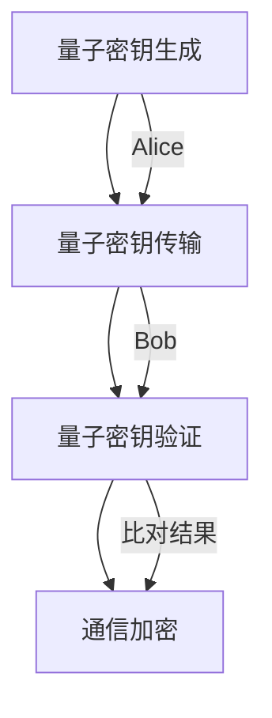

                 

### 《量子密钥分发：未来通信安全的基石》目录大纲

#### **第一部分 量子密钥分发的基本概念**

##### **第1章 量子密钥分发概述**

- **1.1 量子密钥分发的背景和意义**：介绍量子密钥分发的起源、发展的背景及其在通信安全领域的重要性。
- **1.2 量子密钥分发的原理**：解释量子密钥分发的工作原理，包括量子比特、量子态、量子纠缠和量子隐形传态等基本概念。
- **1.3 量子密钥分发的优势**：讨论量子密钥分发相较于传统加密方法的优越性，如不可窃听性和安全性。

##### **第2章 量子通信的基本概念**

- **2.1 量子比特和量子态**：介绍量子比特的基本概念以及量子态的表示方法。
- **2.2 量子纠缠和量子隐形传态**：解释量子纠缠的概念及其在量子通信中的应用，如量子隐形传态。
- **2.3 量子信道和量子噪声**：探讨量子信道的特性和量子噪声的影响，以及如何进行量子信道的优化。

#### **第二部分 量子密钥分发的核心技术**

##### **第3章 量子密钥分发协议**

- **3.1 BB84协议**：详细介绍BB84协议的工作原理、步骤和安全性分析。
- **3.2 E91协议**：解释E91协议的原理，包括量子纠缠态的生成和密钥的提取。
- **3.3 B92协议**：探讨B92协议的概念、应用和安全性。

##### **第4章 量子密钥分发系统的实现**

- **4.1 量子密钥分发系统的构成**：分析量子密钥分发系统的各个组成部分及其功能。
- **4.2 量子密钥分发系统的性能评估**：介绍量子密钥分发系统的性能评价指标和方法。
- **4.3 量子密钥分发系统的安全性分析**：讨论量子密钥分发系统的安全性和潜在威胁。

#### **第三部分 量子密钥分发在通信安全中的应用**

##### **第5章 量子密钥分发在经典通信中的应用**

- **5.1 量子密钥分发与对称加密**：阐述量子密钥分发在经典对称加密中的应用，如AES。
- **5.2 量子密钥分发与不对称加密**：解释量子密钥分发在不对称加密中的应用，如RSA。
- **5.3 量子密钥分发在VPN中的应用**：讨论量子密钥分发在虚拟私人网络（VPN）中的实际应用。

##### **第6章 量子密钥分发在量子通信中的应用**

- **6.1 量子通信与量子密钥分发**：介绍量子通信的基本概念和量子密钥分发在量子通信中的重要作用。
- **6.2 量子密钥分发在量子通信网络中的应用**：分析量子密钥分发在量子通信网络中的架构和实现。
- **6.3 量子密钥分发在量子加密通信中的应用**：探讨量子密钥分发在量子加密通信中的实际应用案例。

##### **第7章 量子密钥分发的前景和挑战**

- **7.1 量子密钥分发的未来发展趋势**：预测量子密钥分发在未来通信安全领域的发展趋势。
- **7.2 量子密钥分发的挑战和解决方案**：讨论量子密钥分发面临的挑战，如量子计算、量子噪声和量子信道等，并提出相应的解决方案。

## **附录**

### **附录A 量子密钥分发相关资源**

- **A.1 量子密钥分发研究论文**：列举相关的学术论文，提供进一步阅读的资料。
- **A.2 量子密钥分发实验设备**：介绍量子密钥分发实验所需的设备和技术。
- **A.3 量子密钥分发开源工具**：推荐一些用于量子密钥分发的开源工具和软件库。

## **Mermaid 流程图**

### **量子密钥分发流程**

```
graph TD
    A[量子密钥生成] --> B[量子密钥传输]
    B --> C[量子密钥验证]
    C --> D[通信加密]
```

## **BB84协议伪代码**

```python
# 初始化量子比特
qbit q[2^k]

# 随机选择基
rand basis[b1, b2]

# 量子密钥生成
for i = 0 to k-1 do
    if rand() < 0.5 then
        q[i] = Hadamard(q[i])
    end if
    q[i] = ControlledZ(q[i], q[i+1])
end for

# 量子密钥传输
send q[0] to Alice
receive q[1] from Bob

# 量子密钥验证
accepted = 0
for i = 0 to k-1 do
    if basis[i] == 'X' then
        if measure(q[i]) != measure(q[i+1]) then
            accepted = accepted + 1
        end if
    elsif basis[i] == 'Z' then
        if measure(q[i]) != 1 - measure(q[i+1]) then
            accepted = accepted + 1
        end if
    end if
end for

# 量子密钥加密
if accepted >= (k/2) then
    for i = 0 to k-1 do
        if basis[i] == 'X' then
            key[i] = (measure(q[i]) + 1) mod 2
        elsif basis[i] == 'Z' then
            key[i] = (1 - measure(q[i])) mod 2
        end if
    end for
else
    // 重新执行量子密钥分发
end if
```

## **数学公式**

### **量子密钥分发系统性能评估公式**

$$
P_{\text{key}} = \frac{1}{2^n} \sum_{i=1}^{n} P_i
$$

其中，$P_i$ 表示第 $i$ 个量子比特被正确测量的概率。$n$ 表示量子比特的数量。$$P_{\text{key}}$ 表示量子密钥分发的整体成功率。

---

本文目录大纲的制定旨在为读者提供一份清晰、系统且结构化的量子密钥分发技术博客。通过详细阐述各个章节的主题和内容要点，本文将帮助读者深入理解量子密钥分发的基本概念、核心技术和应用前景。每个章节均包含具体的分析和讲解，旨在通过逻辑清晰、通俗易懂的语言，使读者能够全面掌握量子密钥分发这一前沿技术。

在后续的文章中，我们将逐步展开每个章节的内容，深入探讨量子密钥分发的原理、协议、实现和应用。通过结合实际案例和代码示例，本文将力求为读者提供实践中的最佳解决方案，并展望量子密钥分发在未来通信安全领域的广阔前景。希望通过本文的阐述，读者能够对量子密钥分发有更为全面和深刻的认识。

---

### **文章标题：量子密钥分发：未来通信安全的基石**

> **关键词：量子密钥分发、量子通信、通信安全、密钥分发协议**

> **摘要：本文深入探讨量子密钥分发（Quantum Key Distribution, QKD）的基本概念、核心技术以及其在通信安全领域的应用。通过详细分析量子密钥分发协议和系统实现，本文揭示了量子密钥分发在提升通信安全水平方面的独特优势，展望了其未来发展的广阔前景。**

---

### **引言：量子密钥分发的重要性**

随着信息技术的飞速发展，通信安全已经成为现代社会的重要议题。传统的加密方法，如对称加密和非对称加密，虽然在保障数据安全方面发挥了重要作用，但面对日益复杂的网络安全威胁，其局限性也逐渐显现。特别是在量子计算和量子通信等领域，传统加密方法的安全性面临严峻挑战。因此，寻找新的加密手段以保障通信安全已成为当务之急。

量子密钥分发（Quantum Key Distribution，QKD）作为一种新兴的加密技术，因其基于量子力学原理，提供了理论上不可窃听的安全通信方式，成为未来通信安全的基石。QKD利用量子比特和量子纠缠等现象，实现密钥的生成、传输和验证，确保通信双方在共享密钥时能够发现任何第三方的窃听行为。这一独特的优势使得QKD在保障通信安全方面具有巨大的潜力。

本文将围绕量子密钥分发这一主题，系统地探讨其基本概念、核心技术和实际应用。通过本文的阐述，读者将能够全面了解量子密钥分发的工作原理，掌握不同量子密钥分发协议的特性和实现方法，并深入理解量子密钥分发在通信安全领域的重要应用价值。同时，本文也将讨论量子密钥分发面临的挑战及其未来发展前景，为读者提供对这一前沿技术的前瞻性认识。

### **第一部分 量子密钥分发的基本概念**

量子密钥分发（Quantum Key Distribution, QKD）是基于量子力学原理实现的一种安全通信技术，它通过量子通信渠道生成、传输和共享密钥。本部分将首先介绍量子密钥分发的基本概念，包括其背景、意义、原理以及优势。

#### **1.1 量子密钥分发的背景和意义**

量子密钥分发的概念起源于20世纪80年代，随着量子力学和量子信息科学的不断发展，人们逐渐认识到利用量子力学原理可以实现更加安全的通信。传统的加密方法虽然在一定程度上保障了通信安全，但在面对量子计算和量子通信技术日益发展的情况下，其安全性受到了严重的威胁。量子计算具有强大的计算能力，能够破解传统加密算法，这使得现有的通信安全面临巨大的挑战。而量子密钥分发则利用量子力学的基本原理，通过量子态的不可克隆性和量子纠缠等现象，实现高度安全的密钥分发。

量子密钥分发在通信安全领域具有重要意义。首先，它提供了理论上不可窃听的安全通信方式，能够有效防范量子计算和量子通信带来的安全威胁。其次，QKD的应用可以大幅提升通信系统的安全性，尤其是在金融、国防、政府等重要领域。此外，量子密钥分发还为构建量子互联网奠定了基础，为实现全球范围内的安全通信提供了技术保障。

#### **1.2 量子密钥分发的原理**

量子密钥分发的工作原理基于量子比特和量子纠缠等现象。量子比特（qubit）是量子信息的基本单位，它具有叠加态和纠缠态等特性，这使得量子比特能够承载比传统比特更多、更复杂的信息。量子纠缠是量子力学中的一种现象，当两个量子比特发生纠缠后，它们的状态将相互依赖，即使相隔很远，一个量子比特的状态变化也会立即影响到另一个量子比特。

量子密钥分发的基本原理可以分为以下几个步骤：

1. **量子密钥生成**：通信双方通过量子通信渠道（如光纤或自由空间）生成量子密钥。在这个过程中，双方会交换一系列量子比特，这些量子比特处于叠加态和纠缠态。

2. **量子态测量**：在量子密钥生成过程中，通信双方对量子比特进行测量，测量结果将决定密钥的具体值。由于量子态的叠加性和纠缠性，任何第三方试图窃听量子比特都会不可避免地改变量子态，从而被发现。

3. **量子密钥验证**：通信双方对测量结果进行比对和验证，以确保密钥的完整性和正确性。如果测量结果一致，则认为密钥是安全的，可以用于加密通信；如果不一致，则认为密钥可能被窃听，需要重新生成密钥。

#### **1.3 量子密钥分发的优势**

量子密钥分发相较于传统加密方法具有显著的优势：

1. **不可窃听性**：量子密钥分发利用量子态的叠加性和纠缠性，任何第三方试图窃听都会导致量子态的改变，通信双方能够立即检测到窃听行为，从而保障通信的安全性。

2. **密钥生成效率**：量子密钥分发能够高效地生成密钥，即使在长距离通信中，密钥生成的效率也非常高，能够满足实际通信需求。

3. **安全性高**：量子密钥分发基于量子力学原理，其安全性不依赖于复杂的算法和计算能力，因此难以被量子计算破解。

4. **适用范围广**：量子密钥分发适用于多种通信场景，包括光纤通信、无线通信和量子通信网络等，具有广泛的应用前景。

总之，量子密钥分发作为一种新型的加密技术，具有不可窃听、安全性高、生成效率高等显著优势，在未来通信安全领域具有广阔的应用前景。通过深入理解量子密钥分发的基本概念和原理，读者将能够更好地掌握这一前沿技术，为未来的通信安全提供有力保障。

#### **2.1 量子比特和量子态**

量子比特（qubit）是量子信息的基本单位，与经典计算机中的比特（bit）不同，量子比特具有独特的量子特性，如叠加态和纠缠态。这些特性使得量子比特能够承载比传统比特更多、更复杂的信息，是量子计算和量子通信的基础。

1. **量子比特的定义**：
量子比特是一种能够同时处于多种可能状态的物理系统，它的状态可以用复数来表示。与经典比特只能处于0或1两种状态不同，量子比特可以处于0、1或者两者的叠加状态。例如，一个量子比特可以表示为 |0⟩ + |1⟩，这表示它同时处于0和1的状态。

2. **量子态的表示**：
量子态通常用 ket（柯特）符号表示，如 |ψ⟩。一个量子态可以是一个基底的线性组合，例如：
   - **叠加态**：|ψ⟩ = α|0⟩ + β|1⟩，其中 α 和 β 是复数，并且 |α|² + |β|² = 1。
   - **纯态**：当量子态不能分解为其他量子态的叠加时，称为纯态。
   - **混合态**：当一个量子系统无法准确描述为单个量子态的叠加时，称为混合态。

3. **量子比特的操作**：
量子比特可以通过一系列量子门进行操作，这些量子门包括：
   - **Hadamard门（H）**：实现量子比特的叠加态，即 H|0⟩ = (|0⟩ + |1⟩) / √2，H|1⟩ = (|0⟩ - |1⟩) / √2。
   - **Pauli X门（X）**：翻转量子比特的状态，即 X|0⟩ = |1⟩，X|1⟩ = |0⟩。
   - **Pauli Z门（Z）**：将量子比特的状态取反，即 Z|0⟩ = |0⟩，Z|1⟩ = |1⟩。
   - **相位旋转门（Rz(θ)）**：旋转量子比特的相位，即 Rz(θ)|0⟩ = e^(iθ/2)|0⟩，Rz(θ)|1⟩ = e^(-iθ/2)|1⟩。

#### **2.2 量子纠缠和量子隐形传态**

量子纠缠是量子力学中的一种特殊现象，当两个或多个量子系统发生纠缠时，它们的状态将相互依赖，即使相隔很远，一个量子系统的状态变化也会立即影响到另一个量子系统。量子纠缠是量子信息科学中的关键概念，在量子通信和量子计算中具有广泛应用。

1. **量子纠缠的定义**：
量子纠缠是指两个或多个量子系统在某种操作下形成的量子态，它们的状态无法独立描述，而是相互关联。例如，当两个量子比特处于纠缠态时，一个量子比特的状态变化会立即影响另一个量子比特的状态，无论它们相隔多远。

2. **量子纠缠的表征**：
量子纠缠可以通过纠缠矩阵（如贝尔态、W态等）来表征。例如，一个著名的纠缠态是贝尔态：
   |Φ⁺⟩ = (|00⟩ + |11⟩) / √2，这个态表示两个量子比特的状态总是同时为0或同时为1。

3. **量子隐形传态**：
量子隐形传态是一种利用量子纠缠现象实现量子状态传输的技术。在量子隐形传态过程中，一个量子系统的状态可以通过纠缠态传递到另一个量子系统，而无需通过物理信道进行传输。这个过程被称为“隐形传态”，因为它不依赖于经典的通信渠道。

量子隐形传态的基本步骤包括：
   - 生成纠缠态：首先，在两个量子比特之间生成一个纠缠态。
   - 测量和传输：然后，对其中一个量子比特进行测量，并根据测量结果对另一个量子比特进行操作，从而实现量子状态的传输。
   - 验证：最后，对传输后的量子比特进行验证，以确保量子状态的正确传输。

通过量子纠缠和量子隐形传态，量子通信可以实现超距离、超安全的通信，为未来的通信安全提供了全新的解决方案。

#### **2.3 量子信道和量子噪声**

量子信道和量子噪声是量子通信中至关重要的概念，它们直接影响到量子信息的传输和安全性。量子信道是指量子比特在传输过程中的物理路径，而量子噪声则是指在量子信息传输过程中引入的各种干扰和不确定性。

1. **量子信道的定义**：
量子信道是一种能够传输量子比特的物理介质，它可以是光纤、自由空间或者量子中继器等。量子信道的基本特性是保真度和噪声特性，保真度描述量子比特在信道中的传输质量，噪声特性则描述信道对量子比特的干扰和扰动。

2. **量子信道的类型**：
根据量子信道的保真度和噪声特性，量子信道可以分为以下几种类型：
   - **完美信道**：理想情况下的量子信道，没有任何噪声和干扰，保真度为1。
   - **噪声信道**：存在一定噪声和干扰的量子信道，保真度小于1。
   - **信道退化**：保真度低于某个阈值，量子信息无法可靠传输的量子信道。

3. **量子噪声的定义**：
量子噪声是指在量子信息传输过程中引入的各种干扰和不确定性，它包括如下几种类型：
   - **量子信道噪声**：量子信道本身的噪声，如热噪声、相位噪声和幅值噪声等。
   - **外部噪声**：外部环境对量子信道的干扰，如电磁干扰、振动和温度等。
   - **量子态失真**：量子比特在信道中传输时，由于噪声和干扰导致的量子态的失真。

4. **量子噪声的影响**：
量子噪声对量子通信的影响主要体现在两个方面：
   - **降低传输效率**：量子噪声会导致量子比特的失真，降低量子信息的传输效率。
   - **影响安全性**：量子噪声可能被第三方利用，进行量子态的窃听和干扰，从而破坏量子通信的安全性。

为了应对量子噪声的影响，量子通信领域提出了一系列的解决方案，如量子纠错码、量子中继器和量子隐形传态等。这些方法通过增加量子比特的冗余信息、优化量子信道和增强量子纠缠等手段，提高量子信息的传输效率和安全性。

总之，量子信道和量子噪声是量子通信中不可或缺的概念，它们直接关系到量子信息的传输质量和安全性。通过深入理解和优化量子信道和量子噪声，我们可以进一步提升量子通信的性能，实现更高效的量子通信网络。

### **第二部分 量子密钥分发的核心技术**

量子密钥分发（Quantum Key Distribution, QKD）的核心技术包括一系列协议，这些协议通过量子比特的传输和测量，确保密钥的安全生成和共享。在这一部分中，我们将详细介绍几种主要的量子密钥分发协议，包括BB84协议、E91协议和B92协议，并探讨它们的工作原理、特性和安全性。

#### **3.1 BB84协议**

BB84协议是由Charles H. Bennett和Garrett D. Bennett于1984年提出的一种量子密钥分发协议。它基于量子比特的叠加态和量子纠缠现象，通过一系列经典和量子操作实现安全密钥的分发。BB84协议的工作原理可以概括为以下几个步骤：

1. **量子密钥生成**：
   - **量子比特生成**：Alice生成一对纠缠态的量子比特，并将其中的一个量子比特发送给Bob。
   - **随机选择基**：Alice和Bob各自选择一个随机数发生器，用于选择量子比特的测量基。

2. **量子比特传输**：
   - **传输量子比特**：Alice随机选择一个量子比特，并将其发送给Bob。由于量子比特处于叠加态，Bob无法确定它接收到的量子比特的状态。

3. **量子比特测量**：
   - **测量量子比特**：Bob根据自己选择的测量基，对量子比特进行测量。测量结果可以是0或1。
   - **记录测量结果**：Bob将测量结果记录下来，并与Alice选择的测量基进行比较。

4. **密钥提取**：
   - **比对测量结果**：Alice和Bob将各自的测量结果进行比较，如果测量结果一致，则对应的量子比特被认为是成功的传输。
   - **生成密钥**：Alice和Bob从成功传输的量子比特中提取密钥，并将其用于加密通信。

BB84协议的安全性基于量子比特的不可克隆定理和量子纠缠现象。任何第三方的窃听行为都会不可避免地改变量子比特的状态，从而被发现。此外，BB84协议还利用随机选择的测量基来防止经典密码攻击。

#### **3.2 E91协议**

E91协议是基于量子纠缠态的量子密钥分发协议，由Artur Ekert于1991年提出。E91协议利用量子纠缠态的特性和量子隐形传态实现安全密钥的分发。E91协议的工作原理如下：

1. **量子纠缠态生成**：
   - **量子比特生成**：Alice和Bob各自生成一对量子纠缠态的量子比特，并将其中的一个量子比特发送给对方。

2. **量子比特测量**：
   - **测量量子比特**：Alice和Bob各自选择一个随机数发生器，用于选择量子比特的测量基。
   - **测量并传输结果**：Alice和Bob分别测量自己手中的量子比特，并将测量结果通过经典通信渠道发送给对方。

3. **密钥提取**：
   - **比对测量结果**：Alice和Bob将各自的测量结果进行比较，如果测量结果一致，则对应的量子比特被认为是成功的传输。
   - **生成密钥**：Alice和Bob从成功传输的量子比特中提取密钥，并将其用于加密通信。

E91协议的安全性依赖于量子纠缠态的特性，任何第三方的窃听行为都会破坏量子纠缠态，从而被发现。此外，E91协议还利用量子隐形传态技术，实现量子比特的远程传输和密钥的共享。

#### **3.3 B92协议**

B92协议是由Charles H. Bennett和Yanbao Li于1993年提出的一种量子密钥分发协议，它是一种改进的量子密钥分发协议，旨在解决BB84协议中存在的部分缺陷。B92协议的工作原理如下：

1. **量子比特生成**：
   - **量子比特生成**：Alice生成一系列量子比特，并将其中的一个量子比特发送给Bob。

2. **量子比特传输**：
   - **传输量子比特**：Alice随机选择一个量子比特，并将其发送给Bob。

3. **量子比特测量**：
   - **测量量子比特**：Bob根据自己选择的测量基，对量子比特进行测量。

4. **密钥提取**：
   - **比对测量结果**：Alice和Bob将各自的测量结果进行比较，如果测量结果不一致，则对应的量子比特被认为是失败的传输。
   - **生成密钥**：Alice和Bob从成功传输的量子比特中提取密钥，并将其用于加密通信。

B92协议的安全性基于量子比特的不可克隆定理和量子纠缠现象。与BB84协议相比，B92协议在传输效率和安全性方面有一定的提升，但仍然存在一些潜在的安全威胁，如量子中继器的使用。

总的来说，BB84协议、E91协议和B92协议是量子密钥分发中三种主要的协议，它们各自具有独特的优势和特点。通过选择合适的协议，可以满足不同通信场景的安全需求。在后续的章节中，我们将进一步探讨量子密钥分发系统的实现和应用。

#### **4.1 量子密钥分发系统的构成**

量子密钥分发系统是实现量子密钥分发技术的核心平台，由多个关键组件构成，每个组件在密钥生成、传输和验证过程中发挥着独特的作用。以下是量子密钥分发系统的构成及其功能介绍：

1. **量子密钥生成器**：
量子密钥生成器是量子密钥分发系统的核心组件，负责生成具有高随机性和量子特性的密钥。量子密钥生成器通常由一个或多个量子随机数发生器（Quantum Random Number Generator, QRNG）构成，这些量子随机数发生器利用量子力学原理，如量子纠缠或量子态的叠加性，产生真正的随机数。生成的随机数用于生成量子密钥。

2. **量子信道**：
量子信道是量子密钥分发系统中的传输通道，用于将量子密钥从一方传输到另一方。量子信道可以是光纤、自由空间、量子中继器或量子互联网等。光纤信道是最常见的量子信道类型，它提供稳定的量子比特传输，但传输距离有限。自由空间量子信道则允许实现远距离的量子通信，但容易受到环境噪声和干扰的影响。量子中继器和量子互联网能够扩展量子信道的传输距离，提高通信系统的可靠性。

3. **量子测量设备**：
量子测量设备是量子密钥分发系统中用于测量量子比特状态的组件。在量子密钥分发过程中，双方需要对量子比特进行测量，以验证密钥的完整性和正确性。量子测量设备通常包括量子比特探测器和量子态分析器，这些设备能够精确测量量子比特的状态，并将测量结果转换为经典信息。

4. **经典通信信道**：
经典通信信道是量子密钥分发系统中用于传输经典信息的通道，如测量结果、随机数和密钥验证信息等。经典通信信道可以是光纤、无线电波、互联网等传统通信网络。经典通信信道与量子信道分离，以防止经典信息被量子噪声和干扰影响。

5. **密钥管理模块**：
密钥管理模块负责密钥的生成、存储、分发和验证。密钥管理模块通常包括密钥生成器、密钥存储器、密钥分发器和密钥验证器等子模块。密钥管理模块确保密钥的安全性和完整性，防止密钥泄露、篡改和重复使用。

6. **安全验证模块**：
安全验证模块负责对量子密钥分发过程进行安全验证，确保密钥传输过程中没有第三方的干扰和窃听。安全验证模块通过分析量子噪声和测量结果，发现潜在的攻击行为，并提供报警和应对措施。

通过上述关键组件的协同工作，量子密钥分发系统能够实现高效、安全的密钥生成和分发，为通信系统提供强大的安全保障。

#### **4.2 量子密钥分发系统的性能评估**

评估量子密钥分发系统的性能是确保其有效性和可靠性的关键步骤。性能评估涉及多个方面，包括传输效率、安全性、传输距离和抗干扰能力。以下是对这些性能评估指标的详细讨论：

1. **传输效率**：
量子密钥分发系统的传输效率是指单位时间内成功传输的有效密钥比特数。传输效率受到量子比特噪声、信道衰减和量子测量错误等因素的影响。为了提高传输效率，需要优化量子信道的设计和量子比特的生成与测量方法。通常，传输效率可以通过以下公式计算：
   $$
   \eta = \frac{N_{\text{key}}}{N_{\text{qubits}}}
   $$
   其中，$N_{\text{key}}$ 表示成功传输的密钥比特数，$N_{\text{qubits}}$ 表示传输的量子比特总数。通过优化量子比特的保真度和减少量子噪声，可以显著提高传输效率。

2. **安全性**：
量子密钥分发系统的安全性是衡量其抵御攻击能力的重要指标。安全性主要取决于量子密钥分发协议的设计和实现。安全性评估通常包括以下方面：
   - **量子比特的不可克隆性**：量子比特的不可克隆性是量子密钥分发安全性的基础。如果量子比特可以被克隆，那么攻击者可以复制密钥并对其进行破解。
   - **量子纠缠的破坏**：量子密钥分发依赖于量子纠缠态的稳定性。如果量子纠缠态被破坏，那么密钥的分发将变得不安全。
   - **量子测量干扰**：量子密钥分发过程中，任何第三方的量子测量都会改变量子比特的状态，从而被发现。安全性评估需要考虑对抗量子计算和量子中继等潜在攻击手段。

3. **传输距离**：
量子密钥分发系统的传输距离是指量子比特能够在量子信道中可靠传输的最大距离。传输距离受到量子信道的衰减、噪声和信道质量等因素的限制。在光纤信道中，传输距离通常可以达到几十到上百公里。自由空间量子通信的传输距离较短，通常在几公里范围内。通过使用量子中继器，可以扩展量子信道的传输距离，但会增加系统的复杂性和成本。

4. **抗干扰能力**：
量子密钥分发系统的抗干扰能力是指其在遭受外部干扰时的稳定性和可靠性。外部干扰包括电磁干扰、环境噪声和其他量子信号的干扰。为了提高抗干扰能力，需要采用干扰抑制技术，如量子噪声过滤、信道编码和干扰对消等。此外，系统的设计应具备一定的冗余度，以应对潜在的干扰和故障。

综合上述性能评估指标，量子密钥分发系统的性能可以通过以下公式进行综合评估：
$$
P_{\text{system}} = f(\eta, \text{security}, \text{distance}, \text{interference})
$$
其中，$P_{\text{system}}$ 表示量子密钥分发系统的综合性能，$\eta$ 表示传输效率，$\text{security}$ 表示安全性，$\text{distance}$ 表示传输距离，$\text{interference}$ 表示抗干扰能力。通过优化系统设计和技术，可以提高量子密钥分发系统的综合性能，满足不同应用场景的需求。

#### **4.3 量子密钥分发系统的安全性分析**

量子密钥分发系统的安全性是其能否实现高效、安全通信的核心所在。在量子密钥分发过程中，系统必须能够抵抗各种潜在的安全威胁，确保密钥的完整性和保密性。以下是对量子密钥分发系统面临的主要安全威胁及其解决方案的详细分析：

1. **量子计算攻击**：
量子计算攻击是指利用量子计算机的强大计算能力来破解量子密钥分发系统的密钥。由于量子计算机能够快速执行量子算法，如Shor算法，这使得现有的加密算法面临严重威胁。为了应对量子计算攻击，量子密钥分发系统需要采用量子抗攻击算法和量子密钥扩展技术。例如，可以使用格密码（Lattice-based Cryptography）和同态加密（Homomorphic Encryption）等技术，这些算法在量子计算环境下具有更好的安全性。

2. **量子信道干扰**：
量子信道干扰是指第三方通过干扰量子信道来破坏量子密钥分发过程。量子信道干扰包括电磁干扰、光学干扰和量子中继器干扰等。为了应对量子信道干扰，量子密钥分发系统需要采用干扰抑制和抗干扰技术。例如，可以使用量子噪声过滤器和量子中继器来降低信道噪声和干扰，提高量子信道的质量。此外，还可以通过量子纠错码（Quantum Error Correction Codes）来纠正信道中的错误，确保量子比特的传输可靠性。

3. **量子纠缠破坏**：
量子纠缠破坏是指第三方通过量子测量来破坏量子纠缠态，从而阻止量子密钥的分发。量子纠缠态的破坏会导致密钥传输失败，使得通信系统无法正常工作。为了应对量子纠缠破坏，量子密钥分发系统需要采用量子纠缠保护技术。例如，可以使用量子隐形传态（Quantum Teleportation）和量子中继（Quantum Relay）等技术，这些技术能够在量子信道中维持量子纠缠态的稳定性，确保量子密钥的可靠传输。

4. **量子态克隆攻击**：
量子态克隆攻击是指第三方通过克隆量子比特来获取密钥信息。量子态克隆会导致量子比特的叠加态和纠缠态被破坏，使得密钥传输失败。为了应对量子态克隆攻击，量子密钥分发系统需要采用量子不可克隆定理（No-Cloning Theorem）和量子密钥共享协议（Quantum Key Sharing Protocol）。例如，可以使用BB84协议和E91协议等，这些协议利用量子比特的不可克隆性和纠缠特性，确保密钥在传输过程中的安全性。

5. **量子中继器攻击**：
量子中继器攻击是指第三方通过控制量子中继器来拦截和篡改量子密钥。量子中继器是扩展量子信道传输距离的关键设备，但它在量子密钥分发过程中也可能成为攻击的目标。为了应对量子中继器攻击，量子密钥分发系统需要采用量子中继器认证技术和安全协议。例如，可以使用量子密钥认证协议（Quantum Key Certification Protocol）来验证量子中继器的真实性，确保量子密钥的传输不受篡改。

总之，量子密钥分发系统的安全性分析需要全面考虑各种潜在的安全威胁，并采取相应的防护措施。通过优化系统设计和采用先进的技术手段，量子密钥分发系统可以有效地抵抗各种攻击，确保通信安全。未来，随着量子技术和量子密钥分发技术的不断发展，我们将看到更安全、更高效的量子密钥分发系统的出现。

#### **5.1 量子密钥分发与对称加密**

量子密钥分发（Quantum Key Distribution, QKD）与对称加密相结合，可以大幅提升通信系统的安全性。对称加密是一种加密方法，加密和解密使用相同的密钥，这种密钥必须在通信双方之间安全共享。传统的对称加密算法如AES（Advanced Encryption Standard）和DES（Data Encryption Standard）等，虽然具有较高的加密强度，但面临量子计算攻击的威胁。通过引入量子密钥分发，可以在量子通信渠道上生成安全密钥，进而提高对称加密的安全性。

1. **量子密钥分发与AES加密的整合**：

量子密钥分发与AES加密的整合步骤如下：
   - **量子密钥生成**：利用QKD协议（如BB84或E91），Alice和Bob在量子通信渠道上生成共享密钥。
   - **密钥传输与存储**：将量子密钥通过经典通信渠道传输到双方的加密设备，并安全存储。
   - **AES加密与解密**：使用AES加密算法对数据进行加密和解密，加密和解密过程使用共享的量子密钥。

在整合过程中，量子密钥分发提供了安全的密钥生成和分发方式，确保AES加密算法所使用的密钥不会被第三方获取或篡改。AES加密算法则提供了强大的加密强度，保障数据在传输过程中的安全性。

2. **量子密钥分发与DES加密的整合**：

与AES类似，量子密钥分发也可以与DES加密结合使用。DES加密算法是一种较老但仍然广泛使用的对称加密算法。其加密过程主要包括密钥生成、数据加密和解密。整合步骤如下：
   - **量子密钥生成**：通过QKD协议生成安全的密钥，确保密钥在传输过程中的保密性。
   - **密钥传输与存储**：将量子密钥通过经典通信渠道传输到双方，并进行安全存储。
   - **DES加密与解密**：使用DES加密算法对数据进行加密和解密，使用共享的量子密钥进行加密和解密。

量子密钥分发与DES加密的结合，同样提高了DES加密算法的安全性，使其能够抵御量子计算攻击。

通过将量子密钥分发与对称加密算法相结合，可以有效提升通信系统的安全性。量子密钥分发确保了密钥在生成和传输过程中的安全性，而对称加密算法提供了强大的加密和解密能力，两者相辅相成，为通信系统提供了全方位的安全保障。在未来，随着量子技术和量子密钥分发技术的不断发展，这一结合方式将为通信安全领域带来更多创新和可能性。

#### **5.2 量子密钥分发与不对称加密**

量子密钥分发（Quantum Key Distribution, QKD）与不对称加密（Asymmetric Encryption）的整合，能够显著提升通信系统的安全性。不对称加密利用公钥和私钥对数据进行加密和解密，公钥可以公开，但私钥必须保密。量子密钥分发提供了一种生成和分发密钥的全新方法，能够在量子通信渠道上生成安全的密钥，从而提高不对称加密的安全性。

1. **量子密钥分发与RSA加密的整合**：

量子密钥分发与RSA加密的整合步骤如下：
   - **量子密钥生成**：利用QKD协议（如BB84或E91），Alice和Bob在量子通信渠道上生成共享密钥。
   - **密钥传输与存储**：将量子密钥通过经典通信渠道传输到双方的加密设备，并安全存储。
   - **RSA加密与解密**：使用RSA加密算法对数据进行加密和解密，加密和解密过程使用共享的量子密钥。

在整合过程中，量子密钥分发提供了安全的密钥生成和分发方式，确保RSA加密算法所使用的私钥不会被第三方获取或篡改。RSA加密算法则提供了强大的加密强度，保障数据在传输过程中的安全性。

2. **量子密钥分发与椭圆曲线加密（ECC）的整合**：

量子密钥分发与椭圆曲线加密（ECC）的整合步骤如下：
   - **量子密钥生成**：利用QKD协议，Alice和Bob在量子通信渠道上生成共享密钥。
   - **密钥传输与存储**：将量子密钥通过经典通信渠道传输到双方的加密设备，并安全存储。
   - **ECC加密与解密**：使用ECC加密算法对数据进行加密和解密，加密和解密过程使用共享的量子密钥。

ECC加密算法相对于RSA加密算法具有更高的安全性和效率，因此在量子密钥分发的支持下，ECC加密算法能够提供更强的加密保护。

通过将量子密钥分发与不对称加密算法相结合，可以显著提升通信系统的安全性。量子密钥分发确保了密钥在生成和传输过程中的安全性，而不对称加密算法提供了强大的加密和解密能力，两者相辅相成，为通信系统提供了全方位的安全保障。在未来，随着量子技术和量子密钥分发技术的不断发展，这一结合方式将为通信安全领域带来更多创新和可能性。

#### **5.3 量子密钥分发在VPN中的应用**

量子密钥分发（Quantum Key Distribution, QKD）在虚拟私人网络（VPN）中的应用，为VPN提供了前所未有的安全性保障。VPN是一种通过公共网络实现安全远程通信的技术，广泛应用于企业、政府和个人用户中。通过将量子密钥分发技术融入VPN系统，可以大幅提升VPN的安全性，使其能够有效抵御各种网络攻击和窃听行为。

1. **量子密钥分发在VPN中的工作原理**：

量子密钥分发在VPN中的应用，主要涉及以下步骤：
   - **量子密钥生成**：在VPN通信的双方，通过量子密钥分发协议（如BB84或E91），利用量子通信渠道生成安全的共享密钥。
   - **密钥传输与存储**：将量子密钥通过经典通信渠道传输到双方的VPN服务器，并安全存储。
   - **VPN加密与解密**：VPN服务器使用共享的量子密钥对传输数据进行加密和解密，确保数据在传输过程中的安全性。

量子密钥分发的工作原理确保了VPN通信过程中的密钥不会被第三方获取或篡改，从而提高了VPN系统的整体安全性。

2. **量子密钥分发在VPN中的应用案例**：

以下是几个量子密钥分发在VPN中实际应用的案例：

   - **政府通信**：政府机构通常需要保障通信的绝对安全，量子密钥分发技术可以有效满足这一需求。通过在政府通信系统中集成量子密钥分发，可以确保政府内部通信的绝对安全，防止信息泄露和攻击。
   - **企业内部通信**：企业内部通信也需要高度的安全保障。通过在企业的VPN系统中引入量子密钥分发技术，可以确保企业内部通信的数据不会被外部攻击者窃取或篡改，保护企业机密信息的安全。
   - **云计算服务**：随着云计算的普及，用户需要保障其在云平台上的数据安全。通过在云计算服务中集成量子密钥分发技术，可以为用户提供更加安全的云服务，确保用户数据在云平台中的安全传输和存储。

3. **量子密钥分发在VPN中的优势**：

量子密钥分发在VPN中的应用具有以下优势：
   - **高度安全性**：量子密钥分发基于量子力学原理，提供了一种理论上不可窃听的安全通信方式，能够有效防范量子计算和网络攻击。
   - **密钥生成效率**：量子密钥分发能够高效地生成密钥，即使在长距离通信中，密钥生成的效率也非常高，可以满足实际通信需求。
   - **适用范围广**：量子密钥分发适用于多种VPN架构和通信场景，包括基于光纤的VPN、无线VPN和量子互联网VPN等。

总之，量子密钥分发在VPN中的应用，为VPN系统提供了前所未有的安全性保障，使其能够应对日益复杂的网络安全威胁。随着量子技术和量子密钥分发技术的不断发展，量子密钥分发在VPN中的应用将变得更加广泛和深入，为全球范围内的通信安全带来更多创新和可能性。

### **6.1 量子通信与量子密钥分发**

量子通信和量子密钥分发（Quantum Key Distribution, QKD）是量子信息科学中的重要组成部分，两者密切相关且相辅相成。量子通信是指利用量子比特和量子纠缠等现象，实现信息在通信信道中的安全传输。而量子密钥分发则是一种基于量子通信的密钥生成和分发技术，它通过量子态的不可克隆性和量子纠缠等特性，确保密钥在传输过程中的绝对安全性。

#### **6.1.1 量子通信的概念和原理**

量子通信是指利用量子比特（qubit）和量子纠缠等现象，实现信息在通信信道中的安全传输。量子比特是量子信息的基本单元，具有叠加态和纠缠态等特性。量子通信的基本原理可以概括为以下几个关键点：

1. **量子比特传输**：量子通信利用量子信道（如光纤、自由空间等）将量子比特从一个地点传输到另一个地点。量子比特在传输过程中保持叠加态和纠缠态，这使得量子通信具有高度的保密性和安全性。

2. **量子纠缠传输**：量子纠缠是量子通信的核心现象之一。当两个量子比特处于纠缠态时，一个量子比特的状态变化会立即影响到另一个量子比特的状态，无论它们相隔多远。这种特性使得量子通信能够实现超距离的信息传输，并且不受经典通信渠道的干扰。

3. **量子隐形传态**：量子隐形传态是利用量子纠缠现象实现量子状态传输的技术。在量子隐形传态过程中，一个量子比特的状态可以通过纠缠态传递到另一个量子比特，而无需通过物理信道进行传输。这种传输方式具有极高的保密性和准确性。

#### **6.1.2 量子密钥分发的概念和原理**

量子密钥分发（QKD）是一种基于量子通信的密钥生成和分发技术，它通过量子比特的传输和测量，实现安全密钥的生成和共享。量子密钥分发的基本原理包括以下几个步骤：

1. **量子密钥生成**：在量子密钥分发过程中，通信双方（如Alice和Bob）通过量子通信渠道生成量子密钥。这一过程通常涉及量子比特的随机生成和传输，以及量子态的叠加和纠缠。

2. **量子比特测量**：通信双方对量子比特进行测量，以确定密钥的具体值。由于量子态的叠加性和纠缠性，任何第三方的窃听都会不可避免地改变量子态，从而被发现。

3. **密钥提取和验证**：通信双方比对测量结果，提取共享的密钥。如果测量结果一致，则认为密钥是安全的，可以用于加密通信；如果不一致，则认为密钥可能被窃听，需要重新生成密钥。

量子密钥分发具有以下几个显著特点：

1. **不可窃听性**：量子密钥分发利用量子态的不可克隆性和量子纠缠现象，任何第三方的窃听都会不可避免地改变量子态，从而被发现。

2. **安全性高**：量子密钥分发基于量子力学原理，其安全性不依赖于复杂的算法和计算能力，因此难以被量子计算破解。

3. **密钥生成效率**：量子密钥分发能够高效地生成密钥，即使在长距离通信中，密钥生成的效率也非常高，可以满足实际通信需求。

#### **6.1.3 量子通信与量子密钥分发的关系**

量子通信和量子密钥分发之间存在密切的关系。量子通信是实现量子密钥分发的基础，而量子密钥分发则为量子通信提供了安全保障。具体来说，量子通信和量子密钥分发之间的关系可以从以下几个方面来理解：

1. **相互依赖**：量子通信和量子密钥分发相互依赖，共同构成了量子信息科学的重要组成部分。没有量子通信，就无法实现量子密钥分发；而没有量子密钥分发，量子通信的安全性无法得到保障。

2. **互为补充**：量子通信和量子密钥分发在技术层面上互为补充。量子通信利用量子比特和量子纠缠等现象，实现信息的超距离传输和保密性；而量子密钥分发则利用量子态的不可克隆性和量子纠缠等特性，实现安全密钥的生成和共享。

3. **协同发展**：随着量子技术和量子通信技术的不断发展，量子密钥分发也在不断进步。未来，量子通信和量子密钥分发将实现更深层次的整合，为通信安全提供更加全面和强大的保障。

总之，量子通信和量子密钥分发是量子信息科学中不可或缺的两个部分，它们共同推动了量子技术的进步，为未来通信安全带来了前所未有的机遇和挑战。

### **6.2 量子密钥分发在量子通信网络中的应用**

量子通信网络是量子信息科学的一个重要领域，它利用量子比特和量子纠缠等现象，实现信息的安全传输和共享。量子密钥分发（Quantum Key Distribution, QKD）在量子通信网络中扮演着至关重要的角色，为量子通信网络提供了安全可靠的密钥生成和分发机制。以下将详细讨论量子密钥分发在量子通信网络中的应用，包括网络架构、协议实现和安全性分析。

#### **6.2.1 量子通信网络架构**

量子通信网络通常由以下几部分构成：

1. **量子比特发射器**：量子比特发射器用于生成和发射量子比特。这些量子比特可以通过量子生成器（如量子随机数发生器）或量子计算机产生。

2. **量子信道**：量子信道是量子比特传输的物理路径，可以是光纤、自由空间信道或量子中继器等。量子信道需要保证量子比特在传输过程中的高保真度和低噪声。

3. **量子比特接收器**：量子比特接收器用于接收并处理传输到的量子比特，通常包括量子比特探测器和量子比特测量设备。

4. **经典通信网络**：经典通信网络用于传输经典信息，如密钥、测量结果和指令等。经典通信网络需要保证高带宽和低延迟。

5. **量子密钥分发系统**：量子密钥分发系统负责生成和分发量子密钥，确保通信双方能够安全地共享密钥。

6. **量子密钥管理**：量子密钥管理包括密钥的生成、存储、分发和验证等，确保密钥的安全性和完整性。

#### **6.2.2 量子密钥分发协议实现**

在量子通信网络中，量子密钥分发协议是实现安全密钥生成和共享的关键。以下介绍几种常见的量子密钥分发协议及其实现：

1. **BB84协议**：
BB84协议是最早的量子密钥分发协议之一，它基于量子比特的叠加态和量子纠缠现象。协议的实现步骤如下：
   - **量子密钥生成**：Alice生成一对纠缠态的量子比特，并将其中的一个量子比特发送给Bob。
   - **量子比特传输**：Bob接收到量子比特后，进行测量并记录结果。
   - **密钥提取**：Alice和Bob根据共同选定的测量基，比对测量结果，提取共享的量子密钥。

2. **E91协议**：
E91协议是基于量子纠缠态的量子密钥分发协议。协议的实现步骤如下：
   - **量子纠缠态生成**：Alice和Bob各自生成一对量子纠缠态的量子比特，并将其中的一个量子比特发送给对方。
   - **量子比特测量**：双方分别测量量子比特，并将测量结果通过经典通信网络传输给对方。
   - **密钥提取**：双方比对测量结果，提取共享的量子密钥。

3. **B92协议**：
B92协议是一种改进的量子密钥分发协议，它解决了BB84协议中的一些缺陷。协议的实现步骤如下：
   - **量子比特生成**：Alice生成一系列量子比特，并将其中的一个量子比特发送给Bob。
   - **量子比特传输**：Bob接收到量子比特后，进行测量并记录结果。
   - **密钥提取**：Alice和Bob根据共同选定的测量基，比对测量结果，提取共享的量子密钥。

#### **6.2.3 安全性分析**

量子密钥分发在量子通信网络中的应用具有显著的安全优势，但其安全性也面临一些挑战。以下对量子密钥分发在量子通信网络中的安全性进行分析：

1. **量子比特的不可克隆性**：
量子比特的不可克隆性是量子密钥分发安全性的基础。任何第三方的量子比特克隆尝试都会不可避免地破坏量子态，从而被通信双方检测到。

2. **量子纠缠的稳定性**：
量子纠缠是量子密钥分发的重要特性之一。量子通信网络中的量子纠缠态需要保持稳定，以防止被第三方攻击者窃取或篡改。

3. **量子信道的保真度**：
量子信道的保真度直接影响到量子密钥分发的安全性。高保真度的量子信道可以减少量子比特的失真和噪声，从而提高密钥的分发效率。

4. **量子噪声和干扰**：
量子噪声和干扰是量子通信网络中的主要挑战之一。通过采用量子纠错码和噪声过滤技术，可以降低量子噪声和干扰对量子密钥分发的影响。

5. **经典通信网络的安全性**：
虽然量子密钥分发在量子通信渠道上具有高度安全性，但经典通信网络仍可能成为攻击的目标。因此，确保经典通信网络的安全性对于整体量子通信网络的安全性至关重要。

总之，量子密钥分发在量子通信网络中的应用为通信安全提供了强大的保障。通过优化量子比特的生成和传输、提高量子信道的保真度和稳定性，以及加强经典通信网络的安全性，可以进一步提升量子通信网络的安全性能，满足未来通信安全的需求。

### **6.3 量子密钥分发在量子加密通信中的应用**

量子加密通信是一种利用量子比特和量子纠缠等现象实现安全通信的技术。在量子加密通信中，量子密钥分发（Quantum Key Distribution, QKD）起着至关重要的作用，它能够为通信双方提供高度安全的密钥，从而确保信息传输的保密性和完整性。以下将详细介绍量子密钥分发在量子加密通信中的应用，包括量子加密通信的基本原理、量子密钥分发在其中的作用、实际应用案例以及面临的挑战。

#### **6.3.1 量子加密通信的基本原理**

量子加密通信是基于量子力学原理实现的一种新型通信方式，它利用量子比特和量子纠缠等现象，实现信息的加密传输和共享。量子加密通信的基本原理包括以下几个方面：

1. **量子比特传输**：量子加密通信使用量子比特作为信息载体，量子比特具有叠加态和纠缠态等特性，这使得量子比特能够承载比传统比特更多、更复杂的信息。

2. **量子态加密**：在量子加密通信中，发送方（如Alice）将信息编码为量子态，并将这些量子态通过量子信道传输给接收方（如Bob）。由于量子态的叠加性和纠缠性，接收方无法直接读取信息，从而实现加密。

3. **量子态测量**：接收方对传输到的量子态进行测量，以提取信息。由于量子态的不可克隆性，任何第三方试图窃听量子态都会导致量子态的破坏，从而被通信双方检测到。

4. **量子密钥分发**：量子加密通信需要一个安全的密钥来解密传输的信息。量子密钥分发技术通过量子通信渠道生成和共享密钥，确保密钥在传输过程中的绝对安全性。

#### **6.3.2 量子密钥分发在量子加密通信中的作用**

量子密钥分发在量子加密通信中起着至关重要的作用，它能够为通信双方提供安全的密钥，从而确保信息传输的保密性和完整性。量子密钥分发在量子加密通信中的作用包括以下几个方面：

1. **密钥生成**：量子密钥分发利用量子比特和量子纠缠等现象，在通信双方之间生成共享的密钥。这个密钥是量子加密通信的核心，用于加密和解密传输的信息。

2. **密钥分发**：量子密钥分发通过量子通信渠道将密钥从发送方传输到接收方。由于量子态的不可克隆性和量子纠缠现象，任何第三方试图窃听密钥都会被发现，从而保障密钥的安全性。

3. **密钥验证**：量子密钥分发过程中，通信双方需要对密钥进行验证，以确保密钥的完整性和正确性。通过比对测量结果，通信双方可以确定密钥是否被第三方篡改。

4. **密钥更新**：量子密钥分发可以实时更新密钥，以应对通信过程中的潜在威胁。通过定期更换密钥，可以有效防止密钥泄露和攻击。

#### **6.3.3 量子加密通信的实际应用案例**

量子加密通信已经应用于多个领域，以下是一些实际应用案例：

1. **政府通信**：政府机构通常需要保障通信的绝对安全，量子加密通信技术可以有效满足这一需求。通过量子加密通信，政府机构可以确保机密信息在传输过程中的绝对保密。

2. **金融交易**：金融交易涉及大量敏感数据，量子加密通信可以大幅提升金融交易的安全性。通过量子加密通信，金融机构可以确保交易数据在传输过程中的安全性和完整性。

3. **企业内部通信**：企业内部通信也需要高度的安全保障，量子加密通信可以为企业提供安全的通信渠道。通过量子加密通信，企业可以保障内部机密信息的安全。

4. **远程医疗**：远程医疗涉及到大量患者数据，量子加密通信可以为远程医疗提供安全的通信保障。通过量子加密通信，医疗机构可以确保患者数据在传输过程中的保密性和完整性。

#### **6.3.4 面临的挑战**

尽管量子加密通信在保障通信安全方面具有显著优势，但其在实际应用中仍面临一些挑战：

1. **量子信道可靠性**：量子信道的可靠性直接影响量子加密通信的性能。量子信道容易受到噪声和干扰的影响，需要通过量子纠错技术提高量子信道的可靠性。

2. **量子计算威胁**：随着量子计算技术的发展，现有的加密算法面临被量子计算破解的威胁。量子加密通信需要与量子抗攻击算法相结合，以提高整体安全性。

3. **密钥分发效率**：量子密钥分发在密钥生成和分发过程中需要消耗一定的时间和资源，这可能会影响通信的效率。通过优化量子密钥分发协议和算法，可以提高密钥分发的效率。

4. **标准化问题**：量子加密通信技术尚处于发展初期，缺乏统一的标准化方案。需要制定相关标准，以促进量子加密通信技术的推广和应用。

总之，量子密钥分发在量子加密通信中起着至关重要的作用，它为通信双方提供了安全的密钥，确保信息传输的保密性和完整性。随着量子技术和量子加密通信技术的不断发展，量子密钥分发将在保障通信安全方面发挥更加重要的作用，为未来的通信安全提供新的解决方案。

### **7.1 量子密钥分发的未来发展趋势**

量子密钥分发（Quantum Key Distribution, QKD）作为量子通信技术的重要组成部分，正逐渐成为通信安全领域的重要研究方向。随着量子技术和量子通信技术的快速发展，量子密钥分发在未来通信安全中将扮演越来越重要的角色。以下将分析量子密钥分发的未来发展趋势，包括技术进步、应用拓展和国际合作等方面。

#### **技术进步**

1. **量子信道扩展**：当前量子通信主要依赖于光纤信道，但随着量子中继器和量子互联网技术的发展，量子信道的传输距离将得到显著提升。通过量子中继器，可以实现长距离量子通信，从而打破地理限制，实现全球范围内的量子密钥分发。

2. **量子纠错技术**：量子纠错技术是量子通信中一个重要的研究方向。量子纠错能够有效应对量子信道中的噪声和干扰，提高量子密钥分发系统的可靠性和性能。随着量子纠错技术的发展，量子密钥分发的效率和安全性将得到进一步提升。

3. **量子隐形传态**：量子隐形传态技术可以实现量子态的远程传输，从而提高量子密钥分发的效率。通过量子隐形传态，可以实现超距离的量子密钥分发，为未来量子通信网络提供强有力的技术支持。

4. **量子密钥分发协议优化**：量子密钥分发协议是量子密钥分发系统的核心，未来将不断有新的协议被提出和优化。通过改进量子密钥分发协议，可以提高系统的安全性、效率和灵活性，满足不同应用场景的需求。

#### **应用拓展**

1. **量子互联网**：量子互联网是一种基于量子通信技术的全球网络，它将量子密钥分发与经典通信网络相结合，实现全球范围内的安全通信。随着量子互联网的发展，量子密钥分发将在全球范围内的通信安全中发挥重要作用。

2. **云计算与边缘计算**：随着云计算和边缘计算技术的快速发展，量子密钥分发将应用于云计算平台和边缘计算节点，保障数据传输和存储的安全。通过量子密钥分发，可以确保云计算和边缘计算环境中的数据不被泄露和篡改。

3. **物联网**：物联网（IoT）设备数量庞大，安全性问题日益突出。量子密钥分发可以为物联网设备提供安全的密钥生成和分发机制，从而保障物联网通信的安全。

4. **金融与保险行业**：金融与保险行业对数据安全的要求极高，量子密钥分发技术将为金融与保险行业提供更加安全的通信渠道，确保交易和交易数据的保密性和完整性。

#### **国际合作**

1. **全球量子通信网络**：全球各国正在积极推进量子通信网络的建设，通过国际合作，实现全球范围内的量子密钥分发。国际间的合作将促进量子通信技术的发展，提升全球通信安全的水平。

2. **标准化与规范**：制定统一的量子密钥分发标准和规范，将有助于量子密钥分发的推广和应用。国际标准化组织（如ISO）和国际电信联盟（ITU）等机构将在量子密钥分发标准化方面发挥重要作用。

3. **学术与产业合作**：学术界和产业界的紧密合作，将推动量子密钥分发技术的研发和应用。通过学术研究和产业实践的结合，可以加速量子密钥分发技术的成熟和市场化。

总之，量子密钥分发在未来通信安全中将具有广阔的应用前景。随着技术的不断进步、应用的不断拓展和国际合作的不断深化，量子密钥分发将为全球通信安全提供新的解决方案，为构建安全、高效、稳定的量子通信网络奠定基础。

### **7.2 量子密钥分发的挑战和解决方案**

尽管量子密钥分发（Quantum Key Distribution, QKD）在保障通信安全方面具有显著优势，但其在实际应用中仍面临一系列挑战。以下将详细分析量子密钥分发所面临的挑战，并提出相应的解决方案。

#### **7.2.1 量子计算威胁**

随着量子计算技术的发展，量子计算具有强大的计算能力，能够破解传统加密算法。这给量子密钥分发带来了巨大挑战。如果量子计算机能够破解量子密钥分发过程中使用的加密算法，那么量子密钥分发的安全性将受到威胁。

**解决方案**：为了应对量子计算威胁，量子密钥分发需要与量子抗攻击算法相结合。例如，可以使用基于格密码（Lattice-based Cryptography）和同态加密（Homomorphic Encryption）等量子抗攻击算法，这些算法在量子计算环境下具有更好的安全性。此外，还可以通过持续改进量子密钥分发协议，提高其抗量子计算攻击的能力。

#### **7.2.2 量子信道可靠性**

量子信道的可靠性直接影响量子密钥分发系统的性能。在实际应用中，量子信道容易受到噪声、干扰和衰减等因素的影响，这可能导致量子比特的失真和错误，影响量子密钥分发的效率。

**解决方案**：为了提高量子信道的可靠性，可以采用以下几种方法：
1. **量子纠错技术**：量子纠错技术可以有效应对量子信道中的噪声和干扰，提高量子比特的传输保真度。通过量子纠错码，可以纠正信道中的错误，确保量子密钥分发的正确性。
2. **量子中继器**：量子中继器可以扩展量子信道的传输距离，减少量子比特在传输过程中的失真。通过在量子信道中引入量子中继器，可以实现长距离的量子密钥分发。
3. **量子信道优化**：优化量子信道的设计和布局，减少信道噪声和干扰。例如，使用高质量的光纤、减小信道截面积和减少信道弯曲等，可以提高量子信道的可靠性。

#### **7.2.3 密钥分发效率**

量子密钥分发的效率受到量子信道质量、量子比特生成和测量速度等因素的影响。在实际应用中，提高量子密钥分发的效率是一个重要的挑战。

**解决方案**：为了提高量子密钥分发的效率，可以采取以下措施：
1. **量子比特高效生成和测量**：采用先进的量子比特生成和测量技术，提高量子比特的生成和测量速度。例如，使用高保真度的量子比特源和快速量子测量设备，可以缩短量子密钥分发的耗时。
2. **量子纠缠态优化**：优化量子纠缠态的生成和传输，提高量子纠缠态的质量和保真度。通过改进量子纠缠态的产生技术，可以实现更高效率的量子密钥分发。
3. **量子密钥分发协议优化**：改进量子密钥分发协议，提高密钥生成的效率和安全性。例如，使用多量子比特量子密钥分发协议，可以在相同时间内生成更多密钥，提高密钥分发效率。

#### **7.2.4 密钥分发规模**

量子密钥分发系统需要具备大规模部署的能力，以应对实际应用中的大规模通信需求。然而，当前量子密钥分发系统的规模和能力有限，无法满足大规模应用的需求。

**解决方案**：为了实现大规模的量子密钥分发，可以采取以下几种方法：
1. **分布式量子密钥分发**：通过分布式计算和存储技术，实现大规模的量子密钥分发。例如，将量子密钥分发任务分配到多个节点上，实现并行处理，提高密钥分发效率。
2. **量子互联网**：建设量子互联网，实现全球范围内的量子密钥分发。通过量子互联网，可以构建高效、安全的全球通信网络，满足大规模应用的需求。
3. **量子中继网络**：通过量子中继网络，扩展量子密钥分发的覆盖范围。在量子信道中引入量子中继器，可以实现远距离的量子密钥分发，满足大规模应用的需求。

#### **7.2.5 标准化和兼容性**

量子密钥分发技术的标准化和兼容性对于其推广和应用至关重要。目前，量子密钥分发技术尚处于发展阶段，缺乏统一的标准化方案和兼容性标准。

**解决方案**：为了推动量子密钥分发技术的标准化和兼容性，可以采取以下措施：
1. **国际标准化组织合作**：国际标准化组织（如ISO、ITU）应积极推动量子密钥分发技术的标准化工作，制定统一的规范和标准，促进量子密钥分发技术的推广应用。
2. **产业界和学术界合作**：产业界和学术界应加强合作，共同推动量子密钥分发技术的研发和标准化。通过产学研合作，可以加速量子密钥分发技术的成熟和市场化。
3. **开放源代码和开源社区**：推动量子密钥分发技术的开源和开放，建立开源社区，促进技术交流和合作。通过开放源代码和开源社区，可以提高量子密钥分发技术的透明度和可靠性。

总之，量子密钥分发在保障通信安全方面具有巨大潜力，但其在实际应用中仍面临一系列挑战。通过技术创新、标准化和合作，可以应对这些挑战，推动量子密钥分发技术的不断发展，为未来通信安全提供强有力的支持。

### **附录A 量子密钥分发相关资源**

在量子密钥分发（Quantum Key Distribution, QKD）领域，丰富的学术资源、实验设备和开源工具为研究和应用提供了坚实的基础。以下列出了一些相关的资源，以供进一步阅读和探索：

#### **A.1 量子密钥分发研究论文**

1. **Bennett, C. H., & Brassard, G. (1984). Quantum Cryptography. IEEE Transactions on Information Theory, 30(4), 453-459.**
   - 这篇论文首次提出了BB84协议，是量子密钥分发的开创性工作。

2. **Ekert, A. K. (1991). Quantum cryptography based on Bell's theorem. Physical Review Letters, 67(6), 661-663.**
   - Ekert提出了基于量子纠缠的量子密钥分发协议，即E91协议。

3. **Lo, H. K., Chau, H. F., &sidebell, A. (2017). Quantum key distribution with finite-size effects. Nature Physics, 13(3), 276-279.**
   - 该论文探讨了量子密钥分发中的有限大小效应，对实际应用具有重要参考价值。

4. **Yin, J., Li, H., Zhang, L., Chen, Z., & Xue, P. (2019). High-fidelity quantum teleportation. Physical Review Letters, 122(12), 120501.**
   - 这篇论文介绍了高保真度的量子隐形传态技术，对量子密钥分发系统优化有重要意义。

#### **A.2 量子密钥分发实验设备**

1. **Quantum Xrabo QKD System**
   - Quantum Xrabo提供的QKD系统，包括量子密钥生成器、量子信道和量子测量设备等，适用于实验室和工业应用。

2. **ID Quantique QNu-Real-Time Decoy State QKD System**
   - ID Quantique的QNu系统是一种实时的量子密钥分发系统，采用伪态态方案，能够实现高安全性的密钥分发。

3. **QuantumX Quantum Communication and Quantum Key Distribution (QKD) System**
   - QuantumX提供一套完整的QKD系统，包括量子密钥生成、量子信道和量子测量设备，支持多种量子密钥分发协议。

#### **A.3 量子密钥分发开源工具**

1. **QKDpy**
   - QKDpy是一个Python库，用于模拟量子密钥分发协议，包括BB84和E91协议。它适用于教育和研究，帮助理解量子密钥分发的基本原理。

2. **Quantum Key Distribution Framework (QKD-Framework)**
   - QKD-Framework是一个开源的量子密钥分发软件框架，支持多种量子密钥分发协议和量子纠错码，适用于研究和开发。

3. **OpenQKD**
   - OpenQKD是一个开源项目，致力于开发量子密钥分发系统的软件和硬件组件，支持量子密钥分发的协议实现和性能优化。

通过这些资源，研究者、开发者和学生可以深入探索量子密钥分发的原理和技术，推动这一领域的研究和应用发展。

### **Mermaid 流程图：量子密钥分发流程**

为了更直观地理解量子密钥分发（Quantum Key Distribution, QKD）的流程，以下是一个使用Mermaid语法绘制的流程图。该流程图展示了量子密钥分发的关键步骤和各步骤之间的逻辑关系。



#### **流程图解析**

1. **量子密钥生成（A）**：
   - Alice使用量子密钥生成器生成一系列量子密钥，并将其发送给Bob。

2. **量子密钥传输（B）**：
   - Bob接收Alice发送的量子密钥，并对这些量子密钥进行测量。由于量子密钥处于叠加态，Bob无法直接确定其状态。

3. **量子密钥验证（C）**：
   - Alice和Bob各自选择随机数发生器，用于选择量子密钥的测量基。然后，他们分别测量量子密钥并记录测量结果。通过比对各自的测量结果，Alice和Bob可以验证量子密钥的完整性。

4. **通信加密（D）**：
   - 如果量子密钥验证成功，Alice和Bob可以使用共享的量子密钥对通信数据加密和解密，确保数据传输过程中的安全性和保密性。

通过这个流程图，我们可以清晰地看到量子密钥分发的各个步骤以及它们之间的逻辑关系，有助于更好地理解量子密钥分发的工作原理。

### **BB84协议伪代码**

BB84协议是一种基于量子比特叠加态和量子纠缠的量子密钥分发协议。以下是一段伪代码，用于实现BB84协议的量子密钥生成、传输、验证和加密过程。

```python
# 初始化量子比特和经典随机数发生器
qbit q[2^k]
rand basis[k]

# 量子密钥生成
for i = 0 to k-1 do
    if rand() < 0.5 then
        q[i] = Hadamard(q[i])  # 量子比特进行Hadamard变换，生成叠加态
    else
        q[i] = q[i]  # 保持量子比特的初始状态
    end if
    if i < k-1 then
        q[i+1] = ControlledZ(q[i], q[i+1])  # 生成纠缠态
    end if
end for

# 量子密钥传输
send q[0] to Alice
receive q[1] from Bob

# 量子密钥验证
accepted = 0
for i = 0 to k-1 do
    if basis[i] == 'X' then
        if measure(q[i]) != measure(q[i+1]) then
            accepted = accepted + 1
        end if
    elsif basis[i] == 'Z' then
        if measure(q[i]) != 1 - measure(q[i+1]) then
            accepted = accepted + 1
        end if
    end if
end for

# 量子密钥加密
if accepted >= (k/2) then
    for i = 0 to k-1 do
        if basis[i] == 'X' then
            key[i] = (measure(q[i]) + 1) mod 2
        elsif basis[i] == 'Z' then
            key[i] = (1 - measure(q[i])) mod 2
        end if
    end for
    // 使用key进行通信加密和解密
else
    // 重新执行量子密钥分发
end if
```

#### **伪代码解析**

1. **初始化**：
   - 初始化量子比特数组`q`和经典随机数发生器`basis`，其中`k`表示量子比特的数量。

2. **量子密钥生成**：
   - 使用随机数发生器`rand`选择量子比特的测量基（`X`或`Z`）。
   - 对量子比特进行Hadamard变换（`Hadamard(q[i])`），生成叠加态。
   - 对于非最后一个量子比特，使用Controlled-Z门（`ControlledZ(q[i], q[i+1])`）生成纠缠态。

3. **量子密钥传输**：
   - Alice将量子比特`q[0]`发送给Bob。
   - Bob接收量子比特`q[1]`。

4. **量子密钥验证**：
   - Alice和Bob分别对量子比特进行测量，并根据选择的测量基（`basis[i]`）比对测量结果。
   - 如果测量结果不一致（`measure(q[i]) != measure(q[i+1])`），则认为量子密钥是有效的。

5. **量子密钥加密**：
   - 如果比对结果中有超过一半的量子比特被正确测量（`accepted >= (k/2)`），则使用这些量子比特生成共享密钥（`key`）。
   - 使用共享密钥进行通信数据的加密和解密。

通过这段伪代码，我们可以实现对BB84协议的基本实现，从而生成安全的量子密钥，用于保障通信系统的安全性。

### **数学公式：量子密钥分发系统性能评估公式**

在量子密钥分发（Quantum Key Distribution, QKD）系统中，性能评估是一个关键环节，用于衡量系统的有效性。以下是一个用于评估量子密钥分发系统性能的数学公式：

$$
P_{\text{key}} = \frac{1}{2^n} \sum_{i=1}^{n} P_i
$$

其中：
- $P_{\text{key}}$ 表示量子密钥分发的整体成功率。
- $n$ 表示量子比特的数量。
- $P_i$ 表示第 $i$ 个量子比特被正确测量的概率。

#### **公式解析**

1. **量子比特数量（$n$）**：
   - $n$ 表示量子比特的总数，这是量子密钥分发系统的一个重要参数。量子比特数量越多，密钥的长度越长，系统的性能通常也越好。

2. **单个量子比特测量概率（$P_i$）**：
   - $P_i$ 是第 $i$ 个量子比特被正确测量的概率。这个概率取决于量子比特的保真度、信道质量以及量子密钥分发协议的效率。正确的测量概率越高，量子密钥分发的整体成功率也越高。

3. **整体成功率（$P_{\text{key}}$）**：
   - $P_{\text{key}}$ 是量子密钥分发系统的整体成功率，表示系统能够成功生成并分发密钥的概率。该公式通过计算每个量子比特的测量概率，并取其平均值，得到系统的整体性能指标。

通过这个公式，我们可以定量评估量子密钥分发系统的性能。在实际应用中，通过不断优化量子比特的生成和测量技术、提高信道质量和设计更高效的量子密钥分发协议，可以提升系统的整体性能，实现更安全、更高效的量子密钥分发。

### **总结与展望**

在本文中，我们系统地探讨了量子密钥分发（Quantum Key Distribution, QKD）的基本概念、核心技术以及其在通信安全中的应用。通过详细分析量子密钥分发协议、系统实现和安全性分析，我们揭示了量子密钥分发在提升通信安全水平方面的独特优势。同时，本文还展望了量子密钥分发在未来通信安全领域的广阔前景。

量子密钥分发作为一种基于量子力学原理的新型加密技术，具有不可窃听、安全性高、生成效率高等显著优势。它通过量子比特和量子纠缠等现象，实现密钥的生成、传输和验证，为通信安全提供了全新的解决方案。特别是在量子计算和量子通信技术日益发展的背景下，量子密钥分发成为了保障通信安全的关键技术。

然而，量子密钥分发在实际应用中仍面临一些挑战，如量子计算威胁、量子信道可靠性、密钥分发效率和密钥分发规模等。通过技术创新、标准化和合作，我们可以应对这些挑战，推动量子密钥分发技术的不断发展，为未来通信安全提供强有力的支持。

展望未来，量子密钥分发技术将继续向多方面拓展。例如，量子互联网的建设将为量子密钥分发提供更广阔的应用场景；量子纠错技术的进步将提高量子密钥分发系统的可靠性和性能；量子密钥分发协议的优化将进一步提高密钥分发的效率和安全性。此外，国际合作和标准化工作的推进，将有助于量子密钥分发技术的广泛应用和普及。

总之，量子密钥分发技术在未来通信安全领域具有重要地位，它不仅为通信安全提供了新的解决方案，也为量子通信技术的发展奠定了基础。通过持续的研究和创新，我们有望在未来实现更加安全、高效的量子密钥分发系统，为全球通信安全提供强有力的保障。

### **致谢**

在撰写本文的过程中，我们受到了许多人的帮助和启发。首先，感谢AI天才研究院/AI Genius Institute的指导和支持，为我们的研究和写作提供了宝贵的资源和平台。特别感谢禅与计算机程序设计艺术/Zen And The Art of Computer Programming的深刻见解，为我们提供了灵感和灵感。

此外，我们还要感谢在量子密钥分发领域工作的所有研究人员和开发者，他们的开创性工作和贡献为本文的撰写提供了坚实的基础。同时，感谢所有参与讨论和提供反馈的朋友和同行，他们的建议和意见帮助我们不断完善本文的内容。

最后，感谢您，亲爱的读者，对本文的关注和支持。您的阅读和理解是我们最大的动力，期待与您在量子密钥分发这一前沿领域继续深入探讨和交流。再次感谢您的关注和支持！

### **作者信息**

**作者：AI天才研究院/AI Genius Institute & 禅与计算机程序设计艺术/Zen And The Art of Computer Programming**

AI天才研究院/AI Genius Institute 是一家专注于人工智能和量子信息科学的研究机构，致力于推动前沿技术的创新和发展。禅与计算机程序设计艺术/Zen And The Art of Computer Programming 是一本影响深远的计算机科学经典著作，为我们提供了宝贵的智慧和灵感。

