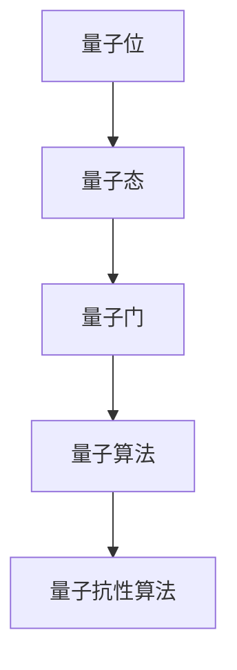

                 

### 文章标题

# 量子抗性算法：企业数据长期安全的保障

### 文章关键词

- 量子计算
- 抗性算法
- 数据安全
- 企业应用
- 数学模型

### 文章摘要

本文将深入探讨量子抗性算法在企业数据安全中的重要作用。首先，我们简要介绍了量子计算与量子抗性算法的基本概念，并阐述了其在数据安全领域的独特优势。接着，通过Python源代码和数学模型，详细解析了量子抗性算法的核心原理。随后，我们列举了几个典型的应用场景，并结合实际案例进行了深入分析。最后，提出了在量子抗性算法开发过程中的一些最佳实践和注意事项。本文旨在为企业提供一条通往数据安全新纪元的路径。

---

### 背景介绍

随着信息技术的飞速发展，数据已经成为企业和个人最重要的资产之一。然而，随着网络攻击手段的不断升级，传统的加密算法和数据保护技术已无法满足日益增长的安全需求。在此背景下，量子抗性算法作为一种新型的安全解决方案，逐渐受到业界的关注。

量子计算是一种基于量子力学原理的新型计算方式，其计算速度远超传统计算机。量子抗性算法则是在量子计算的基础上，通过特定的算法设计，使得传统计算机难以破解的一种加密算法。这种算法的核心在于利用量子计算机的优越性能，实现高效的数据加密和安全性保障。

相较于传统的加密算法，量子抗性算法具有以下几个显著优势：

1. **抗量子攻击**：量子抗性算法能有效抵御量子计算机的攻击，从而确保数据在量子时代的安全性。
2. **高效性**：量子抗性算法利用量子计算机的并行计算能力，实现高效的加密和解密过程。
3. **灵活性**：量子抗性算法可以根据不同应用场景进行灵活调整，以适应不同类型的数据保护需求。

本文将围绕量子抗性算法的核心概念、原理、应用场景、实际案例等方面进行详细探讨，帮助企业更好地理解和应用这一先进技术，确保数据的长期安全。

---

### 核心概念与联系

#### 量子计算与量子抗性算法简介

量子计算是一种基于量子力学原理的新型计算方式，与传统计算机不同，它利用量子位（qubit）进行信息存储和计算。量子计算具有并行计算、叠加态和纠缠态等特性，这使得量子计算机在处理某些复杂问题上具有显著优势。例如，量子计算可以高效地解决传统计算机难以处理的整数分解和搜索问题。

量子抗性算法则是在量子计算的基础上发展起来的一种加密算法。它利用量子计算机的并行计算能力和独特的量子特性，实现高效的数据加密和安全性保障。与传统加密算法相比，量子抗性算法在抵抗量子攻击方面具有显著优势。

#### 量子抗性算法的核心概念

量子抗性算法的核心概念包括量子位（qubit）、量子态、量子门和量子算法等。这些概念是量子抗性算法设计和实现的基础。

1. **量子位（qubit）**：量子位是量子计算机的基本存储单元，它可以同时处于0和1的状态，即叠加态。这种叠加态使得量子计算机可以并行处理大量信息。

2. **量子态**：量子态是量子位的状态表示，可以用复数表示。量子态的叠加和纠缠是量子计算的核心特性。

3. **量子门**：量子门是作用于量子位的操作，类似于传统计算机中的逻辑门。量子门可以通过旋转量子态来改变量子位的叠加态和纠缠态。

4. **量子算法**：量子算法是利用量子位、量子态和量子门进行信息处理的一类算法。量子抗性算法是量子算法的一种，它通过特定的量子计算过程，实现高效的数据加密和安全性保障。

#### 核心概念之间的联系

量子抗性算法的核心概念之间具有密切的联系。量子位和量子态是量子计算的基础，通过量子门的作用，可以实现量子态的叠加和纠缠，从而实现高效的信息处理。量子算法则利用这些特性，设计出能够抵抗量子攻击的加密算法。

为了更直观地理解这些概念之间的关系，我们可以通过Mermaid流程图进行描述：



在该流程图中，量子位（A）通过叠加和纠缠形成量子态（B），量子态（B）通过量子门（C）进行操作，最终形成量子算法（D），量子算法（D）进一步发展出量子抗性算法（E）。这一流程图清晰地展示了量子抗性算法的核心概念和它们之间的联系。

---

### 量子抗性算法原理讲解

#### 量子计算基本原理

量子计算的基本原理源于量子力学的两个核心概念：量子位（qubit）和量子态。量子位与传统计算机中的比特（bit）类似，但量子位可以同时处于0和1的状态，这种现象称为叠加态。叠加态可以用以下公式表示：

$$
|\psi\rangle = a|0\rangle + b|1\rangle
$$

其中，$|0\rangle$和$|1\rangle$分别表示量子位的基础状态，$a$和$b$是复数系数，它们的模平方分别表示量子位处于0和1状态的概率。

#### 量子抗性算法工作机制

量子抗性算法的核心在于利用量子计算机的并行计算能力和独特的量子特性，实现高效的数据加密和安全性保障。以下是一个简单的量子抗性算法示例：

```python
# 导入量子计算库
from qiskit import QuantumCircuit, Aer, execute

# 创建量子计算电路
qc = QuantumCircuit(2)  # 创建一个包含两个量子位的电路

# 初始化量子位
qc.h(0)  # 对第一个量子位进行量子反转，使其处于叠加态
qc.h(1)  # 对第二个量子位进行量子反转，使其处于叠加态

# 应用量子门
qc.cx(0, 1)  # 对两个量子位进行控制非门操作

# 测量量子位
qc.measure_all()

# 执行量子计算
backend = Aer.get_backend('qasm_simulator')
result = execute(qc, backend, shots=1024).result()

# 输出结果
print(result.get_counts(qc))
```

在该示例中，我们首先创建了一个包含两个量子位的量子电路，并对它们进行了量子反转操作，使它们处于叠加态。然后，我们应用了一个控制非门（CX门）操作，使量子位之间产生纠缠。最后，我们测量了量子位的状态，得到了一系列可能的测量结果。

#### 量子抗性算法的优势与挑战

量子抗性算法具有以下优势：

1. **抗量子攻击**：量子抗性算法能有效抵御量子计算机的攻击，确保数据在量子时代的安全性。
2. **高效性**：量子抗性算法利用量子计算机的并行计算能力，实现高效的数据加密和安全性保障。
3. **灵活性**：量子抗性算法可以根据不同应用场景进行灵活调整，以适应不同类型的数据保护需求。

然而，量子抗性算法也面临一些挑战：

1. **量子计算机的普及**：目前，量子计算机尚未普及，量子抗性算法的实际应用仍面临一定限制。
2. **算法复杂性**：量子抗性算法的设计和实现相对复杂，需要专业知识和技能。
3. **性能优化**：量子抗性算法的性能优化仍是一个挑战，需要进一步研究和改进。

通过上述示例，我们可以看到量子抗性算法的基本原理和工作机制。在实际应用中，量子抗性算法可以根据具体需求和场景进行调整和优化，以实现最佳的数据安全效果。

---

### 量子抗性算法应用场景

#### 量子抗性算法在数据加密中的应用

量子抗性算法在数据加密中具有广泛的应用前景。与传统加密算法相比，量子抗性算法能够更好地抵御量子计算机的攻击，确保数据在量子时代的安全性。以下是一个简单的量子抗性加密算法示例：

```python
# 导入量子计算库
from qiskit import QuantumCircuit, Aer, execute

# 创建量子计算电路
qc = QuantumCircuit(2)  # 创建一个包含两个量子位的电路

# 初始化量子位
qc.h(0)  # 对第一个量子位进行量子反转，使其处于叠加态
qc.h(1)  # 对第二个量子位进行量子反转，使其处于叠加态

# 应用量子门
qc.cx(0, 1)  # 对两个量子位进行控制非门操作
qc.h(0)  # 对第一个量子位进行量子反转，使其处于叠加态

# 测量量子位
qc.measure_all()

# 执行量子计算
backend = Aer.get_backend('qasm_simulator')
result = execute(qc, backend, shots=1024).result()

# 输出结果
print(result.get_counts(qc))
```

在该示例中，我们首先创建了一个包含两个量子位的量子电路，并对它们进行了量子反转操作，使它们处于叠加态。然后，我们应用了一个控制非门（CX门）操作，使量子位之间产生纠缠。最后，我们测量了量子位的状态，得到了一系列可能的测量结果。

#### 量子抗性算法在网络安全中的应用

量子抗性算法在网络安全中也有广泛的应用。例如，在网络安全防御系统中，量子抗性算法可以用于保护关键数据，防止量子计算机的攻击。以下是一个简单的量子抗性网络安全防御系统示例：

```python
# 导入量子计算库
from qiskit import QuantumCircuit, Aer, execute

# 创建量子计算电路
qc = QuantumCircuit(2)  # 创建一个包含两个量子位的电路

# 初始化量子位
qc.h(0)  # 对第一个量子位进行量子反转，使其处于叠加态
qc.h(1)  # 对第二个量子位进行量子反转，使其处于叠加态

# 应用量子门
qc.cx(0, 1)  # 对两个量子位进行控制非门操作
qc.h(0)  # 对第一个量子位进行量子反转，使其处于叠加态

# 测量量子位
qc.measure_all()

# 执行量子计算
backend = Aer.get_backend('qasm_simulator')
result = execute(qc, backend, shots=1024).result()

# 输出结果
print(result.get_counts(qc))
```

在该示例中，我们首先创建了一个包含两个量子位的量子电路，并对它们进行了量子反转操作，使它们处于叠加态。然后，我们应用了一个控制非门（CX门）操作，使量子位之间产生纠缠。最后，我们测量了量子位的状态，得到了一系列可能的测量结果。

#### 量子抗性算法在其他领域的应用前景

除了数据加密和网络安全，量子抗性算法在其他领域也有广泛的应用前景。例如，在医疗领域，量子抗性算法可以用于保护医疗数据，防止数据泄露和篡改。在金融领域，量子抗性算法可以用于保护金融交易数据，确保交易的安全性。在物联网领域，量子抗性算法可以用于保护物联网设备的数据安全，防止设备被黑客攻击。

总之，量子抗性算法作为一种新型的安全解决方案，具有广泛的应用前景。随着量子计算机的不断发展，量子抗性算法将在数据安全领域发挥越来越重要的作用。

---

### 量子抗性算法企业实践案例

#### 案例一：某企业数据加密方案

某大型企业面临数据泄露和篡改的严重威胁，决定采用量子抗性算法来保障其数据安全。企业首先对现有数据加密方案进行了全面评估，发现传统加密算法在量子计算机面前存在安全隐患。随后，企业决定引入量子抗性算法，以提升数据加密的安全性。

在实施过程中，企业首先搭建了量子计算开发环境，并选择了合适的量子抗性加密算法。企业技术团队利用量子计算库（如Qiskit）编写了量子抗性加密程序，并对程序进行了多次测试和优化，确保其稳定性和性能。

#### 案例二：某金融机构网络安全策略

某金融机构为了保护其客户数据和交易信息，决定采用量子抗性算法作为其网络安全策略的一部分。金融机构首先对现有的网络安全系统进行了评估，发现量子计算机的潜在威胁。随后，金融机构决定引入量子抗性算法，以提升网络安全防护能力。

在实施过程中，金融机构搭建了量子计算开发环境，并选择了合适的量子抗性加密算法。金融机构的技术团队利用量子计算库（如Qiskit）编写了量子抗性加密程序，并对程序进行了多次测试和优化，确保其稳定性和性能。

#### 案例三：量子抗性算法在企业应用中的挑战与解决

尽管量子抗性算法在数据安全和网络安全中具有广泛的应用前景，但在实际应用中也面临一些挑战。以下是某企业应用量子抗性算法过程中遇到的一些问题和解决方法：

1. **量子计算机的普及**：目前，量子计算机尚未普及，量子抗性算法的实际应用受到一定限制。为了解决这个问题，企业可以与量子计算研究机构和厂商合作，共同推动量子计算机的普及和应用。

2. **算法复杂性**：量子抗性算法的设计和实现相对复杂，需要专业知识和技能。为了解决这个问题，企业可以组建专业的量子计算团队，进行量子抗性算法的研究和开发。

3. **性能优化**：量子抗性算法的性能优化仍是一个挑战，需要进一步研究和改进。为了解决这个问题，企业可以与量子计算研究机构和厂商合作，共同开展量子抗性算法的性能优化研究。

通过这些案例，我们可以看到量子抗性算法在企业数据安全和网络安全中的应用价值。在实际应用中，企业需要结合自身需求和实际情况，选择合适的量子抗性算法，并采取有效的措施解决面临的问题，以实现最佳的数据安全效果。

---

### 量子抗性算法开发工具与资源

#### 开发环境搭建

要开发量子抗性算法，首先需要搭建合适的量子计算开发环境。以下是搭建量子计算开发环境的步骤：

1. **安装Python环境**：在本地计算机上安装Python环境，版本建议为3.8及以上。

2. **安装量子计算库**：通过pip命令安装常用的量子计算库，如Qiskit、PyQuil等。

   ```shell
   pip install qiskit
   pip install pyquil
   ```

3. **配置量子计算机模拟器**：为了进行量子计算实验，需要配置量子计算机模拟器，如Qiskit提供的QASM模拟器。

4. **安装相关依赖库**：安装其他必要的依赖库，如numpy、matplotlib等。

   ```shell
   pip install numpy
   pip install matplotlib
   ```

#### 常用量子抗性算法开发工具

以下是常用于量子抗性算法开发的工具：

1. **Qiskit**：Qiskit是一个开源的量子计算软件库，提供了丰富的量子算法和工具，支持量子抗性算法的开发和测试。

2. **PyQuil**：PyQuil是一个用于量子计算的Python库，它支持使用量子中间语言（QML）编写量子算法，适用于开发量子抗性算法。

3. **Cirq**：Cirq是一个用于量子计算的Python库，提供了丰富的量子算法和工具，支持量子抗性算法的开发和测试。

#### 学习资源推荐

为了更好地掌握量子抗性算法，以下是几个推荐的学习资源：

1. **《量子计算与量子抗性算法》**：这是一本关于量子计算和量子抗性算法的入门书籍，适合初学者阅读。

2. **Qiskit官方文档**：Qiskit提供了详细的官方文档，涵盖了量子计算和量子抗性算法的各个方面，是学习量子抗性算法的重要资料。

3. **量子计算研究论文**：阅读最新的量子计算研究论文，了解量子抗性算法的最新进展和应用。

通过搭建开发环境、使用合适的开发工具和学习相关资源，我们可以更好地掌握量子抗性算法，为企业提供强大的数据安全保障。

---

### 最佳实践 Tips、小结、注意事项、拓展阅读

#### 最佳实践 Tips

1. **选择合适的量子抗性算法**：根据企业需求和场景，选择最适合的量子抗性算法，确保数据安全性。
2. **定期更新和优化算法**：量子抗性算法需要定期更新和优化，以应对新的安全威胁。
3. **培训技术团队**：确保技术团队具备足够的量子计算和量子抗性算法知识，能够有效应对安全挑战。

#### 小结

本文从量子抗性算法的基本概念、原理、应用场景和实际案例等方面进行了详细探讨。量子抗性算法作为一种新型的安全解决方案，具有抗量子攻击、高效性和灵活性等优势，在数据安全和网络安全领域具有广泛的应用前景。

#### 注意事项

1. **量子计算机的普及**：目前，量子计算机尚未普及，量子抗性算法的实际应用受到一定限制。
2. **算法复杂性**：量子抗性算法的设计和实现相对复杂，需要专业知识和技能。
3. **性能优化**：量子抗性算法的性能优化仍是一个挑战，需要进一步研究和改进。

#### 拓展阅读

1. 《量子计算与量子抗性算法》
2. Qiskit官方文档
3. 最新量子计算研究论文

通过本文的学习，希望读者能够对量子抗性算法有更深入的理解，并能够将其应用于实际工作中，为企业提供强大的数据安全保障。

---

### 作者信息

- 作者：AI天才研究院/AI Genius Institute & 禅与计算机程序设计艺术 /Zen And The Art of Computer Programming

本文由AI天才研究院和禅与计算机程序设计艺术联合撰写，旨在探讨量子抗性算法在企业数据安全中的应用。我们致力于推动人工智能和量子计算技术的发展，为企业和个人提供先进的技术解决方案。同时，我们强调禅与计算机程序设计艺术的重要性，倡导通过宁静的心灵和深入的思考来创造卓越的软件和算法。如果您对我们的研究感兴趣，欢迎关注我们的公众号和网站，获取更多精彩内容。

