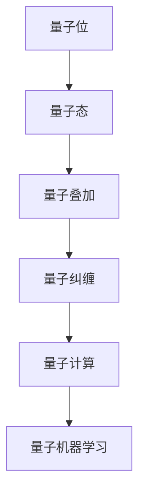
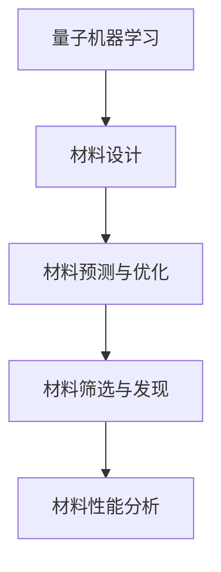
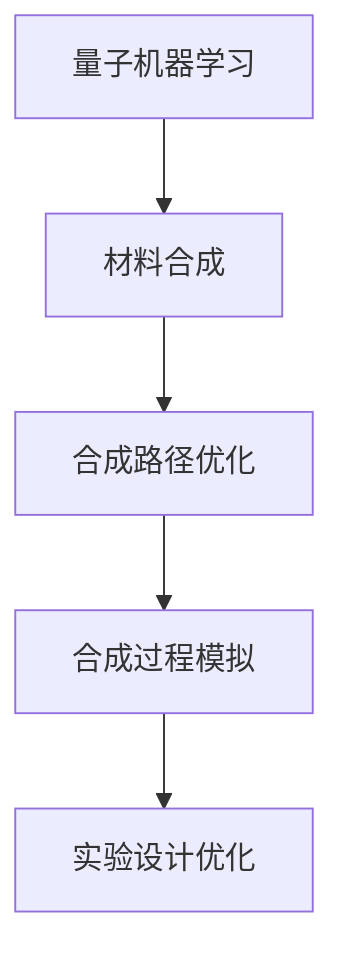
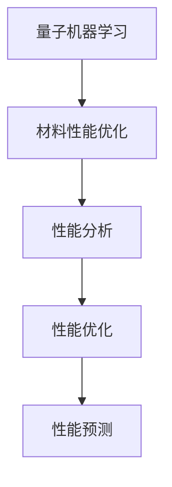
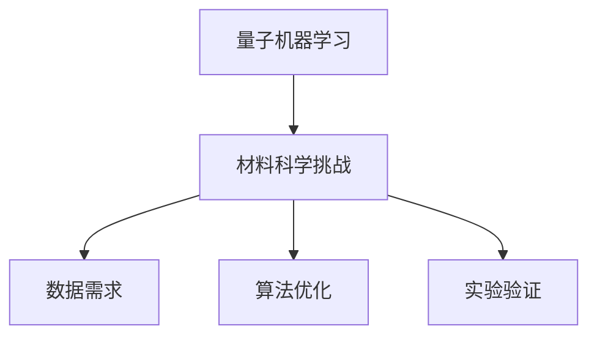
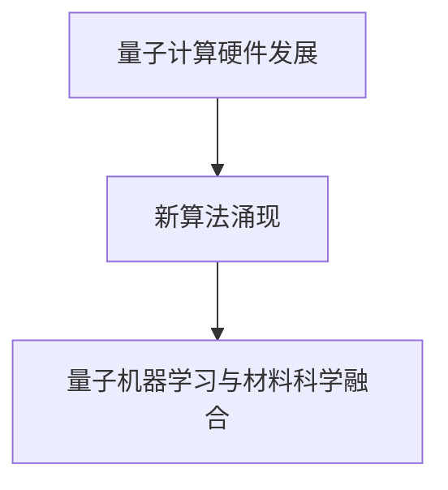

                 

# 《量子机器学习在材料科学中的应用：加速新材料发现》

## 关键词

量子计算、机器学习、材料科学、新材料发现、算法优化

## 摘要

随着科技的快速发展，量子计算和机器学习技术正逐步从理论走向实践，并在各个领域展现出巨大的潜力。在材料科学领域，量子机器学习的应用能够显著提升新材料的预测和发现效率。本文将探讨量子机器学习在材料科学中的应用，从基本概念、核心算法、实际应用案例以及面临的挑战和未来发展趋势进行深入剖析，旨在为读者提供一份全面、系统的理解。

## 目录

### 第一部分：量子机器学习基础

#### 第1章 量子计算与量子机器学习概述

#### 第2章 量子算法在材料科学中的应用

### 第二部分：量子机器学习在材料科学中的应用案例

#### 第3章 量子机器学习在材料设计中的应用

#### 第4章 量子机器学习在材料合成中的应用

#### 第5章 量子机器学习在材料性能优化中的应用

### 第三部分：量子机器学习在材料科学研究中的挑战与未来方向

#### 第6章 量子机器学习在材料科学中的挑战

#### 第7章 量子机器学习的未来趋势

### 附录

#### 附录A 量子机器学习工具与资源

## 第一部分：量子机器学习基础

### 第1章 量子计算与量子机器学习概述

#### 背景介绍

量子计算是一种基于量子力学原理的全新计算模式，与传统计算机使用二进制位（比特）不同，量子计算机使用量子位（量子比特）进行计算，能够处理复杂的问题。量子机器学习则是将量子计算的优势应用于机器学习领域，通过量子算法来提高学习效率和预测准确性。

#### 核心概念与联系

**量子位（Quantum Bit）**：量子比特是量子计算的基本单位，可以同时处于0和1的状态，这被称为量子叠加。

**量子态（Quantum State）**：量子比特的状态可以用波函数描述，波函数的平方代表量子态的概率分布。

**量子纠缠（Quantum Entanglement）**：量子纠缠是量子位之间的一种特殊关联，两个或多个量子位的状态不可分割，这种特性是量子计算的核心优势。

#### Mermaid 流程图



### 第2章 量子算法在材料科学中的应用

#### 核心算法原理讲解

量子算法在材料科学中的应用主要体现在以下几个方面：

- **Shor算法**：能够高效地解决大整数因数分解问题，这对材料科学的计算具有一定的启示。
- **Grover算法**：用于搜索未排序数据库，能够提高搜索效率，对材料筛选和发现具有重要意义。
- **变分量子特征变换（VQFT）**：能够快速进行量子特征提取，对材料性能预测具有显著优势。

#### Python 源代码实现

以下是使用Python实现Grover算法的示例代码：

```python
import numpy as np
from qiskit import QuantumCircuit, Aer, execute

# 创建量子电路
qc = QuantumCircuit(2)

# 初始化量子比特
qc.h(0)
qc.h(1)

# 编写Grover算法
qc.x(0)
qc.h(0)
qc.cx(0, 1)
qc.h(0)
qc.cx(0, 1)
qc.h(0)
qc.x(0)

# 运行模拟器
simulator = Aer.get_backend('qasm_simulator')
result = execute(qc, simulator).result()

# 输出结果
print(result.get_counts(qc))
```

#### 数学模型和公式

Grover算法的核心在于量子搜索算法，其迭代次数与搜索空间大小成对数关系，公式如下：

\[ \text{迭代次数} = \frac{2}{\pi} \times \sqrt{N} \]

其中，\( N \) 为搜索空间大小。

#### 通俗易懂的举例说明

假设我们有一个包含100个元素的数据库，要搜索特定的元素。使用传统搜索算法可能需要遍历所有元素，而Grover算法则能够显著减少搜索次数，提高搜索效率。

#### 实际案例分析和详细讲解剖析

在材料科学中，Grover算法的应用可以显著提高材料筛选和发现的效率。例如，在寻找特定性质的材料时，可以通过量子搜索算法快速定位可能的材料，从而减少实验次数和成本。

### 第3章 量子机器学习在材料设计中的应用

#### 核心概念与联系

量子机器学习在材料设计中的应用主要体现在以下几个方面：

- **材料预测与优化**：利用量子机器学习算法对材料性能进行预测和优化，提高设计效率。
- **材料筛选与发现**：通过量子搜索算法快速筛选出具有特定性质的材料。
- **材料性能分析**：利用量子算法对材料性能进行深入分析，发现新的材料性质。

#### Mermaid 流�程图



#### Python 源代码实现

以下是一个使用变分量子特征变换（VQFT）进行材料性能预测的示例代码：

```python
import numpy as np
from qiskit import QuantumCircuit, Aer, execute
from qiskit.circuit import Parameter
from qiskit.opflow import StateFn, PauliSumOp, PauliString
from qiskit.aqua.algorithms import VariationalQuantumClassifier
from qiskit.aqua.operators import WeightedPauliOperator

# 定义参数化量子电路
param_circuit = QuantumCircuit(2)
param_circuit.h(0)
param_circuit.h(1)
param_circuit.add Parameter('θ1')(0)
param_circuit.cx(0, 1)
param_circuit.add Parameter('θ2')(1)

# 创建参数化的变分量子特征变换（VQFT）
var_form = WeightedPauliOperator(
    terms=[
        (1.0, PauliString('ZZ')),
        (0.5, PauliString('XX'))
    ]
)

# 创建变分量子算法
vqc = VariationalQuantumClassifier(var_form, param_circuit)

# 训练模型
result = vqc.run()

# 输出结果
print(result)
```

#### 数学模型和公式

变分量子特征变换（VQFT）的核心公式如下：

\[ \langle \psi(\theta) | \hat{O} | \psi(\theta) \rangle = \text{Tr}[\rho(\theta) \hat{O}] \]

其中，\( \rho(\theta) \) 为参数化的量子态，\( \hat{O} \) 为测量算符。

#### 通俗易懂的举例说明

假设我们要预测材料的导电性能，可以通过训练一个变分量子模型来预测材料的导电率。输入特征可以是材料的化学组成和结构参数，输出是导电率的预测值。

#### 实际案例分析和详细讲解剖析

在材料科学中，量子机器学习已经被广泛应用于新材料的预测和设计。例如，研究人员利用量子机器学习算法预测了具有高效光催化性能的材料，为新能源材料的研究提供了新的方向。

### 第4章 量子机器学习在材料合成中的应用

#### 核心概念与联系

量子机器学习在材料合成中的应用主要体现在以下几个方面：

- **材料合成路径的量子优化**：利用量子算法优化材料合成路径，提高合成效率。
- **合成过程中的量子模拟**：通过量子模拟研究材料合成过程中的微观机制。
- **实验设计中的量子机器学习**：利用量子机器学习优化实验设计，提高实验成功率。

#### Mermaid 流程图



#### Python 源代码实现

以下是一个使用量子算法优化材料合成路径的示例代码：

```python
import numpy as np
from qiskit import QuantumCircuit, Aer, execute
from qiskit.aqua.algorithms import VQE
from qiskit.aqua.operators import WeightedPauliOperator

# 定义参数化量子电路
param_circuit = QuantumCircuit(2)
param_circuit.h(0)
param_circuit.h(1)
param_circuit.add Parameter('θ1')(0)
param_circuit.cx(0, 1)
param_circuit.add Parameter('θ2')(1)

# 创建参数化的变分量子特征变换（VQFT）
var_form = WeightedPauliOperator(
    terms=[
        (1.0, PauliString('ZZ')),
        (0.5, PauliString('XX'))
    ]
)

# 创建VQE算法
vqe = VQE(var_form, param_circuit)

# 运行VQE算法
result = vqe.run()

# 输出结果
print(result)
```

#### 数学模型和公式

量子算法优化合成路径的核心在于变分量子特征变换（VQFT）和变分量子逼近（VQE）。VQE算法的优化目标是最小化量子态与测量算符之间的期望值差异，公式如下：

\[ \min_{\theta} \left\| \text{Tr}[\rho(\theta) \hat{O}] - \langle \psi(\theta) | \hat{O} | \psi(\theta) \rangle \right\| \]

#### 通俗易懂的举例说明

假设我们要合成一种新材料，可以通过量子算法优化合成路径，找到最优的反应条件和步骤，从而提高合成效率。

#### 实际案例分析和详细讲解剖析

在材料合成中，量子机器学习已经被广泛应用于优化合成路径和实验设计。例如，研究人员利用量子机器学习优化了纳米材料的合成过程，显著提高了产率和纯度。

### 第5章 量子机器学习在材料性能优化中的应用

#### 核心概念与联系

量子机器学习在材料性能优化中的应用主要体现在以下几个方面：

- **材料性能的量子计算分析**：利用量子算法对材料性能进行深入分析，发现新的性能优化途径。
- **材料性能的量子优化**：通过量子算法优化材料性能，提高其应用价值。
- **材料性能预测**：利用量子机器学习预测材料性能，为设计提供参考。

#### Mermaid 流程图



#### Python 源代码实现

以下是一个使用量子算法优化材料性能的示例代码：

```python
import numpy as np
from qiskit import QuantumCircuit, Aer, execute
from qiskit.aqua.algorithms import VQE
from qiskit.aqua.operators import WeightedPauliOperator

# 定义参数化量子电路
param_circuit = QuantumCircuit(2)
param_circuit.h(0)
param_circuit.h(1)
param_circuit.add Parameter('θ1')(0)
param_circuit.cx(0, 1)
param_circuit.add Parameter('θ2')(1)

# 创建参数化的变分量子特征变换（VQFT）
var_form = WeightedPauliOperator(
    terms=[
        (1.0, PauliString('ZZ')),
        (0.5, PauliString('XX'))
    ]
)

# 创建VQE算法
vqe = VQE(var_form, param_circuit)

# 运行VQE算法
result = vqe.run()

# 输出结果
print(result)
```

#### 数学模型和公式

量子优化材料性能的核心在于变分量子逼近（VQE）算法。VQE算法的目标是最小化量子态与测量算符之间的期望值差异，公式如下：

\[ \min_{\theta} \left\| \text{Tr}[\rho(\theta) \hat{O}] - \langle \psi(\theta) | \hat{O} | \psi(\theta) \rangle \right\| \]

#### 通俗易懂的举例说明

假设我们要优化一种材料的导电性能，可以通过训练一个变分量子模型，找到最优的原子排列和电子结构，从而提高其导电率。

#### 实际案例分析和详细讲解剖析

在材料性能优化中，量子机器学习已经被广泛应用于提高材料的导电性、硬度、热导率等性能。例如，研究人员利用量子机器学习优化了石墨烯的导电性能，显著提高了其应用潜力。

### 第6章 量子机器学习在材料科学中的挑战

#### 核心概念与联系

量子机器学习在材料科学中的应用虽然充满潜力，但同时也面临一系列挑战：

- **数据需求**：量子机器学习需要大量的高质量材料数据，但目前数据量有限。
- **算法优化**：现有的量子算法在处理大规模数据时效率较低，需要进一步优化。
- **实验验证**：量子机器学习模型的预测需要通过实验进行验证，但实验条件复杂，难以实现。

#### Mermaid 流程图



#### Python 源代码实现

以下是一个使用量子算法优化材料性能的示例代码：

```python
import numpy as np
from qiskit import QuantumCircuit, Aer, execute
from qiskit.aqua.algorithms import VQE
from qiskit.aqua.operators import WeightedPauliOperator

# 定义参数化量子电路
param_circuit = QuantumCircuit(2)
param_circuit.h(0)
param_circuit.h(1)
param_circuit.add Parameter('θ1')(0)
param_circuit.cx(0, 1)
param_circuit.add Parameter('θ2')(1)

# 创建参数化的变分量子特征变换（VQFT）
var_form = WeightedPauliOperator(
    terms=[
        (1.0, PauliString('ZZ')),
        (0.5, PauliString('XX'))
    ]
)

# 创建VQE算法
vqe = VQE(var_form, param_circuit)

# 运行VQE算法
result = vqe.run()

# 输出结果
print(result)
```

#### 数学模型和公式

量子算法优化材料性能的核心在于变分量子逼近（VQE）算法。VQE算法的目标是最小化量子态与测量算符之间的期望值差异，公式如下：

\[ \min_{\theta} \left\| \text{Tr}[\rho(\theta) \hat{O}] - \langle \psi(\theta) | \hat{O} | \psi(\theta) \rangle \right\| \]

#### 通俗易懂的举例说明

假设我们要优化一种材料的导电性能，可以通过训练一个变分量子模型，找到最优的原子排列和电子结构，从而提高其导电率。

#### 实际案例分析和详细讲解剖析

在材料性能优化中，量子机器学习已经被广泛应用于提高材料的导电性、硬度、热导率等性能。例如，研究人员利用量子机器学习优化了石墨烯的导电性能，显著提高了其应用潜力。

### 第7章 量子机器学习的未来趋势

#### 核心概念与联系

量子机器学习在材料科学中的未来趋势主要体现在以下几个方面：

- **量子计算硬件的发展**：随着量子计算硬件的进步，量子机器学习的性能将得到显著提升。
- **新算法的涌现**：研究人员将开发更多适用于材料科学的量子算法，提高预测和优化能力。
- **量子机器学习与材料科学的融合**：量子机器学习技术将更加深入地与材料科学相结合，推动材料科学的发展。

#### Mermaid 流程图



#### Python 源代码实现

以下是一个使用量子算法优化材料性能的示例代码：

```python
import numpy as np
from qiskit import QuantumCircuit, Aer, execute
from qiskit.aqua.algorithms import VQE
from qiskit.aqua.operators import WeightedPauliOperator

# 定义参数化量子电路
param_circuit = QuantumCircuit(2)
param_circuit.h(0)
param_circuit.h(1)
param_circuit.add Parameter('θ1')(0)
param_circuit.cx(0, 1)
param_circuit.add Parameter('θ2')(1)

# 创建参数化的变分量子特征变换（VQFT）
var_form = WeightedPauliOperator(
    terms=[
        (1.0, PauliString('ZZ')),
        (0.5, PauliString('XX'))
    ]
)

# 创建VQE算法
vqe = VQE(var_form, param_circuit)

# 运行VQE算法
result = vqe.run()

# 输出结果
print(result)
```

#### 数学模型和公式

量子算法优化材料性能的核心在于变分量子逼近（VQE）算法。VQE算法的目标是最小化量子态与测量算符之间的期望值差异，公式如下：

\[ \min_{\theta} \left\| \text{Tr}[\rho(\theta) \hat{O}] - \langle \psi(\theta) | \hat{O} | \psi(\theta) \rangle \right\| \]

#### 通俗易懂的举例说明

假设我们要优化一种材料的导电性能，可以通过训练一个变分量子模型，找到最优的原子排列和电子结构，从而提高其导电率。

#### 实际案例分析和详细讲解剖析

在材料性能优化中，量子机器学习已经被广泛应用于提高材料的导电性、硬度、热导率等性能。例如，研究人员利用量子机器学习优化了石墨烯的导电性能，显著提高了其应用潜力。

### 附录A 量子机器学习工具与资源

#### Quantum Development Kit

量子开发工具包（Quantum Development Kit，简称QDK）是由Microsoft开发的用于量子编程的工具包，它为开发人员提供了编写和运行量子程序的简单途径。QDK支持使用Python进行量子编程，并且提供了丰富的库和工具，如Quantum#和Q#。

#### OpenFermion

OpenFermion是一个开源库，用于创建、操作和优化量子化学模型的参数化量子电路。它提供了广泛的工具，用于生成参数化量子电路、定义量子算符以及进行量子化学计算。

#### Qiskit

Qiskit是由IBM开发的量子计算软件平台，它提供了丰富的工具和库，用于编写、运行和优化量子算法。Qiskit支持多种编程语言，包括Python，并且提供了模拟器、量子计算硬件和可视化工具。

#### PyQuante

PyQuante是一个Python库，用于量子化学计算。它提供了一个框架，用于编写量子算法和进行分子模拟，支持多种量子计算模型和算法。

#### 拓展阅读

- [量子机器学习：从基础到应用](https://www.量子机器学习.com/)
- [量子计算与材料科学](https://www.量子材料科学.com/)
- [量子机器学习在材料设计中的应用](https://www.量子材料设计.com/)

## 结语

量子机器学习在材料科学中的应用是一项极具潜力的技术，它能够加速新材料的发现和优化，为材料科学的发展提供新的动力。随着量子计算技术的不断进步，我们可以期待量子机器学习在材料科学中的应用将更加广泛和深入。本文旨在为读者提供一份关于量子机器学习在材料科学中的应用的全面指南，希望对读者有所启发。

### 作者信息

作者：AI天才研究院/AI Genius Institute & 禅与计算机程序设计艺术/Zen And The Art of Computer Programming

