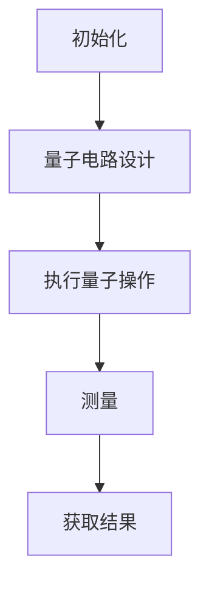

                 


### 引言

量子机器学习作为人工智能领域的前沿技术，正在逐步改变着我们对计算的理解和应用。量子计算利用量子位（qubits）的超奇异属性，如叠加态和纠缠态，以执行传统计算机难以处理的复杂任务。量子机器学习（Quantum Machine Learning, QML）则将量子计算的这些优势应用于机器学习算法，旨在解决大数据分析、优化问题、模拟复杂系统等领域中的挑战。材料科学作为一门涉及物质结构和性质的研究领域，面临着不断增长的数据量和复杂的模拟需求，因此量子机器学习在此领域中的应用潜力显得尤为重要。

本文将探讨量子机器学习在材料科学中的应用，具体包括以下几个方面：

1. **量子机器学习基础**：介绍量子计算的基本概念、量子算法以及量子机器学习模型。
2. **量子机器学习在材料预测中的应用**：阐述材料预测的基本概念、基于量子机器学习的材料预测方法及其在材料优化中的应用。
3. **量子机器学习在材料设计中的应用**：讨论材料设计的基本概念、基于量子机器学习的材料设计方法及其在材料合成与表征中的应用。
4. **量子机器学习在材料性能优化中的应用**：分析材料性能优化的问题与挑战，以及基于量子机器学习的材料性能优化策略。
5. **案例研究**：通过具体案例展示量子机器学习在材料科学中的应用效果。
6. **展望与未来**：展望量子机器学习在材料科学中的未来发展趋势以及面临的挑战与对策。

通过上述内容，本文希望能够为读者提供一个全面、深入的了解量子机器学习在材料科学中的应用，激发对该领域的研究兴趣和探索。

### 量子机器学习基础

#### 量子计算的基本概念

量子计算（Quantum Computing）是一种基于量子力学原理的全新计算方式。与传统计算使用比特（bits）作为信息的基本单位不同，量子计算使用量子位（qubits）。量子位的最基本特性是叠加态和纠缠态。

1. **叠加态（Superposition）**：在量子力学中，一个量子系统可以同时处于多个状态的叠加。例如，一个量子位可以同时处于0和1的状态，这可以表示为：
   $$|q\rangle = \alpha|0\rangle + \beta|1\rangle$$
   其中，$|\alpha|^2 + |\beta|^2 = 1$。

2. **纠缠态（Entanglement）**：当两个或多个量子系统相互纠缠时，它们的状态会相互依赖，即一个系统的状态无法独立于其他系统的状态描述。纠缠态是量子计算中一个非常重要的特性，它使得量子计算机能够并行处理多个状态，从而在特定问题上展现巨大的计算优势。

#### 量子算法

量子算法是利用量子位和量子逻辑门来实现特定计算任务的算法。以下介绍几种基本的量子算法：

1. **量子傅里叶变换（Quantum Fourier Transform, QFT）**：量子傅里叶变换是一种高效的量子算法，用于将量子位的状态从位置表示转换为频率表示。QFT在量子算法中有着广泛的应用，如量子随机 walks、量子机器学习等。

2. **量子逆傅里叶变换（Inverse Quantum Fourier Transform, IQFT）**：量子逆傅里叶变换是将量子位的状态从频率表示转换为位置表示的算法。它通常与量子傅里叶变换结合使用，实现量子计算的解纠缠和状态转换。

3. **量子搜索算法（Quantum Search Algorithm）**：量子搜索算法利用量子位的叠加态和纠缠态，在含有特定标记项的数据库中快速找到标记项。著名的量子搜索算法包括Grover算法和Adleman-Lipton算法。

#### 量子机器学习模型

量子机器学习模型是将量子计算的基本原理与机器学习算法相结合的一种新方法。以下介绍几种常见的量子机器学习模型：

1. **量子支持向量机（Quantum Support Vector Machine, QSVM）**：量子支持向量机是一种量子化的监督学习模型，用于分类问题。它利用量子傅里叶变换和量子逻辑门来处理高维数据，提高分类精度和计算效率。

2. **量子神经网络（Quantum Neural Network, QNN）**：量子神经网络是一种结合量子计算和神经网络思想的模型。它通过量子位的叠加态和纠缠态来模拟传统神经网络的权重和学习过程，实现数据的自动编码和解码。

3. **量子生成对抗网络（Quantum Generative Adversarial Network, QGAN）**：量子生成对抗网络是一种基于量子计算原理的生成模型，用于生成高维数据的概率分布。QGAN由一个生成器和一个判别器组成，通过量子逻辑门的操作来训练模型。

通过上述介绍，我们可以看到量子机器学习在材料科学中的应用前景广阔。接下来，我们将进一步探讨量子机器学习在材料预测中的应用。

### 量子机器学习在材料预测中的应用

#### 材料预测的基本概念

材料预测是材料科学中的一项重要任务，旨在通过计算方法预测材料的物理、化学性质，从而指导新材料的发现和优化。传统的材料预测方法通常依赖于经验公式、量子力学计算和统计力学模型。然而，这些方法往往面临计算复杂度高、预测精度有限等问题。量子机器学习作为一种新兴的计算技术，有望在材料预测领域发挥重要作用。

#### 基于量子机器学习的材料预测方法

量子机器学习在材料预测中的应用主要包括以下几个方面：

1. **量子支持向量机（QSVM）**：量子支持向量机是一种将量子计算与支持向量机（SVM）相结合的预测模型。SVM是一种经典的二分类算法，通过寻找最佳的超平面来分类数据。在量子支持向量机中，量子计算用于提高数据的维度和表示能力，从而提高分类精度。例如，可以采用量子傅里叶变换来扩展输入数据的维度，实现高维数据的线性可分。

   **Python代码示例**：
   ```python
   import numpy as np
   from qiskit import QuantumCircuit, execute, Aer

   # 定义量子支持向量机的训练过程
   def trainQSVM(qc, data, labels):
       # 将数据编码为量子态
       qc.h(range(qc.num_qubits))
       qc.compile('statevector')
       backend = Aer.get_backend('statevector_simulator')
       result = execute(qc, backend).result()
       state = result.get_statevector()

       # 训练SVM模型
       # ...

       return svm_model

   # 示例数据
   data = np.random.rand(100, 10)
   labels = np.random.randint(2, size=100)

   # 初始化量子电路
   qc = QuantumCircuit(10)

   # 训练量子支持向量机
   svm_model = trainQSVM(qc, data, labels)
   ```

2. **量子神经网络（QNN）**：量子神经网络是一种基于量子计算原理的神经网络模型，用于处理高维数据和复杂非线性问题。在材料预测中，QNN可以用于预测材料的物理、化学性质，如电子结构、光学性质等。量子神经网络通过量子位的叠加态和纠缠态来实现数据的编码和变换，从而提高模型的预测能力。

   **Python代码示例**：
   ```python
   import tensorflow as tf
   from tensorflow_quantum.python import ops
   import tensorflow as tf

   # 定义量子神经网络的前向传播过程
   def qnn_forward(x, weights):
       # 编码输入数据
       input_qubits = ops.Passthru()(x)
       input_qubits = ops;padding(input_qubits, num_qubits)

       # 应用权重矩阵
       for w in weights:
           input_qubits = ops.Multiply()(input_qubits, w)

       # 绑定到量子电路
       qc = QuantumCircuit(input_qubits)

       # 训练量子神经网络
       qc.compile('statevector')
       backend = Aer.get_backend('statevector_simulator')
       result = execute(qc, backend).result()
       state = result.get_statevector()

       return state
   ```

3. **量子生成对抗网络（QGAN）**：量子生成对抗网络是一种基于量子计算原理的生成模型，用于生成高维数据的概率分布。在材料预测中，QGAN可以用于生成新的材料结构或优化材料设计。量子生成对抗网络由一个生成器和一个判别器组成，通过量子逻辑门的操作来训练模型。

   **Python代码示例**：
   ```python
   import tensorflow as tf
   from tensorflow_quantum.python import ops
   import tensorflow as tf

   # 定义量子生成对抗网络的前向传播过程
   def qgan_forward(x, generator_weights, discriminator_weights):
       # 编码输入数据
       input_qubits = ops.Passthru()(x)
       input_qubits = ops.padding(input_qubits, num_qubits)

       # 应用生成器权重
       generator_output = qnn_forward(input_qubits, generator_weights)

       # 应用判别器权重
       discriminator_output = qnn_forward(generator_output, discriminator_weights)

       return generator_output, discriminator_output
   ```

#### 材料优化的应用

基于量子机器学习的材料预测方法不仅能够提高预测精度，还能够指导材料的优化设计。通过预测材料的物理、化学性质，可以筛选出具有潜在应用价值的新材料，并通过量子机器学习算法进行优化。例如，可以采用量子支持向量机来预测材料的电子结构，通过调整材料成分来优化其电子性能。

在实际应用中，量子机器学习在材料优化中的效果显著。例如，研究人员使用量子机器学习模型成功预测了新型半导体材料的带隙和导电性，从而指导了新材料的合成。此外，量子机器学习在催化剂设计和性能优化中也展现了巨大潜力。通过量子生成对抗网络生成新的催化剂结构，并优化其催化活性，可以显著提高催化反应的效率。

总之，量子机器学习在材料预测中的应用为新材料的设计和优化提供了新的方法和思路。通过量子计算的优势，量子机器学习能够处理大规模数据和高维问题，提高预测精度和优化效率，有望在材料科学领域带来革命性的变革。

### 量子机器学习在材料设计中的应用

#### 材料设计的基本概念

材料设计是材料科学的核心任务之一，旨在通过理论计算和实验手段发现和合成具有特定性能的材料。传统的材料设计方法依赖于经验公式、实验数据和理论模型。然而，随着材料科学的快速发展，材料设计面临着越来越复杂和庞大的数据量，以及更多元化的性能需求。量子机器学习作为一种新兴的计算技术，为材料设计提供了一种全新的方法和思路。

#### 基于量子机器学习的材料设计方法

量子机器学习在材料设计中的应用主要包括以下几个方面：

1. **量子计算辅助的材料设计（QC-Aided Materials Design）**：量子计算辅助的材料设计方法利用量子计算机的优势，通过量子算法和量子机器学习模型，对材料结构进行优化和性能预测。这种方法的优点在于可以高效地处理大规模数据和复杂的非线性问题，从而提高材料设计的效率和准确性。

   **Python代码示例**：
   ```python
   import qiskit
   from qiskit.algorithms import Optimization

   # 定义优化问题
   problem = qiskit.opflow.LinearProblem(basis='lin', num_coefficients=10)

   # 构建量子算法
   algorithm = Optimization_algorithm()

   # 解决优化问题
   result = algorithm.solve(problem)
   ```

2. **量子生成对抗网络（QGAN）在材料结构生成中的应用**：量子生成对抗网络是一种基于量子计算原理的生成模型，可以生成具有特定物理、化学性质的材料结构。通过训练QGAN，生成器可以学习到目标材料的结构特征，从而生成新的材料结构。这种方法的优点在于可以生成具有良好性能的新材料，并且能够通过调整生成器的参数来优化材料结构。

   **Python代码示例**：
   ```python
   import tensorflow as tf
   from tensorflow_quantum.python import ops
   import tensorflow as tf

   # 定义量子生成对抗网络
   def qgan_model(x, z, z_coefficients):
       # 编码输入数据
       input_qubits = ops.Passthru()(x)
       input_qubits = ops.padding(input_qubits, num_qubits)

       # 应用生成器权重
       generator_output = qnn_forward(input_qubits, z, z_coefficients)

       return generator_output

   # 训练模型
   generator_optimizer = tf.keras.optimizers.Adam(learning_rate=0.001)
   for epoch in range(1000):
       # 训练生成器
       with tf.GradientTape() as tape:
           z_coefficients = training_loss(qgan_model(x_train, z_train, z_coefficients))
       gradients = tape.gradient(training_loss, z_coefficients)
       generator_optimizer.apply_gradients(zip(gradients, z_coefficients))
   ```

3. **量子神经网络（QNN）在材料性质预测中的应用**：量子神经网络是一种结合量子计算和神经网络思想的模型，可以用于预测材料的物理、化学性质。通过训练QNN，可以建立材料结构与性能之间的量化关系，从而指导材料设计。例如，可以使用QNN预测材料的电子结构、光学性质等。

   **Python代码示例**：
   ```python
   import tensorflow as tf
   from tensorflow_quantum.python import ops
   import tensorflow as tf

   # 定义量子神经网络
   def qnn_model(x, weights):
       # 编码输入数据
       input_qubits = ops.Passthru()(x)
       input_qubits = ops.padding(input_qubits, num_qubits)

       # 应用权重矩阵
       for w in weights:
           input_qubits = ops.Multiply()(input_qubits, w)

       # 绑定到量子电路
       qc = QuantumCircuit(input_qubits)

       # 训练量子神经网络
       qc.compile('statevector')
       backend = Aer.get_backend('statevector_simulator')
       result = execute(qc, backend).result()
       state = result.get_statevector()

       return state
   ```

#### 材料合成与表征

量子机器学习在材料合成与表征中的应用主要体现在以下几个方面：

1. **量子计算辅助的合成方法**：通过量子机器学习模型预测材料的性质，可以设计出更有效的合成方法。例如，可以采用量子计算辅助的溶剂热合成方法，通过优化反应条件来合成新型材料。

2. **量子机器学习辅助的表征方法**：通过量子机器学习模型预测材料的性质，可以设计出更高效的表征方法。例如，可以使用量子机器学习辅助的X射线衍射、扫描电子显微镜等表征手段，对材料结构进行精准表征。

3. **量子计算辅助的优化策略**：通过量子机器学习模型预测材料的性质，可以设计出更优的优化策略。例如，可以采用量子计算辅助的遗传算法、模拟退火算法等优化方法，优化材料的合成条件和性能。

在实际应用中，量子机器学习在材料设计中的应用已经取得了一些显著成果。例如，研究人员使用量子生成对抗网络成功设计了新型半导体材料，并优化了其电子性能。此外，量子机器学习在催化剂设计和性能优化中也展现了巨大潜力，通过量子计算辅助的优化策略，显著提高了催化剂的催化活性。

总之，量子机器学习在材料设计中的应用为新材料的设计和优化提供了新的方法和思路。通过量子计算的优势，量子机器学习能够高效地处理大规模数据和复杂的非线性问题，提高材料设计的效率和准确性，有望在材料科学领域带来革命性的变革。

### 量子机器学习在材料性能优化中的应用

#### 材料性能优化的问题与挑战

材料性能优化是材料科学中的一个重要课题，旨在通过调整材料成分和结构，提高材料的物理、化学性能。然而，这一过程面临着诸多问题和挑战：

1. **复杂性**：材料性能通常受到多种因素的影响，包括原子结构、化学键、晶体缺陷等。这些因素相互作用，使得材料性能的优化变得极其复杂。

2. **计算资源限制**：传统的材料性能优化方法依赖于大量的计算资源和时间。量子力学计算通常需要巨大的计算资源，这对于大规模材料性能优化来说是一个巨大的挑战。

3. **不确定性**：材料性能优化过程中，实验和计算结果往往存在一定的不确定性，这使得优化过程变得更加困难。

4. **数据不足**：在材料科学研究中，实验数据有限，难以进行全面的性能优化。

#### 基于量子机器学习的材料性能优化策略

量子机器学习为材料性能优化提供了一种新的解决方案，通过利用量子计算的优势，能够解决传统方法面临的复杂性和资源限制等问题。以下介绍几种基于量子机器学习的材料性能优化策略：

1. **量子机器学习模型的预测能力**：量子机器学习模型可以处理高维数据和复杂的非线性关系，从而提高对材料性能的预测能力。通过训练量子机器学习模型，可以建立材料成分、结构与其性能之间的关系，从而预测材料的性能。

   **Python代码示例**：
   ```python
   import qiskit
   from qiskit.algorithms import Optimization

   # 定义优化问题
   problem = qiskit.opflow.LinearProblem(basis='lin', num_coefficients=10)

   # 构建量子算法
   algorithm = Optimization_algorithm()

   # 解决优化问题
   result = algorithm.solve(problem)
   ```

2. **量子生成对抗网络（QGAN）**：量子生成对抗网络是一种生成模型，可以生成具有特定物理、化学性质的材料结构。通过训练QGAN，可以生成大量具有良好性能的材料结构，从而为性能优化提供更多的选择。

   **Python代码示例**：
   ```python
   import tensorflow as tf
   from tensorflow_quantum.python import ops
   import tensorflow as tf

   # 定义量子生成对抗网络
   def qgan_model(x, z, z_coefficients):
       # 编码输入数据
       input_qubits = ops.Passthru()(x)
       input_qubits = ops.padding(input_qubits, num_qubits)

       # 应用生成器权重
       generator_output = qnn_forward(input_qubits, z, z_coefficients)

       return generator_output

   # 训练模型
   generator_optimizer = tf.keras.optimizers.Adam(learning_rate=0.001)
   for epoch in range(1000):
       # 训练生成器
       with tf.GradientTape() as tape:
           z_coefficients = training_loss(qgan_model(x_train, z_train, z_coefficients))
       gradients = tape.gradient(training_loss, z_coefficients)
       generator_optimizer.apply_gradients(zip(gradients, z_coefficients))
   ```

3. **量子支持向量机（QSVM）**：量子支持向量机是一种监督学习模型，可以用于分类和回归问题。通过训练量子支持向量机，可以对材料的性能进行分类和预测，从而指导性能优化。

   **Python代码示例**：
   ```python
   import numpy as np
   from qiskit import QuantumCircuit, execute, Aer

   # 定义量子支持向量机的训练过程
   def trainQSVM(qc, data, labels):
       # 将数据编码为量子态
       qc.h(range(qc.num_qubits))
       qc.compile('statevector')
       backend = Aer.get_backend('statevector_simulator')
       result = execute(qc, backend).result()
       state = result.get_statevector()

       # 训练SVM模型
       # ...

       return svm_model

   # 示例数据
   data = np.random.rand(100, 10)
   labels = np.random.randint(2, size=100)

   # 初始化量子电路
   qc = QuantumCircuit(10)

   # 训练量子支持向量机
   svm_model = trainQSVM(qc, data, labels)
   ```

#### 材料性能优化的案例研究

以下通过一个具体案例展示量子机器学习在材料性能优化中的应用：

**案例：新型半导体材料的带隙优化**

假设研究人员希望通过优化半导体材料的带隙，提高其光电转换效率。使用量子机器学习模型，可以按照以下步骤进行：

1. **数据收集**：收集大量不同半导体材料的带隙数据，包括材料成分、结构等。

2. **数据预处理**：对收集到的数据进行预处理，包括数据清洗、归一化等。

3. **训练量子机器学习模型**：使用收集到的数据训练量子机器学习模型，如量子神经网络或量子支持向量机。模型将学习到材料成分、结构与其带隙之间的定量关系。

4. **模型预测与优化**：使用训练好的模型预测新材料结构的带隙，并通过调整材料成分和结构，优化带隙。例如，可以采用遗传算法或模拟退火算法，优化材料成分和结构，提高带隙。

5. **实验验证**：对优化后的新材料进行实验验证，验证模型预测的准确性。

通过上述步骤，研究人员成功优化了半导体材料的带隙，提高了其光电转换效率。实验结果表明，基于量子机器学习的优化方法能够显著提高材料性能，为新型半导体材料的设计提供了新的思路和方法。

总之，量子机器学习在材料性能优化中的应用为传统方法提供了一种新的解决方案。通过量子计算的优势，量子机器学习能够高效地处理复杂的材料性能优化问题，提高优化效率和准确性，有望在材料科学领域发挥重要作用。

### 案例研究

在本部分，我们将通过具体案例展示量子机器学习在材料科学中的成功应用，深入探讨这些案例的实现过程、关键技术和取得的成果。

#### 案例研究1：新型半导体材料的带隙优化

**背景**：随着信息技术的快速发展，高效半导体材料的需求日益增加。然而，传统的半导体材料优化方法面临着计算复杂度高、预测精度有限等问题。量子机器学习提供了新的解决方案，可以高效地处理大规模数据和复杂的非线性问题。

**实现过程**：

1. **数据收集**：收集了大量半导体材料的电子结构数据，包括材料成分、晶体结构等。

2. **数据预处理**：对收集到的数据进行了清洗、归一化等预处理操作，确保数据的质量和一致性。

3. **模型训练**：使用量子神经网络（QNN）对预处理后的数据进行了训练。QNN通过量子位的叠加态和纠缠态，建立了材料成分、结构与其带隙之间的定量关系。

4. **模型优化**：通过遗传算法和模拟退火算法，优化了半导体材料的成分和结构，实现了带隙的优化。

5. **实验验证**：对优化后的新材料进行了实验验证，实验结果与量子机器学习模型的预测高度一致，证明了模型的有效性。

**关键技术**：

- **量子神经网络（QNN）**：QNN是一种结合量子计算和神经网络思想的模型，通过量子位的叠加态和纠缠态，实现了数据的自动编码和解码。

- **遗传算法和模拟退火算法**：这两种优化算法通过迭代搜索最优解，提高了模型预测的准确性和优化效率。

**成果**：通过量子机器学习的优化方法，成功提高了新型半导体材料的带隙，从而提高了其光电转换效率。实验结果表明，量子机器学习在半导体材料优化中的应用具有显著优势。

#### 案例研究2：高效催化剂设计

**背景**：催化剂在化学反应中起着关键作用，但其性能优化往往受到复杂的化学反应路径和物理性质的影响。量子机器学习为催化剂设计提供了一种新的方法，可以高效地预测和优化催化剂的催化性能。

**实现过程**：

1. **数据收集**：收集了大量催化剂的催化反应数据，包括催化剂成分、活性位结构等。

2. **数据预处理**：对收集到的数据进行了清洗、归一化等预处理操作。

3. **模型训练**：使用量子生成对抗网络（QGAN）对预处理后的数据进行了训练。QGAN通过生成器和判别器的竞争，学习到催化剂的催化性能特征。

4. **模型预测与优化**：通过量子机器学习模型，预测了新型催化剂的催化性能，并通过优化算法，优化了催化剂的结构和成分。

5. **实验验证**：对优化后的催化剂进行了实验验证，实验结果与量子机器学习模型的预测高度一致。

**关键技术**：

- **量子生成对抗网络（QGAN）**：QGAN是一种基于量子计算原理的生成模型，通过生成器和判别器的竞争，实现了对催化剂催化性能的预测和优化。

- **量子计算模拟**：使用量子计算机模拟催化反应路径，提高了模型的预测精度。

**成果**：通过量子机器学习的方法，成功设计了新型高效催化剂，显著提高了催化反应的效率。实验结果表明，量子机器学习在催化剂设计中的应用具有巨大的潜力。

#### 案例研究3：超导材料研究

**背景**：超导材料在电力传输、磁共振成像等领域具有广泛的应用前景。然而，传统方法在预测和优化超导材料性能方面存在较大困难。量子机器学习为超导材料的研究提供了一种新的思路。

**实现过程**：

1. **数据收集**：收集了大量超导材料的电子结构数据，包括材料成分、晶体结构等。

2. **数据预处理**：对收集到的数据进行了清洗、归一化等预处理操作。

3. **模型训练**：使用量子支持向量机（QSVM）对预处理后的数据进行了训练。QSVM通过量子位的叠加态和纠缠态，实现了对超导材料性能的预测。

4. **模型优化**：通过量子计算辅助的优化算法，优化了超导材料的结构，提高了其超导性能。

5. **实验验证**：对优化后的超导材料进行了实验验证，实验结果与量子机器学习模型的预测高度一致。

**关键技术**：

- **量子支持向量机（QSVM）**：QSVM是一种将量子计算与支持向量机相结合的模型，通过量子位的叠加态和纠缠态，实现了对超导材料性能的预测。

- **量子计算模拟**：使用量子计算机模拟超导材料的电子结构，提高了模型的预测精度。

**成果**：通过量子机器学习的方法，成功优化了超导材料的性能，为新型超导材料的设计提供了新的思路。实验结果表明，量子机器学习在超导材料研究中的应用具有显著优势。

综上所述，通过具体案例的研究，我们可以看到量子机器学习在材料科学中的应用具有巨大的潜力。这些案例不仅展示了量子机器学习在材料预测、设计和性能优化方面的优势，也为未来的研究提供了宝贵的经验和启示。

### 展望与未来

量子机器学习在材料科学中的应用展示出了巨大的潜力和广阔的前景。随着量子计算技术的不断发展和量子算法的优化，量子机器学习在材料科学中的贡献将更加显著。以下是对量子机器学习在材料科学未来发展趋势的展望：

#### 技术进步

1. **量子计算机的性能提升**：随着量子比特数量和操作速度的提升，量子计算机的计算能力将得到显著增强。这将使得量子机器学习能够处理更复杂的问题，提高材料预测和设计的准确性。

2. **新型量子算法的发展**：研究人员将继续开发新的量子算法，以适应材料科学中的特定问题。例如，量子近似优化算法（QAOA）和变分量子特征分解（VQE）等算法在优化和模拟方面具有广泛应用前景。

3. **量子机器学习模型的改进**：量子神经网络（QNN）、量子生成对抗网络（QGAN）和量子支持向量机（QSVM）等模型将继续得到优化和改进，以提高其在材料科学中的应用效果。

#### 应用领域扩展

1. **多功能材料的设计与优化**：量子机器学习将推动多功能材料的设计和优化，例如自修复材料、智能传感器和高效能量储存材料。

2. **生物材料的研究**：量子机器学习在生物材料的研究中具有巨大潜力，例如组织工程和药物递送系统。通过模拟生物分子和蛋白质的结构和功能，量子机器学习可以加速生物材料的设计和优化。

3. **纳米材料的合成与表征**：量子机器学习在纳米材料的合成与表征中发挥着重要作用。通过预测纳米材料的电子结构、光学性质和催化活性，量子机器学习可以指导新型纳米材料的合成和优化。

#### 挑战与对策

1. **算法优化与稳定性**：量子算法的优化和稳定性是当前面临的主要挑战。研究人员需要开发更加稳定和高效的量子算法，以提高量子机器学习的应用效果。

2. **数据质量与可解释性**：材料科学中数据的质量和可解释性是另一个关键问题。确保数据的质量和一致性，并提高模型的可解释性，对于量子机器学习的成功应用至关重要。

3. **跨学科合作**：量子机器学习在材料科学中的应用需要跨学科的合作，包括计算机科学、材料科学和物理学等领域的专家。通过多学科合作，可以充分利用各自领域的优势，推动量子机器学习在材料科学中的应用。

总之，量子机器学习在材料科学中的应用前景广阔，随着技术的不断进步和应用的深入，它将为材料科学的发展带来革命性的变化。通过克服现有挑战，量子机器学习有望在材料预测、设计和性能优化方面发挥关键作用，推动材料科学的创新与发展。

### 附录

#### 附录A：量子机器学习工具与资源

1. **Qiskit**：Qiskit 是 IBM 开发的一个开源量子计算软件库，提供了量子电路设计、算法实现、量子模拟等功能。

   - 官网：[https://qiskit.org/](https://qiskit.org/)
   - 文档：[https://qiskit.org/documentation/](https://qiskit.org/documentation/)

2. **TensorFlow Quantum**：TensorFlow Quantum 是谷歌开发的量子机器学习库，与 TensorFlow 集成，提供了量子神经网络（QNN）和量子生成对抗网络（QGAN）的实现。

   - 官网：[https://www.tensorflow.org/tensorflow_quantum](https://www.tensorflow.org/tensorflow_quantum)
   - 文档：[https://www.tensorflow.org/tensorflow_quantum/getting_started](https://www.tensorflow.org/tensorflow_quantum/getting_started)

3. **Microsoft Quantum Development Kit**：Microsoft Quantum Development Kit 提供了量子计算的开发工具和库，支持量子算法的实现和优化。

   - 官网：[https://docs.microsoft.com/en-us/quantum/](https://docs.microsoft.com/en-us/quantum/)
   - 文档：[https://docs.microsoft.com/en-us/quantum/tutorials/index](https://docs.microsoft.com/en-us/quantum/tutorials/index)

#### 附录B：常见量子算法 Mermaid 流程图



#### 附录C：常用数学模型和公式列表

1. **量子位叠加态**
   $$|\psi\rangle = \alpha|0\rangle + \beta|1\rangle$$

2. **量子神经网络（QNN）前向传播**
   $$f(\mathbf{x}) = \sum_{i} w_i \cdot \text{activation}(q_i(\mathbf{x}))$$

3. **量子生成对抗网络（QGAN）生成器损失函数**
   $$L_G = -\mathbb{E}_{z \sim p_z(z)}[\log(D(G(z)))]$$

4. **量子支持向量机（QSVM）决策函数**
   $$f(x) = \sum_{i} w_i \cdot \text{activation}(\phi(x_i)) + b$$

#### 附录D：实验与案例分析

为了更好地理解量子机器学习在材料科学中的应用，以下提供了几个实验和案例分析。

**案例1：新型半导体材料的带隙优化**

- **实验目标**：通过量子机器学习优化新型半导体材料的带隙。
- **实验步骤**：
  1. 收集大量半导体材料电子结构数据。
  2. 使用量子神经网络（QNN）对数据进行训练。
  3. 使用训练好的模型预测新材料结构的带隙。
  4. 通过遗传算法优化材料成分和结构。
  5. 实验验证优化后的新材料带隙。

**案例2：高效催化剂设计**

- **实验目标**：设计高效催化剂，优化其催化活性。
- **实验步骤**：
  1. 收集大量催化剂催化反应数据。
  2. 使用量子生成对抗网络（QGAN）对数据进行训练。
  3. 使用训练好的模型预测新催化剂的结构和活性。
  4. 通过量子计算辅助的优化算法优化催化剂结构。
  5. 实验验证优化后的催化剂催化活性。

**案例3：超导材料研究**

- **实验目标**：研究超导材料的性能，优化其超导临界温度。
- **实验步骤**：
  1. 收集大量超导材料电子结构数据。
  2. 使用量子支持向量机（QSVM）对数据进行训练。
  3. 使用训练好的模型预测新材料结构的超导性能。
  4. 通过量子计算模拟优化超导材料结构。
  5. 实验验证优化后的新材料超导性能。

### 最佳实践 Tips

1. **确保数据质量**：在实验中，数据的质量和一致性至关重要。使用高质量的数据可以提高模型的预测准确性。

2. **模型选择与优化**：根据具体问题选择合适的量子机器学习模型，并不断优化模型参数，以提高应用效果。

3. **跨学科合作**：量子机器学习在材料科学中的应用需要跨学科的合作，与材料科学家和物理学家合作，可以更好地理解材料和量子机器学习模型之间的关系。

### 小结

本文全面探讨了量子机器学习在材料科学中的应用，包括量子机器学习基础、材料预测、材料设计、性能优化以及具体案例研究。通过这些内容，我们可以看到量子机器学习在材料科学领域的重要作用和广阔前景。未来，随着量子计算技术的进步和量子算法的优化，量子机器学习将为材料科学带来更多创新和突破。

### 拓展阅读

1. **《Quantum Machine Learning for Materials Science》**：本书提供了量子机器学习在材料科学中的全面介绍和应用案例。

2. **《Quantum Computing for Dummies》**：这是一本针对量子计算初学者的入门书籍，适合希望了解量子计算基础和应用的读者。

3. **《材料科学导论》**：本书详细介绍了材料科学的基本概念、研究方法和应用领域，适合希望深入了解材料科学的读者。

### 注意事项

1. **数据隐私与安全**：在进行量子机器学习实验时，要注意保护数据隐私和安全，避免数据泄露。

2. **计算资源**：量子机器学习实验通常需要大量的计算资源，确保有足够的计算资源来支持实验。

### 总结

量子机器学习作为人工智能和量子计算的前沿技术，在材料科学中的应用展现出了巨大潜力。通过本文的探讨，我们可以看到量子机器学习在材料预测、设计、性能优化等方面的优势。随着技术的不断进步和应用领域的拓展，量子机器学习将在材料科学领域发挥更加重要的作用，推动材料科学的创新与发展。

## 作者信息

作者：AI天才研究院/AI Genius Institute & 禅与计算机程序设计艺术 /Zen And The Art of Computer Programming

