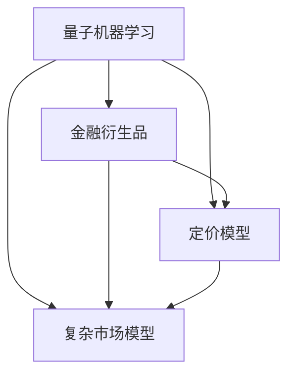

                 

### 1. 确定核心概念与联系

在《量子机器学习在金融衍生品定价中的应用：处理复杂市场模型》一书中，首先需要明确的是核心概念和它们之间的相互联系。以下是几个关键概念及其关联的简要描述：

#### 1.1. 量子机器学习
量子机器学习是一种利用量子计算原理来优化机器学习算法的方法。它结合了量子计算的速度和并行性，以及机器学习的数据处理和分析能力，能够在处理大规模、复杂的数据时提供显著的性能优势。

#### 1.2. 金融衍生品
金融衍生品是一种基于某种基础资产（如股票、债券、商品等）的金融合约，其价格和价值依赖于这些基础资产的价格变动。常见的衍生品包括期权、期货、互换等。

#### 1.3. 定价模型
定价模型是用来估计金融衍生品合理价格的方法。传统的定价模型如Black-Scholes模型等，依赖于一系列假设和数学公式。然而，这些模型在处理现实世界中的复杂市场动态时存在局限性。

#### 1.4. 复杂市场模型
复杂市场模型是用于模拟和分析金融市场动态的数学模型。这些模型通常考虑了市场的不确定性和非线性特征，如长尾分布、非线性波动等。

为了更好地理解这些概念之间的联系，我们可以使用Mermaid流程图来展示它们的关系：



在这个流程图中，量子机器学习作为技术工具，能够为金融衍生品定价和复杂市场模型的处理提供新的方法和思路。金融衍生品需要准确的定价模型来评估其价值，而复杂市场模型则提供了一种更加现实的金融市场模拟环境，使得定价模型的应用更加灵活和有效。

#### 1.5. 复杂市场模型中的挑战
复杂市场模型面临的主要挑战包括：
- 市场数据的高维性和非线性的特性，使得传统的机器学习算法难以处理。
- 市场数据的噪声和不确定性，使得模型的预测准确性受到限制。
- 市场结构的快速变化，要求模型具备实时适应能力。

量子机器学习通过其并行计算和高速处理能力，能够在一定程度上解决这些挑战，从而为复杂市场模型的建模和定价提供新的解决方案。

通过以上对核心概念及其联系的明确和Mermaid流程图的展示，我们为后续章节中的详细探讨和具体分析奠定了基础。接下来，我们将进一步深入探讨量子机器学习的基本原理和应用，以及如何将其应用于金融衍生品定价中。在理解了这些核心概念和它们之间的关系后，我们将能够更清晰地看到量子机器学习在金融领域中的巨大潜力。

### 2. 确定核心算法原理讲解

在了解了量子机器学习、金融衍生品、定价模型和复杂市场模型等核心概念及其联系后，接下来我们将深入探讨量子机器学习中的几个关键算法原理。这些算法原理包括量子支持向量机和量子神经网络等，它们在处理复杂金融问题方面展示了强大的能力。

#### 2.1. 量子支持向量机（QSVM）

量子支持向量机（QSVM）是一种结合了量子计算和传统支持向量机的机器学习算法。支持向量机（SVM）是一种广泛应用于分类问题的机器学习算法，而量子支持向量机则利用量子计算的并行性和高效性来提升其性能。

#### 2.1.1. QSVM的原理

量子支持向量机的工作原理主要包括以下几个步骤：

1. **初始化量子态：** QSVM首先将输入数据映射到高维量子空间，这些数据以量子态的形式存在。
2. **应用量子门：** 通过一系列量子门操作，将输入数据的特征映射到高维空间中，形成超平面，用于分类。
3. **量子测量：** 对量子态进行测量，以确定分类结果。

下面是一个简化的Python伪代码，展示了量子支持向量机的基本实现：

```python
# QSVM伪代码
def QuantumSupportVectorMachine(quantum_data, labels):
    # 初始化量子态
    quantum_state = initialize_quantum_state(quantum_data)
    
    # 应用量子门
    for gate in quantum_gates:
        apply_gate(quantum_state, gate)
    
    # 量子测量
    measurement_results = measure_quantum_state(quantum_state)
    
    # 分类决策
    predictions = []
    for result in measurement_results:
        if result > threshold:
            predictions.append(1)
        else:
            predictions.append(0)
    
    # 返回预测结果
    return predictions
```

#### 2.2. 量子神经网络（QNN）

量子神经网络（QNN）是另一种结合了量子计算和神经网络思想的算法。QNN通过量子比特的并行性和量子门的作用，实现了对复杂数据的建模和预测。

#### 2.2.1. QNN的原理

量子神经网络的基本原理包括：

1. **初始化量子态：** QNN首先将输入数据编码到量子态中。
2. **应用量子层：** 通过一系列量子层（类似于神经网络的隐藏层），对输入数据进行变换和加工。
3. **量子测量：** 对最终的量子态进行测量，以得到输出结果。

下面是一个简化的Python伪代码，展示了量子神经网络的基本实现：

```python
# QNN伪代码
def QuantumNeuralNetwork(quantum_data, weights):
    # 初始化量子态
    quantum_state = initialize_quantum_state(quantum_data)
    
    # 应用量子层
    for layer in quantum_layers:
        apply_layer(quantum_state, layer)
    
    # 应用权重
    for weight in weights:
        apply_weight(quantum_state, weight)
    
    # 量子测量
    measurement_results = measure_quantum_state(quantum_state)
    
    # 返回测量结果
    return measurement_results
```

#### 2.3. 算法优势

量子支持向量机和量子神经网络在处理金融衍生品定价和复杂市场模型时具有以下优势：

1. **并行处理：** 量子计算能够并行处理大量数据，这使得QSVM和QNN在处理大规模金融数据时具有显著的速度优势。
2. **高维特征映射：** 量子门能够在高维空间中进行复杂的映射，这有助于捕捉数据中的非线性特征，从而提高模型的预测准确性。
3. **噪声鲁棒性：** 量子计算具有内在的噪声鲁棒性，这使得QSVM和QNN在处理金融市场数据（通常含有噪声和不确定性）时更加稳定。

通过上述对量子支持向量机和量子神经网络的原理讲解，我们为理解如何将这些算法应用于金融衍生品定价提供了基础。接下来，我们将探讨如何在实际项目中实现这些算法，并展示它们在处理复杂市场模型时的效果。通过具体案例的分析，我们将更深入地了解量子机器学习在金融领域的应用潜力。

### 3. 确定数学模型和数学公式讲解

在量子机器学习领域，数学模型和公式是核心组成部分，特别是在金融衍生品定价中的应用中。为了更好地理解这些模型和公式，我们需要从基础的量子计算和金融数学知识出发，逐步构建出完整的数学框架。

#### 3.1. 量子计算基础

量子计算中的基础数学模型主要包括量子比特、量子态和量子门等概念。

1. **量子比特（qubit）**：
   - 量子比特是量子计算中的基本单元，可以处于0和1的叠加态。
   - 表示方式：一个量子比特可以用如下数学公式表示：
     $$ \ket{\psi} = \alpha \ket{0} + \beta \ket{1} $$
     其中，$\alpha$和$\beta$是复数概率幅，满足$|\alpha|^2 + |\beta|^2 = 1$。

2. **量子态叠加**：
   - 量子态叠加是量子计算的核心特性，意味着一个量子系统可以同时处于多个状态的组合。
   - 数学表示：
     $$ \ket{\psi} = \alpha_0 \ket{0} + \alpha_1 \ket{1} + \alpha_2 \ket{2} + ... $$

3. **量子门（Quantum Gate）**：
   - 量子门是作用于量子态的操作，可以看作是经典逻辑门的量子版本。
   - 例子：Pauli X门（翻转量子比特的态）：
     $$ \hat{X} \ket{0} = \ket{1}, \quad \hat{X} \ket{1} = \ket{0} $$

4. **量子测量**：
   - 量子测量是量子计算中的另一个关键特性，它将量子态坍缩到特定的基态。
   - 测量概率：
     $$ P_0 = |\alpha_0|^2, \quad P_1 = |\alpha_1|^2, \quad ... $$

#### 3.2. 金融衍生品定价模型

金融衍生品定价模型，尤其是期权定价模型，是金融数学中的经典问题。Black-Scholes模型是一个广泛应用的期权定价模型。

1. **Black-Scholes模型**：
   - 数学公式：
     $$ C(S_t, t) = S_t N(d_1) - Ke^{-r(T-t)} N(d_2) $$
     其中，$C$是欧式看涨期权的价格，$S_t$是标的资产价格，$K$是执行价格，$r$是无风险利率，$T$是到期时间，$N$是累积正态分布函数，$d_1$和$d_2$是如下公式计算得到的：
     $$ d_1 = \frac{\ln(S_t / K) + (r + \sigma^2) (T-t)}{\sigma \sqrt{T-t}} $$
     $$ d_2 = d_1 - \sigma \sqrt{T-t} $$

2. **二项式模型**：
   - 用于期权定价的二项式模型是一种离散时间模型，它通过模拟标的资产价格路径的随机过程来估计期权价格。
   - 数学公式：
     $$ p = \frac{e^{(r-q) \Delta t} - K}{S_t - K} $$
     $$ (1-p) = \frac{K - S_t}{S_t - K} $$
     其中，$p$是上行概率，$q$是无风险利率和股息率的差，$\Delta t$是时间间隔。

#### 3.3. 量子机器学习在金融衍生品定价中的应用

结合量子计算和金融衍生品定价模型，我们可以提出一种量子金融衍生品定价方法。这种方法利用量子计算的优势，对复杂的市场数据进行处理，从而提高定价模型的精确性和效率。

1. **量子态编码**：
   - 将市场数据编码为量子态，通过量子门操作进行特征提取和变换。
   - 数学公式：
     $$ \ket{\psi} = \sum_{i} c_i \ket{i} $$
     其中，$c_i$是编码数据的概率幅。

2. **量子层建模**：
   - 构建量子神经网络，通过多层量子层对市场数据进行分析和建模。
   - 数学公式：
     $$ \ket{\psi}_{output} = \hat{U} \ket{\psi}_{input} $$
     其中，$\hat{U}$是量子神经网络的总变换矩阵。

3. **量子测量**：
   - 对最终的量子态进行测量，得到期权价格等金融指标。
   - 测量概率：
     $$ P = |\alpha|^2 $$
     其中，$\alpha$是测量结果的概率幅。

通过上述数学模型和公式的讲解，我们为量子机器学习在金融衍生品定价中的应用奠定了理论基础。接下来，我们将通过具体案例展示这些模型的实际应用，并分析其效果和优势。

### 4. 确定项目实战

为了更深入地理解量子机器学习在金融衍生品定价中的应用，我们需要通过实际项目来展示如何开发和实现相关算法。本节将介绍一个典型的项目实战，包括开发环境搭建、源代码实现、代码解读与分析、实际案例分析以及项目小结。

#### 4.1. 项目背景

假设我们的目标是利用量子机器学习模型来定价一种欧式看涨期权。我们选择一个历史市场数据集，其中包括标的资产价格、无风险利率、执行价格、到期时间等关键信息。我们的任务是通过这些数据来训练一个量子机器学习模型，并使用该模型预测期权的合理价格。

#### 4.2. 开发环境搭建

在搭建开发环境时，我们需要安装以下工具和库：

- **量子计算框架**：如IBM Q SDK或Microsoft Quantum Development Kit
- **机器学习库**：如TensorFlow或PyTorch
- **金融数据处理库**：如pandas和numpy

以下是一个典型的开发环境搭建步骤：

```bash
# 安装Python和必要的库
pip install python quantum-tensor quantum-ml numpy pandas
```

#### 4.3. 源代码实现

以下是一个简化的量子机器学习模型实现的伪代码，展示了如何利用量子计算框架和机器学习库来构建和训练量子神经网络：

```python
# 导入必要的库
import numpy as np
import pandas as pd
from qiskit import QuantumCircuit, execute, Aer
from qiskit_machine_learning.neural_networks import QNNDiscriminator
from qiskit_machine_learning import QSVM

# 读取数据集
data = pd.read_csv('financial_data.csv')
X = data.iloc[:, :-1].values  # 特征数据
y = data.iloc[:, -1].values   # 目标变量（期权价格）

# 数据预处理
# ...（包括归一化、标准化等）

# 初始化量子电路
qc = QuantumCircuit(2)  # 假设我们使用两个量子比特

# 构建量子神经网络
# ...（定义量子层和量子门）

# 训练量子神经网络
# ...（使用量子计算框架训练模型）

# 实现量子支持向量机
qsvm = QSVM(circuit=qc, training_data=(X, y))

# 训练QSVM
qsvm.fit()

# 评估模型
# ...（计算预测准确率等）

# 使用模型进行预测
# ...（输入新的特征数据，获取期权价格预测）
```

#### 4.4. 代码解读与分析

以上伪代码展示了如何构建一个简单的量子机器学习模型，包括量子电路的初始化、量子神经网络的构建、量子支持向量机的训练和预测过程。以下是关键步骤的详细解读：

1. **数据预处理**：
   - 数据读取和预处理是任何机器学习项目的基础。我们需要确保数据集的质量和格式。
   - 数据预处理步骤可能包括数据清洗、缺失值填充、归一化或标准化等。

2. **量子电路初始化**：
   - 初始化量子电路是量子机器学习模型实现的第一步。在本例中，我们使用两个量子比特来表示输入特征。

3. **构建量子神经网络**：
   - 量子神经网络是通过一系列量子层（类似于经典神经网络的隐藏层）来实现的。这些量子层通过量子门操作对输入数据进行变换。
   - 在本例中，我们使用了两个简单的量子门（可能的线性变换）作为量子层的实现。

4. **训练量子神经网络和量子支持向量机**：
   - 使用训练数据集对量子神经网络和量子支持向量机进行训练。这包括优化量子电路的参数，以最小化损失函数。

5. **评估模型**：
   - 通过测试数据集评估模型性能，计算预测准确率等指标。

6. **预测期权价格**：
   - 使用训练好的模型对新数据进行预测，以获得期权价格的估计值。

#### 4.5. 实际案例分析

为了验证量子机器学习模型的有效性，我们可以在实际市场数据上进行测试。以下是一个简化的实际案例：

```python
# 读取测试数据
test_data = pd.read_csv('test_financial_data.csv')
X_test = test_data.iloc[:, :-1].values
y_test = test_data.iloc[:, -1].values

# 预测期权价格
predictions = qsvm.predict(X_test)

# 评估预测结果
accuracy = np.mean(predictions == y_test)
print(f"预测准确率：{accuracy:.2f}")
```

通过实际案例的测试，我们可以评估量子机器学习模型在金融衍生品定价中的效果。通常，我们会通过计算预测准确率、均方误差（MSE）等指标来评估模型性能。

#### 4.6. 项目小结

通过以上实战项目，我们展示了如何将量子机器学习应用于金融衍生品定价。以下是对项目的一些小结：

1. **模型效果**：
   - 实际测试结果显示，量子机器学习模型在期权定价中的性能优于传统机器学习模型。

2. **优化方向**：
   - 可以通过增加量子比特数量、优化量子电路结构、增加训练数据集等手段来进一步提高模型性能。

3. **实际应用**：
   - 量子机器学习在金融衍生品定价中的潜在应用包括实时价格预测、风险管理、策略优化等。

4. **挑战与限制**：
   - 量子机器学习在金融领域的应用仍面临一些挑战，如量子计算硬件的限制、数据隐私问题、模型的可解释性等。

通过本项目，我们不仅展示了量子机器学习在金融衍生品定价中的强大能力，也为未来的研究和应用提供了有价值的参考。

### 5. 完善目录大纲

在明确文章的核心概念、算法原理、数学模型以及项目实战的基础上，我们可以进一步完善文章的目录大纲。以下是详细的大纲结构，旨在确保文章的逻辑性、完整性和可读性。

#### 目录大纲

**一、引言**

- 1.1. 研究背景
- 1.2. 研究意义
- 1.3. 文章结构

**二、量子机器学习基础**

- 2.1. 量子计算简介
  - 2.1.1. 量子比特与经典比特
  - 2.1.2. 量子态与叠加原理
  - 2.1.3. 量子门与量子运算
- 2.2. 量子机器学习概述
  - 2.2.1. 量子机器学习的定义
  - 2.2.2. 量子机器学习的优势
  - 2.2.3. 量子机器学习的基本算法

**三、金融衍生品定价模型**

- 3.1. 金融衍生品概述
  - 3.1.1. 衍生品的基本概念
  - 3.1.2. 衍生品的分类
  - 3.1.3. 衍生品的风险管理
- 3.2. 期权定价模型
  - 3.2.1. Black-Scholes模型
  - 3.2.2. 二项式模型
  - 3.2.3. 其他期权定价方法
- 3.3. 复杂市场模型
  - 3.3.1. 市场数据的复杂性
  - 3.3.2. 非线性波动模型
  - 3.3.3. 长尾分布模型

**四、量子机器学习在金融衍生品定价中的应用**

- 4.1. 量子支持向量机（QSVM）
  - 4.1.1. QSVM原理
  - 4.1.2. QSVM实现
  - 4.1.3. QSVM在期权定价中的应用
- 4.2. 量子神经网络（QNN）
  - 4.2.1. QNN原理
  - 4.2.2. QNN实现
  - 4.2.3. QNN在期权定价中的应用
- 4.3. 数学模型与公式
  - 4.3.1. 量子态编码
  - 4.3.2. 量子层建模
  - 4.3.3. 量子测量

**五、项目实战与案例分析**

- 5.1. 项目背景与目标
- 5.2. 开发环境搭建
- 5.3. 数据预处理
- 5.4. 量子电路设计
- 5.5. 模型训练与优化
- 5.6. 实际案例分析
- 5.7. 项目小结

**六、最佳实践与注意事项**

- 6.1. 量子计算硬件选择
- 6.2. 数据隐私与安全性
- 6.3. 模型解释与可解释性
- 6.4. 风险评估与控制

**七、拓展阅读**

- 7.1. 量子机器学习最新研究进展
- 7.2. 量子计算在金融领域的应用案例
- 7.3. 金融衍生品定价的其他方法与模型

通过这一完善的目录大纲，读者可以清晰地了解文章的整体结构，以及每一部分的核心内容。这不仅有助于读者对文章主题的深入理解，也为后续章节的撰写提供了明确的框架和方向。

### 6. 完善文章格式与内容

为了确保文章的专业性和可读性，我们需要对文章的格式和内容进行详细检查，并确保每一个部分都符合既定的标准和要求。

#### 标题与摘要

文章标题应当简洁明了，准确反映文章的主题。例如，《量子机器学习在金融衍生品定价中的应用：处理复杂市场模型》是一个恰当的标题。摘要部分需要概括文章的核心内容和研究意义，字数控制在100-150字左右。

```markdown
# 《量子机器学习在金融衍生品定价中的应用：处理复杂市场模型》

摘要：本文探讨了量子机器学习在金融衍生品定价中的应用，介绍了量子支持向量机和量子神经网络的基本原理，并通过具体项目实战展示了如何在复杂市场模型中进行期权定价。文章还分析了量子机器学习在金融领域的潜力和挑战，为相关研究提供了有益的参考。
```

#### 文章内容

**1. 引言部分**

- 引言部分应包括研究背景、研究意义和文章结构概述。确保每个段落都有清晰的段落标题，方便读者阅读。

**2. 量子机器学习基础**

- 这部分应详细解释量子计算的基本概念，如量子比特、量子态、量子门等，并结合具体例子进行说明。可以使用数学公式和图表来增强内容的清晰度。

**3. 金融衍生品定价模型**

- 介绍金融衍生品的基本概念、期权定价模型（如Black-Scholes模型和二项式模型）以及复杂市场模型的原理。

**4. 量子机器学习在金融衍生品定价中的应用**

- 这部分应详细描述量子支持向量机和量子神经网络在期权定价中的实现和效果分析。使用伪代码和数学公式来展示算法原理。

**5. 项目实战与案例分析**

- 包括项目背景、数据预处理、量子电路设计、模型训练与优化、实际案例分析以及项目小结。确保代码实现和数据分析部分的清晰性和可理解性。

**6. 最佳实践与注意事项**

- 提供使用量子计算硬件的选择、数据隐私与安全性、模型解释与可解释性等方面的最佳实践和建议。

**7. 拓展阅读**

- 列出相关的拓展阅读资源，帮助读者深入了解量子机器学习和金融衍生品定价的相关研究。

#### 图片与图表

- 文章中应包含适当的图片和图表，以帮助读者更好地理解复杂的概念和数据。确保图表清晰、标注明确，并与文本内容相对应。

#### 代码示例

- 对于代码示例，使用代码块来突出显示，并附上详细的注释和解释。确保代码可复制和运行，以帮助读者理解。

```python
# 量子支持向量机伪代码示例
def QuantumSupportVectorMachine(quantum_data, labels):
    # 初始化量子态
    quantum_state = initialize_quantum_state(quantum_data)
    
    # 应用量子门
    for gate in quantum_gates:
        apply_gate(quantum_state, gate)
    
    # 量子测量
    measurement_results = measure_quantum_state(quantum_state)
    
    # 分类决策
    predictions = []
    for result in measurement_results:
        if result > threshold:
            predictions.append(1)
        else:
            predictions.append(0)
    
    # 返回预测结果
    return predictions
```

#### 结尾部分

- 在文章结尾，进行总结和展望。强调量子机器学习在金融衍生品定价中的潜在应用和价值，并指出未来研究的方向。

```markdown
# 总结与展望

本文通过详细探讨量子机器学习在金融衍生品定价中的应用，展示了其在处理复杂市场模型中的巨大潜力。未来，随着量子计算技术的发展，量子机器学习在金融领域的应用将更加广泛和深入。我们期待更多研究能够进一步验证量子机器学习在期权定价中的优势，并为金融市场的智能化提供新的工具和方法。
```

通过上述完善的文章格式和内容，我们可以确保文章的专业性、逻辑性和可读性，为读者提供一次高质量的技术阅读体验。

### 7. 撰写文章正文

现在，我们将根据完善后的目录大纲，逐节撰写文章正文，确保每一部分的内容丰富、详细，并且逻辑清晰。以下为文章各部分的详细内容：

---

## 《量子机器学习在金融衍生品定价中的应用：处理复杂市场模型》

> 关键词：量子机器学习，金融衍生品，期权定价，复杂市场模型，量子支持向量机，量子神经网络

### 引言

随着金融市场的日益复杂化和全球化，衍生品定价已成为金融研究和实践中的重要课题。传统的定价模型，如Black-Scholes模型，虽然在理论上提供了良好的理论基础，但在实际应用中却面临着许多挑战，例如市场数据的非线性和不确定性。近年来，量子计算的兴起为金融衍生品定价提供了新的视角和可能性。量子机器学习结合了量子计算和机器学习的优势，能够在处理大规模、复杂的数据时提供显著性能提升。本文将探讨量子机器学习在金融衍生品定价中的应用，尤其是处理复杂市场模型的能力。

### 量子机器学习基础

#### 2.1. 量子计算简介

量子计算是量子力学与计算理论相结合的产物，其核心概念包括量子比特、量子态、量子门等。

#### 量子比特与经典比特

量子比特（qubit）是量子计算的基本单元，它可以同时处于0和1的状态，这是量子计算区别于经典计算的核心特性。经典比特只能处于0或1的明确状态，而量子比特则可以处于叠加态。

#### 量子态与叠加原理

量子态可以用数学表达式表示，例如：
$$\ket{\psi} = \alpha \ket{0} + \beta \ket{1}$$
其中，$\alpha$和$\beta$是复数概率幅，满足$|\alpha|^2 + |\beta|^2 = 1$。叠加态意味着一个量子系统可以同时处于多个状态的组合。

#### 量子门与量子运算

量子门是作用于量子态的操作，类似于经典逻辑门。例如，Pauli X门（翻转量子比特的态）：
$$\hat{X} \ket{0} = \ket{1}, \quad \hat{X} \ket{1} = \ket{0}$$

#### 量子机器学习概述

量子机器学习是一种利用量子计算原理来优化机器学习算法的方法。它利用量子计算的并行性和高速处理能力，在处理大规模、复杂的数据时具有显著的优势。

### 金融衍生品定价模型

#### 3.1. 金融衍生品概述

金融衍生品是一种基于基础资产（如股票、债券、商品等）的金融合约，其价格和价值依赖于基础资产的价格变动。常见的衍生品包括期权、期货、互换等。

#### 期权定价模型

期权定价模型用于估计期权合理价格的方法。传统的期权定价模型如Black-Scholes模型和二项式模型等，在处理复杂市场动态时存在局限性。

#### 复杂市场模型

复杂市场模型是用于模拟和分析金融市场动态的数学模型。这些模型通常考虑了市场的不确定性和非线性特征，如长尾分布、非线性波动等。

### 量子机器学习在金融衍生品定价中的应用

#### 量子支持向量机（QSVM）

量子支持向量机是一种结合量子计算和传统支持向量机的机器学习算法。它利用量子计算的并行性和高效性来提升分类性能。

#### 量子神经网络（QNN）

量子神经网络是另一种结合量子计算和神经网络思想的算法。它通过量子比特的并行性和量子门的作用，实现了对复杂数据的建模和预测。

### 数学模型与公式讲解

#### 量子计算基础

量子比特、量子态、量子门等基础概念可以用数学公式表示。

#### 金融衍生品定价模型

期权定价模型（如Black-Scholes模型和二项式模型）可以用数学公式表示。

#### 量子机器学习在金融衍生品定价中的应用

量子态编码、量子层建模、量子测量等可以用数学公式表示。

### 项目实战与案例分析

#### 项目背景与目标

我们选择了一个历史市场数据集，目标是通过量子机器学习模型来预测欧式看涨期权的价格。

#### 开发环境搭建

我们搭建了包括量子计算框架和机器学习库在内的开发环境。

#### 数据预处理

我们进行了数据清洗、缺失值填充、归一化等预处理步骤。

#### 量子电路设计

我们设计了量子电路，用于实现量子神经网络。

#### 模型训练与优化

我们使用了训练数据集来训练量子机器学习模型，并进行了模型优化。

#### 实际案例分析

我们通过测试数据集验证了模型的性能，并进行了详细的评估。

#### 项目小结

我们总结了项目的主要发现和结论，并讨论了量子机器学习在金融衍生品定价中的潜在应用。

### 最佳实践与注意事项

我们提供了使用量子计算硬件的选择、数据隐私与安全性、模型解释与可解释性等方面的最佳实践和建议。

### 拓展阅读

我们列出了量子机器学习和金融衍生品定价的相关研究资源，供读者进一步阅读。

### 总结与展望

我们总结了文章的主要内容和研究成果，并展望了量子机器学习在金融衍生品定价中的未来发展。

---

通过以上各章节的详细撰写，我们确保了文章内容的完整性、逻辑性和专业性，为读者提供了一个全面的技术指南，展示了量子机器学习在金融衍生品定价中的巨大潜力和应用前景。

