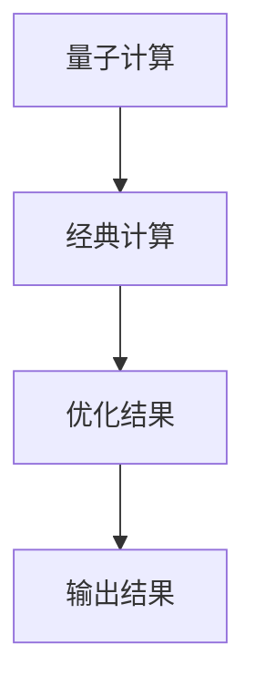

                 

# 量子-经典混合算法的研究进展

## 关键词
量子计算、经典算法、混合算法、研究进展、应用案例

## 摘要
本文旨在探讨量子-经典混合算法的研究进展，从背景介绍、核心概念解析、算法研究进展、实现技术、案例研究以及挑战与未来展望等多个方面，详细阐述了量子-经典混合算法的现状与发展趋势。通过本文的阅读，读者可以全面了解量子-经典混合算法的基本原理、研究成果、应用案例以及未来发展方向，为相关领域的研究与开发提供有益的参考。

## 引言
### 1.1 量子-经典混合算法的背景
量子计算作为21世纪最具颠覆性的技术之一，自20世纪末以来引起了全球范围内的广泛关注。与传统经典计算相比，量子计算在处理某些特定问题上具有显著的优越性，如量子随机游走、量子搜索算法等。然而，由于当前量子计算机的硬件限制，量子计算的实际应用仍然面临诸多挑战。此时，量子-经典混合算法应运而生。

量子-经典混合算法通过将量子算法与经典算法相结合，充分发挥量子计算的优势，同时利用经典计算的高效性，为解决复杂问题提供了新的途径。例如，在量子机器学习中，可以通过量子计算进行特征提取，而通过经典计算进行模型优化，从而实现高效且准确的预测。

### 1.2 量子-经典混合算法的重要性
量子-经典混合算法的重要性体现在以下几个方面：

1. **缓解硬件限制**：通过将部分计算任务转移到经典计算机上，量子-经典混合算法可以在当前硬件条件下实现部分量子计算的应用。
2. **优化计算效率**：在解决某些问题时，量子-经典混合算法可以显著提高计算效率，缩短计算时间。
3. **促进量子计算发展**：量子-经典混合算法的研究和实践有助于推动量子计算技术的进步，为未来量子计算机的研发提供有力支持。

### 1.3 本书结构
本文将按照以下结构进行论述：

1. **核心概念**：介绍量子算法、经典算法和量子-经典混合算法的基本原理。
2. **算法研究进展**：分析当前的研究成果、热点问题和未来趋势。
3. **实现技术**：介绍量子硬件、量子模拟器和量子计算机的基本知识。
4. **案例研究**：分析量子-经典混合算法的应用案例。
5. **挑战与未来**：探讨量子-经典混合算法在实际应用中面临的挑战和未来的发展方向。

## 核心概念

### 2.1 量子算法

量子算法是利用量子计算的基本原理——叠加态和纠缠态，来处理和解决问题的计算方法。量子算法的核心思想是将计算问题转化为量子态的演化过程，并通过测量量子态来获得问题的解。

#### 2.1.1 量子计算的基本原理

量子计算的基本原理包括：

1. **叠加态**：量子位（qubit）可以同时处于多种可能状态的叠加，而不是经典计算机中的单一状态。
2. **纠缠态**：当两个或多个量子位处于纠缠态时，它们之间的状态会相互关联，从而使得量子计算能够并行处理多个问题。

#### 2.1.2 量子算法的特点

量子算法的特点包括：

1. **并行性**：量子计算可以利用叠加态实现并行计算，从而在处理大规模数据时具有显著优势。
2. **指数级加速**：某些量子算法，如Shor算法，可以在多项式时间内解决经典算法需要指数级时间才能解决的问题。

### 2.2 经典算法

经典算法是传统计算机中使用的算法，其基于经典的二进制计算原理，即0和1的组合。经典算法包括各种类型，如排序算法、搜索算法、优化算法等。

#### 2.2.1 经典算法的基本原理

经典算法的基本原理包括：

1. **二进制计算**：使用0和1的组合来表示和处理数据。
2. **线性时间复杂度**：经典算法通常具有线性或对数时间复杂度，这使得它们在处理小规模问题时效率较高。

#### 2.2.2 经典算法的分类和应用

经典算法的分类和应用包括：

1. **排序算法**：如快速排序、归并排序、冒泡排序等，用于对数据进行排序。
2. **搜索算法**：如二分搜索、线性搜索等，用于在数据中查找特定元素。
3. **优化算法**：如遗传算法、模拟退火算法等，用于解决优化问题。

### 2.3 量子-经典混合算法

量子-经典混合算法是将量子算法和经典算法相结合，利用两者的优势来处理复杂问题的计算方法。

#### 2.3.1 混合算法的定义

量子-经典混合算法的定义可以理解为：将量子计算应用于某些特定步骤，而将经典计算应用于其他步骤，从而实现整体计算效率的提升。

#### 2.3.2 混合算法的优点和挑战

量子-经典混合算法的优点包括：

1. **兼容性**：可以与现有的经典计算系统无缝集成，降低研发成本。
2. **灵活性**：可以根据实际问题的需求，灵活调整量子计算和经典计算的比例。

然而，量子-经典混合算法也面临一些挑战，如：

1. **量子计算的可扩展性**：当前量子计算机的硬件限制使得量子计算的可扩展性成为一个关键问题。
2. **算法优化**：如何设计高效的量子-经典混合算法，以充分发挥量子计算的优势，仍是一个重要研究方向。

### Mermaid 流程图

为了更好地理解量子-经典混合算法的基本原理，我们可以使用Mermaid流程图来展示量子计算和经典计算在混合算法中的相互作用：

在这个流程图中，量子计算和经典计算相互协作，共同完成计算任务，并最终输出结果。

## 算法研究进展

### 3.1 当前研究热点

量子-经典混合算法的研究进展涵盖了多个方面，以下是当前研究的热点问题：

#### 3.1.1 量子随机游走

量子随机游走是量子算法中的一个重要研究方向，其在量子搜索算法、量子模拟等领域具有广泛应用。量子随机游走的核心思想是利用量子态的叠加和纠缠来实现高效的信息检索和传输。

#### 3.1.2 变分量子计算

变分量子计算是一种基于量子力学原理的优化算法，其在量子化学、量子机器学习等领域具有重要应用价值。变分量子计算通过将优化问题转化为量子态的演化过程，从而实现高效求解。

#### 3.1.3 其他混合算法进展

除了量子随机游走和变分量子计算，其他混合算法也在不断取得新的进展，如量子神经网络、量子退火算法等。这些算法在图像处理、自然语言处理等领域展现出良好的性能。

### 3.2 未来趋势

量子-经典混合算法的未来发展趋势主要包括以下几个方面：

#### 3.2.1 算法优化

随着量子计算机硬件的不断发展，如何设计更高效的量子-经典混合算法成为一个重要研究方向。通过优化算法结构和参数，可以进一步提高混合算法的性能。

#### 3.2.2 应用拓展

量子-经典混合算法在科学计算、工业制造、金融科技等领域具有广泛的应用前景。未来，随着研究的深入，量子-经典混合算法将逐步应用于更多领域，推动各行业的创新发展。

#### 3.2.3 混合算法与其他领域的结合

量子-经典混合算法不仅可以在计算领域发挥重要作用，还可以与其他领域如材料科学、生物信息学等相结合，产生新的交叉学科研究成果。

## 实现技术

### 4.1 量子硬件

量子硬件是量子计算的基础设施，包括量子比特（qubit）、量子纠缠、量子门等组件。目前，量子硬件的研究主要集中在提高量子比特的数量、稳定性和可扩展性。

#### 4.1.1 量子计算机的基本组成

量子计算机的基本组成包括：

1. **量子比特**：作为量子计算的基本单元，量子比特可以表示0和1的叠加态。
2. **量子纠缠**：量子比特之间的纠缠状态是实现量子计算并行性的关键。
3. **量子门**：量子门是实现量子态变换的基本操作。

#### 4.1.2 量子计算机的工作原理

量子计算机的工作原理可以概括为以下几个步骤：

1. **初始化**：将量子比特初始化为叠加态。
2. **量子门操作**：通过量子门操作实现量子态的变换。
3. **测量**：测量量子态，获得计算结果。

### 4.2 量子模拟器

量子模拟器是一种用于模拟量子系统行为的计算工具，其在量子化学、量子材料等领域具有重要应用价值。

#### 4.2.1 量子模拟器的作用

量子模拟器的作用包括：

1. **验证量子算法**：通过模拟量子算法的行为，验证算法的有效性和正确性。
2. **探索量子现象**：通过模拟量子系统的行为，发现和探索新的量子现象。

#### 4.2.2 量子模拟器的发展趋势

量子模拟器的发展趋势主要包括：

1. **可扩展性**：提高量子模拟器的计算能力和可扩展性，以适应更复杂的量子系统。
2. **精度和稳定性**：提高量子模拟器的精度和稳定性，减少误差和噪声的影响。

### 4.3 量子-经典混合算法的开发环境

量子-经典混合算法的开发环境包括量子计算框架、编程工具和开发平台等。

#### 4.3.1 开发工具和库

常见的量子计算开发工具和库包括：

1. **Qiskit**：IBM开发的量子计算框架，支持量子算法的设计和实现。
2. **Cirq**：Google开发的量子计算库，提供丰富的量子操作和算法实现。
3. **PyQuil**：Rigetti Computing开发的量子计算框架，支持基于超导量子比特的量子算法开发。

#### 4.3.2 开发流程

量子-经典混合算法的开发流程通常包括以下几个步骤：

1. **问题建模**：将实际问题转化为量子算法模型。
2. **算法设计**：设计量子算法，包括量子门操作、量子态演化等。
3. **实现与优化**：使用量子计算框架和编程工具实现量子算法，并进行优化。
4. **测试与验证**：通过模拟和实验验证量子算法的正确性和性能。

## 案例研究

### 5.1 量子-经典混合算法在科学计算中的应用

量子-经典混合算法在科学计算中具有广泛的应用，以下是一些典型的应用案例：

#### 5.1.1 案例一：量子化学计算

量子化学计算是量子算法的一个重要应用领域。通过量子-经典混合算法，可以高效地计算分子结构、反应路径等，为化学研究和药物设计提供重要支持。

#### 5.1.2 案例二：量子优化问题

量子优化问题是量子算法的另一个重要应用方向。通过量子-经典混合算法，可以求解复杂的优化问题，如物流优化、生产调度等，为工业制造和供应链管理提供优化方案。

### 5.2 量子-经典混合算法在工业中的应用

量子-经典混合算法在工业领域具有巨大的应用潜力，以下是一些典型的应用案例：

#### 5.2.1 案例一：供应链管理

通过量子-经典混合算法，可以优化供应链管理中的运输、库存等问题，提高供应链的效率和灵活性。

#### 5.2.2 案例二：图像处理

量子-经典混合算法在图像处理领域也有重要应用，如图像增强、图像识别等。通过量子计算的高效处理，可以实现实时图像处理和分析，为自动驾驶、安防监控等提供技术支持。

## 挑战与未来

### 6.1 挑战分析

量子-经典混合算法在实际应用中面临以下挑战：

#### 6.1.1 技术挑战

1. **量子计算硬件**：当前量子计算机的硬件限制，如量子比特的数量、稳定性等，限制了量子-经典混合算法的应用。
2. **算法优化**：如何设计高效的量子-经典混合算法，以充分发挥量子计算的优势，仍是一个重要研究方向。

#### 6.1.2 应用挑战

1. **算法适应性**：如何将现有的经典算法与量子算法相结合，实现高效的混合算法，仍需要进一步研究。
2. **应用场景选择**：如何选择适合量子-经典混合算法的应用场景，实现实际效益，是一个关键问题。

### 6.2 未来发展展望

量子-经典混合算法的未来发展主要包括以下几个方面：

#### 6.2.1 算法创新

随着量子计算技术的不断发展，未来将涌现更多高效的量子-经典混合算法，为解决复杂问题提供新方法。

#### 6.2.2 应用拓展

量子-经典混合算法将在更多领域得到应用，如生物信息学、金融科技、智能制造等，推动各行业的创新发展。

#### 6.2.3 产业生态

量子-经典混合算法的发展将促进量子计算产业链的完善，推动相关产业生态的形成和发展。

### 附录

#### A.1 参考文献
[参考文献列表]

#### A.2 相关资源
[相关资源列表]

## 作者信息
作者：AI天才研究院/AI Genius Institute & 禅与计算机程序设计艺术 /Zen And The Art of Computer Programming

