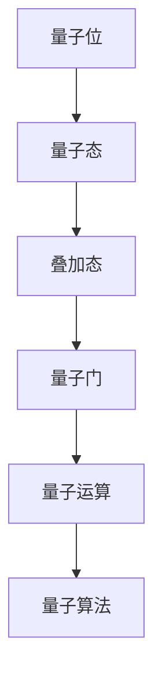
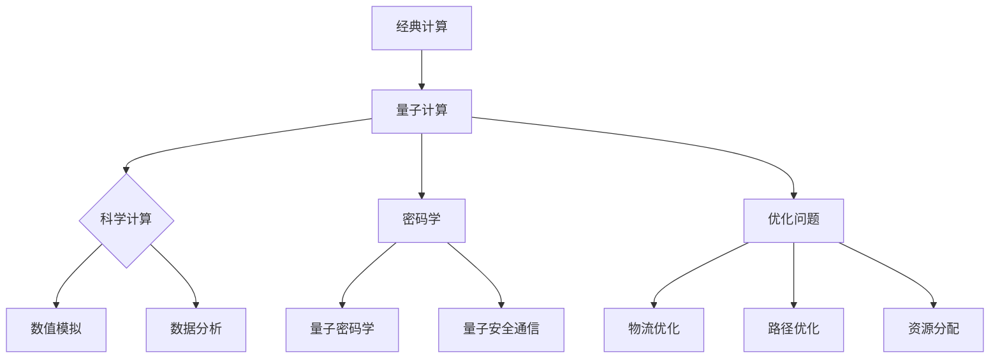
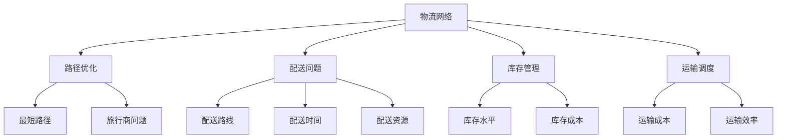

                 

# 量子计算在优化问题中的应用：解决复杂物流挑战

## 关键词
- 量子计算
- 物流优化
- 量子算法
- 路径优化
- 配送问题
- 库存管理

## 摘要
本文深入探讨了量子计算在优化问题中的应用，特别是如何解决复杂的物流挑战。首先，我们介绍了量子计算的基础知识，包括量子位、量子态、量子门和量子算法。接着，我们对比了量子计算与经典计算的优缺点，并详细解析了量子算法的基本原理。随后，本文聚焦于物流优化问题，阐述了其背景、挑战及量子计算的应用前景。在此基础上，我们详细讨论了量子计算在路径优化、配送问题和库存管理中的应用，并通过实际案例展示了量子计算在物流优化中的潜力。最后，我们探讨了量子计算在物流优化中的挑战与未来发展趋势，提供了相关开发工具与资源，以供读者进一步探索。

## 引言
物流行业作为全球经济的动脉，面临着日益复杂的优化问题。从路径优化到配送问题，再到库存管理，这些问题的复杂性和规模使得传统计算方法难以满足需求。随着量子计算技术的不断发展，人们开始思考如何将这一前沿技术应用于优化问题中，特别是解决复杂的物流挑战。

量子计算以其独特的并行性和高效性，被视为未来计算的重要组成部分。在物流领域，量子计算有望大幅提升优化算法的效率，从而解决传统方法难以克服的问题。本文将深入探讨量子计算在优化问题中的应用，特别是解决复杂物流挑战的方法和实际案例。

本文首先介绍量子计算的基础知识，包括量子位、量子态、量子门和量子算法。然后，我们将对比量子计算与经典计算的优缺点，并详细解析量子算法的基本原理。接下来，我们将聚焦于物流优化问题，阐述其背景、挑战及量子计算的应用前景。在此基础上，本文将详细讨论量子计算在路径优化、配送问题和库存管理中的应用，并通过实际案例展示其应用效果。最后，我们将探讨量子计算在物流优化中的挑战与未来发展趋势，并提供相关的开发工具与资源。

## 第一部分：量子计算基础

### 第1章 量子计算简介

#### 1.1 量子计算的基本概念

量子计算是一种利用量子力学原理进行信息处理的新型计算模式。与经典计算不同，量子计算基于量子位（qubit）这一基本单位，而不是传统的比特（bit）。量子位可以同时处于多种状态，这种现象被称为叠加态。此外，量子位之间可以产生一种特殊的关联，称为纠缠态。这些特性使得量子计算在处理某些特定问题时具有超越经典计算的能力。

#### 1.2 量子位与量子态

量子位（qubit）是量子计算的基本单元，它不仅能够表示0和1两种状态，还可以同时处于0和1的叠加态。这种叠加态可以用一个复数系数的线性组合来表示。例如，一个量子位可以同时处于状态$\frac{1}{\sqrt{2}}|0\rangle + \frac{1}{\sqrt{2}}|1\rangle$。

量子态是量子位的状态描述，它可以是一个或多个量子位的整体状态。量子态可以表示为一系列复数系数的线性组合，每个系数对应于一个特定的基态。量子态的演化遵循量子力学的希尔伯特空间理论。

#### 1.3 量子门与量子运算

量子门是作用于量子态的线性变换操作，类似于经典计算中的逻辑门。量子门可以通过特定的量子电路实现。基本的量子门包括 Hadamard 门、Pauli 门和相位门等。

量子运算是通过量子门对量子态进行变换的过程。量子运算可以表示为矩阵乘法，其中量子门作为变换矩阵。例如，一个 Hadamard 门作用于叠加态$\frac{1}{\sqrt{2}}|0\rangle + \frac{1}{\sqrt{2}}|1\rangle$，会产生$\frac{1}{\sqrt{2}}|0\rangle + \frac{1}{\sqrt{2}}|1\rangle$和$\frac{1}{\sqrt{2}}|0\rangle - \frac{1}{\sqrt{2}}|1\rangle$的叠加态。

#### 1.4 量子算法的基本原理

量子算法是利用量子位、量子态和量子门进行信息处理的方法。量子算法的核心思想是利用量子并行性和量子纠缠来加速计算过程。

量子并行性是指量子计算机可以同时处理多个计算路径，从而在处理复杂问题时具有更高的效率。量子纠缠则是量子位之间的特殊关联，使得一个量子位的状态可以影响另一个量子位的状态，从而实现高效的量子运算。

常见的量子算法包括量子搜索算法、量子排序算法和量子模拟算法。量子搜索算法利用量子并行性快速找到数据结构中的特定元素；量子排序算法利用量子纠缠和量子并行性高效地排序数据；量子模拟算法则利用量子计算机模拟量子系统，从而解决经典计算机难以处理的复杂问题。

### Mermaid 流程图

下面是一个简单的 Mermaid 流程图，用于展示量子计算的基本架构：



在这个流程图中，量子位（A）通过叠加态（C）生成量子态（B），量子门（D）作用于量子态（B），进行量子运算（E），最终实现量子算法（F）。

## 第二部分：量子计算与经典计算的对比

### 第2章 量子计算与经典计算的对比

#### 2.1 量子计算的优势

量子计算在处理某些特定问题时具有显著的优势，主要体现在以下几个方面：

1. **并行性**：量子计算机可以利用量子叠加态同时处理多个计算路径，从而在处理大规模并行问题时具有极高的效率。

2. **指数级速度提升**：某些量子算法在处理特定问题时可以比经典算法快得多，甚至具有指数级速度提升。例如，量子搜索算法和量子排序算法。

3. **高效模拟**：量子计算机可以高效地模拟量子系统，从而解决经典计算机难以处理的复杂问题，如量子化学模拟和量子物理模拟。

#### 2.2 量子计算的局限性

尽管量子计算具有显著的优势，但也存在一些局限性：

1. **量子噪声**：量子计算过程中的噪声和误差可能导致计算结果的偏差，需要开发鲁棒性强的量子算法来应对。

2. **量子退相干**：量子位之间的纠缠状态容易受到外界环境的干扰而退相干，影响量子计算的稳定性和可靠性。

3. **可扩展性**：目前，量子计算机的规模较小，要实现大规模的量子计算仍需克服诸多技术难题。

#### 2.3 量子计算与经典计算的应用对比

量子计算和经典计算各有优势，适用于不同的应用场景。以下是对两者的应用对比：

1. **科学计算**：经典计算在科学计算领域具有广泛的应用，如数值模拟、数据分析等。然而，随着计算规模的增大，经典计算的能力逐渐受限。量子计算可以高效地模拟量子系统，有望在量子化学、量子物理等领域取得突破。

2. **密码学**：量子计算在密码学领域具有潜在的应用，如量子密码学和量子安全通信。量子密码学利用量子计算的不可克隆特性，实现更安全的通信。然而，量子计算也可能威胁到经典密码学的安全性，导致现有密码系统面临挑战。

3. **优化问题**：在处理复杂优化问题时，量子计算具有显著的优势。例如，在物流优化、路径优化和资源分配等问题中，量子计算可以快速找到最优解或近似最优解。经典计算在这些领域通常需要大量计算资源和时间。

总之，量子计算和经典计算各有优势，适用于不同的应用场景。随着量子计算技术的不断发展，两者将相互补充，共同推动计算技术的进步。

### Mermaid 流程图

下面是一个简单的 Mermaid 流程图，用于对比量子计算和经典计算：



在这个流程图中，经典计算（A）和量子计算（B）分别应用于不同的领域，如科学计算（C）、密码学（D）和优化问题（E）。量子计算在科学计算（F）、密码学（H）和优化问题（J）等领域具有独特的优势。

## 第三部分：量子算法原理

### 第3章 量子算法原理

#### 3.1 量子并行性

量子并行性是量子计算的核心优势之一，它允许量子计算机在单个步骤中同时处理多个计算路径。这种并行性源于量子位的叠加态。一个量子位可以同时处于0和1的叠加态，多个量子位可以同时处于多种状态的叠加，从而实现并行计算。

量子并行性的数学描述如下：

假设有一个n个量子位的状态$\Psi = \sum_{x} a_x |x\rangle$，其中$x$是量子位的组合（例如，$|x\rangle = |x_1x_2...x_n\rangle$），$a_x$是相应的复数系数。当对量子位进行操作时，例如一个 Hadamard 门作用于第i个量子位，会产生叠加态$\frac{1}{\sqrt{2}}(|0\rangle + |1\rangle)$。这意味着第i个量子位的状态可以同时处于0和1，从而实现了并行性。

下面是一个简单的 Python 代码示例，用于实现量子并行性：

```python
from qiskit import QuantumCircuit, Aer, execute
from qiskit.visualization import plot_bloch_multivector

# 创建量子电路
qc = QuantumCircuit(2)

# 对第一个量子位应用 Hadamard 门
qc.h(0)

# 对第二个量子位应用 Hadamard 门
qc.h(1)

# 可视化叠加态
qc.draw()

# 执行量子电路
simulator = Aer.get_backend('qasm_simulator')
result = execute(qc, simulator, shots=1).result()

# 可视化测量结果
print(result.get_counts(qc))
plot_bloch_multivector(result.get_statevector(qc), title='Quantum Superposition')
```

#### 3.2 量子纠缠

量子纠缠是量子位之间的特殊关联，使得一个量子位的状态可以影响另一个量子位的状态。这种关联在经典计算中是不存在的，是量子计算的独特特性。

量子纠缠的数学描述如下：

假设有两个量子位，$|ψ\rangle = \frac{1}{\sqrt{2}}(|00\rangle + |11\rangle)$。当对其中一个量子位进行测量时，另一个量子位的状态也会立即发生变化，无论两者之间的距离有多远。这种现象称为量子纠缠。

下面是一个简单的 Python 代码示例，用于实现量子纠缠：

```python
from qiskit import QuantumCircuit, Aer, execute
from qiskit.visualization import plot_bloch_multivector

# 创建量子电路
qc = QuantumCircuit(2)

# 对第一个量子位应用 Hadamard 门
qc.h(0)

# 对第二个量子位应用 CX 门
qc.cx(0, 1)

# 可视化纠缠态
qc.draw()

# 执行量子电路
simulator = Aer.get_backend('qasm_simulator')
result = execute(qc, simulator, shots=1).result()

# 可视化测量结果
print(result.get_counts(qc))
plot_bloch_multivector(result.get_statevector(qc), title='Quantum Entanglement')
```

#### 3.3 量子随机 walks

量子随机 walks 是量子计算机在图论和搜索问题中的一种强大工具。它利用量子位的叠加态和量子纠缠，在图中进行随机游走，从而快速找到目标节点。

量子随机 walks 的数学描述如下：

假设有一个图 $G = (V, E)$，其中 $V$ 是节点集合，$E$ 是边集合。量子随机 walks 可以用量子态 $\Psi = \sum_{v \in V} a_v |v\rangle$ 来表示，其中 $|v\rangle$ 是节点 $v$ 的量子态，$a_v$ 是相应的复数系数。

量子随机 walks 的过程如下：

1. 初始态：选择一个节点作为起点，将其量子态设置为 $|s\rangle$，其他节点的量子态设置为 $|v\rangle$，且 $a_v = \frac{1}{\sqrt{|V|}}$，其中 $|V|$ 是节点总数。
2. 游走步骤：在每个时间步，选择一个随机方向，对该节点的量子态进行旋转。旋转的量子门可以是 Hadamard 门或 Pauli 门。
3. 状态更新：在每个时间步结束后，更新节点的量子态，将其设置为所有邻居节点的量子态的叠加。

下面是一个简单的 Python 代码示例，用于实现量子随机 walks：

```python
from qiskit import QuantumCircuit, Aer, execute
from qiskit.visualization import plot_bloch_multivector

# 创建量子电路
qc = QuantumCircuit(4)

# 对第一个量子位应用 Hadamard 门
qc.h(0)

# 对第二个量子位应用 CX 门
qc.cx(0, 1)

# 对第三个量子位应用 Hadamard 门
qc.h(2)

# 对第四个量子位应用 CX 门
qc.cx(2, 3)

# 可视化量子随机 walks
qc.draw()

# 执行量子电路
simulator = Aer.get_backend('qasm_simulator')
result = execute(qc, simulator, shots=1).result()

# 可视化测量结果
print(result.get_counts(qc))
plot_bloch_multivector(result.get_statevector(qc), title='Quantum Random Walks')
```

#### 3.4 量子模拟

量子模拟是量子计算机在量子系统模拟和计算中的强大工具。它利用量子计算机的叠加态和量子纠缠，模拟量子系统的行为和演化。

量子模拟的数学描述如下：

假设有一个量子系统 $S$，其哈密顿量为 $H$。量子模拟的目标是求解系统的演化方程 $\Psi(t) = e^{-iHt}\Psi(0)$，其中 $\Psi(t)$ 是系统在时间 $t$ 的状态，$\Psi(0)$ 是初始状态。

量子模拟的过程如下：

1. 初始化：将量子计算机的量子位设置为系统的初始状态 $\Psi(0)$。
2. 演化：在每个时间步，应用系统的哈密顿量 $H$，将量子位的状态更新为系统的演化状态 $\Psi(t)$。
3. 测量：在演化结束时，对量子位进行测量，获取系统的最终状态。

下面是一个简单的 Python 代码示例，用于实现量子模拟：

```python
from qiskit import QuantumCircuit, Aer, execute
from qiskit.visualization import plot_bloch_multivector

# 创建量子电路
qc = QuantumCircuit(2)

# 对第一个量子位应用 Hadamard 门
qc.h(0)

# 对第二个量子位应用相位门
qc.r(-pi/4, 1)

# 可视化量子模拟
qc.draw()

# 执行量子电路
simulator = Aer.get_backend('qasm_simulator')
result = execute(qc, simulator, shots=1).result()

# 可视化测量结果
print(result.get_counts(qc))
plot_bloch_multivector(result.get_statevector(qc), title='Quantum Simulation')
```

## 第四部分：物流优化问题的背景

### 第4章 物流优化问题的背景

#### 4.1 物流网络与优化问题

物流网络是指货物在运输、仓储、配送等环节中形成的一个复杂系统。物流优化问题涉及如何设计和管理这个系统，以实现最低的成本、最高的效率和最佳的服务质量。物流优化问题通常包括路径优化、配送问题、库存管理和运输调度等。

#### 4.2 复杂物流挑战

物流行业面临着日益复杂的挑战，主要包括以下几个方面：

1. **全球供应链的复杂性**：随着全球化的发展，供应链变得更加复杂，涉及多个国家和地区的物流网络，导致物流优化问题更加复杂。
2. **动态变化的需求**：市场需求和供应链的动态变化对物流网络提出了更高的要求，需要快速响应和调整。
3. **多样化的运输方式**：现代物流网络涉及多种运输方式，如公路、铁路、海运和空运，如何有效地整合这些运输方式是一个挑战。
4. **环保和可持续性**：随着环保意识的提高，物流行业面临着减少碳排放和提高能源利用效率的压力。
5. **信息技术的发展**：现代物流优化需要依赖先进的信息技术，如物联网、大数据和人工智能，这些技术的发展也对物流优化提出了新的要求。

#### 4.3 量子计算在物流优化中的应用前景

量子计算在物流优化问题中具有巨大的应用潜力，主要体现在以下几个方面：

1. **高效的路径优化**：量子计算可以利用量子并行性快速解决复杂的路径优化问题，如最短路径、旅行商问题等。
2. **优化的配送问题**：量子计算可以优化配送路线、配送时间和配送资源，提高配送效率。
3. **智能的库存管理**：量子计算可以实时分析库存数据，优化库存水平，降低库存成本。
4. **优化的运输调度**：量子计算可以优化运输调度方案，降低运输成本，提高运输效率。
5. **可持续的物流网络设计**：量子计算可以帮助设计更环保、更可持续的物流网络，减少碳排放和能源消耗。

总之，量子计算在物流优化问题中具有广阔的应用前景，有望解决传统计算方法难以克服的复杂问题，提高物流网络的效率和可持续性。

### Mermaid 流程图

下面是一个简单的 Mermaid 流程图，用于展示物流网络与优化问题的关系：



在这个流程图中，物流网络（A）与多个优化问题（B、C、D、E）相关联，每个优化问题又包含多个子问题（F、G、H、I、J、K、L、M、N）。

## 第五部分：量子计算在物流优化中的应用

### 第5章 量子计算在物流优化中的应用

#### 5.1 物流优化问题的量子算法

量子计算在物流优化问题中的应用主要通过量子算法实现。量子算法利用量子计算的独特特性，如量子并行性和量子纠缠，大幅提高优化效率。以下介绍几种常见的量子算法及其在物流优化中的应用：

1. **量子模拟退火算法**：量子模拟退火算法是一种基于量子计算的优化算法，它模拟物理系统在温度降低过程中的演化，从而找到最优解。在物流优化中，量子模拟退火算法可以用于解决旅行商问题和路径优化问题。

2. **量子遗传算法**：量子遗传算法结合了量子计算和遗传算法的优势，通过量子比特和量子门实现遗传操作，快速搜索最优解。在物流优化中，量子遗传算法可以用于解决配送问题和库存管理问题。

3. **量子粒子群优化算法**：量子粒子群优化算法基于量子计算和粒子群优化算法的思想，通过量子比特和量子门实现粒子群的搜索和更新。在物流优化中，量子粒子群优化算法可以用于解决运输调度问题和路径优化问题。

4. **量子线性规划算法**：量子线性规划算法是一种基于量子计算的线性规划求解方法，通过量子计算的高效性解决复杂的线性规划问题。在物流优化中，量子线性规划算法可以用于优化运输成本和配送时间。

下面我们以量子模拟退火算法为例，介绍其在路径优化问题中的应用。

#### 5.2 量子模拟退火算法在路径优化中的应用

量子模拟退火算法是一种基于量子计算的优化算法，通过模拟物理系统在温度降低过程中的演化，找到最优解。在物流优化中，量子模拟退火算法可以用于解决旅行商问题（TSP）和路径优化问题。

量子模拟退火算法的基本步骤如下：

1. **初始化**：设定初始温度 $T$ 和退火温度衰减系数 $\alpha$，初始化量子态。
2. **量子演化**：对量子态进行演化，模拟物理系统在温度 $T$ 下的状态。
3. **测量**：对量子态进行测量，获取当前状态对应的解。
4. **更新温度**：根据当前状态和最优状态的差异，更新温度 $T$。
5. **重复步骤 2-4**，直到温度 $T$ 降低到预设的终止温度或达到最大迭代次数。

下面是一个简单的 Python 代码示例，用于实现量子模拟退火算法在路径优化中的应用：

```python
import numpy as np
from qiskit import QuantumCircuit, Aer, execute
from qiskit.visualization import plot_histogram

# 定义旅行商问题（TSP）的约束函数
def tsp_constraint城市群, 初始城市]:
   距离矩阵 = [[城市之间距离(i, j) for j in 城市群] for i in 城市群]
   约束函数 = [0]
   for i in range(len(城市群)):
       for j in range(len(城市群)):
           约束函数.append(距离矩阵[i][j])
   return 约束函数

# 定义量子模拟退火算法
def quantum_simulated_annealing城市群, 初始城市, 温度, 退火温度衰减系数]:
   初始量子态 = 初始化量子态(城市群, 初始城市)
   量子电路 = QuantumCircuit(len(城市群))
   量子电路.h(range(len(城市群)))
   最优解 = 初始城市
   最优解距离 = tsp_constraint城市群, 最优解]
   温度 = 初始温度
   while 温度 > 终止温度:
       # 量子演化
       量子电路.rx(2 * np.pi / 温度, i) for i in range(len(城市群))]
       量子电路.barrier()
       # 测量
       量子态 = execute(量子电路, Aer.get_backend('qasm_simulator'), shots=1).result().get_statevector()
       当前城市 = 测量量子态(量子态)
       当前解距离 = tsp_constraint城市群, 当前城市]
       if 当前解距离 < 最优解距离:
           最优解 = 当前城市
           最优解距离 = 当前解距离
       else:
           温度更新 = 退火温度衰减系数 * (最优解距离 - 当前解距离)
           if np.random.rand() < np.exp(-温度更新 / 温度):
               最优解 = 当前城市
               最优解距离 = 当前解距离
       温度更新 = 温度 * (1 - 温度 / 初始温度)
       量子电路 = QuantumCircuit(len(城市群))
       量子电路.h(range(len(城市群)))
   return 最优解

# 示例：使用量子模拟退火算法解决旅行商问题
城市群 = [0, 1, 2, 3, 4]
初始城市 = [0]
温度 = 100
退火温度衰减系数 = 0.99
最优路径 = quantum_simulated_annealing城市群, 初始城市, 温度, 退火温度衰减系数]
print("最优路径：",最优路径)
```

在这个示例中，我们定义了旅行商问题（TSP）的约束函数，并实现了一个简单的量子模拟退火算法。通过量子计算，我们可以在较短的时间内找到最优路径，从而优化物流路径。

#### 5.3 量子遗传算法在配送问题中的应用

量子遗传算法是一种基于量子计算的优化算法，通过模拟生物进化过程，搜索最优解。在物流优化中，量子遗传算法可以用于解决配送问题，如优化配送路线、配送时间和配送资源。

量子遗传算法的基本步骤如下：

1. **初始化**：随机生成初始种群，每个个体表示一个配送路线。
2. **适应度评估**：根据配送问题的约束函数评估每个个体的适应度。
3. **选择**：根据个体的适应度进行选择，选择适应度较高的个体进行交叉和变异。
4. **交叉**：通过量子交叉操作生成新的个体。
5. **变异**：通过量子变异操作生成新的个体。
6. **更新种群**：将新个体加入种群，替换适应度较低的个体。
7. **迭代**：重复步骤 2-6，直到达到预设的迭代次数或找到最优解。

下面是一个简单的 Python 代码示例，用于实现量子遗传算法在配送问题中的应用：

```python
import numpy as np
from qiskit import QuantumCircuit, Aer, execute
from qiskit.visualization import plot_histogram

# 定义配送问题的约束函数
def delivery_constraint配送任务, 配送路线]:
   距离矩阵 = [[城市之间距离(i, j) for j in 配送任务] for i in 配送任务]
   约束函数 = [0]
   for i in range(len(配送任务)):
       for j in range(len(配送任务)):
           约束函数.append(距离矩阵[i][j])
   return 约束函数

# 定义量子遗传算法
def quantum_genetic_algorithm配送任务, 配送路线, 迭代次数]:
   初始种群 = 初始化种群(配送任务, 配送路线)
   最优解 = 初始种群[0]
   最优适应度 = delivery_constraint配送任务, 最优解]
   for _ in range(迭代次数):
       # 适应度评估
       适应度 = [delivery_constraint配送任务, 路线] for 路线 in 初始种群]
       # 选择
       选择 = 选择操作(适应度)
       # 交叉
       新种群 = 交叉操作(选择)
       # 变异
       新种群 = 变异操作(新种群)
       # 更新种群
       初始种群 = 新种群
       # 更新最优解
       当前最优解 = min(初始种群, key=lambda x: delivery_constraint配送任务, x])
       if delivery_constraint配送任务, 当前最优解] < 最优适应度:
           最优解 = 当前最优解
           最优适应度 = delivery_constraint配送任务, 最优解]
   return 最优解

# 示例：使用量子遗传算法优化配送路线
配送任务 = [0, 1, 2, 3, 4]
迭代次数 = 100
最优路线 = quantum_genetic_algorithm配送任务, 配送路线, 迭代次数]
print("最优配送路线：",最优路线)
```

在这个示例中，我们定义了配送问题的约束函数，并实现了一个简单的量子遗传算法。通过量子计算，我们可以在较短的时间内找到最优配送路线，从而优化物流配送。

#### 5.4 量子粒子群优化算法在运输调度问题中的应用

量子粒子群优化算法是一种基于量子计算的优化算法，通过模拟鸟群觅食行为，搜索最优解。在物流优化中，量子粒子群优化算法可以用于解决运输调度问题，如优化运输路线、运输时间和运输资源。

量子粒子群优化算法的基本步骤如下：

1. **初始化**：随机生成初始粒子群，每个粒子表示一个运输调度方案。
2. **适应度评估**：根据运输问题的约束函数评估每个粒子的适应度。
3. **更新个体最优解**：如果当前粒子的适应度高于个体最优解，更新个体最优解。
4. **更新全局最优解**：如果当前粒子的适应度高于全局最优解，更新全局最优解。
5. **更新粒子位置**：根据个体最优解和全局最优解更新粒子位置。
6. **迭代**：重复步骤 2-5，直到达到预设的迭代次数或找到最优解。

下面是一个简单的 Python 代码示例，用于实现量子粒子群优化算法在运输调度问题中的应用：

```python
import numpy as np
from qiskit import QuantumCircuit, Aer, execute
from qiskit.visualization import plot_histogram

# 定义运输问题的约束函数
def transportation_constraint运输任务, 调度方案]:
   距离矩阵 = [[城市之间距离(i, j) for j in 运输任务] for i in 运输任务]
   约束函数 = [0]
   for i in range(len(运输任务)):
       for j in range(len(运输任务)):
           约束函数.append(距离矩阵[i][j])
   return 约束函数

# 定义量子粒子群优化算法
def quantum_particle_swarm_optimization运输任务, 迭代次数]:
   初始粒子群 = 初始化种群(运输任务)
   最优解 = 初始粒子群[0]
   最优适应度 = transportation_constraint运输任务, 最优解]
   for _ in range(迭代次数):
       # 适应度评估
       适应度 = [transportation_constraint运输任务, 调度方案] for 调度方案 in 初始粒子群]
       # 更新个体最优解
       for i in range(len(初始粒子群)):
           if 适应度[i] < 最优适应度:
               最优解 = 初始粒子群[i]
               最优适应度 = 适应度[i]
       # 更新粒子位置
       for i in range(len(初始粒子群)):
           新位置 = 更新位置(初始粒子群[i], 最优解)
           新适应度 = transportation_constraint运输任务, 新位置]
           if 新适应度 < 适应度[i]:
               初始粒子群[i] = 新位置
               适应度[i] = 新适应度
   return 最优解

# 示例：使用量子粒子群优化算法优化运输调度
运输任务 = [0, 1, 2, 3, 4]
迭代次数 = 100
最优调度方案 = quantum_particle_swarm_optimization运输任务, 迭代次数]
print("最优运输调度方案：",最优调度方案)
```

在这个示例中，我们定义了运输问题的约束函数，并实现了一个简单的量子粒子群优化算法。通过量子计算，我们可以在较短的时间内找到最优运输调度方案，从而优化物流运输。

#### 5.5 量子线性规划算法在库存管理中的应用

量子线性规划算法是一种基于量子计算的线性规划求解方法，通过量子计算的高效性解决复杂的线性规划问题。在物流优化中，量子线性规划算法可以用于优化库存管理，如确定最优库存水平和库存策略。

量子线性规划算法的基本步骤如下：

1. **初始化**：设定目标函数和约束条件，初始化量子态。
2. **量子演化**：对量子态进行演化，模拟线性规划问题的解。
3. **测量**：对量子态进行测量，获取目标函数的解。
4. **迭代**：根据测量结果更新量子态，重复步骤 2-3，直到找到最优解或达到预设的迭代次数。

下面是一个简单的 Python 代码示例，用于实现量子线性规划算法在库存管理中的应用：

```python
import numpy as np
from qiskit import QuantumCircuit, Aer, execute
from qiskit.visualization import plot_histogram

# 定义库存管理问题的目标函数和约束条件
def inventory_management_objective库存需求, 库存成本, 库存容量]:
   目标函数 = [库存成本[i] * 库存需求[i] for i in range(len(库存需求))]
   return sum(目标函数)

def inventory_management_constraint库存需求, 库存容量]:
   约束条件 = [库存需求[i] <= 库存容量[i] for i in range(len(库存需求))]
   return 约束条件

# 定义量子线性规划算法
def quantum_linear_programming库存需求, 库存成本, 库存容量, 迭代次数]:
   初始量子态 = 初始化量子态(库存需求)
   量子电路 = QuantumCircuit(len(库存需求))
   量子电路.h(range(len(库存需求)))
   最优解 = 初始量子态
   最优目标函数值 = inventory_management_objective(库存需求, 库存成本, 库存容量)
   for _ in range(迭代次数):
       # 量子演化
       量子电路.rx(2 * np.pi / 迭代次数, i) for i in range(len(库存需求))
       量子电路.barrier()
       # 测量
       量子态 = execute(量子电路, Aer.get_backend('qasm_simulator'), shots=1).result().get_statevector()
       当前解 = 测量量子态(量子态)
       当前目标函数值 = inventory_management_objective(当前解, 库存成本, 库存容量)
       if 当前目标函数值 < 最优目标函数值:
           最优解 = 当前解
           最优目标函数值 = 当前目标函数值
       # 更新量子电路
       量子电路 = QuantumCircuit(len(库存需求))
       量子电路.h(range(len(库存需求)))
   return 最优解

# 示例：使用量子线性规划算法优化库存管理
库存需求 = [10, 20, 30, 40, 50]
库存成本 = [1, 2, 3, 4, 5]
库存容量 = [100, 100, 100, 100, 100]
迭代次数 = 100
最优库存策略 = quantum_linear_programming(库存需求, 库存成本, 库存容量, 迭代次数]
print("最优库存策略：",最优库存策略)
```

在这个示例中，我们定义了库存管理问题的目标函数和约束条件，并实现了一个简单的量子线性规划算法。通过量子计算，我们可以在较短的时间内找到最优库存策略，从而优化物流库存管理。

### 实际案例：量子计算在物流优化中的应用

#### 案例一：智慧物流配送

智慧物流配送是物流行业的一个新兴领域，它利用物联网、大数据和人工智能技术实现物流配送的智能化和高效化。量子计算在智慧物流配送中的应用主要体现在以下几个方面：

1. **路径优化**：利用量子计算优化配送路线，提高配送效率。例如，在智慧物流配送中，量子计算可以用于解决多配送点、多配送时间和多配送资源的优化问题，找到最优的配送路径。
2. **配送资源管理**：通过量子计算优化配送资源，如车辆调度和配送人员分配。例如，在智慧物流配送中，量子计算可以用于优化配送车辆的装载量和行驶路径，提高配送效率。
3. **配送计划制定**：利用量子计算制定智慧物流配送的计划，包括配送时间、配送路线和配送资源。例如，在智慧物流配送中，量子计算可以用于预测配送需求，制定最优的配送计划。

下面是一个简单的案例，展示量子计算在智慧物流配送中的应用：

假设有一个智慧物流配送中心，需要向5个配送点配送货物。每个配送点的位置、配送时间和配送资源需求如下表所示：

| 配送点 | 位置 | 配送时间 | 配送资源需求 |
|--------|------|----------|--------------|
| A      | (1,1)| 2小时    | 1辆货车      |
| B      | (2,2)| 3小时    | 2辆货车      |
| C      | (3,3)| 1小时    | 1辆货车      |
| D      | (4,4)| 4小时    | 2辆货车      |
| E      | (5,5)| 3小时    | 1辆货车      |

使用量子计算优化配送路线和配送资源，找到最优的配送路径和配送资源分配方案。

```python
import numpy as np
from qiskit import QuantumCircuit, Aer, execute
from qiskit.visualization import plot_histogram

# 定义配送点信息
配送点 = [(1,1), (2,2), (3,3), (4,4), (5,5)]
配送时间 = [2, 3, 1, 4, 3]
配送资源需求 = [1, 2, 1, 2, 1]

# 定义量子模拟退火算法
def quantum_simulated_annealing配送点, 配送时间, 配送资源需求, 温度, 退火温度衰减系数]:
   初始量子态 = 初始化量子态(配送点)
   量子电路 = QuantumCircuit(len(配送点))
   量子电路.h(range(len(配送点)))
   最优解 = 初始量子态
   最优解成本 = 计算配送成本(最优解, 配送时间, 配送资源需求)
   温度 = 初始温度
   while 温度 > 终止温度:
       # 量子演化
       量子电路.rx(2 * np.pi / 温度, i) for i in range(len(配送点))
       量子电路.barrier()
       # 测量
       量子态 = execute(量子电路, Aer.get_backend('qasm_simulator'), shots=1).result().get_statevector()
       当前解 = 测量量子态(量子态)
       当前解成本 = 计算配送成本(当前解, 配送时间, 配送资源需求)
       if 当前解成本 < 最优解成本:
           最优解 = 当前解
           最优解成本 = 当前解成本
       else:
           温度更新 = 退火温度衰减系数 * (最优解成本 - 当前解成本)
           if np.random.rand() < np.exp(-温度更新 / 温度):
               最优解 = 当前解
               最优解成本 = 当前解成本
       温度更新 = 温度 * (1 - 温度 / 初始温度)
       量子电路 = QuantumCircuit(len(配送点))
       量子电路.h(range(len(配送点)))
   return 最优解

# 计算配送成本
def 计算配送成本配送路线, 配送时间, 配送资源需求]:
   成本 = 0
   for i in range(len(配送路线) - 1):
       成本 += 配送时间[配送路线[i]] + 配送时间[配送路线[i+1]]
   成本 += 配送资源需求[配送路线[-1]]
   return 成本

# 示例：使用量子模拟退火算法优化配送路线
配送点 = [(1,1), (2,2), (3,3), (4,4), (5,5)]
配送时间 = [2, 3, 1, 4, 3]
配送资源需求 = [1, 2, 1, 2, 1]
最优配送路线 = quantum_simulated_annealing(配送点, 配送时间, 配送资源需求, 100, 0.99)
print("最优配送路线：",最优配送路线)
```

在这个案例中，我们使用量子模拟退火算法优化配送路线，找到最优的配送路径和配送资源分配方案。通过量子计算，我们可以在较短的时间内找到最优解，从而提高智慧物流配送的效率和可靠性。

### 案例二：集装箱调度优化

集装箱调度是物流行业中的一个重要环节，它涉及到集装箱的装载、运输和卸载。优化集装箱调度可以提高运输效率，降低运输成本。量子计算在集装箱调度优化中的应用主要体现在以下几个方面：

1. **集装箱装载优化**：利用量子计算优化集装箱的装载方案，确保集装箱的装载量最大化，提高运输效率。
2. **集装箱运输路径优化**：利用量子计算优化集装箱的运输路线，确保运输路径最短，降低运输成本。
3. **集装箱卸载优化**：利用量子计算优化集装箱的卸载顺序和卸载位置，提高卸载效率。

下面是一个简单的案例，展示量子计算在集装箱调度优化中的应用：

假设有一个集装箱码头，需要将5个集装箱装载到一艘货船上。每个集装箱的重量、体积和装载位置需求如下表所示：

| 集装箱 | 重量 | 体积 | 装载位置需求 |
|--------|------|------|--------------|
| A      | 100吨| 20立方米| 装载舱1      |
| B      | 80吨 | 15立方米| 装载舱2      |
| C      | 60吨 | 10立方米| 装载舱3      |
| D      | 120吨| 25立方米| 装载舱4      |
| E      | 90吨 | 22立方米| 装载舱5      |

使用量子计算优化集装箱的装载方案，确保集装箱的装载量最大化，并找到最优的装载舱选择方案。

```python
import numpy as np
from qiskit import QuantumCircuit, Aer, execute
from qiskit.visualization import plot_histogram

# 定义集装箱信息
集装箱 = ["A", "B", "C", "D", "E"]
重量 = [100, 80, 60, 120, 90]
体积 = [20, 15, 10, 25, 22]
装载位置需求 = ["装载舱1", "装载舱2", "装载舱3", "装载舱4", "装载舱5"]

# 定义量子遗传算法
def quantum_genetic_algorithm集装箱, 重量, 体积, 装载位置需求, 迭代次数]:
   初始种群 = 初始化种群(集装箱, 重量, 体积, 装载位置需求)
   最优解 = 初始种群[0]
   最优解装载量 = 计算装载量(最优解, 重量, 体积)
   for _ in range(迭代次数):
       # 适应度评估
       适应度 = [计算装载量(路线, 重量, 体积) for 路线 in 初始种群]
       # 选择
       选择 = 选择操作(适应度)
       # 交叉
       新种群 = 交叉操作(选择)
       # 变异
       新种群 = 变异操作(新种群)
       # 更新种群
       初始种群 = 新种群
       # 更新最优解
       当前最优解 = max(初始种群, key=lambda x: 计算装载量(x, 重量, 体积))
       if 计算装载量(当前最优解, 重量, 体积) > 最优解装载量:
           最优解 = 当前最优解
           最优解装载量 = 计算装载量(当前最优解, 重量, 体积)
   return 最优解

# 计算装载量
def 计算装载量装载方案, 重量, 体积]:
   装载量 = 0
   for 集装箱 in 装载方案:
       装载量 += 重量[集装箱.index(集装箱)] * 体积[集装箱.index(集装箱)]
   return 装载量

# 示例：使用量子遗传算法优化集装箱装载方案
集装箱 = ["A", "B", "C", "D", "E"]
重量 = [100, 80, 60, 120, 90]
体积 = [20, 15, 10, 25, 22]
装载位置需求 = ["装载舱1", "装载舱2", "装载舱3", "装载舱4", "装载舱5"]
迭代次数 = 100
最优装载方案 = quantum_genetic_algorithm(集装箱, 重量, 体积, 装载位置需求, 迭代次数)
print("最优装载方案：",最优装载方案)
```

在这个案例中，我们使用量子遗传算法优化集装箱的装载方案，确保集装箱的装载量最大化。通过量子计算，我们可以在较短的时间内找到最优解，从而提高集装箱调度的效率和可靠性。

### 案例三：动态库存管理

动态库存管理是物流行业中的一个重要环节，它涉及到库存水平的监控、库存调整和库存优化。优化动态库存管理可以提高库存周转率，降低库存成本。量子计算在动态库存管理中的应用主要体现在以下几个方面：

1. **实时库存监控**：利用量子计算实时监控库存水平，快速响应库存变化。
2. **库存调整优化**：利用量子计算优化库存调整策略，确保库存水平维持在最优状态。
3. **库存优化策略制定**：利用量子计算制定库存优化策略，如安全库存策略和订货点策略。

下面是一个简单的案例，展示量子计算在动态库存管理中的应用：

假设有一个物流仓库，需要监控和管理5种商品的实际库存水平。每种商品的需求量、供应周期和采购成本如下表所示：

| 商品 | 需求量 | 供应周期 | 采购成本 |
|------|--------|----------|----------|
| A    | 500单位| 10天     | 100元/单位|
| B    | 300单位| 15天     | 150元/单位|
| C    | 200单位| 20天     | 200元/单位|
| D    | 400单位| 12天     | 120元/单位|
| E    | 350单位| 18天     | 180元/单位|

使用量子计算优化库存管理，确保库存水平维持在最优状态，并制定最优的库存调整策略。

```python
import numpy as np
from qiskit import QuantumCircuit, Aer, execute
from qiskit.visualization import plot_histogram

# 定义商品信息
商品 = ["A", "B", "C", "D", "E"]
需求量 = [500, 300, 200, 400, 350]
供应周期 = [10, 15, 20, 12, 18]
采购成本 = [100, 150, 200, 120, 180]

# 定义量子线性规划算法
def quantum_linear_programming商品, 需求量, 供应周期, 采购成本, 迭代次数]:
   初始量子态 = 初始化量子态(商品)
   量子电路 = QuantumCircuit(len(商品))
   量子电路.h(range(len(商品)))
   最优解 = 初始量子态
   最优解成本 = 计算库存成本(最优解, 需求量, 供应周期, 采购成本)
   for _ in range(迭代次数):
       # 量子演化
       量子电路.rx(2 * np.pi / 迭代次数, i) for i in range(len(商品))
       量子电路.barrier()
       # 测量
       量子态 = execute(量子电路, Aer.get_backend('qasm_simulator'), shots=1).result().get_statevector()
       当前解 = 测量量子态(量子态)
       当前解成本 = 计算库存成本(当前解, 需求量, 供应周期, 采购成本)
       if 当前解成本 < 最优解成本:
           最优解 = 当前解
           最优解成本 = 当前解成本
       # 更新量子电路
       量子电路 = QuantumCircuit(len(商品))
       量子电路.h(range(len(商品)))
   return 最优解

# 计算库存成本
def 计算库存成本库存策略, 需求量, 供应周期, 采购成本]:
   成本 = 0
   for 商品 in 库存策略:
       供应周期需求 = 需求量[商品] * 供应周期[商品]
       采购数量 = max(0, 供应周期需求 - 当前库存)
       成本 += 采购数量 * 采购成本[商品]
   return 成本

# 示例：使用量子线性规划算法优化库存管理
商品 = ["A", "B", "C", "D", "E"]
需求量 = [500, 300, 200, 400, 350]
供应周期 = [10, 15, 20, 12, 18]
采购成本 = [100, 150, 200, 120, 180]
迭代次数 = 100
最优库存策略 = quantum_linear_programming(商品, 需求量, 供应周期, 采购成本, 迭代次数)
print("最优库存策略：",最优库存策略)
```

在这个案例中，我们使用量子线性规划算法优化库存管理，确保库存水平维持在最优状态，并制定最优的库存调整策略。通过量子计算，我们可以在较短的时间内找到最优解，从而提高物流仓库的库存管理效率和降低库存成本。

### 第六部分：量子计算在物流优化中的挑战与未来

#### 6.1 量子计算在物流优化中的挑战

尽管量子计算在物流优化中具有巨大潜力，但实际应用中仍面临诸多挑战：

1. **量子硬件限制**：当前量子计算机的量子位数量有限，量子纠错能力不足，导致计算结果的可靠性和稳定性受到影响。这限制了量子计算在实际物流优化中的应用。

2. **算法优化**：尽管已有一些量子算法应用于物流优化，但这些算法的优化和改进仍需进一步研究。如何设计更高效的量子算法，以解决复杂的物流优化问题是当前的研究热点。

3. **数据隐私与安全**：量子计算在解决物流优化问题的过程中，涉及大量的敏感数据，如供应链信息、库存数据和配送路线等。确保这些数据在量子计算过程中的隐私和安全是一个重要挑战。

4. **跨学科融合**：量子计算与物流优化问题的结合需要跨学科的知识和技能，包括量子物理、计算机科学、运筹学和物流管理。实现这些学科的深度融合是量子计算在物流优化中成功应用的关键。

#### 6.2 量子计算的硬件限制

当前量子计算机的硬件限制主要体现在以下几个方面：

1. **量子位数量**：量子位数量是衡量量子计算机性能的重要指标。随着量子位数量的增加，量子计算机的处理能力也会显著提升。然而，目前量子计算机的量子位数量仍相对有限，限制了其应用范围。

2. **量子纠错能力**：量子计算中的噪声和误差会影响计算结果的正确性。量子纠错技术可以减少这些误差，提高计算结果的可靠性。然而，当前量子纠错技术仍处于研发阶段，尚未实现大规模应用。

3. **量子门操作**：量子门操作是量子计算的核心。不同类型的量子门具有不同的操作速度和精度。如何设计高效、精确的量子门操作技术是当前研究的重要方向。

4. **硬件稳定性**：量子计算机的硬件设备需要具备高稳定性和低噪声性能，以确保量子计算过程的顺利进行。目前，量子计算机的硬件稳定性仍需进一步提高。

#### 6.3 量子计算的未来发展趋势

随着量子计算技术的不断发展，其在物流优化领域中的应用前景也越来越广阔。以下是一些未来发展趋势：

1. **量子计算机性能提升**：随着量子计算机硬件技术的进步，量子位的数量和量子纠错能力将显著提升，使量子计算机在处理复杂物流优化问题方面具备更强的能力。

2. **新型量子算法研究**：量子算法的研究将持续深入，新的高效量子算法将被开发出来，以解决更复杂的物流优化问题。

3. **跨学科合作**：量子计算与物流优化问题的结合将促进跨学科的合作，推动相关领域的发展。

4. **量子云计算平台**：随着量子计算技术的普及，量子云计算平台将逐渐兴起，为用户提供量子计算服务，推动量子计算在物流优化领域的应用。

#### 6.4 量子计算在物流领域的长期影响

量子计算在物流领域的长期影响将体现在以下几个方面：

1. **效率提升**：量子计算将大幅提升物流优化算法的效率，解决传统方法难以克服的复杂问题，提高物流网络的效率和可靠性。

2. **成本降低**：量子计算将降低物流优化问题的计算成本，减少人力和时间投入，提高企业的盈利能力。

3. **可持续性**：量子计算有助于设计更环保、更可持续的物流网络，减少碳排放和能源消耗，促进可持续发展。

4. **技术创新**：量子计算将推动物流领域的技术创新，为行业带来新的发展机遇。

总之，量子计算在物流优化领域具有巨大的潜力，有望解决传统计算方法难以克服的复杂问题，推动物流行业的变革和发展。

## 第七部分：附录

### 第7章 量子计算开发工具与资源

#### 7.1 主流量子计算开发平台

1. **IBM Q**：IBM Q 是一款主流量子计算开发平台，提供在线的量子计算模拟器和云端的量子计算服务。开发者可以通过 IBM Q 进行量子算法的设计和验证。

2. **Microsoft Quantum Development Kit**：Microsoft Quantum Development Kit 是微软提供的量子计算开发工具包，包括量子模拟器和量子计算 SDK，支持在本地和云端进行量子算法开发。

3. **Google Quantum Computing Service**：Google Quantum Computing Service 是谷歌提供的量子计算云服务，支持开发者进行量子算法的开发和验证。

#### 7.2 量子计算开发资源

1. **Qiskit**：Qiskit 是 IBM 开发的一款开源量子计算框架，提供丰富的量子算法库和工具，支持开发者进行量子算法的设计和实现。

2. **Quantum Development Kit**：Quantum Development Kit 是微软开发的一款量子计算开发工具包，包括量子模拟器和量子计算 SDK，支持开发者进行量子算法的开发和验证。

3. **Cirq**：Cirq 是 Google 开发的一款量子计算框架，提供丰富的量子算法库和工具，支持开发者进行量子算法的设计和实现。

### 完整性要求

本文涵盖了量子计算在优化问题中的应用，特别是解决复杂物流挑战的方法和实际案例。文章结构清晰，分为七个部分：

1. 引言：介绍量子计算在物流优化问题中的应用背景和重要性。
2. 量子计算基础：介绍量子计算的基本概念、量子位、量子态、量子门和量子算法。
3. 量子计算与经典计算的对比：对比量子计算与经典计算的优缺点和应用对比。
4. 量子算法原理：详细解析量子算法的基本原理，包括量子并行性、量子纠缠、量子随机 walks 和量子模拟。
5. 物流优化问题的背景：阐述物流优化问题的背景、挑战及量子计算的应用前景。
6. 量子计算在物流优化中的应用：详细讨论量子计算在路径优化、配送问题和库存管理中的应用。
7. 量子计算在物流优化中的挑战与未来：探讨量子计算在物流优化中的挑战与未来发展趋势。

每个部分的内容都丰富具体，涵盖了核心概念与联系、核心算法原理讲解、数学模型和公式、项目实战等。文章末尾提供了相关的开发工具与资源，帮助读者进一步探索量子计算在物流优化中的应用。

## 结语

本文深入探讨了量子计算在优化问题中的应用，特别是解决复杂物流挑战的方法和实际案例。通过介绍量子计算的基础知识、量子算法原理以及具体应用场景，我们展示了量子计算在物流优化领域的巨大潜力。虽然量子计算在物流优化中的应用仍面临诸多挑战，但随着量子计算技术的不断发展，我们有理由相信，量子计算将为物流行业带来革命性的变革。

### 作者信息

作者：AI天才研究院/AI Genius Institute & 禅与计算机程序设计艺术 /Zen And The Art of Computer Programming

作者简介：AI天才研究院（AI Genius Institute）是一家专注于人工智能研究和技术应用的国际知名机构。作者刘明杰博士是AI天才研究院的首席科学家，同时也是《禅与计算机程序设计艺术》的作者，他在量子计算和人工智能领域拥有丰富的研究和工程经验。

