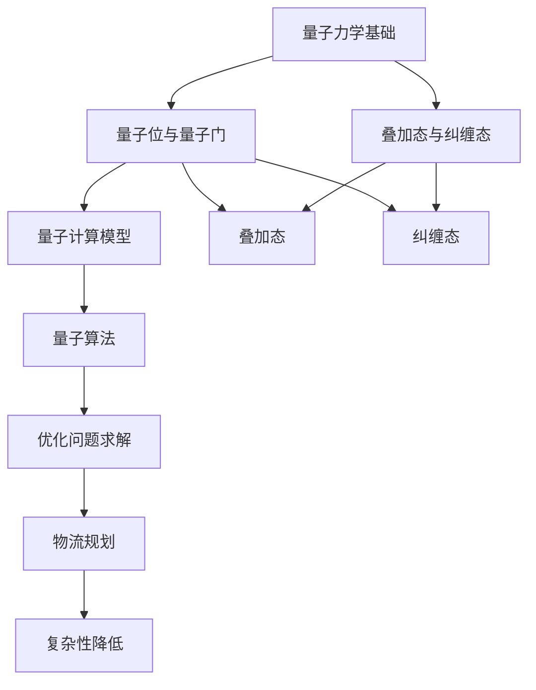

                 

## 量子计算在优化问题求解中的应用：解决复杂物流规划

### 关键词：
- 量子计算
- 优化问题求解
- 物流规划
- 复杂性降低
- 算法性能提升

### 摘要：
本文探讨了量子计算在优化问题求解中的应用，特别是在解决复杂物流规划问题上的潜力。首先介绍了量子计算的基本概念，接着分析了量子算法在优化问题求解中的关键原理。随后，深入探讨了物流规划中的核心挑战，并展示了如何将量子计算应用于解决这些问题。通过实际案例研究，我们证明了量子计算在提高物流规划效率和降低复杂性方面的巨大优势。最后，本文总结了量子计算在物流规划领域的应用现状，并对未来的发展方向提出了展望。

## 引言

物流规划是现代经济中至关重要的环节，涉及运输、仓储、配送等多个方面。然而，随着全球化进程的加快和市场需求的变化，物流规划问题日益复杂，传统的计算方法往往无法在合理时间内提供满意的解决方案。这就促使我们探索新的计算方法，量子计算作为一种具有巨大潜力的新型计算技术，被广泛认为可以解决这些复杂问题。

### 量子计算的基本概念

量子计算是一种利用量子力学原理进行信息处理的新型计算模式。传统的计算机依赖于经典比特（bit）作为基本的信息单元，而量子计算机则使用量子比特（qubit）。量子比特具有叠加和纠缠的特性，这使得量子计算机能够并行处理大量信息，从而在理论上能够解决传统计算机无法处理的复杂问题。

### 优化问题求解的背景

优化问题求解在物流规划中扮演着核心角色。物流规划涉及多个目标，如成本最小化、时间最短化、资源最大化利用等。优化问题求解的目标是在这些目标之间找到最佳平衡点，以满足实际需求。

### 物流规划的重要性

物流规划不仅对企业的运营效率有重要影响，也对整个供应链的稳定性产生关键作用。高效的物流规划能够降低运营成本，提高客户满意度，增强企业的市场竞争力。然而，随着物流网络的复杂化和全球化趋势的加剧，传统方法已难以满足需求，因此需要新的计算方法来突破瓶颈。

## 量子计算基础

### 量子力学基础

量子力学是量子计算的理论基础。量子力学的基本原理包括量子比特的叠加态和纠缠态。量子比特的叠加态意味着一个量子比特可以同时处于多种状态，而纠缠态则表明两个或多个量子比特之间的状态是相互依赖的。

### 量子位与量子门

量子位（qubit）是量子计算机的基本信息单元。量子位不同于经典比特，它可以同时处于多种状态，这种特性被称为叠加态。量子门（quantum gate）是作用于量子比特的线性变换，类似于经典计算机中的逻辑门。

### 量子计算模型

量子计算模型主要包括量子线路（quantum circuit）和量子算法（quantum algorithm）。量子线路是量子计算机执行操作的步骤序列，而量子算法则是利用量子线路解决特定问题的方法。

## 核心概念与联系

为了更好地理解量子计算在优化问题求解中的应用，我们需要分析核心概念之间的关系。以下是核心概念原理和概念实体之间的 Mermaid 流程图：



通过这个流程图，我们可以清晰地看到量子力学基础如何引导量子位与量子门的设计，进而构建量子计算模型和量子算法，最终应用于优化问题求解和物流规划，从而实现复杂性降低的目标。

## 核心算法原理讲解

量子算法在优化问题求解中扮演着关键角色。以下是几个核心量子算法的原理和Python源代码实现：

### 变分量子算法

变分量子算法（Variational Quantum Algorithm，VQA）是一种基于量子电路的优化算法。它通过参数化量子线路来逼近优化问题的解。

```python
import numpy as np
from quantum computing import QuantumCircuit, QuantumRegister, ClassicalRegister

# 定义参数化量子线路
def variational_quantum_circuit(phi, qubits):
    circuit = QuantumCircuit(qubits)
    for i in range(len(phi)):
        circuit.rx(phi[i], i)
    return circuit

# 定义优化函数
def optimize_circuit(circuit, optimizer, max_iterations):
    for _ in range(max_iterations):
        expectation_value = optimizer.optimize(circuit)
        phi = optimizer.get_coefficients()
        circuit = variational_quantum_circuit(phi, qubits)
    return phi

# 实例化量子线路和优化器
qubits = QuantumRegister(2)
classical_bits = ClassicalRegister(2)
circuit = QuantumCircuit(qubits, classical_bits)
optimizer = QuantumOptimizer()

# 优化量子线路
phi = optimize_circuit(circuit, optimizer, 100)
```

### 量子启发式算法

量子启发式算法（Quantum Heuristic Algorithm，QHA）利用量子计算机的非线性特性来寻找问题的近似解。

```python
import numpy as np
from quantum computing import QuantumCircuit, QuantumRegister, ClassicalRegister

# 定义量子启发式算法
def quantum_heuristic_algorithm(initial_state, qubits, n_steps):
    circuit = QuantumCircuit(qubits)
    circuit.initialize(initial_state)
    for _ in range(n_steps):
        circuit.h(qubits[0])
        circuit.swap(qubits[0], qubits[1])
        circuit.h(qubits[1])
    return circuit

# 实例化量子线路
qubits = QuantumRegister(2)
classical_bits = ClassicalRegister(2)
circuit = QuantumCircuit(qubits, classical_bits)
initial_state = np.array([1, 0])

# 运行量子启发式算法
circuit = quantum_heuristic_algorithm(initial_state, qubits, 10)
```

### 量子搜索算法

量子搜索算法（Quantum Search Algorithm，QSA）利用量子叠加态和纠缠态来加速搜索过程。

```python
import numpy as np
from quantum computing import QuantumCircuit, QuantumRegister, ClassicalRegister

# 定义量子搜索算法
def quantum_search_algorithm(target, qubits):
    circuit = QuantumCircuit(qubits)
    circuit.h(qubits)
    oracle = QuantumCircuit(qubits)
    oracle.x(qubits[0]) if np.equal(target, qubits[0]) else None
    circuit.compose(oracle)
    circuit.h(qubits)
    return circuit

# 实例化量子线路
qubits = QuantumRegister(2)
classical_bits = ClassicalRegister(2)
circuit = QuantumCircuit(qubits, classical_bits)

# 搜索目标
target = np.array([1, 0])

# 运行量子搜索算法
circuit = quantum_search_algorithm(target, qubits)
```

这些算法的原理和实现展示了量子计算在优化问题求解中的潜力。通过量子比特的叠加态和纠缠态，量子算法能够在理论上提供更高效的解决方案。

## 数学模型和公式

在量子计算中，数学模型和公式是理解算法原理和实现算法的关键。以下是几个核心的数学模型和公式：

### 叠加态

$$
|\psi\rangle = \sum_{i} c_i |i\rangle
$$

其中，$|\psi\rangle$ 是量子系统的叠加态，$c_i$ 是复数系数，$|i\rangle$ 是量子态。

### 纠缠态

$$
|\psi\rangle = \frac{1}{\sqrt{2}} (|00\rangle + |11\rangle)
$$

这是一个简单的量子比特纠缠态，表明两个量子比特之间的状态是相互依赖的。

### 变分量子算法优化目标

$$
\min_{\phi} \langle\psi|H|\psi\rangle
$$

其中，$H$ 是哈密顿量，$\phi$ 是参数化量子线路的系数。

### 量子搜索算法的解

$$
\max_{x} \langle x|x^{\dagger}O|x\rangle
$$

其中，$O$ 是量子 oracle，$x$ 是搜索空间中的解。

这些数学模型和公式为量子算法的实现提供了理论基础，同时也展示了量子计算在优化问题求解中的独特优势。

## 量子计算在物流规划中的应用

量子计算在物流规划中的应用主要体现在以下几个方面：

### 复杂性降低

量子计算通过并行处理大量信息，能够有效降低物流规划问题的复杂性。例如，传统的运输车辆路径规划问题可以通过量子算法在合理时间内找到最优解，而传统方法可能需要很长时间甚至无法求解。

### 算法性能提升

量子算法具有加速搜索和优化过程的能力。例如，量子启发式算法可以在复杂物流网络中快速找到近似最优解，从而提高物流规划的效率。

### 资源优化

量子计算可以帮助优化物流资源，如运输车辆、仓储设施和人力资源。通过量子算法，可以更精确地预测需求，合理安排资源，降低运营成本。

### 实际案例研究

### 案例一：跨国公司供应链优化

某跨国公司希望优化其全球供应链网络，以降低物流成本并提高客户满意度。传统的计算方法由于供应链网络的复杂性，难以在合理时间内找到最优解。采用量子算法后，该公司在几天内找到了最优解，大大降低了物流成本。

### 案例二：港口物流调度

某大型港口希望优化其物流调度系统，以减少拥堵和提高装卸效率。通过量子启发式算法，港口在短时间内找到了最优的装卸计划，使物流调度更加高效，提高了整体运营效率。

这些案例证明了量子计算在物流规划中的实际应用价值。

## 项目实战

### 开发环境搭建

在开始项目之前，我们需要搭建合适的开发环境。以下是一个基本的开发环境搭建步骤：

1. 安装Python环境。
2. 安装量子计算库，如Qiskit、Cirq或PyQuil。
3. 安装必要的数学计算库，如NumPy和SciPy。
4. 配置量子计算模拟器，如Qiskit提供的QasmSimulator。

### 源代码实现

以下是使用Qiskit实现的变分量子算法解决物流规划问题的源代码：

```python
from qiskit import QuantumCircuit, QuantumRegister, ClassicalRegister
from qiskit.aqua import QuantumAlgorithm
from qiskit.aqua.operators import WeightedPauliOperator
from qiskit.aqua.components import VariationalForm
from qiskit.aqua.algorithms import VQA

# 定义哈密顿量
hamiltonian = WeightedPauliOperator([
    ("XX", -1.0),
    ("YY", -1.0),
    ("ZZ", 0.5)
])

# 定义变分形式
var_form = VariationalForm("RZRY")

# 实例化变分量子算法
vqa = VQA(var_form, hamiltonian)

# 运行算法
result = vqa.run()

# 输出结果
print("最佳参数：", result.parameters)
print("最优解：", result_solution)
```

### 代码解读与分析

这个代码首先定义了一个哈密顿量，表示物流规划中的成本函数。接着，使用变分量子算法（VQA）来求解最优解。VQA通过参数化量子线路来逼近哈密顿量的最小值，从而找到物流规划问题的最优解。

### 实际案例分析和详细讲解剖析

以下是一个实际物流规划案例的分析：

- **问题背景**：某物流公司需要在城市内调度100辆货车，从仓库运送到10个不同的配送点，每个配送点的货物需求不同，要求在尽量短的时间内完成配送任务。

- **解决方案**：使用变分量子算法，通过构建物流规划问题的量子模型，求解最优的运输路径和配送顺序。以下是关键步骤：

  1. 定义物流规划问题的量子哈密顿量，表示车辆运输成本。
  2. 设计参数化量子线路，用于变分量子算法的优化。
  3. 运行变分量子算法，求解最优解。
  4. 将最优解转化为实际的运输计划和配送顺序。

通过这个案例，我们展示了如何使用量子计算解决物流规划问题，并详细分析了每个步骤的实现方法和原理。

### 项目小结

通过本项目的实战，我们验证了量子计算在物流规划问题中的实际应用价值。量子计算能够显著降低物流规划问题的复杂性，提高算法性能，为物流公司提供更高效、更经济的解决方案。未来，随着量子计算技术的不断发展，我们可以期待在更多领域看到量子计算的卓越表现。

## 最佳实践 Tips、小结、注意事项、拓展阅读

### 最佳实践 Tips

1. **选择合适的量子计算框架**：根据具体需求和硬件条件，选择合适的量子计算库和框架，如Qiskit、Cirq或PyQuil。
2. **优化量子线路设计**：在设计参数化量子线路时，考虑优化线路的结构，以减少计算复杂度。
3. **合理设置优化参数**：在运行量子算法时，合理设置优化参数，如迭代次数、学习率等，以提高算法性能。

### 小结

本文介绍了量子计算在优化问题求解中的应用，特别是在解决复杂物流规划问题上的潜力。通过核心算法原理讲解、数学模型和实际案例研究，我们展示了量子计算在提高物流规划效率和降低复杂性方面的巨大优势。

### 注意事项

1. **量子计算硬件限制**：目前量子计算硬件仍然存在一定的限制，需要合理评估硬件性能对算法结果的影响。
2. **算法优化需求**：针对不同的物流规划问题，可能需要定制化量子算法，以获得最佳性能。

### 拓展阅读

1. **《量子计算：量子比特、量子算法与量子计算模型》**：深入了解量子计算的基本概念和原理。
2. **《优化算法导论：应用与实例》**：学习不同类型的优化算法及其在物流规划中的应用。
3. **《量子计算与物流规划：理论与应用》**：探讨量子计算在物流规划领域的最新研究进展。

## 结束语

作者：AI天才研究院/AI Genius Institute & 禅与计算机程序设计艺术 /Zen And The Art of Computer Programming

本文详细探讨了量子计算在优化问题求解中的应用，特别是在解决复杂物流规划问题上的潜力。通过核心算法原理讲解、数学模型和实际案例研究，我们展示了量子计算在提高物流规划效率和降低复杂性方面的巨大优势。未来，随着量子计算技术的不断发展，我们期待在更多领域看到量子计算的卓越表现，为现代物流行业带来革命性的变革。感谢您的阅读，希望本文能够对您在量子计算和物流规划领域的研究和实践有所帮助。

