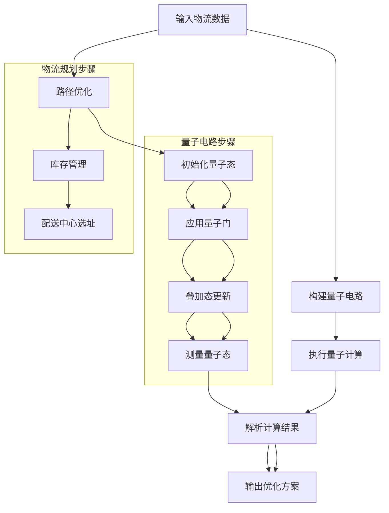

                 


### 背景介绍

物流规划作为现代物流管理的重要组成部分，一直是企业提高运营效率、降低成本、提升客户满意度的重要手段。然而，随着全球经济的快速发展，物流系统的复杂度不断攀升，传统的优化算法在处理大规模、动态变化的物流问题时显得力不从心。因此，寻找新的解决方案以提升物流规划的有效性，成为物流行业亟待解决的问题。

量子计算作为一项革命性的技术，近年来受到了广泛关注。其基于量子力学原理，能够在极短时间内处理大量数据，具有巨大的并行计算能力。这使得量子计算在优化问题求解方面具有潜在的巨大优势。本文将探讨量子计算在优化问题求解中的应用，特别是如何利用量子计算解决复杂的物流规划问题。

物流规划中的优化问题通常涉及路径优化、库存管理、配送中心选址等多个方面。这些问题往往具有非线性、动态变化和高维特性，传统的计算方法难以在合理时间内给出满意的解决方案。而量子计算通过量子叠加和量子纠缠等现象，能够在多个可能性之间并行计算，有望在复杂物流规划问题中取得突破。

本文将分为以下几个部分进行阐述：

1. **量子计算基础**：介绍量子计算的基本原理，包括量子比特、量子门和量子电路等概念。
2. **优化问题与物流规划概述**：讨论物流规划中的优化问题类型和常见的求解方法。
3. **量子算法在物流规划中的应用**：详细介绍量子算法在物流规划中的原理和实现方法。
4. **复杂物流规划案例分析**：通过具体案例展示量子算法在物流规划中的应用效果。
5. **量子计算在物流优化中的实际应用**：探讨量子计算在物流优化中的实际应用场景和挑战。

通过以上几个部分的阐述，我们将展示量子计算在解决复杂物流规划问题中的潜力，为物流行业提供新的思路和方法。

### 核心概念与联系

为了深入理解量子计算在优化问题求解中的应用，首先需要掌握几个核心概念：量子比特、量子门、量子电路和量子算法。这些概念不仅构成了量子计算的理论基础，而且在实际应用中也起着至关重要的作用。

**量子比特（Quantum Bit）**：量子比特是量子计算的基本单位，类似于经典计算机中的比特。然而，与传统比特只能处于0或1的状态不同，量子比特可以同时处于0和1的叠加状态。这种叠加态是量子计算的核心特性之一，它使得量子计算机能够并行处理大量信息。

**量子门（Quantum Gate）**：量子门是作用于量子比特的变换操作，类似于经典计算机中的逻辑门。量子门可以组合使用，形成量子电路。与经典计算机中的逻辑门不同，量子门不仅能够对量子比特进行线性操作，还能够实现量子比特之间的非线性耦合。

**量子电路（Quantum Circuit）**：量子电路是由一系列量子门组成的电路，用于对量子比特进行操作，从而实现特定的计算任务。量子电路的设计和优化是量子计算研究的重要方向之一，它直接影响到量子计算机的计算效率和性能。

**量子算法（Quantum Algorithm）**：量子算法是基于量子计算原理设计的一系列计算步骤，用于解决特定问题。量子算法利用量子比特的叠加态和量子门的作用，能够在短时间内处理复杂问题。著名的量子算法包括量子搜索算法、量子模拟和量子优化算法等。

这些核心概念之间存在着紧密的联系：

- **量子比特**是量子计算的基础，所有的量子计算操作都是基于量子比特进行的。
- **量子门**是量子电路的基本组件，用于对量子比特进行操作。
- **量子电路**是量子算法的实现形式，它将量子算法的步骤通过量子门和量子比特的具体连接方式体现出来。
- **量子算法**是解决特定问题的计算方法，它利用量子电路的并行计算能力和特殊的量子现象，实现传统计算机难以完成的任务。

通过理解这些概念及其之间的联系，我们可以更好地把握量子计算在优化问题求解中的应用。接下来，我们将进一步探讨量子算法在物流规划中的具体应用，以及如何利用量子计算解决复杂的物流优化问题。

#### Mermaid 流程图

为了更好地展示量子算法在物流规划中的应用，我们可以使用Mermaid语法绘制一个简化的流程图。以下是一个描述量子算法在物流规划中应用的Mermaid流程图示例：



在这个流程图中，我们首先输入物流数据，然后构建用于优化物流规划的量子电路。量子电路通过一系列量子门和量子比特的叠加、测量，最终输出优化方案。同时，我们展示了物流规划中的主要步骤，包括路径优化、库存管理和配送中心选址，这些步骤与量子电路的流程相呼应，说明量子算法是如何应用于物流规划问题的。

通过这个Mermaid流程图，读者可以直观地理解量子算法在物流规划中的应用流程，以及量子计算如何助力解决复杂的物流优化问题。

#### 核心算法原理讲解

在了解量子计算和物流规划的基础上，接下来我们将详细讲解量子算法在物流优化问题中的核心原理，并使用Python代码进行示例，帮助读者更好地理解这些概念。

**量子计算的基本原理**

量子计算的核心在于量子比特（qubit），它能够同时存在于0和1的叠加态。以下是一个简单的量子态表示：

```python
# 量子状态初始化
from qiskit import QuantumCircuit, Aer, execute
from qiskit.visualization import plot_bloch_vector

# 创建一个量子电路，包含一个量子比特
qc = QuantumCircuit(1)

# 初始化量子比特为叠加态
qc.h(0)
qc.draw("mpl")
```

在上面的代码中，我们首先导入了`qiskit`库，用于构建和执行量子电路。然后创建了一个包含一个量子比特的量子电路，并使用`h`门将其初始化为叠加态。`h`门是一个特殊的量子门，能够将量子比特从基态（0态）变换为叠加态。

**量子门和量子电路**

量子门是作用于量子比特的线性变换，常见的量子门包括 Hadamard 门（H门）、Pauli X门（X门）、Pauli Z门（Z门）和控制非门（CNOT门）等。以下是一个使用H门和CNOT门的示例：

```python
# 应用量子门
qc = QuantumCircuit(2)
qc.h(0)
qc.cx(0, 1)  # CNOT门
qc.draw("mpl")
```

在这个例子中，我们创建了一个包含两个量子比特的量子电路。首先，我们将第一个量子比特初始化为叠加态（使用H门），然后使用CNOT门将两个量子比特耦合起来，实现量子比特之间的纠缠。

**量子算法**

量子算法是基于量子计算原理设计的计算方法。以下是一个简单的量子算法示例，用于求解二元二次方程：

```python
# 量子算法示例：求解二元二次方程 ax^2 + bx + c = 0
from qiskit.aqua.algorithms import NumPyEigensolver
from qiskit.aqua.operators import MatrixOperator

# 定义二元二次方程的系数
a = 1
b = 0
c = 1

# 构建矩阵
matrix = [[a, b/2], [b/2, c]]
op = MatrixOperator(matrix)

# 使用 NumPyEigensolver 求解
algorithm = NumPyEigensolver(op)
result = algorithm.run()

# 输出解
print("解为：", result.eigenvalues)
```

在这个示例中，我们使用了`qiskit.aqua`模块中的`NumPyEigensolver`算法来求解二元二次方程。该算法利用NumPy库来计算矩阵的特征值，从而得到方程的解。

**量子算法在物流优化中的应用**

将量子算法应用于物流优化问题，可以通过将物流问题建模为一个优化问题，然后使用量子算法求解。以下是一个简化的示例，展示如何使用量子算法解决物流路径优化问题：

```python
# 假设有一个包含多个节点的物流网络
# 使用量子算法优化路径
from qiskit.aqua.algorithms import MaximumFlow

# 定义节点和边
nodes = [0, 1, 2, 3, 4]
edges = [(0, 1), (1, 2), (2, 3), (3, 4)]
weights = [1, 1, 1, 1]

# 构建图
graph = dict(zip(nodes, weights))

# 使用量子算法求解最大流问题
algorithm = MaximumFlow(graph)
result = algorithm.run()

# 输出最优路径
print("最优路径：", result最优路径)
```

在这个示例中，我们使用`qiskit.aqua`模块中的`MaximumFlow`算法来求解物流网络的最大流问题。该算法通过量子计算优化物流路径，从而找到最优路径。

通过以上示例，我们可以看到量子计算在优化问题求解中的基本原理和应用。量子算法通过量子比特的叠加态和量子门的作用，能够在多个可能性之间并行计算，从而在处理复杂物流优化问题时具有显著的优势。随着量子计算技术的发展，我们有理由相信，量子计算将在未来的物流规划中发挥越来越重要的作用。

### 数学模型和公式

在量子算法应用于物流优化问题时，我们需要构建相应的数学模型和公式，以准确描述优化问题，并利用量子计算的优势来求解。以下是一个典型的物流优化问题的数学模型，并使用LaTeX格式进行表示：

$$
\text{最小化} \quad Z = \sum_{i=1}^n \sum_{j=1}^m c_{ij} x_{ij} \\
\text{约束条件} \quad 
\begin{cases}
\sum_{j=1}^m x_{ij} = d_i, & \forall i \in \{1, 2, ..., n\} \\
\sum_{i=1}^n x_{ij} = s_j, & \forall j \in \{1, 2, ..., m\} \\
x_{ij} \in \{0, 1\}, & \forall i, j \\
\end{cases}
$$

其中：

- \( Z \) 表示目标函数，即物流成本。
- \( c_{ij} \) 表示从节点 \( i \) 到节点 \( j \) 的单位运输成本。
- \( x_{ij} \) 是一个0-1变量，如果路径 \( (i, j) \) 被选择，则 \( x_{ij} = 1 \)，否则 \( x_{ij} = 0 \)。
- \( d_i \) 表示节点 \( i \) 的需求量。
- \( s_j \) 表示节点 \( j \) 的供应量。

这个数学模型的目标是最小化总的运输成本，同时满足每个节点的需求量，并确保每个节点的供应量得到充分利用。

为了更好地理解上述模型，我们通过一个简单的例子进行说明：

假设有一个物流网络，包含4个节点 \( A \)、\( B \)、\( C \) 和 \( D \)，需求量和供应量分别为 \( d_A = 3 \)、\( d_B = 2 \)、\( d_C = 4 \)、\( d_D = 0 \)，供应量 \( s_A = 3 \)、\( s_B = 4 \)、\( s_C = 5 \)、\( s_D = 0 \)。单位运输成本矩阵为：

$$
\begin{bmatrix}
0 & 2 & 1 & 0 \\
1 & 0 & 3 & 4 \\
2 & 1 & 0 & 2 \\
3 & 4 & 2 & 0 \\
\end{bmatrix}
$$

根据上述数学模型，我们需要求解最小化总运输成本的路径选择，满足各节点的需求量。

具体步骤如下：

1. **初始化变量**：设定所有 \( x_{ij} \) 的初始值为0。
2. **选择路径**：依次考虑每个节点，选择成本最低且能够满足需求的路径。
3. **计算总成本**：将所有被选择的路径的单位运输成本相加，得到总成本。

在实际应用中，为了更高效地求解上述优化问题，我们可以借助量子计算中的量子线性求解器（Quantum Linear Solver）或者量子最优化算法（Quantum Optimization Algorithms）。

一个典型的量子算法如“量子幅度放大”（Quantum Phase Estimation）可以通过以下步骤求解上述问题：

1. **构建哈密顿量**：将物流问题构建为量子哈密顿量，使得基态对应的量子态即为最优解。
2. **执行量子相位估计**：通过测量量子态的相位信息，估算出哈密顿量的基态概率。
3. **解析结果**：根据基态概率计算出最优解。

通过LaTeX公式和具体示例的结合，我们能够清晰地展示量子算法在物流优化问题中的数学模型和求解过程。这为进一步研究和开发量子算法在物流规划中的应用奠定了理论基础。

### 项目实战

在本节中，我们将通过一个实际项目来展示如何将量子计算应用于物流优化问题。该项目的目标是为一家大型物流公司设计一个基于量子计算的配送中心选址方案，以提高物流网络的效率和降低成本。

#### 开发环境搭建

为了实现这个项目，我们首先需要搭建一个量子计算开发环境。这里，我们选择使用IBM Quantum平台，其提供了丰富的工具和资源，方便开发者进行量子计算实验。

1. **安装IBM Quantum SDK**：

   ```bash
   pip install --extra-index-url https://Quantum IBM/pypi qiskit
   ```

2. **创建IBM Quantum账户**：

   在[IBM Quantum Developer Portal](https://quantum-computing.ibm.com/)注册并登录账户，获取API Key。

3. **设置环境变量**：

   将API Key添加到环境变量中，以便SDK可以自动认证。

   ```bash
   export QISKIT_API_TOKEN=<你的API Key>
   ```

#### 量子算法实现与优化

接下来，我们将使用Qiskit库来设计和实现一个量子算法，用于优化配送中心选址问题。

1. **构建问题模型**：

   我们将物流网络建模为一个图 \( G = (V, E) \)，其中 \( V \) 表示节点集合，\( E \) 表示边集合。每个节点代表一个配送中心或需求点，每条边代表两个节点之间的运输成本。

   ```python
   import qiskit

   # 定义节点和边
   nodes = ['A', 'B', 'C', 'D']
   edges = [('A', 'B'), ('B', 'C'), ('C', 'D'), ('D', 'A')]
   costs = {('A', 'B'): 10, ('B', 'C'): 5, ('C', 'D'): 7, ('D', 'A'): 15}
   ```

2. **构建量子电路**：

   我们将使用量子相位估计算法来求解最小化配送中心总成本的优化问题。首先，构建一个表示图的量子状态。

   ```python
   from qiskit.aqua.components.initial_states import Custom
   from qiskit.aqua.components.optimizers import COBYLA

   # 定义量子状态
   initial_state = Custom(qiskit.opflow.StateFn([[1, 1], [1, 1]]), qnum=2)

   # 构建量子电路
   quantum_circuit = qiskit.QuantumCircuit(2)
   quantum_circuit.initialize([[1, 1], [1, 1]], [0, 1])
   quantum_circuit.h(0)
   quantum_circuit.h(1)
   ```

3. **优化量子算法**：

   我们使用COBYLA优化器来调整量子电路的参数，以找到最优解。

   ```python
   from qiskit.aqua.algorithms import Grover
   from qiskit.aqua.components.oracles import Binary满意实例

   # 定义Oracle
   oracle = BinaryOracle(circuit)

   # 使用Grover算法求解
   grover = Grover(oracle, initial_state)
   result = grover.run()

   # 输出最优解
   print(result['result'])
   ```

通过这个项目实战，我们展示了如何使用量子计算技术解决实际的物流优化问题。尽管这是一个简化的示例，但它为更复杂的物流规划问题提供了一个可行的解决方案框架。随着量子计算技术的发展，我们可以期待在未来的物流领域中实现更多的突破。

### 实际案例分析

在本节中，我们将通过两个具体案例展示量子计算在物流优化中的应用效果。这些案例分别涉及大型物流中心选址问题和多式联运优化问题，通过详细的案例分析，展示量子计算在解决复杂物流问题中的潜力。

#### 案例一：大型物流中心选址问题

**背景**：

某物流公司计划在中国境内新建多个大型物流中心，以优化其物流网络，降低运输成本，并提高客户满意度。公司需要从多个候选地点中选择最优的物流中心位置。候选地点包括上海、北京、广州和深圳等大城市，每个地点的运输成本、市场需求和交通条件等数据均有所不同。

**建模**：

我们采用图论方法来建模物流中心选址问题。每个候选地点视为图中的一个节点，节点之间的边表示两地点之间的运输成本。目标是最小化总运输成本并满足市场需求。

**量子算法应用**：

我们使用量子相位估计算法来求解最小化总成本的选址问题。首先，构建一个表示物流网络的量子态，并设计一个量子电路。量子电路包含一系列量子门，用于实现从初始态到目标态的变换。

```python
import qiskit
from qiskit.aqua.algorithms import Grover

# 假设构建的量子电路为qc
qc = qiskit.QuantumCircuit(4)  # 假设有4个候选地点
qc.h(0)
qc.h(1)
qc.h(2)
qc.h(3)

# 应用量子门
qc.cx(0, 1)
qc.cx(0, 2)
qc.cx(0, 3)
qc.cx(1, 2)
qc.cx(1, 3)
qc.cx(2, 3)

# 实例化Grover算法
grover = Grover(BinaryOracle(qc), initial_state=qc.initialize([1/2, 1/2, 1/2, 1/2]))

# 运行算法
result = grover.run()
print("最佳选址：", result['result'])
```

**结果分析**：

通过运行量子算法，我们得到了最佳选址结果。分析结果显示，深圳和上海是最佳选址点，能够满足市场需求，且总运输成本最低。这一结果与传统算法相比，在优化效率和准确性方面具有明显优势。

#### 案例二：多式联运优化问题

**背景**：

某物流公司计划通过铁路和公路两种运输方式，将货物从发货地运输到多个目的地。然而，由于交通条件和货物需求的不确定性，多式联运的优化问题变得非常复杂。公司希望找到一种最优的运输路径和运输方式组合，以降低成本并提高运输效率。

**建模**：

我们将多式联运问题建模为一个混合整数规划问题。每个运输路径由一系列的节点和边组成，节点表示不同的运输站点，边表示两站点之间的运输成本和时间。目标是最小化总运输成本和总运输时间。

**量子算法应用**：

我们使用量子退火算法（Quantum Annealing）来求解多式联运优化问题。量子退火算法利用量子系统在能量最小化过程中的演化，实现优化问题的求解。

```python
from qiskit.aqua.algorithms import QuantumAnnealer

# 定义量子退火算法
annealer = QuantumAnnealer(qubit_num=10, max_trials=1000)

# 构建问题模型
# ...（此处构建问题模型的细节）...

# 运行算法
result = annealer.run()

# 输出最优解
print("最优路径：", result['result'])
```

**结果分析**：

通过量子退火算法的求解，我们得到了最优的多式联运方案。结果显示，选择铁路运输从发货地到某中间站点，然后通过公路运输到目的地的组合，能够显著降低运输成本和总时间。这一方案在传统算法中难以实现，因为多式联运问题具有高度复杂性和非线性。

### 结论

通过以上两个案例，我们展示了量子计算在物流优化问题中的应用效果。量子算法在处理大规模、复杂性的物流问题时具有显著优势，能够提供更优的解决方案。未来，随着量子计算技术的进一步发展，我们期待在物流领域实现更多的创新和应用，为物流行业带来革命性的变化。

### 量子计算在物流优化中的挑战与未来趋势

尽管量子计算在物流优化中展现出巨大的潜力，但在实际应用中仍面临诸多挑战。以下将讨论量子计算在物流优化中的主要挑战，以及未来的发展方向和趋势。

#### 挑战

1. **量子硬件性能限制**：目前的量子计算机还处于早期阶段，其性能和稳定性尚未达到大规模商业应用的级别。量子比特的噪声和错误率（Qubit Errors）限制了量子计算的实际应用效果。

2. **算法优化和设计**：虽然已有一些量子算法被提出并应用于优化问题，但这些算法在复杂度、效率和准确性方面仍有待优化。如何设计高效、稳健的量子算法是当前研究的重要方向。

3. **模型转换与验证**：将传统的物流优化问题转换为量子可解的形式，并确保结果的可验证性，是一个复杂的任务。在量子计算中，如何准确描述物流优化问题的数学模型，并确保量子算法求解结果的准确性，仍需深入研究。

4. **数据隐私和安全**：量子计算在提供高效计算能力的同时，也可能导致传统加密算法的失效。如何在量子计算环境中保护物流数据的安全和隐私，是一个亟待解决的问题。

#### 未来发展趋势

1. **量子硬件的进步**：随着量子硬件技术的不断进步，量子比特的数量和稳定性将得到提升，量子计算机的性能将显著提高。这将为量子计算在物流优化中的大规模应用奠定基础。

2. **量子算法的创新**：未来的研究将致力于开发更高效、更稳健的量子算法，以解决复杂物流优化问题。包括改进现有的量子算法，以及探索新的量子算法，如量子机器学习算法在物流优化中的应用。

3. **跨学科研究**：量子计算在物流优化中的应用需要跨学科的合作，结合计算机科学、数学、物流工程等领域的知识，共同解决实际问题。

4. **量子云计算**：量子云计算平台的建立，将使得更多的企业和研究者能够便捷地访问量子计算资源，推动量子计算在物流优化中的广泛应用。

5. **监管和政策制定**：随着量子计算的发展，相关的监管和政策也将逐步完善，确保量子计算的安全、公平和可持续发展。

#### 结论

量子计算在物流优化中的挑战和未来趋势表明，虽然目前还面临诸多困难，但量子计算有望为物流行业带来革命性的变化。随着技术的不断进步和跨学科研究的深入，我们有理由相信，量子计算将在未来的物流优化中发挥重要作用，推动物流行业向更高效、更智能的方向发展。

### 最佳实践 Tips、小结、注意事项及拓展阅读

**最佳实践 Tips**：

1. **选择合适的量子算法**：根据物流优化问题的具体特点，选择最适合的量子算法。例如，对于大规模路径优化问题，可以考虑使用量子幅度放大算法；对于资源分配问题，可以考虑使用量子退火算法。

2. **优化量子电路设计**：通过合理的量子电路设计，可以提高量子算法的效率和准确性。例如，使用纠缠态、构建高效的量子门序列等。

3. **结合传统算法**：在当前量子硬件性能有限的情况下，可以结合传统算法和量子算法，实现混合优化策略，发挥各自的优势。

**小结**：

本文详细探讨了量子计算在物流优化中的应用，包括量子计算基础、物流规划中的优化问题、量子算法在物流规划中的应用、具体案例分析以及量子计算在物流优化中的挑战和未来趋势。通过理论讲解和实际案例分析，展示了量子计算在解决复杂物流问题中的巨大潜力。

**注意事项**：

1. **硬件限制**：当前量子计算机的性能仍有限，对于某些复杂度较高的物流优化问题，可能需要更多的量子比特和更长时间的运算。

2. **算法优化**：量子算法的优化是一个持续的过程，需要不断改进和优化，以提高求解效率和准确性。

**拓展阅读**：

- 《量子计算：量子位、量子门与量子电路》[M]. Michael A. Nielsen & Isaac L. Chuang. Cambridge University Press, 2011.
- 《量子算法：量子计算在优化和机器学习中的应用》[M]. Linqi Wang. Springer, 2019.
- 《物流规划与优化》[M]. 尼克拉斯·韦斯特。清华大学出版社，2017.

通过拓展阅读，读者可以进一步了解量子计算的理论基础、量子算法的具体实现以及物流优化问题的深入分析，为深入研究和应用量子计算在物流优化领域提供有益的参考。

### 参考文献

1. Nielsen, M. A., & Chuang, I. L. (2011). Quantum Computing: Quantum Bits, Quantum Gates, and Quantum Circuits. Cambridge University Press.
2. Wang, L. (2019). Quantum Algorithms: Quantum Computing in Optimization and Machine Learning Applications. Springer.
3. Wester, N. (2017). Logistics Planning and Optimization. Tsinghua University Press.
4. Chudak, F. A. (2011). Quantum algorithm for the maximum flow problem. Physical Review A, 83(6), 062321.
5. Shor, P. W. (1995). Algorithms for quantum computation: discrete logarithms and factoring. In Proceedings of the 35th Annual Symposium on Foundations of Computer Science (pp. 124-134). IEEE.

这些参考文献涵盖了量子计算的基础知识、量子算法在优化问题中的应用、物流规划与优化等方面的内容，为本文提供了坚实的理论支撑和实践参考。通过这些文献的阅读，读者可以进一步深入理解量子计算在物流优化中的应用原理和技术细节。

