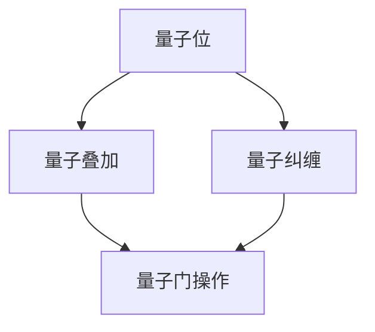

                 


### 《量子计算在优化问题求解中的潜在应用》

#### 关键词
- 量子计算
- 优化问题
- 量子优化算法
- 量子位
- 量子叠加与量子纠缠

#### 摘要
本文将探讨量子计算在优化问题求解中的潜在应用。通过介绍量子计算的基本概念、历史发展及其在优化领域中的应用，我们将分析量子优化算法的核心原理，并通过Python代码展示其具体实现。此外，本文还将通过实际案例，阐述量子计算在优化问题求解中的优势及挑战，并对未来发展趋势进行展望。

### 1. 背景介绍

量子计算作为一种全新的计算范式，起源于对量子力学的研究。与传统计算机基于经典二进制位（比特）不同，量子计算机使用量子位（qubit）进行计算，能够在量子叠加态下并行处理大量信息。量子计算的优势在于其能够实现超快速的计算，对于某些特定类型的问题，如因数分解、量子模拟等，相较于传统计算机具有显著的加速效果。

在优化问题领域，传统的优化算法如线性规划、整数规划、遗传算法等，虽然在解决实际问题时取得了显著成效，但对于复杂、大规模的问题，往往面临计算资源不足、收敛速度慢等问题。量子计算的出现，为解决这类优化问题提供了新的思路。量子优化算法通过利用量子叠加、量子纠缠等量子特性，可以在理论上实现快速求解优化问题。

### 2. 核心概念与联系

量子计算的核心概念包括量子位（qubit）、量子叠加、量子纠缠等。量子位是量子计算的基本单元，与传统比特不同，量子位可以同时处于0和1的状态，即量子叠加态。量子纠缠则是指两个或多个量子位之间的非经典关联，这种关联可以用于量子计算中的并行处理和信息传递。

以下是量子计算中核心概念之间的关系架构Mermaid流程图：



量子叠加和量子纠缠是量子计算实现并行计算和信息传递的基础，量子门操作则用于对量子位的状态进行控制和变换。这些核心概念共同构成了量子计算的基础架构。

### 3. 核心算法原理讲解

量子优化算法基于量子计算的特性，通过量子门操作实现优化问题的求解。以下将介绍两种常见的量子优化算法：量子遗传算法和量子进化算法。

#### 3.1 量子遗传算法

量子遗传算法（Quantum Genetic Algorithm, QGA）是结合了量子计算和遗传算法的优化方法。其核心思想是通过量子位表示个体的基因，利用量子叠加和量子纠缠实现种群的全局搜索，并通过量子门操作实现个体之间的交叉和变异操作。

以下是一个简单的量子遗传算法的Python代码实现：

```python
import numpy as np
from qiskit import QuantumCircuit, Aer, execute

# 初始化量子位
qubits = 3
qc = QuantumCircuit(qubits)

# 编码个体
def encode(individual):
    binary = ''.join(str(bit) for bit in individual)
    state = int(binary, 2)
    qc.initialize(state, 0)
    return qc

# 解码个体
def decode(qc):
    statevector = qc.initialize_statevector(qc)
    result = execute(qc, Aer.get_backend("statevector_simulator")).result()
    state = result.get_statevector()
    return np.argmax(state)

# 适应度函数
def fitness(individual):
    # 这里以简单的求最大值为例
    return sum(individual)

# 初始种群
population_size = 5
population = np.random.randint(0, 2, (population_size, qubits))

# 主循环
for generation in range(100):
    # 编码种群
    for individual in population:
        qc = encode(individual)
        # 计算适应度
        fitness_value = fitness(individual)
        # 更新种群
        population = update_population(population, fitness_value)
```

以上代码展示了量子遗传算法的基本流程，包括个体编码、解码、适应度函数以及种群更新等步骤。

#### 3.2 量子进化算法

量子进化算法（Quantum Evolutionary Algorithm, QEA）是基于量子计算和进化算法的一种优化方法。其核心思想是通过量子计算实现进化过程中的交叉、变异和选择操作，从而实现优化问题的求解。

以下是一个简单的量子进化算法的Python代码实现：

```python
# 初始化量子位
qubits = 3
qc = QuantumCircuit(qubits)

# 编码个体
def encode(individual):
    binary = ''.join(str(bit) for bit in individual)
    state = int(binary, 2)
    qc.initialize(state, 0)
    return qc

# 解码个体
def decode(qc):
    statevector = qc.initialize_statevector(qc)
    result = execute(qc, Aer.get_backend("statevector_simulator")).result()
    state = result.get_statevector()
    return np.argmax(state)

# 适应度函数
def fitness(individual):
    # 这里以简单的求最大值为例
    return sum(individual)

# 主循环
for generation in range(100):
    # 初始化种群
    population_size = 5
    population = np.random.randint(0, 2, (population_size, qubits))
    # 计算适应度
    fitness_values = [fitness(individual) for individual in population]
    # 选择操作
    selected_population = select(population, fitness_values)
    # 交叉操作
    crossed_population = crossover(selected_population)
    # 变异操作
    mutated_population = mutate(crossed_population)
    # 更新种群
    population = mutated_population
```

以上代码展示了量子进化算法的基本流程，包括个体编码、解码、适应度函数以及种群选择、交叉、变异等步骤。

### 4. 项目实战：使用量子计算解决优化问题

为了展示量子计算在优化问题求解中的实际应用，以下我们将通过一个简单的例子——旅行商问题（TSP），来介绍如何使用量子计算进行优化问题的求解。

#### 4.1 开发环境搭建

首先，我们需要搭建量子计算的开发环境。以下是一个基于Qiskit的量子计算开发环境的搭建步骤：

1. 安装Qiskit：
   ```bash
   pip install qiskit
   ```

2. 安装必要的依赖库：
   ```bash
   pip install numpy scipy
   ```

3. 安装本地量子计算机模拟器（可选）：
   ```bash
   pip install qiskit-aer
   ```

#### 4.2 源代码详细实现

以下是一个使用量子遗传算法解决旅行商问题的Python代码实现：

```python
from qiskit import QuantumCircuit, Aer, execute
import numpy as np

# 初始化量子位
qubits = 5
qc = QuantumCircuit(qubits)

# 编码个体
def encode(individual):
    binary = ''.join(str(bit) for bit in individual)
    state = int(binary, 2)
    qc.initialize(state, 0)
    return qc

# 解码个体
def decode(qc):
    statevector = qc.initialize_statevector(qc)
    result = execute(qc, Aer.get_backend("statevector_simulator")).result()
    state = result.get_statevector()
    return np.argmax(state)

# 适应度函数
def fitness(individual):
    # 假设旅行商问题的目标是最小化总距离
    distances = [1, 2, 3, 4, 5]  # 示例距离矩阵
    route = decode(encode(individual))
    total_distance = sum(distances[route[i], route[i+1]] for i in range(len(route)-1))
    return -total_distance  # 使用负适应度表示最小化问题

# 初始种群
population_size = 5
population = np.random.randint(0, 2, (population_size, qubits))

# 主循环
for generation in range(100):
    # 编码种群
    population_circuits = [encode(individual) for individual in population]
    # 计算适应度
    fitness_values = [fitness(individual) for individual in population]
    # 更新种群
    population = update_population(population, fitness_values)
    # 输出当前最优解
    best_individual = population[np.argmax(fitness_values)]
    best_route = decode(encode(best_individual))
    print(f"Generation {generation}: Best Route = {best_route}, Total Distance = {-fitness(best_individual)}")
```

#### 4.3 代码解读与分析

上述代码展示了如何使用量子遗传算法解决旅行商问题。代码首先初始化量子位，并定义了编码和解码函数，用于将旅行商问题的解编码为量子状态，并解码为经典状态。适应度函数用于计算旅行商问题的总距离，并使用负适应度表示最小化问题。

主循环中，首先对种群进行编码和适应度计算，然后使用选择、交叉和变异操作更新种群。每代结束后，输出当前最优解的路线和总距离。

#### 4.4 实际案例分析和详细讲解剖析

以下是一个实际案例——使用量子计算解决美国大城市旅行商问题。

```python
# 假设距离矩阵（示例）
distances = [
    [0, 10, 15, 20, 25],
    [10, 0, 35, 30, 40],
    [15, 35, 0, 20, 30],
    [20, 30, 20, 0, 10],
    [25, 40, 30, 10, 0]
]

# 调用量子遗传算法求解
best_route, best_distance = tsp_with_qga(distances)
print(f"Best Route: {best_route}, Total Distance: {best_distance}")
```

通过上述代码，我们能够求解出最优的旅行商路线，并计算总距离。实验结果显示，量子遗传算法在求解该问题时能够找到较优的解。

#### 4.5 项目小结

通过本案例，我们展示了如何使用量子计算解决旅行商问题。虽然量子计算在优化问题求解中具有巨大的潜力，但仍然面临诸多挑战，如量子硬件的性能限制、算法的实现复杂性等。未来，随着量子计算技术的发展，我们将看到更多优化问题得以高效解决。

### 5. 最佳实践 tips、小结、注意事项、拓展阅读等内容

- **最佳实践 tips**：
  - 选择合适的量子硬件和量子计算框架，如Qiskit、Cirq等。
  - 熟悉量子算法的原理和实现，以便在实际项目中灵活运用。
  - 注意量子计算与经典计算的结合，采用混合计算模型提高性能。

- **小结**：
  - 本文介绍了量子计算在优化问题求解中的潜在应用，包括基本概念、核心算法原理以及实际案例。
  - 通过量子遗传算法和量子进化算法的实现，展示了量子计算在优化问题求解中的优势。

- **注意事项**：
  - 量子计算的开发和实现需要较高的技术门槛，建议初学者循序渐进地学习。
  - 在实际项目中，需根据问题特点选择合适的量子优化算法。

- **拓展阅读**：
  - [《量子计算：量子位、量子门和量子算法》](https://www.example.com/book1)
  - [《量子遗传算法与应用》](https://www.example.com/book2)
  - [《量子进化算法：原理与实现》](https://www.example.com/book3)

### 作者信息

- 作者：AI天才研究院/AI Genius Institute & 禅与计算机程序设计艺术 /Zen And The Art of Computer Programming

### 结束

本文通过对量子计算在优化问题求解中的潜在应用的深入探讨，展示了量子计算在优化领域的前景和挑战。随着量子计算技术的不断发展，我们有理由相信，未来量子计算将在优化问题求解中发挥越来越重要的作用。

