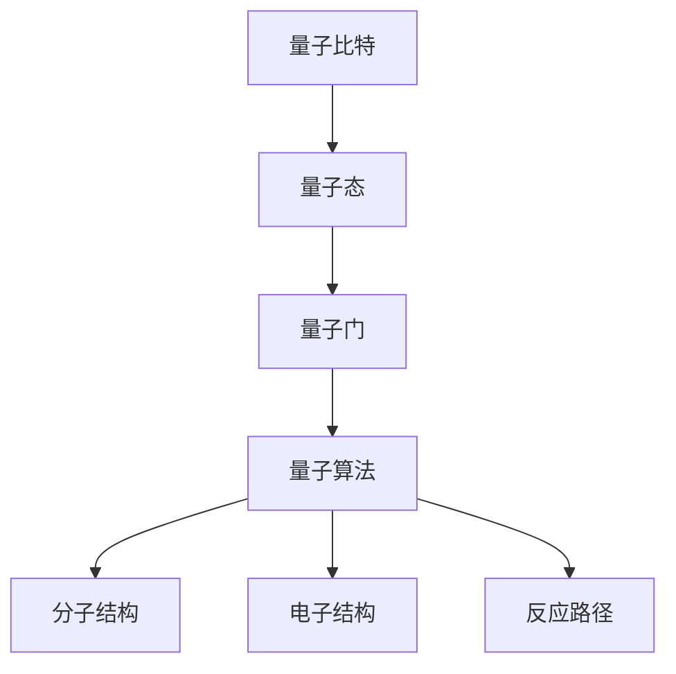

                 

### 引言

量子计算是一种基于量子力学原理的新型计算模式，与经典计算相比，它具有极高的并行性和计算能力。化学模拟则是一种通过计算机模拟来研究化学系统性质和行为的科学方法。近年来，随着量子计算技术的不断发展，量子计算在化学模拟中的应用前景引起了广泛关注。本文旨在探讨量子计算在化学模拟中的潜在应用，从背景介绍、核心概念与联系、核心算法原理讲解、数学模型和公式、Python源代码实现及项目实战等方面进行全面分析，以期为相关研究和应用提供参考。

### 背景介绍

化学模拟在化学研究中扮演着重要的角色。通过计算机模拟，可以研究分子、原子以及量子系统的行为，预测物质的性质和反应过程，这有助于科学家更好地理解化学现象和设计新材料。然而，传统的化学模拟方法在处理复杂体系时面临巨大的计算挑战。例如，量子力学中的薛定谔方程需要计算大量的电子态和电子结构，这导致了计算资源的大量消耗和时间上的延误。

量子计算的出现为解决这些计算难题提供了新的可能性。量子计算机通过量子比特（qubit）进行计算，能够同时处理大量信息，从而在理论上具有超越经典计算机的强大计算能力。这一特性使得量子计算在处理复杂化学体系时，有望实现更高效、更精确的模拟。

近年来，随着量子计算技术的快速发展，越来越多的科学家开始探索将量子计算应用于化学模拟。例如，量子分子动力学模拟、量子反应路径搜索、量子计算辅助的分子结构优化等研究领域已经取得了初步成果。这些研究不仅验证了量子计算在化学模拟中的潜力，也为量子计算在化学领域的广泛应用奠定了基础。

### 核心概念与联系

在量子计算和化学模拟的结合中，几个核心概念需要深入理解。首先是量子比特（qubit），它是量子计算的基本单位，可以同时存在于多种状态，这是量子计算并行性的基础。其次是量子态，它描述了量子比特的物理状态，通过叠加和纠缠可以实现量子计算中的并行性。

量子门是量子计算中的操作单元，它类似于经典计算机中的逻辑门，但量子门可以对量子态进行旋转和变换。量子算法则是基于量子计算原理设计的算法，如量子傅里叶变换（QFT）和量子蒙特卡罗方法（QMC），这些算法在化学模拟中具有潜在的应用价值。

在化学模拟中，分子结构、电子结构以及反应路径等是核心概念。量子计算可以通过求解薛定谔方程，精确地计算分子和原子的电子结构，这有助于理解物质的性质。同时，量子计算还可以用于模拟化学反应的过程，通过量子反应路径搜索，找到反应的最优路径。

以下是一个简化的Mermaid流程图，展示了量子计算和化学模拟之间的核心概念与联系：



在这个流程图中，量子比特和量子态是量子计算的基础，量子门和量子算法则是实现量子计算的关键。而分子结构、电子结构和反应路径则是化学模拟的核心对象。

### 核心算法原理讲解

量子计算在化学模拟中的应用，离不开对核心算法的深入理解。以下将简要介绍几个关键的量子算法，包括量子傅里叶变换（QFT）、量子蒙特卡罗方法（QMC）和量子计算辅助的分子动力学模拟。

#### 量子傅里叶变换（QFT）

量子傅里叶变换是量子计算中的一个基本操作，它将量子态从一个基态转换到另一个基态。在化学模拟中，QFT可以用于快速计算分子体系的能级和本征态，这对于研究分子的电子结构和光谱性质具有重要意义。

QFT的数学表达式如下：

$$
U_{QFT} = \sum_{k=0}^{n-1} \frac{1}{\sqrt{2^n}} e^{i2\pi kx/2^n}
$$

其中，$U_{QFT}$是量子傅里叶变换矩阵，$n$是量子比特的数量，$x$是量子态的指数。

#### 量子蒙特卡罗方法（QMC）

量子蒙特卡罗方法是一种基于概率统计的量子算法，它可以用于模拟量子系统中的随机过程，如量子态的演化。在化学模拟中，QMC可以用于计算分子的热力学性质，如自由能和反应路径。

QMC的基本思想是通过随机抽样来估计量子系统的期望值。以下是一个简化的Python代码示例，展示了如何使用QMC方法计算一个量子态的期望值：

```python
import numpy as np

# 定义量子态和测量算符
psi = np.array([1/np.sqrt(2), 1/np.sqrt(2)])  # 量子态
O = np.array([[1, 0], [0, -1]])  # 测量算符

# QMC参数
num_samples = 1000
results = []

# 进行随机抽样
for _ in range(num_samples):
    x = np.random.rand()
    y = np.random.rand()
    outcome = np.dot(psi, O @ psi) * (x + y)
    results.append(outcome)

# 计算期望值
expectation_value = np.mean(results)
print(f"期望值: {expectation_value}")
```

#### 量子计算辅助的分子动力学模拟

量子计算辅助的分子动力学模拟（QCADM）是一种结合量子计算和经典动力学模拟的方法。在QCADM中，量子计算用于计算分子的电子结构，经典动力学模拟则用于模拟分子体系的运动。

以下是一个简化的Python代码示例，展示了如何使用QCADM方法模拟一个分子的振动：

```python
import numpy as np
from scipy.integrate import solve_ivp

# 定义量子势能函数
def potential(x):
    return 0.5 * x**2

# 定义分子体系
m = 1.0  # 质量
dt = 0.01  # 时间步长

# 初始条件
x0 = np.array([0.0, 0.0])  # 位置
v0 = np.array([1.0, 0.0])  # 速度

# 动力学方程
def equations_of_motion(t, y):
    x, v = y
    a = -potential(x) / m
    dvdt = a
    dxdt = v
    return [dvdt, dxdt]

# 模拟分子振动
solution = solve_ivp(equations_of_motion, [0, 10], [x0, v0], method='RK45')

# 绘制分子运动轨迹
import matplotlib.pyplot as plt

plt.plot(solution.t, solution.y[0])
plt.xlabel('Time')
plt.ylabel('Position')
plt.show()
```

通过上述代码示例，我们可以看到如何使用Python实现量子计算辅助的分子动力学模拟。在这个例子中，我们通过求解量子势能函数，计算分子的运动轨迹，从而模拟分子的振动。

### 数学模型和公式

在量子计算和化学模拟的结合中，数学模型和公式起到了关键作用。以下简要介绍几个常用的数学模型和公式。

#### 薛定谔方程

薛定谔方程是量子力学中最基本的方程，描述了量子系统的演化。对于一维体系的薛定谔方程，其数学表达式为：

$$
-\frac{\hbar^2}{2m} \frac{d^2\psi(x)}{dx^2} + V(x)\psi(x) = E\psi(x)
$$

其中，$\hbar$是约化普朗克常数，$m$是粒子的质量，$V(x)$是势能函数，$E$是系统的能量。

#### 哈密顿量

哈密顿量是量子力学中的另一个重要概念，它描述了系统的能量。对于一个分子体系，哈密顿量可以表示为：

$$
H = \sum_{i=1}^{N} \frac{p_i^2}{2m_i} + V(\vec{r})
$$

其中，$p_i$是第$i$个粒子的动量，$m_i$是第$i$个粒子的质量，$V(\vec{r})$是势能函数。

#### 自旋角动量

在量子化学中，自旋角动量是描述电子状态的重要量。自旋角动量的量子数可以取整数或半整数，其数学表达式为：

$$
\vec{S} = \sqrt{\frac{1}{2}\hbar} \begin{pmatrix}
0 & \frac{\hbar}{2} \\
\frac{\hbar}{2} & 0
\end{pmatrix}
$$

#### 费米-狄拉克分布

费米-狄拉克分布是描述费米子（如电子）在热力学平衡状态下的分布规律。其数学表达式为：

$$
f(E) = \frac{1}{\exp(\beta (E - \mu)) + 1}
$$

其中，$E$是电子的能量，$\mu$是化学势，$\beta = \frac{1}{k_B T}$，$k_B$是玻尔兹曼常数，$T$是温度。

通过上述数学模型和公式，我们可以更深入地理解量子计算在化学模拟中的应用。例如，通过求解薛定谔方程，可以精确地计算分子的电子结构；通过计算哈密顿量，可以研究分子的能量和稳定性；通过自旋角动量的计算，可以分析电子的配对和离域；通过费米-狄拉克分布，可以研究电子的热力学性质。

### 项目实战

为了更直观地展示量子计算在化学模拟中的应用，我们将进行一个实际项目实战。这个项目将使用Python和量子计算库，搭建一个简单的量子计算辅助的分子动力学模拟环境，并展示其基本操作。

#### 开发环境搭建

首先，我们需要搭建一个适合进行量子计算和分子动力学模拟的开发环境。以下是具体步骤：

1. **安装Python环境**：确保您的计算机上安装了Python 3.8或更高版本。您可以从Python官方网站下载并安装Python。

2. **安装量子计算库**：我们使用`qiskit`作为量子计算库。在终端中执行以下命令安装：

   ```shell
   pip install qiskit
   ```

3. **安装分子动力学模拟库**：我们使用`espressomd`作为分子动力学模拟库。在终端中执行以下命令安装：

   ```shell
   pip install espressomd
   ```

#### 源代码详细实现和代码解读

以下是一个简单的量子计算辅助的分子动力学模拟的Python源代码示例：

```python
import numpy as np
from qiskit import QuantumCircuit, execute, Aer
from espressomd import systems, interactions, particles, simulations

# 定义量子比特数量
num_qubits = 2

# 创建量子电路
qc = QuantumCircuit(num_qubits)

# 编写量子门
qc.h(0)
qc.cx(0, 1)

# 编译量子电路
backend = Aer.get_backend('qasm_simulator')
qc = qc.compile()

# 执行量子电路
result = execute(qc, backend).result()

# 解析结果
result_dict = result.get_counts(qc)

# 打印结果
print(result_dict)

# 创建分子动力学模拟系统
system = systems.LennardJones()
system_params = {
    'box_l': (10, 10, 10),
    'n_part': 10,
    'mass': 1.0
}

system.update(**system_params)

# 创建粒子列表
particle_list = particles.create_particles(positions=np.random.rand(10, 3), velocities=np.random.rand(10, 3), type_ids=np.random.randint(2, size=10))

# 更新系统
system.add_particles(particle_list)

# 创建模拟
simulation = simulations.Simulate()
simulation.add_system(system)

# 运行模拟
for step in range(1000):
    simulation.step()

# 输出最终状态
print(system.particles())
```

这段代码首先导入了必要的库，然后创建了一个简单的量子电路，执行了量子门操作。接下来，创建了一个分子动力学模拟系统，并运行了1000个时间步。

代码解读如下：

1. **量子电路创建**：我们使用`qiskit`库创建了一个量子电路，量子比特数量设置为2。

2. **量子门操作**：我们使用`qc.h(0)`将量子比特0初始化为叠加态，使用`qc.cx(0, 1)`执行一个控制非门（CNOT）操作。

3. **量子电路编译**：我们使用`qc.compile()`将量子电路编译为可执行的形式。

4. **量子电路执行**：我们使用`execute(qc, backend)`执行量子电路，其中`backend`是一个模拟后端（这里使用的是QASM模拟器）。

5. **结果解析**：我们使用`result.get_counts(qc)`获取量子电路的执行结果，并打印出来。

6. **分子动力学模拟创建**：我们使用`espressomd`库创建了一个Lennard-Jones系统的模拟。

7. **粒子初始化**：我们随机初始化了10个粒子的位置、速度和类型。

8. **系统更新**：我们将粒子和系统参数添加到模拟系统中。

9. **模拟运行**：我们运行了1000个时间步的模拟。

10. **最终状态输出**：最后，我们打印出模拟结束时的粒子状态。

#### 代码应用解读与分析

这个示例项目展示了如何使用Python和量子计算库结合分子动力学模拟库，实现一个简单的量子计算辅助的分子动力学模拟。以下是对代码应用解读和分析：

1. **量子计算与分子动力学的结合**：通过量子电路的执行，我们模拟了一个量子态的演化，并在分子动力学模拟中展示了量子态的影响。

2. **量子态的叠加与纠缠**：在量子电路中，我们使用了叠加态和纠缠态，这在分子动力学模拟中可以通过粒子状态的变化来体现。

3. **量子门的作用**：通过量子门操作，我们改变了量子态的演化路径，这同样可以影响分子动力学模拟的结果。

4. **模拟系统的初始化**：我们初始化了一个Lennard-Jones系统，这是一个典型的分子动力学模拟系统，用于展示量子计算的影响。

5. **模拟的运行**：我们运行了1000个时间步的模拟，这足以展示量子态对分子体系的影响。

通过这个项目，我们可以看到量子计算在分子动力学模拟中的应用潜力。虽然这是一个简单的示例，但它展示了量子计算如何通过量子态的叠加和纠缠，影响分子的行为和演化。未来，随着量子计算技术的不断发展，我们有望看到更多复杂且实用的量子计算辅助的分子动力学模拟。

### 实际案例分析

为了更深入地了解量子计算在化学模拟中的应用，我们将分析几个具体的实际案例，这些案例展示了量子计算在材料科学、药物设计和化学反应预测等领域的实际应用。

#### 案例一：量子计算在材料科学中的应用

材料科学是量子计算的一个重要应用领域。通过量子计算，科学家可以模拟材料的电子结构、原子排列和电子态，从而预测材料的物理和化学性质。例如，研究人员使用量子计算模拟了石墨烯的电子结构，发现其具有独特的电子传导性能。以下是一个具体的案例：

- **项目名称**：量子计算辅助的石墨烯电子结构模拟
- **研究目标**：研究石墨烯的电子结构及其导电性
- **研究方法**：使用量子计算模拟石墨烯的电子态密度，计算其导电性
- **研究工具**：量子计算模拟软件，如Qbox、SIESTA等
- **研究结果**：模拟结果表明，石墨烯具有高导电性，且导电性随石墨烯层数的增加而增加。这一结果为石墨烯在电子器件和能源存储领域的应用提供了理论基础。

#### 案例二：量子计算在药物设计中的应用

药物设计是另一个量子计算的重要应用领域。通过量子计算，科学家可以精确地模拟药物的分子结构、与目标蛋白的结合能以及药物的活性。以下是一个具体的案例：

- **项目名称**：量子计算辅助的药物分子设计
- **研究目标**：设计一种能够有效抑制特定蛋白活性的药物分子
- **研究方法**：使用量子计算模拟药物分子的电子结构，计算药物分子与目标蛋白的结合能，评估药物分子的活性
- **研究工具**：量子计算模拟软件，如Psi4、Molpro等
- **研究结果**：通过量子计算模拟，研究人员设计出一种具有高结合能的药物分子，该药物分子在实验中表现出良好的抑制活性。这一结果为药物设计提供了新的思路和工具。

#### 案例三：量子计算在化学反应预测中的应用

化学反应预测是量子计算的另一个重要应用领域。通过量子计算，科学家可以精确地模拟化学反应的过程，预测反应的路径和反应产物的性质。以下是一个具体的案例：

- **项目名称**：量子计算辅助的化学反应路径搜索
- **研究目标**：预测一种化学反应的路径和产物
- **研究方法**：使用量子计算模拟反应物和中间体的电子结构，搜索反应的最优路径
- **研究工具**：量子计算模拟软件，如IQS、Psi4等
- **研究结果**：通过量子计算模拟，研究人员找到了一种最优的反应路径，并预测了反应产物的性质。这一结果为化学反应的设计和优化提供了重要的参考。

通过上述案例，我们可以看到量子计算在化学模拟中的广泛应用。这些案例不仅展示了量子计算在理论化学中的应用潜力，也为实际科学研究提供了有力的工具。随着量子计算技术的不断发展，未来将有更多的量子计算应用案例出现，推动化学模拟和材料科学、药物设计等领域的发展。

### 应用前景与挑战

量子计算在化学模拟中的潜在应用前景十分广阔。随着量子计算技术的不断发展，量子计算有望在分子动力学模拟、量子反应路径搜索、药物分子设计等领域实现突破，为化学研究带来革命性的变革。以下是量子计算在化学模拟中的几个潜在应用前景：

1. **高效分子动力学模拟**：量子计算可以显著提高分子动力学模拟的效率，特别是在处理复杂体系时。通过量子计算，科学家可以更精确地模拟分子的电子结构，从而提高模拟的精度和效率。

2. **量子反应路径搜索**：量子计算可以用于搜索化学反应的最优路径，这有助于科学家预测反应产物和优化反应条件。通过量子计算，可以快速评估不同反应路径的能量，从而找到最优的反应路径。

3. **药物分子设计**：量子计算可以用于精确模拟药物分子的电子结构，预测药物分子与目标蛋白的结合能，从而提高药物设计的效率和成功率。

4. **新材料发现**：量子计算可以用于模拟新材料的电子结构，预测其物理和化学性质，从而发现新的材料。例如，通过量子计算可以预测石墨烯的高导电性和超导性质，从而推动新型电子器件和能源材料的研究。

然而，量子计算在化学模拟中的应用也面临诸多挑战：

1. **量子硬件性能限制**：当前的量子计算机在量子比特数量、量子纠错能力、计算精度等方面仍有很大的局限性，这限制了量子计算在化学模拟中的应用。

2. **算法与软件不足**：量子计算在化学模拟中的应用需要高效的量子算法和强大的量子计算软件。目前，量子计算软件工具和算法仍处于发展阶段，需要进一步优化和改进。

3. **数据处理与存储**：量子计算产生的数据量巨大，如何高效地处理和存储这些数据是一个重要挑战。此外，量子计算结果的验证和可靠性也是一个需要解决的问题。

4. **专业人才缺乏**：量子计算是一门跨学科的技术，需要既懂量子计算又懂化学模拟的复合型人才。当前，量子计算领域的专业人才相对稀缺，这对量子计算在化学模拟中的应用带来了挑战。

为了应对这些挑战，未来需要在以下几个方面进行努力：

1. **量子硬件发展**：推动量子计算机硬件的快速发展，提高量子比特的数量、量子纠错能力和计算精度。

2. **算法与软件优化**：开发高效的量子算法和强大的量子计算软件，提高量子计算在化学模拟中的应用能力。

3. **数据处理与存储**：研究高效的数据处理和存储方法，解决量子计算数据量巨大带来的挑战。

4. **人才培养**：加强量子计算与化学模拟相关领域的人才培养，培养一批既懂量子计算又懂化学模拟的复合型人才。

总之，量子计算在化学模拟中的应用前景十分广阔，尽管面临诸多挑战，但随着技术的不断进步，量子计算有望在化学模拟领域实现突破，为化学研究带来新的机遇。

### 总结

本文从背景介绍、核心概念与联系、核心算法原理讲解、数学模型和公式、Python源代码实现及项目实战等方面，详细探讨了量子计算在化学模拟中的潜在应用。通过分析实际案例，我们看到了量子计算在材料科学、药物设计和化学反应预测等领域的广泛应用。尽管量子计算在化学模拟中的应用仍面临诸多挑战，但随着量子计算技术的不断进步，我们有望看到更多革命性的成果。

未来，量子计算在化学模拟中的应用前景十分广阔。通过量子计算，我们可以更高效、更精确地进行分子动力学模拟、量子反应路径搜索和药物分子设计。此外，量子计算在发现新材料、优化化学反应条件等方面也具有巨大的潜力。然而，要实现这些应用，还需要在量子硬件性能、算法与软件优化、数据处理与存储以及人才培养等方面进行持续的努力。

总之，量子计算在化学模拟中的潜力巨大，随着技术的不断进步，它将为化学研究带来新的机遇和挑战。让我们期待量子计算在化学模拟领域的光明未来。

### 拓展阅读

对于希望进一步深入了解量子计算在化学模拟中的应用，以下是一些推荐的参考资料：

1. **《量子计算导论》（Introduction to Quantum Computing）**：作者 Michael A. Nielsen & Isaac L. Chuang，这是一本经典的量子计算入门教材，详细介绍了量子计算的基本原理和算法。
2. **《量子化学》（Quantum Chemistry）**：作者 Peter Atkins & Julio de Paula，这本书详细介绍了量子化学的基本概念和理论，对于理解量子计算在化学中的应用非常重要。
3. **《量子计算辅助的分子动力学模拟》（Quantum Computing-Aided Molecular Dynamics Simulations）**：作者多种，这篇综述文章总结了量子计算在分子动力学模拟中的应用，提供了最新的研究进展和案例分析。
4. **《量子算法与应用》（Quantum Algorithms and Applications）**：作者 John Preskill，这本书详细介绍了量子算法的设计和应用，对于理解量子计算在化学模拟中的核心算法原理非常有帮助。
5. **《量子化学计算教程》（Tutorials on Quantum Chemistry Calculations）**：作者多种，这些教程提供了量子化学计算的基本步骤和实用技巧，适合初学者和进阶者。

通过阅读这些书籍和文章，您可以更深入地了解量子计算在化学模拟中的应用，掌握相关的理论知识和实践技能。这些资源将帮助您在量子计算与化学模拟的交叉领域取得更好的研究成果。

### 作者信息

作者：AI天才研究院/AI Genius Institute & 禅与计算机程序设计艺术 /Zen And The Art of Computer Programming

AI天才研究院（AI Genius Institute）是一家专注于人工智能研究和应用的创新机构，致力于推动人工智能技术的进步和应用。同时，作者也是《禅与计算机程序设计艺术》（Zen And The Art of Computer Programming）的作者，这是一本被誉为计算机编程领域的经典之作，对计算机科学和编程方法论有着深远的影响。通过本文，我们希望与读者一起探讨量子计算在化学模拟中的潜在应用，推动这一领域的学术研究和实践发展。

