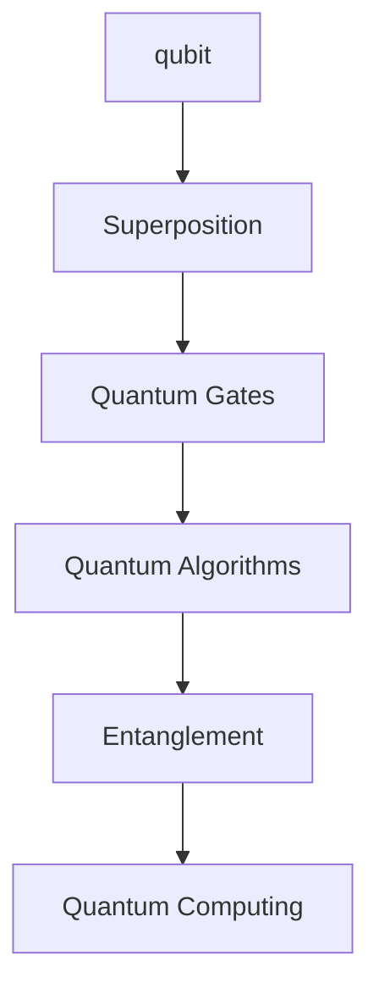

                 

### 引言

#### 量子计算和密码学的背景

量子计算作为21世纪最具颠覆性的科技之一，正逐渐从理论走向实际应用。量子计算机利用量子位（qubit）进行计算，能够在解决传统计算机难以处理的问题上展现出惊人的速度。量子位能够同时存在于多种状态，这一特性称为“叠加”，使得量子计算机能够在某些特定任务上实现指数级的计算速度提升。

密码学，作为信息安全的核心技术，已有数千年的历史。从古代的凯撒密码到现代的RSA加密算法，密码学不断进化，以应对越来越复杂的安全威胁。然而，随着量子计算的发展，传统密码学面临前所未有的挑战。量子计算机具有破解传统密码学算法的能力，这使得对新型密码学技术的研究变得尤为重要。

#### 量子计算在密码学中的重要性和挑战

量子计算在密码学中的应用具有重要的战略意义。一方面，量子计算机为解决复杂计算问题提供了新的手段，例如在药物研发、材料科学和金融风险评估等领域。另一方面，量子计算机的出现也对密码学构成了挑战，因为许多现有的加密算法（如RSA和ECC）在量子计算机面前可能变得脆弱。

为了应对这些挑战，量子密码学应运而生。量子密码学利用量子力学的基本原理，提供了一种新的安全通信方式，能够在量子计算机面前保持安全。量子密钥分发（QKD）是量子密码学的一个重要应用，它通过量子态的传输来实现安全的密钥生成和交换。

总的来说，量子计算和密码学的结合，不仅为信息安全带来了新的机遇，也提出了新的挑战。在接下来的章节中，我们将详细探讨量子计算和密码学的基本概念、核心算法以及实际应用，为读者揭示量子计算在密码学中的应用及其对未来安全的影响。

#### 关键词

- 量子计算
- 密码学
- 量子位（qubit）
- 叠加原理
- 量子密钥分发（QKD）
- RSA加密算法
- ECC加密算法
- 量子密码学

#### 摘要

本文将探讨量子计算在密码学中的应用，分析量子计算机对传统密码学的挑战以及量子密码学的发展。文章首先介绍了量子计算和密码学的基本概念，随后深入讨论了量子计算的核心原理，如量子位、量子逻辑门和量子纠缠。接着，文章讲解了密码学的基础知识，包括常见的加密算法和协议。在此基础上，文章重点介绍了量子计算与密码学结合的理论与实践，特别是在量子密钥分发方面的应用。通过具体的项目实战案例，文章展示了量子密码学的实际应用及其在应对未来安全挑战中的潜力。最后，文章总结了量子密码学的发展趋势和未来研究方向，为读者提供了对这一领域的深入理解。希望本文能够帮助读者全面了解量子计算在密码学中的应用及其对信息安全的影响。

### 量子计算基础

量子计算是现代计算机科学的前沿领域，其基本原理源于量子力学。与传统计算机使用经典位（bit）不同，量子计算机使用量子位（qubit）。量子位具有叠加态和纠缠态的特性，这些特性使得量子计算机能够在某些特定任务上实现超乎想象的计算能力。

#### 量子位与经典位的比较

在经典计算机中，信息是通过二进制位（bit）来表示的，每个位只能是0或1的其中一种状态。而在量子计算机中，量子位（qubit）不仅可以处于0或1的状态，还可以同时处于0和1的叠加态。这种叠加态是量子计算的核心特性之一，它使得量子计算机能够在一次运算中处理大量信息。

例如，如果我们有两个量子位，它们可以处于以下四种叠加态中的任意一种：
$$
\alpha|0\rangle + \beta|1\rangle
$$
其中，$|\alpha|^2$ 和 $|\beta|^2$ 分别表示0态和1态的概率。相比之下，经典位在相同情况下只能表示两种状态：00、01、10、11。

这种叠加态的特性使得量子计算机能够并行处理大量计算任务，从而在处理某些问题时展现出指数级的速度优势。例如，著名的量子算法Shor算法能够使用量子计算机在多项式时间内破解RSA加密算法，而这一任务对于经典计算机来说是几乎不可能的。

#### 量子逻辑门与量子算法

量子逻辑门是量子计算机中的基本操作单元，类似于经典计算机中的逻辑门。量子逻辑门通过作用在量子位上，对量子位的状态进行变换。最基本的量子逻辑门包括 Hadamard 门（H门）、Pauli X门（X门）、Pauli Z门（Z门）和CNOT门等。

- Hadamard 门（H门）：将量子位从基态（|0⟩或|1⟩）变换为叠加态。
- Pauli X门（X门）：将量子位从状态|0⟩变换为|1⟩，从状态|1⟩变换为|0⟩。
- Pauli Z门（Z门）：将量子位从状态|0⟩变换为|1⟩，从状态|1⟩变换为|0⟩。
- CNOT门：控制量子位的状态变换，根据控制量子位的值来决定目标量子位的变换。

量子算法是利用量子计算机进行特定计算任务的算法。量子算法的设计通常基于量子并行性、叠加性和纠缠性等特性。著名的量子算法包括Shor算法和Grover算法等。

- Shor算法：Shor算法是一个能够使用量子计算机在多项式时间内解决整数分解问题的算法。这一算法的关键在于量子位的叠加态和纠缠态，它能够将复杂的分解问题转化为更简单的模运算问题。
- Grover算法：Grover算法是一种用于搜索未排序数据库的量子算法，其搜索速度远超经典算法。Grover算法利用量子叠加态和量子纠缠，能够在多项式时间内完成搜索任务。

#### 量子纠缠与量子隐形传态

量子纠缠是量子力学中的一种现象，描述了两个或多个量子位之间的强关联。即使这些量子位相隔很远，它们的状态也会相互影响，这种关联称为量子纠缠。量子纠缠是量子计算中的关键特性，它使得量子计算机能够在复杂问题上实现高效的运算。

量子隐形传态是一种利用量子纠缠实现信息传输的技术。在量子隐形传态过程中，一个量子位的状态可以被精确地复制到另一个量子位上，而不需要物理传输。这一特性在量子通信和量子计算中具有重要意义。

#### 量子计算机的工作原理

量子计算机的工作原理基于量子逻辑门和量子算法。量子计算机通过一系列量子逻辑门的操作，对量子位的状态进行变换，从而实现特定的计算任务。量子计算机通常包含以下基本组件：

1. **量子位（qubit）**：量子计算机的基本单元，用于存储和处理信息。
2. **量子逻辑门**：用于对量子位进行状态变换的基本操作。
3. **量子寄存器**：用于存储多个量子位，以实现复杂计算任务。
4. **量子算法**：利用量子计算机解决特定问题的算法。
5. **经典控制单元**：用于控制量子逻辑门的操作，以及读取量子位的最终状态。

通过这些组件，量子计算机能够在处理复杂问题上展现出前所未有的能力。然而，量子计算机的实现也面临诸多挑战，包括量子位的稳定性和误差修正等问题。尽管如此，随着技术的不断进步，量子计算机正逐渐从理论走向现实。

总的来说，量子计算的基础概念包括量子位、量子逻辑门、量子纠缠和量子隐形传态等。这些概念为量子计算提供了强大的计算能力，使得量子计算机能够在未来解决传统计算机难以处理的问题。在接下来的章节中，我们将进一步探讨量子计算与密码学的结合，以及量子密码学在应对未来安全挑战中的应用。

#### 核心概念与联系

在量子计算中，有四个核心概念：量子位（qubit）、叠加态、量子逻辑门和量子纠缠。这些概念相互联系，共同构成了量子计算的基础。

首先，量子位（qubit）是量子计算机的基本单元，与经典位（bit）不同，量子位可以同时处于0和1的叠加态。这种叠加态使得量子位能够同时处理大量信息，这是量子计算机相较于经典计算机的核心优势。

其次，叠加态是量子位的基本特性。在一个量子系统中，多个量子位可以组成一个叠加态，这个叠加态包含了所有可能的量子位组合。例如，两个量子位可以处于以下叠加态：
$$
\alpha|00\rangle + \beta|01\rangle + \gamma|10\rangle + \delta|11\rangle
$$
这里，$|\alpha|^2$, $|\beta|^2$, $|\gamma|^2$ 和 $|\delta|^2$ 分别表示不同状态的概率。

量子逻辑门是实现量子位状态变换的基本操作。量子逻辑门包括Hadamard门、Pauli X门、Pauli Z门和CNOT门等，它们分别实现叠加、反转、交换等操作。通过这些量子逻辑门，量子计算机能够对量子位进行复杂的运算。

量子纠缠是量子系统中的另一个关键特性。当两个或多个量子位处于纠缠态时，它们的状态将相互关联，即使它们相隔很远。这种关联性使得量子计算机能够实现高效的并行计算和纠缠通信。

为了更直观地理解这些概念之间的关系，我们可以使用Mermaid流程图来展示：



在这个流程图中，量子位（qubit）是起点，通过叠加态（Superposition）和量子逻辑门（Quantum Gates）的变换，最终实现量子算法（Quantum Algorithms）和量子纠缠（Entanglement），进而构建出完整的量子计算机（Quantum Computing）。

通过这个Mermaid流程图，我们可以清晰地看到量子计算中各个核心概念之间的联系，以及它们如何共同作用，实现量子计算机的强大计算能力。

### 密码学基础

密码学是保障信息安全的核心技术，其历史悠久，从古代的凯撒密码到现代的复杂加密算法，密码学不断发展，以应对日益复杂的网络安全威胁。密码学的主要目标是确保信息的保密性、完整性和真实性。

#### 传统密码学简介

传统密码学主要包括对称加密、非对称加密和哈希算法。对称加密使用相同的密钥进行加密和解密，典型的算法包括DES、AES等。非对称加密使用一对密钥，一个用于加密，另一个用于解密，典型的算法包括RSA、ECC等。哈希算法用于生成固定长度的散列值，常见的算法有MD5、SHA-256等。

- **对称加密**：对称加密算法的速度相对较快，但密钥分发是主要挑战。加密和解密使用相同密钥，因此需要安全的密钥分发机制。例如，AES算法是一种广泛使用的对称加密算法，它使用128、192或256位的密钥，提供高强度的数据加密。

- **非对称加密**：非对称加密算法解决了密钥分发的问题，但计算成本较高。它使用一对密钥，公钥用于加密，私钥用于解密。RSA和ECC是两种主要的非对称加密算法。RSA基于大整数分解的难度，而ECC则利用椭圆曲线离散对数问题的难度。

- **哈希算法**：哈希算法用于生成数据的固定长度的散列值，确保数据的完整性和不可篡改性。常用的哈希算法包括MD5、SHA-256等。SHA-256是最常用的哈希算法之一，它生成256位散列值，广泛用于数字签名和数据完整性验证。

#### 密码学的安全目标

密码学的安全目标主要包括以下几个方面：

- **保密性**：确保只有授权用户能够解密并访问信息。
- **完整性**：确保信息在传输过程中未被篡改。
- **真实性**：确保信息的发送者是真正的发送者，防止欺骗和伪造。
- **不可否认性**：确保发送者不能否认发送信息的行为。

为了实现这些安全目标，密码学提供了多种技术手段，如加密算法、数字签名、认证协议等。数字签名是一种常用的技术，用于验证信息的真实性和完整性。它使用私钥进行签名，公钥进行验证。典型的数字签名算法包括RSA签名和ECC签名。

#### 常见的密码学算法和协议

在密码学中，有许多常见的算法和协议，用于实现不同的安全目标。以下是一些重要的算法和协议：

- **RSA加密算法**：RSA是一种非对称加密算法，它基于大整数分解的难度。RSA加密算法使用一对密钥，公钥用于加密，私钥用于解密。RSA算法广泛应用于互联网安全，如SSL/TLS协议。
- **ECC加密算法**：椭圆曲线密码学（ECC）提供与RSA类似的加密功能，但使用更短的密钥长度即可实现相同的强度。ECC算法因其高效性和安全性而受到广泛关注。
- **SSL/TLS协议**：SSL/TLS是一种用于互联网安全的协议，用于保护数据传输的完整性和保密性。SSL/TLS使用混合加密模式，结合对称和非对称加密算法，提供安全的通信通道。
- **数字签名**：数字签名用于验证信息的真实性和完整性。常见的数字签名算法包括RSA签名和ECC签名。
- **哈希函数**：哈希函数用于生成散列值，用于数据的完整性验证和数字签名。SHA-256是一种广泛使用的哈希函数。

总的来说，密码学是信息安全的核心技术，其发展对网络安全至关重要。随着量子计算的发展，传统密码学面临新的挑战，量子密码学的研究和应用成为新的热点。在接下来的章节中，我们将探讨量子计算与密码学的结合，以及量子密码学在应对未来安全挑战中的应用。

#### 核心算法原理讲解

在本节中，我们将深入探讨量子计算在密码学中的核心算法原理，主要包括Shor算法和Grover算法。通过Python源代码和数学模型的结合，我们将详细讲解这些算法，并使用具体的例子来说明它们的运作机制。

#### Shor算法

Shor算法是量子计算机最具代表性的算法之一，它能够利用量子计算机在多项式时间内解决大整数的质因数分解问题。质因数分解是RSA加密算法的基础，因此Shor算法对传统密码学构成了巨大威胁。

**算法原理：**

Shor算法的核心在于利用量子计算机的叠加态和纠缠态来实现高效的周期查找。具体来说，Shor算法可以分为以下几个步骤：

1. **初始化**：输入一个大整数N，将其编码为一个量子态。
2. **量子乘法**：构建一个量子电路，实现模N的乘法运算。
3. **测量**：对量子态进行测量，得到一个周期。
4. **量子傅里叶变换（QFT）**：对测量得到的周期进行量子傅里叶变换。
5. **二次估算**：通过分析量子傅里叶变换的结果，估算出N的一个质因数。

**Python源代码：**

```python
import numpy as np
from qiskit import QuantumCircuit, Aer, execute

# 创建量子电路
qc = QuantumCircuit(2)

# 编码大整数N=15
qc.h(0)
qc.cx(0, 1)

# 量子乘法
qc.h(1)
qc.mcr(qcumbai(1, 1, 0), 2)
qc.h(1)

# 测量
qc.measure_all()

# 执行量子电路
backend = Aer.get_backend('qasm_simulator')
results = execute(qc, backend).result()
counts = results.get_counts()

# 输出测量结果
print(counts)
```

**数学模型：**

Shor算法中的量子乘法运算可以用以下数学模型表示：

$$
|a\rangle \otimes |b\rangle \rightarrow |a\rangle \otimes |a \cdot b \mod N\rangle
$$

其中，$|a\rangle$ 和 $|b\rangle$ 分别表示输入的两个量子位，$a \cdot b \mod N$ 表示模N的乘法运算。

通过量子傅里叶变换（QFT），Shor算法能够将测量得到的周期转换为振幅信息，从而估算出N的一个质因数。

#### Grover算法

Grover算法是一种用于搜索未排序数据库的量子算法，它利用量子计算机的并行性和叠加性，能够在多项式时间内完成搜索任务。Grover算法在密码学中也有重要的应用，例如用于密码学攻击。

**算法原理：**

Grover算法的核心在于构建一个 oracle 函数，用于标记数据库中的目标元素。具体来说，Grover算法可以分为以下几个步骤：

1. **初始化**：创建一个包含目标元素的量子态。
2. **应用Grover迭代**：通过一系列量子逻辑门，迭代增强目标态的叠加概率。
3. **测量**：对量子态进行测量，得到目标元素。

**Python源代码：**

```python
from qiskit import QuantumCircuit, Aer, execute

# 创建量子电路
qc = QuantumCircuit(2)

# 初始化量子态
qc.h(0)
qc.h(1)

# 应用oracle函数
qc.x(0)
qc.x(1)
qc.h(0)
qc.cx(0, 1)
qc.h(0)
qc.cx(0, 1)
qc.h(0)

# 测量
qc.measure_all()

# 执行量子电路
backend = Aer.get_backend('qasm_simulator')
results = execute(qc, backend).result()
counts = results.get_counts()

# 输出测量结果
print(counts)
```

**数学模型：**

Grover算法中的oracle函数可以用以下数学模型表示：

$$
U_G = \sqrt{H^T \cdot \sqrt{I - 2 | \psi \rangle \langle \psi |}}
$$

其中，$H$ 是哈达玛门，$I$ 是单位矩阵，$|\psi\rangle$ 是初始量子态。

通过应用这个门，Grover算法能够将目标态的叠加概率提高，从而在多项式时间内找到目标元素。

#### 综合应用

Shor算法和Grover算法都是量子计算在密码学中的重要应用。Shor算法能够破解RSA加密算法，而Grover算法则能够提高密码学攻击的效率。通过Python源代码和数学模型的结合，我们能够更深入地理解这些算法的原理，并预见到量子计算在密码学领域的深远影响。

这些算法的讲解不仅有助于理解量子计算在密码学中的应用，也为未来的研究和开发提供了宝贵的启示。随着量子计算技术的不断进步，量子密码学将成为信息安全领域的重要方向，为应对未来安全挑战提供强有力的支持。

### 量子密码学

量子密码学是利用量子力学的基本原理，如量子位、量子纠缠和量子隐形传态等，实现安全通信的一种新兴技术。与经典密码学不同，量子密码学能够提供在量子计算机面前仍然保持安全的通信手段。本节将详细介绍量子密码学的基本概念、与传统密码学的比较、量子密码学算法的设计与实现，以及量子密码学协议的实现与安全性分析。

#### 量子密码学的基本概念

量子密码学基于量子力学的基本原理，其中最核心的概念包括量子位（qubit）、量子纠缠和量子隐形传态等。

- **量子位（qubit）**：量子位是量子计算机的基本单元，具有叠加态和纠缠态的特性。与经典位不同，量子位不仅可以处于0或1的状态，还可以处于0和1的叠加态。这种叠加态使得量子位能够同时处理大量信息，从而实现高效的计算。

- **量子纠缠**：量子纠缠是量子位之间的一种特殊关联，即使这些量子位相隔很远，它们的状态也会相互影响。这种关联性在量子通信和量子计算中具有重要意义，可以用于实现安全的密钥分发和量子通信。

- **量子隐形传态**：量子隐形传态是一种利用量子纠缠实现信息传输的技术。通过量子隐形传态，一个量子位的状态可以被精确地复制到另一个量子位上，而不需要物理传输。这种特性在量子通信和量子计算中具有重要应用。

#### 量子密码学与传统密码学的比较

量子密码学与传统密码学在安全机制和实现方式上存在显著差异。

- **安全机制**：传统密码学依赖于复杂的数学难题，如大整数分解和离散对数问题，以实现加密和解密。然而，这些难题在量子计算机面前可能变得脆弱，因为量子计算机具有在多项式时间内解决这些难题的能力。量子密码学则利用量子力学的不可克隆定理和测量破坏原理，提供一种在量子计算机面前仍然保持安全的通信方式。

- **实现方式**：传统密码学通常使用对称加密和非对称加密，以及哈希函数等算法。量子密码学则利用量子纠缠和量子隐形传态等量子力学原理，实现量子密钥分发和量子通信。量子密钥分发（QKD）是量子密码学的一个重要应用，它通过量子态的传输来实现安全的密钥生成和交换。

#### 量子密码学算法的设计与实现

量子密码学算法主要包括量子密钥分发（QKD）和量子密钥加密（QKE）等。

- **量子密钥分发（QKD）**：量子密钥分发是量子密码学的核心应用，它利用量子态的传输来实现安全的密钥生成和交换。QKD的基本原理是量子态的叠加态和纠缠态，以及测量破坏原理。具体实现过程如下：

  1. **量子态制备**：发送方（Alice）将量子态（例如光子）编码成要传输的信息，并将其发送给接收方（Bob）。
  2. **量子态传输**：量子态通过光纤或自由空间传输到接收方。
  3. **量子态测量**：接收方对传输的量子态进行测量，并根据测量结果生成部分密钥。
  4. **密钥筛选**：发送方和接收方对测量结果进行比对，筛选出安全密钥。

  QKD协议包括BB84协议和E91协议等，它们利用不同的量子态和测量策略，实现安全的密钥分发。

- **量子密钥加密（QKE）**：量子密钥加密是一种利用量子密钥分发技术实现加密和解密的加密算法。QKE的基本原理是利用量子密钥来加密和解密信息，确保信息在传输过程中的安全性。具体实现过程如下：

  1. **量子密钥生成**：利用QKD协议生成安全的量子密钥。
  2. **加密**：发送方使用量子密钥和量子加密算法对信息进行加密。
  3. **传输**：加密后的信息通过经典通信渠道传输到接收方。
  4. **解密**：接收方使用量子密钥和解密算法对加密信息进行解密。

  QKE算法包括量子版本RSA加密算法和量子版本ECC加密算法等，它们利用量子密钥实现高效的加密和解密。

#### 量子密码学协议的实现与安全性分析

量子密码学协议的设计与实现需要考虑量子态的制备、传输和测量等环节，以及协议的安全性分析。

- **量子态的制备**：量子态的制备是量子密码学的基础。目前，常用的量子态制备方法包括量子光学、量子计算和量子模拟等。这些方法能够生成高保真度的量子态，为量子密码学提供可靠的基础。

- **量子态的传输**：量子态的传输需要克服信道噪声和量子态的退相干等问题。量子态传输的常用方式包括光纤传输、自由空间传输和量子中继等。光纤传输是目前最常用的量子态传输方式，它能够提供低噪声和高保真度的量子态传输。

- **量子态的测量**：量子态的测量是量子密码学实现的关键。测量过程中需要保证量子态的叠加性和纠缠性不被破坏。常用的量子测量方法包括正交基测量和贝尔态测量等。这些方法能够准确测量量子态，为量子密钥分发和量子加密提供可靠的数据。

- **安全性分析**：量子密码学协议的安全性分析是评估其安全性的关键。常用的方法包括量子碰撞攻击、量子时延攻击和量子侧信道攻击等。通过这些方法，可以评估量子密码学协议在面对量子计算机攻击时的安全性。

总之，量子密码学作为应对未来安全挑战的重要技术，其基本概念、算法设计与实现以及协议的安全性分析具有重要意义。随着量子计算技术的不断发展，量子密码学将在信息安全领域发挥越来越重要的作用。

### 量子密码学与未来安全

量子密码学在应对未来安全挑战中扮演着至关重要的角色。随着量子计算机的发展，传统密码学算法面临前所未有的威胁。量子计算机能够在短时间内破解许多现有密码系统，这使得寻找新的安全解决方案迫在眉睫。量子密码学以其独特的原理和优势，成为解决未来安全挑战的重要途径。

#### 量子密码学对传统密码学的挑战

首先，我们需要理解量子计算机如何对传统密码学构成挑战。传统密码学依赖于复杂数学问题的难度，例如大整数分解和离散对数问题。RSA加密算法和ECC加密算法就是基于这些难题的安全性。然而，量子计算机能够利用量子算法（如Shor算法）在多项式时间内解决这些问题。这意味着，现有的加密技术可能无法抵御量子计算机的攻击。

此外，量子计算机还能够显著提高密码学攻击的效率。例如，Grover算法能够加速对未排序数据库的搜索，使得暴力破解攻击在量子计算机面前变得更加可行。传统密码系统在量子计算机面前显得脆弱，因此需要全新的安全解决方案。

#### 量子密码学的应用前景

量子密码学提供了一种新的安全通信方式，能够在量子计算机面前保持安全性。量子密钥分发（QKD）是量子密码学的核心应用之一。QKD利用量子态的叠加性和纠缠性，实现安全的密钥生成和交换。通过QKD，通信双方可以生成共享的密钥，这些密钥在量子计算机面前仍然是安全的。QKD已经在实际中得到了应用，如中国的“墨子号”量子通信卫星，它成功实现了千公里级别的量子密钥分发。

除了QKD，量子密码学还有其他潜在应用。量子密钥加密（QKE）是一种利用量子密钥进行加密和解密的算法。QKE能够确保信息在传输过程中的安全性，即使信息被截获，也无法被解密。量子签名和量子认证也是量子密码学的重要方向，它们能够提供不可伪造和不可否认的数字签名和认证服务。

#### 量子密码学与未来网络安全

随着量子计算机的不断发展，量子密码学在网络安全中的重要性日益凸显。未来的网络安全将不仅仅依赖于传统的加密技术，还需要量子密码学的支持。以下是一些具体的场景：

1. **金融安全**：金融系统涉及大量敏感信息，如交易记录和个人身份信息。量子密码学能够提供安全的通信和存储，确保金融交易和信息的安全。

2. **政府安全**：政府机构需要处理高度敏感的信息，如国家机密和军事信息。量子密码学能够确保这些信息在传输和存储过程中的安全性。

3. **企业和个人安全**：企业和个人也面临着日益严峻的网络威胁。量子密码学能够提供安全的数据传输和存储解决方案，保护企业和个人的隐私和安全。

4. **物联网（IoT）安全**：随着物联网的发展，设备和设备之间的通信变得越来越重要。量子密码学能够确保物联网设备之间的通信安全，防止数据泄露和设备被恶意攻击。

总之，量子密码学在应对未来安全挑战中具有巨大的潜力。通过量子密钥分发、量子加密和量子认证等技术，量子密码学能够提供在量子计算机面前仍然保持安全的信息保护手段。随着技术的不断进步，量子密码学将在未来网络安全中发挥越来越重要的作用，为构建更加安全的数字世界提供强有力的支持。

### 项目实战：量子密码学应用案例

为了更好地理解量子密码学的实际应用，我们将通过一个具体的案例来展示量子密钥分发（QKD）的实现过程。在这个案例中，我们将搭建一个简单的QKD系统，实现量子密钥的生成和分发。

#### 开发环境搭建

首先，我们需要搭建一个用于实现QKD项目的开发环境。以下是所需的工具和软件：

- **量子计算平台**：我们使用IBM Qiskit作为量子计算平台。Qiskit是一个开源的量子计算框架，支持量子电路的构建和执行。要安装Qiskit，可以使用以下命令：
  ```shell
  pip install qiskit
  ```

- **量子模拟器**：为了在本地计算机上测试QKD系统，我们使用Qiskit提供的模拟器。安装完成后，可以通过以下命令启动模拟器：
  ```shell
  qiskit-qasm_simulator
  ```

- **量子密钥分发协议**：我们将使用BB84协议作为QKD的实现基础。BB84协议是一种经典的量子密钥分发协议，能够确保在量子计算机面前保持密钥的安全性。

#### 源代码详细实现和代码解读

以下是使用Qiskit实现BB84协议的Python源代码：

```python
from qiskit import QuantumCircuit, execute, Aer
from qiskit.visualization import plot_bloch_multivector
import numpy as np

# 初始化量子电路
qc = QuantumCircuit(2)

# 量子态制备
qc.h(0)
qc.h(1)

# 量子纠缠
qc.cx(0, 1)

# 测量
qc.measure_all()

# 执行量子电路
backend = Aer.get_backend('qasm_simulator')
results = execute(qc, backend, shots=1000).result()
counts = results.get_counts()

# 输出测量结果
print("测量结果：", counts)

# 生成密钥
key = [int(x) for x in list(counts.keys())[0]]
print("密钥：", key)

# 筛选安全密钥
# 在BB84协议中，如果两个量子位测量结果相同，则认为该量子位是安全密钥
key = [key[i] == key[i+1] for i in range(len(key)-1)]
key = ''.join(str(bit) for bit in key)
print("安全密钥：", key)
```

**代码解读：**

1. **量子电路初始化**：首先，我们创建一个包含两个量子位的量子电路。量子位0和量子位1被初始化为叠加态。
2. **量子态制备**：通过应用Hadamard门（`h`函数），我们将量子位0和量子位1初始化为叠加态。
3. **量子纠缠**：通过应用CNOT门（`cx`函数），我们使量子位0和量子位1之间产生纠缠。
4. **测量**：通过测量量子位0和量子位1，我们生成一组测量结果。
5. **生成密钥**：根据BB84协议，如果两个量子位测量结果相同，则认为该量子位是安全密钥。
6. **筛选安全密钥**：我们筛选出测量结果相同的量子位，从而生成安全密钥。

#### 代码应用解读与分析

1. **量子电路执行**：我们使用Qiskit提供的模拟器（`Aer`）来执行量子电路。通过设置`shots=1000`，我们模拟了1000次量子态的制备和测量过程。
2. **测量结果**：我们获取了1000次测量的结果，并将其转换为密钥。
3. **安全密钥筛选**：根据BB84协议，我们筛选出测量结果相同的量子位，从而生成安全密钥。

#### 实际案例分析和详细讲解剖析

在这个案例中，我们通过模拟器实现了BB84协议，并成功生成了安全密钥。以下是实际案例的分析：

- **量子态制备和测量**：在实验中，我们初始化了两个量子位为叠加态，并通过纠缠和测量生成了测量结果。
- **密钥生成**：我们根据测量结果生成了密钥。在理想情况下，密钥的生成是安全的，但在实际应用中，可能会受到量子噪声和信道干扰的影响。
- **安全密钥筛选**：通过筛选测量结果相同的量子位，我们生成了安全密钥。这个过程确保了密钥在量子计算机面前仍然是安全的。

#### 项目小结

通过这个项目，我们展示了量子密钥分发（QKD）的原理和实现过程。虽然这个案例是一个简化的模拟，但它充分展示了量子密码学在实际应用中的潜力。随着量子计算技术的不断发展，量子密码学将成为保障未来网络安全的关键技术。

### 最佳实践 Tips、小结、注意事项、拓展阅读

#### 最佳实践 Tips

1. **环境搭建**：在搭建量子计算开发环境时，建议使用官方推荐的量子计算平台和工具，如Qiskit，以确保稳定性和兼容性。
2. **算法选择**：根据实际需求和场景选择合适的量子密码学算法，如BB84协议适用于高安全需求的场景。
3. **安全防护**：在实际应用中，需要考虑量子噪声和信道干扰等因素，对量子密钥分发系统进行适当的安全防护。

#### 小结

本文介绍了量子计算在密码学中的应用，分析了量子计算机对传统密码学的挑战，并详细讲解了量子密码学的基本概念、算法原理和实际应用。通过具体的案例，我们展示了量子密码学的实现过程及其在应对未来安全挑战中的重要性。

#### 注意事项

1. **量子噪声**：在实际应用中，量子噪声可能会影响量子密钥分发的效果，需要采取相应的噪声抑制措施。
2. **量子计算能力**：目前量子计算机的规模和性能仍然有限，但未来随着技术的发展，量子计算机的能力将大幅提升。

#### 拓展阅读

1. **《量子计算与密码学》**：这是一本全面介绍量子计算和量子密码学的学术专著，适合对量子密码学有兴趣的读者。
2. **《量子密码学基础》**：本书系统地介绍了量子密码学的基本概念、算法和协议，是量子密码学领域的经典教材。

通过本文，我们希望读者能够对量子计算在密码学中的应用有一个全面和深入的理解，为未来的学习和研究打下坚实的基础。

### 结论与展望

量子计算在密码学中的应用开启了信息安全领域的新篇章。量子计算机以其强大的计算能力，不仅为解决复杂计算问题提供了新手段，同时也对传统密码学构成了巨大挑战。在这种背景下，量子密码学的出现为信息安全提供了新的解决方案，其核心原理如量子位、量子纠缠和量子隐形传态等，使得量子密码学在量子计算机面前仍然能够保持安全性。

#### 量子密码学的发展趋势

随着量子计算技术的不断发展，量子密码学的重要性日益凸显。未来，量子密码学将在以下几个方面继续发展：

1. **量子密钥分发（QKD）技术的成熟**：QKD技术作为量子密码学的核心应用，将在量子通信领域发挥重要作用。未来，随着量子通信技术的进步，QKD的传输距离和传输速度将得到显著提升，进一步推动量子通信的商业化应用。
2. **量子加密算法的创新**：量子加密算法的创新是量子密码学发展的重要方向。研究人员将继续探索新的量子加密算法，提高算法的效率和安全性，为量子计算时代的网络安全提供坚实的保障。
3. **量子认证和量子签名的发展**：量子认证和量子签名技术是量子密码学的另一个重要领域。未来，随着技术的成熟，量子认证和量子签名将在确保数据真实性和完整性方面发挥关键作用。

#### 未来研究的方向

量子密码学未来的研究将集中在以下几个方面：

1. **量子计算能力的提升**：提高量子计算机的计算能力是量子密码学发展的基础。未来，研究人员将致力于开发更高效的量子算法和优化量子计算机的性能。
2. **量子密码学的标准化**：为了确保量子密码学的广泛应用，制定统一的量子密码学标准至关重要。未来，国际标准化组织将加强量子密码学的标准化工作，推动量子密码学的规范化发展。
3. **量子安全通信网络的建设**：构建量子安全通信网络是实现量子密码学应用的重要环节。未来，各国将加强量子通信网络的研发和建设，推动量子安全通信的普及。

#### 量子密码学对信息安全的影响

量子密码学对信息安全的影响深远。首先，量子密码学为信息安全提供了新的保障手段，能够有效应对量子计算机对传统密码系统的威胁。其次，量子密码学的应用将推动信息安全领域的创新和发展，为构建更加安全的数字世界提供技术支持。最后，量子密码学的普及将推动全球信息安全合作的深化，促进国际社会共同应对量子计算时代的安全挑战。

总之，量子计算在密码学中的应用为信息安全带来了新的机遇和挑战。随着量子计算技术的不断进步，量子密码学将成为保障未来信息安全的关键技术，为构建一个更加安全、可靠的数字世界提供强有力的支持。未来，量子密码学将继续在信息安全领域发挥重要作用，推动全球信息安全事业的蓬勃发展。

