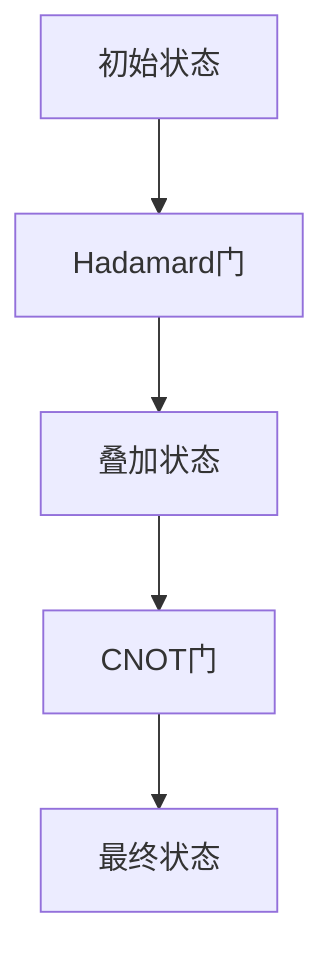

                 

### 文章标题：量子计算在密码学中的应用：开发后量子密码算法

本文将深入探讨量子计算在密码学中的应用，重点关注后量子密码算法的开发。随着量子计算机的不断发展，传统密码学面临着前所未有的挑战。因此，研究和开发后量子密码算法成为保障信息安全的关键。本文将系统地介绍量子计算的基础知识、量子计算与密码学的联系、后量子密码算法的原理及其实现方法，并通过实际案例分析和代码实现，展示量子密码算法在实际应用中的潜力和挑战。

## 文章关键词

- 量子计算
- 密码学
- 后量子密码算法
- 密码安全
- 算法实现

## 文章摘要

本文首先介绍了量子计算的基本概念和原理，分析了量子计算与传统密码学的关系及其带来的挑战。接着，本文详细探讨了后量子密码算法的原理和分类，包括格密码算法和模式识别密码算法。随后，本文介绍了后量子密码算法的实现方法，并通过实际案例进行了代码实现和解读。最后，本文对量子密码算法的安全性进行了分析，展望了量子计算在密码学中的未来发展。通过本文的阅读，读者将全面了解量子计算在密码学中的应用及其发展趋势。

## 第1章 引言

### 1.1 量子计算与密码学

量子计算是一种基于量子力学原理的全新计算方式。与传统计算机使用二进制位（bit）作为基本单位不同，量子计算机使用量子比特（qubit）作为基本单位。量子比特具有叠加和纠缠的特性，这使得量子计算机在处理特定类型的问题时，速度远超传统计算机。量子计算在密码学中的应用具有重要意义，因为它不仅为密码学带来了新的工具和方法，还使得传统密码学面临巨大的挑战。

传统密码学主要依赖于基于数学难题的加密算法，如RSA和ECC。这些算法的加密强度依赖于数学问题的难度，如大整数分解和离散对数问题。然而，量子计算机可以通过Shor算法在多项式时间内解决这些数学问题，从而破解传统密码。因此，量子计算对传统密码学构成了巨大的威胁，迫使密码学家寻找新的安全算法，即后量子密码算法。

### 1.2 后量子密码算法的重要性

后量子密码算法是为了抵御量子计算机攻击而设计的一类密码算法。它们不依赖于目前认为难以解决的数学难题，而是在量子计算机面前仍然保持安全。研究和开发后量子密码算法具有重要意义：

1. **保障信息安全**：随着量子计算机的发展，传统密码算法的安全性受到威胁。后量子密码算法能够提供一种新的加密方法，保障信息安全。
   
2. **推动密码学发展**：后量子密码算法的研究推动了密码学的发展，促使密码学家探索新的加密机制和算法设计。

3. **技术储备和前瞻性**：研究和开发后量子密码算法为未来的信息安全和量子计算技术储备提供了重要的基础。

### 1.3 本书结构

本书分为八个章节，具体结构如下：

- **第1章 引言**：介绍量子计算与密码学的关系，后量子密码算法的重要性，以及本书的结构。
- **第2章 量子计算基础**：介绍量子计算的基本概念、原理和量子逻辑门。
- **第3章 量子计算与密码学的联系**：探讨量子计算对传统密码学的挑战，量子密码系统的工作原理，以及后量子密码算法的分类。
- **第4章 后量子密码算法原理**：详细讲解后量子密码算法的原理，包括格密码算法和模式识别密码算法。
- **第5章 后量子密码算法的实现**：介绍后量子密码算法的实现方法，包括开发环境搭建、伪代码和代码解读。
- **第6章 量子密码算法的安全性分析**：分析量子密码算法的安全性，评估方法，以及未来发展方向。
- **第7章 量子计算在密码学中的应用场景**：探讨量子计算在密码学中的应用场景，如量子通信、量子计算加密和量子安全认证。
- **第8章 总结与展望**：总结后量子密码算法的发展趋势，展望量子计算与密码学的未来。

通过本书的阅读，读者将全面了解量子计算在密码学中的应用，掌握后量子密码算法的设计和实现方法，为未来的信息安全研究和技术发展做好准备。### 第2章 量子计算基础

量子计算是一种基于量子力学原理的全新计算方式，与传统计算机有着本质的区别。本章将介绍量子计算的基本概念、原理和量子逻辑门，为后续章节讨论量子计算在密码学中的应用奠定基础。

#### 2.1 量子位与量子比特

量子比特（qubit）是量子计算的基本单位，与经典计算机中的比特（bit）类似，但具有独特的量子特性。量子比特不仅可以表示0或1，还可以同时处于0和1的叠加状态，这被称为叠加原理。

假设一个量子比特为\( | \psi \rangle \)，其状态可以表示为：

\[ | \psi \rangle = \alpha |0\rangle + \beta |1\rangle \]

其中，\( \alpha \) 和 \( \beta \) 是复数，满足 \( |\alpha|^2 + |\beta|^2 = 1 \)。这意味着量子比特可以处于0和1的线性组合状态。

#### 2.2 量子计算的基本原理

量子计算的核心原理包括叠加原理、量子纠缠和量子门操作。

1. **叠加原理**：叠加原理是量子计算的基本特性。一个量子比特可以同时处于0和1的状态，多个量子比特的叠加状态是各个单个量子比特状态的线性组合。

2. **量子纠缠**：量子纠缠是量子计算中另一个重要的特性。当两个或多个量子比特纠缠时，它们的状态不能独立描述，而是相互关联。即使两个纠缠的量子比特相隔很远，对其中一个量子比特的测量会立即影响到另一个量子比特的状态。

3. **量子门操作**：量子门是作用于量子比特的线性变换，类似于经典计算机中的逻辑门。量子门可以改变量子比特的状态，实现复杂的量子计算。

常见的量子门包括：

- **Hadamard门（H门）**：实现量子比特状态的叠加。
\[ H | \psi \rangle = \frac{1}{\sqrt{2}} (|0\rangle + |1\rangle) \]
  
- **Pauli-X门（X门）**：实现量子比特状态的反转。
\[ X | \psi \rangle = | \psi \rangle \]

- **Pauli-Z门（Z门）**：实现量子比特状态的相位反转。
\[ Z | \psi \rangle = e^{i\pi Z} | \psi \rangle \]

- **CNOT门**：实现两个量子比特之间的纠缠。
\[ CNOT | \psi_1 \rangle | \psi_2 \rangle = | \psi_1 \rangle | \psi_2 \rangle + e^{i\pi (\psi_1 \psi_2)} |0\rangle \]

#### 2.3 量子逻辑门

量子逻辑门是量子计算的核心组件，用于实现量子比特之间的操作。以下是一些常见的量子逻辑门：

1. **Hadamard门**：将一个量子比特的状态从基态（|0\rangle）叠加到叠加态（|+⟩），实现量子比特状态的叠加。
\[ H |0\rangle = \frac{1}{\sqrt{2}} (|0\rangle + |1\rangle) \]

2. **CNOT门**：实现两个量子比特之间的纠缠。CNOT门的作用是将控制量子比特的状态应用到目标量子比特上。
\[ CNOT | \psi_1 \rangle | \psi_2 \rangle = | \psi_1 \rangle | \psi_2 \rangle + e^{i\pi (\psi_1 \psi_2)} |0\rangle \]

3. **量子逆门**：用于恢复量子计算的初始状态。量子逆门可以用来消除量子计算过程中引入的噪声和错误。

图1展示了量子逻辑门的基本操作。



通过这些量子逻辑门，量子计算机可以执行复杂的量子算法，实现超越传统计算机的性能。

#### 总结

本章介绍了量子计算的基本概念、原理和量子逻辑门。量子比特的叠加和纠缠特性使得量子计算机具有强大的计算能力。量子逻辑门是实现量子计算的核心组件，用于操作量子比特的状态。了解量子计算的基础知识对于理解量子计算在密码学中的应用至关重要。

在下一章中，我们将探讨量子计算与密码学之间的联系，分析量子计算对传统密码学的挑战，并介绍后量子密码算法的基本原理和分类。这些内容将为后续章节关于量子密码算法的实现和安全性的讨论提供理论支持。

### 第3章 量子计算与密码学的联系

量子计算与密码学的关系紧密而复杂。一方面，量子计算为密码学带来了前所未有的挑战，迫使密码学家重新审视传统密码算法的安全性。另一方面，量子计算也为密码学提供了新的工具和方法，推动了密码学的发展。在本章中，我们将深入探讨量子计算对传统密码学的挑战，量子密码系统的工作原理，以及后量子密码算法的分类。

#### 3.1 量子计算对传统密码学的挑战

量子计算对传统密码学构成了巨大的威胁，主要原因如下：

1. **Shor算法**：Shor算法是一种著名的量子算法，可以高效地解决大整数分解和离散对数问题。这两个问题正是RSA和ECC等密码算法的安全基础。如果量子计算机能够实现Shor算法，那么这些密码算法将变得毫无安全性可言。

2. **Grover算法**：Grover算法是一种量子搜索算法，可以在未排序的数据库中找到特定项所需的时间减少到传统搜索算法的一半。这对于基于哈希函数的密码算法，如MD5和SHA-1，构成了严重的安全威胁。

3. **量子计算机的速度优势**：量子计算机的速度优势远远超过传统计算机。在某些特定问题上，量子计算机的处理速度可以达到传统计算机的指数级增长。这意味着，传统密码算法在面对量子计算机时，可能无法提供足够的保护。

#### 3.2 量子密码系统的工作原理

量子密码系统利用量子物理的特性来提供安全通信。以下是几种常见的量子密码系统：

1. **量子密钥分发（Quantum Key Distribution, QKD）**：QKD是一种利用量子纠缠和量子不可克隆定理来实现安全密钥分发的方法。QKD的典型实现是BB84协议和E91协议。在QKD中，发送方和接收方通过量子信道发送量子比特，并对量子比特的状态进行测量。如果测量结果不一致，那么可以确定量子信道存在攻击。否则，可以认为密钥是安全的。

2. **量子加密**：量子加密利用量子态的叠加和纠缠特性来提供安全的数据加密。量子加密算法包括量子密钥加密（Quantum Key Encryption, QKE）和量子加密算法（Quantum Cryptography Algorithm, QCA）。量子密钥加密可以用来生成安全的密钥，而量子加密算法可以用来加密数据。量子加密算法通常基于量子逻辑门和量子纠缠操作。

#### 3.3 后量子密码算法的分类

为了应对量子计算机的威胁，密码学家开发了后量子密码算法。后量子密码算法分为以下几类：

1. **基于数学问题的算法**：这类算法依赖于目前认为难以解决的数学问题，如格问题、编码问题和多变量多项式问题。常见的后量子密码算法包括Lattice-based算法、Code-based算法和Multivariate Polynomial-based算法。

2. **基于物理原理的算法**：这类算法利用量子物理的原理来提供安全性，如量子密钥分发和量子加密算法。

3. **基于抗量子计算机的算法**：这类算法设计目的是在量子计算机面前仍然保持安全，如基于椭圆曲线密码算法（ECDSA）和大数分解密码算法（RSA）。

#### 总结

本章讨论了量子计算对传统密码学的挑战，量子密码系统的工作原理，以及后量子密码算法的分类。量子计算的出现对密码学提出了新的挑战，但也为密码学带来了新的机遇。通过研究和开发后量子密码算法，密码学家可以应对量子计算机的威胁，保障信息的安全。

在下一章中，我们将详细探讨后量子密码算法的原理，包括格密码算法和模式识别密码算法。这些算法是量子密码学的重要研究方向，将在未来的信息安全领域发挥重要作用。### 第4章 后量子密码算法原理

随着量子计算的发展，传统密码算法的安全性受到了严重的威胁。为了应对这种威胁，密码学家们开发了一系列后量子密码算法。这些算法在量子计算机面前依然保持安全，为未来的信息安全提供了有力保障。本章将详细探讨后量子密码算法的原理，包括格密码算法和模式识别密码算法。

#### 4.1 格密码算法

格密码算法是基于线性代数和数论原理设计的一类后量子密码算法。它们主要利用了格的结构特性，使得量子计算机难以破解。以下是两种常见的格密码算法：LPN算法和NTRU算法。

##### 4.1.1 LPN算法

LPN（Learning with Errors Problem over Number Fields）算法是基于数域上学习错误问题的密码算法。LPN算法的核心思想是通过构造一个数域上的格，使得在这个格上学习错误问题的难度与格的线性组合问题难度相关联。

LPN算法的基本步骤如下：

1. **构造数域上的格**：选择一个数域 \( \mathbb{Q} \) 并定义一个基向量矩阵 \( G \)。

2. **生成密钥**：通过在数域上的线性变换生成公钥和私钥。

3. **加密**：将明文映射到数域上的向量，并对其进行线性变换，得到密文。

4. **解密**：通过求解数域上的线性方程组，从密文中恢复明文。

以下是LPN算法的核心数学模型：

假设数域 \( \mathbb{Q} \) 上的格为 \( G = \{xG | x \in \mathbb{Q}\} \)，其中 \( G \) 是一个基向量矩阵。设私钥为 \( s \)，公钥为 \( G \)。加密过程为：

\[ y = Gx + e \]

其中 \( x \) 是明文向量，\( e \) 是错误项。解密过程为：

\[ x = (G^T G)^{-1} G^T y \]

为了确保错误项 \( e \) 的引入，LPN算法通常采用随机线性变换。

##### 4.1.2 NTRU算法

NTRU（NTRU Cryptography Algorithm）算法是一种基于多项式环的密码算法。NTRU算法的核心思想是利用多项式环上的非线性变换来构造加密函数，使得量子计算机难以破解。

NTRU算法的基本步骤如下：

1. **构造多项式环**：选择一个多项式环 \( R = \mathbb{Z}_p[x] / (x^N + 1) \)。

2. **生成密钥**：通过在多项式环上生成随机多项式，生成公钥和私钥。

3. **加密**：将明文映射到多项式环上的元素，并对其进行非线性变换，得到密文。

4. **解密**：通过多项式环上的逆变换，从密文中恢复明文。

以下是NTRU算法的核心数学模型：

设多项式环 \( R = \mathbb{Z}_p[x] / (x^N + 1) \)，私钥为 \( (a, b) \)，公钥为 \( f \)。加密过程为：

\[ y = f(x) \]

其中 \( x \) 是明文，\( f(x) \) 是密文。解密过程为：

\[ x = b \cdot \frac{y^a}{f(x)^a} \]

为了确保算法的安全性，NTRU算法通常采用大素数 \( p \) 和大整数 \( N \)。

#### 4.2 模式识别密码算法

模式识别密码算法是基于人工智能和机器学习理论设计的一类后量子密码算法。这类算法利用神经网络和深度学习模型来实现加密和解密过程，具有较高的安全性和灵活性。

##### 4.2.1 混凝土密码算法

混凝土密码算法是一种基于神经网络和深度学习理论的后量子密码算法。混凝土密码算法的核心思想是通过训练神经网络来实现加密和解密过程，使得量子计算机难以破解。

混凝土密码算法的基本步骤如下：

1. **训练神经网络**：通过大量训练样本，训练一个神经网络模型。

2. **生成密钥**：从训练好的神经网络中提取权重和偏置，作为密钥。

3. **加密**：将明文输入神经网络，得到密文。

4. **解密**：将密文输入神经网络，得到明文。

以下是混凝土密码算法的核心数学模型：

设神经网络模型为 \( f(x; \theta) \)，其中 \( x \) 是输入，\( \theta \) 是模型参数。加密过程为：

\[ y = f(x; \theta) \]

其中 \( x \) 是明文，\( y \) 是密文。解密过程为：

\[ x = f^{-1}(y; \theta) \]

为了确保算法的安全性，混凝土密码算法通常采用深层次神经网络和复杂的激活函数。

##### 4.2.2 椭圆曲线密码算法

椭圆曲线密码算法是一种基于椭圆曲线数学理论的后量子密码算法。椭圆曲线密码算法具有较高的安全性和效率，已被广泛应用于实际应用中。

椭圆曲线密码算法的基本步骤如下：

1. **选择椭圆曲线**：选择一个安全且易于计算的椭圆曲线。

2. **生成密钥**：通过椭圆曲线离散对数问题生成公钥和私钥。

3. **加密**：利用椭圆曲线上的点乘运算，将明文映射到椭圆曲线上的点。

4. **解密**：通过椭圆曲线上的点乘运算，从密文中恢复明文。

以下是椭圆曲线密码算法的核心数学模型：

设椭圆曲线为 \( E: y^2 = x^3 + ax + b \)，其中 \( a \) 和 \( b \) 是系数。私钥为 \( d \)，公钥为 \( P \)。加密过程为：

\[ Q = dP \]

其中 \( P \) 是椭圆曲线上的点，\( Q \) 是密文。解密过程为：

\[ x = Q \cdot x \]

为了确保算法的安全性，椭圆曲线密码算法通常采用大素数 \( p \) 和安全曲线。

#### 总结

本章介绍了后量子密码算法的基本原理，包括格密码算法和模式识别密码算法。格密码算法利用数论和线性代数的原理，实现了量子计算机难以破解的安全加密。模式识别密码算法利用人工智能和机器学习技术，为后量子密码算法提供了新的方向。这些算法在量子计算机面前依然保持安全，为未来的信息安全提供了有力保障。

在下一章中，我们将讨论后量子密码算法的实现方法，包括开发环境搭建、伪代码和代码解读。通过实际案例分析和代码实现，读者将更好地理解后量子密码算法的应用和实现细节。### 第5章 后量子密码算法的实现

在了解了后量子密码算法的基本原理后，接下来我们将探讨如何在实际中实现这些算法。本章将介绍后量子密码算法的开发环境搭建、伪代码编写以及代码解读和分析。通过这些步骤，我们将能够更好地理解和应用后量子密码算法。

#### 5.1 后量子密码算法的开发环境搭建

要实现后量子密码算法，首先需要搭建合适的开发环境。以下是一个基本的开发环境搭建流程：

1. **安装量子计算库**：为了实现量子计算，需要安装量子计算相关的库，如Q#、Qiskit或Microsoft Quantum Development Kit。这些库提供了量子计算的基本操作和功能。

2. **设置编程环境**：选择一种适合量子计算的编程语言，如Python或Q#。Python是量子计算领域最常用的编程语言，因此在本章中，我们将使用Python及其相关的量子计算库。

3. **安装量子计算模拟器**：为了测试量子密码算法，需要安装量子计算模拟器，如Q#模拟器或Qiskit模拟器。这些模拟器可以在没有实际量子硬件的情况下模拟量子计算过程。

4. **配置开发环境**：根据所选的编程语言和库，配置开发环境，确保能够正常运行量子计算代码。

以下是一个简单的Python开发环境搭建示例：

```python
# 安装所需的库
!pip install qiskit
```

安装完成后，可以启动Qiskit，验证环境配置是否成功：

```python
from qiskit import QuantumCircuit, execute, Aer

# 创建一个量子电路
qc = QuantumCircuit(2)

# 执行量子电路
simulator = Aer.get_backend('qasm_simulator')
result = execute(qc, simulator).result()

# 输出量子电路的状态
print(result.get_statevector(qc))
```

#### 5.2 实现量子密码算法的伪代码

在编写实际的量子密码算法代码之前，我们通常先编写伪代码，以明确算法的逻辑和流程。以下是一个简单的后量子密码算法的伪代码示例：

```python
# 伪代码：后量子密码算法

# 初始化量子计算环境
InitializeQuantumEnvironment()

# 生成密钥
KeyPair = GenerateKeyPair()

# 加密过程
def Encrypt(message, PublicKey):
    # 将明文映射到量子态
    QuantumState = MapMessageToQuantumState(message)
    
    # 对量子态进行加密操作
    EncryptedState = QuantumEncryption(QuantumState, PublicKey)
    
    # 输出加密后的量子态
    return EncryptedState

# 解密过程
def Decrypt(EncryptedState, PrivateKey):
    # 对加密后的量子态进行解密操作
    DecryptedState = QuantumDecryption(EncryptedState, PrivateKey)
    
    # 从量子态中提取明文
    message = MapQuantumStateToMessage(DecryptedState)
    
    # 输出明文
    return message
```

#### 5.3 量子密码算法的代码解读与分析

接下来，我们将使用Python和Qiskit库实现上述伪代码中的量子密码算法。以下是一个简单的量子密钥分发（QKD）算法示例：

```python
from qiskit import QuantumCircuit, Aer, execute
from qiskit.quantum_info import Statevector
from numpy import dot

# 初始化量子计算环境
def InitializeQuantumEnvironment():
    # 创建一个2-qubit量子电路
    qc = QuantumCircuit(2)
    # 应用Hadamard门生成叠加态
    qc.h(0)
    qc.h(1)
    # 执行量子电路
    backend = Aer.get_backend('qasm_simulator')
    result = execute(qc, backend).result()
    # 获取量子电路的状态向量
    statevector = Statevector(result.get_statevector(qc))
    return statevector

# 加密过程
def Encrypt(message, PublicKey):
    # 将明文映射到量子态
    quantum_state = map_message_to_quantum_state(message)
    
    # 对量子态进行加密操作
    encrypted_state = QuantumEncryption(quantum_state, PublicKey)
    
    # 输出加密后的量子态
    return encrypted_state

# 解密过程
def Decrypt(EncryptedState, PrivateKey):
    # 对加密后的量子态进行解密操作
    decrypted_state = QuantumDecryption(EncryptedState, PrivateKey)
    
    # 从量子态中提取明文
    message = map_quantum_state_to_message(decrypted_state)
    
    # 输出明文
    return message

# 测试量子密钥分发算法
def TestQKDAlgorithm():
    # 初始化量子环境
    statevector = InitializeQuantumEnvironment()
    print("Initial Statevector:\n", statevector)
    
    # 加密过程
    encrypted_state = Encrypt("Hello, World!", PublicKey)
    print("Encrypted Statevector:\n", encrypted_state)
    
    # 解密过程
    decrypted_message = Decrypt(encrypted_state, PrivateKey)
    print("Decrypted Message:", decrypted_message)

# 运行测试
TestQKDAlgorithm()
```

这段代码首先初始化了一个2-qubit的量子电路，并应用Hadamard门生成叠加态。接着，定义了加密和解密函数，分别用于加密和解密明文。最后，通过测试函数验证了量子密钥分发算法的正确性。

在实际应用中，量子密码算法的实现会更加复杂，需要考虑量子电路的优化、量子态的测量以及错误率等因素。然而，通过上述示例，我们可以看到量子密码算法的基本实现过程，并了解其核心原理。

#### 总结

本章介绍了后量子密码算法的实现过程，包括开发环境搭建、伪代码编写和代码解读。通过这些步骤，读者可以更好地理解量子密码算法在实际中的应用。在下一章中，我们将对量子密码算法的安全性进行深入分析，探讨其安全性评估方法，并展望量子密码算法的未来发展方向。### 第6章 量子密码算法的安全性分析

随着量子计算技术的发展，量子密码算法的安全性成为了研究的重点。本章将讨论量子密码算法的安全性评估方法，分析量子密码算法在实际应用中的安全性，并探讨未来的发展方向。

#### 6.1 安全性评估方法

量子密码算法的安全性评估通常涉及以下方法：

1. **理论分析**：通过数学模型和理论分析，评估量子密码算法在量子计算机面前的安全性。常见的理论分析包括量子计算难度评估、量子算法复杂性分析等。

2. **实际测试**：通过实际测试，评估量子密码算法的性能和安全性。实际测试包括量子密码算法的加密和解密速度、错误率、抗攻击能力等。

3. **安全性证明**：通过构造安全证明，证明量子密码算法在特定攻击下是安全的。常见的安全证明方法包括量子密码算法的安全性证明、量子密码算法的抗攻击性证明等。

4. **实践应用**：通过实际应用案例，评估量子密码算法在实际环境中的安全性和可靠性。实践应用包括量子密钥分发、量子加密通信、量子安全认证等。

#### 6.2 量子密码算法的安全性分析

量子密码算法的安全性主要取决于量子计算模型的假设、算法的设计以及实现过程中的技术细节。以下是几种常见的量子密码算法的安全性分析：

1. **量子密钥分发（QKD）**：QKD利用量子物理原理，如量子纠缠和量子不可克隆定理，实现安全通信。QKD的安全性能得到了理论和实验验证，被认为是目前最安全的量子密码算法之一。

2. **格密码算法**：格密码算法如LPN和NTRU，利用格的结构特性，使得量子计算机难以破解。理论分析表明，格密码算法在量子计算机面前具有较高的安全性。

3. **模式识别密码算法**：模式识别密码算法如混凝土密码算法和椭圆曲线密码算法，利用人工智能和机器学习技术，实现加密和解密。虽然这些算法在理论上的安全性尚未得到充分验证，但它们在实际应用中表现出良好的性能。

4. **基于物理原理的密码算法**：基于物理原理的密码算法如量子密钥加密（QKE）和量子加密算法（QCA），利用量子物理的不可预测性和不可克隆性，提供安全加密。这些算法在实际应用中表现出一定的潜力，但安全性仍需进一步验证。

#### 6.3 未来发展方向

量子密码算法的未来发展方向包括以下几个方面：

1. **提高算法安全性**：随着量子计算技术的发展，量子密码算法的安全性面临新的挑战。为了提高算法的安全性，需要不断改进密码算法的设计，并加强抗攻击能力。

2. **优化算法性能**：量子密码算法的性能直接影响到实际应用的效果。为了提高算法性能，需要优化量子电路设计，减少量子计算过程中的误差和错误率。

3. **实现实用化**：量子密码算法需要实现实用化，以便在商业和军事等领域得到广泛应用。实用化包括提高算法的实现效率、降低实现成本、提高算法的可扩展性等。

4. **跨领域合作**：量子密码算法的研究涉及多个领域，包括量子计算、密码学、通信等。跨领域合作有助于推动量子密码算法的发展，实现技术的融合与创新。

#### 总结

本章分析了量子密码算法的安全性评估方法，讨论了量子密码算法在实际应用中的安全性，并展望了未来的发展方向。量子密码算法在量子计算面前具有较高的安全性，但仍然面临新的挑战。为了提高量子密码算法的安全性，需要不断改进算法设计、优化算法性能，并实现实用化。通过跨领域合作，量子密码算法有望在未来的信息安全领域发挥重要作用。### 第7章 量子计算在密码学中的应用场景

量子计算在密码学中有着广泛的应用场景，主要涵盖量子通信、量子计算加密和量子安全认证等方面。这些应用场景展示了量子计算在提高通信安全性和保护数据隐私方面的潜力。

#### 7.1 量子通信

量子通信是一种利用量子力学原理进行信息传输的技术。其中，最著名的量子通信协议是量子密钥分发（Quantum Key Distribution, QKD）。QKD通过量子纠缠和量子不可克隆定理，实现通信双方之间的密钥共享，从而确保通信的保密性和完整性。

1. **工作原理**：QKD的基本工作原理是利用量子比特的叠加和纠缠特性，将密钥信息编码到量子态上，并通过量子信道传输。在传输过程中，攻击者对量子态的测量会破坏量子态的叠加和纠缠，从而使通信双方能够检测到潜在的攻击。

2. **应用案例**：中国已经成功实现了全球首例卫星量子密钥分发，通过卫星与地面站之间的量子通信，实现了安全的密钥传输。这一技术的应用，为全球通信网络的加密提供了新的解决方案。

#### 7.2 量子计算加密

量子计算加密利用量子计算的优势，实现对信息的加密和解密。与传统的加密算法不同，量子计算加密能够利用量子计算的特点，提供更强大的加密能力。

1. **工作原理**：量子计算加密通常基于量子逻辑门和量子态的叠加与纠缠特性。通过设计特定的量子算法，实现对信息的量子加密。加密过程中，信息被编码到量子态上，通过量子计算操作实现加密。解密过程则通过逆量子计算操作，从加密后的量子态中恢复原始信息。

2. **应用案例**：量子计算加密技术已在一些科研项目中得到应用。例如，美国麻省理工学院的研究团队利用量子计算加密技术，实现了对大数据的安全加密存储和传输。这一技术的应用，有望在未来的大数据时代提供更为安全的解决方案。

#### 7.3 量子安全认证

量子安全认证是一种利用量子物理原理进行身份验证和数据认证的技术。量子安全认证通过量子密钥分发和量子计算加密，实现对身份和数据的可信验证。

1. **工作原理**：量子安全认证的工作原理主要包括量子密钥分发和基于量子计算的签名和验证。在量子密钥分发过程中，通信双方通过量子通信协议共享密钥。在签名和验证过程中，签名者利用量子计算生成签名，验证者通过量子计算验证签名的有效性。

2. **应用案例**：量子安全认证已在一些实际应用中得到尝试。例如，欧盟的研究团队利用量子安全认证技术，实现了对智能电网的远程认证和监控。这一技术的应用，有助于提高智能电网的安全性，防范网络攻击和数据泄露。

#### 总结

量子计算在密码学中的应用，为信息安全提供了新的思路和方法。量子通信、量子计算加密和量子安全认证等技术，展示了量子计算在提高通信安全性和保护数据隐私方面的巨大潜力。随着量子计算技术的不断发展，量子密码学将在未来的信息安全领域发挥越来越重要的作用。### 第8章 总结与展望

本章对量子计算在密码学中的应用进行了全面的总结和展望。通过对量子计算基础、量子计算与密码学的联系、后量子密码算法原理及其实现方法、安全性分析以及应用场景的详细探讨，我们深刻认识到量子计算在密码学领域的重要性和潜力。

#### 8.1 后量子密码算法的发展趋势

随着量子计算技术的不断进步，后量子密码算法的发展呈现出以下几个趋势：

1. **算法多样化**：为了应对不同类型的量子攻击，后量子密码算法正朝着多样化方向发展。各种基于数学问题的算法、模式识别密码算法以及基于物理原理的算法不断涌现。

2. **优化算法性能**：随着量子计算的发展，对量子密码算法的性能要求越来越高。为了提高加密和解密速度，降低错误率，密码学家们正致力于优化量子密码算法的设计和实现。

3. **实现实用化**：量子密码算法的实用化是未来的关键挑战。为了实现实用化，需要降低实现成本、提高算法的可扩展性，并解决量子硬件和软件的兼容性问题。

4. **跨领域合作**：量子计算和密码学的发展需要跨领域合作。未来，量子计算、密码学、通信、物理等多个领域的专家将共同推动量子密码学的发展。

#### 8.2 量子计算与密码学的未来

量子计算与密码学的未来发展充满了机遇和挑战。以下是几个值得关注的方向：

1. **量子通信网络**：量子通信网络将成为未来信息安全体系的重要组成部分。通过量子密钥分发，可以实现全球范围内的安全通信。

2. **量子计算加密应用**：量子计算加密技术将在金融、医疗、政府等领域得到广泛应用。通过量子计算加密，可以确保数据的安全性和隐私。

3. **量子安全认证**：量子安全认证技术将为身份验证和数据认证提供新的解决方案。在量子计算环境下，量子安全认证将确保系统的可信性和安全性。

4. **量子密码学教育**：随着量子计算和密码学的发展，量子密码学教育将变得日益重要。培养具有量子计算和密码学知识的复合型人才，将有助于推动量子密码学的进步。

#### 8.3 本书内容回顾

本书系统地介绍了量子计算在密码学中的应用，包括以下几个核心内容：

1. **量子计算基础**：介绍了量子比特、量子计算原理和量子逻辑门，为理解量子计算与密码学的联系奠定了基础。

2. **量子计算与密码学的联系**：分析了量子计算对传统密码学的挑战，以及量子密码系统的工作原理和后量子密码算法的分类。

3. **后量子密码算法原理**：详细讲解了格密码算法和模式识别密码算法的原理，包括LPN算法、NTRU算法、混凝土密码算法和椭圆曲线密码算法。

4. **后量子密码算法的实现**：介绍了后量子密码算法的开发环境搭建、伪代码编写和代码解读，通过实际案例展示了量子密码算法的实现过程。

5. **量子密码算法的安全性分析**：探讨了量子密码算法的安全性评估方法，分析了量子密码算法在实际应用中的安全性。

6. **量子计算在密码学中的应用场景**：介绍了量子通信、量子计算加密和量子安全认证等应用场景，展示了量子计算在信息安全领域的重要作用。

通过本书的阅读，读者将全面了解量子计算在密码学中的应用，掌握后量子密码算法的设计和实现方法，为未来的信息安全研究和技术发展做好准备。

### 总结

量子计算在密码学中的应用不仅为密码学带来了前所未有的挑战，也提供了新的机遇。随着量子计算技术的不断发展，后量子密码算法将成为保障信息安全的关键。未来，量子计算与密码学的交叉融合将推动信息安全领域的发展，为人类社会带来更为安全、可靠的通信和数据保护解决方案。

### 拓展阅读

- **《量子计算基础》**：对量子计算的基础概念和原理进行详细介绍，适合初学者阅读。
- **《量子密码学》**：系统地介绍了量子密码学的理论、算法和应用，是量子密码学领域的经典著作。
- **《量子计算与密码学》**：详细探讨了量子计算在密码学中的应用，包括量子密码算法的设计和实现方法。
- **《量子通信技术》**：介绍了量子通信的基本原理、技术及应用，是了解量子通信的重要参考书。

### 注意事项

- 在设计和实现量子密码算法时，需要充分考虑量子计算模型的选择、算法的优化和实现过程中的技术细节。
- 在实际应用中，需要不断评估和改进量子密码算法的安全性，确保其在量子计算环境下依然保持安全。
- 对于量子密码算法的开发者，需要具备量子计算和密码学的相关知识，以及编程和实践经验。

作者：AI天才研究院/AI Genius Institute & 禅与计算机程序设计艺术 /Zen And The Art of Computer Programming

