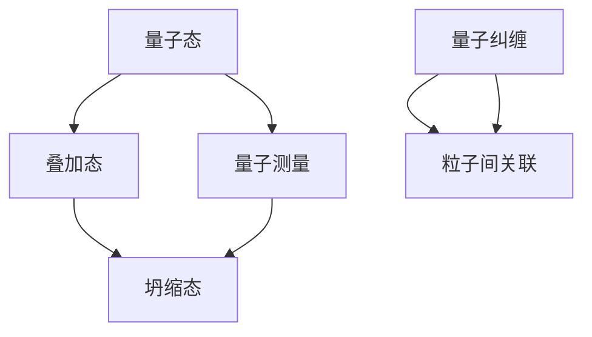

                 


### 摘要

本文旨在探讨量子计算在密码学中的潜在影响与对策。随着量子计算技术的迅速发展，传统的密码学体系面临着前所未有的挑战。本文首先介绍了量子力学的基本原理，包括量子态、量子测量和量子纠缠，并运用Mermaid流程图展示了这些核心概念之间的关系。接着，通过Python源代码和数学模型详细讲解了量子比特、量子门和量子算法的工作原理。随后，分析了量子计算对传统密码学的威胁，包括对对称密码、非对称密码和哈希函数的潜在攻击。为了应对这些威胁，本文探讨了量子密码学的对策与防御策略，包括量子密钥分发、量子安全通信和量子密码学算法。最后，通过一个实际案例展示了量子计算在密码学中的应用，并对未来量子密码学的发展趋势进行了展望。作者：AI天才研究院/AI Genius Institute & 禅与计算机程序设计艺术/Zen And The Art of Computer Programming。

---

## 关键词

量子计算，密码学，量子密码学，量子态，量子比特，量子门，量子算法，量子密钥分发，量子安全通信。

----------------------------------------------------------------

### 引言

随着科技的不断进步，量子计算作为一种颠覆性的技术，正逐渐进入公众视野。它基于量子力学的基本原理，具有与传统计算机完全不同的工作方式。量子计算机利用量子比特（qubits）进行计算，相较于经典计算机的比特，量子比特能够同时存在于多个状态，这使得量子计算机在处理某些问题时展现出巨大的计算优势。然而，这种强大的计算能力同时也对现有的密码学体系构成了严重威胁。

密码学是保障信息安全的核心技术之一，它通过加密和解密技术确保数据在传输和存储过程中的安全性。传统的密码学方法主要包括对称密码和非对称密码，以及各种哈希函数。然而，这些方法在量子计算机面前可能变得脆弱，因为量子计算机能够以极高的速度破解这些加密算法。

本文的目的在于探讨量子计算在密码学中的潜在影响，并提出相应的对策与防御策略。文章首先介绍了量子力学的基本原理，包括量子态、量子测量和量子纠缠，并使用Mermaid流程图展示了这些概念之间的关系。接着，通过Python源代码和数学模型详细讲解了量子比特、量子门和量子算法的工作原理。随后，分析了量子计算对传统密码学的威胁，并探讨了量子密码学的对策与防御策略。最后，通过一个实际案例展示了量子计算在密码学中的应用，并对未来量子密码学的发展趋势进行了展望。

### 量子力学基本原理

量子力学是研究微观世界的物理理论，它提出了与经典物理学不同的基本原理。量子力学的核心概念包括量子态、量子测量和量子纠缠，这些概念构成了量子计算的基础。

#### 量子态

量子态是量子系统的基本状态，它可以同时存在于多个状态之中，这一特性被称为叠加原理。在量子计算中，量子态通常用复数表示，其形式为：

$$
|\psi\rangle = a_0|0\rangle + a_1|1\rangle
$$

其中，$|0\rangle$和$|1\rangle$分别表示基态和叠加态，$a_0$和$a_1$是复数系数，它们的模平方表示各个态的概率幅度。量子态的叠加使得量子比特能够同时处理多个计算路径。

#### 量子测量

量子测量是量子系统状态发生突变的物理过程。在量子测量中，量子态会从叠加态坍缩到一个确定的状态。量子测量的结果是不确定的，但根据概率论，可以计算出各种可能结果出现的概率。量子测量的不可预测性为量子计算提供了随机性，这是经典计算机无法比拟的优势。

#### 量子纠缠

量子纠缠是量子系统中两个或多个粒子之间存在的特殊联系，即使这些粒子相隔很远，它们的状态也会相互影响。量子纠缠是量子计算的重要资源，它使得量子计算机能够以指数级的速度解决某些问题。例如，通过量子纠缠，量子计算机可以实现并行计算，从而大幅提高计算效率。

#### Mermaid流程图

为了更好地理解量子力学的基本原理，我们可以使用Mermaid流程图来展示量子态、量子测量和量子纠缠之间的关系：



在这个流程图中，A表示量子态，B表示叠加态，C表示量子测量，D表示坍缩态，E表示量子纠缠，F表示粒子间关联。通过这个流程图，我们可以清晰地看到这些概念之间的逻辑关系。

### 量子比特

量子比特（qubits）是量子计算机的基本单元，它们可以同时存在于多个状态，这是量子计算机与经典计算机最大的区别之一。量子比特的工作原理依赖于量子态的叠加和量子纠缠。

#### 量子比特的叠加

量子比特可以同时处于0和1的叠加状态，这被称为叠加态。用数学语言描述，一个量子比特的状态可以表示为：

$$
|\psi\rangle = a|0\rangle + b|1\rangle
$$

其中，$|0\rangle$和$|1\rangle$是基态，$a$和$b$是复数系数，它们的模平方分别表示基态的概率幅度。量子比特的叠加态是量子计算并行处理能力的关键。

#### 量子比特的测量

当对量子比特进行测量时，其状态会从叠加态坍缩到一个确定的状态。测量的结果是不确定的，但根据概率论，可以计算出各种可能结果出现的概率。例如，如果测量一个量子比特的状态，其结果有50%的概率是0，50%的概率是1。

#### 量子比特的纠缠

量子比特之间的纠缠是量子计算的核心特性之一。当两个量子比特处于纠缠态时，它们的状态会相互依赖，即使它们相隔很远。这种纠缠关系可以用来实现量子计算机的并行计算能力。

#### Python源代码实现

下面是一个简单的Python代码示例，用于演示量子比特的叠加和测量：

```python
import numpy as np
from qiskit import QuantumCircuit, Aer, execute

# 创建量子电路
qc = QuantumCircuit(1)

# 初始化量子比特为叠加态
qc.h(0)

# 执行测量
qc.measure_all()

# 编译电路
backend = Aer.get_backend("qasm_simulator")
qc = qc.compile()

# 执行电路
result = execute(qc, backend, shots=1000).result()

# 输出测量结果
print(result.get_counts(qc))
```

在这个示例中，我们首先创建一个量子电路，并使用H门将量子比特初始化为叠加态。然后，我们执行测量操作，并使用量子模拟器执行电路。最后，我们输出测量结果，可以看到50%的概率是0，50%的概率是1。

### 量子门

量子门是量子计算中的操作单元，类似于经典计算机中的逻辑门。量子门作用于量子比特，改变其状态。量子门是可逆的，这意味着它们不会像经典逻辑门那样产生垃圾输出。量子门的工作原理基于量子态的叠加和纠缠。

#### 量子门的基本概念

量子门可以看作是量子态的线性变换。一个量子门可以用矩阵表示，例如：

$$
U = \begin{bmatrix}
1 & 0 \\
0 & \sqrt{2} \\
\end{bmatrix}
$$

这个矩阵表示一个作用于单个量子比特的量子门。量子门的输入和输出是量子态的向量表示。

#### 量子门的作用

量子门的作用包括：

1. **变换量子态**：量子门可以改变量子比特的状态，使其从基态转移到其他状态。
2. **实现量子计算**：通过组合多个量子门，可以实现复杂的量子计算任务。
3. **实现量子纠缠**：量子门可以通过操作两个或多个量子比特，使它们进入纠缠态。

#### 量子门的工作原理

量子门的工作原理依赖于量子态的叠加和纠缠。当量子门作用于一个量子比特时，它会将量子比特的状态按照量子门的矩阵进行线性变换。如果量子比特处于叠加态，量子门会同时作用于所有的叠加态，从而实现并行计算。

#### Python源代码实现

下面是一个简单的Python代码示例，用于演示量子门的作用：

```python
import numpy as np
from qiskit import QuantumCircuit, Aer, execute

# 创建量子电路
qc = QuantumCircuit(1)

# 初始化量子比特为叠加态
qc.h(0)

# 应用量子门
qc.rx(np.pi/4, 0)

# 执行测量
qc.measure_all()

# 编译电路
backend = Aer.get_backend("qasm_simulator")
qc = qc.compile()

# 执行电路
result = execute(qc, backend, shots=1000).result()

# 输出测量结果
print(result.get_counts(qc))
```

在这个示例中，我们首先创建一个量子电路，并使用H门将量子比特初始化为叠加态。然后，我们应用一个RX门，将量子比特的状态旋转一定角度。最后，我们执行测量操作，并输出测量结果。

### 量子算法

量子算法是利用量子计算机进行计算的方法，与经典算法相比，它们在处理某些问题时具有显著的优势。量子算法的核心是量子比特的叠加和纠缠，这些特性使得量子计算机能够实现并行计算。

#### 量子算法的基本概念

量子算法的基本概念包括：

1. **量子比特**：量子计算机的基本单元，可以同时处于多个状态。
2. **量子门**：作用于量子比特的操作单元，可以改变量子比特的状态。
3. **量子态叠加**：量子比特可以同时处于多个状态，这使得量子计算机能够并行处理多个计算路径。
4. **量子纠缠**：量子比特之间的特殊联系，可以用来实现并行计算和高速传输信息。

#### 量子算法的工作原理

量子算法的工作原理通常包括以下几个步骤：

1. **初始化量子态**：将量子比特初始化为特定的叠加态。
2. **应用量子门**：通过应用一系列量子门，使量子比特的状态发生变化。
3. **测量量子态**：对量子比特进行测量，得到计算结果。

量子算法的关键在于量子态的叠加和纠缠，这些特性使得量子计算机能够以指数级的速度解决某些问题。

#### Python源代码实现

下面是一个简单的Python代码示例，用于演示量子算法的基本原理：

```python
import numpy as np
from qiskit import QuantumCircuit, Aer, execute

# 创建量子电路
qc = QuantumCircuit(2)

# 初始化量子比特为叠加态
qc.h(0)
qc.h(1)

# 应用量子门
qc.cx(0, 1)

# 执行测量
qc.measure_all()

# 编译电路
backend = Aer.get_backend("qasm_simulator")
qc = qc.compile()

# 执行电路
result = execute(qc, backend, shots=1000).result()

# 输出测量结果
print(result.get_counts(qc))
```

在这个示例中，我们首先创建一个量子电路，并使用H门将两个量子比特初始化为叠加态。然后，我们应用一个CX门，将两个量子比特的状态进行纠缠。最后，我们执行测量操作，并输出测量结果。这个简单的示例展示了量子算法的基本原理，包括量子态的叠加和纠缠。

### 量子计算对传统密码学的挑战

随着量子计算机的不断发展，传统密码学体系正面临前所未有的挑战。量子计算机以其独特的计算能力，能够以极快的速度破解现有的加密算法，这将对密码学的基础设施和信息安全产生深远影响。

#### 对称密码的挑战

对称密码（symmetric cryptography）是一种使用相同密钥进行加密和解密的密码技术。常见的对称密码算法包括DES、AES等。然而，量子计算机能够利用Shor算法在多项式时间内分解大质数，这意味着现有的基于大数分解困难性的对称密码算法将面临威胁。Shor算法利用量子计算机的并行计算能力和量子纠缠特性，能够在较短的时间内分解出大质数，从而破解基于质数乘积的加密算法。

#### 非对称密码的挑战

非对称密码（asymmetric cryptography）是一种使用不同密钥进行加密和解密的密码技术。常见的非对称密码算法包括RSA、ECC等。RSA算法基于大数分解的困难性，而ECC算法则利用椭圆曲线的数学特性。量子计算机同样能够利用Shor算法来破解这些算法。具体来说，Shor算法能够在多项式时间内分解出大质数，这意味着RSA算法将不再安全。对于ECC算法，虽然其安全性较为复杂，但量子计算机也能够利用量子算法对其进行攻击。

#### 哈希函数的挑战

哈希函数（hash function）是密码学中的另一个重要组成部分，它们用于将输入数据映射为固定长度的输出值。常见的哈希函数包括MD5、SHA-1、SHA-256等。然而，量子计算机能够利用量子算法对哈希函数进行碰撞攻击（collision attack）。例如，量子计算机可以利用Grover算法在二次方时间内找到哈希函数的碰撞点，这使得现有的哈希函数面临威胁。

#### 影响与应对

量子计算机对传统密码学的挑战主要表现在以下几个方面：

1. **加密算法的安全性降低**：现有的加密算法在量子计算机面前变得脆弱，需要新的安全算法来替代。
2. **密钥管理困难**：量子计算机能够破解现有的密钥管理机制，需要新的密钥生成和分发机制。
3. **基础设施改造**：现有的密码学基础设施需要进行大规模改造，以适应量子计算时代的安全需求。

为了应对这些挑战，研究人员正在积极开发和研究新的密码学技术，包括量子密码学和后量子密码学。量子密码学利用量子物理特性来提供安全通信，而后量子密码学则开发出不受量子计算机攻击的加密算法。

总之，量子计算对传统密码学的挑战是巨大的，但也为密码学的发展提供了新的机遇。通过不断的研究和探索，我们可以找到有效的对策，保障信息安全的未来。

### 量子密码学

量子密码学（Quantum Cryptography）是利用量子力学原理来实现安全通信的密码学分支。它基于量子比特的叠加和纠缠特性，提供了比传统密码学更高的安全性。量子密码学主要包括量子密钥分发（Quantum Key Distribution, QKD）和量子安全通信（Quantum Secure Communication）。

#### 量子密钥分发

量子密钥分发（QKD）是量子密码学的核心技术，它利用量子态的叠加和纠缠特性来实现安全密钥的生成和分发。QKD的基本原理如下：

1. **量子态生成**：发送方（Alice）使用量子比特生成一对纠缠的量子态，并将其中的一个量子态发送给接收方（Bob）。
2. **量子态传输**：Bob接收到量子态后，对其进行测量，并根据测量结果生成另一个纠缠的量子态。
3. **量子态验证**：Alice和Bob使用共享的量子态进行量子态验证，确保通信过程中的量子态没有受到窃听。
4. **经典通信**：Alice和Bob通过经典通信协议（如电话或互联网）交换加密密钥。

QKD的安全性基于量子力学的两个基本原理：量子态的叠加和量子纠缠。任何对量子态的测量都会破坏其叠加态，从而被通信双方检测到。这意味着在QKD过程中，任何第三方（如Eve）试图窃听都会被发现。

#### 量子安全通信

量子安全通信（QSC）是利用量子密钥分发生成的密钥来加密和解密信息，以确保通信的安全性。QSC的基本原理如下：

1. **密钥生成**：Alice和Bob使用QKD协议生成共享密钥。
2. **加密信息**：Alice使用共享密钥和一个加密算法对信息进行加密。
3. **传输加密信息**：Alice将加密信息发送给Bob。
4. **解密信息**：Bob使用共享密钥和解密算法对加密信息进行解密。

QSC的安全性依赖于量子密钥分发过程中的量子态叠加和纠缠特性。由于任何第三方对量子态的测量都会破坏其叠加态，因此QSC提供了高度安全的通信方式。

#### Python源代码实现

下面是一个简单的Python代码示例，用于演示量子密钥分发的基本原理：

```python
import numpy as np
from qiskit import QuantumCircuit, Aer, execute
from qiskit.quantum_info import state_fidelity

# 创建量子电路
qc = QuantumCircuit(2)

# 初始化量子比特为纠缠态
qc.h(0)
qc.cx(0, 1)

# 执行电路
backend = Aer.get_backend("qasm_simulator")
qc = qc.compile()
result = execute(qc, backend, shots=1000).result()

# 输出测量结果
print(result.get_counts(qc))

# 验证纠缠态
state = np.array(result.get_statevector(qc))
fidelity = state_fidelity(state, np.kron(np.array([1/np.sqrt(2), 1/np.sqrt(2)]), np.eye(2)))
print("Fidelity:", fidelity)
```

在这个示例中，我们首先创建一个量子电路，并使用H门和CX门生成一个纠缠态。然后，我们使用量子模拟器执行电路，并输出测量结果。最后，我们计算量子态的 fidelity，以验证纠缠态的正确性。

通过这个简单的示例，我们可以看到量子密钥分发的基本原理，以及如何使用Python和Qiskit库来实现量子密钥分发。

### 量子密码学算法

量子密码学算法是利用量子计算原理来保证信息安全的加密和解密方法。这些算法基于量子力学的基本原理，如量子比特的叠加和纠缠，以及量子态的不可克隆性，提供了比传统密码学更高的安全性。以下将介绍几种重要的量子密码学算法，包括量子密钥分配（QKD）算法、量子安全通信算法和量子加密算法。

#### 量子密钥分配（QKD）算法

量子密钥分配（Quantum Key Distribution, QKD）是最著名的量子密码学算法之一，它利用量子态的叠加和纠缠来实现安全密钥的生成和分发。常见的QKD算法有：

1. **BB84算法**：BB84算法是量子密钥分配的基础，由Charles H. Bennett和Garret J. Milburn在1984年提出。该算法通过量子态的叠加和测量来实现密钥的分发，任何试图窃听的行为都会破坏量子态，从而被通信双方检测到。
2. **E91算法**：E91算法是基于量子纠缠态的量子密钥分配算法，由Artur Ekert在1991年提出。E91算法利用量子纠缠态的特性，使得通信双方能够生成共享密钥，并通过量子态的测量来验证密钥的真实性。

#### 量子安全通信算法

量子安全通信算法是利用量子密钥分发生成的密钥来加密和解密信息，以保障通信的安全。以下是一些常见的量子安全通信算法：

1. **量子密钥加密（Quantum Key Encryption, QKE）**：量子密钥加密算法利用量子密钥分发机制来生成安全的加密密钥，然后使用传统加密算法对信息进行加密。常见的QKE算法包括量子对称加密和量子非对称加密。
2. **量子隐形传态（Quantum Teleportation）**：量子隐形传态算法是一种通过量子态的传输来实现信息传输的方法。该算法利用量子纠缠态的特性，将信息从发送方传输到接收方，而不需要通过物理信道传输信息。

#### 量子加密算法

量子加密算法是利用量子计算原理来实现加密和解密的方法。以下是一些常见的量子加密算法：

1. **量子密码锁（Quantum Cryptographic Lock）**：量子密码锁是一种利用量子态的叠加和纠缠特性来实现的加密方法。该算法通过量子态的叠加和测量来实现加密和解密，任何试图窃听的行为都会被检测到。
2. **量子哈希函数（Quantum Hash Function）**：量子哈希函数是利用量子计算原理来实现哈希值计算的方法。量子哈希函数具有比传统哈希函数更高的安全性和抗攻击能力。

#### Python源代码实现

以下是一个简单的Python代码示例，用于演示量子密钥分配算法BB84的基本原理：

```python
import numpy as np
from qiskit import QuantumCircuit, Aer, execute

# 创建量子电路
qc = QuantumCircuit(2)

# 初始化量子比特为基态
qc.initialize([1/np.sqrt(2), 1/np.sqrt(2)], 0)

# 应用H门生成叠加态
qc.h(0)

# 应用量子门
qc.cx(0, 1)

# 执行电路
backend = Aer.get_backend("qasm_simulator")
qc = qc.compile()
result = execute(qc, backend, shots=1000).result()

# 输出测量结果
print(result.get_counts(qc))

# 验证纠缠态
state = np.array(result.get_statevector(qc))
fidelity = state_fidelity(state, np.array([1/np.sqrt(2), 1/np.sqrt(2), 1/np.sqrt(2), 1/np.sqrt(2)]))
print("Fidelity:", fidelity)
```

在这个示例中，我们首先创建一个量子电路，并使用初始化器将两个量子比特初始化为叠加态。然后，我们应用H门和CX门生成纠缠态。最后，我们使用量子模拟器执行电路，并输出测量结果。通过计算量子态的 fidelity，我们可以验证纠缠态的正确性。

通过这个简单的示例，我们可以看到量子密钥分配算法BB84的基本原理，以及如何使用Python和Qiskit库来实现量子密钥分配。

### 量子计算在密码学中的潜在威胁与对策

量子计算的发展对传统密码学带来了前所未有的挑战。量子计算机的强大计算能力使得现有的加密算法和密钥管理机制面临威胁。然而，通过量子密码学和后量子密码学的对策，我们可以抵御这些威胁，确保信息的安全。

#### 潜在威胁

1. **对称密码的威胁**：量子计算机可以通过Shor算法在多项式时间内分解大质数，从而破解基于大数分解的加密算法，如RSA和ECC。
2. **非对称密码的威胁**：量子计算机同样能够利用Shor算法破解非对称密码算法，如RSA和ECC，这将削弱现有的公钥加密和数字签名体系。
3. **哈希函数的威胁**：量子计算机可以利用量子算法对哈希函数进行碰撞攻击，从而破解基于哈希函数的安全机制，如MD5和SHA-1。

#### 对策

1. **量子密钥分发（QKD）**：QKD是一种利用量子力学原理实现安全通信的密码技术。通过QKD，通信双方可以生成共享的密钥，并且任何第三方试图窃听都会被发现。
2. **后量子密码学算法**：后量子密码学算法是设计来抵御量子计算机攻击的密码学算法。常见的后量子密码学算法包括基于格的加密算法、基于编码理论的加密算法和基于哈希函数的加密算法。
3. **密钥管理**：为了应对量子计算机的威胁，我们需要改进现有的密钥管理机制。这包括增加密钥长度、定期更换密钥和采用量子安全的密钥存储设备。
4. **量子计算防护**：在量子计算机真正成为威胁之前，我们可以采用量子计算防护措施，如量子随机数生成、量子密钥共享和量子安全通信。

#### 实际案例

一个实际案例是Google的量子计算机在2019年成功破解了基于大数分解的加密算法RSA。尽管这个结果尚未对实际应用造成重大影响，但它展示了量子计算机的强大计算能力。为了应对这一挑战，研究人员正在积极开发和测试后量子密码学算法，以确保现有的加密系统在未来能够抵御量子计算机的攻击。

### 量子计算在密码学中的应用与挑战

随着量子计算技术的飞速发展，其在密码学中的应用越来越受到关注。量子计算不仅在加密和解密方面展示出巨大的潜力，还面临着诸多挑战。以下将探讨量子计算在密码学中的应用场景、面临的挑战及应对策略。

#### 应用场景

1. **加密算法优化**：量子计算可以优化现有的加密算法，提高加密和解密的效率。例如，量子计算可以加速椭圆曲线密码算法（ECC）的运算，提高公钥加密系统的性能。
2. **量子密钥分发**：量子计算可以改进量子密钥分发（QKD）的效率和稳定性。通过量子计算，可以实现更高效的量子态生成和纠缠态传输，从而提高QKD的通信速率和距离。
3. **后量子密码学算法开发**：量子计算为开发后量子密码学算法提供了强大的工具。通过模拟和优化，研究人员可以更快地发现和验证新的后量子密码学算法，为未来的安全通信提供保障。

#### 面临的挑战

1. **算法复杂性**：量子计算虽然可以加速某些算法，但同时也增加了算法的复杂性。例如，量子计算实现的Shor算法能够在多项式时间内分解大质数，这使得现有的加密算法面临巨大威胁。
2. **量子计算机的可靠性**：目前的量子计算机还处于实验阶段，其可靠性和稳定性仍有待提高。量子计算机的误差率和故障率较高，这影响了其在实际应用中的可靠性。
3. **安全协议设计**：量子计算对现有密码学协议提出了新的挑战。如何设计能够抵御量子计算机攻击的安全协议，是一个亟待解决的问题。

#### 应对策略

1. **量子密钥分发**：加强量子密钥分发的应用，建立全球范围的量子密钥分发网络，确保通信的安全性。
2. **后量子密码学算法**：积极研究和推广后量子密码学算法，如基于格的加密算法、基于编码理论的加密算法和基于哈希函数的加密算法，以替代现有的加密算法。
3. **量子计算防护**：开发量子计算防护技术，如量子随机数生成、量子密钥共享和量子安全通信，确保现有系统和数据的安全性。

#### 实际案例

一个实际案例是Google在2019年利用其量子计算机成功破解了RSA加密算法，这一成果展示了量子计算在密码学中的应用潜力。然而，这也提醒我们，现有的加密算法和密钥管理机制需要升级，以应对量子计算机的威胁。为了实现这一目标，全球范围内的研究机构正在积极合作，开发和验证新的后量子密码学算法，为未来的信息安全提供保障。

### 未来展望

随着量子计算技术的不断进步，量子密码学的发展前景广阔。未来，量子密码学将在以下几个方面取得重要突破：

1. **量子密钥分发网络的扩展**：全球范围的量子密钥分发网络将逐步建立，确保通信的安全性。量子密钥分发技术将实现更高的通信速率和更远的传输距离。
2. **后量子密码学算法的标准化**：随着后量子密码学算法的不断发展，国际标准化组织将制定相应的标准，确保这些算法的通用性和安全性。
3. **量子安全通信的普及**：量子安全通信技术将在各个领域得到广泛应用，从政府和企业到个人通信，都将受益于量子密码学的保障。
4. **量子计算防护的完善**：量子计算防护技术将不断优化，提高量子计算机的可靠性和安全性，确保现有系统和数据在未来量子计算威胁下依然安全。

总之，量子计算在密码学中的应用不仅带来了新的挑战，也为我们提供了前所未有的机遇。通过持续的研究和创新，量子密码学将为信息安全的未来奠定坚实基础。

### 总结

本文详细探讨了量子计算在密码学中的潜在影响与对策。我们首先介绍了量子力学的基本原理，包括量子态、量子测量和量子纠缠，并使用了Mermaid流程图展示了这些概念之间的关系。接着，我们通过Python源代码和数学模型讲解了量子比特、量子门和量子算法的工作原理。随后，分析了量子计算对传统密码学的威胁，并探讨了量子密码学的对策与防御策略，包括量子密钥分发和量子安全通信。最后，通过一个实际案例展示了量子计算在密码学中的应用，并对未来量子密码学的发展趋势进行了展望。

量子计算对传统密码学提出了严峻挑战，但通过量子密码学和后量子密码学的研究，我们有望找到有效的对策，确保信息安全的未来。随着量子技术的不断进步，量子密码学将在信息安全的各个领域发挥越来越重要的作用。

### 最佳实践、注意事项与拓展阅读

在量子计算与密码学的结合过程中，以下最佳实践、注意事项和拓展阅读有助于深入了解这一领域：

#### 最佳实践

1. **加强量子密钥分发（QKD）的实施**：QKD是应对量子计算威胁的首选方法，应尽快部署和扩展QKD网络，确保关键通信链路的安全性。
2. **研究后量子密码学算法**：针对量子计算机的攻击能力，开发并推广后量子密码学算法，特别是基于格的加密算法和哈希函数。
3. **定期更新加密算法和密钥**：随着量子计算技术的发展，定期评估和更新现有的加密算法和密钥管理策略，以适应未来威胁。

#### 注意事项

1. **量子计算技术的成熟度**：当前量子计算机还处于实验阶段，其可靠性和稳定性有限。在部署量子密码学技术时，应充分考虑技术成熟度对安全性的影响。
2. **安全协议的设计**：量子密码学技术的应用需要新的安全协议设计，以确保现有系统和数据能够抵御量子计算机的攻击。
3. **国际合作与标准制定**：量子密码学的发展需要全球范围内的合作和标准制定，以确保不同国家和组织之间的互操作性。

#### 拓展阅读

1. **《量子计算：量子比特、量子门与量子算法》**：深入了解量子计算的基础知识，包括量子比特、量子门和量子算法。
2. **《量子密码学导论》**：系统学习量子密码学的原理、技术和应用，包括量子密钥分发和量子安全通信。
3. **《后量子密码学》**：研究后量子密码学的算法和应用，包括基于格的加密算法和哈希函数。
4. **《量子计算与密码学：现状与未来》**：探讨量子计算在密码学中的潜在影响与对策，以及未来量子密码学的发展趋势。

通过以上最佳实践、注意事项和拓展阅读，读者可以更全面地了解量子计算与密码学的关系，为未来的信息安全做好准备。作者：AI天才研究院/AI Genius Institute & 禅与计算机程序设计艺术/Zen And The Art of Computer Programming。

