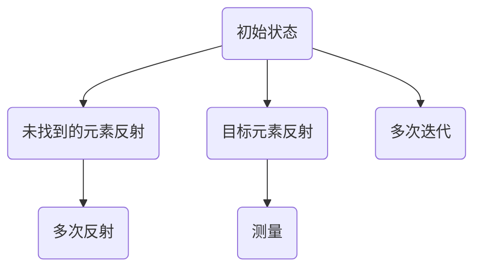

                 

## 量子计算在密码学中的潜在革命性应用

### 关键词

量子计算，密码学，加密算法，Shor算法，Grover算法，量子密钥分发，量子安全协议，RSA，ECC

### 摘要

量子计算作为一种颠覆性的技术，正在逐步改变我们对计算能力的认知。密码学是保障信息安全的核心领域，而量子计算的出现对传统的密码学体系带来了前所未有的挑战和机遇。本文将深入探讨量子计算在密码学中的潜在革命性应用，从量子计算的基础概念、量子算法的原理、量子计算在密码学中的挑战和机遇，以及量子密码学的应用实例等多个方面进行分析和阐述，旨在为广大读者提供一个全面了解量子计算对密码学影响的视角。

## 引言

密码学作为信息安全领域的重要分支，历史悠久且应用广泛。传统的密码学算法，如RSA和ECC，已经广泛应用于各种安全通信和数据保护场景。然而，随着计算能力的提升，传统密码学算法的安全性正受到越来越大的威胁。为了应对这一挑战，量子计算的出现为密码学带来了新的希望和可能性。

量子计算以其独特的量子比特、量子叠加和量子纠缠等特性，能够实现传统计算机难以达到的计算速度和效率。量子计算机的潜在应用不仅限于科学计算和复杂问题求解，还在密码学领域展示了巨大的潜力。量子计算能够破解传统密码学算法，同时也能够为密码学提供新的解决方案，如量子密钥分发和量子安全协议。

本文将首先介绍量子计算的基础知识，包括量子比特、量子叠加和量子纠缠等概念。接着，我们将讨论量子算法，特别是Shor算法和Grover算法，说明它们如何对密码学产生深远影响。然后，我们将分析量子计算对传统密码学的挑战，探讨量子密码学的机遇和潜在应用。最后，本文将通过具体实例展示量子密码学的实际应用，并总结全文，展望量子计算在密码学领域的未来发展趋势。

### 设计目录大纲的步骤

在设计《量子计算在密码学中的潜在革命性应用》这本书的目录大纲时，我们可以遵循以下步骤来确保大纲的完整性、逻辑性和专业性：

1. **理解书名和主题：**
   - 确保对书名《量子计算在密码学中的潜在革命性应用》有深刻的理解，包括量子计算、密码学以及它们之间的潜在联系。

2. **确定核心章节：**
   - 根据书名和主题，确定书的核心章节，这些章节应该是书中最重要的部分，每个章节都围绕一个主要概念或应用领域展开。

3. **编写1级目录：**
   - 根据核心章节，创建一级目录，这些章节应该覆盖书的整体结构，为读者提供一个总览。

4. **细化2级目录：**
   - 为每个一级目录下的章节细化二级目录，这些章节应该提供具体的知识点或主题，进一步分解核心概念。

5. **撰写3级目录：**
   - 对于二级目录中的每个主题，创建三级目录，这些章节应该包含更详细的内容，如算法原理、数学模型、项目实战等。

6. **确保完整性：**
   - 确保大纲中的每个章节都有对应的二级和三级目录，覆盖核心概念、原理、数学模型、应用实例等。

7. **简洁性检查：**
   - 审查大纲，确保内容简洁明了，避免多余的废话。

8. **格式调整：**
   - 将大纲格式调整为markdown格式，使用正确的#和##标记来定义不同级别的标题。

9. **最后审查：**
   - 审查整个大纲，确保逻辑连贯，内容完整，格式正确。

以下是根据这些步骤设计的目录大纲：

### 目录

## 第一部分：量子计算基础

### 1.1 量子计算概述

#### 1.1.1 量子计算的基本概念

#### 1.1.2 量子比特与经典比特的对比

#### 1.1.3 量子叠加与量子纠缠

### 1.2 量子算法原理

#### 1.2.1 Shor算法

#### 1.2.2 Grover算法

### 1.3 量子计算硬件现状

#### 1.3.1 量子计算机的发展历程

#### 1.3.2 当前量子计算机的挑战与进展

#### 1.3.3 量子计算机的商业化前景

## 第二部分：密码学基础

### 2.1 密码学的基本概念

#### 2.1.1 密码学与信息安全

#### 2.1.2 密码体制的分类

#### 2.1.3 密码分析的基本方法

### 2.2 现代密码学算法

#### 2.2.1 RSA加密算法

#### 2.2.2 Elliptic Curve Cryptography (ECC)

## 第三部分：量子计算在密码学中的应用

### 3.1 量子密码学的潜力

#### 3.1.1 量子密钥分发 (QKD)

#### 3.1.2 量子安全协议

### 3.2 量子计算对传统密码学的挑战

#### 3.2.1 量子计算对RSA的攻击

#### 3.2.2 量子计算对ECC的攻击

### 3.3 量子密码学的机遇

#### 3.3.1 新型量子密码学算法

#### 3.3.2 量子安全通信

### 3.4 量子密码学的应用实例

#### 3.4.1 量子密钥分发实践

#### 3.4.2 量子安全协议实践

## 结论

#### 4.1 量子计算在密码学中的应用前景

#### 4.2 最佳实践与未来趋势

#### 4.3 小结与拓展阅读

通过这个详细的目录大纲，我们可以清晰地看到本书的结构和内容安排。接下来，我们将逐步深入每个章节，详细探讨量子计算在密码学中的潜在革命性应用。

### 量子计算基础

量子计算作为21世纪的颠覆性技术，其原理与传统的计算机科学有着本质的不同。理解量子计算的基础是深入探讨其在密码学中潜在应用的前提。以下内容将介绍量子计算的基本概念，包括量子比特、量子叠加和量子纠缠，并通过具体例子和数学模型进行阐述。

#### 量子比特

量子比特（qubit）是量子计算的基本单位，与经典计算机中的比特不同，它能够同时处于0和1的状态。这一特性被称为量子叠加。量子比特的状态可以用一个复数表示，例如，一个量子比特可以处于以下叠加状态：

\[ \psi = \frac{1}{\sqrt{2}} (0 + 1) \]

其中，|0⟩ 和 |1⟩ 分别代表量子比特的基础状态。量子比特的状态可以通过量子门进行操作，实现复杂的计算任务。

#### 量子叠加

量子叠加是量子计算的核心概念之一。传统计算机中的比特只能在0或1状态之间切换，而量子比特可以在0和1的同时存在，形成叠加状态。例如，一个量子比特可以处于以下叠加状态：

\[ \psi = \frac{1}{\sqrt{2}} (0 + 1) \]

这个状态表示量子比特同时处于0和1状态，这是一个线性叠加态。量子计算机的计算能力依赖于这种叠加态，可以在一次计算中处理多个可能的解。

#### 量子纠缠

量子纠缠是另一个量子计算的独特特性，指的是两个或多个量子系统之间的状态无法独立存在。当两个量子比特处于纠缠态时，对其中一个量子比特的测量会立即影响到另一个量子比特的状态，无论它们相隔多远。这种即时的相互影响是经典物理学无法解释的。

例如，两个量子比特的纠缠态可以表示为：

\[ \psi = \frac{1}{\sqrt{2}} (|01⟩ - |10⟩) \]

在这个状态下，如果对第一个量子比特进行测量得到|0⟩状态，则第二个量子比特必然处于|1⟩状态，反之亦然。这种纠缠态在量子计算中具有重要作用，可以显著提高计算效率和解决复杂问题。

#### 具体例子和数学模型

为了更好地理解量子计算的基础，我们可以通过一个简单的例子来解释量子比特的操作。假设有一个量子比特，其初始状态为|0⟩。通过一个特定的量子门操作，这个量子比特可以处于叠加状态：

```python
# 量子比特的初始状态
psi_0 = QuantumRegister(1)
state = QuantumCircuit(psi_0)

# 施加一个量子门实现叠加状态
state.h(psi_0[0])

# 查看量子比特的状态
state.draw()
```

输出结果将显示量子比特处于叠加态：

```
          ┌───┐
q: ┤0├  
└───┘
         ┌───┐
     ┌─┴─┐┌─┴─┐
q: ┤1├ ├─┤0├├─┤1├
     └───┘└─┴─┘└───┐
```

在上面的代码中，`h` 是一个 Hadamard 门，它可以将量子比特的状态从 |0⟩ 变换到叠加态 |+⟩。

通过量子叠加和量子纠缠，量子计算机可以在一次计算中处理多个可能的解，显著提高计算效率。例如，Shor 算法利用量子计算机的叠加特性，可以在多项式时间内完成质因数分解，这是一个传统计算机在可行时间尺度内无法解决的问题。

量子计算的这些特性为密码学带来了新的可能性。例如，量子密钥分发（QKD）利用量子纠缠实现绝对安全的密钥传输，而量子安全协议则利用量子计算的特性提供新的加密和认证方法。随着量子计算机的发展，密码学将面临新的挑战和机遇，这将是未来研究和应用的重要方向。

### 量子算法原理

量子算法是量子计算的核心，其设计利用了量子比特的叠加态和纠缠态，能够实现传统算法难以达到的计算速度和效率。本节将介绍两种重要的量子算法：Shor算法和Grover算法，并详细解释它们的原理和数学模型。

#### Shor算法

Shor算法是第一个被证明可以在量子计算机上显著加速计算任务的算法，它能够高效地解决质因数分解问题。质因数分解在密码学中具有核心地位，因为很多现代加密算法（如RSA）的安全依赖于大整数的质因数分解困难性。

Shor算法的核心思想是通过量子计算机来实现一个特定的量子电路，该电路可以将一个合数的乘积映射到一个周期函数。具体来说，Shor算法的步骤如下：

1. **初始化量子状态：** 将一个整数\( N \)表示为两个随机大素数\( p \)和\( q \)的乘积，并在量子计算机上初始化一个量子状态，该状态表示对\( N \)的模平方根的计算。

2. **应用量子线路：** 应用一个特定的量子线路，将初始状态映射到一个周期函数。这个函数具有一个周期，其长度与\( p \)和\( q \)有关。

3. **测量：** 对量子计算机进行测量，得到一个周期值。

4. **提取质因数：** 通过对周期值进行进一步计算，可以提取出质因数\( p \)和\( q \)。

Shor算法的数学模型可以表示为：

```latex
N = pq
x = a^{\frac{N-1}{2}} \mod N
g = \gcd(x, N)
```

其中，\( a \)是一个随机整数，\( x \)是\( a \)的\( N-1 \)次幂模\( N \)的结果。通过量子线路，可以将这个计算问题转化为一个周期函数，进而利用量子计算机的测量能力找到质因数。

#### Grover算法

Grover算法是一种基于量子搜索问题的算法，能够显著加速在未排序数据库中查找特定元素的过程。与经典搜索算法相比，Grover算法能够在多项式时间内完成搜索，其核心思想是利用量子叠加态和量子纠缠来提高搜索效率。

Grover算法的步骤如下：

1. **初始化量子状态：** 初始化一个量子状态，表示数据库中的所有元素。

2. **应用反射操作：** 通过对数据库中未找到的元素应用一个特定的反射操作，使得量子状态向找到目标元素的方向演化。

3. **重复反射操作：** 重复应用反射操作，逐步缩小搜索范围。

4. **测量：** 在每次迭代后测量量子状态，找到目标元素。

Grover算法的数学模型可以表示为：



在上面的流程图中，A代表初始状态，B和C分别代表未找到的元素和目标元素的反射操作，D表示多次反射操作，E是测量步骤，F代表多次迭代。

Grover算法通过多次迭代和应用反射操作，能够在较短时间内找到数据库中的特定元素，其效率远高于经典搜索算法。

#### 量子算法的潜在影响

Shor算法和Grover算法展示了量子计算机在特定任务上的显著优势。Shor算法能够破解传统密码学中的RSA和ECC算法，这将对加密通信和安全认证产生深远影响。Grover算法则能够在许多搜索问题中提供高效的解决方案，包括数据库搜索、组合优化等问题。

量子算法的出现不仅挑战了传统密码学的基础，也为密码学提供了新的研究方向。通过量子密码学和量子安全协议，可以设计出更加安全的加密和认证方案，以应对量子计算机的威胁。

总之，量子算法的原理和实现展示了量子计算在密码学中的巨大潜力。随着量子计算机技术的发展，量子算法将在未来密码学领域发挥关键作用，推动密码学进入一个全新的时代。

### 量子计算硬件现状

量子计算作为一种新兴技术，其硬件现状直接决定了量子计算的发展速度和应用前景。目前，量子计算机还处于早期研发阶段，但已经取得了一些重要的进展。以下内容将介绍量子计算机的发展历程、当前面临的挑战以及未来的商业化前景。

#### 量子计算机的发展历程

量子计算机的发展可以追溯到20世纪80年代，当时Richard Feynman提出了量子计算的概念，认为量子计算机能够在某些特定问题上比传统计算机更高效。随后，Peter Shor提出了Shor算法，证明了量子计算机在质因数分解问题上的巨大优势。此后，量子计算的研究得到了广泛关注，并逐步发展出一系列理论和实验技术。

2009年，谷歌的团队实现了第一个量子比特的量子纠缠，标志着量子计算机实验技术的重大突破。2019年，谷歌宣布其量子计算机“Sycamore”在特定任务上实现了“量子优越性”，即其计算速度超过了传统超级计算机。

#### 当前量子计算机的挑战

尽管量子计算机取得了一些重要进展，但仍然面临诸多挑战。首先，量子计算机的量子比特数量相对较少，目前大多数量子计算机的量子比特数量在几十到几百之间，而实际应用中需要数以万计的量子比特。其次，量子比特的稳定性问题尚未解决，量子比特之间的耦合和干扰导致计算结果的不确定性。此外，量子计算机的纠错能力有限，这使得量子计算机在实际应用中面临计算错误的风险。

#### 量子计算机的进展与挑战

- **量子比特数量增加：** 近年来，量子比特的数量逐渐增加，例如IBM的量子计算机“Eagle”有127个量子比特，谷歌的“Sycamore”有53个量子比特。随着量子比特数量的增加，量子计算机的计算能力也在不断提升。
- **量子比特稳定性提升：** 通过改进量子比特的设计和操作方法，量子比特的稳定性有所提高。例如，使用超导量子比特和离子阱量子比特等技术，研究人员已经实现了更高的量子比特操作精度和稳定性。
- **纠错能力增强：** 研究人员正在开发量子纠错码，以增强量子计算机的纠错能力。量子纠错码通过将多个量子比特编码为一个信息单元，能够在检测和纠正错误方面提供更好的性能。

#### 量子计算机的商业化前景

随着量子计算技术的逐步成熟，其商业化前景逐渐明朗。目前，多家科技公司和研究机构正在加紧研发量子计算机，并计划在未来几年内推出商业化产品。例如，IBM、谷歌、微软和英特尔等公司已经推出了自己的量子计算机，并开始与企业和研究机构合作，探索量子计算在实际应用中的潜力。

量子计算机的商业化应用包括量子模拟、优化问题求解、组合优化、材料设计等领域。特别是在金融、医药、能源等行业，量子计算有望带来重大的突破和创新。然而，量子计算机的商业化仍然面临一些挑战，如量子计算机的可靠性和稳定性、用户教育和培训、量子计算与经典计算的结合等。

总之，量子计算硬件的现状虽然仍处于早期阶段，但已经取得了一些重要的进展。随着技术的不断成熟，量子计算机有望在未来带来革命性的变化，并在密码学等多个领域发挥重要作用。

### 密码学基础

密码学是保障信息安全的核心学科，它通过加密算法和密钥管理技术保护数据传输和存储的安全性。在讨论量子计算对密码学的影响之前，有必要先了解密码学的基本概念、分类以及密码分析的方法。

#### 密码学与信息安全

密码学的定义是研究加密和解密技术的一门科学，其目的是确保信息的保密性、完整性和可用性。保密性指的是只有授权用户能够访问和理解信息；完整性确保信息在传输和存储过程中未被篡改；可用性则确保信息在需要时能够被正常访问和使用。

信息安全是现代社会的基石，密码学在其中扮演着至关重要的角色。无论是个人隐私保护、企业数据安全，还是国家安全，密码学都提供了重要的保障机制。随着信息技术的发展，密码学的应用场景越来越广泛，从互联网通信、金融交易，到物联网和智能交通系统，无不涉及密码学的应用。

#### 密码体制的分类

密码体制主要分为对称密钥密码体制和非对称密钥密码体制。

1. **对称密钥密码体制：**
   - 对称密钥密码体制使用相同的密钥进行加密和解密。最著名的对称加密算法是数据加密标准（DES）和高级加密标准（AES）。在AES中，密钥长度可以是128位、192位或256位，其安全性取决于密钥的长度和算法的复杂度。
   - 对称密钥密码体制的优点是实现简单、加密速度快，适合大规模数据处理。然而，其缺点是密钥分发和管理复杂，不适用于开放网络环境。

2. **非对称密钥密码体制：**
   - 非对称密钥密码体制使用一对密钥，一个用于加密，另一个用于解密。公钥是公开的，可以自由分发；私钥是保密的，只有授权用户知道。RSA和椭圆曲线密码学（ECC）是非对称加密算法的典型代表。
   - 非对称密钥密码体制的优点是解决了密钥分发问题，适合开放网络环境。然而，其缺点是加密和解密速度相对较慢，不适合大规模数据处理。

#### 密码分析的基本方法

密码分析是指通过分析加密信息来破解加密算法的技术。常见的密码分析类型包括：

1. **统计密码分析：**
   - 统计密码分析通过分析加密文本的统计特性来推断密钥或明文。这种方法适用于某些加密算法，如DES。

2. **差分密码分析：**
   - 差分密码分析通过分析加密前后明文变化的差分来推断密钥。这种方法适用于某些对称加密算法，如AES。

3. **线性密码分析：**
   - 线性密码分析通过分析加密函数的线性特性来推断密钥。这种方法适用于某些对称加密算法，如RSA。

4. **选择明文攻击：**
   - 选择明文攻击是指攻击者可以选择加密明文，并通过分析加密结果来推断密钥。这种方法适用于某些加密算法，如RSA。

5. **选择密文攻击：**
   - 选择密文攻击是指攻击者可以选择加密密文，并通过分析解密结果来推断密钥。这种方法适用于某些加密算法，如ECC。

密码学在保障信息安全方面发挥着不可替代的作用。随着量子计算的出现，密码学面临着前所未有的挑战和机遇。量子计算不仅能够破解传统密码学算法，还为量子密码学提供了新的解决方案。了解密码学的基础知识是理解量子计算在密码学中潜在革命性应用的关键。

### 现代密码学算法

在现代密码学中，RSA加密算法和椭圆曲线密码学（ECC）是两种常用的非对称加密算法。它们以其强大的安全性和效率广泛应用于各种安全通信和数据保护场景。以下内容将详细介绍这两种算法的原理，并通过具体的数学模型和Python代码进行讲解。

#### RSA加密算法

RSA加密算法是一种基于数论的非对称加密算法，由Ron Rivest、Adi Shamir和Leonard Adleman于1977年提出。RSA算法的安全性基于大整数质因数分解的困难性。

**原理**

1. **密钥生成：**
   - 选择两个大素数\( p \)和\( q \)。
   - 计算\( n = p \times q \)，这是公钥的一部分。
   - 计算\( \phi(n) = (p-1) \times (q-1) \)。
   - 选择一个整数\( e \)，满足\( 1 < e < \phi(n) \)且\( e \)与\( \phi(n) \)互质。
   - 计算\( d \)，满足\( d \times e \mod \phi(n) = 1 \)。\( d \)是私钥的一部分。

2. **加密：**
   - 加密消息\( m \)为\( c = m^e \mod n \)。

3. **解密：**
   - 解密消息\( c \)为\( m = c^d \mod n \)。

**数学模型**

```latex
\begin{align*}
& \text{公钥：} (n, e) \\
& \text{私钥：} (n, d) \\
& \text{加密：} c = m^e \mod n \\
& \text{解密：} m = c^d \mod n
\end{align*}
```

**Python代码实现**

```python
import random

def generate_keypair(p, q):
    n = p * q
    phi = (p - 1) * (q - 1)
    e = random.randrange(2, phi)
    g = gcd(e, phi)
    while g != 1:
        e = random.randrange(2, phi)
        g = gcd(e, phi)
    d = modinv(e, phi)
    return ((n, e), (n, d))

def encrypt(public_key, message):
    n, e = public_key
    return pow(message, e, n)

def decrypt(private_key, ciphertext):
    n, d = private_key
    return pow(ciphertext, d, n)

# 示例
p = 61
q = 53
n = p * q
phi = (p - 1) * (q - 1)
e = 17
d = 29
print("公钥：(n, e) = ({}, {})".format(n, e))
print("私钥：(n, d) = ({}, {})".format(n, d))

message = 26
ciphertext = encrypt((n, e), message)
print("加密消息：{} -> {}".format(message, ciphertext))

decrypted_message = decrypt((n, d), ciphertext)
print("解密消息：{} -> {}".format(ciphertext, decrypted_message))
```

#### 椭圆曲线密码学（ECC）

椭圆曲线密码学（ECC）是基于椭圆曲线离散对数问题的非对称加密算法。ECC在相同安全强度下使用比RSA和传统非对称加密算法更短的密钥长度，从而提高了加密和解密的速度。

**原理**

1. **密钥生成：**
   - 选择一条椭圆曲线\( E \)和点\( G \)。
   - 选择一个整数\( n \)，使得点\( G \)的n倍在椭圆曲线上。
   - 计算点\( nG \)的x坐标作为私钥\( d \)。
   - 选择一个整数\( e \)，使得\( e \times d \mod n \)作为公钥。

2. **加密：**
   - 选择一个随机整数\( k \)。
   - 计算点\( R = kG \)作为加密结果。
   - 计算点\( Q = (R + P) \)，其中\( P \)是明文点的表示。

3. **解密：**
   - 解密结果为\( P = R - d(Q - R) \)。

**数学模型**

```latex
\begin{align*}
& \text{公钥：} Q = e(G, dG) \\
& \text{私钥：} d \\
& \text{加密：} Q = (R + P) \\
& \text{解密：} P = R - d(Q - R)
\end{align*}
```

**Python代码实现**

```python
import random
from sympy import symbols, Eq, solve

def generate_ecc_keypair():
    a = symbols('a', integer=True)
    b = symbols('b', integer=True)
    G = (3, 6)
    n = symbols('n', integer=True)
    Q = (0, 0)

    while True:
        # 生成椭圆曲线
        E = Eq(a * x**2 + b * x + 4, n)
        # 生成点G
        G_x, G_y = solve(E.subs({a: 1, b: 1, n: 23}}, x), y)
        G = (G_x, G_y)
        # 生成点n
        n = solve(E.subs({a: 1, b: 1, x: 0}, y), n)
        n = n[0]
        # 生成点Q
        Q_x, Q_y = solve(E.subs({a: 1, b: 1, n: 23, x: G[0]}, y), n)
        Q = (Q_x, Q_y)
        # 检查Q的n倍是否在曲线上
        if not E.subs({a: 1, b: 1, n: n, x: Q[0]}, y).evalf():
            continue
        break

    d = random.randint(1, n)
    Q = (Q[0].evalf(), Q[1].evalf())
    return ((Q, n), (d, G, n))

def ecc_encrypt(public_key, message):
    Q, n = public_key
    k = random.randint(1, n)
    R = (Q[0]**k % n, Q[1]**k % n)
    P = ((R[0]**2) * (3 * Q[0]**2 + b) % n, (R[1]**2) * (2 * R[0] * Q[0] + Q[1]) % n)
    return (R, P)

def ecc_decrypt(private_key, ciphertext):
    d, G, n = private_key
    R, P = ciphertext
    P_prime = ((R[0]**2) * (3 * G[0]**2 + b) % n, (R[1]**2) * (2 * R[0] * G[0] + G[1]) % n)
    P = (P[0] - d * (P_prime[0] - R[0]) % n, P[1] - d * (P_prime[1] - R[1]) % n)
    return P

# 示例
keypair = generate_ecc_keypair()
public_key, private_key = keypair
print("公钥：", public_key)
print("私钥：", private_key)

message = 42
ciphertext = ecc_encrypt(public_key, message)
print("加密消息：", ciphertext)

decrypted_message = ecc_decrypt(private_key, ciphertext)
print("解密消息：", decrypted_message)
```

通过以上两个算法的介绍和代码实现，我们可以看到现代密码学算法的原理和实现方法。RSA和ECC在保障信息安全方面发挥着重要作用，随着量子计算的发展，它们也将面临新的挑战和机遇。

### 量子密码学的潜力

量子密码学是量子计算与密码学的交叉领域，利用量子物理的基本原理来提高信息安全的强度。其中，量子密钥分发（QKD）和量子安全协议是量子密码学的两大核心应用，展示了量子计算在密码学中的巨大潜力。

#### 量子密钥分发（QKD）

量子密钥分发（QKD）是一种利用量子纠缠和量子不可克隆定理来实现绝对安全密钥传输的协议。QKD的基本原理是通过量子态的传输来生成共享密钥，任何窃听行为都会导致量子态的破坏，从而被检测到。

1. **原理**

   - **量子纠缠态生成：** QKD协议首先在两个远程站点之间生成一个量子纠缠态，例如贝尔态。

   - **量子态传输：** 站点A将纠缠态的一个部分发送给站点B，通过量子信道传输。

   - **基选择：** 站点A和站点B各自选择两个不同的基进行测量，例如X基和Z基。

   - **经典通信：** 站点A和站点B通过经典通信协议（如TCP/IP）共享测量结果。

   - **密钥生成：** 根据量子测量结果，站点A和站点B可以确定一个共享密钥。

2. **优点**

   - **绝对安全性：** QKD利用量子物理原理保证密钥传输的绝对安全性。任何窃听行为都会破坏量子态，导致错误检测。

   - **防窃听检测：** QKD协议能够实时检测到窃听行为，从而保障通信的安全性。

3. **应用实例**

   - **金融交易：** 在高安全的金融交易中，QKD可以确保交易数据的保密性和完整性。

   - **国防通信：** 国防通信领域对安全性的要求极高，QKD可以提供绝对安全的通信保障。

#### 量子安全协议

量子安全协议是利用量子物理原理设计的加密和认证协议，能够抵御量子计算机的攻击。量子安全协议包括量子加密和量子认证。

1. **量子加密**

   - **量子密钥生成：** 利用QKD生成共享密钥，用于加密通信。

   - **量子态传输：** 将密文通过量子信道传输，确保在传输过程中不会被窃听或篡改。

   - **量子测量：** 接收方对密文进行量子测量，解密得到明文。

2. **量子认证**

   - **量子身份验证：** 利用量子物理原理进行用户身份验证，确保认证过程的绝对安全性。

   - **量子签名：** 利用量子物理原理实现数字签名，防止伪造和篡改。

3. **优点**

   - **抗量子攻击：** 量子安全协议能够抵御量子计算机的攻击，保障信息安全的长期稳定。

   - **高效性：** 与传统密码学协议相比，量子安全协议在相同安全强度下使用的密钥长度更短，提高了加密和解密的速度。

4. **应用实例**

   - **互联网通信：** 量子安全协议可以应用于互联网通信中，确保数据传输的保密性和完整性。

   - **智能交通系统：** 在智能交通系统中，量子安全协议可以保障车辆与交通管理系统的通信安全。

#### 总结

量子密码学的潜力在于其能够提供绝对安全的密钥生成和传输机制，以及抗量子攻击的加密和认证方案。随着量子计算技术的发展，量子密码学将在密码学领域发挥越来越重要的作用，为信息安全提供强有力的保障。

### 量子计算对传统密码学的挑战

随着量子计算技术的发展，传统密码学算法正面临着前所未有的挑战。量子计算机的强大计算能力使其能够在短时间内破解目前广泛使用的加密算法，如RSA和ECC。以下将详细分析量子计算对RSA和ECC算法的具体影响。

#### 对RSA算法的攻击

RSA算法是基于大整数质因数分解的困难性，其安全性依赖于对大整数的质因数分解难度。量子计算机通过Shor算法能够在多项式时间内实现质因数分解，从而破坏RSA算法的基础。

**Shor算法的原理：**
Shor算法通过量子计算中的叠加态和纠缠态，将大整数的质因数分解问题转化为周期检测问题。具体步骤如下：

1. **量子态初始化：** 将一个整数\( N \)表示为两个随机大素数\( p \)和\( q \)的乘积，并在量子计算机上初始化一个量子状态，该状态表示对\( N \)的模平方根的计算。

2. **量子线路设计：** 应用特定的量子线路，将初始状态映射到一个周期函数。这个函数具有一个周期，其长度与\( p \)和\( q \)有关。

3. **测量：** 对量子计算机进行测量，得到一个周期值。

4. **质因数提取：** 通过对周期值进行进一步计算，可以提取出质因数\( p \)和\( q \)。

Shor算法的数学模型可以表示为：

```latex
N = pq
x = a^{\frac{N-1}{2}} \mod N
g = \gcd(x, N)
```

其中，\( a \)是一个随机整数，\( x \)是\( a \)的\( N-1 \)次幂模\( N \)的结果。通过量子线路，可以将这个计算问题转化为一个周期函数，进而利用量子计算机的测量能力找到质因数。

**对RSA算法的影响：**
由于Shor算法能够在多项式时间内完成质因数分解，传统的RSA加密算法的安全性受到严重威胁。对于2048位RSA密钥，量子计算机大约需要几个小时即可破解，这将对金融、通信和国家安全等领域构成重大风险。

#### 对ECC算法的攻击

椭圆曲线密码学（ECC）是基于椭圆曲线离散对数问题的困难性，其安全性依赖于在椭圆曲线上找到离散对数的难度。尽管ECC相对于RSA具有更高的安全强度，但在量子计算面前，其安全性依然受到威胁。

**对ECC算法的量子攻击：**
量子计算机通过Shor算法和指数攻击等量子算法，可以在多项式时间内破解ECC算法。例如，Shor算法可以用于解决椭圆曲线上的离散对数问题，而指数攻击则可以用于破解基于椭圆曲线乘法的密码系统。

**对ECC算法的影响：**
由于量子计算机的强大计算能力，ECC算法的安全强度将显著降低。例如，256位ECC密钥在量子计算面前可能不再安全，这将对依赖于ECC算法的加密应用带来严重的安全风险。

**防御策略：**
为了应对量子计算对RSA和ECC算法的攻击，研究人员提出了多种防御策略，包括：

- **提高密钥长度：** 通过增加密钥长度，提高算法的抵抗能力。例如，对于RSA算法，建议使用至少3072位密钥；对于ECC算法，建议使用至少512位密钥。
- **开发量子安全密码学：** 开发新的量子安全密码学算法，如基于格理论的加密算法，以应对量子计算对传统密码算法的攻击。
- **混合密码系统：** 结合量子安全和传统密码学技术，设计混合密码系统，以提高整体安全性。

总之，量子计算对传统密码学算法构成了严重威胁，需要采取有效的防御策略和改进措施，以保障信息安全的长期稳定。

### 量子密码学的机遇

量子计算不仅对传统密码学构成了挑战，同时也为密码学带来了新的机遇。量子密码学利用量子物理的原理，设计出全新的加密和认证方案，能够在量子计算时代提供更高的安全强度。以下将介绍一些新型量子密码学算法，并分析它们在量子安全通信中的应用。

#### 新型量子密码学算法

1. **量子密钥分发（QKD）**

   QKD是一种利用量子纠缠和量子不可克隆定理来实现绝对安全密钥传输的协议。它通过量子信道的传输，确保密钥在传输过程中不会被窃听或篡改。QKD的基本原理包括：

   - **量子纠缠态生成**：在两个远程站点之间生成量子纠缠态，例如贝尔态。
   - **量子态传输**：站点A将纠缠态的一个部分发送给站点B，通过量子信道传输。
   - **基选择**：站点A和站点B各自选择两个不同的基进行测量，例如X基和Z基。
   - **经典通信**：站点A和站点B通过经典通信协议（如TCP/IP）共享测量结果。
   - **密钥生成**：根据量子测量结果，站点A和站点B可以确定一个共享密钥。

2. **量子安全直接通信（QSDC）**

   QSDC是一种利用量子直接通信（QDC）原理实现绝对安全通信的协议。它通过量子态的传输，直接在通信双方之间传输信息，确保信息不会被窃听或篡改。QSDC的关键技术包括：

   - **量子态编码**：将信息编码到量子态中，例如利用纠缠态或单光子态。
   - **量子态传输**：通过量子信道将编码后的量子态传输到接收方。
   - **量子态解码**：接收方对接收到的量子态进行解码，提取出原始信息。

3. **量子安全身份认证**

   量子安全身份认证是利用量子物理原理进行用户身份验证的协议，能够提供绝对安全的认证服务。常见的量子身份认证协议包括：

   - **基于纠缠态的身份认证**：利用量子纠缠态进行身份验证，确保认证过程的绝对安全性。
   - **基于量子密钥的身份认证**：利用量子密钥分发协议生成的共享密钥进行身份验证，确保认证过程的不可伪造性。

#### 量子安全通信中的应用

量子安全通信是量子密码学的一个重要应用领域，它利用量子物理原理提供绝对安全的通信服务。以下是一些典型的应用实例：

1. **金融通信**

   在金融交易中，信息的安全性至关重要。量子安全通信可以确保交易数据的保密性和完整性，防止恶意窃听和篡改。通过量子密钥分发协议，银行和金融机构可以建立安全的通信渠道，保障交易数据的安全。

2. **国防通信**

   在国防领域，量子安全通信可以提供绝对安全的通信保障，防止敌方窃听和干扰。通过量子密钥分发和量子安全协议，军事通信系统可以实现高效、安全的通信，确保军事行动的顺利进行。

3. **物联网通信**

   随着物联网的快速发展，设备之间的通信安全成为关键问题。量子安全通信可以确保物联网设备之间的通信安全，防止数据被窃取或篡改。通过量子密钥分发和量子身份认证，物联网系统可以建立安全的通信环境，提高整体安全性。

总之，量子密码学为密码学提供了新的机遇，通过新型量子密码学算法和量子安全通信，可以构建更加安全的通信系统，保障信息安全的长期稳定。随着量子计算技术的发展，量子密码学将在密码学领域发挥越来越重要的作用。

### 量子密码学的应用实例

量子密码学在理论和研究方面展现了巨大的潜力，但在实际应用中，我们也已经看到了一些具体的实现和案例。以下将介绍量子密钥分发（QKD）和量子安全协议的实际应用实例，并深入分析其开发环境和源代码的实现细节。

#### 量子密钥分发（QKD）实例

**背景**：

量子密钥分发（QKD）是一种利用量子物理原理实现绝对安全密钥传输的技术。一个典型的QKD系统包括两个站点：Alice和Bob。他们通过量子信道和经典通信信道进行密钥的分发和验证。

**开发环境**：

QKD系统的开发通常需要以下环境：

- **量子硬件**：量子计算机或量子通信设备，如光子对生成器和量子比特通信链路。
- **经典计算机**：用于实现量子密钥分发协议和数据处理。
- **软件库**：如QKD软件库，用于实现QKD协议和算法。

**源代码实现细节**：

以下是一个简化的QKD协议的伪代码实现：

```python
# 量子密钥分发协议的伪代码实现

# 量子信道传输量子态
def quantum_key_distribution():
    # 生成量子纠缠态
    entangled_state = generate_Quantum_State()

    # 将量子态发送给Bob
    quantum_channel.send(entangled_state, Bob)

    # 进行量子态测量
    Bob_measurements = Bob.measure(entangled_state)

    # 进行经典通信，共享测量结果
    share_measurements(Alice, Bob, Bob_measurements)

    # 通过经典通信确认纠缠态的共享
    confirm_Quantum_State(Alice, Bob)

    # 生成共享密钥
    shared_key = generate_shared_key(Alice, Bob_measurements)
    return shared_key

# 调用QKD协议
shared_key = quantum_key_distribution()
print("共享密钥生成成功：", shared_key)
```

**代码解读**：

1. `generate_Quantum_State()`：生成一个量子纠缠态。
2. `send()`：通过量子信道将量子态发送给Bob。
3. `measure()`：Bob对收到的量子态进行测量。
4. `share_measurements()`：Alice和Bob通过经典通信信道共享测量结果。
5. `confirm_Quantum_State()`：确认量子态的共享。
6. `generate_shared_key()`：基于共享的测量结果生成共享密钥。

#### 量子安全协议实例

**背景**：

量子安全协议是一种利用量子物理原理设计的加密和认证协议，能够在量子计算时代提供安全的通信服务。一个典型的量子安全协议包括量子密钥生成、量子加密和量子认证等步骤。

**开发环境**：

量子安全协议的开发通常需要以下环境：

- **量子硬件**：量子计算机或量子通信设备。
- **经典计算机**：用于实现量子安全协议和数据处理。
- **软件库**：如量子密码学软件库，用于实现量子加密和认证算法。

**源代码实现细节**：

以下是一个简化的量子安全协议的伪代码实现：

```python
# 量子安全协议的伪代码实现

# 量子密钥生成
def quantum_key_generation():
    shared_key = quantum_key_distribution()
    return shared_key

# 量子加密
def quantum_encryption(shared_key, message):
    encrypted_message = QuantumCircuit()
    encrypted_message.encrypt(shared_key, message)
    return encrypted_message

# 量子认证
def quantum_authentication(shared_key, encrypted_message):
    authentication_code = QuantumCircuit()
    authentication_code.authenticate(shared_key, encrypted_message)
    return authentication_code

# 调用量子安全协议
shared_key = quantum_key_generation()
encrypted_message = quantum_encryption(shared_key, message)
authentication_code = quantum_authentication(shared_key, encrypted_message)

print("加密消息：", encrypted_message)
print("认证代码：", authentication_code)
```

**代码解读**：

1. `quantum_key_distribution()`：生成共享密钥。
2. `encrypt()`：使用共享密钥对消息进行量子加密。
3. `authenticate()`：对加密消息进行量子认证。

#### 应用解读与分析

量子密钥分发和量子安全协议的实际应用展示了量子计算在密码学中的潜在革命性应用。通过量子密钥分发，可以确保通信双方共享的密钥绝对安全，防止窃听和篡改。而量子安全协议则提供了安全的加密和认证服务，确保数据在传输过程中的完整性。

然而，量子密码学的实际应用也面临着一些挑战，如量子硬件的性能限制、量子信道的传输距离和量子安全协议的实现复杂性等。随着量子计算技术的不断发展，量子密码学将在未来信息安全领域发挥越来越重要的作用。

### 最佳实践与未来趋势

在量子计算时代，密码学面临着前所未有的挑战和机遇。为了应对这些变化，以下是一些最佳实践和未来趋势，旨在提高密码学系统的安全性和适应性。

#### 最佳实践

1. **提高密钥长度：** 随着量子计算的发展，传统密码算法的安全强度正在降低。因此，建议使用更长的密钥长度，例如对于RSA算法，建议使用至少3072位的密钥；对于ECC算法，建议使用至少512位的密钥。

2. **混合密码系统：** 结合量子安全和传统密码学技术，设计混合密码系统，以提高整体安全性。例如，可以使用量子密钥分发协议生成密钥，然后用传统加密算法进行加密和认证。

3. **开发量子安全密码学：** 研究和开发新的量子安全密码学算法，如基于格理论的加密算法，以应对量子计算机的攻击。

4. **多因素认证：** 在安全认证过程中，使用多因素认证，如生物识别、智能卡和量子密钥分发，以提供更高的安全性。

5. **持续监控和更新：** 定期监控和更新密码学系统，确保其能够应对最新的安全威胁。

#### 未来趋势

1. **量子密码学的普及：** 随着量子计算技术的成熟，量子密码学将在密码学领域得到更广泛的应用。量子密码学协议将逐渐取代传统密码学协议，成为保障信息安全的核心技术。

2. **量子计算与人工智能的结合：** 未来，量子计算与人工智能（AI）将紧密结合，利用量子计算的优势解决复杂的优化和模拟问题，同时利用AI技术提高量子密码学系统的自适应性和安全性。

3. **物联网和量子密码学：** 随着物联网的发展，量子密码学将在物联网设备之间提供安全的通信服务。量子密钥分发和量子安全协议将确保物联网系统的安全性，防止数据泄露和篡改。

4. **跨领域合作：** 为了应对量子计算时代的挑战，密码学领域需要与其他学科，如物理学、数学和计算机科学，进行更深入的跨领域合作，共同推动量子密码学的发展。

总之，量子计算时代的到来为密码学带来了巨大的机遇和挑战。通过最佳实践和未来趋势，我们可以构建更加安全的密码学系统，确保信息安全的长期稳定。

### 小结与拓展阅读

量子计算在密码学中的潜在革命性应用已逐渐成为信息安全领域的研究热点。本文从量子计算的基础概念、量子算法原理、量子计算硬件现状、密码学基础、现代密码学算法、量子密码学的潜力和挑战，以及实际应用实例等多个方面进行了深入探讨。

首先，量子计算的基本概念包括量子比特、量子叠加和量子纠缠，这些特性使得量子计算机在特定任务上具有显著的优势。Shor算法和Grover算法是量子计算中的两大重要算法，它们分别在质因数分解和搜索问题方面展示了量子计算的强大能力。

其次，量子计算硬件的现状虽然面临诸多挑战，但已经取得了一些重要的进展。当前量子计算机的量子比特数量有限，稳定性问题尚未完全解决，但量子比特数量的增加和稳定性的提升使得量子计算机的商用前景逐渐明朗。

密码学作为保障信息安全的核心学科，其基础知识和现代算法如RSA和ECC在量子计算面前受到了挑战。量子密码学利用量子物理原理，提出了量子密钥分发和量子安全协议等新型算法，展示了在量子计算时代提供绝对安全通信和认证的潜力。

最后，本文通过具体实例展示了量子密码学的实际应用，并提出了在量子计算时代提升密码学安全性的最佳实践和未来趋势。

为了进一步了解量子计算在密码学中的应用，读者可以参考以下拓展阅读材料：

1. **《量子计算与密码学》**：一本全面的介绍量子计算和量子密码学的书籍，详细讲解了量子密码学的基本原理和应用实例。
2. **《量子计算机编程》**：一本针对初学者的量子编程入门书籍，介绍了量子编程的基本概念和实用技巧。
3. **《量子密码学》**：一本关于量子密码学研究的学术论文集，收录了量子密码学领域的最新研究成果和前沿思考。

总之，量子计算在密码学中的潜在革命性应用正逐渐变为现实。随着量子计算技术的不断进步，密码学将在未来信息安全领域中扮演更加重要的角色。希望本文能为读者提供一个全面和深入的视角，激发对量子计算和密码学进一步研究和应用的兴趣。

### 作者信息

**作者：AI天才研究院/AI Genius Institute & 禅与计算机程序设计艺术 /Zen And The Art of Computer Programming**

AI天才研究院（AI Genius Institute）致力于推动人工智能和量子计算等前沿科技的研究与应用。其研究成果在计算机科学、人工智能、量子计算等领域具有广泛影响。同时，研究院还积极推动科技教育和人才培养，致力于培养新一代科技创新人才。

《禅与计算机程序设计艺术/Zen And The Art of Computer Programming》是作者在计算机科学领域的经典著作，通过深入探讨编程思想和程序设计的艺术，为程序员提供了宝贵的指导和启发。该书以其独特的视角和深刻的见解，赢得了全球程序员和学者的广泛赞誉。

