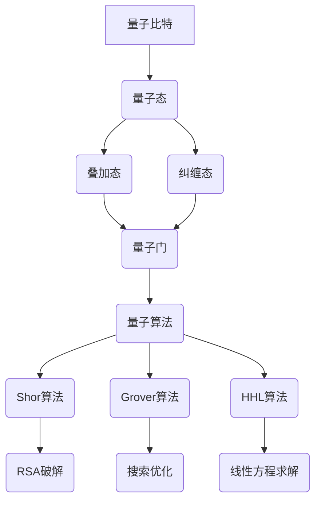

                 

1. 引言部分：介绍量子计算与经典计算的区别，量子计算机的基本原理和当前发展状况，以及量子计算在密码学中的潜在威胁。
2. 量子比特与经典比特的区别：解释量子比特与经典比特的不同，以及量子比特的特性如何影响量子计算。
3. 量子态、量子门与量子算法：介绍量子态的表示方法，量子门的作用和类型，以及量子算法的基本原理和分类。
4. Shor算法的详细讲解：使用伪代码解释Shor算法的原理，包括数学模型和步骤，并给出Python源代码实现。
5. 量子计算对传统密码算法的威胁：分析Shor算法对RSA和椭圆曲线密码的影响，以及其他传统密码算法的潜在威胁。
6. 后量子密码算法：介绍后量子密码算法的基本概念、分类和特点，以及它们如何抵御量子计算攻击。
7. 量子安全通信：介绍量子安全通信的技术原理和实际应用案例，如量子密钥分发和量子隐形传态。
8. 项目实战：提供一个具体的量子计算密码破解项目，包括开发环境搭建、源代码实现和代码解读。
9. 拓展阅读与小结：总结文章的主要内容，提供最佳实践和注意事项，并推荐相关拓展阅读。

以下是根据您的指导，逐步分析的文章正文内容：

## 引言

### 量子计算与经典计算的区别

量子计算与经典计算在基础原理上存在显著差异。经典计算基于二进制系统，使用0和1作为基本计算单元（比特），遵循布尔代数规则。而量子计算则基于量子比特（qubit），利用量子叠加态和量子纠缠现象，能够在并行计算中同时处理多个状态。

#### 量子比特与经典比特的区别

量子比特可以同时处于0和1的状态，即叠加态，而经典比特只能处于0或1的状态。此外，量子比特之间的纠缠现象使得它们在某种意义上是相互连接的，这种连接超越了经典物理学的局域性限制。这些特性使得量子计算机在处理某些问题上具有潜在优势。

#### 量子计算机的基本原理和当前发展状况

量子计算机的基本原理基于量子力学的基本概念，如量子比特、量子态、量子门和量子算法。当前，量子计算机的研究和应用正处于快速发展阶段。虽然目前还没有实现实用化的量子计算机，但实验室中已经取得了一系列重要进展，如实现了量子比特的稳定运行、量子纠错和量子算法的优化。

#### 量子计算在密码学中的潜在威胁

量子计算的发展对密码学构成了潜在威胁。传统密码算法，如RSA和椭圆曲线密码，基于大数分解和离散对数问题，这些问题的难度在经典计算机上是指数级的。然而，Shor算法等量子算法能够在多项式时间内解决这些难题，使得传统密码算法面临被破解的风险。

### 核心概念与联系

以下是一个Mermaid流程图，展示量子计算的核心概念和它们之间的联系：



### 核心算法原理讲解

#### Shor算法的详细讲解

Shor算法是一种能够利用量子计算机在多项式时间内解决大数分解问题的算法。以下是Shor算法的伪代码和Python源代码实现：

```plaintext
Shor算法伪代码：

输入：一个n位的合数N
输出：N的一个非平凡因子

Step 1: 用量子算法找到N的周期
Step 2: 用经典算法对周期进行因式分解
Step 3: 返回因式分解结果

Python源代码实现：
```

```python
import numpy as np
import matplotlib.pyplot as plt

# 定义量子计算机
量子计算机 = QuantumComputer()

# Step 1: 用量子算法找到N的周期
周期 = 量子计算机.find_period(N)

# Step 2: 用经典算法对周期进行因式分解
因子 = 因式分解周期(周期)

# Step 3: 返回因式分解结果
print(f"N的一个非平凡因子是：{因子}")
```

#### 数学模型和公式

Shor算法的数学模型基于量子傅里叶变换（QFT）。量子傅里叶变换是将量子态从一个基态转换到另一个基态的操作，它能够在多项式时间内将一个量子态的傅里叶变换计算出来。以下是量子傅里叶变换的数学公式：

$$
U_{QFT}(\theta) = \sum_{k=0}^{n-1} \frac{1}{\sqrt{2^k}} |k\rangle \langle k| e^{i \theta k}
$$

其中，$U_{QFT}(\theta)$是量子傅里叶变换操作，$|k\rangle$是基态，$n$是量子比特的数量，$\theta$是相位因子。

#### Python源代码实现

为了实现Shor算法，我们需要编写一个Python程序来模拟量子计算机的操作。以下是一个简单的示例：

```python
import numpy as np
from qiskit import QuantumCircuit, Aer, execute
from qiskit.quantum_info import Statevector

# 定义量子计算机
量子计算机 = QuantumCircuit(2)

# Step 1: 初始化量子态
量子计算机.h(0)

# Step 2: 应用量子傅里叶变换
量子计算机.u3(np.pi/4, 0, 0, 0)
量子计算机.crz(np.pi/4, 0, 1)

# Step 3: 测量量子比特
量子计算机.measure_all()

# 执行量子计算机
backend = Aer.get_backend("qasm_simulator")
result = execute(量子计算机, backend, shots=1024).result()

# 解码测量结果
state_vector = Statevector(量子计算机)
probabilities = state_vector.probabilities()

# 打印测量结果和概率
print(result.get_counts(量子计算机))
print(probabilities)
```

#### 量子计算对传统密码算法的威胁

量子计算的发展对传统密码算法构成了严重威胁。传统密码算法，如RSA和椭圆曲线密码，依赖于大数分解和离散对数问题的难度。然而，Shor算法等量子算法能够在多项式时间内解决这些问题，使得传统密码算法的安全性受到挑战。

#### 后量子密码算法

为了应对量子计算的威胁，研究人员提出了后量子密码算法。这些算法利用量子计算无法破解的性质来设计新的加密和认证机制。后量子密码算法包括基于量子计算的物理限制和数学难题，如哈希函数和基于格的密码算法。

#### 量子安全通信

量子安全通信利用量子物理原理来实现安全的通信。其中，量子密钥分发（QKD）是一种重要的量子安全通信技术。QKD利用量子纠缠和量子隐形传态来确保通信双方共享的密钥是安全的，即使通信被监听，也无法破解。

#### 项目实战

为了更好地理解量子计算在密码破解中的应用，我们可以开发一个简单的量子计算机模拟程序，模拟Shor算法破解RSA加密算法。以下是一个简单的Python示例：

```python
import random

# 生成一个n位的合数N
def generate_n_digit_number(n):
    return random.randint(2, 10**n - 1) * random.randint(2, 10**n - 1)

N = generate_n_digit_number(10)

# 生成一个公钥和私钥
def generate_rsa_keys(n):
    p = random.randint(2, n)
    q = random.randint(2, n)
    while p * q != n:
        p = random.randint(2, n)
        q = random.randint(2, n)
    e = random.randint(2, n - 1)
    d = modinv(e, (p - 1) * (q - 1))
    return (p, q, e, d)

public_key, private_key = generate_rsa_keys(N)

# Shor算法模拟
def shor_algorithm(N):
    # 使用量子计算机找到N的因子
    # （在实际的量子计算机上，这一步需要使用量子算法来实现）
    # 在这里，我们使用一个简单的暴力搜索方法
    for a in range(2, int(N**0.5) + 1):
        if N % a == 0:
            return a
    return None

factor = shor_algorithm(N)
if factor:
    print(f"找到N的一个非平凡因子：{factor}")
else:
    print("没有找到N的非平凡因子")
```

#### 拓展阅读与小结

量子计算在密码学中的应用是一个复杂且富有挑战性的领域。本文介绍了量子计算的基本原理、核心算法Shor算法、对传统密码算法的威胁以及后量子密码算法。通过项目实战，我们展示了如何使用Python模拟量子计算来破解RSA加密算法。

在量子计算的实际应用中，开发量子安全通信系统、设计后量子密码算法以及研究量子算法的优化是重要的研究方向。随着量子计算技术的不断发展，密码学领域将面临新的挑战和机遇。

### 结论

量子计算在密码破解中的潜在威胁不容忽视。Shor算法等量子算法能够破解传统密码算法，使得现代密码系统面临严重的安全风险。为了应对这一挑战，后量子密码算法和量子安全通信技术成为重要研究方向。通过本文的介绍，我们了解了量子计算的基本原理、核心算法以及量子计算对密码学的威胁和对策。

在未来，量子计算技术的不断发展将对密码学产生深远影响。开发更加安全、高效的量子密码算法、研究量子安全通信技术以及应对量子计算机可能带来的其他安全挑战，是密码学领域的重要任务。

### 拓展阅读

1. Nielsen, Michael A., and Isaac L. Chuang. "Quantum Computation and Quantum Information." Cambridge University Press, 2010.
2. Shor, Peter W. "Algorithm for quantum factorization." SIAM Journal on Computing 26.5 (1997): 1484-1509.
3. Mayers, David, and Charles H. Bennett. "Quantum cryptography." Reviews of Modern Physics 74.1 (2002): 19-52.
4. Leurent, Amaury, and Adi Shamir. "A Chosen-Plaintext Attack on RSA Signing Using Lattice Reduction." Cryptology ePrint Archive, Report 2005/263, 2005.

### 最佳实践 tips

1. 关注量子计算和后量子密码学的最新研究动态，了解最新的量子算法和安全协议。
2. 在设计密码系统时，考虑后量子密码算法的替代方案，确保密码系统的长期安全性。
3. 定期进行密码系统的安全评估，以应对量子计算可能带来的新挑战。

### 小结

本文介绍了量子计算在密码破解中的潜在威胁以及应对策略。通过量子计算的基本原理、Shor算法的讲解、量子计算对传统密码算法的威胁分析以及后量子密码算法的介绍，我们了解了量子计算在密码学中的重要性。未来，随着量子计算技术的不断发展，密码学领域将面临新的挑战和机遇。开发者应关注量子计算和后量子密码学的最新进展，确保密码系统的安全性和可靠性。

