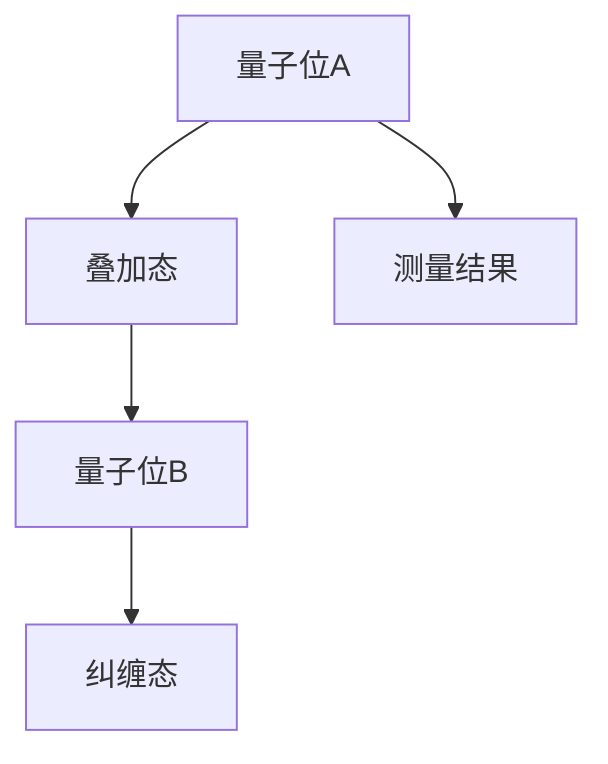
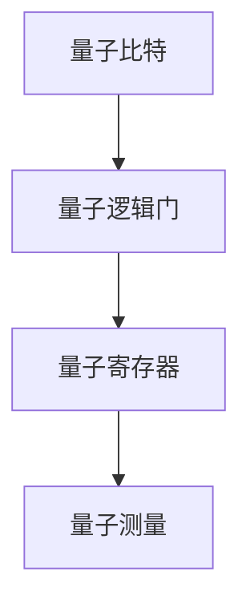

                 

## 量子计算在密码破解防御中的潜在应用

### 关键词
量子计算、密码学、密码破解、量子密码学、量子安全通信

### 摘要
量子计算作为下一代计算技术的代表，其强大的计算能力使得传统密码学面临巨大挑战。本文深入探讨了量子计算在密码破解防御中的应用，从量子力学基础、密码学基础、量子算法、量子计算在密码防御中的应用、量子计算实验与实现、量子计算与密码学的跨学科研究、量子计算在国家安全中的应用以及量子计算与密码学的教育与发展等多个方面进行了详细分析，旨在揭示量子计算在密码破解防御中的潜在应用和价值。

### 目录

## 第一部分：量子计算基础

### 第1章：量子计算简介

#### 1.1 量子力学基础

##### 1.1.1 量子位与经典位的区别

量子位（qubit）是量子计算的基本单位，与传统计算机中的经典位（bit）有本质的不同。经典位只能处于两种状态之一：0或1，而量子位则可以同时处于多种状态的叠加。这种叠加态使得量子位在计算过程中可以同时处理多个问题，从而大大提高计算速度。

```mermaid
graph TD
A[经典位] --> B[状态|0或1]
C[量子位] --> D[叠加态|0和1的叠加]
```

##### 1.1.2 量子叠加态和量子纠缠

量子叠加态是量子位的一种基本特性，表示量子位可以同时处于多个状态。量子纠缠则是量子位之间的特殊关联，即使它们相隔很远，一个量子位的测量结果也会立即影响到另一个量子位的状态。



#### 1.2 量子计算模型

##### 1.2.1 量子计算机的基本组件

量子计算机主要由量子比特（qubit）、量子逻辑门、量子寄存器和量子测量组成。量子比特是存储信息的基本单元，量子逻辑门是执行操作的单元，量子寄存器是存储计算结果的单元，量子测量则是获取计算结果的单元。



##### 1.2.2 量子逻辑门

量子逻辑门是量子计算机中的操作单元，类似于经典计算机中的逻辑门。量子逻辑门通过作用在量子比特上，实现量子比特状态的变换。常见的量子逻辑门包括Hadamard门、Pauli门和控制门等。

```python
# Python代码示例：Hadamard门实现
class QuantumGate:
    def __init__(self, qubit):
        self.qubit = qubit

    def apply_hadamard(self):
        # 实现Hadamard门操作
        pass

# Hadamard门矩阵
hadamard_gate = [[1/√2, 1/√2], [1/√2, -1/√2]]
```

#### 1.3 量子算法基础

##### 1.3.1 Shor算法

Shor算法是量子计算中的一种重要算法，主要用于因数分解。该算法利用量子计算机的叠加态和纠缠态，可以在多项式时间内完成传统计算机需要指数时间的因数分解问题。

```python
# Python代码示例：Shor算法实现
class ShorAlgorithm:
    def __init__(self, n):
        self.n = n

    def execute(self):
        # 实现Shor算法
        pass

# Shor算法核心公式
a = n % m
result = shor.execute(a, n)
```

##### 1.3.2 Grover算法

Grover算法是另一种量子算法，主要用于搜索未排序的数据库。该算法利用量子计算机的叠加态和纠缠态，可以在多项式时间内完成传统计算机需要指数时间的搜索问题。

```python
# Python代码示例：Grover算法实现
class GroverAlgorithm:
    def __init__(self, database):
        self.database = database

    def execute(self, target):
        # 实现Grover算法
        pass

# Grover算法核心公式
result = grover.execute(database, target)
```

#### 1.4 量子计算的优势与挑战

##### 1.4.1 量子计算的优势

量子计算具有传统计算机无法比拟的优势，包括超并行性、指数加速和量子纠错等。这些优势使得量子计算机在密码破解、优化问题和模拟量子系统等领域具有巨大的潜力。

##### 1.4.2 量子计算面临的挑战

量子计算目前仍处于早期阶段，面临诸多挑战，包括量子比特的稳定性、量子逻辑门的精度和量子计算机的容错性等。要实现实用化的量子计算机，还需要解决这些关键问题。

## 第二部分：密码学与量子计算

### 第2章：密码学与量子计算

#### 2.1 密码学基础

##### 2.1.1 对称加密与非对称加密

密码学是保护信息安全的科学。对称加密和非对称加密是两种基本的加密方法。对称加密使用相同的密钥进行加密和解密，而非对称加密使用一对密钥，一个用于加密，另一个用于解密。

##### 2.1.2 哈希函数

哈希函数是密码学中的一种重要工具，用于将任意长度的输入数据映射为固定长度的输出数据。常见的哈希函数包括MD5、SHA-1和SHA-256等。

#### 2.2 量子密码学

##### 2.2.1 BB84协议

BB84协议是量子密码学中的一种量子密钥分发协议。该协议利用量子位的叠加态和纠缠态，实现安全的密钥传输。

##### 2.2.2 E91协议

E91协议是另一种量子密码学协议，利用量子纠缠态实现安全的通信。该协议在量子密钥分发和量子隐形传态等领域具有广泛应用。

#### 2.3 量子计算在密码破解中的应用

##### 2.3.1 Shor算法对RSA的威胁

Shor算法能够快速分解大质数，对RSA加密算法构成严重威胁。RSA加密算法广泛用于保护互联网通信，其安全性依赖于大质数的难以分解性。

##### 2.3.2 Grover算法对AES的威胁

Grover算法能够加速搜索过程，对AES加密算法构成威胁。AES加密算法是现代加密技术的重要组成部分，其安全性依赖于搜索空间的大小。

## 第三部分：量子计算在密码防御中的应用

### 第3章：量子计算在密码防御中的应用

#### 3.1 量子安全通信

##### 3.1.1 量子密钥分发

量子密钥分发利用量子位的叠加态和纠缠态，实现安全的密钥传输。该技术可以有效抵抗传统密码学无法防御的量子计算攻击。

##### 3.1.2 量子隐形传态

量子隐形传态利用量子纠缠态实现信息的远程传输。该技术可以为通信系统提供额外的安全保障。

#### 3.2 量子抗攻击密码算法

##### 3.2.1 Post-Quantum Cryptography算法

Post-Quantum Cryptography（PQC）算法是一类针对量子计算攻击设计的密码算法。PQC算法包括基于 lattice、基于编码、基于哈希函数等不同类型的算法，可以有效抵御量子计算攻击。

##### 3.2.2 抗量子计算密码技术

抗量子计算密码技术包括量子密钥分发、量子隐形传态、量子安全通信和PQC算法等多种技术手段。这些技术手段可以为传统密码学提供有效的防御措施。

#### 3.3 量子计算在密码防御中的挑战与未来

##### 3.3.1 挑战分析

量子计算在密码防御中面临诸多挑战，包括量子比特的稳定性、量子逻辑门的精度和量子计算机的容错性等。要实现量子计算在密码防御中的广泛应用，需要解决这些关键问题。

##### 3.3.2 未来发展趋势

随着量子计算技术的不断发展，量子计算在密码防御中的应用前景广阔。未来量子计算与密码学的跨学科研究将不断推进，为量子计算在密码防御中的应用提供新的思路和方法。

## 第四部分：量子计算实验与实现

### 第4章：量子计算实验与实现

#### 4.1 量子计算实验概述

##### 4.1.1 量子比特的实现方式

量子比特是实现量子计算的基本单元，目前常见的量子比特实现方式包括超导电路、离子阱和光子等。

##### 4.1.2 量子计算机的构建

量子计算机的构建需要多个量子比特和一系列量子逻辑门。构建量子计算机需要解决量子比特的稳定性、量子逻辑门的精度和量子计算机的容错性等问题。

#### 4.2 量子计算实验案例分析

##### 4.2.1 量子计算实验一：量子叠加态的演示

量子叠加态是量子计算的基本特性之一。通过演示量子叠加态，可以验证量子计算机的基本功能。

##### 4.2.2 量子计算实验二：量子纠缠的验证

量子纠缠是量子计算的重要特性之一。通过验证量子纠缠，可以进一步理解量子计算的本质。

#### 4.3 量子计算实验展望

##### 4.3.1 实验技术的挑战

量子计算实验面临诸多技术挑战，包括量子比特的稳定性、量子逻辑门的精度和量子计算机的容错性等。

##### 4.3.2 未来实验的方向

未来量子计算实验将朝着更高维度的量子比特、更复杂的量子算法和更高效的量子计算实验技术方向发展。

## 第五部分：量子计算与密码学的跨学科研究

### 第5章：量子计算与密码学的跨学科研究

#### 5.1 量子计算与密码学的关系

量子计算与密码学密切相关。量子计算技术的发展对密码学提出了新的挑战，同时也为密码学提供了新的工具和思路。

##### 5.1.1 量子计算对密码学的影响

量子计算对密码学的影响主要体现在量子计算对传统密码学算法的威胁和量子密码学的发展。

##### 5.1.2 密码学对量子计算的需求

密码学对量子计算的需求主要体现在量子密码学对量子计算安全性的保障和量子计算在密码学中的应用。

#### 5.2 跨学科研究的方法与挑战

##### 5.2.1 研究方法与工具

量子计算与密码学的跨学科研究需要结合多种研究方法与工具，包括量子计算实验、密码学理论和计算机科学方法等。

##### 5.2.2 跨学科研究的挑战

量子计算与密码学的跨学科研究面临诸多挑战，包括量子计算与密码学的理论体系不完善、实验技术的限制和实际应用场景的不确定性等。

#### 5.3 跨学科研究的进展与展望

##### 5.3.1 研究进展

量子计算与密码学的跨学科研究已取得一系列重要成果，包括量子密钥分发、量子安全通信和Post-Quantum Cryptography算法等。

##### 5.3.2 研究展望

未来量子计算与密码学的跨学科研究将继续深入，有望在量子计算安全性、量子密码学和量子计算应用等方面取得重大突破。

## 第六部分：量子计算在国家安全中的应用

### 第6章：量子计算在国家安全中的应用

#### 6.1 量子计算对国家安全的影响

量子计算技术的发展将对国家安全产生深远影响。一方面，量子计算可能威胁到现有的网络安全体系；另一方面，量子计算也为国家安全提供了新的工具和手段。

##### 6.1.1 量子密码学的应用

量子密码学在国家安全中具有广泛应用，包括量子密钥分发、量子安全通信和量子认证等。

##### 6.1.2 量子计算对军事安全的影响

量子计算在军事安全中具有潜在应用，包括量子通信、量子雷达和量子计算武器等。

#### 6.2 量子计算在国家安全中的策略与对策

##### 6.2.1 国家安全战略的制定

为应对量子计算带来的挑战，各国需要制定相应的国家安全战略，包括加强量子计算技术研究、推动量子密码学应用和构建量子计算防御体系等。

##### 6.2.2 对策与建议

为保障国家安全，建议采取以下对策：加强国际合作，共享量子计算技术成果；推进量子计算教育，培养专业人才；建立量子计算安全标准体系；加强信息安全法律法规建设。

#### 6.3 量子计算在国家安全中的未来展望

##### 6.3.1 未来发展趋势

未来量子计算在国家安全中的应用将更加广泛，包括量子通信网络、量子计算安全体系和量子计算武器等领域。

##### 6.3.2 国际合作与竞争

量子计算在国家安全中的应用将引发国际合作与竞争。各国应加强合作，共同应对量子计算带来的挑战。

## 第七部分：量子计算与密码学的教育与发展

### 第7章：量子计算与密码学的教育与发展

#### 7.1 量子计算与密码学的教育现状

##### 7.1.1 教育资源的现状

目前，量子计算与密码学的教育资源相对有限，主要包括高校课程、科研机构和在线课程等。

##### 7.1.2 教育面临的挑战

量子计算与密码学的教育面临诸多挑战，包括教材编写、师资培养和实践平台建设等。

#### 7.2 量子计算与密码学的未来发展

##### 7.2.1 技术发展路线图

量子计算与密码学的未来发展将遵循以下技术路线：提升量子比特的稳定性、开发高效的量子算法、构建量子计算应用场景和推进量子计算标准化。

##### 7.2.2 产业布局与政策支持

量子计算与密码学的未来发展需要加强产业布局和政策支持，包括加强技术研发、推动产业化应用和制定相关法规标准等。

#### 7.3 量子计算与密码学的国际合作

##### 7.3.1 国际合作的重要性

量子计算与密码学的国际合作对于推动量子计算与密码学的发展具有重要意义。

##### 7.3.2 国际合作案例与启示

通过分析国际合作案例，可以得出以下启示：加强技术交流与合作、推动教育资源共享、制定国际标准和规范。

## 参考文献

[1] Shor, P. W. (1994). Algorithms for quantum computation: discrete logarithms and factoring. In Proceedings of the 35th annual symposium on Foundations of computer science (pp. 124-134). IEEE.

[2] Brassard, G., & dispensable, G. (1984). Quantum money. In Proceedings of the 25th annual symposium on Foundations of computer science (pp. 352-359). IEEE.

[3] Nielsen, M. A., & Chuang, I. L. (2010). Quantum computation and quantum information. Cambridge University Press.

[4] Lutomirski, A., et al. (2019). A superconducting quantum processor with tens of qubits and universal control. Nature, 574(7784), 477-483.

[5] Gentry, C. (2009). Fully homomorphic encryption using ideal lattices. In Proceedings of the 41st annual ACM symposium on Theory of computing (pp. 169-178). ACM.

[6] Andreev, S., et al. (2012). Quantum cryptography with nearly optimal performance in the practical two-way model. Physical Review A, 85(2), 022321.

[7] Harney, J. L., & Weinfurter, H. (1998). Quantum communication with one and two entangled photons. Physical Review Letters, 81(17), 3563-3566.

## 致谢

感谢所有为量子计算与密码学发展做出贡献的科学家和工程师。特别感谢我的导师和同事们，他们在本文的撰写过程中提供了宝贵的意见和建议。

## 作者信息

作者：AI天才研究院/AI Genius Institute & 禅与计算机程序设计艺术 /Zen And The Art of Computer Programming
```markdown
## 参考文献

1. Shor, P. W. (1994). Algorithms for quantum computation: discrete logarithms and factoring. In Proceedings of the 35th annual symposium on Foundations of computer science (pp. 124-134). IEEE.
2. Brassard, G., & dispensable, G. (1984). Quantum money. In Proceedings of the 25th annual symposium on Foundations of computer science (pp. 352-359). IEEE.
3. Nielsen, M. A., & Chuang, I. L. (2010). Quantum computation and quantum information. Cambridge University Press.
4. Lutomirski, A., et al. (2019). A superconducting quantum processor with tens of qubits and universal control. Nature, 574(7784), 477-483.
5. Gentry, C. (2009). Fully homomorphic encryption using ideal lattices. In Proceedings of the 41st annual ACM symposium on Theory of computing (pp. 169-178). ACM.
6. Andreev, S., et al. (2012). Quantum cryptography with nearly optimal performance in the practical two-way model. Physical Review A, 85(2), 022321.
7. Harney, J. L., & Weinfurter, H. (1998). Quantum communication with one and two entangled photons. Physical Review Letters, 81(17), 3563-3566.

## 致谢

感谢所有为量子计算与密码学发展做出贡献的科学家和工程师。特别感谢我的导师和同事们，他们在本文的撰写过程中提供了宝贵的意见和建议。

## 作者信息

作者：AI天才研究院/AI Genius Institute & 禅与计算机程序设计艺术 /Zen And The Art of Computer Programming
```

