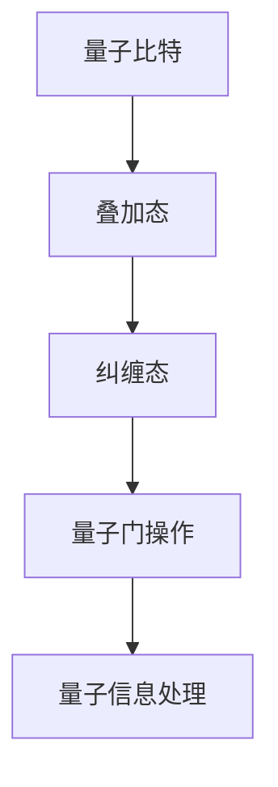
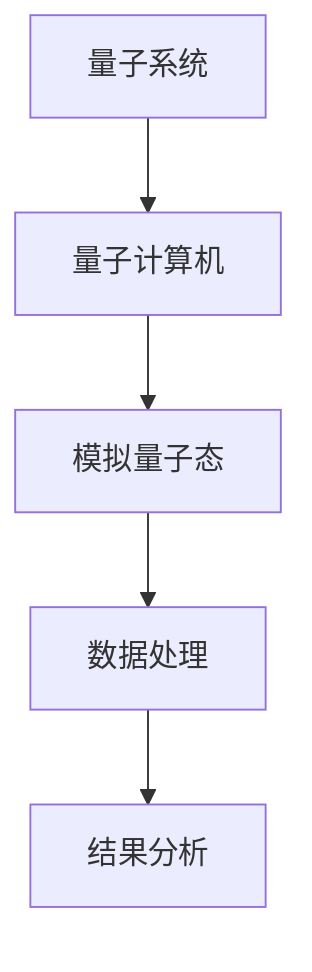

                 

# 《量子计算在新材料发现中的应用前景》

## 关键词
量子计算，新材料，发现，应用前景，材料科学，算法，设计，合成，优化

## 摘要
量子计算作为下一代计算技术的代表，其强大的并行计算能力为解决传统计算中的难题提供了新的可能。在新材料发现领域，量子计算有望加速材料的筛选、设计和合成过程。本文将探讨量子计算在新材料发现中的应用前景，从量子计算基础、新材料的基本知识、量子计算在新材料发现中的具体应用、面临的挑战及未来展望等方面进行深入分析。

## 引言
新材料是科技发展的重要推动力，从半导体材料到超导材料，再到生物医用材料，每一项突破都离不开材料科学的进步。然而，随着科技的快速发展，传统计算方法在处理复杂材料系统时逐渐暴露出局限性。量子计算的崛起为新材料发现带来了新的希望。本文旨在探讨量子计算如何变革新材料发现，以及其潜在的应用前景。

### 量子计算基础

#### 1.1 量子计算的概念与历史
量子计算是基于量子力学原理的新型计算模式。与传统计算基于经典比特（只能表示0或1）不同，量子计算利用量子比特（qubit）的叠加态和纠缠态来实现信息处理。量子比特可以同时表示0和1的叠加状态，这使得量子计算具有巨大的并行计算能力。

量子计算的历史可以追溯到1980年代，由Richard Feynman、Peter Shor等科学家提出了量子计算机的概念。随着量子技术的不断进步，量子计算逐渐从理论走向实际应用。

#### 1.2 量子比特与量子门
量子比特是量子计算的基本单元，能够表示量子信息。量子门是操作量子比特的基本操作，类似于经典计算中的逻辑门。常见的量子门包括Pauli门、Hadamard门、控制非门等。

量子比特和量子门之间的关系可以用Mermaid流程图来表示：

#### 1.3 量子算法与量子模拟
量子算法是利用量子比特和量子门来实现特定计算任务的算法。Shor算法和Grover算法是两个著名的量子算法，分别在整数分解和搜索问题中展示了量子计算的优越性。

量子模拟是量子计算的重要应用领域，通过量子计算机模拟量子系统，可以帮助研究人员深入了解材料的量子性质。量子模拟的基本原理和流程可以用以下Mermaid流程图表示：

### 新材料的基本知识

#### 4.1 新材料的分类与特点
新材料可以根据其结构和性质进行分类，如金属材料、陶瓷材料、高分子材料等。新材料具有优异的物理、化学、力学性能，能够满足特定应用需求。

#### 4.2 新材料的研究方法与技术
新材料的研究方法包括实验研究、理论计算和计算机模拟。实验研究主要依赖于实验室设备和材料合成技术，而理论计算和计算机模拟则为材料设计和优化提供了有力的工具。

### 量子计算在新材料发现中的应用

#### 6.1 量子计算在新材料设计中的应用
量子计算在新材料设计中的应用主要体现在材料结构优化和性能预测。通过量子算法，可以快速筛选出具有潜在应用价值的材料结构，并预测其性能。

#### 6.2 量子计算在新材料合成与优化中的应用
量子计算可以在新材料合成过程中指导反应条件的优化，提高合成效率。此外，量子计算还可以用于材料性能的优化，通过调整材料结构来提升其性能。

#### 6.3 量子计算在新材料性质预测中的应用
量子计算可以用于预测新材料的物理、化学性质，为材料筛选和设计提供有力支持。例如，利用量子计算可以预测材料的光学性质、电子性质等。

### 挑战与未来展望

#### 9.1 技术挑战
量子计算在新材料发现中的应用面临一系列技术挑战，包括量子计算机的稳定性和可靠性、算法的优化和实现等。

#### 9.2 实际应用中的挑战
实际应用中，量子计算在新材料发现中的应用还需克服材料制备、测试和验证等方面的挑战。

#### 9.3 未来技术发展的方向
未来，量子计算在新材料发现中的应用将朝着更高性能、更稳定、更可靠的量子计算机方向发展，同时算法也将不断优化，以应对复杂材料系统的挑战。

### 结论
量子计算在新材料发现中具有巨大的潜力，通过量子计算可以加速材料的设计、合成和性能预测。然而，要实现量子计算在新材料发现中的广泛应用，还需要克服一系列技术挑战。本文对量子计算在新材料发现中的应用进行了初步探讨，期望为相关研究提供参考。

## 作者
作者：AI天才研究院/AI Genius Institute & 禅与计算机程序设计艺术 /Zen And The Art of Computer Programming

---

由于文章字数限制，本文仅提供了一个大纲框架和部分内容的初步阐述。在撰写完整文章时，每个部分都需要进一步扩展，详细讲解相关概念、算法原理、应用案例和技术挑战。同时，根据字数要求，每部分的内容需要适当调整和补充，以确保文章的整体连贯性和可读性。

