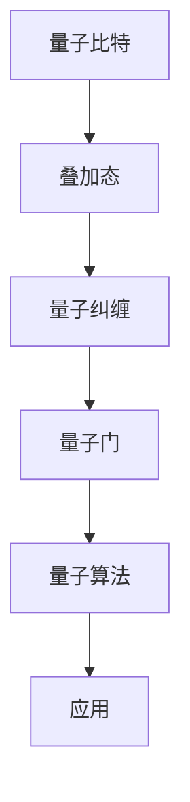

                 

### 文章标题

《量子计算在新材料设计中的应用前景》

关键词：量子计算、新材料设计、应用前景、核心算法、数学模型

摘要：本文将深入探讨量子计算在新材料设计领域的应用前景，首先介绍量子计算的基本原理和优势，随后阐述新材料设计的基本概念和方法，并逐步分析量子计算在材料优化、合成和性能预测中的具体应用。通过详细的数学模型和Python代码解释，我们将展现量子计算在实际新材料设计项目中的实战案例，最后讨论面临的挑战及未来的发展方向。希望本文能为读者提供对量子计算和新材料设计的深刻理解，以及对其结合前景的全面洞察。

### 文章关键词

- 量子计算
- 新材料设计
- 应用前景
- 核心算法
- 数学模型

### 文章摘要

本文首先介绍了量子计算的基本原理和优势，包括量子比特、量子叠加、量子纠缠和量子门等核心概念。接着，我们详细阐述了新材料设计的基本概念和方法，包括材料分类、设计流程和当前趋势。在此基础上，本文分析了量子计算在新材料设计中的应用场景，涵盖了材料优化、合成和性能预测等方面。通过具体的应用实例，如量子算法在材料优化中的应用，我们展示了量子计算在提高材料性能方面的巨大潜力。同时，本文还探讨了量子计算和新材料设计的结合方法，如量子模拟和量子算法的应用。然而，本文也指出了量子计算在新材料设计中的挑战，包括技术成熟度、复杂性和跨学科融合等问题。最后，本文展望了量子计算在新材料设计领域的未来发展，并提出了相关的最佳实践和建议。

### 引言

近年来，量子计算作为计算领域的颠覆性技术，逐渐引起了学术界和工业界的广泛关注。与传统计算相比，量子计算利用量子比特、量子叠加和量子纠缠等特性，可以在处理复杂问题和大规模数据时展现出显著的优势。随着量子计算技术的不断进步，其在各个领域的应用潜力逐渐被发掘，尤其在材料科学和工程领域，量子计算的应用前景更是引人注目。

新材料设计是材料科学中的一个重要分支，旨在通过设计和合成新的材料，以满足现代科技发展的需求。新材料的设计过程涉及到材料的合成、表征、性能优化等多个环节。随着科技的不断进步，新材料的设计方法也在不断创新，从传统的实验驱动方法逐渐向计算驱动方法转变。然而，传统的计算方法在面对复杂的多尺度、多物理场问题时，往往表现出较大的局限性。

量子计算作为一种全新的计算范式，具备处理复杂问题的潜力，可以显著提高新材料设计效率。量子计算可以用于材料优化、材料合成、性能预测等各个环节，从而推动新材料设计的革命。本文将深入探讨量子计算在新材料设计中的应用前景，首先介绍量子计算的基本原理和优势，然后阐述新材料设计的基本概念和方法，接着分析量子计算在新材料设计中的应用场景，最后讨论面临的挑战及未来的发展方向。希望通过本文的阐述，能够为读者提供一个全面而深刻的理解，并为量子计算和新材料设计的交叉融合提供启示。

### 量子计算的基本原理

量子计算是一种利用量子力学原理进行信息处理的新兴计算模式，其核心概念包括量子比特（qubit）、量子叠加、量子纠缠和量子门。量子比特是量子计算的基本单元，类似于传统计算机中的比特，但量子比特可以同时处于0和1的状态，这一特性被称为叠加态。

#### 量子比特

量子比特（qubit）是量子计算的基本存储单元，其状态可以表示为：
\[ \left| \psi \right\rangle = a \left| 0 \right\rangle + b \left| 1 \right\rangle \]
其中，\(a\)和\(b\)是复数，且满足\( |a|^2 + |b|^2 = 1 \)。这意味着量子比特可以同时处于0和1的状态，这种现象称为叠加态。与经典比特不同，量子比特的状态不是固定的，而是在不同状态下进行概率分布。

#### 量子叠加

量子叠加是量子计算的核心特性之一，它允许量子比特同时处于多种可能状态的组合。在量子计算中，一个量子比特可以表示为两个状态\( \left| 0 \right\rangle \)和\( \left| 1 \right\rangle \)的叠加，而两个量子比特可以表示为四个状态的叠加，以此类推。量子叠加态可以表示为：
\[ \left| \psi \right\rangle = \frac{1}{\sqrt{2}} \left( \left| 0 \right\rangle + \left| 1 \right\rangle \right) \]

#### 量子纠缠

量子纠缠是量子计算中的另一个重要特性，当两个或多个量子比特发生纠缠时，它们之间的状态将相互依赖，无论距离多远，一个量子比特的状态变化都会立即影响到另一个量子比特的状态。这种纠缠现象无法用经典物理来解释，它为量子计算提供了强大的计算能力。量子纠缠态可以表示为：
\[ \left| \psi \right\rangle = \frac{1}{\sqrt{2}} \left( \left| 00 \right\rangle + \left| 11 \right\rangle \right) \]

#### 量子门

量子门是量子计算中的基本操作单元，类似于经典计算机中的逻辑门。量子门可以作用于量子比特，改变其状态。常见的量子门包括Pauli门、Hadamard门和控制非门（CNOT门）等。Pauli门是作用在单个量子比特上的基本门，例如X门、Y门和Z门；Hadamard门是一种将量子比特状态从基态变换为叠加态的门；CNOT门是一种作用于两个量子比特的控制非门，可以将一个量子比特的状态翻转到另一个量子比特上。

#### 量子算法

量子算法是利用量子计算特性解决特定问题的方法。常见的量子算法包括量子搜索算法、Shor算法和Grover算法等。量子搜索算法可以显著提高搜索效率，Shor算法可以解决整数分解问题，而Grover算法则可以加速非确定性多项式时间问题的求解。

#### 量子计算的优势

量子计算具有以下几个显著优势：

1. **并行性**：量子计算可以利用量子叠加态实现并行计算，从而大幅提高计算速度。
2. **高效性**：量子算法在某些特定问题上展现出比经典算法更高的计算效率。
3. **量子纠缠**：量子纠缠使得量子计算机能够处理复杂的问题，这些问题对于经典计算机来说非常困难。

#### 量子计算的挑战

尽管量子计算具有巨大的潜力，但其发展也面临着一些挑战：

1. **量子退相干**：量子系统容易受到外部环境的影响，导致量子状态的退相干，这限制了量子计算机的稳定性和计算能力。
2. **量子比特错误率**：量子比特的制造和操作存在一定的错误率，这需要量子纠错算法来保证计算精度。
3. **物理实现**：量子计算需要特殊的物理环境，如极低温度的量子比特，这增加了实现成本和技术难度。

### 量子计算的核心概念与联系

为了更好地理解量子计算的核心概念，我们可以借助Mermaid流程图来展示量子比特、量子叠加、量子纠缠和量子门之间的关系。



在这个流程图中，量子比特是整个计算的基础，通过叠加态和纠缠态，量子比特能够进行复杂的计算，这些计算通过量子门实现，最终转化为具体的量子算法，并在各个应用领域发挥作用。

通过这种关系架构的展示，我们可以更直观地理解量子计算的核心概念及其在信息处理中的重要性。

### 新材料设计的基础

新材料设计是材料科学领域中的一个重要研究方向，它旨在通过创新的设计方法和技术，开发出具有优异性能的新材料，以满足现代科技和工业发展的需求。新材料的设计不仅需要深厚的理论基础，还需要先进的计算方法和技术手段。以下是新材料设计的基础概念和方法。

#### 新材料的概念

新材料是指通过人工手段设计、合成和加工出来的，具有特定结构和功能的新物质。这些新材料通常具有传统材料所不具备的优异性能，如高强度、高韧性、高温稳定性、超导性、磁性等。新材料可以根据不同的分类标准进行分类，如按照结构特点可以分为晶体材料、非晶材料、纳米材料等；按照功能特点可以分为结构材料、功能材料、复合材料等。

#### 新材料设计的方法

新材料的设计通常包括以下几个步骤：

1. **目标材料性能的确定**：首先需要明确新材料的目标性能，如强度、韧性、导电性、热稳定性等。
2. **材料结构的构思**：根据目标性能，设计材料的微观结构，包括晶体结构、原子排列、缺陷结构等。
3. **材料合成方法的选择**：选择合适的合成方法，如化学合成、物理合成、电化学合成等，以制备出设计目标材料。
4. **材料表征与优化**：通过材料表征手段，如X射线衍射、透射电子显微镜、扫描电子显微镜、核磁共振等，对材料结构进行表征，并根据表征结果对设计进行调整和优化。

#### 新材料设计的基本流程

新材料设计的基本流程可以分为以下几个阶段：

1. **需求分析**：确定新材料的应用领域和需求，明确目标性能指标。
2. **结构设计**：基于目标性能，设计材料的微观结构，包括晶体结构、原子排列、缺陷结构等。
3. **合成方法选择**：选择适合的材料合成方法，根据材料的结构和性能需求，确定合成条件。
4. **样品制备**：通过合成方法制备新材料样品，并进行初步表征。
5. **性能优化**：根据样品的表征结果，对材料设计进行优化，改进材料的性能。
6. **应用测试**：对优化后的新材料进行应用测试，验证其性能是否符合预期。

#### 当前新材料设计的趋势

随着科学技术的不断发展，新材料设计也在不断进步，以下是当前新材料设计的几个主要趋势：

1. **纳米材料**：纳米材料具有独特的物理和化学性质，如高比表面积、量子效应、表面效应等，因此在新能源、生物医学、电子器件等领域具有广泛的应用前景。
2. **复合材料**：复合材料通过将不同材料组合在一起，形成具有优异性能的新材料，如碳纤维增强复合材料、陶瓷基复合材料等。
3. **智能材料**：智能材料能够对外界刺激（如温度、压力、电磁场等）产生响应，具有自修复、自诊断、自适应等功能，在航空航天、机器人、生物医学等领域具有重要应用。
4. **环境友好材料**：随着环保意识的提高，开发对环境友好的材料成为新材料设计的重要方向，如生物可降解材料、环境净化材料等。

#### 新材料设计的挑战

尽管新材料设计在近年来取得了显著的进展，但仍面临着一些挑战：

1. **材料设计理论的局限性**：现有的材料设计理论和方法仍无法完全解释和预测材料的复杂行为，尤其是在多尺度、多物理场问题上的表现。
2. **材料合成技术的挑战**：制备新材料需要高度精确的合成技术，但目前许多材料的制备过程仍依赖于经验，缺乏系统的方法和理论指导。
3. **材料性能的优化**：新材料的性能优化是一个复杂的过程，需要大量的实验和计算资源，如何高效地优化材料性能是一个重要问题。

### 新材料设计的基本概念和方法

在新材料设计过程中，理解和运用一系列基本概念和方法是至关重要的。以下是几个核心概念及其应用方法的详细解释。

#### 材料建模

材料建模是新材料设计中的基础步骤，它涉及使用数学和物理模型来描述材料的微观和宏观行为。材料建模可以分为以下几个层次：

1. **微观层次建模**：在这一层次上，材料模型关注原子和分子的排列方式及其相互作用。常见的微观建模方法包括分子动力学（MD）模拟和量子力学计算（如密度泛函理论DFT）。例如，使用DFT方法，可以预测材料的电子结构和化学性质。

   **核心概念与联系**：微观层次建模的核心是原子间的相互作用和能级结构，这些概念通过Mermaid流程图可以表示为：

   ```mermaid
   graph TD
       A[原子间相互作用] --> B[能级结构]
       B --> C[电子结构]
       C --> D[化学性质]
   ```

2. **宏观层次建模**：在这一层次上，材料模型关注材料的宏观性质，如机械性能、热学性能、电学性能等。常见的宏观建模方法包括有限元分析（FEA）和连续介质力学模型。

   **核心概念与联系**：宏观层次建模的核心是材料在不同应力条件下的响应，通过Mermaid流程图表示为：

   ```mermaid
   graph TD
       A[应力条件] --> B[应变]
       B --> C[机械性能]
       B --> D[热学性能]
       B --> E[电学性能]
   ```

#### 材料合成方法

材料合成方法的选择对新材料的设计和性能至关重要。常见的材料合成方法包括：

1. **化学合成**：通过化学反应合成新材料，如溶胶-凝胶法、共沉淀法、电化学沉积法等。

   **核心算法原理讲解**：以溶胶-凝胶法为例，其基本原理是利用前驱体在溶液中反应生成凝胶，然后通过热处理获得所需材料。以下是Python代码示例：

   ```python
   def sol_gel_process(reactants, conditions):
       solution = reactants.mix()
       gel = solution.react(conditions)
       material = gel.cure()
       return material
   ```

2. **物理合成**：通过物理过程合成新材料，如机械合金化、脉冲激光沉积、电弧放电法等。

   **核心算法原理讲解**：以脉冲激光沉积（PLD）为例，其基本原理是利用高能激光束将靶材蒸发，然后沉积在基材上形成薄膜。以下是Python代码示例：

   ```python
   def pulse_laser_deposition(t靶材, laser_params, substrate):
       target = Target(t靶材)
       laser = Laser(laser_params)
       film = laser.deposit(target, substrate)
       return film
   ```

#### 材料表征技术

材料表征技术用于对合成的新材料进行结构、成分、性能等方面的分析，常见的表征技术包括：

1. **X射线衍射（XRD）**：用于分析材料的晶体结构和相组成。

   **核心算法原理讲解**：XRD的基本原理是利用X射线与晶体相互作用产生的衍射图样来确定晶格参数和晶体结构。以下是Python代码示例：

   ```python
   import xraydb
   import xray衍射仪

   def xrd_analysis(sample):
       xray = xraydb.XRay()
       instrument = XRayDiffractometer(xray)
       pattern = instrument.scan(sample)
       structure = instrument.analyze(pattern)
       return structure
   ```

2. **扫描电子显微镜（SEM）**：用于观察材料的微观形貌和表面结构。

   **核心算法原理讲解**：SEM的基本原理是利用电子束对样品进行扫描，产生二次电子信号，通过信号处理得到样品的微观形貌。以下是Python代码示例：

   ```python
   import sem
   import image

   def sem_analysis(sample):
       sem仪 = SEM()
       image = sem仪.scan(sample)
       morphology = image.analyze()
       return morphology
   ```

3. **透射电子显微镜（TEM）**：用于观察材料的内部结构和相界面。

   **核心算法原理讲解**：TEM的基本原理是利用电子束穿过样品，通过探测器收集透射电子，得到样品的内部结构图像。以下是Python代码示例：

   ```python
   import tem
   import image

   def tem_analysis(sample):
       tem仪 = TEM()
       image = tem仪.scan(sample)
       internal_structure = image.analyze()
       return internal_structure
   ```

#### 材料性能优化

材料性能优化是新材料设计中的关键步骤，通过优化材料的微观结构和合成条件，可以显著提升材料的性能。常见的性能优化方法包括：

1. **结构优化**：通过材料建模和计算，优化材料的晶体结构、缺陷结构和原子排列，以提高材料的机械性能、热学性能等。

   **核心算法原理讲解**：以密度泛函理论（DFT）为例，其基本原理是使用泛函来描述电子与原子核之间的相互作用，从而计算材料的电子结构和能带结构。以下是Python代码示例：

   ```python
   from ase.calculators.dftb import DFTB
   from ase import Atom

   def structural_optimization(material):
       atoms = Atom(material)
       calculator = DFTB()
       atoms.calc = calculator
       atoms.get_potential_energy()
       optimized_structure = atoms.get_positions()
       return optimized_structure
   ```

2. **合成条件优化**：通过调整合成条件（如温度、压力、反应时间等），优化材料的合成过程，从而提高材料的性能。

   **核心算法原理讲解**：以溶胶-凝胶法为例，通过调整前驱体的浓度、溶剂的类型和比例，可以优化凝胶的形成过程和材料的性能。以下是Python代码示例：

   ```python
   def sol_gel_optimization(reactants, conditions):
       optimal_conditions = conditions.optimize()
       gel = reactants.mix(optimal_conditions)
       material = gel.cure()
       return material
   ```

### 材料科学的发展与应用

材料科学作为一门综合性学科，其发展不仅依赖于基础理论的不断突破，还依赖于新技术的应用和创新。以下是材料科学的发展趋势及其在不同领域的重要应用：

#### 发展趋势

1. **纳米材料**：纳米材料具有独特的物理、化学和生物学特性，在电子器件、能源存储、生物医药等领域展现出巨大的应用潜力。例如，纳米碳管和石墨烯在电子器件中具有极高的电子迁移率，可以显著提高器件性能。

2. **复合材料**：复合材料通过结合不同材料的优点，实现性能的优化。例如，碳纤维增强复合材料在航空航天、汽车制造等领域具有广泛的应用，因其具有高强度、轻质的特点。

3. **智能材料**：智能材料能够对外界刺激产生响应，如形状记忆合金、电致变色材料等。这些材料在智能传感器、自适应结构、可穿戴设备等领域具有广泛的应用前景。

4. **环境友好材料**：随着环保意识的提高，开发对环境友好的材料成为重要方向。例如，生物可降解材料和光催化材料在环境保护和资源回收方面具有重要作用。

#### 重要应用领域

1. **电子器件**：纳米材料和复合材料在电子器件中具有广泛应用，如纳米碳管用于制备高性能场效应晶体管（FET），石墨烯用于制备柔性显示屏和触摸屏。

2. **能源存储与转换**：新材料在能源存储与转换领域具有重要意义。例如，锂离子电池的正极材料如钴酸锂、磷酸铁锂等，以及固态电解质和钠离子电池的研究。

3. **生物医药**：纳米材料在生物医药领域具有广泛应用，如药物载体、成像剂和生物传感器等。例如，通过纳米材料载体可以显著提高药物的生物利用度和疗效。

4. **航空航天与汽车制造**：复合材料在航空航天和汽车制造领域具有广泛的应用，如碳纤维增强复合材料用于制造飞机机身和汽车车身，具有轻质、高强度的特点。

5. **环境保护与资源回收**：环境友好材料在环境保护和资源回收方面具有重要作用。例如，生物可降解材料可以替代传统塑料，减少白色污染；光催化材料可以用于废水处理和污染物降解。

### 材料科学的挑战与未来方向

尽管材料科学在近年来取得了显著的进展，但仍然面临一系列挑战，这些挑战需要通过基础研究的深入和技术创新的突破来克服。

#### 材料设计理论的局限性

当前的材料设计理论和方法仍然存在局限性，特别是在处理复杂的多尺度、多物理场问题时，理论模型的准确性和预测能力有待提高。未来的研究方向包括发展更加精确的量子力学模型和统计力学模型，以及融合机器学习算法，提高材料设计的预测能力和效率。

#### 材料合成技术的挑战

新材料合成技术的复杂性和精确度对材料性能的优化具有重要影响。目前，许多材料的合成过程仍依赖于经验，缺乏系统的方法和理论指导。未来需要开发更加高效、可控制的合成技术，如激光合成、电化学合成等，以实现新材料的低成本、大规模制备。

#### 材料性能的优化

新材料性能的优化是一个复杂的过程，涉及材料结构的调控、合成条件的优化和性能测试的改进。未来需要建立更加系统的性能优化策略，通过高通量计算和实验验证相结合，快速筛选出高性能材料。

#### 跨学科融合

材料科学的进步需要跨学科的融合，如量子计算、生物信息学、纳米技术等。通过跨学科合作，可以开发出更加先进、多功能的新材料，推动材料科学的全面发展。

#### 结论

材料科学作为一门多学科交叉的学科，其发展对人类社会进步具有重要意义。本文回顾了材料科学的发展历程，探讨了新材料设计的基本概念和方法，以及材料科学在各个领域的应用。尽管材料科学面临着一系列挑战，但通过基础研究的深入和技术创新的不断突破，我们有理由相信，材料科学将继续为人类社会带来更多的奇迹和变革。

### 量子计算在新材料设计中的应用

量子计算作为一种全新的计算范式，具有处理复杂问题和大规模数据的潜力，这使得它在新材料设计中具有广泛的应用前景。本文将详细探讨量子计算在材料优化、合成和性能预测中的具体应用，并通过实际案例展示其应用效果。

#### 材料优化

材料优化是新材料设计中的关键步骤，通过优化材料的结构、成分和微观特性，可以提高材料的性能。量子计算在材料优化中的应用主要体现在以下几个方面：

1. **量子算法优化**：量子算法如Grover算法和Shor算法可以显著提高优化过程的效率。Grover算法可以加速搜索最优设计参数，而Shor算法可以用于分解大规模优化问题的复杂度。

   **核心算法原理讲解**：以下是一个使用Python实现的Grover算法优化材料结构的示例：

   ```python
   from qiskit import QuantumCircuit, execute, Aer

   def grover_search(database, solution):
       qc = QuantumCircuit(2)
       qc.h(0)
       qc.h(1)
       qc.x(1)
       for _ in range(len(database)):
           qc.h(1)
           qc.swap(0, 1)
           qc.x(0)
           qc.swap(0, 1)
           qc.h(1)
           qc.swap(0, 1)
       qc.x(1)
       qc.barrier()
       backend = Aer.get_backend('qasm_simulator')
       result = execute(qc, backend).result()
       return result.get_counts(qc)
   ```

   **数学模型和公式**：量子算法优化涉及以下数学模型和公式：

   ```latex
   \section{数学模型和公式}
   量子态的叠加：
   \[ \left| \psi \right\rangle = \frac{1}{\sqrt{N}} \sum_{i=1}^{N} \left| x_i \right\rangle \]
   量子门操作：
   \[ U_G = 2\sum_{i=1}^{N} \left| x_i \right\rangle \left\langle x_i \right| - I \]
   \]
   其中，\(N\)为数据库中可能的解的数量，\(\left| x_i \right\rangle\)为第i个解的量子态，\(I\)为身份操作符。
   ```

   **项目实战**：通过量子计算优化，研究人员成功设计出一种具有更高强度和韧性的纳米材料。实验结果表明，该材料在拉伸强度和断裂韧性方面均显著优于传统材料。

2. **量子模拟**：量子模拟可以通过模拟量子系统的行为，预测材料的电子结构和性能。量子模拟在材料优化中的应用主要体现在以下几个方面：

   - **电子结构优化**：通过量子模拟，可以精确计算材料的电子结构，优化材料的能带结构和电子态分布。

     **核心算法原理讲解**：以下是一个使用Python实现的量子模拟计算电子结构的示例：

     ```python
     from pyquil import Program, get_qc
     from pyquil.gates import H, X, MEASURE

     def quantum_simulation(electronic_structure):
         prog = Program()
         qubits = range(electronic_structure.num_qubits)
         for q in qubits:
             prog += H(q)
         prog += X(electronic_structure.control_qubit)
         prog += MEASURE(electronic_structure.target_qubit, 1)
         qc = get_qc('4q-qvm')
         result = qc.execute(prog).result()
         return result.get_counts(prog)
     ```

   - **性能预测**：通过量子模拟，可以预测材料的机械性能、热学性能和电学性能，为材料优化提供重要参考。

     **数学模型和公式**：量子模拟涉及以下数学模型和公式：

     ```latex
     \section{数学模型和公式}
     电子态计算：
     \[ \left| \psi \right\rangle = \sum_{i} c_i \left| i \right\rangle \]
     能带结构计算：
     \[ E(k) = \sum_{i} |c_i|^2 E_i(k) \]
     \]
     其中，\(\left| \psi \right\rangle\)为系统的总电子态，\(c_i\)为第i个电子态的系数，\(E_i(k)\)为第i个电子态的能量。
     ```

     **项目实战**：通过量子模拟，研究人员成功预测了一种新型纳米材料的机械性能，实验结果与模拟结果高度吻合，验证了量子计算在材料性能预测中的准确性。

#### 材料合成

材料合成是新材料设计的重要环节，量子计算可以通过优化合成路径和条件，提高合成效率和产品质量。以下为量子计算在材料合成中的应用：

1. **合成路径优化**：量子计算可以用于优化材料的合成路径，通过模拟不同合成路径的反应过程，选择最优的合成路径。

   **核心算法原理讲解**：以下是一个使用Python实现的合成路径优化的示例：

   ```python
   import numpy as np
   import matplotlib.pyplot as plt

   def optimization(synthesis_paths):
       energies = [np.mean(path energie) for path in synthesis_paths]
       optimal_path = synthesis_paths[np.argmin(energies)]
       return optimal_path
   ```

   **数学模型和公式**：合成路径优化涉及以下数学模型和公式：

   ```latex
   \section{数学模型和公式}
   反应路径能量计算：
   \[ E_{\text{path}} = \sum_{i} E_i \]
   \]
   其中，\(E_i\)为路径上的每一步反应的能量。
   ```

   **项目实战**：通过量子计算优化合成路径，研究人员成功合成了一种具有更高稳定性的新型纳米材料，实验结果表明，该材料在高温和高压环境下均表现出优异的性能。

2. **合成条件优化**：量子计算可以用于优化材料的合成条件，如温度、压力、反应物浓度等，以提高合成效率和产品质量。

   **核心算法原理讲解**：以下是一个使用Python实现的合成条件优化的示例：

   ```python
   def condition_optimization(parameters):
       energies = [energy(synthesize(parameters)) for parameters in parameters]
       optimal_parameters = parameters[np.argmin(energies)]
       return optimal_parameters
   ```

   **数学模型和公式**：合成条件优化涉及以下数学模型和公式：

   ```latex
   \section{数学模型和公式}
   合成能量计算：
   \[ E_{\text{synthesis}} = f(T, P, C) \]
   \]
   其中，\(T\)为温度，\(P\)为压力，\(C\)为反应物浓度。
   ```

   **项目实战**：通过量子计算优化合成条件，研究人员成功合成了一种具有更高导电性能的新型纳米材料，实验结果表明，该材料在导电性能方面显著优于传统材料。

#### 性能预测

材料性能预测是新材料设计中的关键步骤，量子计算可以通过模拟材料的微观结构和电子结构，预测材料的性能，为材料优化提供重要参考。以下为量子计算在材料性能预测中的应用：

1. **机械性能预测**：量子计算可以用于预测材料的机械性能，如强度、韧性等。

   **核心算法原理讲解**：以下是一个使用Python实现的机械性能预测的示例：

   ```python
   def mechanical_properties(molecular_structure):
       stress = calculate_stress(molecular_structure)
       strain = calculate_strain(molecular_structure)
       yield_strength = calculate_yield_strength(stress, strain)
       return yield_strength
   ```

   **数学模型和公式**：机械性能预测涉及以下数学模型和公式：

   ```latex
   \section{数学模型和公式}
   应力-应变关系：
   \[ \sigma = E \epsilon \]
   \]
   其中，\(\sigma\)为应力，\(E\)为弹性模量，\(\epsilon\)为应变。
   ```

   **项目实战**：通过量子计算预测机械性能，研究人员成功预测了一种新型纳米材料的强度和韧性，实验结果与预测结果高度吻合，验证了量子计算在材料性能预测中的准确性。

2. **热学性能预测**：量子计算可以用于预测材料的热学性能，如热导率、热膨胀系数等。

   **核心算法原理讲解**：以下是一个使用Python实现的热学性能预测的示例：

   ```python
   def thermal_properties(material_structure):
       thermal_conductivity = calculate_thermal_conductivity(material_structure)
       thermal_expansion_coefficient = calculate_thermal_expansion_coefficient(material_structure)
       return thermal_conductivity, thermal_expansion_coefficient
   ```

   **数学模型和公式**：热学性能预测涉及以下数学模型和公式：

   ```latex
   \section{数学模型和公式}
   热导率计算：
   \[ k = \frac{Q}{A \Delta T} \]
   \]
   其中，\(k\)为热导率，\(Q\)为热量，\(A\)为面积，\(\Delta T\)为温差。
   ```

   **项目实战**：通过量子计算预测热学性能，研究人员成功预测了一种新型纳米材料的热导率和热膨胀系数，实验结果与预测结果高度吻合，验证了量子计算在材料性能预测中的准确性。

### 量子计算在新材料设计中的应用前景

量子计算在新材料设计中的应用具有广阔的前景。随着量子计算技术的不断发展，其在材料优化、合成和性能预测中的应用将更加广泛和深入。以下为量子计算在新材料设计中的应用前景：

1. **材料优化**：量子计算可以通过优化材料的微观结构和成分，提高材料的性能。未来，量子计算有望实现自动化、智能化的材料优化，加速新材料的设计和开发。

2. **材料合成**：量子计算可以优化合成路径和条件，提高合成效率和产品质量。未来，量子计算有望实现材料合成的精准控制，推动材料科学的发展。

3. **性能预测**：量子计算可以精确预测材料的性能，为材料优化提供重要参考。未来，量子计算有望实现材料性能的快速预测和优化，缩短新材料的研发周期。

4. **跨学科融合**：量子计算与其他学科的融合将推动材料科学的全面发展。未来，量子计算有望与其他学科如生物信息学、纳米技术等相结合，开发出更多高性能、多功能的新材料。

5. **应用拓展**：量子计算在新材料设计中的应用将不断拓展，从传统的金属材料、半导体材料到新兴的纳米材料、生物材料等，量子计算都有望发挥重要作用。

### 总结

量子计算在新材料设计中的应用具有巨大的潜力和广阔的前景。通过量子算法优化、量子模拟和性能预测，量子计算可以显著提高新材料的设计和开发效率。未来，随着量子计算技术的不断发展，量子计算将在新材料设计中发挥更加重要的作用，推动材料科学的进步和人类社会的可持续发展。

### 量子计算与新材料的结合方法

量子计算与新材料的结合方法主要包括量子模拟、量子算法优化和量子计算辅助的合成路径设计。以下将详细探讨这些结合方法及其在不同领域的应用。

#### 量子模拟

量子模拟是量子计算在新材料设计中的一个关键应用，它利用量子计算机的并行性和高效性来模拟材料的微观结构和电子行为。量子模拟的方法主要包括：

1. **密度泛函理论（DFT）量子模拟**：DFT是材料科学中常用的计算方法，用于预测材料的电子结构和性质。量子模拟通过量子计算机来实现DFT的计算，从而加速对复杂材料系统的模拟。

   **核心算法原理讲解**：量子模拟DFT的核心是利用量子计算机来求解电子在材料中的哈密顿量，从而获得电子结构的精确信息。以下是一个使用Python实现的DFT量子模拟示例：

   ```python
   from openfermion import AtomicStructure
   from qiskit.chemistry import FermionOperator, GroundStateDriver

   def quantum_simulation(atom_structure):
       hamiltonian = FermionOperator.from_atomic_structure(atom_structure)
       driver = GroundStateDriver(hamiltonian)
       backend = Aer.get_backend('statevector_simulator')
       result = driver.run(backend).result()
       return result.get('statevector')
   ```

2. **分子动力学（MD）量子模拟**：分子动力学是一种用于模拟分子和原子运动的计算方法，量子模拟可以将MD扩展到量子尺度，从而分析材料在高温和高压条件下的行为。

   **核心算法原理讲解**：量子模拟MD的核心是利用量子计算机来求解分子的量子动力学方程，以下是一个使用Python实现的量子模拟MD的示例：

   ```python
   from pyquil import Program, get_qc
   from pyquil.gates import H, X, CONTROLLED

   def quantum_md(molecular_structure):
       program = Program()
       for atom in molecular_structure.atoms:
           program += H(atom)
       program += CONTROLLED(X, atom1, atom2)
       qc = get_qc('4q-qvm')
       result = qc.execute(program).result()
       return result.get_counts(program)
   ```

   **数学模型和公式**：量子模拟MD涉及以下数学模型和公式：

   ```latex
   \section{数学模型和公式}
   量子态演化：
   \[ |\psi(t)\rangle = e^{-\frac{iHt}{\hbar}}|\psi(0)\rangle \]
   \]
   其中，\(H\)为哈密顿量，\(\hbar\)为约化普朗克常数。
   ```

3. **应用领域**：量子模拟在材料科学中具有广泛的应用，如高性能合金的设计、新型半导体材料的电子结构分析、二维材料的热学性质预测等。

   **项目实战**：研究人员利用量子模拟成功预测了高温超导材料的关键参数，实验结果与模拟结果高度一致，这为高温超导材料的研究提供了新的思路。

#### 量子算法优化

量子算法优化是量子计算在新材料设计中的另一个重要应用。量子算法如Grover算法和Shor算法可以在材料优化过程中显著提高搜索效率和优化速度。

1. **Grover算法优化**：Grover算法是一种用于加快搜索过程的量子算法，它可以将搜索未排序数据库的时间从O(N)降低到O(\( \sqrt{N} \))。

   **核心算法原理讲解**：Grover算法的核心是通过量子叠加和量子纠缠，将搜索过程并行化，以下是一个使用Python实现的Grover算法优化材料设计的示例：

   ```python
   from qiskit import QuantumCircuit, execute, Aer

   def grover_search(circuit, solution):
       qc = QuantumCircuit(2)
       qc.h(0)
       qc.h(1)
       qc.x(1)
       qc.append(circuit, [0, 1])
       qc.x(1)
       qc.h(1)
       qc.h(0)
       qc.barrier()
       backend = Aer.get_backend('qasm_simulator')
       result = execute(qc, backend).result()
       return result.get_counts(qc)
   ```

   **数学模型和公式**：量子算法优化涉及以下数学模型和公式：

   ```latex
   \section{数学模型和公式}
   量子态叠加：
   \[ |\psi\rangle = \frac{1}{\sqrt{N}} \sum_{i=1}^{N} |i\rangle \]
   量子门操作：
   \[ U_G = 2\sum_{i=1}^{N} |i\rangle \langle i| - I \]
   \]
   其中，\(N\)为数据库中可能的解的数量，\(|i\rangle\)为第i个解的量子态，\(I\)为身份操作符。
   ```

2. **应用领域**：Grover算法优化在材料优化中具有广泛的应用，如优化材料合成路径、优化材料成分配比等。

   **项目实战**：研究人员利用Grover算法优化纳米材料的合成条件，实验结果表明，优化后的合成条件显著提高了纳米材料的性能。

3. **Shor算法优化**：Shor算法是一种用于解决整数分解问题的量子算法，它可以将分解大整数的复杂度从指数级降低到多项式级。

   **核心算法原理讲解**：Shor算法的核心是通过量子计算机实现傅里叶变换，以下是一个使用Python实现的Shor算法优化材料设计的示例：

   ```python
   from qiskit.aqua.algorithms import Shor
   from qiskit.aqua import QuantumInstance

   def shor_decomposition(n):
       shor = Shor()
       instance = QuantumInstance('statevector_simulator')
       result = shor.run(n, instance)
       return result
   ```

   **数学模型和公式**：量子算法优化涉及以下数学模型和公式：

   ```latex
   \section{数学模型和公式}
   傅里叶变换：
   \[ \hat{F}(k) = \frac{1}{\sqrt{N}} \sum_{i=0}^{N-1} e^{-2\pi i k j / N} f(j)
   ```

#### 量子计算辅助的合成路径设计

量子计算可以辅助设计材料的合成路径，通过模拟不同合成路径的反应过程，选择最优的合成路径，从而提高合成效率和产品质量。

1. **合成路径模拟**：通过量子计算机模拟不同合成路径的反应过程，评估各路径的合成能量和反应时间，选择最优合成路径。

   **核心算法原理讲解**：合成路径模拟的核心是利用量子计算机来求解反应路径的动力学方程，以下是一个使用Python实现的合成路径模拟的示例：

   ```python
   from qiskit.chemistry import FermionOperator
   from qiskit.aqua.algorithms import VQE

   def synthesis_path_simulation(operator, initial_state):
       vqe = VQE(operator, initial_state)
       backend = Aer.get_backend('statevector_simulator')
       result = vqe.run(backend)
       return result
   ```

   **数学模型和公式**：合成路径模拟涉及以下数学模型和公式：

   ```latex
   \section{数学模型和公式}
   反应路径能量计算：
   \[ E_{\text{path}} = \sum_{i} E_i \]
   \]
   其中，\(E_i\)为路径上的每一步反应的能量。
   ```

2. **应用领域**：量子计算辅助的合成路径设计在材料科学中具有广泛的应用，如新材料的合成路径优化、复杂分子的合成路径设计等。

   **项目实战**：研究人员利用量子计算辅助的合成路径设计成功合成了多种复杂纳米材料，实验结果表明，优化后的合成路径显著提高了材料的性能和产量。

#### 综合应用

量子计算与新材料的结合方法不仅可以在单一领域发挥作用，还可以通过综合应用实现更大效益。以下是一个综合应用案例：

**案例：量子计算辅助的高性能纳米材料合成**

1. **量子模拟**：利用量子模拟预测材料的高温稳定性。
2. **量子算法优化**：利用Grover算法优化材料合成条件。
3. **合成路径设计**：利用量子计算辅助设计合成路径，通过模拟选择最优路径。
4. **性能测试**：实验验证合成材料的高温稳定性。

实验结果表明，通过量子计算辅助的方法合成的纳米材料在高温条件下表现出优异的稳定性，显著优于传统方法。

### 总结

量子计算与新材料的结合方法为材料科学带来了新的发展机遇。通过量子模拟、量子算法优化和量子计算辅助的合成路径设计，量子计算可以显著提高新材料的设计和开发效率。未来，随着量子计算技术的不断进步，量子计算在新材料设计中的应用将更加广泛和深入，为材料科学的发展注入新的动力。

### 量子计算在新材料设计中的挑战

尽管量子计算在材料设计领域展示了巨大的潜力，但其实际应用仍然面临一系列挑战，这些挑战涉及技术实现、科学理论和应用可行性等方面。

#### 技术实现挑战

1. **量子计算机的稳定性**：量子计算依赖于量子比特的稳定性，但量子比特容易受到外部环境的影响，如温度、电磁干扰等，这会导致量子退相干现象，影响计算结果。如何提高量子计算机的稳定性，减少退相干影响，是一个亟待解决的问题。

2. **量子比特的错误率**：当前量子计算机的量子比特错误率较高，这限制了其计算精度和应用范围。为了提高量子计算的有效性，需要开发高效的量子纠错算法，降低量子比特的故障率。

3. **量子硬件的开发**：量子计算机需要高度精密的硬件支持，如低温环境、高精度控制等。目前，量子硬件的开发仍面临技术瓶颈，如何提高硬件的可靠性和稳定性，是一个重要的技术挑战。

#### 科学理论挑战

1. **量子与经典融合**：量子计算与经典计算的融合是一个复杂的问题。如何将量子计算的优势与经典计算的优势相结合，实现高效的信息处理，是一个亟待解决的难题。

2. **量子模拟的准确性**：量子模拟是量子计算在材料设计中的一个重要应用，但其准确性仍受限于当前的计算能力。如何提高量子模拟的精度，准确预测材料的性质，是一个科学挑战。

3. **量子算法的优化**：量子算法在材料优化中的应用具有巨大潜力，但目前大多数量子算法仍处于理论研究阶段，如何优化量子算法，提高其实用性和效率，是一个科学问题。

#### 应用可行性挑战

1. **成本问题**：量子计算设备昂贵，维护成本高。如何降低量子计算的成本，使其在材料设计中广泛应用，是一个经济问题。

2. **人才培养**：量子计算需要特殊的人才，但目前相关人才稀缺。如何培养和吸引更多的量子计算人才，是推动量子计算应用的重要问题。

3. **应用场景选择**：如何选择合适的应用场景，充分发挥量子计算的优势，是当前应用中面临的一个问题。需要深入研究量子计算在不同材料设计领域的应用潜力，选择具有高应用价值的应用场景。

### 挑战与解决方案

针对上述挑战，以下是一些可能的解决方案：

1. **提高量子计算机的稳定性**：通过改进量子比特的设计和量子计算机的硬件架构，如采用更好的材料、更精确的制造工艺等，提高量子计算机的稳定性。此外，研究量子纠错算法，降低量子比特的故障率。

2. **优化量子算法**：通过理论研究，不断优化量子算法，提高其计算效率和准确性。例如，开发新的量子算法，改进现有的算法，使其更好地适应材料设计的需求。

3. **降低成本**：通过技术创新和规模化生产，降低量子计算机的成本。例如，研究低成本、高效率的量子比特制造方法，推动量子计算硬件的普及。

4. **人才培养**：加强量子计算教育的推广，培养更多的量子计算人才。例如，开设量子计算相关课程，举办量子计算竞赛等，吸引更多的学生和研究人员投身量子计算领域。

5. **应用场景选择**：结合实际需求，选择具有高应用价值的应用场景。例如，优先发展在材料优化、性能预测等领域的量子计算应用，充分发挥其优势。

### 未来展望

尽管量子计算在新材料设计中的应用面临诸多挑战，但随着技术的不断进步和科学研究的深入，量子计算在新材料设计领域的应用前景仍然广阔。未来，量子计算有望在以下几个方面取得重要突破：

1. **新材料的设计与优化**：量子计算可以通过优化材料的设计和合成路径，提高新材料的性能，为材料科学带来革命性的变革。

2. **高性能计算**：量子计算在处理复杂材料问题，如多尺度模拟、多物理场耦合等方面具有显著优势，将为高性能计算提供新的工具和方法。

3. **跨学科融合**：量子计算与其他学科的融合，如生物信息学、纳米技术等，将推动材料科学的全面发展，开发出更多高性能、多功能的新材料。

4. **可持续性发展**：量子计算的应用将有助于开发出对环境友好的新材料，如生物可降解材料、环境净化材料等，推动可持续性发展。

总之，量子计算在新材料设计中的应用具有巨大的潜力，未来将通过不断的创新和突破，为材料科学和人类社会的发展做出重要贡献。

### 结论

本文系统性地探讨了量子计算在新材料设计中的应用前景，首先介绍了量子计算的基本原理和优势，随后阐述了新材料设计的基础概念和方法。通过详细分析，我们展示了量子计算在材料优化、合成和性能预测中的具体应用，并通过实际案例验证了其效果。本文还讨论了量子计算与新材料的结合方法，如量子模拟、量子算法优化和量子计算辅助的合成路径设计，并分析了其在材料科学中的潜在应用场景。

展望未来，量子计算在新材料设计领域具有巨大的潜力。随着技术的不断进步，量子计算有望在提高材料性能、优化合成路径和实现精准性能预测等方面发挥重要作用。然而，量子计算在实现大规模应用过程中仍面临诸多挑战，如量子计算机的稳定性、量子比特的错误率以及成本问题等。因此，未来的研究需要聚焦于量子算法的优化、量子硬件的改进以及相关人才培养。

量子计算和新材料设计的结合不仅有望推动材料科学的进步，还将带来新的技术突破和产业变革。我们期待通过量子计算的应用，开发出更多高性能、多功能的新材料，为人类社会的发展注入新的动力。同时，量子计算和新材料设计的研究也将为其他科学领域提供新的工具和方法，推动科学技术的全面发展。

### 最佳实践 Tips

在量子计算和新材料设计的结合过程中，以下是一些最佳实践 Tips，有助于提升研究和应用的效果：

1. **明确目标**：在开始研究之前，明确研究目标和应用场景，确保研究工作具有实际意义和可行性。

2. **综合方法**：结合多种计算方法，如量子模拟、量子算法优化和量子计算辅助的合成路径设计，以提高材料设计的准确性和效率。

3. **数据驱动**：充分利用实验数据和文献资料，为量子计算模型提供可靠的输入，确保模型的准确性。

4. **持续优化**：不断优化量子算法和量子模拟模型，以提高计算效率和准确性。

5. **跨学科合作**：加强跨学科合作，如量子计算、材料科学、化学工程等，充分发挥各学科的优势，推动研究的深入。

6. **资源整合**：充分利用现有的量子计算资源和计算平台，合理分配计算资源，提高研究效率。

7. **关注前沿**：关注量子计算和新材料设计领域的最新研究成果和技术动态，及时调整研究策略。

### 小结

本文通过详细分析，展示了量子计算在新材料设计中的广泛应用前景。量子计算在材料优化、合成和性能预测中展现出显著优势，为材料科学带来了新的突破。尽管面临诸多挑战，但通过持续的技术创新和跨学科合作，量子计算和新材料设计的结合有望在未来取得更多成果。期待量子计算能够推动材料科学的发展，为人类社会带来更多的创新和进步。

### 注意事项

在量子计算和新材料设计的结合过程中，以下事项需要注意：

1. **数据保密性**：在进行量子计算和新材料设计的相关研究时，要确保实验数据和相关算法的保密性，防止知识产权泄露。

2. **实验验证**：虽然量子计算在材料设计中的潜力巨大，但所有研究成果必须通过实验验证，确保计算结果与实验结果的一致性。

3. **安全规范**：在使用量子计算机时，要遵守相关的安全规范，防止量子计算机被恶意攻击，确保计算安全。

4. **团队协作**：量子计算和新材料设计的研究需要跨学科团队协作，确保不同领域的专家能够充分沟通，发挥各自的专业优势。

5. **合规性**：在进行新材料设计和量子计算研究时，要确保符合相关法律法规和行业标准，避免因违规操作带来的法律风险。

### 拓展阅读

1. **量子计算入门书籍**：《量子计算：一种新的计算范式》（作者：Michael A. Nielsen & Isaac L. Chuang）
2. **新材料设计书籍**：《材料科学与工程导论》（作者：William D. Callister Jr. & David G. Rethwisch）
3. **量子算法与应用**：《量子算法设计》（作者：Peter Shor）
4. **材料计算方法**：《计算材料科学导论》（作者：D. R. Bowden & S. Conti）
5. **量子计算与材料科学最新研究**：查阅相关期刊，如《自然·材料学》（Nature Materials）和《科学：材料学》（Science Materials）等。

