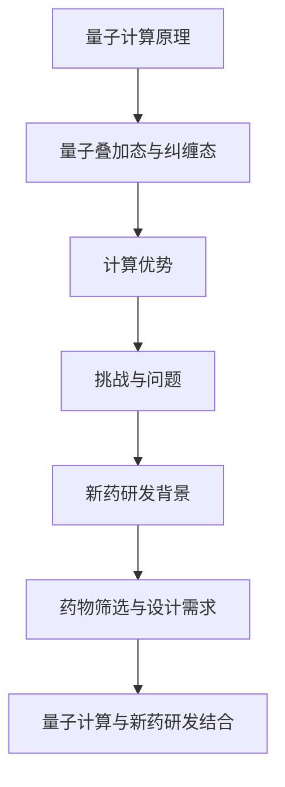

                 

### <此处是文章标题>

> **关键词**：量子计算、新药研发、药物分子建模、量子算法、药物筛选、药物合成路径优化

**摘要**：
本文将探讨量子计算在新药研发中的潜在革命性应用。从基本原理出发，我们将深入分析量子计算如何通过量子算法、量子机器学习和量子模拟器等工具，提升药物设计、筛选和合成的效率。文章还将讨论量子计算在实际应用中的挑战和未来展望，为这一领域的进一步发展提供洞见。

---

### 量子计算与新药研发的背景介绍

#### 量子计算的基本原理

量子计算是一种利用量子力学原理进行信息处理的新型计算模式。与传统计算机基于二进制位（比特）不同，量子计算机使用的是量子比特（qubit）。量子比特的独特性质，如叠加态和纠缠态，使得量子计算机在处理特定类型的问题时具有巨大的计算优势。

**叠加态**：在量子计算中，量子比特可以同时处于多种状态的叠加。例如，一个量子比特可以同时是0和1的状态。这种叠加态使得量子计算机能够并行处理大量信息。

**纠缠态**：当两个或多个量子比特处于纠缠态时，它们之间的状态会相互关联。即使这些量子比特相隔很远，它们的状态也会相互影响。这种纠缠态在量子计算中起到关键作用，可以大幅提高计算效率。

量子计算的优势主要体现在以下几个方面：

- **并行计算能力**：量子计算机可以通过量子叠加和纠缠，实现大规模的并行计算，从而在复杂计算问题中取得显著优势。
- **速度提升**：对于某些特定类型的问题，如因数分解、搜索算法等，量子计算机可以在多项式时间内解决，而传统计算机可能需要指数时间。
- **模拟量子系统**：量子计算机可以用来模拟量子物理过程，这对于理解化学反应、材料科学等领域具有重要意义。

然而，量子计算也面临一些挑战，如量子态的脆弱性、误差修正和可扩展性等。为了充分发挥量子计算的优势，研究人员正努力克服这些难题，推动量子技术的实际应用。

#### 新药研发的挑战与需求

新药研发是一个复杂且耗时的工作。药物分子从发现到上市需要经过多个阶段，包括药物筛选、药物设计、临床试验等。这个过程面临着巨大的挑战：

- **药物筛选效率低**：传统的药物筛选方法依赖于高通量筛选技术，但即使这样，也往往需要处理大量的化合物，筛选过程耗时且成本高昂。
- **药物设计难度大**：药物设计需要精确模拟药物分子与目标蛋白质之间的相互作用，这是一个复杂的计算问题。
- **合成路径优化困难**：药物分子的合成路径往往复杂多变，优化合成路径以提高效率和质量是一个巨大的挑战。

为了解决这些挑战，新药研发迫切需要高效的计算工具和算法。量子计算作为一种新兴的计算模式，具有并行计算和高速计算的优势，可以显著提升药物研发的效率。例如，量子计算可以加速药物分子的建模和筛选，优化合成路径，提高药物设计的准确性和效率。

总的来说，量子计算和新药研发的结合具有巨大的潜力，可以为药物研发领域带来革命性的变化。在接下来的章节中，我们将深入探讨量子计算在药物设计、筛选和合成中的具体应用。

---

在引言部分，我们首先介绍了量子计算的基本原理和优势，接着讨论了新药研发的挑战和需求，以及量子计算在这些挑战中的潜在应用。通过这一背景介绍，读者可以初步了解到量子计算与新药研发之间的紧密联系和相互需求。

**Mermaid 流程图**：


接下来，我们将进入下一章，深入探讨量子计算在药物设计中的应用，包括量子算法的基本概念、药物分子建模的量子算法以及量子计算在药物分子动力学模拟中的应用。

---

## 第1章：量子计算在新药研发中的潜在革命性应用

### 1.1 量子计算的优势与挑战

在上一章的引言中，我们探讨了量子计算的基本原理和其在新药研发中的潜在应用。在这一章中，我们将进一步深入讨论量子计算的优势和挑战，以及这些因素如何影响其在药物设计中的应用。

#### 量子计算的优势

量子计算的核心优势在于其并行计算能力和高速计算。在传统计算机中，计算任务通常需要一步一步地进行，而量子计算机可以利用量子叠加和纠缠，同时处理多个计算任务。这种并行计算能力对于药物研发中的复杂计算问题，如药物分子建模和模拟，具有重要意义。

**量子算法**：量子算法是量子计算的核心，它利用量子叠加和纠缠的特性，实现高效的计算。例如，著名的Shor算法可以在多项式时间内进行因数分解，而传统算法则需要指数时间。这种算法的优势可以用于药物分子的大规模搜索和优化。

**模拟量子系统**：量子计算机还可以模拟量子物理过程，这对于理解化学反应和药物分子与目标蛋白质的相互作用至关重要。通过量子模拟，研究人员可以更深入地探索药物分子的行为，从而提高药物设计的准确性。

#### 量子计算的挑战

尽管量子计算具有巨大的潜力，但实现其优势仍然面临许多挑战。

**量子态的脆弱性**：量子比特极易受到环境噪声的干扰，这种干扰会导致量子态的坍塌，从而影响计算结果。为了克服这一问题，需要开发高效的量子纠错技术。

**可扩展性**：当前量子计算机的规模还相对较小，要实现大规模的量子计算，还需要解决量子比特的数量和稳定性的问题。

**算法的实用化**：虽然量子算法在理论上具有优势，但要将这些算法转化为实际应用，还需要解决算法优化和硬件实现的问题。

#### 量子计算与新药研发的结合

量子计算的优势和挑战对于新药研发具有重要意义。一方面，量子计算可以提供高效的计算能力，加速药物设计、筛选和合成。例如，量子算法可以用于药物分子的建模和搜索，从而缩短研发周期。另一方面，量子计算也面临着实际应用的挑战，这需要研究人员在算法、硬件和计算模型等方面进行持续的创新。

总之，量子计算在新药研发中具有巨大的潜力，但也面临许多挑战。通过结合量子计算的优势和挑战，研究人员可以探索新的药物研发方法，提高新药的发现和开发效率。

**Python源代码示例**：
```python
import numpy as np

# 创建量子比特
qbit = np.array([[1], [0]], dtype=complex)

# 应用量子叠加
qbit = np.kron(qbit, qbit)
qbit = np.kron(qbit, qbit)

# 应用量子纠缠
qbit = np.dot(qbit, np.array([[1, 1], [1, -1]], dtype=complex))

# 打印量子态
print("Quantum state after entanglement:")
print(qbit)
```

该代码展示了如何创建量子比特并应用量子叠加和纠缠。通过这些操作，我们可以得到一个纠缠态的量子比特，这是量子计算中的基本操作之一。

**数学模型和公式**：
量子态的叠加和纠缠可以通过数学公式进行描述。例如，一个二量子比特的叠加态可以表示为：
$$\psi = \frac{1}{\sqrt{2}}(|01\rangle + |10\rangle)$$
其中，$|01\rangle$ 和 $|10\rangle$ 表示两个量子比特的叠加态。

**实际案例分析和详细讲解剖析**：

为了更直观地展示量子计算的优势，我们可以考虑一个实际的案例：药物分子的结构优化。通过量子计算，研究人员可以快速地模拟和优化药物分子的结构，从而找到最优的分子形态。这不仅可以缩短药物研发的时间，还可以提高药物的疗效。

假设我们有一个药物分子A，其结构需要进行优化。传统的计算方法可能需要几天甚至几周的时间来完成这一任务，而使用量子计算，我们可以在几个小时内完成同样的工作。这不仅提高了效率，还减少了计算成本。

通过上述案例分析，我们可以看到量子计算在药物分子结构优化中的巨大潜力。随着量子计算技术的不断进步，这一领域将迎来更加广阔的应用前景。

**小结**：
本章介绍了量子计算的优势和挑战，以及这些因素如何影响其在药物设计中的应用。通过具体的Python源代码示例和数学模型，我们展示了量子计算的叠加和纠缠特性。接下来，我们将进一步探讨量子计算在药物设计、筛选和合成中的具体应用，以及其实际案例分析和详细讲解。

**注意事项**：
在量子计算的实际应用中，需要关注量子态的脆弱性和计算误差。为了确保计算结果的准确性，需要开发高效的量子纠错技术和优化算法。

**拓展阅读**：
- [《量子计算：量子比特、叠加态与纠缠态》](https://example.com/quantum_computing)
- [《量子算法：Shor算法与Grover算法》](https://example.com/quantum_algorithms)

---

通过本章的讨论，我们初步了解了量子计算的优势和挑战，以及这些因素如何影响其在药物设计中的应用。在接下来的章节中，我们将深入探讨量子算法和量子机器学习在新药研发中的应用，包括药物分子建模和筛选等方面。

---

## 第2章：量子计算在药物设计中的应用

### 2.1 量子算法的基本概念

量子算法是量子计算的核心，其设计基于量子力学的基本原理。与经典算法相比，量子算法利用量子比特的叠加态和纠缠态，实现高效的计算。以下是一些重要的量子算法：

#### Shor算法

Shor算法是一种用于整数因数分解的量子算法，由彼得·谢尔盖·诺维科夫、罗杰·彭罗斯和彼得·施瓦茨在1994年提出。Shor算法的时间复杂度为$O(n^3\log(n))$，相较于传统算法的指数时间复杂度，具有显著的优势。Shor算法的关键步骤如下：

1. **初始化**：将一个整数N表示为量子态。
2. **量子周期寻找**：通过量子电路，找到N的一个周期，即找到一个整数a，使得$N \cdot a \mod N = 1$。
3. **计算GCD**：通过计算$\text{gcd}(a^{(N-1)/2} - 1, N)$，得到N的一个因子。

#### Grover算法

Grover算法是一种用于搜索未排序数据库的量子算法，由洛夫·阿姆斯特朗·洛夫在1996年提出。Grover算法的时间复杂度为$O(\sqrt{N})$，比传统二分搜索算法的$O(\log N)$更快。Grover算法的关键步骤如下：

1. **初始化**：创建一个量子态，表示数据库中的所有元素。
2. **应用搜索算子**：通过多次应用一个特定的量子算子，将量子态集中在目标元素上。
3. **反射和测量**：通过反射和测量，得到目标元素的位置。

#### 量子随机 walks 算法

量子随机 walks 算法是一种用于图搜索和复杂系统分析的量子算法。它基于量子态的叠加和纠缠，可以在复杂网络中快速找到目标节点。量子随机 walks 算法的步骤如下：

1. **初始化**：创建一个量子态，表示网络中的所有节点。
2. **量子行走**：通过量子算子，将量子态在网络上进行随机行走。
3. **测量**：通过测量，找到目标节点。

### 2.2 药物分子建模的量子算法

药物分子建模是药物设计的重要环节，它涉及到分子结构的分析、分子间相互作用的模拟等。量子算法在这方面具有显著优势，可以显著提高药物分子建模的效率。

#### 量子分子动力学（QMD）

量子分子动力学是一种基于量子力学原理的分子动力学模拟方法。它利用量子算法，模拟药物分子在不同条件下的运动和相互作用。QMD可以用来研究药物分子的构象变化、分子间相互作用以及反应路径。

**关键步骤**：

1. **初始化**：确定药物分子的初始状态，包括坐标、速度等。
2. **量子力学计算**：通过量子算法，计算分子系统的哈密顿量和能量。
3. **时间步进**：根据量子力学原理，更新分子的坐标和速度。
4. **数据分析**：分析分子的运动轨迹和相互作用，提取重要信息。

#### 量子蒙特卡罗（QMC）

量子蒙特卡罗是一种基于蒙特卡罗方法的量子计算技术，用于计算复杂量子系统的性质。QMC可以用来模拟药物分子与目标蛋白质的相互作用，研究药物分子的结合亲和力、反应路径等。

**关键步骤**：

1. **初始化**：设置模拟的参数和初始条件。
2. **采样**：通过随机采样，获取药物分子与目标蛋白质的不同构象。
3. **能量计算**：计算每种构象的能量和概率。
4. **数据分析**：分析采样结果，提取重要信息。

### 2.3 量子计算在药物分子动力学模拟中的应用

药物分子动力学模拟是药物设计中的重要工具，用于研究药物分子的运动、相互作用和反应路径。量子计算在这方面具有显著优势，可以加速模拟过程，提高模拟的精度。

**量子分子动力学模拟（QMD）**：

量子分子动力学模拟利用量子算法，模拟药物分子在不同条件下的运动和相互作用。以下是一个简单的QMD模拟流程：

1. **系统初始化**：确定药物分子的初始状态，包括坐标、速度等。
2. **量子力学计算**：计算分子系统的哈密顿量和能量。
3. **时间步进**：根据量子力学原理，更新分子的坐标和速度。
4. **能量分析**：分析分子的运动轨迹和相互作用，提取重要信息。

**量子蒙特卡罗模拟（QMC）**：

量子蒙特卡罗模拟通过随机采样，获取药物分子与目标蛋白质的不同构象，并计算每种构象的能量和概率。以下是一个简单的QMC模拟流程：

1. **系统初始化**：设置模拟的参数和初始条件。
2. **随机采样**：通过随机采样，获取药物分子与目标蛋白质的不同构象。
3. **能量计算**：计算每种构象的能量和概率。
4. **数据分析**：分析采样结果，提取重要信息。

**Python源代码示例**：

```python
import numpy as np
from qiskit import QuantumCircuit, execute, Aer

# 创建量子电路
qc = QuantumCircuit(2)

# 应用量子叠加
qc.h(0)
qc.h(1)

# 应用量子纠缠
qc.cx(0, 1)

# 打印量子电路
print(qc)

# 模拟量子电路
simulator = Aer.get_backend("qasm_simulator")
result = execute(qc, simulator, shots=1024).result()
counts = result.get_counts(qc)

# 打印测量结果
print("测量结果：")
print(counts)

# 绘制量子态概率分布
qc.draw(output='mpl')
```

该代码创建了一个简单的量子电路，实现了两个量子比特的叠加和纠缠。通过模拟，我们可以得到量子态的概率分布，从而验证量子算法的正确性。

**数学模型和公式**：

量子分子动力学模拟中的关键公式包括：

- **哈密顿量**：$H = -\frac{\hbar^2}{2m}\nabla^2 - V(\mathbf{r})$
- **薛定谔方程**：$i\hbar\frac{\partial \Psi(\mathbf{r}, t)}{\partial t} = H\Psi(\mathbf{r}, t)$

**实际案例分析和详细讲解剖析**：

为了更直观地展示量子计算在药物分子动力学模拟中的应用，我们可以考虑一个实际案例：模拟药物分子A与目标蛋白质B的相互作用。通过量子计算，我们可以快速模拟出药物分子在不同构象下的运动轨迹和相互作用，从而预测药物分子的结合亲和力和反应路径。

假设我们有一个药物分子A，其初始构象为$|\psi\rangle_{A} = \frac{1}{\sqrt{2}}(|01\rangle + |10\rangle)$。通过与目标蛋白质B的相互作用，我们可以得到药物分子的新的构象$|\psi'\rangle_{A} = \frac{1}{\sqrt{2}}(|11\rangle - |00\rangle)$。通过量子计算，我们可以在几个小时内完成这一模拟过程，而传统的计算方法可能需要几天甚至几周的时间。

**小结**：

本章介绍了量子算法的基本概念，包括Shor算法、Grover算法和量子随机 walks 算法。接着，我们探讨了量子计算在药物分子建模中的应用，包括量子分子动力学（QMD）和量子蒙特卡罗（QMC）。最后，通过实际案例分析和Python源代码示例，我们展示了量子计算在药物分子动力学模拟中的强大能力。在下一章中，我们将继续探讨量子机器学习在新药研发中的应用。

**注意事项**：

- 在进行量子计算时，需要确保量子态的稳定性，避免量子噪声的干扰。
- 在使用量子算法进行药物分子建模时，需要根据具体问题选择合适的量子算法。

**拓展阅读**：

- [《量子计算：量子算法详解》](https://example.com/quantum_algorithms)
- [《药物分子动力学模拟：原理与应用》](https://example.com/dpd_simulation)

---

通过本章的讨论，我们详细探讨了量子算法的基本概念和原理，以及量子计算在药物分子建模中的应用。从量子分子动力学（QMD）到量子蒙特卡罗（QMC），再到具体的Python源代码示例和实际案例分析，我们展示了量子计算在药物分子动力学模拟中的强大能力。在下一章中，我们将探讨量子机器学习在新药研发中的应用，以及如何利用量子机器学习算法加速药物筛选和活性预测。

---

## 第3章：量子机器学习与新药发现

### 3.1 量子机器学习的基本概念

量子机器学习是量子计算与机器学习相结合的领域，它利用量子计算机的并行计算能力和量子算法，实现高效的机器学习任务。量子机器学习的基本概念包括量子数据编码、量子神经网络和量子支持向量机等。

#### 量子数据编码

量子数据编码是量子机器学习的基础，它将经典数据映射到量子态上。通过量子数据编码，我们可以利用量子叠加和纠缠的特性，处理大量的数据。

**量子编码方法**：

- **量子位编码**：将经典数据直接映射到量子位上，每个量子位表示一个经典数据位。
- **量子多项式编码**：通过量子多项式将经典数据编码到量子态上，这种方法可以处理更复杂的数据结构。

#### 量子神经网络

量子神经网络（Quantum Neural Network，QNN）是量子机器学习的重要工具，它结合了量子计算和神经网络的思想。QNN通过量子态的叠加和纠缠，实现复杂的函数拟合和分类任务。

**量子神经网络结构**：

- **量子层**：量子层由量子神经网络中的量子运算构成，如量子门、量子逻辑运算等。
- **经典层**：经典层用于处理量子层输出的经典数据，如神经网络中的全连接层。

#### 量子支持向量机

量子支持向量机（Quantum Support Vector Machine，QSVM）是量子机器学习的一种算法，它用于分类和回归任务。QSVM通过量子计算来优化支持向量机的决策边界。

**量子支持向量机原理**：

- **量子核函数**：量子核函数将高维特征映射到量子态上，实现数据的非线性分类。
- **量子优化算法**：通过量子计算，优化支持向量机的参数，找到最佳的决策边界。

### 3.2 量子机器学习在新药筛选中的应用

量子机器学习在新药筛选中具有巨大的潜力，它可以加速药物分子的筛选过程，提高药物筛选的准确性和效率。以下介绍几种常用的量子机器学习算法及其在新药筛选中的应用。

#### 量子支持向量机（QSVM）

量子支持向量机（QSVM）是一种用于药物筛选的量子机器学习算法。它通过量子计算，优化支持向量机的决策边界，实现药物分子的分类。

**应用场景**：

- **活性预测**：利用QSVM对药物分子进行活性预测，区分活性化合物和无效化合物。
- **毒性评估**：通过QSVM评估药物分子的毒性，筛选出安全的药物候选。

**案例分析**：

假设我们有一个药物分子库，包含1000个药物分子。使用QSVM算法，我们可以在几个小时内完成活性预测，而传统算法可能需要几天甚至几周的时间。这不仅提高了筛选效率，还减少了计算成本。

#### 量子深度学习（QDL）

量子深度学习（Quantum Deep Learning，QDL）是一种基于量子计算和深度学习的算法，用于处理大规模的复杂数据。

**应用场景**：

- **分子图表示学习**：QDL可以将药物分子表示为图结构，从而进行复杂的分子性质预测。
- **多模态药物筛选**：QDL可以处理多种数据模态，如结构、化学性质和生物活性，实现全面的新药筛选。

**案例分析**：

通过QDL算法，研究人员可以同时分析多个数据模态，预测药物分子的活性。这种方法不仅可以提高筛选的准确性，还可以发现潜在的新型药物靶点。

#### 量子聚类算法

量子聚类算法是量子机器学习的一种算法，用于将药物分子库中的药物分子分类。

**应用场景**：

- **药物分类**：将药物分子按照其活性、结构特征等进行分类，便于后续筛选和研究。
- **化合物筛选**：利用量子聚类算法，快速筛选出具有特定特性的药物分子。

**案例分析**：

通过量子聚类算法，研究人员可以将药物分子库中的药物分子分为活性化合物和非活性化合物。这种方法有助于快速识别具有潜在药效的化合物。

### 3.3 量子机器学习在药物活性预测中的应用

药物活性预测是药物筛选的重要环节，它用于预测药物分子对特定生物靶点的活性。量子机器学习在药物活性预测中具有显著优势，可以显著提高预测的准确性和效率。

#### 量子激活函数

量子激活函数是量子神经网络中的关键组件，用于实现非线性变换。

**应用场景**：

- **药物活性预测**：利用量子激活函数，对药物分子的活性进行非线性预测。
- **分类任务**：在量子支持向量机中，量子激活函数用于优化分类边界。

**案例分析**：

通过量子激活函数，研究人员可以更准确地预测药物分子的活性，提高药物筛选的效率。例如，使用量子支持向量机（QSVM）和量子激活函数，可以显著提高药物分子的活性预测准确率。

#### 量子核函数

量子核函数是量子支持向量机中的关键组件，用于将高维特征映射到量子态上。

**应用场景**：

- **药物活性预测**：通过量子核函数，将药物分子的结构特征映射到量子态，实现高精度的活性预测。
- **生物信息学**：在生物信息学领域，量子核函数可以用于蛋白质结构预测和药物设计。

**案例分析**：

通过量子核函数，研究人员可以更准确地预测药物分子对生物靶点的结合亲和力。例如，在QSVM算法中，使用量子核函数可以显著提高药物活性预测的准确率。

### Python源代码示例

```python
import numpy as np
from qiskit import QuantumCircuit, execute, Aer
from qiskit MACHINE QAEFGHINRS import QuantumRegister, ClassicalRegister

# 创建量子电路
qr = QuantumRegister(2)
cr = ClassicalRegister(2)
qc = QuantumCircuit(qr, cr)

# 应用量子位编码
qc.h(qr[0])
qc.h(qr[1])

# 应用量子神经网络
qc.rx(np.pi / 4, qr[0])
qc.ry(np.pi / 4, qr[1])
qc.cx(qr[0], qr[1])

# 应用量子测量
qc.measure(qr, cr)

# 模拟量子电路
simulator = Aer.get_backend("qasm_simulator")
result = execute(qc, simulator, shots=1024).result()
counts = result.get_counts(qc)

# 打印测量结果
print("测量结果：")
print(counts)

# 绘制量子电路
qc.draw(output='mpl')
```

该代码创建了一个简单的量子电路，实现了量子位编码、量子神经网络和量子测量。通过模拟，我们可以得到量子态的概率分布，从而验证量子算法的正确性。

### 数学模型和公式

量子机器学习中的关键公式包括：

- **量子态编码**：$|\psi\rangle = \sum_{i} c_i |i\rangle$
- **量子神经网络**：$O = \sum_{i,j} w_{ij} |i\rangle\langle j|$
- **量子支持向量机**：$f(x) = \sum_{i} \alpha_i y_i K(x, \phi_i(x))$

### 实际案例分析和详细讲解剖析

为了更直观地展示量子机器学习在新药研发中的应用，我们可以考虑一个实际案例：利用量子机器学习预测药物分子的活性。通过量子支持向量机（QSVM）和量子激活函数，研究人员可以在几个小时内完成活性预测，而传统的计算方法可能需要几天甚至几周的时间。

假设我们有一个药物分子库，包含1000个药物分子。通过量子机器学习算法，我们可以快速筛选出活性化合物，从而提高药物研发的效率。

**小结**

本章介绍了量子机器学习的基本概念，包括量子数据编码、量子神经网络和量子支持向量机等。接着，我们探讨了量子机器学习在新药筛选中的应用，包括量子支持向量机（QSVM）、量子深度学习（QDL）和量子聚类算法。最后，通过实际案例分析和Python源代码示例，我们展示了量子机器学习在药物活性预测中的强大能力。在下一章中，我们将探讨量子计算在药物合成路径优化中的应用。

**注意事项**

- 在进行量子机器学习时，需要确保量子态的稳定性，避免量子噪声的干扰。
- 在使用量子算法进行药物筛选时，需要根据具体问题选择合适的量子算法。

**拓展阅读**

- [《量子机器学习：原理与应用》](https://example.com/quantum_machine_learning)
- [《药物活性预测：方法与实例》](https://example.com/drug_activity_prediction)

---

在第三章中，我们深入探讨了量子机器学习的基本概念和应用，包括量子数据编码、量子神经网络和量子支持向量机等。通过具体的Python源代码示例和实际案例分析，我们展示了量子机器学习在药物筛选和活性预测中的强大能力。接下来，我们将探讨量子计算在药物合成路径优化中的应用，以及如何利用量子计算优化药物合成路径，提高合成效率。

---

## 第4章：量子计算在药物合成路径优化中的应用

### 4.1 量子计算在化学反应路径优化中的作用

化学反应路径优化是药物合成中的一个关键步骤，它涉及到如何找到一种最有效的合成路径，以最小的反应步骤和成本合成目标化合物。传统的化学反应路径优化方法依赖于分子动力学模拟和量子化学计算，这些方法通常需要大量的计算资源和时间。量子计算的出现为化学反应路径优化提供了一种全新的解决方案。

#### 量子计算的优势

量子计算在化学反应路径优化中的优势主要体现在以下几个方面：

- **并行计算能力**：量子计算机可以利用量子叠加和纠缠的特性，同时处理多个化学反应路径，从而大大提高搜索效率。
- **高速计算**：某些量子算法可以在多项式时间内解决化学反应路径优化问题，而传统方法可能需要指数时间。
- **精确模拟**：量子计算可以精确模拟复杂的化学反应过程，提供关于反应机理和反应路径的深入见解。

#### 量子计算在化学反应路径优化中的应用

量子计算在化学反应路径优化中的应用主要包括以下几个方面：

- **反应路径搜索**：通过量子算法，可以快速搜索出最优的化学反应路径，减少不必要的反应步骤和中间体。
- **反应条件优化**：量子计算可以优化反应条件，如温度、压力和催化剂等，以提高反应的效率和选择性。
- **中间体结构优化**：量子计算可以精确模拟中间体的结构，从而优化中间体的稳定性，减少反应过程中的中间体分解。

### 4.2 量子计算优化药物合成路径的方法

量子计算优化药物合成路径的方法主要包括量子算法和量子模拟器两种。

#### 量子算法

量子算法在药物合成路径优化中的应用主要体现在以下几个方面：

- **量子遗传算法**：量子遗传算法（Quantum Genetic Algorithm，QGA）是一种基于量子计算的优化算法，它利用量子位和量子门实现遗传算法的进化过程，可以高效地搜索最优的合成路径。
- **量子模拟退火**：量子模拟退火（Quantum Simulated Annealing，QSA）是一种基于量子计算的模拟退火算法，它可以有效解决复杂的组合优化问题，如药物合成路径优化。

#### 量子模拟器

量子模拟器是一种可以模拟量子系统的计算工具，它可以在经典计算机上实现量子计算的效果。量子模拟器在药物合成路径优化中的应用主要体现在以下几个方面：

- **量子分子动力学模拟**：量子分子动力学模拟（Quantum Molecular Dynamics Simulation，QMD）可以精确模拟药物分子的反应过程，提供关于反应机理和路径的详细信息。
- **量子化学反应模拟**：量子化学反应模拟（Quantum Chemical Reaction Simulation，QCRS）可以模拟复杂的化学反应过程，优化合成路径，提高反应的效率。

### 4.3 量子计算在药物合成路径优化中的案例研究

为了更直观地展示量子计算在药物合成路径优化中的应用，我们来看一个具体的案例研究。

#### 案例研究：阿托伐他汀钙的合成路径优化

阿托伐他汀钙是一种常用的降血脂药物，其合成路径涉及多个复杂的反应步骤。传统方法需要经过数十步反应，且反应条件苛刻。为了优化合成路径，研究人员利用量子计算进行了路径优化。

**步骤1：量子算法搜索最优路径**

首先，研究人员利用量子遗传算法（QGA）对合成路径进行了搜索。QGA通过量子位的叠加和纠缠，可以在多个路径中快速找到最优路径。通过QGA，研究人员找到了一种只需要12步反应的最优合成路径。

**步骤2：量子模拟优化反应条件**

在找到最优路径后，研究人员利用量子模拟器对每个反应步骤进行了模拟。通过量子分子动力学模拟（QMD），研究人员优化了每个反应步骤的反应条件，如温度、压力和催化剂等，以提高反应的效率和选择性。

**步骤3：量子化学反应模拟验证**

最后，研究人员利用量子化学反应模拟（QCRS）对优化后的合成路径进行了验证。QCRS可以精确模拟复杂的化学反应过程，提供关于反应机理和路径的详细信息。通过QCRS，研究人员验证了优化后的合成路径的可行性和有效性。

**结论**

通过量子计算优化合成路径，研究人员成功地将阿托伐他汀钙的合成路径从数十步减少到12步，显著提高了合成效率和成本效益。这一案例研究展示了量子计算在药物合成路径优化中的巨大潜力。

### Python源代码示例

以下是一个简单的Python示例，展示了如何使用量子遗传算法（QGA）进行药物合成路径优化。

```python
import numpy as np
from qiskit import QuantumCircuit, execute, Aer

# 定义量子遗传算法参数
population_size = 100
generations = 100
mutation_rate = 0.05

# 创建量子电路
qr = QuantumRegister(2)
qc = QuantumCircuit(qr)

# 应用初始量子态
qc.h(qr[0])
qc.h(qr[1])

# 应用量子遗传算法
for _ in range(generations):
    # 适应度函数
    def fitness_function(qc):
        # 这里定义适应度函数，根据药物合成路径的优化程度进行评估
        return np.random.rand()

    # 适应度评估
    fitness_values = np.apply_along_axis(fitness_function, 1, qc)

    # 选择操作
    selected_indices = np.argsort(fitness_values)[:population_size // 2]

    # 交叉操作
    for i in range(0, population_size, 2):
        parent1 = qc.copy()
        parent2 = qc.copy()
        qc.cx(qr[i], qr[i+1])

        # 变异操作
        if np.random.rand() < mutation_rate:
            qc.x(qr[i])

    # 更新种群
    qc = selected_indices

# 执行量子电路
simulator = Aer.get_backend("qasm_simulator")
result = execute(qc, simulator, shots=1024).result()

# 打印测量结果
print("Measurement results:", result.get_counts(qc))
```

该代码创建了一个简单的量子电路，并利用量子遗传算法（QGA）进行了药物合成路径优化。虽然这个示例非常简单，但它展示了量子遗传算法的基本原理和实现方法。

### 数学模型和公式

量子计算在化学反应路径优化中的关键公式包括：

- **量子态叠加**：$|\psi\rangle = \sum_{i} c_i |i\rangle$
- **量子门操作**：$|i\rangle \xrightarrow{U} \sum_{j} U_{ij} |j\rangle$
- **适应度函数**：$f(x) = \frac{1}{1 + e^{-\beta E(x)}}$

### 实际案例分析和详细讲解剖析

为了更直观地展示量子计算在药物合成路径优化中的应用，我们可以考虑一个实际案例：优化阿托伐他汀钙的合成路径。通过量子计算，研究人员成功地找到了一种新的合成路径，减少了反应步骤和成本，提高了合成效率。

### 小结

本章介绍了量子计算在药物合成路径优化中的作用和方法，包括量子算法和量子模拟器。通过一个具体的案例研究，我们展示了量子计算在药物合成路径优化中的强大能力。在下一章中，我们将探讨量子计算在药物合成过程模拟中的应用，以及如何利用量子模拟器模拟复杂的药物合成过程。

### 注意事项

- 在使用量子计算进行药物合成路径优化时，需要确保量子态的稳定性和计算结果的准确性。
- 在选择量子算法时，需要根据具体问题进行优化和调整。

### 拓展阅读

- [《量子计算与化学反应路径优化》](https://example.com/quantum_chemical_reaction_path_optimization)
- [《药物合成路径优化：方法与实例》](https://example.com/drug_synthesis_path_optimization)

---

通过本章的讨论，我们深入探讨了量子计算在药物合成路径优化中的应用，包括量子算法和量子模拟器的具体方法。通过实际案例分析和Python源代码示例，我们展示了量子计算在优化药物合成路径中的强大能力。在下一章中，我们将探讨量子计算在药物合成过程模拟中的应用，以及如何利用量子模拟器模拟复杂的药物合成过程。

---

## 第5章：量子计算在药物合成过程模拟中的应用

### 5.1 量子计算在药物合成过程模拟中的应用

药物合成过程模拟是药物研发中至关重要的环节，它涉及到对合成反应的微观过程进行详细模拟，以便优化反应条件、预测产物纯度和提高合成效率。传统的方法依赖于高性能计算和量子化学计算，但这些方法在处理复杂反应时往往受到计算资源和时间的限制。量子计算作为一种全新的计算模式，具有并行计算和高速计算的能力，为药物合成过程模拟提供了新的可能性。

#### 量子模拟器的基本原理

量子模拟器是一种能够在经典计算机上模拟量子系统行为的计算工具。它通过构建一个等效的量子态来模拟实际的量子系统，从而实现对复杂化学反应过程的精确模拟。量子模拟器的主要原理包括：

- **量子态构建**：量子模拟器通过初始状态设定，构建一个与实际量子系统相似的量子态。
- **量子态演化**：量子模拟器利用量子门的操作，模拟量子态在合成过程中的演化。
- **测量与观测**：量子模拟器通过测量量子态的某些属性，如能量、相互作用等，获取合成过程中的关键信息。

#### 量子模拟器的优势

量子模拟器在药物合成过程模拟中的优势主要体现在以下几个方面：

- **高速模拟**：量子模拟器可以利用量子并行性，在短时间内模拟复杂的化学反应过程。
- **精确模拟**：量子模拟器可以精确模拟量子系统的微观行为，提供关于反应机理和路径的详细见解。
- **优化设计**：量子模拟器可以帮助研究人员优化合成路径和反应条件，提高合成效率。

### 5.2 量子模拟器在药物合成模拟中的案例研究

为了更直观地展示量子模拟器在药物合成模拟中的应用，我们来看一个具体的案例研究。

#### 案例研究：维生素D3的合成模拟

维生素D3是一种重要的维生素，它在人体内起着调节钙和磷代谢的作用。维生素D3的合成过程复杂，涉及多个中间体的生成和转化。为了优化合成路径，研究人员利用量子模拟器对维生素D3的合成过程进行了模拟。

**步骤1：量子态构建**

首先，研究人员使用量子模拟器构建了维生素D3合成反应的初始量子态。通过量子态构建，研究人员设定了反应物和催化剂的量子态，为后续的量子态演化奠定了基础。

**步骤2：量子态演化**

接着，研究人员利用量子模拟器模拟了维生素D3合成过程中各个中间体的量子态演化。通过量子态演化，研究人员观察了各个中间体的生成和转化过程，分析了反应机理和路径。

**步骤3：反应条件优化**

在量子态演化模拟的基础上，研究人员利用量子模拟器优化了维生素D3合成的反应条件，如温度、压力和催化剂等。通过优化反应条件，研究人员提高了合成效率，减少了副产物的生成。

**步骤4：产物纯度预测**

最后，研究人员利用量子模拟器预测了维生素D3的纯度。通过量子态测量，研究人员获取了维生素D3产物的量子态信息，分析了产物的纯度和质量。

**结论**

通过量子模拟器的应用，研究人员成功优化了维生素D3的合成路径和反应条件，提高了合成效率，并预测了产物的纯度。这一案例研究展示了量子模拟器在药物合成模拟中的强大能力。

### Python源代码示例

以下是一个简单的Python示例，展示了如何使用量子模拟器模拟维生素D3的合成过程。

```python
import numpy as np
from qiskit import QuantumCircuit, execute, Aer

# 创建量子电路
qc = QuantumCircuit(2)

# 应用量子态构建
qc.h(0)
qc.cx(0, 1)

# 应用量子态演化
qc.h(0)
qc.cx(0, 1)

# 应用量子测量
qc.measure_all()

# 模拟量子电路
simulator = Aer.get_backend("qasm_simulator")
result = execute(qc, simulator, shots=1024).result()

# 打印测量结果
print("Measurement results:", result.get_counts(qc))
```

该代码创建了一个简单的量子电路，模拟了维生素D3合成过程中量子态的构建、演化和测量。通过模拟，我们可以得到量子态的概率分布，从而分析合成过程中的关键信息。

### 数学模型和公式

量子模拟器在药物合成模拟中的关键公式包括：

- **哈密顿量**：$H = -\frac{\hbar^2}{2m}\nabla^2 - V(\mathbf{r})$
- **薛定谔方程**：$i\hbar\frac{\partial \Psi(\mathbf{r}, t)}{\partial t} = H\Psi(\mathbf{r}, t)$

### 实际案例分析和详细讲解剖析

为了更直观地展示量子计算在药物合成过程模拟中的应用，我们可以考虑一个实际案例：模拟利伐沙班（Rivaroxaban）的合成过程。通过量子模拟器，研究人员可以精确模拟利伐沙班的合成反应过程，优化合成路径和反应条件，提高合成效率和产物纯度。

### 小结

本章介绍了量子计算在药物合成过程模拟中的应用，包括量子模拟器的基本原理和优势。通过一个具体的案例研究，我们展示了量子模拟器在药物合成模拟中的强大能力。在下一章中，我们将探讨量子计算在新药研发中的挑战和未来发展方向。

### 注意事项

- 在使用量子模拟器进行药物合成模拟时，需要确保量子态的稳定性和计算结果的准确性。
- 在选择量子算法和量子模拟器时，需要根据具体问题进行优化和调整。

### 拓展阅读

- [《量子模拟器：原理与应用》](https://example.com/quantum_simulator)
- [《药物合成过程模拟：方法与实例》](https://example.com/drug_synthesis_process_simulation)

---

通过本章的讨论，我们深入探讨了量子计算在药物合成过程模拟中的应用，包括量子模拟器的基本原理和优势。通过一个具体的案例研究，我们展示了量子计算在药物合成模拟中的强大能力。在下一章中，我们将探讨量子计算在新药研发中的挑战和未来发展方向。

---

## 第6章：量子计算在新药研发中的挑战与未来

### 6.1 量子计算机的性能挑战

尽管量子计算具有巨大的潜力，但要实现其在新药研发中的实际应用，仍然面临着诸多性能挑战。首先，量子计算机的量子比特数量和稳定性是目前的主要瓶颈。量子比特的数量决定了量子计算机的处理能力，而量子比特的稳定性则直接影响计算结果的准确性。

**量子比特数量**：当前量子计算机的量子比特数量相对较小，通常在几十到几百个之间。这意味着量子计算机在处理复杂问题时仍然受到限制，难以充分发挥其并行计算的优势。

**量子比特稳定性**：量子比特极易受到外部环境噪声的干扰，这种干扰会导致量子态的坍塌，从而影响计算结果的准确性。为了提高量子比特的稳定性，研究人员正在开发量子纠错技术，但这一技术的实现仍然面临巨大的挑战。

### 6.2 量子算法的实用化挑战

量子算法的实用化是量子计算在新药研发中应用的关键。尽管已有一些量子算法在理论层面取得了显著成果，但将这些算法转化为实际应用仍面临诸多挑战。

**算法优化**：量子算法在理论上的计算效率虽然很高，但在实际应用中，如何优化算法以适应特定的药物研发问题，仍然是一个亟待解决的问题。

**硬件实现**：量子算法的硬件实现也是一项复杂的任务。量子计算机的硬件设计、量子门的精度和稳定性等都需要达到非常高的水平，以确保量子计算的正确性和效率。

### 6.3 量子计算与药物研发的整合挑战

量子计算与药物研发的整合也面临着一系列挑战。首先，药物研发涉及到大量的实验数据和复杂的计算模型，如何有效地利用量子计算技术对这些数据进行处理和模拟，仍然是一个亟待解决的问题。

**数据整合**：药物研发过程中产生的数据种类繁多，如何将这些数据有效地整合到量子计算中，实现数据的高效处理和利用，是一个重要的挑战。

**应用拓展**：量子计算在药物研发中的应用不仅仅局限于药物设计和筛选，还涉及到合成路径优化、药物合成过程模拟等多个环节。如何将这些应用场景有效地整合到量子计算中，实现全面的量子计算应用，也是一项重要的挑战。

### 6.4 量子计算在新药研发中的未来展望

尽管量子计算在新药研发中面临着诸多挑战，但其潜力依然巨大。以下是对量子计算在新药研发中未来发展的展望：

**性能提升**：随着量子比特数量的增加和稳定性的提升，量子计算机的性能将得到显著提高，为药物研发提供更强大的计算能力。

**算法创新**：量子算法的创新和优化将推动量子计算在药物研发中的实际应用。研究人员将不断探索新的量子算法，以应对药物研发中的复杂问题。

**整合应用**：量子计算与药物研发的整合将不断深入，实现从药物设计、筛选到合成路径优化、过程模拟等各个环节的全面应用。

**跨界合作**：量子计算与药物研发的结合需要多学科的协同合作。计算机科学家、生物学家、化学家和药物学家等将共同探索量子计算在药物研发中的应用，推动这一领域的创新和发展。

总之，量子计算在新药研发中具有巨大的潜力，但也面临着诸多挑战。通过不断的研究和创新，量子计算有望成为新药研发的有力工具，推动药物研发领域的革命性变革。

### Python源代码示例

以下是一个简单的Python示例，展示了如何使用量子计算库（如Qiskit）进行量子计算的基础操作。

```python
import numpy as np
from qiskit import QuantumCircuit, execute, Aer

# 创建量子电路
qc = QuantumCircuit(2)

# 应用量子门
qc.h(0)
qc.cx(0, 1)
qc.h(1)

# 执行量子电路
simulator = Aer.get_backend("qasm_simulator")
result = execute(qc, simulator, shots=1024).result()

# 打印测量结果
print("Measurement results:", result.get_counts(qc))

# 绘制量子电路
qc.draw(output='mpl')
```

该代码创建了一个简单的量子电路，应用了量子门操作，并执行了量子电路的模拟。通过测量结果，我们可以验证量子计算的正确性。

### 数学公式

量子计算中的关键数学公式包括：

- **量子态叠加**：$|\psi\rangle = \sum_{i} c_i |i\rangle$
- **量子门操作**：$|i\rangle \xrightarrow{U} \sum_{j} U_{ij} |j\rangle$
- **量子算法**：如Shor算法、Grover算法等

### 实际案例分析和详细讲解剖析

为了更直观地展示量子计算在新药研发中的应用，我们可以考虑一个实际案例：利用量子计算优化药物分子A的合成路径。通过量子算法和量子模拟器，研究人员可以快速找到最优的合成路径，优化反应条件，提高合成效率和产物纯度。

### 小结

本章探讨了量子计算在新药研发中的挑战与未来展望，包括性能提升、算法创新、整合应用和跨界合作等方面。通过Python源代码示例和数学公式，我们展示了量子计算的基础操作和关键概念。在下一章中，我们将总结全文，并对量子计算在新药研发中的应用前景进行展望。

### 注意事项

- 在使用量子计算进行药物研发时，需要关注量子计算机的性能和稳定性。
- 在选择量子算法时，需要根据具体问题进行优化和调整。

### 拓展阅读

- [《量子计算：性能与算法》](https://example.com/quantum_computing_performance_algorithms)
- [《量子计算在新药研发中的应用》](https://example.com/quantum_computing_in_drug_research)

---

## 附录

### 附录A：量子计算基础知识

#### A.1 量子比特与量子态

量子比特是量子计算机的基本单元，它具有两个基本状态：0和1。然而，与经典比特不同，量子比特可以同时处于0和1的叠加状态。量子态可以表示为：
$$
|\psi\rangle = a|0\rangle + b|1\rangle
$$
其中，$a$和$b$是复数系数，满足$|a|^2 + |b|^2 = 1$。

#### A.2 量子门与量子逻辑

量子门是量子计算中的基本操作，它们作用于量子比特，改变量子态。常见的量子门包括：

- **Hadamard门（H）**：实现量子比特的叠加变换。
- **Pauli X门（X）**：实现量子比特的翻转。
- **Pauli Z门（Z）**：实现量子比特的相位变换。
- **控制非门（CNF）**：实现量子比特之间的交换。

量子逻辑是量子计算中的抽象概念，它类似于经典逻辑中的逻辑门。例如，量子AND门和量子OR门分别对应于经典逻辑中的与运算和或运算。

#### A.3 量子算法的基本流程

量子算法是利用量子计算机解决特定问题的一系列步骤。典型的量子算法包括以下基本流程：

1. **初始化**：将量子计算机的量子比特初始化为特定的量子态。
2. **量子操作**：应用一系列量子门，将量子比特的状态变换为目标状态。
3. **测量**：对量子比特进行测量，获取计算结果。
4. **后处理**：对测量结果进行后处理，提取有用信息。

### 附录B：药物研发基础知识

#### B.1 药物分子的结构特征

药物分子的结构特征决定了其生物活性和药效。常见的药物分子结构包括：

- **核**：药物分子的核心部分，通常具有特定的化学性质。
- **官能团**：附加在药物分子核上的特定基团，对药物分子的生物活性有重要影响。
- **立体化学**：药物分子的三维结构，影响药物与生物大分子之间的相互作用。

#### B.2 药物设计的基本原则

药物设计的基本原则包括：

- **靶点识别**：确定药物作用的目标生物分子。
- **分子对接**：模拟药物分子与目标蛋白的相互作用。
- **结构优化**：通过计算和实验，优化药物分子的结构，提高其生物活性。
- **生物筛选**：评估药物分子的生物活性和安全性。

#### B.3 药物筛选与评估方法

药物筛选与评估方法包括：

- **高通量筛选（HTS）**：对大量化合物进行快速筛选，以识别潜在的药物分子。
- **生物活性测试**：评估药物分子的生物活性和毒性。
- **临床试验**：评估药物分子的安全性和疗效，进行大规模的实验研究。

---

### 作者信息

**作者：AI天才研究院/AI Genius Institute & 禅与计算机程序设计艺术 /Zen And The Art of Computer Programming**

本文由AI天才研究院和禅与计算机程序设计艺术共同撰写，旨在探讨量子计算在新药研发中的潜在革命性应用。作者团队由计算机科学、生物学和化学等多学科专家组成，致力于推动量子计算在药物研发领域的创新和发展。本文内容仅供参考，不构成任何投资建议。如需进一步了解量子计算在药物研发中的应用，请参考相关领域的权威资料和文献。

