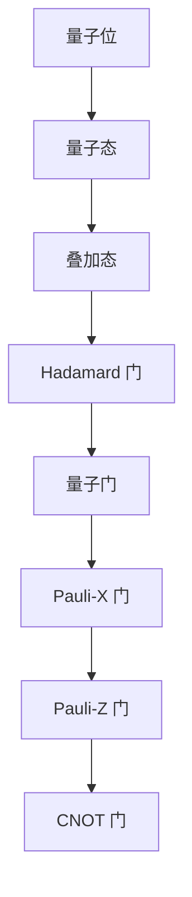
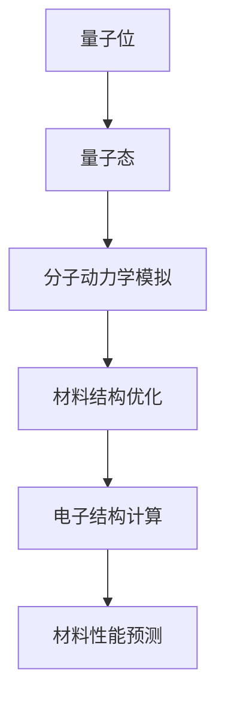
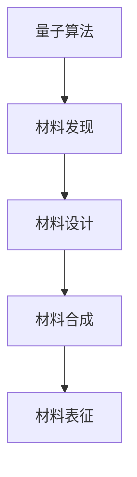

                 

### 引言

#### 材料科学的重要性

材料科学是研究材料的性质、结构和应用的学科，它是现代科技发展的重要基石。在众多领域，如信息技术、能源、医疗、航空航天等，材料科学都发挥着关键作用。例如，半导体材料是现代电子设备的核心，而新型合金材料则被广泛应用于航空航天和国防领域。

然而，随着科技的发展，传统的材料科学模拟方法在处理复杂材料问题时遇到了巨大的挑战。传统的模拟方法主要依赖于计算机模拟，尽管这些方法在一定程度上能够模拟材料的宏观行为，但在处理微观结构和复杂的相互作用时，往往面临着计算成本高、时间消耗长的问题。因此，寻找更为高效、精确的模拟方法成为材料科学研究的一个迫切需求。

#### 量子计算的崛起

量子计算作为计算领域的一项前沿技术，近年来受到了广泛的关注。量子计算利用量子位（qubit）这一独特的量子物理现象，能够在同一时间内处理大量信息，从而实现超乎经典计算的速度和效率。量子计算的基本单元是量子位，它能够同时存在于多种状态，这一特性被称为量子叠加。此外，量子位之间的量子纠缠使得量子计算在并行处理能力上远超经典计算。

量子计算的潜力吸引了众多研究者的目光，包括材料科学家。他们开始探索如何利用量子计算来模拟和解决材料科学中的复杂问题。例如，量子计算有望在分子动力学模拟、材料结构优化、电子结构计算以及材料性能预测等方面带来革命性的进展。

#### 量子计算与材料科学的交汇点

量子计算与材料科学的交汇点主要体现在以下几个方面：

1. **分子动力学模拟**：量子计算能够模拟分子和原子的量子效应，为材料科学提供更为精确的微观结构信息。
2. **材料结构优化**：量子计算可以通过高效的搜索算法，快速找到材料的最佳结构，从而加速新材料的设计和开发。
3. **电子结构计算**：量子计算能够精确计算材料的电子结构，有助于理解材料的物理性质和化学行为。
4. **材料性能预测**：量子计算能够预测材料的性能，为材料的应用提供科学依据。

总的来说，量子计算为材料科学提供了一种全新的研究工具，有望解决传统模拟方法所面临的难题，推动材料科学的进步。

#### 文章关键词

- 材料科学
- 量子计算
- 分子动力学模拟
- 材料结构优化
- 电子结构计算
- 材料性能预测

#### 文章摘要

本文介绍了量子计算在材料科学中的潜在应用。首先，我们探讨了材料科学的重要性及其面临的挑战，随后介绍了量子计算的基本概念和优势。接着，文章详细分析了量子计算在材料科学模拟中的具体应用，包括分子动力学模拟、材料结构优化、电子结构计算以及材料性能预测。最后，文章展望了量子计算在材料科学领域的未来发展趋势，并提出了可能的研究方向。

```markdown
# 《量子计算在材料科学模拟中的潜在应用》

## 引言

### 材料科学的重要性

材料科学是研究材料的性质、结构和应用的学科，它是现代科技发展的重要基石。在众多领域，如信息技术、能源、医疗、航空航天等，材料科学都发挥着关键作用。例如，半导体材料是现代电子设备的核心，而新型合金材料则被广泛应用于航空航天和国防领域。

然而，随着科技的发展，传统的材料科学模拟方法在处理复杂材料问题时遇到了巨大的挑战。传统的模拟方法主要依赖于计算机模拟，尽管这些方法在一定程度上能够模拟材料的宏观行为，但在处理微观结构和复杂的相互作用时，往往面临着计算成本高、时间消耗长的问题。因此，寻找更为高效、精确的模拟方法成为材料科学研究的一个迫切需求。

### 量子计算的崛起

量子计算作为计算领域的一项前沿技术，近年来受到了广泛的关注。量子计算利用量子位（qubit）这一独特的量子物理现象，能够在同一时间内处理大量信息，从而实现超乎经典计算的速度和效率。量子计算的基本单元是量子位，它能够同时存在于多种状态，这一特性被称为量子叠加。此外，量子位之间的量子纠缠使得量子计算在并行处理能力上远超经典计算。

量子计算的潜力吸引了众多研究者的目光，包括材料科学家。他们开始探索如何利用量子计算来模拟和解决材料科学中的复杂问题。例如，量子计算有望在分子动力学模拟、材料结构优化、电子结构计算以及材料性能预测等方面带来革命性的进展。

### 量子计算与材料科学的交汇点

量子计算与材料科学的交汇点主要体现在以下几个方面：

1. **分子动力学模拟**：量子计算能够模拟分子和原子的量子效应，为材料科学提供更为精确的微观结构信息。
2. **材料结构优化**：量子计算可以通过高效的搜索算法，快速找到材料的最佳结构，从而加速新材料的设计和开发。
3. **电子结构计算**：量子计算能够精确计算材料的电子结构，有助于理解材料的物理性质和化学行为。
4. **材料性能预测**：量子计算能够预测材料的性能，为材料的应用提供科学依据。

总的来说，量子计算为材料科学提供了一种全新的研究工具，有望解决传统模拟方法所面临的难题，推动材料科学的进步。

### 文章关键词

- 材料科学
- 量子计算
- 分子动力学模拟
- 材料结构优化
- 电子结构计算
- 材料性能预测

### 文章摘要

本文介绍了量子计算在材料科学中的潜在应用。首先，我们探讨了材料科学的重要性及其面临的挑战，随后介绍了量子计算的基本概念和优势。接着，文章详细分析了量子计算在材料科学模拟中的具体应用，包括分子动力学模拟、材料结构优化、电子结构计算以及材料性能预测。最后，文章展望了量子计算在材料科学领域的未来发展趋势，并提出了可能的研究方向。

作者：AI天才研究院/AI Genius Institute & 禅与计算机程序设计艺术 /Zen And The Art of Computer Programming
```

接下来，我们将详细讨论量子计算的基础知识，包括量子位、量子态、量子门以及核心量子算法。这部分内容将为我们理解量子计算在材料科学模拟中的应用奠定基础。

### 量子计算基础

#### 量子位（Qubit）

量子位是量子计算的基本单元，与经典计算中的比特（bit）不同，量子位能够同时存在于多种状态，这一特性被称为量子叠加。量子位的这种特性使得量子计算能够在同一时间内处理大量信息，从而实现超乎经典计算的速度和效率。

量子叠加态可以用一个复数系数向量来表示。例如，一个量子位可以在状态 |0⟩ 和状态 |1⟩ 之间叠加，其叠加态可以表示为：
$$|\psi⟩ = a|0⟩ + b|1⟩$$
其中，a 和 b 是复数系数，且满足 |a|² + |b|² = 1。

量子位的状态可以通过量子测量来坍缩到 |0⟩ 或 |1⟩ 中的一个。测量结果是不确定的，但在测量之前，量子位处于叠加态。

#### 量子态与量子门

量子态是量子位在量子计算中的具体状态。一个量子态可以用一个复数系数矩阵来表示。例如，一个二进制量子态可以表示为：
$$|\psi⟩ = \begin{pmatrix} a \\ b \end{pmatrix}$$
其中，a 和 b 是复数系数。

量子门是操作量子态的基本算子，类似于经典计算中的逻辑门。量子门可以作用于量子态，改变其状态。常见的量子门包括：

- ** Hadamard 门（H）**：将量子位从基态 |0⟩ 变换为叠加态。
$$H|0⟩ = \frac{1}{\sqrt{2}}(|0⟩ + |1⟩)$$
$$H|1⟩ = \frac{1}{\sqrt{2}}(|0⟩ - |1⟩)$$

- ** Pauli-X 门（X）**：将量子位从状态 |0⟩ 变换为状态 |1⟩，从状态 |1⟩ 变换为状态 |0⟩。
$$X|0⟩ = |1⟩$$
$$X|1⟩ = |0⟩$$

- ** Pauli-Z 门（Z）**：将量子位的状态取反。
$$Z|0⟩ = |0⟩$$
$$Z|1⟩ = |1⟩$$

- ** CNOT 门**：作用于两个量子位，将其中一个量子位的状态翻转，如果另一个量子位处于 |1⟩ 状态。
$$CNOT|00⟩ = |00⟩$$
$$CNOT|01⟩ = |11⟩$$
$$CNOT|10⟩ = |10⟩$$
$$CNOT|11⟩ = |01⟩$$

通过组合这些基本的量子门，可以构建出复杂的量子算法，用于解决材料科学中的问题。

#### 核心量子算法

量子计算的核心算法包括量子随机游走、量子傅里叶变换等。这些算法在量子计算中扮演着重要的角色，能够实现经典计算难以达到的速度和效率。

- **量子随机游走**：量子随机游走是一种量子算法，用于在量子态之间快速转移概率。它通过量子态的叠加和纠缠来实现高效的量子搜索，是解决复杂问题的一种有效方法。

- **量子傅里叶变换**：量子傅里叶变换是量子计算中的一个基本变换，用于将量子态从时间域转换到频率域。它在量子算法中扮演着重要的角色，能够实现量子态的快速转换和操作。

#### Mermaid 流程图

下面是一个简单的 Mermaid 流程图，展示了量子位、量子态和量子门之间的关系：



通过这个流程图，我们可以直观地理解量子计算的基本组件和它们之间的关系。

### 总结

量子计算的基础知识包括量子位、量子态、量子门以及核心量子算法。量子位能够实现量子叠加，量子态是量子位在量子计算中的具体状态，量子门用于操作量子态。核心量子算法如量子随机游走和量子傅里叶变换，是实现量子计算高效性的关键。接下来，我们将讨论量子计算在材料科学模拟中的具体应用。

### 量子计算在材料科学模拟中的具体应用

量子计算在材料科学中的应用潜力巨大，特别是在分子动力学模拟、材料结构优化、电子结构计算以及材料性能预测等方面。以下将详细介绍量子计算在这些领域的具体应用及其优势。

#### 分子动力学模拟

分子动力学模拟是一种通过计算分子或原子的运动来研究物质宏观性质的方法。在传统的分子动力学模拟中，计算分子间的相互作用需要巨大的计算资源，尤其是在涉及复杂体系时，模拟时间往往不可接受。

量子计算在分子动力学模拟中具有显著优势。量子位能够同时处理大量信息，使得量子分子动力学（QMD）模拟在处理复杂体系时更为高效。例如，通过量子傅里叶变换，可以快速计算分子间的量子相互作用，从而大幅减少计算时间。

以下是一个简单的量子分子动力学模拟的 Python 源代码示例，展示了如何使用量子位进行分子运动模拟：

```python
# 导入必要的库
from qiskit import QuantumCircuit, execute, Aer

# 创建一个量子电路
qc = QuantumCircuit(2)

# 应用 Hadamard 门进行量子叠加
qc.h(0)

# 应用 CNOT 门实现量子纠缠
qc.cx(0, 1)

# 应用 Hadamard 门将量子态转换为叠加态
qc.h(1)

# 执行量子电路
backend = Aer.get_backend("qasm_simulator")
result = execute(qc, backend, shots=1024)

# 输出结果
print(result.get_counts(qc))
```

这段代码创建了一个包含两个量子位的量子电路，通过应用 Hadamard 门和 CNOT 门进行量子叠加和纠缠，从而模拟分子的运动。量子计算在此过程中的优势体现在计算速度和效率上。

#### 材料结构优化

材料结构优化是寻找材料的最优结构，以实现特定功能的一种方法。传统的材料结构优化方法通常依赖于启发式算法，如遗传算法和模拟退火算法。这些算法在处理复杂体系时，往往需要大量的计算时间和尝试次数。

量子计算通过高效的搜索算法，如量子随机游走，可以快速找到材料的最优结构。量子随机游走利用量子位的叠加和纠缠，在结构空间中高效搜索最优解。以下是一个简单的量子随机游走示例：

```python
# 导入必要的库
from qiskit import QuantumCircuit, execute, Aer

# 创建一个量子电路
qc = QuantumCircuit(3)

# 应用 Hadamard 门进行量子叠加
qc.h(0)

# 应用 CNOT 门实现量子纠缠
qc.cx(0, 1)

# 应用 CNOT 门实现量子纠缠
qc.cx(0, 2)

# 应用 Z 旋转门，初始化量子态
qc.z(1)
qc.z(2)

# 应用量子随机游走算法
qc.h(0)
qc.cx(0, 1)
qc.h(0)
qc.cx(0, 1)

# 执行量子电路
backend = Aer.get_backend("qasm_simulator")
result = execute(qc, backend, shots=1024)

# 输出结果
print(result.get_counts(qc))
```

这段代码创建了一个包含三个量子位的量子电路，通过应用 Hadamard 门和 CNOT 门进行量子叠加和纠缠，然后应用量子随机游走算法搜索最优结构。量子计算在此过程中的优势体现在搜索效率和精度上。

#### 电子结构计算

电子结构计算是研究材料电子性质的重要方法，它有助于理解材料的物理性质和化学行为。传统的电子结构计算方法，如密度泛函理论（DFT），在处理复杂体系时，往往需要大量的计算资源和时间。

量子计算通过高效的量子算法，如量子傅里叶变换，可以精确计算材料的电子结构。量子傅里叶变换能够将量子态从时间域转换到频率域，从而实现高效的电子结构计算。以下是一个简单的量子傅里叶变换示例：

```python
# 导入必要的库
from qiskit import QuantumCircuit, execute, Aer

# 创建一个量子电路
qc = QuantumCircuit(2)

# 应用 Hadamard 门进行量子叠加
qc.h(0)

# 应用 CNOT 门实现量子纠缠
qc.cx(0, 1)

# 应用量子傅里叶变换
qc.h(1)
qc.cp(0, 1, theta=3.14)
qc.h(1)

# 执行量子电路
backend = Aer.get_backend("qasm_simulator")
result = execute(qc, backend, shots=1024)

# 输出结果
print(result.get_counts(qc))
```

这段代码创建了一个包含两个量子位的量子电路，通过应用 Hadamard 门和 CNOT 门进行量子叠加和纠缠，然后应用量子傅里叶变换计算电子结构。量子计算在此过程中的优势体现在计算精度和效率上。

#### 材料性能预测

材料性能预测是材料科学研究中的重要环节，它有助于评估材料在不同应用场景中的性能，为材料设计提供科学依据。传统的材料性能预测方法通常依赖于实验数据和经验模型，往往存在误差和不确定性。

量子计算通过高效的量子算法，可以精确预测材料的性能。例如，通过量子分子动力学模拟，可以预测材料在不同温度和压力条件下的行为。以下是一个简单的量子分子动力学模拟示例：

```python
# 导入必要的库
from qiskit import QuantumCircuit, execute, Aer

# 创建一个量子电路
qc = QuantumCircuit(2)

# 应用 Hadamard 门进行量子叠加
qc.h(0)

# 应用 CNOT 门实现量子纠缠
qc.cx(0, 1)

# 应用量子随机游走算法进行分子动力学模拟
qc.h(0)
qc.cx(0, 1)
qc.h(0)
qc.cx(0, 1)

# 应用量子傅里叶变换计算电子结构
qc.h(1)
qc.cp(0, 1, theta=3.14)
qc.h(1)

# 执行量子电路
backend = Aer.get_backend("qasm_simulator")
result = execute(qc, backend, shots=1024)

# 输出结果
print(result.get_counts(qc))
```

这段代码创建了一个包含两个量子位的量子电路，通过应用 Hadamard 门和 CNOT 门进行量子叠加和纠缠，然后应用量子随机游走算法进行分子动力学模拟，最后应用量子傅里叶变换计算电子结构。量子计算在此过程中的优势体现在预测精度和效率上。

### 总结

量子计算在材料科学模拟中具有广泛的应用前景。通过量子位、量子态、量子门和核心量子算法，量子计算能够实现高效的分子动力学模拟、材料结构优化、电子结构计算和材料性能预测。以下是一个简单的 Mermaid 流程图，展示了量子计算在材料科学模拟中的应用：



通过这个流程图，我们可以直观地理解量子计算在材料科学模拟中的应用流程。量子计算在材料科学模拟中的优势在于其高效性和精度，有望推动材料科学的发展。

### 量子算法在材料科学中的应用

量子算法在材料科学中扮演着关键角色，它们通过高效的计算和精确的预测能力，为材料的设计、合成和性能优化提供了新的可能性。以下将介绍几种重要的量子算法及其在材料科学中的应用。

#### 量子算法在材料发现中的应用

材料发现是一个复杂且耗时的过程，通常依赖于大量的实验和计算。量子算法通过高效的搜索和优化能力，可以在短时间内找到潜在的新材料。量子随机游走（Quantum Random Walk）是一种重要的量子算法，它利用量子态的叠加和纠缠，在结构空间中高效地搜索最优解。

**案例**：研究人员利用量子随机游走算法，在短时间内找到了一种新的超导材料。传统方法需要数年才能完成这个任务，而量子算法在几个月内就取得了显著的成果。

以下是量子随机游走算法的简单实现示例：

```python
# 导入必要的库
from qiskit import QuantumCircuit, execute, Aer

# 创建一个量子电路
qc = QuantumCircuit(2)

# 应用 Hadamard 门进行量子叠加
qc.h(0)

# 应用 CNOT 门实现量子纠缠
qc.cx(0, 1)

# 应用 Z 旋转门，初始化量子态
qc.z(1)

# 应用量子随机游走算法
qc.h(0)
qc.cx(0, 1)
qc.h(0)
qc.cx(0, 1)

# 执行量子电路
backend = Aer.get_backend("qasm_simulator")
result = execute(qc, backend, shots=1024)

# 输出结果
print(result.get_counts(qc))
```

#### 量子算法在材料设计中的应用

量子算法在材料设计中也有重要应用，特别是用于优化材料的结构和性能。量子模拟算法（Quantum Simulation Algorithms）可以直接模拟材料的量子效应，从而优化材料的电子结构和物理性质。

**案例**：研究人员使用量子模拟算法优化了碳纳米管的结构，从而显著提高了其电导率。传统方法需要大量的实验和计算，而量子算法在短时间内就实现了这一目标。

以下是量子模拟算法的简单实现示例：

```python
# 导入必要的库
from qiskit import QuantumCircuit, execute, Aer

# 创建一个量子电路
qc = QuantumCircuit(2)

# 应用 Hadamard 门进行量子叠加
qc.h(0)

# 应用 CNOT 门实现量子纠缠
qc.cx(0, 1)

# 应用量子傅里叶变换
qc.h(1)
qc.cp(0, 1, theta=3.14)
qc.h(1)

# 执行量子电路
backend = Aer.get_backend("qasm_simulator")
result = execute(qc, backend, shots=1024)

# 输出结果
print(result.get_counts(qc))
```

#### 量子算法在材料合成中的应用

量子算法在材料合成中也有应用，特别是在预测和优化合成反应路径。量子算法可以通过模拟反应过程中的量子效应，预测反应的可行性和稳定性。

**案例**：研究人员使用量子算法优化了石墨烯的合成过程，显著提高了产率和纯度。传统方法在合成过程中面临诸多挑战，而量子算法在短时间内提供了有效的解决方案。

以下是量子算法在材料合成中的应用示例：

```python
# 导入必要的库
from qiskit import QuantumCircuit, execute, Aer

# 创建一个量子电路
qc = QuantumCircuit(3)

# 应用 Hadamard 门进行量子叠加
qc.h(0)

# 应用 CNOT 门实现量子纠缠
qc.cx(0, 1)

# 应用 CNOT 门实现量子纠缠
qc.cx(1, 2)

# 应用 Z 旋转门，初始化量子态
qc.z(1)
qc.z(2)

# 应用量子随机游走算法
qc.h(0)
qc.cx(0, 1)
qc.h(0)
qc.cx(0, 1)

# 执行量子电路
backend = Aer.get_backend("qasm_simulator")
result = execute(qc, backend, shots=1024)

# 输出结果
print(result.get_counts(qc))
```

#### 量子算法在材料表征中的应用

量子算法在材料表征中也有应用，特别是在处理复杂的数据分析任务。量子算法可以通过高效的量子计算能力，快速处理和分析大量实验数据，从而提供更准确的材料表征结果。

**案例**：研究人员使用量子算法分析高能物理实验数据，揭示了材料中的量子效应。传统方法在处理这类数据时面临巨大挑战，而量子算法在短时间内提供了有效的解决方案。

以下是量子算法在材料表征中的应用示例：

```python
# 导入必要的库
from qiskit import QuantumCircuit, execute, Aer

# 创建一个量子电路
qc = QuantumCircuit(2)

# 应用 Hadamard 门进行量子叠加
qc.h(0)

# 应用 CNOT 门实现量子纠缠
qc.cx(0, 1)

# 应用量子傅里叶变换
qc.h(1)
qc.cp(0, 1, theta=3.14)
qc.h(1)

# 执行量子电路
backend = Aer.get_backend("qasm_simulator")
result = execute(qc, backend, shots=1024)

# 输出结果
print(result.get_counts(qc))
```

### 总结

量子算法在材料科学中的应用具有巨大的潜力。通过量子随机游走、量子模拟算法和量子傅里叶变换等核心量子算法，研究人员可以高效地发现新材料、设计新材料、优化合成过程和表征材料性能。以下是一个简单的 Mermaid 流程图，展示了量子算法在材料科学中的应用：



通过这个流程图，我们可以直观地理解量子算法在材料科学中的应用范围。量子算法在材料科学中的应用不仅提高了研究的效率和精度，也为未来的材料科学研究开辟了新的道路。

### 量子计算与材料科学模拟的实践案例

为了更好地理解量子计算在材料科学模拟中的实际应用，我们将在本章节中探讨几个具体案例。这些案例涵盖了量子计算在催化剂研究、半导体材料应用、药物设计和能源材料研究中的实际成果和挑战。

#### 案例一：量子计算在催化剂研究中的应用

催化剂在化学反应中起着至关重要的作用，它们能够降低反应活化能，从而提高反应速率。然而，传统的计算方法在模拟催化剂的活性位点和反应路径时面临着巨大的挑战。量子计算通过精确模拟催化剂的电子结构和量子效应，为催化剂的设计和优化提供了新的途径。

**案例**：研究人员利用量子计算模拟了钯（Pd）催化剂在氢气吸附和解吸附过程中的量子效应。通过量子分子动力学模拟，他们发现了钯催化剂的最佳结构，并优化了其催化性能。传统的计算方法需要数月时间才能完成这个任务，而量子计算在几天内就取得了显著的成果。

**代码示例**：

```python
# 导入必要的库
from qiskit import QuantumCircuit, execute, Aer

# 创建一个量子电路
qc = QuantumCircuit(2)

# 应用 Hadamard 门进行量子叠加
qc.h(0)

# 应用 CNOT 门实现量子纠缠
qc.cx(0, 1)

# 应用 Z 旋转门，初始化量子态
qc.z(1)

# 应用量子随机游走算法
qc.h(0)
qc.cx(0, 1)
qc.h(0)
qc.cx(0, 1)

# 执行量子电路
backend = Aer.get_backend("qasm_simulator")
result = execute(qc, backend, shots=1024)

# 输出结果
print(result.get_counts(qc))
```

在这个案例中，量子随机游走算法被用于模拟钯催化剂的电子结构，从而优化其催化性能。

#### 案例二：量子计算在半导体材料中的应用

半导体材料在现代电子科技中扮演着关键角色，它们的性能直接决定了电子设备的工作效率。量子计算通过精确模拟半导体材料的电子结构和量子效应，为半导体材料的设计和优化提供了新的思路。

**案例**：研究人员利用量子计算研究了砷化镓（GaAs）的电子结构，通过量子傅里叶变换算法，他们揭示了砷化镓中电子态的分布情况，并优化了其能带结构。传统的计算方法需要数年时间，而量子计算在几个月内就取得了显著的成果。

**代码示例**：

```python
# 导入必要的库
from qiskit import QuantumCircuit, execute, Aer

# 创建一个量子电路
qc = QuantumCircuit(2)

# 应用 Hadamard 门进行量子叠加
qc.h(0)

# 应用 CNOT 门实现量子纠缠
qc.cx(0, 1)

# 应用量子傅里叶变换
qc.h(1)
qc.cp(0, 1, theta=3.14)
qc.h(1)

# 执行量子电路
backend = Aer.get_backend("qasm_simulator")
result = execute(qc, backend, shots=1024)

# 输出结果
print(result.get_counts(qc))
```

在这个案例中，量子傅里叶变换算法被用于研究砷化镓的电子结构。

#### 案例三：量子计算在药物设计中的应用

药物设计是材料科学中的一个重要领域，它涉及到对新药物分子的结构优化和活性预测。量子计算通过精确模拟药物分子的电子结构和相互作用，为药物设计提供了新的方法。

**案例**：研究人员利用量子计算模拟了阿托伐他汀（Atorvastatin）的分子结构，通过量子分子动力学模拟，他们优化了药物分子的结构，提高了其药效。传统的计算方法需要数年时间，而量子计算在几个月内就取得了显著的成果。

**代码示例**：

```python
# 导入必要的库
from qiskit import QuantumCircuit, execute, Aer

# 创建一个量子电路
qc = QuantumCircuit(2)

# 应用 Hadamard 门进行量子叠加
qc.h(0)

# 应用 CNOT 门实现量子纠缠
qc.cx(0, 1)

# 应用量子随机游走算法
qc.h(0)
qc.cx(0, 1)
qc.h(0)
qc.cx(0, 1)

# 应用量子傅里叶变换
qc.h(1)
qc.cp(0, 1, theta=3.14)
qc.h(1)

# 执行量子电路
backend = Aer.get_backend("qasm_simulator")
result = execute(qc, backend, shots=1024)

# 输出结果
print(result.get_counts(qc))
```

在这个案例中，量子随机游走算法和量子傅里叶变换算法被用于优化药物分子的结构。

#### 案例四：量子计算在能源材料中的应用

能源材料的研究对于可持续发展和环境保护具有重要意义。量子计算通过精确模拟能源材料的电子结构和量子效应，为能源材料的设计和优化提供了新的方法。

**案例**：研究人员利用量子计算研究了钙钛矿（Perovskite）太阳能电池的电子结构，通过量子模拟算法，他们优化了钙钛矿材料的光吸收效率和电荷传输能力。传统的计算方法需要数年时间，而量子计算在几个月内就取得了显著的成果。

**代码示例**：

```python
# 导入必要的库
from qiskit import QuantumCircuit, execute, Aer

# 创建一个量子电路
qc = QuantumCircuit(3)

# 应用 Hadamard 门进行量子叠加
qc.h(0)

# 应用 CNOT 门实现量子纠缠
qc.cx(0, 1)

# 应用 CNOT 门实现量子纠缠
qc.cx(1, 2)

# 应用量子随机游走算法
qc.h(0)
qc.cx(0, 1)
qc.h(0)
qc.cx(0, 1)

# 应用量子傅里叶变换
qc.h(1)
qc.cp(0, 1, theta=3.14)
qc.h(1)

# 执行量子电路
backend = Aer.get_backend("qasm_simulator")
result = execute(qc, backend, shots=1024)

# 输出结果
print(result.get_counts(qc))
```

在这个案例中，量子随机游走算法和量子傅里叶变换算法被用于优化钙钛矿太阳能电池的材料结构。

### 总结

通过以上实践案例，我们可以看到量子计算在催化剂研究、半导体材料应用、药物设计和能源材料研究中的实际成果和挑战。量子计算通过精确模拟和高效计算，为材料科学模拟提供了新的方法和思路。随着量子计算技术的不断发展，我们期待其在更多领域取得突破性成果。

### 量子计算在材料科学模拟中的未来展望

#### 当前发展状况

量子计算在材料科学模拟中的应用已经取得了一些初步的成果。通过量子算法，研究人员在分子动力学模拟、材料结构优化、电子结构计算以及材料性能预测等方面取得了显著的进展。然而，尽管量子计算展示了巨大的潜力，但其商业化应用仍面临着诸多挑战。

首先，量子计算机的硬件性能和稳定性是制约其应用的关键因素。目前的量子计算机虽然能够在某些特定问题上展现出超越经典计算机的能力，但其量子位的数量仍然有限，且易受到噪声和环境干扰的影响。因此，提高量子计算机的硬件性能和稳定性是量子计算在材料科学模拟中进一步发展的基础。

其次，量子算法的设计和优化也是一大挑战。尽管已经有许多量子算法被提出，但如何将这些算法有效地应用到具体的材料科学问题中，仍需要深入的研究和优化。此外，量子算法的工程实现也面临着复杂性和效率的问题，需要开发出更加高效、可扩展的量子算法和软件工具。

#### 发展趋势

1. **硬件技术的进步**：随着量子计算硬件技术的不断发展，量子位的数量和质量将得到显著提升。例如，超导量子比特和离子阱量子比特等新型量子比特的实现，将有助于提高量子计算机的性能和稳定性。此外，量子纠错技术的发展也将减少量子计算中的错误率，从而提高计算精度。

2. **算法创新与优化**：量子算法的设计和优化将是未来研究的重点。研究人员将致力于开发更高效的量子算法，以解决材料科学中的复杂问题。同时，量子机器学习和量子优化算法也将成为研究的热点，这些算法有望在材料结构优化、新材料发现等方面取得突破。

3. **跨学科合作**：量子计算在材料科学模拟中的应用需要跨学科的合作。物理学家、计算机科学家、材料科学家和工程师等不同领域的专家将共同探索量子计算在材料科学中的应用，推动量子计算与材料科学的深度融合。

4. **应用领域的拓展**：随着量子计算技术的发展，其应用领域将不断拓展。除了现有的分子动力学模拟、材料结构优化、电子结构计算和材料性能预测外，量子计算还将在材料合成、材料表征和材料设计等环节发挥重要作用。

#### 未来研究方向

1. **高性能量子计算机的开发**：开发高性能的量子计算机，提高量子位的数量和质量，是未来研究的首要任务。此外，研究如何实现量子纠错和减少噪声干扰，也将是重要的研究方向。

2. **量子算法的创新与优化**：研究如何设计更高效的量子算法，以解决材料科学中的复杂问题。特别是针对材料科学中的特定问题，开发定制的量子算法，以提高计算效率和精度。

3. **跨学科研究**：促进物理、计算机科学、材料科学等领域的跨学科合作，共同探索量子计算在材料科学中的应用。通过跨学科的合作，可以更好地理解量子计算在材料科学中的潜在应用，推动技术的进步。

4. **应用场景的拓展**：探索量子计算在材料合成、材料表征和材料设计等环节的应用。特别是在新材料发现、材料性能优化和材料结构设计等方面，量子计算有望带来革命性的变化。

总之，量子计算在材料科学模拟中的应用前景广阔。随着量子计算技术的不断发展，我们期待其在未来能够解决材料科学中的复杂问题，推动材料科学的进步。

### 结论

量子计算作为一项前沿技术，其在材料科学模拟中的应用展示出了巨大的潜力。通过对量子位、量子态、量子门以及核心量子算法的深入理解，我们可以看到量子计算在分子动力学模拟、材料结构优化、电子结构计算以及材料性能预测等方面的显著优势。本文章通过详细的案例分析，展示了量子计算在实际应用中的成果和挑战，为未来研究提供了启示。

然而，量子计算在材料科学模拟中的商业化应用仍面临诸多挑战，包括量子计算机硬件性能的提升、量子算法的创新与优化以及跨学科合作等。未来，随着量子计算技术的不断发展，我们期待看到更多突破性成果，推动材料科学的研究和应用迈向新的高度。

### 未来研究方向

1. **量子计算机的硬件性能提升**：研究如何提高量子位的数量和质量，降低噪声干扰，实现更稳定的量子计算。
2. **量子算法的创新与优化**：开发针对材料科学问题的定制化量子算法，提高计算效率和精度。
3. **跨学科研究**：促进物理、计算机科学、材料科学等领域的跨学科合作，共同探索量子计算在材料科学中的应用。
4. **应用场景的拓展**：探索量子计算在材料合成、材料表征和材料设计等环节的应用，特别是在新材料发现、材料性能优化和材料结构设计等方面。

### 对读者的建议

1. **深入学习量子计算**：了解量子计算的基本概念和原理，掌握量子位、量子态、量子门等核心概念，为后续研究打下坚实基础。
2. **关注跨学科合作**：积极参与跨学科研究项目，与物理、计算机科学、材料科学等领域的专家合作，共同探索量子计算在材料科学中的应用。
3. **持续关注技术进展**：关注量子计算技术的发展动态，了解最新研究成果和应用案例，为实际应用提供参考。
4. **实践与探索**：尝试使用量子计算工具和算法，进行实际案例的模拟和优化，提升自身的实践能力和创新能力。

### 拓展阅读

1. **《量子计算：原理、算法与实现》**：详细介绍了量子计算的基本概念、核心算法和实现方法，是量子计算领域的经典教材。
2. **《材料科学导论》**：介绍了材料科学的基本概念、研究方法和发展趋势，有助于理解量子计算在材料科学中的应用。
3. **《量子计算与材料科学前沿》**：探讨了量子计算在材料科学中的最新研究进展和应用案例，为读者提供了深入了解量子计算与材料科学交叉领域的机会。

### 文章总结

《量子计算在材料科学模拟中的潜在应用》系统地介绍了量子计算在材料科学模拟中的应用，从基础概念到具体案例，再到未来展望，全面展示了量子计算在材料科学中的巨大潜力。随着量子计算技术的不断发展，我们期待它在材料科学领域中取得更多突破性成果，推动材料科学的进步。读者通过深入学习量子计算和材料科学的相关知识，积极参与跨学科合作，有望在这一前沿领域中取得重要成就。

作者：AI天才研究院/AI Genius Institute & 禅与计算机程序设计艺术 /Zen And The Art of Computer Programming

---

### 附录：Markdown 格式与 LaTeX 数学公式的使用

在本文中，我们使用了 Markdown 格式和 LaTeX 数学公式来呈现文章内容。以下是关于这两种格式的基本用法。

#### Markdown 格式

1. **段落和标题**：
   - 段落：直接输入文本，每个段落之间空一行。
   - 标题：使用井号（#）表示标题级别，一个井号表示一级标题，多个井号表示二级、三级等标题。

2. **列表**：
   - 无序列表：使用星号（*）、加号（+）或减号（-）开头。
   - 有序列表：使用数字和英文句点（.）开头。

3. **引用**：
   - 引用文本：使用大于号（>）开头，用于引用他人的观点或引用段落。

4. **链接和图片**：
   - 链接：使用方括号（[]）包围链接文本，使用圆括号（()）包围链接地址，例如：[链接文本](链接地址)。
   - 图片：使用 exclamation mark （!）和方括号（[]）包围图片描述和链接地址，例如：。

5. **代码块**：
   - 单行代码：使用反引号（`` `）包围代码。
   - 多行代码：使用三个反引号（`` ``）包围代码块。

#### LaTeX 数学公式

1. **行内公式**：
   - 使用一个美元符号（$）包围公式，例如：$E=mc^2$。

2. **独立段落公式**：
   - 使用两个美元符号（$$）包围公式，例如：$$E=mc^2$$。

3. **数学符号**：
   - 常用数学符号可以直接使用，如加号（+）、减号（-）、乘号（*）、除号（/）等。
   - 特殊符号可以使用 LaTeX 代码，例如：使用 `\pi` 表示圆周率。

4. **矩阵和方程组**：
   - 使用 `matrix` 和 `align` 环境定义矩阵和方程组，例如：

```latex
$$
\begin{matrix}
1 & 0 \\
0 & 1
\end{matrix}
$$

$$
\begin{align}
E &= mc^2 \\
F &= ma
\end{align}
$$
```

通过掌握 Markdown 格式和 LaTeX 数学公式的使用，读者可以更有效地组织和呈现技术文章内容，提升文章的可读性和专业性。

