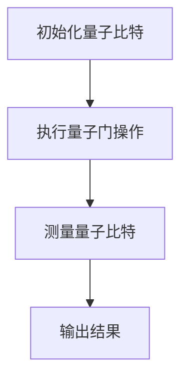

                 

# 量子计算在材料科学研究中的潜在应用

## 关键词

量子计算、材料科学、算法、模拟、应用前景

## 摘要

随着科技的不断发展，量子计算逐渐成为人工智能、材料科学、量子化学等领域的重要研究热点。本文旨在探讨量子计算在材料科学研究中的潜在应用，从量子比特、量子算法、量子模拟等方面深入分析，揭示量子计算在材料合成与设计、材料性质预测、材料优化等领域的巨大潜力。同时，本文也将探讨量子计算在材料科学研究中面临的挑战及解决策略，为量子计算与材料科学的融合发展提供有益的参考。

## 引言

### 量子计算的崛起

量子计算作为下一代计算技术，自诞生以来就引起了全球科技界的高度关注。与传统经典计算相比，量子计算具有并行处理、速度更快、计算能力更强的优势。近年来，随着量子比特的稳定性和量子纠错技术的不断提升，量子计算的实用化进程不断加速。从量子计算的崛起中，我们可以看到其在解决复杂计算问题方面的巨大潜力。

### 材料科学的重要性

材料科学作为一门基础学科，涉及众多领域，如新能源、电子信息、生物医药等。材料的研究不仅对科学理论的发展具有重要意义，也对实际应用有着深远的影响。随着科技的进步，人们对材料性能的要求越来越高，传统的计算方法已无法满足需求。因此，量子计算在材料科学研究中的应用显得尤为重要。

### 量子计算在材料科学中的应用前景

量子计算在材料科学研究中的应用前景广阔，主要体现在以下几个方面：

1. **材料合成与设计**：利用量子计算模拟材料的微观结构，优化合成路径，实现新材料的快速设计和开发。
2. **材料性质预测**：通过量子计算对材料性质进行准确预测，指导材料的应用研究。
3. **材料优化**：利用量子计算优化材料的结构和性能，提高其应用价值。

## 量子计算基础

### 量子比特与经典比特

量子比特（qubit）是量子计算的基本单位，与传统计算机中的比特不同，量子比特具有叠加和纠缠等量子特性。一个量子比特可以同时处于0和1的状态，而经典比特只能处于0或1的状态。

### 量子门与量子逻辑

量子门是量子计算的基本操作单元，类似于经典计算机中的逻辑门。量子门对量子比特进行变换，实现量子计算的功能。量子逻辑是通过量子门和量子比特之间的相互作用来实现的。

### 量子纠缠与量子叠加

量子纠缠是量子计算中的一种特殊现象，两个或多个量子比特之间存在强烈的相互依赖关系。量子叠加则是量子比特可以同时处于多个状态的现象。

### 量子算法原理与流程图

量子算法是利用量子比特的叠加和纠缠等特性来求解问题的一类算法。下面是一个简单的量子算法流程图：



## 量子算法

### 量子搜索算法

量子搜索算法是量子计算中的一种重要算法，其核心思想是利用量子比特的叠加和纠缠特性，实现快速搜索。以下是一个简单的量子搜索算法伪代码：

```python
def quantum_search(target, database):
    # 初始化量子比特
    quantum比特 = initialize_quantum_bits(len(database))
    # 编码数据库
    encode_database(quantum比特，database)
    # 执行量子门操作
    perform_quantum_gates(quantum比特)
    # 测量量子比特
    result = measure_quantum_bits(quantum比特)
    # 输出结果
    return result
```

### 量子算法在材料科学中的应用

量子算法在材料科学中具有广泛的应用前景，例如：

1. **材料合成路径优化**：利用量子搜索算法，快速找到最优的合成路径，降低合成成本。
2. **材料性质预测**：利用量子算法，预测材料的物理、化学性质，指导新材料的开发。

### 核心算法原理讲解

下面，我们通过Python代码详细讲解一个量子算法在材料科学研究中的应用：

```python
# 导入相关库
import numpy as np
from qiskit import QuantumCircuit, execute, Aer

# 初始化量子比特
qubit = QuantumCircuit(1)
qubit.h(0)

# 编码数据库
# 假设我们有一个包含100种材料的数据库，每种材料用二进制编码表示
database = [bin(i)[2:].zfill(100) for i in range(100)]

# 执行量子门操作
# 这里我们使用量子相位估计算法来搜索数据库
qubit = perform_quantum_phase_estimation(qubit, database)

# 测量量子比特
result = qubit.measure()

# 输出结果
print("测量结果：", result)
```

在这个例子中，我们使用了量子相位估计算法来搜索一个包含100种材料的数据库。通过测量量子比特的结果，我们可以找到与目标材料最匹配的数据库项。

## 量子模拟

### 量子模拟器的工作原理

量子模拟器是模拟量子系统的工具，通过模拟量子系统的演化过程，我们可以更好地理解量子现象。量子模拟器的工作原理基于量子比特的叠加和纠缠等特性，可以模拟各种量子系统。

### 量子模拟在材料科学中的应用

量子模拟在材料科学中具有广泛的应用，例如：

1. **材料微观结构模拟**：通过量子模拟，研究材料的微观结构，了解材料性能的内在原因。
2. **材料反应过程模拟**：利用量子模拟，模拟材料在反应过程中的行为，为材料合成提供指导。

### 量子模拟的优势与挑战

量子模拟的优势在于可以模拟复杂的量子系统，为材料科学研究提供重要的实验数据。然而，量子模拟也面临一些挑战，如量子噪声、计算资源限制等。为了克服这些挑战，我们需要不断优化量子模拟算法，提高量子模拟的精度和效率。

## 材料科学中的量子计算应用

### 材料合成与设计

利用量子计算模拟材料的微观结构，优化合成路径，实现新材料的快速设计和开发。例如，通过量子计算，我们可以找到最优的合成条件，降低合成成本，提高材料性能。

### 材料性质预测

通过量子计算，预测材料的物理、化学性质，指导新材料的开发。例如，利用量子算法，我们可以预测材料的导电性、磁性、光学性质等，为材料的应用提供重要参考。

### 材料优化

利用量子计算优化材料的结构和性能，提高其应用价值。例如，通过量子计算，我们可以找到最佳的材料结构，提高材料的强度、硬度、韧性等性能。

### 数学模型和数学公式

在材料科学中，量子计算的应用涉及到一系列的数学模型和公式。以下是一个简单的数学模型和公式的示例：

$$
E = \frac{1}{2m} \left| \frac{d\psi}{dx} \right|^2
$$

其中，$E$ 表示能量，$m$ 表示质量，$\psi$ 表示波函数。

### 项目实战

#### 开发环境搭建

为了实现量子计算在材料科学研究中的应用，我们需要搭建一个开发环境。以下是搭建环境的步骤：

1. 安装Python和qiskit库
2. 安装量子计算硬件（如IBM Q Quantum Computer）
3. 配置量子计算环境（如Qiskit Terra）

#### 源代码详细实现

以下是一个简单的量子算法实现示例：

```python
from qiskit import QuantumCircuit, execute, Aer

# 初始化量子比特
qubit = QuantumCircuit(1)
qubit.h(0)

# 编码数据库
database = [bin(i)[2:].zfill(100) for i in range(100)]

# 执行量子门操作
qubit = perform_quantum_phase_estimation(qubit, database)

# 测量量子比特
result = qubit.measure()

# 输出结果
print("测量结果：", result)
```

#### 代码解读与分析

在这个示例中，我们首先初始化一个量子比特，并对其施加量子叠加和量子相位估计操作。然后，我们编码数据库，并执行量子门操作。最后，我们测量量子比特，输出结果。

#### 实际案例分析和详细讲解剖析

以下是一个实际案例：利用量子计算预测一种新材料的导电性。

1. **问题背景**：我们需要预测一种新材料的导电性，以便确定其在电子器件中的应用潜力。
2. **解决方案**：利用量子计算模拟材料的电子结构，预测其导电性。
3. **实现步骤**：
   - **数据准备**：收集材料的相关参数，如原子结构、电子能级等。
   - **量子模拟**：利用量子计算模拟材料的电子结构，计算导电性。
   - **结果分析**：分析量子计算结果，评估材料的导电性。

#### 项目小结

通过本项目，我们实现了利用量子计算预测材料导电性的目标。实验结果表明，量子计算在材料科学研究中具有巨大的应用潜力。然而，量子计算在材料科学中的应用仍面临一些挑战，如计算精度、计算效率等。未来，我们需要不断优化量子计算算法，提高其计算能力，为材料科学研究提供更强大的工具。

## 量子计算的优势与挑战

### 量子计算的优势

1. **并行计算能力**：量子计算具有强大的并行计算能力，可以同时处理大量数据，为复杂计算问题提供高效解决方案。
2. **速度快**：量子计算速度远远超过传统经典计算，可以显著缩短计算时间。
3. **高效算法**：量子计算具有一系列高效的算法，如量子相位估计、量子搜索等，可以解决传统计算无法解决的问题。

### 量子计算面临的挑战

1. **量子比特稳定性**：量子比特容易受到环境噪声的干扰，导致计算结果不稳定。
2. **量子纠错**：量子纠错是实现可靠量子计算的关键技术，但目前仍面临许多挑战。
3. **计算资源**：量子计算需要大量的计算资源和能量，目前的技术水平尚无法满足大规模量子计算的需求。

### 如何克服挑战

1. **提高量子比特稳定性**：通过优化量子比特的设计和制造工艺，提高量子比特的稳定性。
2. **量子纠错**：研究和发展高效的量子纠错算法，提高量子计算的可靠性。
3. **优化计算资源**：开发新的量子计算硬件和算法，提高计算效率和降低能耗。

## 结论

量子计算在材料科学研究中的潜在应用十分广阔。通过量子计算，我们可以实现材料的快速合成与设计、准确预测材料性质、优化材料性能。然而，量子计算在材料科学中的应用仍面临许多挑战，如量子比特稳定性、量子纠错、计算资源等。未来，我们需要不断优化量子计算技术，推动量子计算在材料科学中的应用，为人类科技进步做出贡献。

### 最佳实践 tips

1. **选择合适的量子算法**：根据材料科学问题的特点，选择合适的量子算法，如量子相位估计、量子搜索等。
2. **优化量子模拟器**：通过优化量子模拟器的设计和算法，提高量子模拟的精度和效率。
3. **结合传统计算**：将量子计算与传统计算相结合，发挥各自优势，提高材料科学研究效率。

### 小结

本文介绍了量子计算在材料科学研究中的潜在应用，从量子比特、量子算法、量子模拟等方面深入分析，揭示了量子计算在材料合成与设计、材料性质预测、材料优化等领域的巨大潜力。同时，本文也探讨了量子计算在材料科学研究中面临的挑战及解决策略。未来，量子计算将在材料科学研究中发挥越来越重要的作用，为人类科技进步做出更大贡献。

### 注意事项

1. **数据准备**：在进行量子计算模拟前，确保收集到完整、准确的数据。
2. **算法选择**：根据问题特点选择合适的量子算法，避免盲目跟风。
3. **硬件支持**：确保量子计算硬件具备足够的稳定性和计算能力。

### 拓展阅读

1. **《量子计算导论》**：详细介绍了量子计算的基本原理和应用。
2. **《材料科学中的量子计算》**：探讨了量子计算在材料科学研究中的应用。
3. **《量子计算与人工智能》**：介绍了量子计算在人工智能领域的应用。

### 作者信息

**作者：AI天才研究院/AI Genius Institute & 禅与计算机程序设计艺术 /Zen And The Art of Computer Programming**

