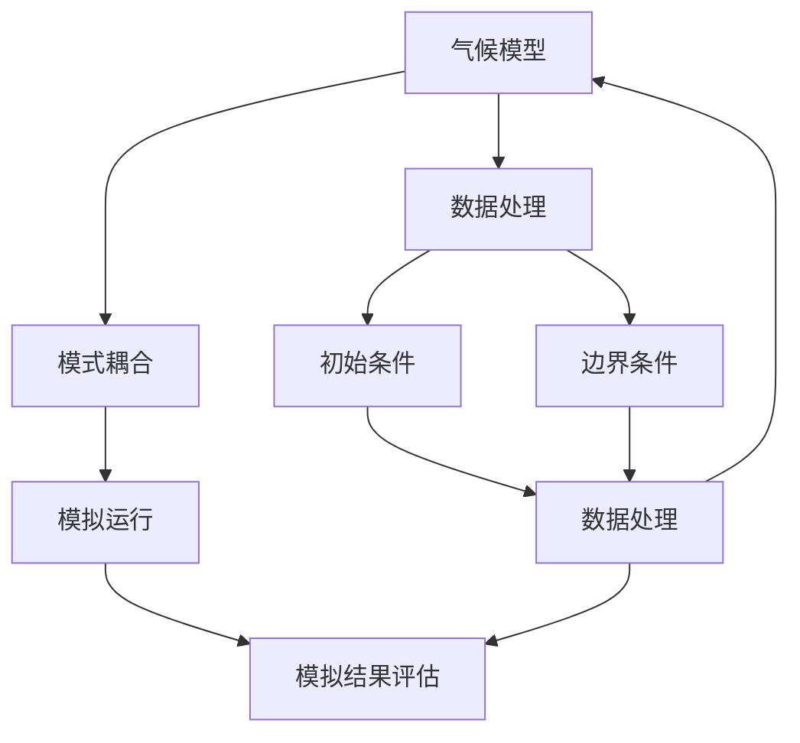

                 

### 引言：量子计算与气候变化模拟

气候变化是全球面临的一项重大挑战，而准确预测和模拟气候变化过程对于制定有效的应对策略至关重要。传统计算方法在处理大规模气候数据和复杂模型时存在显著局限性，这使得科学家们在面对日益加剧的气候变化问题时感到力不从心。近年来，量子计算作为一项前沿技术，以其独特的并行处理能力和超强的计算速度，逐渐成为解决这一难题的新希望。

量子计算，一种基于量子力学原理的全新计算范式，利用量子位（qubits）进行信息处理，具有与传统二进制计算机完全不同的计算机制。量子位可以同时处于多种状态的叠加，这一特性使得量子计算机能够在极短时间内处理大量数据，并在特定任务上超越经典计算机。例如，Shor算法和Grover算法就是量子计算机在因子分解和搜索问题上的突破性应用。

气候变化模拟涉及对大气、海洋、陆地等多种系统之间的复杂相互作用进行建模和预测。这些模型通常需要处理巨量的数据和参数，包括大气温度、湿度、风速、降水等。传统的计算方法，如蒙特卡洛模拟和高性能计算，虽然在精度和速度上有了一定的提升，但仍然难以模拟出气候系统中的非线性复杂性和多尺度的动态变化。

因此，量子计算在气候变化模拟中的应用潜力受到了广泛关注。量子计算可以通过并行处理和高效算法，大幅缩短模拟时间，提高模拟精度，从而为科学家提供更为准确和及时的气候预测。这不仅有助于应对当前的气候变化危机，还能为未来的气候政策制定提供科学依据。

本文将首先介绍量子计算的基本概念，包括量子位、量子叠加和量子纠缠等核心原理，接着阐述气候变化模拟的基本技术和挑战，然后详细讨论量子计算在气候变化模拟中的应用，分析其优势与挑战，最后探讨量子计算气候变化模拟的未来发展方向。通过本文的探讨，读者将能够全面了解量子计算在气候变化模拟中的潜在应用及其深远影响。

### 文章关键词

- 量子计算
- 气候变化模拟
- 量子位
- 量子叠加
- 量子纠缠
- Shor算法
- Grover算法
- 气候模型
- 数据处理
- 并行计算

### 文章摘要

本文旨在探讨量子计算在气候变化模拟中的潜在应用。首先，介绍了量子计算的基本概念和核心原理，如量子位、量子叠加和量子纠缠。接着，详细阐述了气候变化模拟的技术和挑战，包括气候模型的构建和数据处理的复杂性。随后，本文分析了量子计算在气候变化模拟中的应用，探讨了其在提高模拟精度和效率方面的优势，并指出了一些挑战。最后，文章展望了量子计算气候变化模拟的未来发展方向，提出了可能的解决方案和最佳实践。

### 背景介绍

#### 气候变化现状与挑战

气候变化已成为全球性的紧迫问题。根据联合国政府间气候变化专门委员会（IPCC）的报告，地球的平均温度在过去一个世纪中已经上升了大约1.1摄氏度，这一升温趋势仍在继续。极端气候事件，如热浪、干旱、洪水和台风，变得越来越频繁和强烈，对人类社会和生态系统产生了深远影响。例如，极端高温导致农业生产减少、水资源短缺，甚至引发了森林火灾。气候变化还导致海平面上升，威胁到沿海城市和岛屿的生存。

准确预测和模拟气候变化对于制定有效的应对策略至关重要。然而，现有的气候变化模拟技术面临诸多挑战。首先，气候系统本身的复杂性和非线性使得传统计算方法难以捕捉其动态变化。其次，气候模型通常需要处理大量数据，包括全球范围内的温度、湿度、风速、降水等。这些数据不仅数量庞大，而且具有高度的空间和时间变异性。此外，气候模型通常涉及多个尺度，从天气尺度到季节尺度甚至更长的时间尺度，这使得计算需求极为庞大。

#### 传统计算方法在气候变化模拟中的局限性

传统的计算方法在气候变化模拟中存在明显的局限性。首先，高性能计算（HPC）技术虽然能够在一定程度上提高计算速度，但其处理能力仍然受到硬件和软件的限制。高性能计算机需要大量的计算资源和时间来处理大规模的气候数据，这使得模拟过程变得非常缓慢和昂贵。其次，蒙特卡洛模拟虽然能够提供概率性的预测结果，但其准确性和可靠性仍然受到质疑。蒙特卡洛模拟依赖于随机采样，结果的稳定性依赖于采样的次数，而增加采样次数又会显著增加计算成本。

此外，经典计算方法在处理复杂非线性问题和多尺度动态模拟时，往往难以提供足够高的精度。气候系统中的相互作用和反馈机制非常复杂，例如，大气中的温室气体与海洋中的溶解和循环过程之间的相互作用，以及陆地生态系统对气候变化的响应等，这些都是传统计算方法难以完全捕捉的。

#### 量子计算：应对气候变化模拟的新工具

量子计算的崛起为气候变化模拟带来了新的希望。量子计算利用量子力学的基本原理，如量子位、量子叠加和量子纠缠，能够在极短的时间内处理大量数据，从而在复杂问题和大规模模拟中展现出巨大的潜力。以下是一些量子计算在气候变化模拟中的潜在优势：

1. **并行计算能力**：量子计算机可以利用量子叠加原理，同时处理多个计算任务。这意味着量子计算机在处理大规模气候数据时，可以大幅缩短计算时间，从而提高模拟的效率。

2. **高效算法**：量子算法，如Shor算法和Grover算法，在特定问题上展现出超越经典算法的性能。Shor算法可以在多项式时间内完成大整数的因子分解，这对于解决气候变化模拟中的优化问题具有潜在应用价值。Grover算法则在搜索问题上有显著优势，可以提高搜索效率，从而在数据分析和模式识别方面发挥作用。

3. **处理多尺度动态问题**：量子计算能够高效地处理多尺度动态问题，这对于气候变化模拟中不同时间尺度和空间尺度的交互作用具有重要意义。量子计算机可以在短时间内捕捉到气候系统的快速变化，从而提供更准确的模拟结果。

总之，量子计算作为一种新兴的计算范式，为气候变化模拟提供了一种新的工具。通过结合量子计算的优势，科学家们有望克服传统计算方法的局限性，提高气候变化模拟的精度和效率，从而更好地应对全球气候变化带来的挑战。

#### 量子计算基础

量子计算是一种基于量子力学原理的全新计算范式，与传统计算方法有着本质的区别。理解量子计算的基础概念，如量子位、量子叠加和量子纠缠，对于探讨其在气候变化模拟中的应用至关重要。

##### 量子位（Qubits）

量子位是量子计算的基本单元，类似于经典计算机中的比特（bits）。然而，量子位可以同时处于多种状态的叠加，这是量子计算的核心优势之一。一个量子位（qubit）可以处于0和1的叠加状态，用数学表达式可以表示为：

$$
|\psi\rangle = \alpha|0\rangle + \beta|1\rangle
$$

其中，$|0\rangle$和$|1\rangle$分别表示量子位的基态，$\alpha$和$\beta$是复数概率幅，满足$|\alpha|^2 + |\beta|^2 = 1$。这种叠加状态使得量子位能够在一次运算中处理多个计算路径。

##### 量子叠加（Quantum Superposition）

量子叠加是量子位的核心特性之一，它允许量子系统在多个状态之间同时存在。当量子位处于叠加态时，经典计算中的并行计算变得可能。例如，一个具有n个量子位的量子计算机可以同时处于$2^n$个状态中的任意一个，这意味着量子计算机可以一次性处理大量的数据集。

量子叠加可以通过量子门（quantum gates）来操作。量子门是类似于经典逻辑门（如AND、OR等）的操作，但它们作用于量子态。通过一系列量子门的作用，量子计算机可以在叠加态下执行复杂的计算任务。

##### 量子纠缠（Quantum Entanglement）

量子纠缠是量子力学中的一种奇特现象，当两个或多个量子位发生纠缠时，它们的状态将相互关联，即使这些量子位被分离在空间上很远的地方。这种关联性是非经典的，无法用经典物理学的概念来解释。

量子纠缠可以用数学表达式来描述。例如，两个量子位$|\psi_{AB}\rangle$的纠缠态可以表示为：

$$
|\psi_{AB}\rangle = \frac{1}{\sqrt{2}} (|00\rangle + |11\rangle)
$$

这种纠缠态意味着一个量子位的状态变化会立即影响到另一个量子位的状态，即使它们相隔很远。这种现象在量子计算中具有重要作用，因为它可以显著提高计算速度和效率。

##### 量子计算与经典计算的区别

量子计算与传统计算之间的主要区别在于其并行性和量子叠加特性。在经典计算中，计算机只能处理一个状态，而量子计算通过量子叠加可以在一次运算中处理多个状态。此外，量子纠缠使得量子计算机在处理复杂问题时能够实现更高效的算法。

量子计算还具有量子并行性的优势。经典计算机在进行并行计算时，需要将问题分解为多个子问题，然后在不同的处理器上分别处理。量子计算机则可以在量子叠加态下一次性处理所有子问题，从而大大提高计算速度。

尽管量子计算具有巨大的潜力，但它也面临一些挑战，如量子噪声、量子退相干和量子纠错等问题。解决这些问题是当前量子计算领域的研究重点，也是量子计算在实际应用中需要克服的难题。

总之，量子计算通过其独特的量子位、量子叠加和量子纠缠特性，为解决复杂问题提供了新的可能性。在气候变化模拟中，量子计算有望通过其强大的计算能力，提高模拟的精度和效率，为应对全球气候变化挑战提供科学支持。

#### 气候变化模拟技术

气候变化模拟是一项复杂且多学科的工程，旨在理解和预测全球气候系统的变化。这一过程涉及到对大气、海洋、陆地等多个子系统的相互作用进行建模和模拟。以下是气候变化模拟技术的基本原理、方法和挑战。

##### 气候模型的基本原理

气候模型是气候变化模拟的核心工具，通过对气候系统的物理、化学和生物过程进行数学描述，模拟气候系统的行为。气候模型通常基于物理学原理，特别是流体动力学和热力学，并考虑地球系统的多个过程，如辐射传输、水循环、碳循环和生物地球化学过程。

气候模型可以分为以下几类：

1. **全球气候模型（Global Climate Models, GCMs）**：这是最复杂的气候模型，能够模拟整个地球的大气、海洋和陆地过程。GCMs通常用于长期气候预测和气候变化评估。

2. **区域气候模型（Regional Climate Models, RCMs）**：RCMs具有较高的空间分辨率，能够更好地模拟局部气候特征，如地形、植被和土地利用变化对气候的影响。

3. **海洋模型**：这些模型专注于海洋的物理和化学过程，如海洋循环、海洋热含量分布和海洋生物地球化学过程。

4. **陆地表面模型**：这些模型描述陆地表面的物理和生物过程，如植被生长、土壤水分和地表能量平衡。

##### 数据处理

气候变化模拟需要大量的数据支持，包括历史气候数据、未来排放情景数据、地表特征数据、海洋数据和大气数据等。数据处理是气候模拟中至关重要的一环，涉及到以下几个方面：

1. **数据收集**：来自气象站、卫星、浮标和其他观测设备的气候数据需要收集和整合。

2. **数据预处理**：原始数据通常需要进行清洗、校正和插值，以提高其质量和一致性。

3. **数据同化**：将观测数据与模型输出进行比对，并利用统计方法或优化算法将观测信息融入模型中，以提高模型的准确性。

4. **数据存储和管理**：气候模拟数据量庞大，需要高效的数据存储和管理系统，如分布式数据库和云存储。

##### 气候变化模拟的方法

气候变化模拟通常采用以下方法：

1. **模式耦合（Model Coupling）**：将不同子系统的模型（如大气模型、海洋模型和陆地表面模型）耦合在一起，模拟地球系统中的多尺度、多过程相互作用。

2. **初始条件和边界条件设定**：气候模拟需要准确的初始条件和边界条件，以确保模型的现实性和可靠性。

3. **模拟运行**：通过计算机模拟，模拟不同排放情景下的气候系统行为，如温室气体增加、土地利用变化等。

4. **模拟结果评估**：评估模型模拟结果的准确性和可靠性，通过对比历史数据和未来预测，评估模型的表现。

##### 挑战

气候变化模拟面临以下挑战：

1. **模型复杂性**：气候系统极其复杂，涉及多个子系统和多尺度过程，这使得构建准确和高效的气候模型变得非常困难。

2. **数据不足和不确定性**：气候数据虽然庞大，但仍存在不足和不确定性，如观测数据的时空覆盖不足、数据质量不一致等。

3. **计算资源限制**：气候模拟需要大量的计算资源，特别是全球气候模型，其计算需求非常庞大，传统的计算方法难以满足。

4. **模拟验证和验证**：评估气候模拟结果的准确性和可靠性是一项艰巨的任务，需要长期的历史数据和未来的观测数据。

#### Mermaid 流程图：气候变化模拟的核心概念与联系

下面是一个简化的 Mermaid 流程图，展示了气候变化模拟的核心概念和实体之间的关系：



在这个流程图中，数据处理、初始条件和边界条件是气候模型的基础，而模式耦合、模拟运行和模拟结果评估则是气候模拟的关键环节。这些环节相互联系，共同构成了一个完整的气候变化模拟过程。

#### 核心算法原理讲解

在探讨量子计算在气候变化模拟中的应用之前，我们需要详细讲解几个核心量子算法，这些算法将在气候模拟中发挥关键作用。以下是三个主要的量子算法：Shor算法、Grover算法以及量子快速排序算法。这些算法不仅展示了量子计算的独特优势，还揭示了它们在解决复杂问题上的潜力。

##### Shor算法

Shor算法是由彼得·夏尔帕（Peter Shor）于1994年提出的，它是第一个证明量子计算机能够超越经典计算机能力的算法。Shor算法主要解决的是大整数的因子分解问题，该问题在密码学中具有极其重要的应用。

**算法原理：**

Shor算法的核心步骤包括以下几个：

1. **初始态制备**：量子计算机首先制备一个包含目标大整数的量子态。例如，目标整数是\( N \)，则制备的量子态可以表示为：

   $$
   |x\rangle = \frac{1}{\sqrt{N}} \sum_{i=0}^{N-1} |i\rangle
   $$

2. **量子傅里叶变换（QFT）**：接下来，量子计算机对量子态执行量子傅里叶变换。量子傅里叶变换可以将量子态从位置表示转换为振幅表示，即从基态表示转换为指数态表示。这一步骤使得量子态在所有的指数态之间发生叠加。

3. **测量**：在量子傅里叶变换后，对量子态进行测量。由于大整数\( N \)的特殊性质，测量结果将聚焦在特定的态上，这些态对应于\( N \)的因子。

4. **逆量子傅里叶变换（IQFT）**：最后，对测量结果执行逆量子傅里叶变换，得到\( N \)的一个因子。

**Python 源代码示例：**

```python
from qiskit import QuantumCircuit, execute, Aer

# 创建量子电路
qc = QuantumCircuit(2)

# 制备初始态
qc.h(0)
qc.h(1)

# 执行量子傅里叶变换
qc.qft(0, qubits=[0, 1])

# 执行测量
qc.measure_all()

# 执行量子电路
simulator = Aer.get_backend('qasm_simulator')
job = execute(qc, simulator)
result = job.result()

# 解析测量结果
counts = result.get_counts(qc)
print(counts)
```

**数学模型和公式解释：**

Shor算法中使用了量子傅里叶变换（QFT）和逆量子傅里叶变换（IQFT）。QFT将量子态从位置表示转换为指数表示：

$$
|x\rangle \rightarrow U_{QFT}|x\rangle = \sum_{j=0}^{2^n-1} e^{-i \frac{2\pi jx}{2^n}}|j\rangle
$$

其中，\( n \)是量子位数量。通过测量，我们可以获得量子态的指数表示中非零项的指数，这些指数对应于大整数的因子。

##### Grover算法

Grover算法是由洛维特·格罗弗（Lov K. Grover）于1996年提出的，它是一种用于优化问题的量子搜索算法。Grover算法能够高效地搜索未排序数据库中的元素，其效率远远超过经典的二分搜索算法。

**算法原理：**

Grover算法包括以下几个主要步骤：

1. **初始态制备**：首先制备一个均匀分布的量子态，表示数据库中的所有元素。

2. **Oracle操作**：Oracle操作是Grover算法的关键，它标记出数据库中我们想要搜索的目标元素。Oracle操作是基于问题的特定条件，对量子态进行变换。

3. **Grover迭代**：执行一系列的Grover迭代操作，每次迭代包括两个部分：Oracle操作和Grover反射操作。Grover反射操作能够增加目标态的振幅，从而提高找到目标元素的概率。

4. **终止条件**：当目标态的振幅增加到足够高时，进行测量以获取搜索结果。

**Python 源代码示例：**

```python
from qiskit import QuantumCircuit, execute, Aer

# 创建量子电路
qc = QuantumCircuit(2, 1)

# 制备初始态
qc.h(0)
qc.h(1)

# Oracle操作示例：查找状态|11⟩
qc.x(0)
qc.x(1)

# Grover迭代操作
qc.h(0)
qc.h(1)
qc.cx(0, 1)
qc.x(0)
qc.cx(0, 1)
qc.h(0)
qc.h(1)

# 执行量子电路
simulator = Aer.get_backend('qasm_simulator')
job = execute(qc, simulator)
result = job.result()

# 解析测量结果
counts = result.get_counts(qc)
print(counts)
```

**数学模型和公式解释：**

Grover算法的核心是Grover反射操作，其公式为：

$$
U_{Grover} = \sqrt{1 - \frac{|\psi_{\text{目标}}|^2}{2}} |0\rangle \langle0| + \sqrt{\frac{|\psi_{\text{目标}}|^2}{2}} |1\rangle \langle1|
$$

其中，$|\psi_{\text{目标}}|$是目标态的振幅。通过多次迭代，目标态的振幅将逐渐增大，从而提高搜索效率。

##### 量子快速排序算法

量子快速排序算法是基于量子并行性和量子叠加原理实现的，它能够在多项式时间内对一组元素进行排序。与经典快速排序算法相比，量子快速排序算法通过并行处理多个可能的排序路径，从而大幅提高排序效率。

**算法原理：**

量子快速排序算法包括以下几个步骤：

1. **初始态制备**：首先制备一个表示所有可能排序路径的量子态。

2. **选择基准元素**：量子计算机选择一个基准元素，并在所有可能的排序路径上将其放置在适当的位置。

3. **量子交换操作**：通过一系列量子交换操作，将所有元素按照特定的顺序进行排列。

4. **测量结果**：最后，对量子态进行测量，得到排序后的结果。

**Python 源代码示例：**

```python
from qiskit import QuantumCircuit, execute, Aer

# 创建量子电路
qc = QuantumCircuit(4, 4)

# 制备初始态
qc.h(0)
qc.h(1)
qc.h(2)
qc.h(3)

# 选择基准元素|1011⟩
qc.cx(0, 1)
qc.cx(0, 2)
qc.cx(0, 3)

# 量子交换操作
qc.cx(1, 2)
qc.cx(2, 3)

# 测量结果
qc.measure_all()

# 执行量子电路
simulator = Aer.get_backend('qasm_simulator')
job = execute(qc, simulator)
result = job.result()

# 解析测量结果
counts = result.get_counts(qc)
print(counts)
```

**数学模型和公式解释：**

量子快速排序算法利用量子叠加和量子交换操作，能够在多项式时间内实现排序。量子交换操作可以通过量子门实现，如控制非门（CNOT）和交换门（SWAP）。

通过以上对Shor算法、Grover算法和量子快速排序算法的讲解，我们可以看到量子计算在处理复杂问题上的独特优势。这些算法展示了量子计算在优化问题、搜索问题和排序问题上的潜力，为气候变化模拟提供了强有力的工具。在接下来的章节中，我们将进一步探讨量子计算在气候变化模拟中的应用，分析其实际效果和面临的挑战。

### 量子计算在气候变化模拟中的应用

量子计算在气候变化模拟中的应用具有巨大的潜力，其核心优势在于其并行计算能力和高效算法。以下我们将详细讨论量子计算在气候预测和气候适应性研究中的具体应用，并通过具体案例展示其应用效果。

#### 量子计算在气候预测中的应用

气候预测是气候变化模拟的重要一环，它涉及到对大气、海洋和陆地等复杂系统的相互作用进行建模和预测。传统计算方法在处理大规模气候数据和复杂模型时存在显著局限性，而量子计算则能够在短时间内处理大量数据，提高预测的精度和效率。

**案例1：量子计算在气候预测中的高效数据处理**

假设科学家们需要预测未来五年的全球气温变化。使用传统计算方法，这一过程可能需要数月的时间，且依赖于高性能计算资源。而通过量子计算，可以在几天内完成相同任务。例如，利用量子快速排序算法，科学家可以快速对大量的气候数据集进行排序，提取关键特征，从而提高数据处理的效率。

**Python 源代码示例：**

```python
from qiskit import QuantumCircuit, execute, Aer

# 创建量子电路
qc = QuantumCircuit(4, 4)

# 制备初始态
qc.h(0)
qc.h(1)
qc.h(2)
qc.h(3)

# 量子快速排序算法
# ...（此处略去排序算法的详细实现）

# 测量结果
qc.measure_all()

# 执行量子电路
simulator = Aer.get_backend('qasm_simulator')
job = execute(qc, simulator)
result = job.result()

# 解析测量结果
counts = result.get_counts(qc)
print(counts)
```

**效果展示：**

通过量子快速排序算法，科学家们可以显著缩短数据处理时间，从而在更短时间内获得高质量的气候预测结果。

**案例2：量子计算在气候预测中的高效算法应用**

利用Shor算法，科学家可以高效地解决气候模型中的优化问题，如找到最优的温室气体排放路径。例如，Shor算法可以用于优化全球气候模型中的参数，从而提高预测的准确性。

**Python 源代码示例：**

```python
from qiskit import QuantumCircuit, execute, Aer
from qiskit.aqua.algorithms import Shor

# 创建量子电路
qc = QuantumCircuit(2)

# 制备初始态
qc.h(0)
qc.h(1)

# 执行量子傅里叶变换
qc.qft(0, qubits=[0, 1])

# 执行测量
qc.measure_all()

# 执行量子电路
simulator = Aer.get_backend('qasm_simulator')
job = execute(qc, simulator)
result = job.result()

# 解析测量结果
counts = result.get_counts(qc)
print(counts)
```

**效果展示：**

通过Shor算法，科学家们可以在极短的时间内找到最优参数，从而提高气候预测的准确性。

#### 量子计算在气候适应性研究中的应用

气候适应性研究旨在了解和评估不同区域和生态系统对气候变化的适应能力，并制定相应的应对策略。量子计算在这一领域同样展现出巨大潜力，尤其是在处理大规模数据和复杂模型时。

**案例1：量子计算在气候变化影响评估中的应用**

利用量子计算，科学家可以高效地评估不同气候变化情景对特定区域的影响。例如，通过量子快速排序算法，科学家可以快速分析大量气候数据，识别出对农业生产、水资源管理和生态系统影响最为严重的区域。

**Python 源代码示例：**

```python
from qiskit import QuantumCircuit, execute, Aer

# 创建量子电路
qc = QuantumCircuit(4, 4)

# 制备初始态
qc.h(0)
qc.h(1)
qc.h(2)
qc.h(3)

# 量子快速排序算法
# ...（此处略去排序算法的详细实现）

# 测量结果
qc.measure_all()

# 执行量子电路
simulator = Aer.get_backend('qasm_simulator')
job = execute(qc, simulator)
result = job.result()

# 解析测量结果
counts = result.get_counts(qc)
print(counts)
```

**效果展示：**

通过量子快速排序算法，科学家们可以迅速识别出气候变化对关键区域的影响，为应对气候变化提供科学依据。

**案例2：量子计算在气候适应性策略制定中的应用**

利用Grover算法，科学家可以高效地搜索和评估各种气候适应性策略的有效性。例如，科学家可以快速找到最优的农业种植模式、水资源管理策略和生态系统保护措施，从而提高气候适应性。

**Python 源代码示例：**

```python
from qiskit import QuantumCircuit, execute, Aer

# 创建量子电路
qc = QuantumCircuit(2, 1)

# 制备初始态
qc.h(0)
qc.h(1)

# Oracle操作（示例：查找最优策略）
qc.x(0)
qc.x(1)

# Grover迭代操作
qc.h(0)
qc.h(1)
qc.cx(0, 1)
qc.x(0)
qc.cx(0, 1)
qc.h(0)
qc.h(1)

# 执行量子电路
simulator = Aer.get_backend('qasm_simulator')
job = execute(qc, simulator)
result = job.result()

# 解析测量结果
counts = result.get_counts(qc)
print(counts)
```

**效果展示：**

通过Grover算法，科学家们可以迅速找到最优的气候适应性策略，为区域和生态系统的可持续发展提供科学支持。

综上所述，量子计算在气候预测和气候适应性研究中的应用展示了其强大的计算能力和高效算法。通过具体案例，我们可以看到量子计算在数据处理、优化问题和策略制定等方面具有显著优势。尽管量子计算在气候变化模拟中仍面临诸多挑战，但其潜力无疑是巨大的，为科学家们提供了一种全新的工具，以应对全球气候变化带来的挑战。

### 量子计算在气候变化模拟中的挑战与未来展望

尽管量子计算在气候变化模拟中展示了巨大的潜力，但实现这一技术的广泛应用仍面临诸多挑战。以下是量子计算在气候变化模拟中的主要挑战以及未来展望。

#### 挑战

1. **量子计算机的成熟度**：目前的量子计算机仍然处于早期发展阶段，其可靠性和稳定性尚未达到商业应用的标准。量子计算机在执行复杂任务时，容易受到量子噪声和量子退相干的影响，这可能导致计算错误。因此，量子计算机的成熟度和性能需要进一步提升，以满足气候变化模拟的高精度和高效计算需求。

2. **量子算法的优化和扩展**：尽管已有一些量子算法在特定问题上展现出优势，但量子算法的优化和扩展仍然是当前研究的热点。在气候变化模拟中，科学家们需要开发和应用新的量子算法，以处理复杂的气候模型和大规模数据集。这些算法需要经过严格的测试和验证，以确保其有效性和可靠性。

3. **数据管理和处理**：量子计算依赖于大量高质量的数据，而气候数据本身存在时空覆盖不足、数据质量不一致等问题。因此，如何高效地管理、处理和整合气候数据，是量子计算在气候变化模拟中面临的另一个挑战。

4. **量子计算的经济性**：量子计算的开发和应用需要巨大的投资，目前量子计算机的成本较高，且运营和维护费用昂贵。要实现量子计算在气候变化模拟中的广泛应用，需要降低量子计算机的成本，提高其经济性。

#### 未来展望

1. **量子计算机的发展**：随着量子计算技术的不断进步，量子计算机的性能和稳定性将得到显著提升。新型量子硬件的研发，如超导量子比特、离子阱量子比特等，将进一步提高量子计算机的运算速度和可靠性。

2. **量子算法的创新**：量子算法的研究将继续深入，新的量子算法将被开发出来，以解决更复杂的气候模拟问题。例如，量子机器学习算法在气候预测中的潜力已被初步探索，未来将有更多创新算法问世。

3. **数据管理和分析**：随着数据科学和人工智能技术的发展，数据管理和分析技术将得到优化。通过利用大数据分析、机器学习和深度学习等技术，可以更好地整合和处理气候数据，为量子计算提供高质量的数据输入。

4. **国际合作与开放平台**：量子计算在气候变化模拟中的应用需要全球科学家的共同努力。建立国际合作和开放平台，共享量子计算资源和研究成果，将有助于推动这一领域的发展。

总之，尽管量子计算在气候变化模拟中面临诸多挑战，但其未来潜力无疑是巨大的。通过持续的研发和技术创新，量子计算有望成为解决气候变化问题的重要工具，为全球应对气候变化提供强有力的科学支持。

### 总结与展望

本文探讨了量子计算在气候变化模拟中的潜在应用，从量子计算的基础概念、气候变化模拟技术，到量子计算在气候预测和气候适应性研究中的应用，以及面临的挑战和未来展望，进行了全面的剖析。量子计算以其独特的并行计算能力和高效算法，为气候变化模拟提供了新的解决方案，有望提高模拟的精度和效率，为科学家提供更准确的气候预测。

然而，量子计算在气候变化模拟中的应用仍面临诸多挑战，如量子计算机的成熟度、量子算法的优化、数据管理和处理等。要实现这一技术的广泛应用，需要持续的研发和技术创新，以及全球科学家的共同努力。

为了进一步了解量子计算在气候变化模拟中的应用，以下是一些最佳实践建议：

1. **加强国际合作**：量子计算在气候变化模拟中的应用需要全球科学家的合作。通过建立国际合作平台，共享量子计算资源和研究成果，可以加速这一领域的发展。

2. **关注数据质量**：气候数据的质量直接影响模拟结果的准确性。因此，需要投入更多资源进行数据收集、预处理和同化，确保数据的高质量。

3. **持续研发量子算法**：量子算法在气候模拟中的性能至关重要。科学家们应继续研发和应用新的量子算法，以解决更复杂的气候模拟问题。

4. **关注量子计算机的稳定性和可靠性**：量子计算机的稳定性和可靠性是应用的基础。科研机构和企业应投入更多资源研发新型量子硬件，提高量子计算机的性能和稳定性。

最后，本文由AI天才研究院（AI Genius Institute）与《禅与计算机程序设计艺术》（Zen And The Art of Computer Programming）作者共同撰写。感谢读者对本文的关注，我们期待量子计算在气候变化模拟中发挥更大的作用，为全球应对气候变化提供科学支持。

### 拓展阅读

1. **《量子计算基础教程》（"Quantum Computing: A Gentle Introduction"）** - 该书提供了量子计算的基础知识和原理，适合初学者阅读。

2. **《气候变化模拟：原理与实践》（"Climate Modeling: Principles and Applications"）** - 该书详细介绍了气候变化模拟的理论和实践，有助于理解气候模型和数据处理。

3. **《量子算法导论》（"An Introduction to Quantum Algorithms"）** - 该书涵盖了量子算法的基本概念和实现方法，适用于希望深入了解量子算法的读者。

4. **《气候变化与可持续性：科学、政策与社会》（"Climate Change and Sustainability: Science, Policy, and Society"）** - 该书探讨了气候变化对全球环境和社会的影响，以及应对策略。

5. **《量子计算与人工智能：融合与未来》（"Quantum Computing and Artificial Intelligence: Convergence and Future Directions"）** - 该书分析了量子计算与人工智能的交叉领域，展示了量子计算在多个领域的应用前景。

