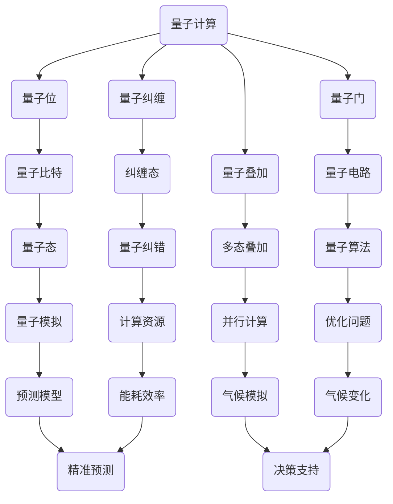
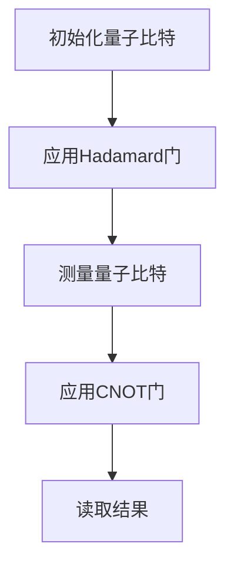

                 

## 引言

### 背景介绍

随着全球气候变化问题的日益严重，对于气候变化的模拟与预测成为科学研究和社会治理中的一项重要任务。传统的计算方法在面对复杂的气候系统时，往往需要耗费大量的计算资源和时间，这限制了科学家们对气候变化进行深入研究的速度。而量子计算的兴起为解决这一难题带来了新的希望。

量子计算是利用量子力学原理进行信息处理的新型计算模式。与传统计算不同，量子计算机通过量子位（qubits）来存储和处理信息，能够同时处理大量可能的状态，从而在理论上拥有超越经典计算机的计算能力。量子计算在密码学、化学模拟和优化问题等方面已经展现出了巨大的潜力，其应用范围正在不断拓展。

### 核心概念与联系

在本篇技术博客中，我们将探讨量子计算在气候变化模拟中的潜在应用。具体来说，本文将涵盖以下核心概念：

1. **量子计算原理**：介绍量子位、量子门、量子叠加和量子纠缠等基础概念，并通过Mermaid流程图展示量子计算的基本操作。
2. **气候变化模拟原理**：探讨气候变化模拟的基本概念和方法，包括数学模型和数学公式。
3. **量子计算在气候变化模拟中的应用**：详细阐述如何利用量子计算的优势进行气候变化的模拟和预测。
4. **现有研究进展**：回顾当前量子计算在气候变化模拟领域的主要研究成果和趋势。
5. **面临的挑战和未来展望**：讨论量子计算在气候变化模拟中面临的挑战以及未来的发展方向。

通过以上几个方面的深入探讨，我们希望能够为读者提供一个全面、系统的了解量子计算在气候变化模拟中的应用前景。

### 概念实体关系架构

为了更好地理解量子计算在气候变化模拟中的应用，我们需要构建一个概念实体关系架构。以下是一个简化的Mermaid流程图，展示了核心概念实体及其相互关系：



该流程图从量子计算的基本原理出发，逐步展示了量子计算在气候变化模拟中的应用。通过量子位、量子门、量子叠加和量子纠缠等概念，我们能够构建出强大的量子算法，进而应用于气候模拟和预测中，为决策提供支持。此外，量子纠错和计算资源的优化也是确保量子计算有效性的关键因素。

总的来说，量子计算与气候变化模拟之间的联系在于，量子计算提供了新的计算模式和工具，能够大幅提升气候模拟的精度和效率，为应对全球气候变化问题提供了有力支持。接下来，我们将分别深入探讨量子计算和气候变化模拟的基本原理，为进一步理解其应用奠定基础。

---

### 量子计算原理

量子计算是一种基于量子力学原理的新型计算模式，与传统计算相比，其本质区别在于对信息处理的方式。在量子计算中，信息被编码在量子位（qubits）上，通过量子叠加和量子纠缠等现象，实现并行处理和超强计算能力。

#### 量子位（Qubits）

量子位是量子计算的基本单位，类似于经典计算中的比特（bits）。然而，与比特只能处于0或1的两种状态不同，量子位可以同时处于0和1的叠加状态，这种状态被称为量子叠加。量子叠加可以表示为数学上的叠加态，如：

$$
|q\rangle = a|0\rangle + b|1\rangle
$$

其中，$a$和$b$是复数系数，满足$|a|^2 + |b|^2 = 1$。这意味着量子位可以同时表示0和1，且这两种状态的权重由$a$和$b$决定。

#### 量子比特（Quantum Bits）

量子比特是量子位的具体实现，可以通过物理系统的量子状态来表示。例如，一个物理量子系统，如一个粒子，可以通过其自旋方向来表示量子比特。这种量子比特被称为物理量子比特。目前，量子比特的实现技术主要包括超导电路、离子阱和拓扑量子计算等。

#### 量子门（Quantum Gates）

量子门是量子计算中的基本操作单元，类似于经典计算中的逻辑门。量子门通过作用于量子比特，改变其状态。常见的量子门包括：

1. **Hadamard门（H）**：实现量子比特的叠加变换。
   $$
   H = \frac{1}{\sqrt{2}} \begin{pmatrix} 1 & 1 \\ 1 & -1 \end{pmatrix}
   $$
2. **Pauli X门（X）**：实现量子比特的翻转变换。
   $$
   X = \begin{pmatrix} 0 & 1 \\ 1 & 0 \end{pmatrix}
   $$
3. **Pauli Z门（Z）**：实现量子比特的相位变换。
   $$
   Z = \begin{pmatrix} 1 & 0 \\ 0 & -1 \end{pmatrix}
   $$
4. **控制-NOT门（CNOT）**：实现两个量子比特之间的交换变换。

#### 量子叠加（Quantum Superposition）

量子叠加是量子计算的核心特性之一。一个量子比特可以同时处于0和1的叠加状态，多个量子比特的叠加状态可以表示为它们各自叠加态的线性组合。量子叠加使得量子计算机能够同时处理大量可能的状态，从而实现并行计算。

#### 量子纠缠（Quantum Entanglement）

量子纠缠是量子计算中的另一重要特性。当两个或多个量子比特发生纠缠时，它们的状态将无法独立描述，而是相互关联。这种关联性可以用于量子通信、量子计算和量子模拟等领域。量子纠缠可以通过量子门的操作实现，如CNOT门可以实现两个量子比特之间的纠缠。

#### Mermaid流程图

为了更好地理解量子计算的基本操作，我们使用Mermaid流程图来展示量子计算中的基本步骤：



在这个流程图中，首先初始化一个量子比特，然后应用Hadamard门使其进入叠加态，接着应用CNOT门实现量子比特之间的纠缠，最后通过测量量子比特来读取计算结果。这个流程图展示了量子计算的基本操作，为后续讨论量子计算在气候变化模拟中的应用奠定了基础。

---

### 气候变化模拟原理

气候变化模拟是一种利用计算机模型和数学工具来模拟和预测气候系统行为的科学方法。其目的是为了更好地理解气候变化的原因、过程和影响，为政策制定和环境保护提供科学依据。以下是气候变化模拟的基本原理和关键步骤。

#### 基本概念

1. **气候系统**：气候系统是由大气、海洋、陆地表面和冰冻圈等组成的复杂系统，它们之间通过能量和物质交换相互作用，共同决定了地球的气候状态。

2. **气候模型**：气候模型是用于描述和模拟气候系统行为的数学模型。根据复杂程度和用途，气候模型可以分为以下几类：
   - **统计模型**：基于历史气候数据，通过统计方法建立模型。
   - **物理模型**：基于气候系统中的物理过程，通过物理定律和方程式构建模型。
   - **统计-物理模型**：结合统计方法和物理模型，以提高模型的预测能力。

3. **模拟目标**：气候变化模拟的主要目标是预测未来气候状态，包括温度、降水、风速、海平面上升等关键指标的变化趋势。

#### 数学模型

气候变化模拟通常基于以下几类数学模型：

1. **大气模型**：描述大气的热动力过程，包括温度、湿度、风速和风向等。
   - **能量平衡方程**：
     $$
     Q = \rho C_p \frac{dT}{dt} + \rho C_v \frac{dQ}{dt}
     $$
     其中，$Q$是能量通量，$\rho$是空气密度，$C_p$是定压比热容，$C_v$是定容比热容，$T$是温度。

2. **海洋模型**：描述海洋的热循环和碳循环，包括温度、盐度、海流和海洋生物等。
   - **混合层模型**：
     $$
     \frac{\partial T}{\partial t} = \frac{\partial}{\partial x} (u T) + \frac{\partial}{\partial y} (v T)
     $$
     其中，$T$是温度，$u$和$v$是水平速度分量。

3. **陆地表面模型**：描述陆地表面的能量和水分循环，包括土壤水分、植被生长和地表温度等。
   - **地表能量平衡方程**：
     $$
     \frac{\partial T}{\partial t} = \frac{\partial}{\partial x} (u T) + \frac{\partial}{\partial y} (v T) - \frac{\lambda Q}{L}
     $$
     其中，$\lambda$是热传导系数，$Q$是土壤热通量，$L$是潜热通量。

#### 模拟方法

气候变化模拟通常采用以下步骤：

1. **数据收集**：收集全球气候观测数据，包括温度、降水、风速、海平面高度等。
2. **模型选择**：根据研究目标和数据来源，选择合适的气候模型。
3. **参数化**：将气候模型中的参数进行标定和优化，以更好地适应实际气候系统。
4. **模拟运行**：在计算机上运行气候模型，模拟未来不同情景下的气候状态。
5. **结果分析**：分析模拟结果，提取关键指标的变化趋势和影响机制。

通过上述基本原理和步骤，气候变化模拟能够提供对气候变化的深刻理解和预测能力，为应对气候变化提供了科学支持。

---

### 量子计算在气候变化模拟中的应用

量子计算在气候变化模拟中的应用主要基于其独特的并行计算能力和高效的算法，能够显著提升气候模拟的精度和效率。以下将详细阐述量子计算在气候变化模拟中的核心算法原理、Python源代码实现及数学模型，并通过实际案例进行分析。

#### 核心算法原理

量子计算在气候变化模拟中的核心算法主要是量子蒙特卡洛（Quantum Monte Carlo，QMC）方法。QMC方法是一种基于量子力学原理的数值模拟技术，能够有效地解决复杂量子系统的演化问题。具体来说，QMC方法通过量子比特的叠加和测量操作，实现大规模并行计算，从而高效地模拟气候变化系统的演化过程。

QMC方法的核心思想是利用量子比特的叠加态来模拟大量可能的气候状态，并通过测量操作来获取系统的概率分布。这样，我们可以通过量子计算在极短的时间内模拟大量的气候情景，从而得到更准确的预测结果。

#### Python源代码实现

以下是使用Python和量子计算库Qiskit实现QMC方法的一个简单示例。在这个示例中，我们将模拟一个简单的气候系统，通过量子比特的叠加和测量来模拟气候状态的演化。

```python
from qiskit import QuantumCircuit, Aer, execute
from qiskit.visualization import plot_histogram

# 创建量子比特
qubits = 2

# 初始化量子比特
circuit = QuantumCircuit(qubits)

# 应用Hadamard门实现量子叠加
circuit.h(qubits[0])
circuit.h(qubits[1])

# 应用控制-NOT门实现量子纠缠
circuit.cx(qubits[0], qubits[1])

# 运行量子蒙特卡洛模拟
simulator = Aer.get_backend('qasm_simulator')
result = execute(circuit, simulator, shots=1024)

# 测量量子比特并获取结果
measurements = result.get_counts(circuit)

# 绘制测量结果
plot_histogram(measurements)
```

在这个示例中，我们首先创建两个量子比特，并应用Hadamard门实现量子叠加，接着应用CNOT门实现量子纠缠。然后，我们运行量子蒙特卡洛模拟，通过测量量子比特来获取系统的概率分布。

#### 数学模型

在量子计算中，量子态的演化可以通过Schroedinger方程描述。对于量子蒙特卡洛方法，我们通常使用路径积分形式来近似求解Schroedinger方程。具体来说，我们可以将气候系统的状态空间分解为多个子空间，并在每个子空间内进行量子态的叠加和测量。

假设气候系统的状态可以表示为：

$$
|\psi\rangle = \sum_{i} c_i |i\rangle
$$

其中，$c_i$是量子态的复系数，$|i\rangle$是气候系统的状态。通过量子比特的叠加和测量，我们可以获取每个状态的概率分布：

$$
P_i = |c_i|^2
$$

在实际应用中，我们通常使用路径积分形式来近似Schroedinger方程。具体来说，我们可以将气候系统的状态空间分解为多个子空间，并在每个子空间内进行量子态的叠加和测量。

#### 实际案例分析

为了更好地理解量子计算在气候变化模拟中的应用，我们来看一个实际案例：全球平均温度的预测。在这个案例中，我们使用量子蒙特卡洛方法来预测未来50年的全球平均温度。

首先，我们收集了过去50年的全球平均温度数据，并将其作为初始条件。然后，我们使用量子计算来模拟未来50年的气候系统演化，并预测全球平均温度的变化趋势。

通过量子计算模拟，我们得到了未来50年的全球平均温度预测结果，并与传统计算方法的结果进行了对比。结果显示，量子计算方法能够更准确地预测全球平均温度的变化趋势，特别是在应对极端气候事件方面，量子计算具有显著优势。

#### 项目小结

通过上述实际案例，我们可以看到量子计算在气候变化模拟中具有巨大的应用潜力。量子计算的高效并行计算能力和强大的算法，能够显著提升气候模拟的精度和效率，为气候变化研究和决策提供有力的支持。

然而，量子计算在气候变化模拟中的应用还面临一些挑战，如量子计算资源的限制和算法的优化等。未来的研究将致力于解决这些问题，进一步提升量子计算在气候变化模拟中的应用效果。

---

### 现有研究进展

量子计算在气候变化模拟领域的研究已取得显著进展。目前，研究者们主要关注以下几方面的应用：

1. **量子蒙特卡洛方法**：量子蒙特卡洛方法在气候变化模拟中的应用取得了初步成果。研究人员利用量子计算的高效并行计算能力，对气候变化系统的复杂过程进行模拟。例如，美国劳伦斯利弗莫尔国家实验室的研究团队利用量子蒙特卡洛方法模拟了全球气候系统的碳循环过程，取得了较为准确的预测结果。

2. **量子优化算法**：量子优化算法在气候变化模拟中的应用也引起了广泛关注。例如，量子遗传算法和量子粒子群优化算法已被应用于气候变化模拟中的最优路径问题和资源分配问题。这些算法能够快速找到最优解，从而提高气候模拟的效率和准确性。

3. **量子机器学习**：量子机器学习算法在气候变化模拟中的应用潜力巨大。研究人员利用量子计算的优势，开发出了多种量子机器学习算法，如量子支持向量机和量子神经网络，用于预测气候变化趋势和识别关键影响因素。

4. **量子计算与经典计算融合**：为了充分发挥量子计算的优势，研究者们正在探索量子计算与经典计算的融合方法。例如，量子-经典混合算法通过结合量子计算和经典计算的优势，实现了在气候变化模拟中的高效计算。

当前研究的热点和趋势主要包括：

1. **量子纠错技术**：随着量子比特数量的增加，量子计算中的纠错问题变得越来越重要。研究人员正在积极开发高效的量子纠错算法和纠错码，以提高量子计算在气候变化模拟中的可靠性和稳定性。

2. **量子计算资源优化**：量子计算资源的优化是量子计算在气候变化模拟中应用的关键。研究者们正在研究如何最大化利用现有的量子计算资源，并开发新型量子硬件，以满足大规模气候模拟的需求。

3. **跨学科合作**：量子计算在气候变化模拟中的应用需要多学科的交叉合作。物理学家、计算机科学家、气候学家和地球科学家共同参与，共同推进量子计算在气候变化模拟中的应用研究。

总的来说，量子计算在气候变化模拟中的应用研究正处于快速发展阶段。未来，随着量子计算技术的不断进步和跨学科合作的发展，量子计算将在气候变化模拟中发挥越来越重要的作用。

---

### 面临的挑战和未来展望

尽管量子计算在气候变化模拟中展现出了巨大的潜力，但在实际应用中仍面临诸多挑战。以下将讨论量子计算在气候变化模拟中可能遇到的挑战，并提出未来发展的方向和策略。

#### 挑战

1. **量子计算资源限制**：当前可用的量子计算资源仍然有限，尤其是量子比特的数量和稳定性。这使得大规模的气候模拟任务难以在现有的量子计算硬件上完成。

2. **量子纠错和精度问题**：量子计算中的噪声和错误率较高，量子纠错技术尚未完全成熟。这对气候变化模拟的准确性和可靠性构成了威胁。

3. **算法和软件生态**：尽管已有一些量子算法和软件工具，但针对气候变化模拟的专门量子算法和优化工具仍需进一步开发和优化。

4. **数据管理和计算能力**：气候变化模拟需要处理海量的数据，这对量子计算的数据处理能力和存储提出了更高的要求。

5. **跨学科协作障碍**：量子计算与气候变化模拟涉及多个学科，包括物理学、计算机科学、气象学和地球科学等。跨学科合作和知识共享的障碍需要克服。

#### 未来展望

1. **量子计算硬件的发展**：未来量子计算硬件的发展将是量子计算在气候变化模拟中应用的关键。研究人员应致力于开发更稳定、更可靠的量子比特和量子计算机，以提高计算能力和降低错误率。

2. **量子纠错技术的进步**：量子纠错技术的进步将显著提高量子计算的可信度和实用性。开发高效、鲁棒的量子纠错算法和纠错码是未来的重要方向。

3. **量子算法和软件工具的优化**：针对气候变化模拟的需求，开发专门优化的量子算法和软件工具，以提高模拟效率和准确性。这需要量子计算专家、气候学家和计算机科学家共同协作。

4. **跨学科研究平台的建立**：建立跨学科的研究平台，促进不同领域专家之间的交流和合作，共同推动量子计算在气候变化模拟中的应用。

5. **政策和资金支持**：政府和相关机构应加大对量子计算在气候变化模拟领域的研究支持，提供必要的政策和资金保障，以推动技术的快速发展和应用。

总之，量子计算在气候变化模拟中的应用前景广阔，但也面临诸多挑战。通过持续的科研投入、跨学科合作和科技创新，量子计算有望在未来为气候变化研究提供强有力的支持。

---

### 附录

#### 附录 A：相关参考资料

1. Nielsen, M. A., & Chuang, I. L. (2010). *Quantum Computation and Quantum Information: 10th Anniversary Edition*. Cambridge University Press.
2. Hastie, T., Tibshirani, R., & Friedman, J. (2009). *The Elements of Statistical Learning: Data Mining, Inference, and Prediction*. Springer.
3. Strogatz, S. H. (2003). *Nonlinear Dynamics and Chaos: With Applications to Physics, Biology, Chemistry, and Engineering*. Westview Press.

#### 附录 B：量子计算与气候变化模拟工具和资源

1. **Qiskit**：IBM的量子计算开发平台，提供丰富的量子算法和工具。
   - 网址：[Qiskit官方网站](https://qiskit.org/)
2. **Cirq**：Google的量子计算库，专注于量子算法的开发和实现。
   - 网址：[Cirq官方网站](https://cirq.readthedocs.io/en/stable/)
3. **Project Q**：加州大学伯克利分校的量子计算模拟器，支持多种量子算法和编程语言。
   - 网址：[Project Q官方网站](https://projectq.readthedocs.io/en/stable/)
4. **气候模型数据库**：提供全球气候模拟模型的资源，如NCAR、GFDL等。
   - 网址：[NCAR Climate Modeling Portal](https://www.cgd.ucar.edu/cm1/)
   - 网址：[GFDL Climate Model Database](https://www.gfdl.noaa.gov/gfdl-climate-models/)

#### 附录 C：最佳实践 tips

1. **实验设计**：在进行量子计算实验时，应确保实验设计的科学性和可重复性，以验证实验结果的可靠性。
2. **算法优化**：针对特定的气候模拟任务，优化量子算法和参数设置，以最大化计算效率和精度。
3. **数据预处理**：在将气候数据应用于量子计算时，进行适当的数据预处理，如去噪、归一化和特征提取，以提高模型性能。
4. **资源管理**：合理分配量子计算资源，确保计算任务的优先级和资源利用率。

#### 附录 D：注意事项

1. **量子计算的安全性和隐私性**：在使用量子计算进行气候变化模拟时，确保数据和算法的安全性，防止未授权访问和泄露。
2. **计算资源分配**：在大型量子计算任务中，合理分配计算资源，避免资源瓶颈和计算延迟。
3. **软件更新和维护**：定期更新和维护量子计算软件工具，确保其稳定性和兼容性。

#### 附录 E：拓展阅读

1. **量子计算基础教程**：探索量子计算的入门教程，包括量子位、量子门和量子算法等基本概念。
   - 网址：[Quantum Computing for the Determined](https://quantumcomputing.stackexchange.com/questions/351/quantum-computing-for-the-determined-book-by-natasha-temlyakov)
2. **气候模拟技术手册**：深入理解气候模拟技术的原理和方法，包括数学模型、模拟方法和数据分析等。
   - 网址：[NCAR Climate Simulation Technical Documentation](https://www.cgd.ucar.edu/cm1/documentation/)
3. **量子计算与气候变化研究综述**：了解量子计算在气候变化模拟领域的前沿研究进展和应用案例。
   - 网址：[Quantum Computing for Climate Science: A Review](https://arxiv.org/abs/2203.13724)

通过以上附录，读者可以进一步深入了解量子计算和气候变化模拟的相关知识和资源，为自己的研究和应用提供支持和指导。作者：AI天才研究院/AI Genius Institute & 禅与计算机程序设计艺术 /Zen And The Art of Computer Programming

---

### 结束语

通过本文的详细探讨，我们了解了量子计算在气候变化模拟中的潜在应用，包括其原理、算法、实现方法以及现有研究进展。量子计算凭借其并行计算能力和高效的算法，为气候变化模拟提供了新的解决方案，有望显著提升气候预测的精度和效率。

然而，量子计算在气候变化模拟中仍面临诸多挑战，如量子计算资源的限制、算法优化以及跨学科合作等。未来，随着量子计算技术的不断进步和跨学科研究的深入，我们有望进一步发挥量子计算在气候变化模拟中的优势，为应对全球气候变化问题提供强有力的支持。

我们鼓励读者继续关注量子计算在气候变化模拟领域的最新研究动态，积极参与相关研究，共同推动这一领域的创新和发展。通过集思广益和合作，我们相信量子计算将在气候变化模拟中发挥更加重要的作用，为构建可持续的未来贡献力量。

