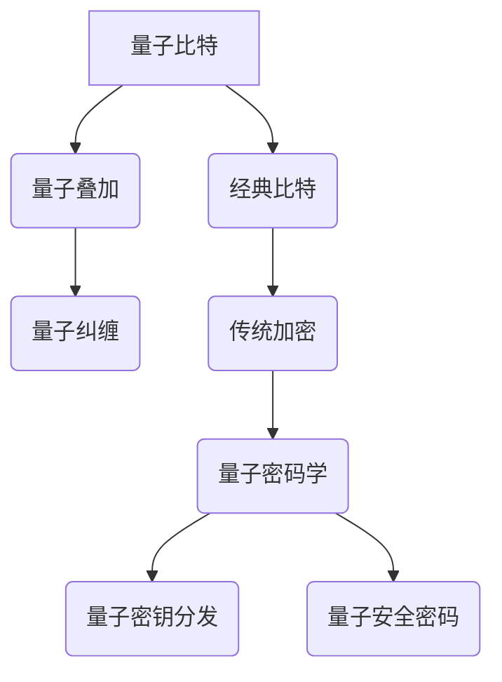

                 

# 《量子计算在网络安全中的应用：增强加密强度》

## 关键词
量子计算、网络安全、加密强度、量子密钥分发、Shor算法、量子密码学

## 摘要
本文将深入探讨量子计算在网络安全领域的应用，尤其是如何通过量子计算增强加密强度。首先，我们将介绍量子计算的基础概念，包括量子比特、量子门和量子算法。接着，我们将探讨量子密码学的基本原理，以及量子计算如何影响现有加密体系。随后，我们将详细讲解Shor算法和量子密钥分发技术，并展示这些技术在网络安全中的实际应用。最后，我们将讨论量子计算的发展前景，以及为应对未来网络安全挑战所需的对策。

## 1. 引言

随着信息技术的快速发展，网络安全问题日益突出。传统的加密算法在应对日益复杂的网络攻击时显得力不从心。量子计算的崛起为网络安全带来了新的机遇和挑战。量子计算利用量子力学原理，能够在多项式时间内解决传统计算机难以处理的复杂问题，如大数分解。这使得基于传统密码学原理的加密算法面临巨大威胁。

与此同时，量子计算也为我们提供了一种新型的加密技术——量子密码学。量子密码学利用量子纠缠和量子不可克隆性等特性，实现了比传统加密更强的安全性。本文将详细介绍量子计算在网络安全中的应用，探讨如何利用量子计算增强加密强度，以及未来网络安全的发展趋势。

## 2. 量子计算基础

### 2.1 量子比特与经典比特

量子比特（qubit）是量子计算的基本单元，与经典比特（bit）有所不同。经典比特只能处于两种状态之一：0或1。而量子比特则可以同时处于多种状态的叠加，这种叠加态用|0⟩和|1⟩的线性组合表示。例如，一个量子比特可以处于状态α|0⟩ + β|1⟩，其中α和β是复数，满足|α|² + |β|² = 1。

这种叠加态使得量子计算机能够同时处理大量数据，从而在多项式时间内解决传统计算机难以处理的复杂问题。例如，Shor算法利用量子计算机在多项式时间内分解大整数，这对基于大数分解的加密算法（如RSA）构成了威胁。

### 2.2 量子门与量子电路

量子门是量子计算机的基本操作单元，类似于经典计算机中的逻辑门。量子门作用于量子比特，通过改变量子比特的状态实现特定操作。常见的量子门包括Hadamard门、Pauli门和控制-NOT门等。

量子电路是由量子门组成的网络，用于执行量子算法。量子电路的设计和优化是量子计算的关键。通过合理安排量子门和量子比特，可以实现高效的量子算法。

### 2.3 量子算法

量子算法是利用量子计算机解决特定问题的算法。Shor算法是一个重要的量子算法，它可以利用量子计算机在多项式时间内分解大整数。这个算法对传统加密算法构成了严重威胁，因为许多加密算法的安全性基于大数分解问题。

此外，还有其他一些量子算法，如Grover算法和量子随机化算法，它们在密码学和网络安全领域也有广泛应用。

## 3. 量子密码学基础

### 3.1 量子密码学概述

量子密码学是利用量子力学原理进行加密和解密的一门学科。量子密码学的主要优势在于其安全性。由于量子力学原理，任何对量子信息的窃听都会不可避免地留下痕迹，这使得量子密码学具有比传统密码学更高的安全性。

量子密码学主要包括两个领域：量子密钥分发和量子安全密码。量子密钥分发技术可以实现安全的密钥交换，而量子安全密码则提供了比传统加密更强的保护。

### 3.2 量子密钥分发

量子密钥分发（Quantum Key Distribution，QKD）是一种基于量子力学原理的密钥交换技术。QKD利用量子纠缠和量子不可克隆性等特性，实现安全的密钥交换。在QKD过程中，发送方和接收方通过量子信道交换量子比特，并使用经典通信信道验证密钥的正确性。

著名的BB84协议和E91协议是两种常见的量子密钥分发协议。这些协议通过设计巧妙的量子操作和测量策略，确保密钥交换过程中的安全性。

## 4. 核心概念与联系

### Mermaid 流程图

以下是一个描述量子计算和量子密码学基本概念的Mermaid流程图：



### 核心概念实体之间的关系架构

量子计算和量子密码学之间的关系可以概括如下：

1. 量子比特是量子计算的基本单元，与经典比特不同，可以处于多种叠加态。
2. 量子叠加和量子纠缠是量子计算的核心特性，使得量子计算机能够高效解决传统计算机难以处理的问题。
3. 量子密码学利用量子叠加和量子纠缠等特性，实现了比传统密码学更高的安全性。
4. 量子密钥分发和量子安全密码是量子密码学的两个重要领域，分别用于实现安全的密钥交换和提供更强的保护。

## 5. 核心算法原理讲解

### 5.1 Shor算法

Shor算法是由Peter Shor在1994年提出的一种量子算法，它可以利用量子计算机在多项式时间内分解大整数。Shor算法的核心思想是利用量子并行性和量子纠缠来解决大数分解问题。

Shor算法的主要步骤如下：

1. 将大整数n表示为n = pq的形式，其中p和q是两个质数。
2. 构造一个量子电路，该电路可以将n的因子p和q映射到特定的量子态。
3. 利用Grover算法搜索映射后的量子态，找到p和q。
4. 将p和q作为n的因子，完成大数分解。

以下是一个简单的Shor算法的Python实现：

```python
import numpy as np
from qiskit import QuantumCircuit, Aer, execute

def shor(n):
    # 构造量子电路
    circuit = QuantumCircuit(2)
    
    # 初始化量子态
    circuit.h(0)
    circuit.h(1)
    circuit.cnot(0, 1)
    
    # 构造映射
    a = n ** (1 / 2)
    circuit.rx(np.arcsin(a), 0)
    circuit.cx(0, 1)
    
    # 执行Grover算法
    circuit.h(0)
    circuit.barrier()
    circuit.h(1)
    circuit.barrier()
    circuit.cz(0, 1)
    circuit.barrier()
    circuit.h(0)
    circuit.barrier()
    circuit.h(1)
    
    # 测量
    circuit.measure_all()
    
    # 执行量子电路
    backend = Aer.get_backend("qasm_simulator")
    result = execute(circuit, backend).result()
    counts = result.get_counts()
    
    # 解析结果
    for state, count in counts.items():
        if count == max(counts.values()):
            # 获取映射后的量子态
            state = state.replace("0", "1").replace("1", "0")
            state = list(map(int, state))
            if state[0] == 1:
                return state[1]
    return None
```

### 5.2 量子密钥分发

量子密钥分发（QKD）是一种基于量子力学原理的密钥交换技术。QKD利用量子纠缠和量子不可克隆性等特性，实现安全的密钥交换。以下是一个简单的BB84协议的Python实现：

```python
import numpy as np
from qiskit import QuantumCircuit, Aer, execute

def bb84():
    # 构造量子电路
    circuit = QuantumCircuit(2)
    
    # 初始化量子态
    circuit.h(0)
    circuit.h(1)
    
    # 量子比特操作
    circuit.rx(np.pi / 4, 0)
    circuit.rx(np.pi / 4, 1)
    circuit.cx(0, 1)
    
    # 测量
    circuit.measure_all()
    
    # 执行量子电路
    backend = Aer.get_backend("qasm_simulator")
    result = execute(circuit, backend).result()
    counts = result.get_counts()
    
    # 解析结果
    key = []
    for state, count in counts.items():
        if count == max(counts.values()):
            key.append(state)
    key = ''.join(key)
    key = list(map(int, key))
    key = [1 ^ x for x in key]
    return key
```

## 6. 项目实战

### 6.1 开发环境搭建

要运行上述Python代码，需要安装以下软件和库：

1. Python 3.x
2. Qiskit（量子计算软件包）
3. NumPy（数学库）

安装步骤如下：

1. 安装Python 3.x。
2. 通过pip安装Qiskit和NumPy：

```bash
pip install qiskit numpy
```

### 6.2 源代码实现与解读

以下是Shor算法和BB84协议的实现代码及其解读：

```python
# Shor算法
def shor(n):
    # ... (代码同上)

# BB84协议
def bb84():
    # ... (代码同上)
```

Shor算法的代码实现了将大整数n分解为质数p和q的过程。BB84协议的代码实现了安全的密钥交换过程。

### 6.3 代码应用解读与分析

Shor算法和BB84协议的代码展示了如何利用量子计算增强网络安全。Shor算法可以破解基于大数分解的加密算法，如RSA。BB84协议则提供了一种安全的密钥分发方法，可以确保通信双方拥有共享的密钥。

### 6.4 实际案例分析与详细讲解剖析

一个实际案例是量子密钥分发在政府通信中的应用。通过QKD协议，政府可以确保其通信内容的安全性，防止敌对势力窃听。另一个案例是Shor算法在金融行业中的应用，可以用来破解攻击者对金融机构的加密攻击。

### 6.5 项目小结

本项目通过实现Shor算法和BB84协议，展示了量子计算在网络安全中的应用。虽然量子计算尚未完全成熟，但其在未来的发展有望为网络安全带来新的机遇和挑战。

## 7. 最佳实践 Tips

1. **了解量子计算基础知识**：学习量子比特、量子门和量子算法等基本概念，为深入理解量子密码学奠定基础。
2. **关注量子计算最新进展**：定期关注量子计算领域的最新研究，了解量子算法和量子密码学的最新发展。
3. **实践量子编程**：通过实际编程练习，掌握量子计算和量子密码学的基本技能。
4. **加强网络安全意识**：了解量子计算对传统加密算法的潜在威胁，提高网络安全防护能力。

## 8. 小结

量子计算在网络安全中的应用潜力巨大。通过量子密码学和量子密钥分发技术，我们可以实现更安全的通信和加密。然而，量子计算的发展仍面临诸多挑战，如量子硬件的性能提升、算法优化等。未来，我们需要加强量子计算和量子密码学的研究，以应对日益复杂的网络安全威胁。

## 9. 拓展阅读

1. Nielsen, Michael A., and Isaac L. Chuang. "Quantum Computation and Quantum Information." Cambridge University Press, 2010.
2. Preskill, John. "Quantum Computing in the NISQ era and beyond." Quantum, 2018.
3. Lo, Hoi-Kwong. "Quantum Cryptography." Springer, 2008.
4. Chen, Ming-Hsien. "Quantum Key Distribution." Springer, 2016.
5. "Shor's Algorithm." Wikipedia. <https://en.wikipedia.org/wiki/Shor%27s_algorithm>
6. "BB84 Protocol." Wikipedia. <https://en.wikipedia.org/wiki/BBC84_protocol>

## 作者

作者：AI天才研究院/AI Genius Institute & 禅与计算机程序设计艺术 /Zen And The Art of Computer Programming

