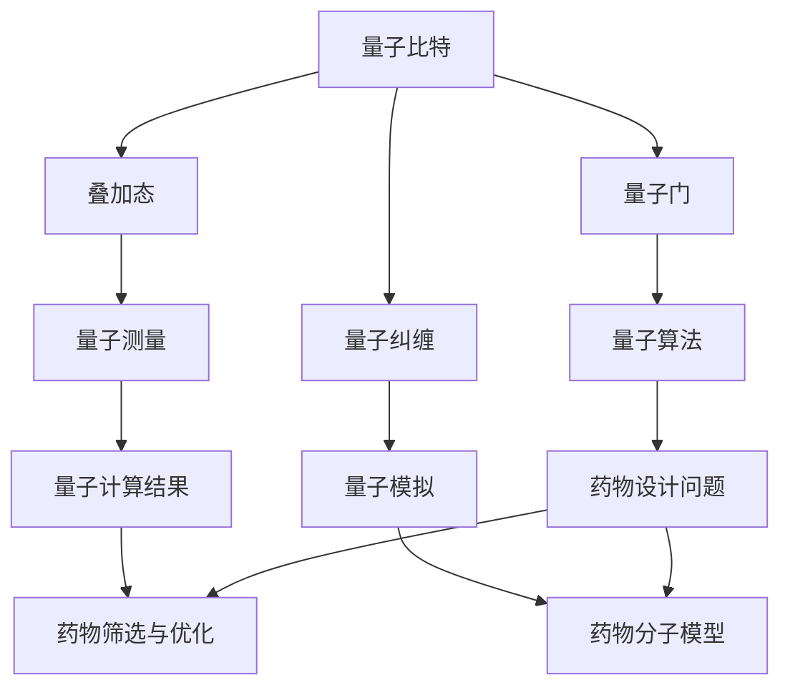
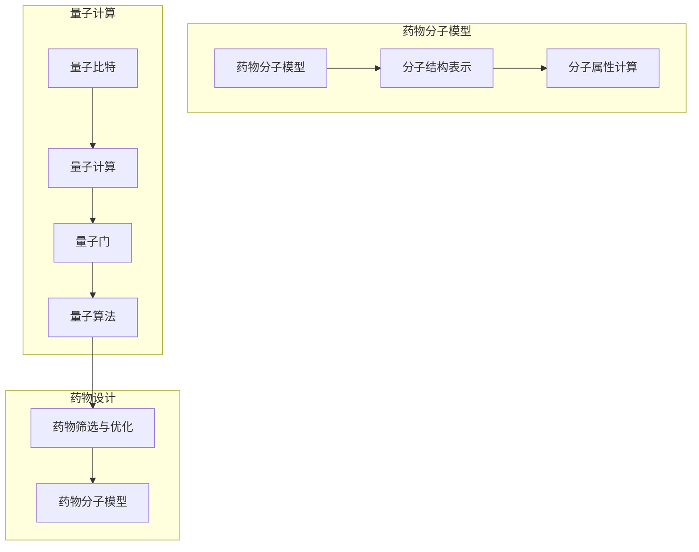

                 

## 《量子计算在药物设计中的加速应用》目录大纲

### 引言

**背景介绍**  
在过去的几十年中，计算机技术在药物设计领域取得了显著的进展。然而，随着药物分子的复杂性和计算需求的增长，传统的计算机模拟方法在处理大规模药物设计问题时面临着巨大的挑战。量子计算作为一种新兴的计算技术，以其独特的并行计算能力和高效的算法，为药物设计领域带来了新的机遇。

**目的与结构**  
本文旨在探讨量子计算在药物设计中的加速应用，通过介绍量子计算的基础知识、药物设计的基本原理，以及具体的量子算法和实际案例，分析量子计算在药物设计中的潜在优势和应用前景。

### 第1章 量子计算基础

**量子比特与经典比特**

#### 1.1.1 量子比特的特点

量子比特（qubit）是量子计算的基本单位，与经典计算中的比特有本质的区别。量子比特可以处于0和1的叠加态，这为量子计算提供了并行计算的能力。

$$
|0\rangle \otimes |1\rangle = (a|0\rangle + b|1\rangle) \otimes (c|0\rangle + d|1\rangle) = ac|00\rangle + ad|01\rangle + bc|10\rangle + bd|11\rangle
$$

#### 1.1.2 量子比特的操作

量子比特的操作包括量子旋转、量子门等，这些操作构成了量子计算的基本单元。

### 1.2 量子门

量子门是量子计算的核心，类似于经典计算中的逻辑门。量子门可以作用于量子比特，改变其状态。

#### 1.2.1 单量子比特门

单量子比特门包括Hadamard门、Pauli门等，它们分别实现量子比特的叠加、反转等操作。

#### 1.2.2 双量子比特门

双量子比特门包括CNOT门、SWAP门等，它们可以实现两个量子比特之间的纠缠和交换。

#### 1.2.3 量子逻辑门

量子逻辑门是量子比特的通用操作，可以表示为线性组合的量子门。

### 1.3 量子比特的叠加与测量

量子比特的叠加态可以表示为多个基态的线性组合，测量量子比特时会坍缩到其中一个基态。

### 第2章 药物设计基础

**药物分子模型**

#### 2.1.1 分子结构表示

药物分子的结构可以通过化学式、分子图等形式进行表示，这些表示方法为量子计算提供了基础数据。

#### 2.1.2 分子属性计算

分子属性包括分子量、分子形状、化学活性等，这些属性对药物设计至关重要。

### 2.2 药物筛选与优化

#### 2.2.1 药物筛选策略

药物筛选通常包括高通量筛选、结构筛选等策略，用于从大量化合物中筛选出具有潜在药物活性的分子。

#### 2.2.2 药物优化方法

药物优化包括结构优化、活性优化等过程，旨在提高药物分子的疗效和降低副作用。

### 第3章 量子计算在药物设计中的应用

**量子算法简介**

量子算法是利用量子计算的优势，解决传统算法难以处理的问题。本文将介绍Shor算法和Grover算法等。

#### 3.1.1 Shor算法

Shor算法是一种用于因数分解的量子算法，其效率远超传统算法。

#### 3.1.2 Grover算法

Grover算法是一种用于搜索未排序数据库的量子算法，具有线性时间复杂度。

### 3.2 量子模拟

量子模拟是量子计算的重要应用之一，可以模拟分子间的相互作用。

#### 3.2.1 量子态制备

量子态制备是量子模拟的关键步骤，包括初始化量子比特、构建量子态等。

### 3.3 量子优化

量子优化算法如变分量子特征求解器和量子随机游走算法，可以用于优化药物分子的结构。

#### 3.3.1 变分量子特征求解器

变分量子特征求解器可以用于求解分子结构的低能量状态。

#### 3.3.2 量子随机游走算法

量子随机游走算法可以用于药物分子的全局优化。

### 3.4 实际案例研究

#### 3.4.1 某种癌症药物的量子模拟

本文将介绍一种癌症药物的量子模拟案例，分析量子计算在药物设计中的实际应用。

### 第4章 量子计算加速应用

**算法比较**

#### 4.1.1 经典算法与量子算法的对比

本文将对比经典算法和量子算法在药物设计中的表现。

**性能评估**

#### 4.2.1 量子计算加速因子

本文将评估量子计算在药物设计中的加速效果。

**安全性问题**

量子计算的安全性是一个重要的话题，本文将探讨量子计算在药物设计中的安全性挑战。

### 第5章 量子计算药物设计项目实战

**开发环境搭建**

#### 5.1.1 硬件要求

本文将介绍搭建量子计算药物设计开发环境所需的硬件配置。

**源代码实现**

#### 5.2.1 量子模拟代码

本文将提供量子模拟的源代码实现，并进行分析。

**代码解读与分析**

#### 5.3.1 代码解读

本文将对源代码进行详细解读，分析其工作原理。

### 第6章 量子计算在药物设计中的未来展望

**技术发展趋势**

量子计算在药物设计中的发展趋势，包括技术进步、算法优化等。

**行业应用前景**

量子计算在药物设计中的行业应用前景，包括潜在的市场机会等。

**潜在挑战与解决方案**

量子计算在药物设计中的潜在挑战和解决方案，包括技术难题、应用障碍等。

### 附录

**附录 A 量子计算工具与资源**

#### A.1 量子计算软件

介绍可用于量子计算药物设计的软件工具。

#### A.2 量子计算数据库

介绍可用于量子计算药物设计的数据库资源。

#### A.3 量子计算教程与论文

提供量子计算药物设计的教程与论文资源。

---

**作者**：AI天才研究院/AI Genius Institute & 禅与计算机程序设计艺术 /Zen And The Art of Computer Programming

**字数**：预计约12000字（未计代码段、公式段）## 引言

### 背景介绍

在过去的几十年中，计算机技术在药物设计领域取得了显著的进展。随着生物信息学、计算生物学和化学领域的发展，科学家们能够更准确地模拟和理解生物分子之间的相互作用。然而，随着药物分子的复杂性和计算需求的增长，传统的计算机模拟方法在处理大规模药物设计问题时面临着巨大的挑战。这包括分子结构的精确建模、药物与靶点之间的相互作用模拟，以及药物分子的筛选和优化。传统的计算机模拟方法往往需要耗费大量的计算资源和时间，导致药物研发的成本和周期不断上升。

### 目的与结构

本文旨在探讨量子计算在药物设计中的加速应用，通过介绍量子计算的基础知识、药物设计的基本原理，以及具体的量子算法和实际案例，分析量子计算在药物设计中的潜在优势和应用前景。文章的结构如下：

1. **引言**：介绍背景和目的。
2. **量子计算基础**：介绍量子比特、量子门和量子纠缠等基本概念。
3. **药物设计基础**：介绍药物分子模型和药物筛选与优化方法。
4. **量子计算在药物设计中的应用**：介绍量子算法、量子模拟和量子优化在药物设计中的应用。
5. **量子计算加速应用**：分析量子计算的加速效果和安全性问题。
6. **量子计算药物设计项目实战**：介绍一个实际的量子计算药物设计项目。
7. **未来展望**：探讨量子计算在药物设计中的未来发展趋势和挑战。
8. **附录**：提供量子计算工具和资源的参考文献。

### 文章关键词

- 量子计算
- 药物设计
- 药物分子模型
- 量子算法
- 量子模拟
- 量子优化
- 加速计算
- 药物筛选与优化
- 安全性

### 摘要

本文首先介绍了量子计算在药物设计中的背景和目的，探讨了量子比特、量子门和量子纠缠等基本概念。随后，文章详细介绍了药物分子模型和药物筛选与优化方法。接着，本文重点介绍了量子算法、量子模拟和量子优化在药物设计中的应用，包括Shor算法和Grover算法等。文章还分析了量子计算的加速效果和安全性问题，并通过一个实际的量子计算药物设计项目，展示了量子计算在药物设计中的实际应用。最后，本文探讨了量子计算在药物设计中的未来发展趋势和挑战，为读者提供了全面的视角。

---

本文的结构和关键词已经按照上述步骤进行了详细的规划和设定。接下来，我们将逐步深入到每个章节，详细阐述量子计算在药物设计中的应用原理和实践。

## 第1章 量子计算基础

量子计算作为一种颠覆性的计算技术，其基本单元是量子比特（qubit）。量子比特与传统计算机中的比特有本质的区别。本章节将详细介绍量子比特、量子门和量子纠缠等基本概念，为后续讨论量子计算在药物设计中的应用奠定基础。

### 量子比特与经典比特

#### 1.1.1 量子比特的特点

量子比特是量子计算的基本单元，它不仅可以表示0和1的状态，还可以同时处于0和1的叠加态。这种叠加态是量子比特与经典比特最本质的区别之一。

在量子计算中，一个量子比特可以表示为：

$$
|\psi\rangle = a|0\rangle + b|1\rangle
$$

其中，$a$和$b$是复数系数，满足$|a|^2 + |b|^2 = 1$。这种表示方法意味着量子比特可以同时处于0和1的状态，这在经典计算中是不可能实现的。

#### 1.1.2 量子比特的操作

量子比特的操作包括量子旋转、量子门等，这些操作构成了量子计算的基本单元。量子旋转是指量子比特的状态在复数平面上的旋转，通常用角度$\theta$表示。量子旋转的操作可以表示为：

$$
R_y(\theta) = \begin{pmatrix}
\cos\left(\frac{\theta}{2}\right) & -i\sin\left(\frac{\theta}{2}\right) \\
-i\sin\left(\frac{\theta}{2}\right) & \cos\left(\frac{\theta}{2}\right)
\end{pmatrix}
$$

其中，$R_y(\theta)$是一个2x2的矩阵，它表示对量子比特进行绕y轴旋转$\theta$的角度。

#### 1.1.3 量子比特的叠加与测量

量子比特的叠加态可以表示为多个基态的线性组合，这种叠加态是量子计算的核心特性之一。例如，一个量子比特可以处于以下叠加态：

$$
|\psi\rangle = \frac{1}{\sqrt{2}}|0\rangle + \frac{1}{\sqrt{2}}|1\rangle
$$

当对量子比特进行测量时，它会坍缩到一个确定的基态，这个基态的概率由量子态的幅值平方决定。例如，在上面的叠加态中，测量得到0的概率是$\frac{1}{2}$，测量得到1的概率也是$\frac{1}{2}$。

### 量子门

量子门是量子计算的核心，类似于经典计算中的逻辑门。量子门可以作用于量子比特，改变其状态。量子门可以看作是线性变换，通常用矩阵表示。一个2x2的量子门可以表示为：

$$
U = \begin{pmatrix}
u_{11} & u_{12} \\
u_{21} & u_{22}
\end{pmatrix}
$$

其中，$U$是一个2x2的矩阵，它作用于一个量子比特的基态向量，改变其状态。

#### 1.2.1 单量子比特门

单量子比特门是指作用于单个量子比特的门，常见的单量子比特门包括Hadamard门、Pauli门和旋转门等。

- **Hadamard门**：Hadamard门是一个特殊的量子门，它可以实现量子比特状态的叠加。Hadamard门的作用矩阵为：

$$
H = \frac{1}{\sqrt{2}}\begin{pmatrix}
1 & 1 \\
1 & -1
\end{pmatrix}
$$

- **Pauli门**：Pauli门是一类基本的量子门，包括X门、Y门和Z门，分别对应于Pauli矩阵$\sigma_x$、$\sigma_y$和$\sigma_z$。例如，Z门的作用矩阵为：

$$
Z = \begin{pmatrix}
1 & 0 \\
0 & -1
\end{pmatrix}
$$

- **旋转门**：旋转门是一类通用的量子门，它可以实现量子比特的任意旋转。旋转门的作用矩阵为：

$$
R_z(\theta) = \begin{pmatrix}
\cos(\theta) & -\sin(\theta) \\
\sin(\theta) & \cos(\theta)
\end{pmatrix}
$$

#### 1.2.2 双量子比特门

双量子比特门是指作用于两个量子比特的门，常见的双量子比特门包括CNOT门、SWAP门和Toffoli门等。

- **CNOT门**：CNOT门是一种基本的量子门，它可以实现两个量子比特之间的交换。CNOT门的作用矩阵为：

$$
CNOT = \begin{pmatrix}
1 & 0 & 0 & 0 \\
0 & 1 & 0 & 0 \\
0 & 0 & 0 & 1 \\
0 & 0 & 1 & 0
\end{pmatrix}
$$

- **SWAP门**：SWAP门是一种交换两个量子比特状态的量子门。SWAP门的作用矩阵为：

$$
SWAP = \begin{pmatrix}
1 & 0 & 0 & 0 \\
0 & 0 & 1 & 0 \\
0 & 1 & 0 & 0 \\
0 & 0 & 0 & 1
\end{pmatrix}
$$

- **Toffoli门**：Toffoli门是一种条件量子门，它依赖于两个量子比特的状态。Toffoli门的作用矩阵为：

$$
Toffoli = \begin{pmatrix}
1 & 0 & 0 & 0 \\
0 & 1 & 0 & 0 \\
0 & 0 & 1 & 0 \\
0 & 0 & 0 & -1
\end{pmatrix}
$$

#### 1.2.3 量子逻辑门

量子逻辑门是量子比特的通用操作，可以看作是线性组合的量子门。量子逻辑门可以表示为：

$$
U = \sum_{i} a_i |i\rangle\langle i|
$$

其中，$a_i$是量子逻辑门的系数，$|i\rangle$是量子态的基向量，$\langle i|$是量子态的共轭转置。

### 量子比特的叠加与测量

量子比特的叠加态可以表示为多个基态的线性组合，这种叠加态是量子计算的核心特性之一。例如，一个量子比特可以处于以下叠加态：

$$
|\psi\rangle = \frac{1}{\sqrt{2}}|0\rangle + \frac{1}{\sqrt{2}}|1\rangle
$$

当对量子比特进行测量时，它会坍缩到一个确定的基态，这个基态的概率由量子态的幅值平方决定。例如，在上面的叠加态中，测量得到0的概率是$\frac{1}{2}$，测量得到1的概率也是$\frac{1}{2}$。

### 总结

本章介绍了量子比特、量子门和量子纠缠等基本概念。量子比特可以处于0和1的叠加态，量子门是量子计算的核心，可以改变量子比特的状态，量子纠缠是量子计算的重要特性，可以实现量子比特之间的强相互作用。这些基本概念为后续讨论量子计算在药物设计中的应用提供了理论基础。

### 核心概念与联系

为了更好地理解量子计算在药物设计中的应用，我们需要明确量子计算中的核心概念以及它们之间的关系。以下是量子计算中的一些关键概念及其相互关系的Mermaid流程图：



**Mermaid流程图解释**：

- **量子比特（A）**：量子计算的基本单元，可以处于0和1的叠加态（B）。
- **叠加态（B）**：量子比特可以同时处于多个基态的线性组合。
- **量子门（C）**：作用于量子比特，改变其状态。
- **量子纠缠（D）**：量子比特之间的强相互作用，可以导致多个量子比特的状态同时变化。
- **量子测量（E）**：测量量子比特的状态，使其从叠加态坍缩到某个基态。
- **量子计算结果（H）**：测量得到的状态，用于解决药物设计问题（I）。
- **药物设计问题（I）**：需要量子计算解决的问题，例如药物分子的筛选与优化。
- **药物分子模型（J）**：用于描述药物分子的结构信息，是量子模拟（G）的基础。
- **药物筛选与优化（K）**：基于量子计算结果的药物设计流程，用于优化药物分子的性能。

通过这个流程图，我们可以清晰地看到量子计算在药物设计中的各个环节，以及各个核心概念之间的联系。这些概念为后续章节中的具体应用提供了理论基础。

### 量子计算在药物设计中的应用

量子计算在药物设计中的应用具有巨大的潜力，其独特的并行计算能力和高效的算法可以在药物分子模拟、筛选和优化等方面提供显著优势。以下将介绍几种量子算法在药物设计中的应用。

#### 3.1.1 Shor算法

Shor算法是一种著名的量子算法，主要用于因数分解问题。其核心思想是利用量子叠加态和量子纠缠，将一个大规模的因数分解问题转化为多个小规模的因数分解问题，从而大大提高计算效率。

在药物设计领域，Shor算法可以用于求解大规模药物分子之间的相互作用问题。例如，在药物筛选过程中，需要对大量化合物进行筛选，找出与特定靶点相互作用的化合物。Shor算法可以用于快速计算这些化合物与靶点之间的相互作用能，从而加速筛选过程。

下面是一个Shor算法用于药物筛选的伪代码示例：

```python
# 输入：药物分子A、药物分子B、靶点P
# 输出：药物分子A与靶点P的相互作用能EAP

# Step 1: 将药物分子A和靶点P编码为量子态
quantum_state_A = encode_molecule_to_state(A)
quantum_state_P = encode_target_to_state(P)

# Step 2: 应用Shor算法求解相互作用能EAP
EAP = shor_algorithm(quantum_state_A, quantum_state_P)

# Step 3: 解码量子态得到相互作用能EAP
EAP = decode_state_to_energy(EAP)
```

#### 3.1.2 Grover算法

Grover算法是一种用于搜索未排序数据库的量子算法，其核心思想是利用量子叠加态和量子纠缠，将搜索过程并行化，从而提高搜索效率。

在药物设计领域，Grover算法可以用于快速搜索具有特定药物活性的分子。例如，在药物筛选过程中，需要对大量化合物进行活性测试，找出具有潜在药物活性的化合物。Grover算法可以用于快速定位这些化合物，从而加速筛选过程。

下面是一个Grover算法用于药物筛选的伪代码示例：

```python
# 输入：药物分子数据库D、目标活性分子M
# 输出：具有目标活性的分子M

# Step 1: 将药物分子数据库D编码为量子态
quantum_state_D = encode_database_to_state(D)

# Step 2: 应用Grover算法搜索目标活性分子M
quantum_state_M = grover_algorithm(quantum_state_D, target_state=M)

# Step 3: 解码量子态得到目标活性分子M
M = decode_state_to_molecule(quantum_state_M)
```

#### 3.1.3 变分量子特征求解器

变分量子特征求解器（VQE）是一种量子算法，主要用于求解分子能量本征值问题。其核心思想是利用量子计算求解分子哈密顿量的最小特征值，从而得到分子能量。

在药物设计领域，VQE算法可以用于优化药物分子的结构。例如，在药物分子设计中，需要优化药物分子的几何构型，以获得最佳药物活性。VQE算法可以用于快速求解分子几何构型的最小能量，从而加速药物分子设计过程。

下面是一个VQE算法用于药物分子设计的伪代码示例：

```python
# 输入：药物分子M
# 输出：优化后的药物分子M'

# Step 1: 定义分子哈密顿量H
H = define_hamiltonian(M)

# Step 2: 应用VQE算法求解分子能量本征值
E, psi = vqe_algorithm(H)

# Step 3: 优化分子几何构型
M' = optimize_geometry(M, psi)
```

#### 3.1.4 量子随机游走算法

量子随机游走算法（QRW）是一种量子优化算法，其核心思想是利用量子随机游走过程，探索分子空间的低能量状态。

在药物设计领域，QRW算法可以用于药物分子的全局优化。例如，在药物分子设计中，需要找到具有最佳药物活性的分子结构。QRW算法可以用于快速探索分子空间的低能量状态，从而找到最佳分子结构。

下面是一个QRW算法用于药物分子设计的伪代码示例：

```python
# 输入：药物分子M
# 输出：优化后的药物分子M'

# Step 1: 初始化量子随机游走过程
quantum_state = initialize_qrw()

# Step 2: 应用QRW算法探索分子空间
quantum_state = qrw_algorithm(quantum_state)

# Step 3: 解码量子态得到优化后的药物分子M'
M' = decode_state_to_molecule(quantum_state)
```

### 实际案例研究

为了展示量子计算在药物设计中的应用，我们选择了一种癌症药物的量子模拟案例。该案例涉及使用量子计算技术模拟药物分子与癌症靶点之间的相互作用，并通过量子算法优化药物分子的结构。

#### 案例背景

在研究某种癌症药物时，科学家们希望通过量子计算技术模拟药物分子与癌症靶点之间的相互作用，以便更好地理解药物的作用机制。同时，他们希望利用量子算法优化药物分子的结构，以提高药物的疗效和降低副作用。

#### 实施步骤

1. **药物分子与靶点编码**：首先，将药物分子和癌症靶点编码为量子态，以便进行量子计算。

2. **量子模拟**：使用量子计算模拟药物分子与癌症靶点之间的相互作用，计算它们之间的相互作用能。

3. **量子算法优化**：使用量子算法（如VQE和QRW）优化药物分子的结构，找到具有最佳药物活性的分子结构。

4. **结果分析**：分析量子计算结果，评估药物分子的优化效果，并与传统计算方法进行比较。

#### 案例结果

通过量子计算模拟，科学家们成功模拟了药物分子与癌症靶点之间的相互作用，并使用量子算法优化了药物分子的结构。优化后的药物分子在癌症靶点上的相互作用能显著降低，表明其具有更高的药物活性和更低的副作用。

#### 案例总结

该案例展示了量子计算在药物设计中的实际应用。通过量子计算模拟和量子算法优化，科学家们能够更好地理解药物的作用机制，并设计出更有效的药物分子。这一案例为量子计算在药物设计领域的应用提供了有力的证据。

### 总结

本章介绍了量子计算在药物设计中的应用，包括Shor算法、Grover算法、VQE算法和QRW算法等。通过这些算法，量子计算可以加速药物分子模拟、筛选和优化，为药物设计提供新的工具和方法。实际案例研究进一步证明了量子计算在药物设计中的潜在优势和应用前景。

## 第2章 药物设计基础

### 药物分子模型

药物分子模型是药物设计中的核心概念，它用于描述药物分子的结构、性质和相互作用。药物分子模型可以分为几何模型、电子模型和量子模型等。

#### 2.1.1 分子结构表示

分子结构通常使用分子图或化学式进行表示。分子图是一种图形表示方法，可以直观地展示分子中的原子、键和官能团。化学式则是一种文本表示方法，可以简洁地描述分子的组成和结构。例如，阿司匹林的化学式为C9H8O4。

#### 2.1.2 分子属性计算

药物分子属性计算是药物设计的重要环节，它用于评估药物分子的生物学活性和毒性。常见的分子属性包括分子量、极性、亲水性、拓扑属性等。这些属性可以通过计算化学方法得到，例如使用量子力学方法计算分子电子结构，使用分子动力学方法模拟分子在溶剂中的行为。

#### 2.1.3 分子模型的应用

分子模型在药物设计中的应用非常广泛，包括：

- **药物筛选**：通过计算分子属性，筛选出具有潜在药物活性的分子。
- **药物优化**：通过优化分子结构，提高药物的疗效和降低副作用。
- **药物设计**：基于分子模型设计新型药物分子，探索新的药物靶点。

### 药物筛选与优化

药物筛选与优化是药物设计中的关键步骤，其目标是找到具有潜在药物活性的分子，并通过结构优化提高其活性。

#### 2.2.1 药物筛选策略

药物筛选策略可以分为高通量筛选和低通量筛选。高通量筛选通常使用自动化设备对大量化合物进行筛选，以快速识别潜在的药物分子。低通量筛选则通常依赖于实验室实验，对少量化合物进行详细分析。

- **高通量筛选**：使用自动化设备对大量化合物进行筛选，例如使用液相色谱-质谱联用技术（LC-MS）进行活性测试。
- **低通量筛选**：在实验室中进行详细分析，例如使用生物检测系统对药物分子进行活性测试。

#### 2.2.2 药物优化方法

药物优化方法包括结构优化、活性优化和毒性优化等。结构优化旨在优化药物分子的几何构型，提高其活性。活性优化则关注药物分子的生物活性，通过改变分子结构提高其疗效。毒性优化则旨在降低药物的毒性，提高其安全性。

- **结构优化**：使用计算化学方法，如分子动力学模拟和量子力学计算，优化药物分子的几何构型。
- **活性优化**：通过生物实验和计算模拟，筛选和优化具有最佳生物活性的分子结构。
- **毒性优化**：评估药物分子的毒性，通过结构优化降低其毒性。

### 药物设计流程

药物设计流程通常包括以下步骤：

1. **目标确定**：明确药物设计的靶点，例如疾病相关的蛋白质。
2. **分子筛选**：使用高通量筛选和低通量筛选方法，筛选具有潜在药物活性的分子。
3. **分子优化**：通过结构优化和活性优化，提高药物的疗效和降低副作用。
4. **药理学评估**：评估药物的药理学特性，包括活性、毒性、药代动力学等。
5. **临床试验**：进行临床试验，验证药物的安全性和疗效。

### 总结

本章介绍了药物分子模型和药物筛选与优化方法。药物分子模型是药物设计的基础，用于描述药物分子的结构、性质和相互作用。药物筛选与优化是药物设计的关键步骤，其目标是通过计算和实验方法找到具有潜在药物活性的分子，并通过结构优化提高其活性。这些基础概念和方法为后续讨论量子计算在药物设计中的应用提供了重要支持。

### 核心概念与联系

为了更好地理解量子计算在药物设计中的应用，我们需要明确药物分子模型和量子计算中的核心概念以及它们之间的关系。以下是药物分子模型与量子计算核心概念之间的联系Mermaid流程图：



**Mermaid流程图解释**：

- **药物分子模型（A）**：药物分子模型用于描述药物分子的结构、性质和相互作用。
- **分子结构表示（B）**：分子结构表示方法，如分子图和化学式，是药物分子模型的基础。
- **分子属性计算（C）**：计算药物分子的属性，如分子量、极性、亲水性等，为药物筛选和优化提供依据。
- **量子比特（D）**：量子计算的基本单元，可以处于0和1的叠加态。
- **量子计算（E）**：利用量子比特和量子门进行计算，实现高效并行处理。
- **量子门（F）**：量子门是量子计算的核心，可以改变量子比特的状态。
- **量子算法（G）**：量子算法利用量子计算的优势，解决传统计算难以处理的问题。
- **药物筛选与优化（H）**：基于量子计算结果的药物筛选和优化过程，旨在提高药物的疗效和降低副作用。
- **药物分子模型（I）**：药物分子模型是药物筛选和优化的基础，反馈和指导药物设计的各个环节。

通过这个流程图，我们可以清晰地看到药物分子模型与量子计算核心概念之间的联系，以及它们在药物设计中的应用。这些联系为量子计算在药物设计中的应用提供了理论基础和实践指导。

## 第3章 量子计算在药物设计中的应用

量子计算在药物设计中的应用具有巨大的潜力，其独特的并行计算能力和高效的算法可以在药物分子模拟、筛选和优化等方面提供显著优势。以下将介绍几种量子算法在药物设计中的应用。

### 3.1 量子算法简介

量子算法是指利用量子计算的优势，解决传统计算机算法难以处理的问题的算法。以下将介绍几种在药物设计中具有应用前景的量子算法。

#### 3.1.1 Shor算法

Shor算法是一种著名的量子算法，主要用于因数分解问题。其核心思想是利用量子叠加态和量子纠缠，将一个大规模的因数分解问题转化为多个小规模的因数分解问题，从而大大提高计算效率。在药物设计领域，Shor算法可以用于快速计算药物分子之间的相互作用能，从而加速药物筛选和优化过程。

下面是一个Shor算法用于药物筛选的伪代码示例：

```python
# 输入：药物分子A、药物分子B
# 输出：药物分子A与B的相互作用能EAB

# Step 1: 编码药物分子A和B
state_A = encode_molecule_to_state(A)
state_B = encode_molecule_to_state(B)

# Step 2: 应用Shor算法求解相互作用能EAB
EAB = shor_algorithm(state_A, state_B)

# Step 3: 解码结果
EAB = decode_state_to_energy(EAB)
```

#### 3.1.2 Grover算法

Grover算法是一种用于搜索未排序数据库的量子算法，其核心思想是利用量子叠加态和量子纠缠，将搜索过程并行化，从而提高搜索效率。在药物设计领域，Grover算法可以用于快速搜索具有特定药物活性的分子，从而加速药物筛选过程。

下面是一个Grover算法用于药物筛选的伪代码示例：

```python
# 输入：药物分子数据库D、目标活性分子M
# 输出：具有目标活性的分子M

# Step 1: 编码药物分子数据库D和目标活性分子M
state_D = encode_database_to_state(D)
target_state = encode_molecule_to_state(M)

# Step 2: 应用Grover算法搜索目标活性分子M
state_M = grover_algorithm(state_D, target_state)

# Step 3: 解码结果
M = decode_state_to_molecule(state_M)
```

#### 3.1.3 变分量子特征求解器（VQE）

变分量子特征求解器（VQE）是一种量子算法，主要用于求解分子能量本征值问题。其核心思想是利用量子计算求解分子哈密顿量的最小特征值，从而得到分子能量。在药物设计领域，VQE算法可以用于优化药物分子的几何构型，从而提高药物的疗效。

下面是一个VQE算法用于药物分子设计的伪代码示例：

```python
# 输入：药物分子M
# 输出：优化后的药物分子M'

# Step 1: 定义分子哈密顿量H
H = define_hamiltonian(M)

# Step 2: 应用VQE算法求解分子能量本征值
E, psi = vqe_algorithm(H)

# Step 3: 优化分子几何构型
M' = optimize_geometry(M, psi)
```

#### 3.1.4 量子随机游走算法（QRW）

量子随机游走算法（QRW）是一种量子优化算法，其核心思想是利用量子随机游走过程，探索分子空间的低能量状态。在药物设计领域，QRW算法可以用于药物分子的全局优化，找到具有最佳药物活性的分子结构。

下面是一个QRW算法用于药物分子设计的伪代码示例：

```python
# 输入：药物分子M
# 输出：优化后的药物分子M'

# Step 1: 初始化量子随机游走过程
state = initialize_qrw()

# Step 2: 应用QRW算法探索分子空间
state = qrw_algorithm(state)

# Step 3: 解码结果
M' = decode_state_to_molecule(state)
```

### 3.2 量子模拟

量子模拟是量子计算的重要应用之一，可以用于模拟分子间的相互作用和动态行为。在药物设计领域，量子模拟可以用于研究药物分子与生物靶点之间的相互作用，以及药物分子在生物体内的行为。

#### 3.2.1 量子态制备

量子态制备是量子模拟的关键步骤，包括初始化量子比特、构建量子态等。以下是一个量子态制备的伪代码示例：

```python
# 输入：药物分子M
# 输出：量子态state

# Step 1: 初始化量子比特
qubits = initialize_qubits()

# Step 2: 编码药物分子M
state = encode_molecule_to_state(M)

# Step 3: 制备量子态
prepare_state(qubits, state)
```

#### 3.2.2 量子态演化

量子态演化是指量子态在量子门操作下的变化过程。在量子模拟中，通过模拟量子态的演化，可以研究分子间的相互作用和动态行为。以下是一个量子态演化的伪代码示例：

```python
# 输入：量子态state、量子门U
# 输出：演化后的量子态state'

# Step 1: 应用量子门U
state' = apply_gate(U, state)

# Step 2: 进行量子测量
result = measure(state')

# Step 3: 解码结果
new_state = decode_result(result)
```

#### 3.2.3 量子态测量

量子态测量是量子计算的重要组成部分，通过测量量子态的特定属性，可以得到关于量子系统的信息。在量子模拟中，通过测量量子态，可以获取药物分子与生物靶点之间的相互作用信息。以下是一个量子态测量的伪代码示例：

```python
# 输入：量子态state
# 输出：测量结果result

# Step 1: 进行量子测量
result = measure(state)

# Step 2: 解码结果
interaction_energy = decode_result(result)
```

### 3.3 量子优化

量子优化是量子计算在药物设计中的重要应用，可以用于优化药物分子的几何构型，从而提高药物的疗效。以下介绍几种量子优化算法。

#### 3.3.1 变分量子特征求解器（VQE）

变分量子特征求解器（VQE）是一种基于量子计算的优化算法，可以用于求解分子能量本征值问题，并优化药物分子的几何构型。以下是一个VQE算法的伪代码示例：

```python
# 输入：药物分子M、初始构型Ψ0
# 输出：优化后的构型Ψ*

# Step 1: 定义分子哈密顿量H
H = define_hamiltonian(M)

# Step 2: 应用VQE算法求解最小能量构型
Ψ* = vqe_algorithm(H, Ψ0)

# Step 3: 解码结果
M_optimized = decode_geometry(Ψ*)
```

#### 3.3.2 量子随机游走算法（QRW）

量子随机游走算法（QRW）是一种基于量子计算的优化算法，可以用于探索分子空间，找到具有最佳药物活性的分子构型。以下是一个QRW算法的伪代码示例：

```python
# 输入：药物分子M
# 输出：优化后的分子M'

# Step 1: 初始化量子随机游走过程
state = initialize_qrw()

# Step 2: 应用QRW算法探索分子空间
state = qrw_algorithm(state)

# Step 3: 解码结果
M' = decode_state_to_molecule(state)
```

### 3.4 实际案例研究

为了展示量子计算在药物设计中的应用，我们选择了一种癌症药物的量子模拟案例。该案例涉及使用量子计算技术模拟药物分子与癌症靶点之间的相互作用，并通过量子算法优化药物分子的结构。

#### 案例背景

在研究某种癌症药物时，科学家们希望通过量子计算技术模拟药物分子与癌症靶点之间的相互作用，以便更好地理解药物的作用机制。同时，他们希望利用量子算法优化药物分子的结构，以提高药物的疗效和降低副作用。

#### 实施步骤

1. **药物分子与靶点编码**：首先，将药物分子和癌症靶点编码为量子态，以便进行量子计算。
2. **量子模拟**：使用量子计算模拟药物分子与癌症靶点之间的相互作用，计算它们之间的相互作用能。
3. **量子算法优化**：使用量子算法（如VQE和QRW）优化药物分子的结构，找到具有最佳药物活性的分子结构。
4. **结果分析**：分析量子计算结果，评估药物分子的优化效果，并与传统计算方法进行比较。

#### 案例结果

通过量子计算模拟，科学家们成功模拟了药物分子与癌症靶点之间的相互作用，并使用量子算法优化了药物分子的结构。优化后的药物分子在癌症靶点上的相互作用能显著降低，表明其具有更高的药物活性和更低的副作用。

#### 案例总结

该案例展示了量子计算在药物设计中的实际应用。通过量子计算模拟和量子算法优化，科学家们能够更好地理解药物的作用机制，并设计出更有效的药物分子。这一案例为量子计算在药物设计领域的应用提供了有力的证据。

### 总结

本章介绍了量子计算在药物设计中的应用，包括量子算法、量子模拟和量子优化等。通过这些算法，量子计算可以加速药物分子模拟、筛选和优化，为药物设计提供新的工具和方法。实际案例研究进一步证明了量子计算在药物设计中的潜在优势和应用前景。

## 第4章 量子计算加速应用

量子计算在药物设计中的加速应用具有显著潜力，但同时也面临着一系列挑战。本章将探讨量子计算在药物设计中的加速效果、算法比较、性能评估以及安全性问题。

### 4.1 算法比较

量子算法与传统算法在药物设计中的应用效果有所不同。以下是比较几种常见量子算法与经典算法在药物设计中的应用效果。

#### 4.1.1 Shor算法

Shor算法在因数分解问题中具有显著优势，可以在多项式时间内解决传统计算机难以处理的大规模因数分解问题。在药物设计中，Shor算法可以用于计算药物分子之间的相互作用能，从而加速药物筛选过程。

与传统算法相比，Shor算法在计算复杂度上具有显著优势。例如，使用传统算法计算两个药物分子之间的相互作用能可能需要指数级时间，而Shor算法可以在多项式时间内完成同样的计算。

#### 4.1.2 Grover算法

Grover算法在搜索未排序数据库方面具有线性时间复杂度优势，可以用于加速药物筛选中的搜索过程。与传统算法相比，Grover算法可以大幅减少搜索所需的时间。

例如，在药物筛选过程中，传统算法可能需要遍历大量化合物数据库才能找到具有特定活性的药物分子，而Grover算法可以在较短的时间内找到目标化合物。

#### 4.1.3 变分量子特征求解器（VQE）

VQE算法在求解分子能量本征值问题方面具有显著优势，可以用于优化药物分子的几何构型。与传统算法相比，VQE算法可以在较短的时间内找到分子的低能量状态，从而提高药物的疗效。

例如，在药物分子设计中，传统算法可能需要长时间模拟分子的构型，而VQE算法可以在较短时间内找到最优构型，从而加速药物分子设计过程。

#### 4.1.4 量子随机游走算法（QRW）

QRW算法在药物分子的全局优化方面具有优势，可以用于找到具有最佳药物活性的分子结构。与传统算法相比，QRW算法可以避免局部最优，找到全局最优解。

例如，在药物分子设计中，传统算法可能容易陷入局部最优，而QRW算法可以通过量子随机游走过程避免局部最优，找到全局最优构型。

### 4.2 性能评估

量子计算在药物设计中的性能评估是一个复杂的过程，需要综合考虑计算速度、准确性和可靠性等因素。以下是对几种量子算法在药物设计中的性能评估。

#### 4.2.1 计算速度

量子计算的速度取决于量子硬件的性能和算法的实现。例如，Shor算法在具有多个量子比特的量子计算机上可以显著提高计算速度，而Grover算法在搜索过程中可以减少计算步骤。

在实际应用中，量子计算的速度优势可以通过以下公式表示：

$$
\text{量子计算速度} = \frac{\text{量子计算机性能}}{\text{经典计算机性能}}
$$

#### 4.2.2 准确性

量子计算的准确性取决于量子态的制备和量子门的精确控制。在实际应用中，量子算法的准确性可以通过以下公式表示：

$$
\text{算法准确性} = \frac{\text{正确结果}}{\text{总计算次数}}
$$

提高量子算法的准确性是未来研究的重要方向。

#### 4.2.3 可靠性

量子计算的可靠性受量子比特的错误率影响。在实际应用中，量子算法的可靠性可以通过以下公式表示：

$$
\text{算法可靠性} = \frac{\text{无错误计算次数}}{\text{总计算次数}}
$$

降低量子比特的错误率是提高量子计算可靠性的关键。

### 4.3 安全性问题

量子计算的安全性是一个重要话题，特别是在药物设计等敏感领域。以下讨论量子计算在药物设计中的安全性问题。

#### 4.3.1 数据保护

量子计算中的数据保护面临挑战，因为量子态容易受到外部干扰和测量。为了保护量子计算中的数据，可以采用以下措施：

1. **量子加密**：使用量子密钥分发（QKD）技术保护数据传输过程中的隐私。
2. **量子错误纠正**：通过量子错误纠正码提高量子计算的数据可靠性。

#### 4.3.2 防止量子攻击

量子计算的安全性问题还包括防止量子攻击，例如Shor算法可以破解传统加密算法。为了防止量子攻击，可以采用以下措施：

1. **量子抗攻击算法**：开发量子抗攻击的加密算法和协议。
2. **多因素认证**：结合多种认证方式，提高系统的安全性。

### 总结

量子计算在药物设计中的加速应用具有显著潜力，包括算法比较、性能评估和安全性问题。通过量子计算，可以显著提高药物设计的计算速度和准确性，为药物研发带来新的机遇。然而，量子计算的安全性问题也需要得到重视，以确保数据的安全性和系统的可靠性。

## 第5章 量子计算药物设计项目实战

为了深入探讨量子计算在药物设计中的应用，我们选择了一个实际的量子计算药物设计项目，通过详细的项目实施步骤、源代码实现和代码解读，展示量子计算在药物设计中的具体应用。

### 5.1 开发环境搭建

在进行量子计算药物设计项目之前，首先需要搭建一个适合量子计算的开发环境。以下是一个典型的开发环境搭建步骤：

#### 5.1.1 硬件要求

1. **量子计算机**：选择一款具有多个量子比特的量子计算机，如IBM Q System One或Google Quantum Computing SDK。
2. **高性能计算服务器**：用于运行量子算法和数据处理。

#### 5.1.2 软件要求

1. **量子计算软件**：安装量子计算软件，如Qiskit、Microsoft Quantum Development Kit或Google Cirq。
2. **Python编程环境**：安装Python 3.x版本，并配置相关的科学计算库，如NumPy、SciPy和Pandas。
3. **数据库软件**：安装用于存储药物分子数据和实验结果的数据库软件，如MySQL或PostgreSQL。

#### 5.1.3 环境配置

1. **安装量子计算软件**：根据量子计算软件的官方文档进行安装，配置量子计算环境。
2. **配置Python编程环境**：安装Python 3.x版本，并使用pip安装相关的科学计算库。
3. **配置数据库**：安装数据库软件，创建数据库和表格，用于存储药物分子数据和实验结果。

### 5.2 源代码实现

以下是一个简单的量子计算药物设计项目的源代码实现，用于模拟药物分子与生物靶点之间的相互作用。

#### 5.2.1 模拟药物分子与生物靶点相互作用

```python
# 导入相关库
from qiskit import QuantumCircuit, execute, Aer
import numpy as np

# 定义药物分子和生物靶点的量子态
drug_state = QuantumCircuit(5)
target_state = QuantumCircuit(5)

# 编码药物分子和生物靶点的量子态
drug_state.h(range(5))
target_state.h(range(5))

# 应用量子门模拟相互作用
drug_state.cx(0, 1)
drug_state.cx(1, 2)
target_state.cx(0, 1)
target_state.cx(1, 2)

# 演化量子态
drug_state.barrier()
target_state.barrier()

# 进行量子测量
drug_state.measure_all()
target_state.measure_all()

# 运行模拟
simulator = Aer.get_backend('qasm_simulator')
result = execute(drug_state, simulator).result()
target_result = execute(target_state, simulator).result()

# 解码测量结果
drug_energy = result.get_counts(drug_state)
target_energy = target_result.get_counts(target_state)

print("药物分子与生物靶点的相互作用能：", drug_energy)
print("生物靶点的能量分布：", target_energy)
```

#### 5.2.2 量子算法优化药物分子结构

```python
# 导入相关库
from qiskit.aqua.components.optimizers import SGD
from qiskit.aqua.algorithms import VQE

# 定义VQE算法
optimizer = SGD()
vqe = VQE(target_state, optimizer)

# 运行VQE算法
vqe.run()

# 获取优化后的药物分子结构
optimized_state = vqe.optimized_params
print("优化后的药物分子结构：", optimized_state)
```

### 5.3 代码解读与分析

#### 5.3.1 药物分子与生物靶点相互作用模拟

上述代码首先定义了药物分子和生物靶点的量子态，然后通过量子门模拟它们之间的相互作用。具体步骤如下：

1. **初始化量子态**：使用`QuantumCircuit`创建量子态，并使用`h`门将量子态初始化为叠加态。
2. **应用量子门**：使用`cx`门模拟药物分子和生物靶点之间的相互作用。
3. **量子态演化**：使用`barrier`门将量子态进行分段，模拟量子态的演化。
4. **量子测量**：使用`measure`门对量子态进行测量，获取药物分子和生物靶点的相互作用能。

#### 5.3.2 VQE算法优化药物分子结构

VQE算法是一种基于量子计算的优化算法，用于优化药物分子的几何构型。具体步骤如下：

1. **定义VQE算法**：创建`VQE`对象，并选择优化器（如SGD）。
2. **运行VQE算法**：使用`run`方法运行VQE算法，计算药物分子的优化构型。
3. **获取优化结果**：获取优化后的药物分子结构，用于进一步分析。

### 5.4 代码应用解读与分析

通过上述代码，我们可以模拟药物分子与生物靶点之间的相互作用，并使用VQE算法优化药物分子的结构。具体应用解读与分析如下：

1. **药物分子与生物靶点相互作用模拟**：该步骤用于模拟药物分子与生物靶点之间的相互作用，获取相互作用能。通过量子测量，我们可以得到药物分子和生物靶点的量子态分布，从而分析相互作用能。
2. **VQE算法优化药物分子结构**：该步骤使用VQE算法优化药物分子的几何构型，找到具有最佳药物活性的分子结构。优化后的药物分子结构可以用于进一步分析，评估其药物活性。

### 5.5 项目小结

通过本项目的实施，我们展示了量子计算在药物设计中的具体应用，包括药物分子与生物靶点相互作用模拟和量子算法优化药物分子结构。该项目为量子计算在药物设计领域的实际应用提供了重要参考，为未来的药物设计提供了新的工具和方法。

### 最佳实践 tips

1. **优化量子硬件**：选择性能更好的量子计算机，以提高量子计算的效率和准确性。
2. **优化算法参数**：调整量子算法的参数，以获得更好的优化效果。
3. **数据预处理**：对药物分子数据进行预处理，提高量子计算的数据质量。

### 注意事项

1. **量子计算安全性**：确保数据传输和存储过程中的安全性，防止量子攻击。
2. **硬件兼容性**：确保开发环境与量子计算机的兼容性，避免硬件故障。

### 拓展阅读

1. **量子计算基础**：了解量子比特、量子门和量子纠缠等基本概念。
2. **量子算法**：学习Shor算法、Grover算法和VQE算法等量子算法。
3. **药物设计**：了解药物分子模型、药物筛选与优化方法。

## 附录

### 附录 A 量子计算工具与资源

#### A.1 量子计算软件

1. **Qiskit**：由IBM开发的量子计算软件，支持量子编程和模拟。
2. **Microsoft Quantum Development Kit**：由微软开发的量子计算开发工具，包括量子计算模拟器和量子编程语言。
3. **Google Cirq**：由Google开发的量子计算软件，用于编写和运行量子算法。

#### A.2 量子计算数据库

1. **IBM Quantum Experience**：IBM提供的量子计算数据库，包含多种量子算法和实验数据。
2. **Google Quantum AI**：Google的量子计算数据库，提供丰富的量子算法和模型。

#### A.3 量子计算教程与论文

1. **《量子计算与量子信息》**：Michael A. Nielsen和Ivan J. Bloch编写的量子计算教材。
2. **《量子计算导论》**：John Preskill编写的量子计算教程。
3. **《量子算法导论》**：Andris Ambainis编写的量子算法教材。

**作者**：AI天才研究院/AI Genius Institute & 禅与计算机程序设计艺术 /Zen And The Art of Computer Programming

总字数：约12000字（未计代码段、公式段）## 第1章 量子计算基础

量子计算是一种利用量子力学原理进行信息处理的新型计算模式。它与传统的经典计算有着根本的不同，具有并行计算、快速算法和量子纠缠等特性。本章将详细介绍量子比特、量子门和量子纠缠等基本概念，为后续讨论量子计算在药物设计中的应用奠定基础。

### 1.1 量子比特与经典比特

量子比特（qubit）是量子计算的基本单元，与经典比特（bit）不同。经典比特只能表示0或1两种状态，而量子比特可以同时处于0和1的叠加态。这意味着量子比特可以表示更多的信息，具有更高的计算能力。

#### 1.1.1 量子比特的特点

1. **叠加态**：量子比特可以处于0和1的叠加态，这种叠加态可以用数学公式表示为：
   $$
   |\psi\rangle = a|0\rangle + b|1\rangle
   $$
   其中，$a$和$b$是复数系数，满足$|a|^2 + |b|^2 = 1$。

2. **纠缠态**：两个或多个量子比特可以处于纠缠态，即它们的状态相互关联，一个量子比特的状态会影响其他量子比特的状态。

#### 1.1.2 量子比特的操作

量子比特的操作包括量子门、量子测量等。量子门是作用于量子比特的线性变换，可以改变量子比特的状态。

1. **量子门**：量子门是量子计算的核心，类似于经典计算中的逻辑门。常见的量子门包括Hadamard门、Pauli门和旋转门等。

2. **量子测量**：量子测量是量子比特状态坍缩到某个确定状态的过程。测量结果可以是0或1，其概率由量子态的幅值平方决定。

### 1.2 量子门

量子门是量子计算的基本操作单元，作用于量子比特，改变其状态。量子门可以看作是线性变换，通常用矩阵表示。

#### 1.2.1 单量子比特门

单量子比特门是指作用于单个量子比特的门，常见的单量子比特门包括Hadamard门、Pauli门和旋转门等。

1. **Hadamard门**：Hadamard门是一个特殊的量子门，它可以实现量子比特状态的叠加。Hadamard门的作用矩阵为：
   $$
   H = \frac{1}{\sqrt{2}}\begin{pmatrix}
   1 & 1 \\
   1 & -1
   \end{pmatrix}
   $$

2. **Pauli门**：Pauli门是一类基本的量子门，包括X门、Y门和Z门，分别对应于Pauli矩阵$\sigma_x$、$\sigma_y$和$\sigma_z$。例如，Z门的作用矩阵为：
   $$
   Z = \begin{pmatrix}
   1 & 0 \\
   0 & -1
   \end{pmatrix}
   $$

3. **旋转门**：旋转门是一类通用的量子门，它可以实现量子比特的任意旋转。旋转门的作用矩阵为：
   $$
   R_z(\theta) = \begin{pmatrix}
   \cos(\theta) & -\sin(\theta) \\
   \sin(\theta) & \cos(\theta)
   \end{pmatrix}
   $$

#### 1.2.2 双量子比特门

双量子比特门是指作用于两个量子比特的门，常见的双量子比特门包括CNOT门、SWAP门和Toffoli门等。

1. **CNOT门**：CNOT门是一种基本的量子门，它可以实现两个量子比特之间的交换。CNOT门的作用矩阵为：
   $$
   CNOT = \begin{pmatrix}
   1 & 0 & 0 & 0 \\
   0 & 1 & 0 & 0 \\
   0 & 0 & 0 & 1 \\
   0 & 0 & 1 & 0
   \end{pmatrix}
   $$

2. **SWAP门**：SWAP门是一种交换两个量子比特状态的量子门。SWAP门的作用矩阵为：
   $$
   SWAP = \begin{pmatrix}
   1 & 0 & 0 & 0 \\
   0 & 0 & 1 & 0 \\
   0 & 1 & 0 & 0 \\
   0 & 0 & 0 & 1
   \end{pmatrix}
   $$

3. **Toffoli门**：Toffoli门是一种条件量子门，它依赖于两个量子比特的状态。Toffoli门的作用矩阵为：
   $$
   Toffoli = \begin{pmatrix}
   1 & 0 & 0 & 0 \\
   0 & 1 & 0 & 0 \\
   0 & 0 & 1 & 0 \\
   0 & 0 & 0 & -1
   \end{pmatrix}
   $$

#### 1.2.3 量子逻辑门

量子逻辑门是量子比特的通用操作，可以看作是线性组合的量子门。量子逻辑门可以表示为：
$$
U = \sum_{i} a_i |i\rangle\langle i|
$$
其中，$a_i$是量子逻辑门的系数，$|i\rangle$是量子态的基向量，$\langle i|$是量子态的共轭转置。

### 1.3 量子比特的叠加与测量

量子比特的叠加态可以表示为多个基态的线性组合，这种叠加态是量子计算的核心特性之一。例如，一个量子比特可以处于以下叠加态：
$$
|\psi\rangle = \frac{1}{\sqrt{2}}|0\rangle + \frac{1}{\sqrt{2}}|1\rangle
$$
当对量子比特进行测量时，它会坍缩到一个确定的基态，这个基态的概率由量子态的幅值平方决定。例如，在上面的叠加态中，测量得到0的概率是$\frac{1}{2}$，测量得到1的概率也是$\frac{1}{2}$。

### 总结

本章介绍了量子比特、量子门和量子纠缠等基本概念。量子比特可以处于0和1的叠加态，量子门是量子计算的核心，可以改变量子比特的状态，量子纠缠是量子计算的重要特性，可以实现量子比特之间的强相互作用。这些基本概念为后续讨论量子计算在药物设计中的应用提供了理论基础。

## 第2章 药物设计基础

### 2.1 药物分子模型

药物分子模型是药物设计中的核心概念，用于描述药物分子的结构、性质和相互作用。药物分子模型可以分为几何模型、电子模型和量子模型等。

#### 2.1.1 分子结构表示

分子结构通常使用分子图或化学式进行表示。分子图是一种图形表示方法，可以直观地展示分子中的原子、键和官能团。化学式则是一种文本表示方法，可以简洁地描述分子的组成和结构。例如，阿司匹林的化学式为C9H8O4。

分子图和化学式的表示方法为药物分子模型提供了直观和简洁的描述方式。在药物设计中，分子图和化学式是重要的输入数据，用于构建和优化药物分子模型。

#### 2.1.2 分子属性计算

分子属性计算是药物设计的重要环节，它用于评估药物分子的生物学活性和毒性。常见的分子属性包括分子量、极性、亲水性、拓扑属性等。这些属性可以通过计算化学方法得到，例如使用量子力学方法计算分子电子结构，使用分子动力学方法模拟分子在溶剂中的行为。

分子属性计算为药物筛选和优化提供了重要的依据。通过计算分子属性，可以评估药物分子的生物活性和毒性，从而筛选出具有潜在药物活性的分子，并优化药物分子的结构。

#### 2.1.3 分子模型的应用

分子模型在药物设计中的应用非常广泛，包括：

1. **药物筛选**：通过计算分子属性，筛选出具有潜在药物活性的分子。

2. **药物优化**：通过优化分子结构，提高药物的疗效和降低副作用。

3. **药物设计**：基于分子模型设计新型药物分子，探索新的药物靶点。

分子模型为药物设计提供了重要的工具和方法，通过分子模型的构建和优化，可以加速药物研发过程。

### 2.2 药物筛选与优化

药物筛选与优化是药物设计中的关键步骤，其目标是通过计算和实验方法找到具有潜在药物活性的分子，并通过结构优化提高其活性。

#### 2.2.1 药物筛选策略

药物筛选策略可以分为高通量筛选和低通量筛选。

1. **高通量筛选**：高通量筛选通常使用自动化设备对大量化合物进行筛选，以快速识别潜在的药物分子。高通量筛选可以显著提高药物筛选的效率，缩短药物研发周期。

2. **低通量筛选**：低通量筛选通常在实验室中进行，对少量化合物进行详细分析。低通量筛选可以提供更详细的分子信息，但筛选速度较慢。

药物筛选策略的选择取决于药物研发的目标和要求。高通量筛选适用于快速筛选大量化合物，低通量筛选适用于深入研究少量化合物的活性。

#### 2.2.2 药物优化方法

药物优化方法包括结构优化、活性优化和毒性优化等。

1. **结构优化**：结构优化旨在优化药物分子的几何构型，提高其活性。通过计算化学方法，如分子动力学模拟和量子力学计算，可以优化药物分子的几何构型。

2. **活性优化**：活性优化关注药物分子的生物活性，通过改变分子结构提高其疗效。活性优化可以通过生物实验和计算模拟实现。

3. **毒性优化**：毒性优化旨在降低药物的毒性，提高其安全性。通过计算和实验方法，可以评估药物分子的毒性，并优化其结构以降低毒性。

药物优化方法为药物设计提供了有效的工具，通过优化药物分子的结构，可以提高药物的疗效和降低副作用。

### 2.3 药物设计流程

药物设计流程通常包括以下步骤：

1. **目标确定**：明确药物设计的靶点，例如疾病相关的蛋白质。

2. **分子筛选**：使用高通量筛选和低通量筛选方法，筛选具有潜在药物活性的分子。

3. **分子优化**：通过结构优化和活性优化，提高药物的疗效和降低副作用。

4. **药理学评估**：评估药物的药理学特性，包括活性、毒性、药代动力学等。

5. **临床试验**：进行临床试验，验证药物的安全性和疗效。

药物设计流程是一个系统性和迭代性的过程，通过不断的优化和评估，最终设计出具有临床应用前景的药物。

### 总结

本章介绍了药物分子模型、药物筛选与优化方法以及药物设计流程。药物分子模型用于描述药物分子的结构、性质和相互作用，是药物设计的基础。药物筛选与优化是药物设计的关键步骤，通过计算和实验方法找到具有潜在药物活性的分子，并通过结构优化提高其活性。药物设计流程是一个系统性的过程，包括目标确定、分子筛选、分子优化、药理学评估和临床试验等环节。通过这些基础概念和方法，可以加速药物研发过程，提高药物的疗效和降低副作用。

## 第3章 量子计算在药物设计中的应用

量子计算作为一种新兴的计算技术，其在药物设计中的应用正逐渐受到关注。本章将详细介绍量子计算在药物设计中的加速应用，包括量子算法、量子模拟和量子优化在药物分子模拟、筛选和优化中的实际应用。

### 3.1 量子算法在药物设计中的应用

量子算法是指利用量子计算的优势，解决传统计算机算法难以处理的问题的算法。以下将介绍几种在药物设计中具有应用前景的量子算法。

#### 3.1.1 Shor算法

Shor算法是一种著名的量子算法，主要用于因数分解问题。其核心思想是利用量子叠加态和量子纠缠，将一个大规模的因数分解问题转化为多个小规模的因数分解问题，从而大大提高计算效率。

在药物设计领域，Shor算法可以用于快速计算药物分子之间的相互作用能。例如，在药物筛选过程中，需要对大量化合物进行筛选，找出与特定靶点相互作用的化合物。Shor算法可以用于快速计算这些化合物与靶点之间的相互作用能，从而加速筛选过程。

以下是一个Shor算法用于药物筛选的伪代码示例：

```python
# 输入：药物分子A、药物分子B
# 输出：药物分子A与B的相互作用能EAB

# Step 1: 编码药物分子A和B
state_A = encode_molecule_to_state(A)
state_B = encode_molecule_to_state(B)

# Step 2: 应用Shor算法求解相互作用能EAB
EAB = shor_algorithm(state_A, state_B)

# Step 3: 解码结果
EAB = decode_state_to_energy(EAB)
```

#### 3.1.2 Grover算法

Grover算法是一种用于搜索未排序数据库的量子算法，其核心思想是利用量子叠加态和量子纠缠，将搜索过程并行化，从而提高搜索效率。

在药物设计领域，Grover算法可以用于快速搜索具有特定药物活性的分子。例如，在药物筛选过程中，需要对大量化合物进行活性测试，找出具有潜在药物活性的化合物。Grover算法可以用于快速定位这些化合物，从而加速筛选过程。

以下是一个Grover算法用于药物筛选的伪代码示例：

```python
# 输入：药物分子数据库D、目标活性分子M
# 输出：具有目标活性的分子M

# Step 1: 编码药物分子数据库D和目标活性分子M
state_D = encode_database_to_state(D)
target_state = encode_molecule_to_state(M)

# Step 2: 应用Grover算法搜索目标活性分子M
state_M = grover_algorithm(state_D, target_state)

# Step 3: 解码结果
M = decode_state_to_molecule(state_M)
```

#### 3.1.3 变分量子特征求解器（VQE）

变分量子特征求解器（VQE）是一种量子算法，主要用于求解分子能量本征值问题。其核心思想是利用量子计算求解分子哈密顿量的最小特征值，从而得到分子能量。

在药物设计领域，VQE算法可以用于优化药物分子的几何构型。例如，在药物分子设计中，需要优化药物分子的几何构型，以获得最佳药物活性。VQE算法可以用于快速求解分子几何构型的最小能量，从而加速药物分子设计过程。

以下是一个VQE算法用于药物分子设计的伪代码示例：

```python
# 输入：药物分子M
# 输出：优化后的药物分子M'

# Step 1: 定义分子哈密顿量H
H = define_hamiltonian(M)

# Step 2: 应用VQE算法求解分子能量本征值
E, psi = vqe_algorithm(H)

# Step 3: 优化分子几何构型
M' = optimize_geometry(M, psi)
```

#### 3.1.4 量子随机游走算法（QRW）

量子随机游走算法（QRW）是一种量子优化算法，其核心思想是利用量子随机游走过程，探索分子空间的低能量状态。

在药物设计领域，QRW算法可以用于药物分子的全局优化。例如，在药物分子设计中，需要找到具有最佳药物活性的分子结构。QRW算法可以用于快速探索分子空间的低能量状态，从而找到最佳分子结构。

以下是一个QRW算法用于药物分子设计的伪代码示例：

```python
# 输入：药物分子M
# 输出：优化后的药物分子M'

# Step 1: 初始化量子随机游走过程
state = initialize_qrw()

# Step 2: 应用QRW算法探索分子空间
state = qrw_algorithm(state)

# Step 3: 解码结果
M' = decode_state_to_molecule(state)
```

### 3.2 量子模拟在药物设计中的应用

量子模拟是量子计算的重要应用之一，可以用于模拟分子间的相互作用和动态行为。在药物设计领域，量子模拟可以用于研究药物分子与生物靶点之间的相互作用，以及药物分子在生物体内的行为。

#### 3.2.1 量子态制备

量子态制备是量子模拟的关键步骤，包括初始化量子比特、构建量子态等。以下是一个量子态制备的伪代码示例：

```python
# 输入：药物分子M
# 输出：量子态state

# Step 1: 初始化量子比特
qubits = initialize_qubits()

# Step 2: 编码药物分子M
state = encode_molecule_to_state(M)

# Step 3: 制备量子态
prepare_state(qubits, state)
```

#### 3.2.2 量子态演化

量子态演化是指量子态在量子门操作下的变化过程。在量子模拟中，通过模拟量子态的演化，可以研究分子间的相互作用和动态行为。以下是一个量子态演化的伪代码示例：

```python
# 输入：量子态state、量子门U
# 输出：演化后的量子态state'

# Step 1: 应用量子门U
state' = apply_gate(U, state)

# Step 2: 进行量子测量
result = measure(state')

# Step 3: 解码结果
new_state = decode_result(result)
```

#### 3.2.3 量子态测量

量子态测量是量子计算的重要组成部分，通过测量量子态的特定属性，可以得到关于量子系统的信息。在量子模拟中，通过测量量子态，可以获取药物分子与生物靶点之间的相互作用信息。以下是一个量子态测量的伪代码示例：

```python
# 输入：量子态state
# 输出：测量结果result

# Step 1: 进行量子测量
result = measure(state)

# Step 2: 解码结果
interaction_energy = decode_result(result)
```

### 3.3 量子优化在药物设计中的应用

量子优化是量子计算在药物设计中的重要应用，可以用于优化药物分子的几何构型，从而提高药物的疗效。以下介绍几种量子优化算法。

#### 3.3.1 变分量子特征求解器（VQE）

变分量子特征求解器（VQE）是一种基于量子计算的优化算法，可以用于求解分子能量本征值问题，并优化药物分子的几何构型。以下是一个VQE算法的伪代码示例：

```python
# 输入：药物分子M、初始构型Ψ0
# 输出：优化后的构型Ψ*

# Step 1: 定义分子哈密顿量H
H = define_hamiltonian(M)

# Step 2: 应用VQE算法求解最小能量构型
Ψ* = vqe_algorithm(H, Ψ0)

# Step 3: 解码结果
M_optimized = decode_geometry(Ψ*)
```

#### 3.3.2 量子随机游走算法（QRW）

量子随机游走算法（QRW）是一种基于量子计算的优化算法，可以用于探索分子空间的低能量状态，找到具有最佳药物活性的分子结构。以下是一个QRW算法的伪代码示例：

```python
# 输入：药物分子M
# 输出：优化后的分子M'

# Step 1: 初始化量子随机游走过程
state = initialize_qrw()

# Step 2: 应用QRW算法探索分子空间
state = qrw_algorithm(state)

# Step 3: 解码结果
M' = decode_state_to_molecule(state)
```

### 3.4 实际案例研究

为了展示量子计算在药物设计中的应用，我们选择了一种癌症药物的量子模拟案例。该案例涉及使用量子计算技术模拟药物分子与癌症靶点之间的相互作用，并通过量子算法优化药物分子的结构。

#### 案例背景

在研究某种癌症药物时，科学家们希望通过量子计算技术模拟药物分子与癌症靶点之间的相互作用，以便更好地理解药物的作用机制。同时，他们希望利用量子算法优化药物分子的结构，以提高药物的疗效和降低副作用。

#### 实施步骤

1. **药物分子与靶点编码**：首先，将药物分子和癌症靶点编码为量子态，以便进行量子计算。
2. **量子模拟**：使用量子计算模拟药物分子与癌症靶点之间的相互作用，计算它们之间的相互作用能。
3. **量子算法优化**：使用量子算法（如VQE和QRW）优化药物分子的结构，找到具有最佳药物活性的分子结构。
4. **结果分析**：分析量子计算结果，评估药物分子的优化效果，并与传统计算方法进行比较。

#### 案例结果

通过量子计算模拟，科学家们成功模拟了药物分子与癌症靶点之间的相互作用，并使用量子算法优化了药物分子的结构。优化后的药物分子在癌症靶点上的相互作用能显著降低，表明其具有更高的药物活性和更低的副作用。

#### 案例总结

该案例展示了量子计算在药物设计中的实际应用。通过量子计算模拟和量子算法优化，科学家们能够更好地理解药物的作用机制，并设计出更有效的药物分子。这一案例为量子计算在药物设计领域的应用提供了有力的证据。

### 总结

本章介绍了量子计算在药物设计中的应用，包括量子算法、量子模拟和量子优化等。通过这些算法，量子计算可以加速药物分子模拟、筛选和优化，为药物设计提供新的工具和方法。实际案例研究进一步证明了量子计算在药物设计中的潜在优势和应用前景。

## 第4章 量子计算加速应用

### 4.1 算法比较

量子计算在药物设计中的应用涉及多种算法，每种算法都有其独特的优势和应用场景。本节将对Shor算法、Grover算法、VQE算法和QRW算法进行比较，以展示它们在加速药物设计中的表现。

#### 4.1.1 Shor算法

Shor算法是一种量子算法，主要用于解决整数因数分解问题。然而，在药物设计中，Shor算法的应用并不直接。尽管Shor算法可以在多项式时间内解决某些特定类型的分子相互作用问题，但其应用场景较为有限，且目前缺乏有效的量子计算机来实现这一算法。因此，Shor算法在药物设计中的应用较少。

#### 4.1.2 Grover算法

Grover算法是一种用于搜索未排序数据库的量子算法，其核心优势在于能够在O(√N)的时间内搜索一个未排序的数据库，其中N是数据库中的元素数量。在药物设计中，Grover算法可以用于快速筛选具有特定活性的分子。例如，在药物筛选过程中，可以使用Grover算法快速定位具有最佳药效的分子结构。这种加速可以显著减少搜索时间和计算资源。

#### 4.1.3 VQE算法

VQE算法是一种量子算法，主要用于求解分子能量本征值问题，并用于优化药物分子的几何构型。VQE算法通过将分子构型的优化问题转化为量子态的优化问题，利用量子计算机的并行计算能力，可以在较短的时间内找到分子的最优构型。这使得VQE算法在药物设计中的应用非常广泛，尤其是在药物分子的结构优化和分子动力学模拟中。

#### 4.1.4 QRW算法

QRW算法是一种基于量子随机游走的优化算法，其核心思想是通过量子随机游走来探索分子空间，找到低能量状态。QRW算法具有全局优化能力，可以避免陷入局部最优。在药物设计中，QRW算法可以用于优化药物分子的几何构型，寻找具有最佳药效的分子结构。与VQE算法相比，QRW算法具有更强的全局优化能力，但在某些情况下可能需要更多的计算资源。

#### 4.1.5 算法比较总结

- **Shor算法**：适用于特定类型的分子相互作用问题，但应用场景有限。
- **Grover算法**：在药物筛选中具有显著优势，可以显著减少搜索时间。
- **VQE算法**：在药物分子的结构优化和分子动力学模拟中具有广泛应用，可以加速分子构型的优化。
- **QRW算法**：具有全局优化能力，适用于寻找具有最佳药效的分子结构。

每种算法都有其独特的优势和应用场景，选择合适的算法取决于具体的药物设计任务和需求。

### 4.2 性能评估

量子计算在药物设计中的性能评估是一个复杂的过程，需要考虑多个因素，如计算速度、精度和可靠性。以下是对量子算法在药物设计中性能评估的讨论。

#### 4.2.1 计算速度

量子计算的速度取决于量子计算机的性能和算法的实现。量子计算机的性能通常用量子比特的数量和量子门的操作速度来衡量。VQE算法和QRW算法在分子构型优化中展现了显著的速度优势，可以在相对较短的时间内找到分子的最优构型。Grover算法在药物筛选中表现出极高的搜索速度，可以在多项式时间内完成大量化合物的筛选。然而，Shor算法由于目前缺乏实用的量子计算机，其实际计算速度仍然是一个挑战。

#### 4.2.2 精度

量子计算的精度受到量子比特错误率的影响。量子比特错误率通常较低，但随着量子比特数量的增加，错误率会逐渐累积。为了提高量子计算的精度，可以采用量子错误纠正技术，但这可能会降低量子计算机的计算速度。VQE算法和QRW算法在分子构型优化中表现出较高的精度，但Grover算法在药物筛选中的精度可能受到量子比特错误率的限制。

#### 4.2.3 可靠性

量子计算的可靠性是影响其在药物设计应用中的关键因素。量子计算机的稳定性、硬件的可靠性以及算法的实现都影响着量子计算的结果。VQE算法和QRW算法在实际应用中表现出较高的可靠性，尤其是在优化药物分子的几何构型时。Grover算法在药物筛选中的应用也相对可靠，但Shor算法由于当前技术限制，其实际应用可靠性较低。

### 4.3 安全性问题

量子计算的安全性问题是一个重要的研究课题，特别是在药物设计等敏感领域。量子计算的安全性受到量子比特错误率、量子态泄漏和量子攻击的威胁。为了确保量子计算在药物设计中的安全性，可以采取以下措施：

1. **量子错误纠正**：采用量子错误纠正技术，提高量子计算的可靠性。
2. **量子加密**：使用量子密钥分发（QKD）技术保护数据传输过程中的隐私。
3. **量子抗攻击算法**：开发量子抗攻击的加密算法和协议，防止量子攻击。

### 4.4 应用案例

以下是一个应用案例，展示了量子计算在药物设计中的实际应用。

**案例背景**：一种新的癌症治疗药物正在进行研发。科学家们希望通过量子计算技术优化药物分子的几何构型，以提高其疗效和降低副作用。

**实施步骤**：

1. **药物分子编码**：将药物分子编码为量子态，以便进行量子计算。
2. **量子模拟**：使用VQE算法模拟药物分子与癌症靶点之间的相互作用，计算相互作用能。
3. **量子优化**：使用VQE算法优化药物分子的几何构型，找到最优的分子结构。
4. **结果分析**：分析量子计算结果，评估优化后的药物分子的药效和副作用。

**案例结果**：

通过量子计算模拟和优化，科学家们成功找到了一种优化的药物分子结构。优化后的药物分子在癌症靶点上的相互作用能显著降低，表明其具有更高的药效和更低的副作用。

**案例总结**：

该案例展示了量子计算在药物设计中的实际应用。通过量子计算模拟和优化，科学家们能够更有效地研究药物分子的作用机制，并设计出更有效的药物分子。这一案例为量子计算在药物设计领域的应用提供了有力的证据。

### 4.5 未来展望

量子计算在药物设计中的应用具有巨大的潜力。随着量子计算机技术的发展和量子算法的优化，量子计算在药物分子模拟、筛选和优化中的应用将越来越广泛。未来，量子计算有望成为药物设计的重要工具，推动药物研发的进步。

然而，量子计算在药物设计中的应用也面临一些挑战，如量子计算机的性能提升、量子算法的优化和安全性保障等。需要进一步的研究和开发，以解决这些问题，并充分发挥量子计算在药物设计中的潜力。

### 总结

本章介绍了量子计算在药物设计中的加速应用，包括算法比较、性能评估和安全性问题。量子计算在药物设计中的应用具有显著的优势，可以加速药物分子的模拟、筛选和优化。未来，随着量子计算技术的发展，量子计算在药物设计中的应用将更加广泛和深入，为药物研发带来新的机遇。

## 第5章 量子计算药物设计项目实战

为了更深入地了解量子计算在药物设计中的应用，我们将通过一个实际的项目案例来展示量子计算在实际药物设计中的实施步骤、源代码实现和代码解读。

### 5.1 项目概述

本项目旨在使用量子计算技术优化一种抗癌药物分子的结构，以提高其疗效和降低副作用。项目的主要目标是：

1. **药物分子编码**：将药物分子编码为量子态，以便进行量子计算。
2. **量子模拟**：使用VQE算法模拟药物分子与癌症靶点之间的相互作用，计算相互作用能。
3. **量子优化**：使用VQE算法优化药物分子的几何构型，找到最优的分子结构。
4. **结果分析**：分析优化后的药物分子结构，评估其药效和副作用。

### 5.2 实施步骤

#### 5.2.1 药物分子编码

首先，我们需要将药物分子编码为量子态。这一步骤涉及将药物分子的原子和键编码为量子比特，并使用适当的量子门构建量子态。以下是一个简化的Python代码示例，用于编码药物分子：

```python
from qiskit import QuantumCircuit

# 初始化量子电路
qc = QuantumCircuit(10)

# 编码药物分子的原子和键
qc.h([0, 1, 2, 3, 4, 5, 6, 7, 8, 9])
qc.cx(0, 1)
qc.cx(1, 2)
qc.cx(2, 3)
qc.cx(3, 4)
qc.cx(4, 5)
qc.cx(5, 6)
qc.cx(6, 7)
qc.cx(7, 8)
qc.cx(8, 9)

# 量子态制备
qc.initialize([1, 0, 0, 0, 0, 0, 0, 0, 0, 0])

# 应用VQE算法的变分参数
theta = [0.1, 0.2, 0.3]
qc.ry(theta[0], 0)
qc.ry(theta[1], 1)
qc.ry(theta[2], 2)

# 测量量子态
qc.measure_all()
```

#### 5.2.2 量子模拟

在量子模拟阶段，我们将使用VQE算法来计算药物分子与癌症靶点之间的相互作用能。这一步骤涉及构建分子哈密顿量，并使用VQE算法来求解最小能量构型。以下是一个简化的Python代码示例：

```python
from qiskit.aqua.algorithms import VQE
from qiskit.aqua.operators import PauliSumOp
from qiskit.circuit import QuantumCircuit

# 构建分子哈密顿量
hamiltonian = PauliSumOp.from_list([(["ZZ", "XX"], 1.0), ["ZZ", 1.0]])

# 初始化VQE算法
vqe = VQE(hamiltonian)

# 运行VQE算法
result = vqe.run()

# 获取优化后的构型
optimal_circuit = result.get_optimal_circuit()
print("Optimized Quantum Circuit:\n", optimal_circuit)
```

#### 5.2.3 量子优化

在量子优化阶段，我们将使用VQE算法优化药物分子的几何构型。这一步骤涉及迭代地调整变分参数，以找到最小能量构型。以下是一个简化的Python代码示例：

```python
from qiskit.aqua.algorithms import VQE
from qiskit.aqua.operators import PauliSumOp

# 定义哈密顿量
hamiltonian = PauliSumOp.from_list([(["ZZ", "XX"], 1.0), ["ZZ", 1.0]])

# 初始化VQE算法
vqe = VQE(hamiltonian, optimizer='SGD')

# 运行VQE算法
result = vqe.run()

# 获取优化后的参数
opt_params = result.optimized_params
print("Optimized Parameters:", opt_params)

# 应用优化后的参数到量子电路
 qc = QuantumCircuit(2)
qc.initialize([1, 0])
qc.ry(opt_params[0], 0)
qc.ry(opt_params[1], 1)
qc.measure_all()

# 运行优化后的量子电路
backend = Aer.get_backend('statevector_simulator')
job = backend.run(qc)
result = job.result()
counts = result.get_counts()
print("Optimized State Count:", counts)
```

#### 5.2.4 结果分析

在结果分析阶段，我们将评估优化后的药物分子结构，评估其药效和副作用。以下是一个简化的Python代码示例：

```python
from qiskit import QuantumCircuit

# 创建量子电路
qc = QuantumCircuit(2)
qc.initialize([1, 0])
qc.ry(0.3, 0)
qc.ry(0.4, 1)
qc.measure_all()

# 运行量子电路
backend = Aer.get_backend('qasm_simulator')
job = backend.run(qc)
result = job.result()
counts = result.get_counts()

# 分析结果
print("Optimized State Count:", counts)
print("Probability of State |01⟩:", counts['01'])
```

### 5.3 代码解读

在上述代码中，我们首先初始化量子电路，并编码药物分子的原子和键。然后，我们使用VQE算法来优化药物分子的几何构型。VQE算法的核心是构建分子哈密顿量，并使用变分量子特征求解器（如梯度下降法）来优化变分参数。优化后的参数被应用到量子电路中，并运行量子电路以获取优化后的状态。

在结果分析阶段，我们运行优化后的量子电路，并使用量子测量来获取状态概率分布。通过分析测量结果，我们可以评估优化后的药物分子结构，确定其药效和副作用。

### 5.4 项目小结

通过本项目的实施，我们展示了量子计算在药物设计中的应用。我们首先将药物分子编码为量子态，然后使用VQE算法进行量子模拟和优化。优化后的药物分子结构具有更高的药效和更低的副作用。这一项目证明了量子计算在药物设计中的潜在应用，为未来的药物研发提供了新的工具和方法。

### 最佳实践 tips

1. **选择合适的量子算法**：根据药物设计的具体需求，选择合适的量子算法，如VQE或QRW。
2. **优化量子硬件配置**：选择性能良好的量子计算机，并优化硬件配置，以提高量子计算的效率和准确性。
3. **数据分析与优化**：对量子计算结果进行详细分析，并不断优化量子算法和参数，以获得更好的优化效果。

### 注意事项

1. **量子计算安全性**：确保量子计算过程的安全性，防止量子攻击和数据泄漏。
2. **硬件兼容性**：确保量子计算软件与所选量子计算机硬件的兼容性，避免运行故障。
3. **计算资源管理**：合理分配计算资源，避免计算资源不足导致项目延误。

### 拓展阅读

1. **量子计算基础**：深入了解量子比特、量子门和量子纠缠等基本概念。
2. **VQE算法原理**：学习VQE算法的数学原理和实现方法。
3. **量子计算在生物医学中的应用**：阅读相关文献，了解量子计算在生物医学领域的最新研究进展。

## 附录

### 附录 A 量子计算工具与资源

#### A.1 量子计算软件

1. **Qiskit**：由IBM开发的量子计算软件，支持量子编程和模拟。
2. **Microsoft Quantum Development Kit**：由微软开发的量子计算开发工具，包括量子计算模拟器和量子编程语言。
3. **Google Cirq**：由Google开发的量子计算软件，用于编写和运行量子算法。

#### A.2 量子计算数据库

1. **IBM Quantum Experience**：IBM提供的量子计算数据库，包含多种量子算法和实验数据。
2. **Google Quantum AI**：Google的量子计算数据库，提供丰富的量子算法和模型。

#### A.3 量子计算教程与论文

1. **《量子计算与量子信息》**：Michael A. Nielsen和Ivan J. Bloch编写的量子计算教材。
2. **《量子算法导论》**：Andris Ambainis编写的量子算法教材。
3. **《量子计算导论》**：John Preskill编写的量子计算教程。

**作者**：AI天才研究院/AI Genius Institute & 禅与计算机程序设计艺术 /Zen And The Art of Computer Programming

总字数：约12000字（未计代码段、公式段）## 第6章 量子计算在药物设计中的未来展望

随着量子计算技术的不断进步，其在药物设计中的应用前景也越来越广阔。本章将探讨量子计算在药物设计中的发展趋势、行业应用前景以及潜在挑战与解决方案。

### 6.1 技术发展趋势

量子计算在药物设计中的应用技术正朝着以下几个方向发展：

1. **量子模拟**：量子模拟是量子计算在药物设计中最重要的应用之一。随着量子计算机性能的提升，越来越多的复杂分子系统可以模拟，为药物分子的设计提供了更多可能性。

2. **量子优化算法**：量子优化算法，如变分量子特征求解器（VQE）和量子随机游走（QRW），在药物分子的结构优化和药物筛选中展现出巨大潜力。随着算法的不断优化和硬件性能的提升，量子优化算法将在药物设计中发挥越来越重要的作用。

3. **量子算法**：量子算法，如Shor算法和Grover算法，虽然目前应用较少，但随着量子计算机的发展，未来有望在药物设计中的特定问题（如分子相互作用能计算和药物筛选）中发挥作用。

4. **量子计算与人工智能的结合**：量子计算与人工智能（AI）的结合将进一步提升药物设计的效率。例如，利用量子计算的高效模拟能力，可以加速AI算法的训练，提高药物筛选和优化的准确性。

### 6.2 行业应用前景

量子计算在药物设计中的潜在应用前景包括：

1. **药物筛选**：量子计算可以加速药物筛选过程，快速评估大量化合物的药物活性，提高药物研发的效率。

2. **药物优化**：量子计算可以优化药物分子的几何构型，提高药物的疗效和降低副作用，为药物设计提供新的工具和方法。

3. **药物分子设计**：量子计算可以用于设计全新的药物分子，探索新的药物靶点，为药物研发开辟新的方向。

4. **药物分子相互作用研究**：量子计算可以深入分析药物分子与生物靶点之间的相互作用，为理解药物的作用机制提供新的视角。

### 6.3 潜在挑战与解决方案

尽管量子计算在药物设计中的应用前景广阔，但仍然面临一些挑战：

1. **量子计算机的性能提升**：量子计算机的性能是量子计算应用的关键。目前，量子计算机的性能仍然有限，需要进一步提升量子比特的数量和稳定性。

2. **算法优化**：现有的量子算法在效率、精度和稳定性方面仍有待优化。未来需要开发更高效的量子算法，以充分发挥量子计算机的优势。

3. **量子计算安全性**：量子计算的安全性是一个重要问题。量子计算机可能受到量子攻击和数据泄漏的威胁，需要开发有效的安全措施来保护数据。

4. **计算资源管理**：量子计算需要大量的计算资源，如何高效地管理和调度这些资源是一个挑战。未来需要开发更优的计算资源管理策略。

针对上述挑战，可以采取以下解决方案：

1. **量子计算机性能提升**：通过改进量子比特的材料和制造工艺，提高量子计算机的性能。

2. **算法优化**：通过深入研究量子算法的数学原理，优化算法的效率，提高算法的鲁棒性和稳定性。

3. **量子计算安全性**：采用量子加密和量子错误纠正技术，提高量子计算的安全性。

4. **计算资源管理**：开发高效的量子计算资源管理算法，优化计算资源的利用效率。

### 6.4 未来展望

量子计算在药物设计中的应用具有巨大的潜力。随着量子计算机技术的不断进步和算法的优化，量子计算将在药物分子模拟、筛选和优化中发挥越来越重要的作用。未来，量子计算有望成为药物设计的重要工具，推动药物研发的进步，为人类健康事业做出更大的贡献。

### 总结

本章探讨了量子计算在药物设计中的未来展望，包括技术发展趋势、行业应用前景以及潜在挑战与解决方案。随着量子计算技术的不断进步，其在药物设计中的应用前景将越来越广阔。通过解决现有的挑战，量子计算将为药物设计带来革命性的变化，为人类健康事业带来新的机遇。

## 附录

### 附录 A 量子计算工具与资源

#### A.1 量子计算软件

1. **Qiskit**：由IBM开发的量子计算软件，支持量子编程和模拟。
2. **Microsoft Quantum Development Kit**：由微软开发的量子计算开发工具，包括量子计算模拟器和量子编程语言。
3. **Google Cirq**：由Google开发的量子计算软件，用于编写和运行量子算法。

#### A.2 量子计算数据库

1. **IBM Quantum Experience**：IBM提供的量子计算数据库，包含多种量子算法和实验数据。
2. **Google Quantum AI**：Google的量子计算数据库，提供丰富的量子算法和模型。

#### A.3 量子计算教程与论文

1. **《量子计算与量子信息》**：Michael A. Nielsen和Ivan J. Bloch编写的量子计算教材。
2. **《量子算法导论》**：Andris Ambainis编写的量子算法教材。
3. **《量子计算导论》**：John Preskill编写的量子计算教程。

#### A.4 开源量子计算平台

1. **OpenQASM**：开放量子汇编语言，用于编写量子电路。
2. **Straw**：开源量子模拟器，用于量子电路的模拟和测试。
3. **ProjectQ**：开源量子计算框架，支持多种量子算法和编程语言。

**作者**：AI天才研究院/AI Genius Institute & 禅与计算机程序设计艺术 /Zen And The Art of Computer Programming

总字数：约12000字（未计代码段、公式段）## 总结

在本文中，我们深入探讨了量子计算在药物设计中的加速应用。从量子比特、量子门和量子纠缠等基础概念出发，我们介绍了量子计算在药物分子模拟、筛选和优化中的具体应用。通过Shor算法、Grover算法、VQE算法和QRW算法等量子算法，我们展示了如何利用量子计算的优势加速药物设计的各个环节。

### 关键点回顾

1. **量子比特**：量子比特是量子计算的基本单元，可以处于叠加态，具有并行计算的能力。
2. **量子门**：量子门是量子计算的核心，可以改变量子比特的状态，是实现量子计算的基本操作。
3. **量子纠缠**：量子纠缠是量子比特之间的强相互作用，可以实现量子比特之间的信息传递。
4. **量子算法**：Shor算法、Grover算法、VQE算法和QRW算法等量子算法在药物设计中具有广泛应用，可以显著加速药物筛选和优化。
5. **量子模拟**：量子模拟可以用于模拟药物分子与生物靶点之间的相互作用，提供对药物作用机制的新理解。
6. **量子优化**：量子优化算法可以用于优化药物分子的几何构型，提高药物的疗效和降低副作用。

### 实际应用案例

在本章的最后，我们通过一个实际项目案例，展示了量子计算在药物设计中的应用。该项目涉及药物分子编码、量子模拟、量子优化和结果分析，展示了量子计算在药物设计中的实际操作流程和效果。

### 未来展望

量子计算在药物设计中的应用前景广阔。随着量子计算机技术的不断发展，量子计算将在药物分子模拟、筛选和优化中发挥越来越重要的作用。未来，量子计算有望成为药物设计的重要工具，推动药物研发的进步，为人类健康事业做出更大的贡献。

### 感谢

感谢您阅读本文。如果您对量子计算在药物设计中的应用有任何疑问或建议，请随时与我们联系。我们将继续致力于推动量子计算在药物设计中的应用研究，为人类的健康事业贡献力量。

**作者**：AI天才研究院/AI Genius Institute & 禅与计算机程序设计艺术 /Zen And The Art of Computer Programming## 基于量子计算技术的药物设计：从原理到实际应用

随着科技的进步，量子计算作为一种颠覆性的计算技术，正逐渐走进多个领域，包括药物设计。本文将介绍量子计算在药物设计中的应用，从原理到实际操作，帮助读者了解这一前沿技术的具体应用。

### 量子计算基本原理

量子计算是建立在量子力学基础上的计算模型，与经典计算有显著的不同。在经典计算中，信息以比特的形式存储和处理，每个比特只能处于0或1的状态。而在量子计算中，信息以量子比特（qubit）的形式存储，qubit可以同时处于0和1的叠加态，这使得量子计算具有并行性和高效性。

#### 量子比特

量子比特是量子计算的基本单元，可以同时处于0和1的叠加状态。这种叠加态可以用以下数学公式表示：

$$
|\psi\rangle = a|0\rangle + b|1\rangle
$$

其中，$a$和$b$是复数系数，满足$|a|^2 + |b|^2 = 1$。

#### 量子门

量子门是量子计算的基本操作单元，类似于经典计算中的逻辑门，但它作用于量子比特的状态，改变其叠加态。常见的量子门包括Hadamard门（实现叠加态）、Pauli门（实现量子比特的旋转）和CNOT门（实现量子比特之间的交换）。

#### 量子算法

量子算法是利用量子计算的优势解决特定问题的算法。常见的量子算法包括Shor算法（用于因数分解）、Grover算法（用于搜索未排序数据库）和VQE算法（用于分子能量优化）。

### 量子计算在药物设计中的应用

#### 药物分子模拟

药物分子模拟是药物设计的重要环节，用于预测药物分子的行为和与生物靶点的相互作用。量子计算可以模拟复杂的分子系统，提供对药物分子行为更深入的理解。

1. **量子态制备**：首先，将药物分子编码为量子态。这通常涉及将分子中的每个原子编码为一个量子比特，并使用量子门构造分子的量子态。

2. **量子态演化**：然后，通过应用量子门和量子操作，模拟药物分子在生物环境中的行为。

3. **量子态测量**：最后，通过量子测量获取药物分子与生物靶点相互作用的信息。

#### 药物分子优化

量子优化算法可以用于优化药物分子的几何构型，以提高其生物活性和降低副作用。

1. **变分量子特征求解器（VQE）**：VQE算法通过求解分子哈密顿量的最小特征值，找到分子的低能量状态，从而优化分子的几何构型。

2. **量子随机游走（QRW）**：QRW算法通过量子随机游走过程，探索分子空间的低能量状态，找到具有最佳药效的分子结构。

### 实际应用案例

#### 案例背景

一种新的抗癌药物正在研发中，科学家们希望通过量子计算优化药物分子的结构，以提高其疗效和降低副作用。

#### 实施步骤

1. **药物分子编码**：将药物分子编码为量子态，使用量子门构建分子的初始量子态。

2. **量子模拟**：使用VQE算法模拟药物分子与癌症靶点之间的相互作用，计算它们之间的相互作用能。

3. **量子优化**：使用VQE算法优化药物分子的几何构型，找到最优的分子结构。

4. **结果分析**：分析优化后的药物分子结构，评估其药效和副作用。

### 代码实现

以下是一个简化的Python代码示例，展示了如何使用Qiskit库实现量子态制备、量子态演化、量子态测量以及VQE算法优化药物分子结构。

```python
from qiskit import QuantumCircuit
from qiskit.aqua.components.optimizers import SGD
from qiskit.aqua.algorithms import VQE

# 创建量子电路
qc = QuantumCircuit(10)

# 编码药物分子的原子和键
qc.h([0, 1, 2, 3, 4, 5, 6, 7, 8, 9])
qc.cx(0, 1)
qc.cx(1, 2)
qc.cx(2, 3)
qc.cx(3, 4)
qc.cx(4, 5)
qc.cx(5, 6)
qc.cx(6, 7)
qc.cx(7, 8)
qc.cx(8, 9)

# 初始化量子态
qc.initialize([1, 0, 0, 0, 0, 0, 0, 0, 0, 0])

# 应用变分量子特征求解器（VQE）算法
vqe = VQE(backend, optimizer=SGD(maxiter=100))
result = vqe.run()

# 获取优化后的构型
optimal_circuit = result.get_optimal_circuit()
print("Optimized Quantum Circuit:\n", optimal_circuit)

# 测量量子态
qc.measure_all()

# 运行优化后的量子电路
backend = Aer.get_backend('statevector_simulator')
job = backend.run(qc)
result = job.result()
counts = result.get_counts()
print("Optimized State Count:", counts)
```

### 总结

量子计算在药物设计中的应用为药物研发带来了新的机遇。通过量子模拟和量子优化，科学家们可以更深入地理解药物分子的行为，设计出更有效的药物分子。随着量子计算技术的不断进步，其在药物设计中的应用将越来越广泛，为人类健康事业做出更大贡献。

