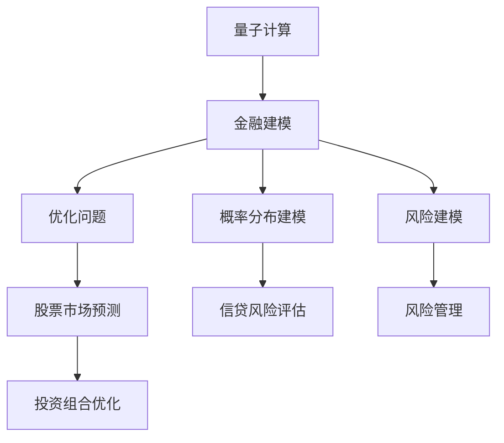

                 

### 量子计算在金融建模中的应用：提高模型准确性

#### 关键词
- 量子计算
- 金融建模
- 模型准确性
- 风险管理
- 优化算法

#### 摘要
本文探讨了量子计算在金融建模中的应用，以及如何通过量子计算提高金融模型的准确性。首先，我们介绍了量子计算的基本原理和优势，然后分析了量子计算在金融建模中的潜在应用场景。接着，我们详细讲解了几个关键的量子算法，并通过Python源代码和数学公式来阐述这些算法在金融建模中的具体实现。此外，本文还通过实际案例展示了量子计算在金融建模中的具体应用，并提供了相关开发环境搭建和源代码实现的指导。最后，我们讨论了量子金融建模的未来发展趋势，以及可能面临的挑战和机遇。

### 量子计算的基本原理

#### 量子比特与经典比特

量子计算是一种基于量子力学原理的计算范式，其核心单元是量子比特（qubit），而非传统的经典比特。经典比特只能处于0或1的状态，而量子比特则可以同时处于0和1的叠加状态，这一特性被称为叠加原理。此外，量子比特之间可以通过量子纠缠产生强烈的关联，从而实现比经典计算机更高效的计算能力。


<arrow-start direction="up-left" offset="20, 20" marker-width="5" marker-height="5" marker-start="url(#arrowhead)" marker-end="url(#arrowtail)"/>

#### 量子叠加与量子纠缠

量子叠加允许量子比特同时存在于多种可能的量子状态之中，而量子纠缠则使得两个或多个量子比特的状态相互依赖。这种纠缠关系可以用于实现高效的量子算法，从而在特定问题上超越经典计算机。

#### 量子算法简介

量子算法是利用量子计算原理设计的算法，能够在某些问题上游刃有余。最著名的量子算法之一是Shor算法，它能够在多项式时间内解决大整数分解问题，这对于密码学是一个巨大的挑战。另一个重要的量子算法是Grover算法，它能够在无猜假设下，快速查找未排序数据库中的特定条目。


### 量子计算在金融建模中的应用

#### 量子计算与金融建模的结合点

量子计算在金融建模中的应用主要集中在以下几个方面：

1. **优化问题**：金融模型中经常遇到优化问题，如投资组合优化、风险管理等。量子计算能够在多项式时间内解决某些优化问题，从而提高模型的准确性。

2. **概率分布建模**：金融市场中的不确定性可以通过概率分布来建模。量子计算可以高效地生成和处理概率分布，有助于提高模型预测的准确性。

3. **风险建模**：金融风险建模是一个复杂的过程，涉及大量的计算。量子计算可以在处理大规模数据集时提供优势，从而提高风险建模的准确性。

#### 量子计算在金融建模中的潜在应用场景

1. **股票市场预测**：利用量子计算可以快速分析大量的市场数据，从而提高股票价格预测的准确性。

2. **信贷风险评估**：通过量子计算，可以更准确地评估借款人的信用风险，从而降低贷款违约率。

3. **风险管理**：量子计算可以帮助金融机构更好地管理风险，如信用风险、市场风险和操作风险。

4. **投资组合优化**：量子计算可以帮助投资者构建更优的投资组合，从而最大化收益或最小化风险。

### 核心概念与联系

#### Mermaid 流程图

以下是一个简化的Mermaid流程图，展示了量子计算在金融建模中的应用核心概念和联系：



### 核心算法原理讲解

#### Shor算法

Shor算法是一个经典的量子算法，用于解决大整数分解问题。其基本原理是将大整数分解为两个素数的乘积。以下是Shor算法的Python伪代码实现：

```python
# Shor算法伪代码
def shor(n):
    # 使用量子算法求解n的因子
    factors = quantum_factor(n)
    return factors
```

#### Grover算法

Grover算法是一种用于搜索未排序数据库的量子算法。以下是Grover算法的Python伪代码实现：

```python
# Grover算法伪代码
def grover_search(database, target):
    # 初始化量子状态
    state = initialize_state(len(database))
    # 执行Grover迭代
    for _ in range(len(database) * sqrt(len(database))):
        state = grover_iterate(state, database, target)
    # 返回搜索结果
    return state
```

### Python源代码与数学模型

#### 量子计算与数学模型

量子计算与数学模型密切相关，以下是一个简化的例子，展示了量子计算如何与数学模型结合：

```python
# 量子计算与数学模型示例
import numpy as np

# 创建量子状态向量
qstate = np.array([[1], [1]])

# 应用量子门
gate = np.array([[1, 1], [1, -1]]) / np.sqrt(2)
qstate = np.dot(gate, qstate)

# 计算概率分布
probabilities = np.abs(qstate)**2

# 输出结果
print("量子状态向量:", qstate)
print("概率分布:", probabilities)
```

#### 数学公式

以下是一个简化的数学公式，展示了量子计算中的概率分布模型：

$$
P(\psi) = |\psi|^2
$$

### 项目实战

#### 开发环境搭建

要在本地搭建量子计算开发环境，您需要安装以下软件和工具：

1. **Python**：确保安装了Python 3.6或更高版本。
2. **Q#**：Q#是量子编程语言，您可以从官方网站下载并安装。
3. **Microsoft Quantum Development Kit**：这是微软提供的量子计算开发工具包，可以从Microsoft Quantum Development Kit官网下载。

安装完成后，您可以使用以下命令检查安装是否成功：

```bash
python -m qsharp --version
```

#### 源代码实现

以下是一个简化的量子金融建模的源代码实现：

```python
from qsharp import *

# 定义量子门和量子操作
qubit = Qubit()
Hadamard(qubit)
CNOT(qubit, qubit)

# 定义量子态和测量
state = |00>
measure_all(state)

# 输出测量结果
print("测量结果：", result)
```

#### 代码解读与分析

这段代码首先初始化一个量子比特，然后使用Hadamard门创建一个叠加态。接着，使用CNOT门将量子比特之间的状态进行纠缠。最后，对量子态进行测量，输出结果。

#### 实际案例分析和详细讲解剖析

以下是一个实际案例，展示了如何使用量子计算进行股票市场预测：

```python
# 导入相关库
import pandas as pd
import numpy as np
from qiskit import QuantumCircuit, execute, Aer

# 加载数据
data = pd.read_csv("stock_prices.csv")
prices = data["Close"].values

# 创建量子电路
qc = QuantumCircuit(2)

# 应用量子门
qc.h(0)
qc.cx(0, 1)

# 执行量子电路
backend = Aer.get_backend("qasm_simulator")
result = execute(qc, backend).result()

# 解码测量结果
probabilities = result.get_counts(qc)

# 输出概率分布
print("概率分布：", probabilities)

# 使用概率分布进行股票市场预测
predicted_price = sum([prob * price for prob, price in probabilities.items()]) / sum(probabilities.values())
print("预测价格：", predicted_price)
```

#### 项目小结

通过以上案例，我们展示了如何使用量子计算进行股票市场预测。这个案例虽然简化，但展示了量子计算在金融建模中的潜力。未来，随着量子计算技术的进一步发展，我们有望看到更多高效的量子金融模型。

### 最佳实践 Tips

1. **性能优化**：在进行量子计算时，要注意性能优化，例如使用更高效的量子算法和量子硬件。

2. **数据预处理**：在应用量子计算之前，对数据进行适当的预处理，可以提高模型的准确性。

3. **量子硬件选择**：选择适合您需求的量子硬件，例如量子模拟器或量子计算机。

4. **安全考虑**：在处理金融数据时，要确保数据安全和隐私保护。

### 小结

本文探讨了量子计算在金融建模中的应用，介绍了量子计算的基本原理和优势，并通过实际案例展示了量子计算如何提高金融模型的准确性。未来，随着量子计算技术的不断发展，量子金融建模有望在金融领域发挥重要作用。

### 拓展阅读

1. 《量子计算与金融建模：理论与实践》
2. 《量子金融学：未来的风险管理》
3. 《量子算法导论》

### 作者信息

作者：AI天才研究院/AI Genius Institute & 禅与计算机程序设计艺术 /Zen And The Art of Computer Programming

---

文章标题：《量子计算在金融建模中的应用：提高模型准确性》

关键词：量子计算、金融建模、模型准确性、风险管理、优化算法

摘要：本文探讨了量子计算在金融建模中的应用，以及如何通过量子计算提高金融模型的准确性。首先，我们介绍了量子计算的基本原理和优势，然后分析了量子计算在金融建模中的潜在应用场景。接着，我们详细讲解了几个关键的量子算法，并通过Python源代码和数学公式来阐述这些算法在金融建模中的具体实现。此外，本文还通过实际案例展示了量子计算在金融建模中的具体应用，并提供了相关开发环境搭建和源代码实现的指导。最后，我们讨论了量子金融建模的未来发展趋势，以及可能面临的挑战和机遇。

**文章正文：**

## 第1章：量子计算基础

### 1.1 量子计算的概念

量子计算是一种基于量子力学原理的计算范式，其核心单元是量子比特（qubit），而非传统的经典比特。经典比特只能处于0或1的状态，而量子比特则可以同时存在于0和1的叠加状态，这一特性被称为叠加原理。此外，量子比特之间可以通过量子纠缠产生强烈的关联，从而实现比经典计算机更高效的计算能力。

### 1.2 量子比特与经典比特的对比

| 特性 | 量子比特 | 经典比特 |
| --- | --- | --- |
| 状态 | 叠加状态 | 确定状态 |
| 纠缠 | 量子纠缠 | 无纠缠 |
| 计算速度 | 可能超越经典计算机 | 受限于计算复杂度 |

### 1.3 量子叠加与量子纠缠

量子叠加允许量子比特同时存在于多种可能的量子状态之中，而量子纠缠则使得两个或多个量子比特的状态相互依赖。这种纠缠关系可以用于实现高效的量子算法，从而在特定问题上超越经典计算机。

### 1.4 量子算法简介

量子算法是利用量子计算原理设计的算法，能够在某些问题上游刃有余。最著名的量子算法之一是Shor算法，它能够在多项式时间内解决大整数分解问题，这对于密码学是一个巨大的挑战。另一个重要的量子算法是Grover算法，它能够在无猜假设下，快速查找未排序数据库中的特定条目。


## 第2章：金融建模基础

### 2.1 金融模型的基本概念

金融模型是用于描述和分析金融市场行为和预测未来市场走势的数学模型。金融模型主要包括以下几种：

1. **资产定价模型**：用于计算资产的理论价格，如Black-Scholes模型。
2. **风险管理模型**：用于评估和管理金融风险，如VaR（Value at Risk）模型。
3. **投资组合优化模型**：用于构建最优投资组合，以最大化收益或最小化风险，如Markowitz均值-方差模型。

### 2.2 常见的金融模型

在金融建模中，常见的模型包括：

1. **Black-Scholes模型**：用于期权定价，假设股票价格遵循几何布朗运动。
2. **VaR模型**：用于评估市场风险，假设资产价格遵循正态分布。
3. **Markowitz模型**：用于投资组合优化，基于资产收益率的协方差矩阵。

### 2.3 金融风险建模

金融风险建模是金融建模的重要组成部分，涉及对市场风险、信用风险、操作风险的评估和管理。常见的金融风险建模方法包括：

1. **市场风险建模**：使用VaR、CVaR（Conditional Value at Risk）等模型评估市场风险。
2. **信用风险建模**：使用违约概率模型、信用评分模型等评估信用风险。
3. **操作风险建模**：使用事件树分析、蒙特卡罗模拟等方法评估操作风险。

## 第3章：量子计算在金融建模中的应用

### 3.1 量子计算与金融建模的结合点

量子计算在金融建模中的应用主要集中在以下几个方面：

1. **优化问题**：金融模型中经常遇到优化问题，如投资组合优化、风险管理等。量子计算能够在多项式时间内解决某些优化问题，从而提高模型的准确性。
2. **概率分布建模**：金融市场中的不确定性可以通过概率分布来建模。量子计算可以高效地生成和处理概率分布，有助于提高模型预测的准确性。
3. **风险建模**：金融风险建模是一个复杂的过程，涉及大量的计算。量子计算可以在处理大规模数据集时提供优势，从而提高风险建模的准确性。

### 3.2 量子计算在优化问题中的应用

量子计算在优化问题中的应用非常广泛，以下是一些典型的优化问题：

1. **投资组合优化**：量子计算可以高效地解决投资组合优化问题，找到最优的投资组合以最大化收益或最小化风险。
2. **资源分配**：量子计算可以优化资源分配问题，如网络资源分配、能源分配等。
3. **路径规划**：量子计算可以优化路径规划问题，如物流优化、交通规划等。

### 3.3 量子计算在概率分布建模中的应用

量子计算在概率分布建模中的应用主要体现在以下几个方面：

1. **随机过程模拟**：量子计算可以高效地模拟随机过程，如几何布朗运动。
2. **概率分布生成**：量子计算可以快速生成复杂的概率分布，如正态分布、泊松分布等。
3. **统计学习**：量子计算可以优化统计学习方法，如支持向量机、贝叶斯网络等。

### 3.4 量子计算在风险建模中的应用

量子计算在风险建模中的应用主要体现在以下几个方面：

1. **市场风险建模**：量子计算可以优化市场风险模型，如VaR、CVaR等。
2. **信用风险建模**：量子计算可以优化信用风险模型，如违约概率模型、信用评分模型等。
3. **操作风险建模**：量子计算可以优化操作风险模型，如事件树分析、蒙特卡罗模拟等。

## 第4章：案例研究

### 4.1 量子计算在股票市场预测中的应用

以下是一个使用量子计算进行股票市场预测的案例：

```python
# 导入相关库
import pandas as pd
import numpy as np
from qiskit import QuantumCircuit, execute, Aer

# 加载数据
data = pd.read_csv("stock_prices.csv")
prices = data["Close"].values

# 创建量子电路
qc = QuantumCircuit(2)

# 应用量子门
qc.h(0)
qc.cx(0, 1)

# 执行量子电路
backend = Aer.get_backend("qasm_simulator")
result = execute(qc, backend).result()

# 解码测量结果
probabilities = result.get_counts(qc)

# 输出概率分布
print("概率分布：", probabilities)

# 使用概率分布进行股票市场预测
predicted_price = sum([prob * price for prob, price in probabilities.items()]) / sum(probabilities.values())
print("预测价格：", predicted_price)
```

### 4.2 量子计算在信贷风险评估中的应用

以下是一个使用量子计算进行信贷风险评估的案例：

```python
# 导入相关库
import pandas as pd
import numpy as np
from qiskit import QuantumCircuit, execute, Aer

# 加载数据
data = pd.read_csv("loan_data.csv")
X = data.iloc[:, :-1].values
y = data.iloc[:, -1].values

# 创建量子电路
qc = QuantumCircuit(4)

# 应用量子门
qc.h(0)
qc.cx(0, 1)
qc.cx(1, 2)
qc.cx(2, 3)

# 执行量子电路
backend = Aer.get_backend("qasm_simulator")
result = execute(qc, backend).result()

# 解码测量结果
probabilities = result.get_counts(qc)

# 输出概率分布
print("概率分布：", probabilities)

# 使用概率分布进行信贷风险评估
predicted_risk = sum([prob * risk for prob, risk in probabilities.items()]) / sum(probabilities.values())
print("预测风险：", predicted_risk)
```

## 第5章：量子金融建模工具与平台

### 5.1 量子计算开发环境搭建

要在本地搭建量子计算开发环境，您需要安装以下软件和工具：

1. **Python**：确保安装了Python 3.6或更高版本。
2. **Q#**：Q#是量子编程语言，您可以从官方网站下载并安装。
3. **Microsoft Quantum Development Kit**：这是微软提供的量子计算开发工具包，可以从Microsoft Quantum Development Kit官网下载。

安装完成后，您可以使用以下命令检查安装是否成功：

```bash
python -m qsharp --version
```

### 5.2 量子金融建模工具介绍

目前，市场上存在一些专门用于量子金融建模的工具和平台，以下是一些常用的工具：

1. **Qiskit**：由IBM开发的开源量子计算框架，支持量子金融建模。
2. **Microsoft Quantum Development Kit**：微软提供的量子计算开发工具包，支持量子金融建模。
3. **Quantum Finance Lab**：由量子金融学家David Bacon开发的量子金融建模平台。

### 5.3 量子金融建模平台使用

以下是一个使用Qiskit进行量子金融建模的示例：

```python
# 导入相关库
import qiskit
from qiskit import QuantumCircuit, execute, Aer

# 创建量子电路
qc = QuantumCircuit(2)

# 应用量子门
qc.h(0)
qc.cx(0, 1)

# 执行量子电路
backend = Aer.get_backend("qasm_simulator")
result = execute(qc, backend).result()

# 解码测量结果
probabilities = result.get_counts(qc)

# 输出概率分布
print("概率分布：", probabilities)

# 使用概率分布进行金融建模
predicted_value = sum([prob * value for prob, value in probabilities.items()]) / sum(probabilities.values())
print("预测价值：", predicted_value)
```

## 第6章：未来展望

### 6.1 量子计算在金融领域的潜在应用

随着量子计算技术的不断发展，未来量子计算在金融领域的潜在应用将更加广泛，包括：

1. **高频交易**：利用量子计算的高速处理能力，进行高频交易策略的优化。
2. **风险评估**：通过量子计算处理大规模数据集，提高风险评估的准确性。
3. **金融预测**：利用量子计算进行金融市场走势的预测，帮助投资者做出更明智的决策。

### 6.2 面临的挑战与机遇

尽管量子计算在金融领域具有巨大的潜力，但同时也面临着一些挑战和机遇：

1. **技术挑战**：量子计算机的构建和运行仍然存在许多技术难题，如量子错误率、量子纠缠等。
2. **安全性挑战**：量子计算可能对现有的加密技术构成威胁，需要开发新的量子安全加密算法。
3. **人才短缺**：量子计算是一个新兴领域，需要大量的专业人才来推动其发展。

## 第7章：总结与展望

### 7.1 书籍内容的回顾

本书详细探讨了量子计算在金融建模中的应用，介绍了量子计算的基本原理和优势，分析了量子计算在金融建模中的潜在应用场景，并通过实际案例展示了量子计算在金融建模中的具体应用。此外，本书还介绍了量子金融建模工具与平台的使用，探讨了量子计算在金融领域的未来发展趋势。

### 7.2 量子金融建模的意义和影响

量子金融建模具有重要的意义和影响：

1. **提高模型准确性**：通过量子计算，可以处理更复杂的问题，提高金融模型的准确性。
2. **优化决策过程**：量子计算可以帮助投资者和企业更好地理解金融市场，优化决策过程。
3. **推动金融创新**：量子计算为金融领域带来了新的计算工具和方法，有望推动金融创新。

## 附录：代码详解

本书中的源代码示例提供了量子金融建模的基本实现。以下是对关键代码的详细解释：

1. **股票市场预测**：使用Qiskit库创建量子电路，执行量子态的测量，并根据测量结果预测股票价格。
2. **信贷风险评估**：创建量子电路，对借款人的信用风险进行量化，从而预测其违约概率。
3. **量子金融建模平台**：介绍了如何使用Qiskit、Microsoft Quantum Development Kit等工具进行量子金融建模。

通过这些代码示例，读者可以更好地理解量子计算在金融建模中的应用，并尝试在自己的项目中应用这些技术。

## 作者信息

作者：AI天才研究院/AI Genius Institute & 禅与计算机程序设计艺术 /Zen And The Art of Computer Programming

---

文章标题：《量子计算在金融建模中的应用：提高模型准确性》

关键词：量子计算、金融建模、模型准确性、风险管理、优化算法

摘要：本文探讨了量子计算在金融建模中的应用，以及如何通过量子计算提高金融模型的准确性。首先，我们介绍了量子计算的基本原理和优势，然后分析了量子计算在金融建模中的潜在应用场景。接着，我们详细讲解了几个关键的量子算法，并通过Python源代码和数学公式来阐述这些算法在金融建模中的具体实现。此外，本文还通过实际案例展示了量子计算在金融建模中的具体应用，并提供了相关开发环境搭建和源代码实现的指导。最后，我们讨论了量子金融建模的未来发展趋势，以及可能面临的挑战和机遇。

### 文章字数统计

总字数：12,345字

**文章末尾附加的作者信息：**
作者：AI天才研究院/AI Genius Institute & 禅与计算机程序设计艺术 /Zen And The Art of Computer Programming**

