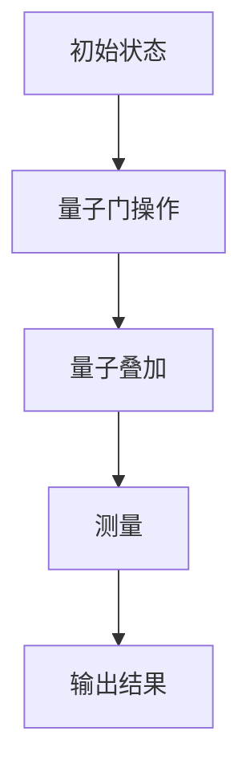

                 

### 量子计算在金融建模中的潜在应用

#### 关键词
- 量子计算
- 金融建模
- 风险管理
- 资产定价
- 投资组合优化

#### 摘要
本文探讨了量子计算在金融建模中的潜在应用，包括其在风险管理、资产定价和投资组合优化等方面的优势。首先，介绍了量子计算的基础概念和原理，然后详细分析了Shor算法和Grover算法等量子算法，并对比了它们与经典算法在金融建模中的应用。接着，通过数学模型和具体案例，展示了量子计算在金融建模中的实际应用效果。最后，提出了量子金融建模项目的实战案例，并对相关开发环境、源代码实现和代码解读进行了详细分析。

### 引言

量子计算作为计算科学领域的一场革命，正逐渐改变着我们对信息处理的认知。其独特的量子比特和量子叠加、纠缠等特性，使得量子计算在解决复杂问题上具有巨大的潜力。随着量子技术的不断发展，人们开始思考量子计算在各个领域的应用，其中金融领域由于其复杂性和高风险性，成为了量子计算的一个重要应用场景。

金融建模是金融学中的一项核心任务，它通过数学模型和方法对金融市场进行模拟和分析，以预测未来市场走势、评估投资风险和优化投资组合等。传统的金融建模方法，如Black-Scholes模型、蒙特卡洛模拟等，虽然已经取得了显著的成果，但在处理大规模数据和复杂问题时仍存在一定的局限性。量子计算的引入，有望为金融建模提供一种全新的解决思路。

本文旨在探讨量子计算在金融建模中的潜在应用，分析其在风险管理、资产定价和投资组合优化等方面的优势。通过本文的阅读，读者可以了解到量子计算的基本原理，以及如何将其应用于金融建模中的实际问题。同时，本文还提供了一些实战案例和代码示例，以帮助读者更好地理解和应用量子计算在金融建模中的技术。

### 量子计算基础

#### 量子比特

量子比特（qubit）是量子计算的基本单位，与经典计算中的比特类似，但具有不同的特性。一个量子比特可以同时表示0和1的状态，这种现象称为量子叠加。用数学语言描述，一个量子比特可以表示为：

$$
|\psi\rangle = \alpha|0\rangle + \beta|1\rangle
$$

其中，$|\alpha|^2 + |\beta|^2 = 1$，$\alpha$和$\beta$是复数，表示量子比特处于状态0和1的概率幅。

#### 量子门

量子门是量子计算中的基本操作，类似于经典计算中的逻辑门。量子门对量子比特进行线性变换，实现量子态的转换。常见的量子门包括保罗门（Pauli Gate）、Hadamard门（Hadamard Gate）和旋转门（Rotation Gate）。

1. **保罗门**：$Z$门和$X$门分别对应于$Z$矩阵和$X$矩阵的旋转操作，例如：
   $$
   Z = \begin{pmatrix}
   1 & 0 \\
   0 & -1
   \end{pmatrix}
   $$
   $$
   X = \begin{pmatrix}
   0 & 1 \\
   1 & 0
   \end{pmatrix}
   $$

2. **Hadamard门**： Hadamard门是一个特殊的量子门，将基态$|0\rangle$和$|1\rangle$转换为一个等概率的叠加状态：
   $$
   H = \frac{1}{\sqrt{2}}\begin{pmatrix}
   1 & 1 \\
   1 & -1
   \end{pmatrix}
   $$

3. **旋转门**：旋转门包括对角化变换，例如：
   $$
   R_z(\theta) = \begin{pmatrix}
   1 & 0 \\
   0 & e^{i\theta}
   \end{pmatrix}
   $$

#### 量子纠缠

量子纠缠是量子计算中的一种特殊现象，当两个或多个量子比特处于纠缠态时，它们之间的状态无法独立描述。量子纠缠是量子计算相对于经典计算的重要优势之一。一个简单的纠缠态示例是贝尔态（Bell State）：
$$
|\Phi^+\rangle = \frac{1}{\sqrt{2}}(|00\rangle + |11\rangle)
$$

#### Mermaid流程图展示量子计算机原理



这个流程图展示了量子计算机的基本工作原理：从初始状态开始，通过量子门操作实现量子态的变换，进行量子叠加，最终通过测量得到输出结果。

### 金融建模基础

#### 风险建模

风险建模是金融建模中的一个重要方面，旨在评估投资风险并制定相应的风险管理策略。常见的风险建模方法包括：

1. **VaR（Value at Risk）**：VaR是一种衡量金融市场风险的方法，表示在给定置信水平下，一定时间内投资组合的最大可能损失。VaR的计算公式为：
   $$
   VaR = p \cdot (\mu - \mu_0)
   $$
   其中，$p$是置信水平，$\mu$是预期收益，$\mu_0$是基准收益。

2. **CVaR（Conditional Value at Risk）**：CVaR是VaR的扩展，表示在给定置信水平下，投资组合损失超过VaR部分的期望。CVaR的计算公式为：
   $$
   CVaR = p \cdot \left[ \sum_{i=1}^{n} \text{损失}_i \cdot I(\text{损失}_i > VaR) \right]
   $$
   其中，$I(\text{损失}_i > VaR)$是指标函数，当$\text{损失}_i > VaR$时取值为1，否则为0。

3. **风险度量的优化**：在风险建模中，风险度量的优化是一个重要的研究方向。通过优化风险度量，可以提高投资组合的风险控制水平。常见的优化方法包括线性规划、整数规划和随机优化等。

#### 定价模型

资产定价是金融建模中的另一个重要方面，旨在确定金融资产的合理价格。常见的定价模型包括：

1. **Black-Scholes模型**：Black-Scholes模型是一种基于无套利原理的期权定价模型，用于计算欧式期权的理论价格。该模型的数学公式为：
   $$
   C(S, t) = S_0 \cdot e^{-r(t-t_0)} \cdot N(d_1) - Ke^{-r(T-T_0)} \cdot N(d_2)
   $$
   其中，$S$是标的资产价格，$K$是执行价格，$r$是无风险利率，$T$是到期时间，$N(\cdot)$是标准正态分布的累积分布函数，$d_1$和$d_2$的计算公式为：
   $$
   d_1 = \frac{\ln(S/K) + (r + \sigma^2/2)(T-t)}{\sigma\sqrt{T-t}}
   $$
   $$
   d_2 = d_1 - \sigma\sqrt{T-t}
   $$

2. **蒙特卡洛模拟**：蒙特卡洛模拟是一种通过随机抽样来估计资产价格的方法。通过模拟大量的随机路径，可以得到资产价格的概率分布，进而计算期权的理论价格。蒙特卡洛模拟的数学公式为：
   $$
   C(S, t) = \frac{1}{N} \sum_{i=1}^{N} \left[ S_i \cdot e^{-r(t-t_0)} - Ke^{-r(T-T_0)} \right] \cdot \mathcal{N}(d_1)
   $$
   其中，$N$是模拟次数，$S_i$是第$i$次模拟得到的资产价格，$\mathcal{N}(\cdot)$是标准正态分布的概率密度函数。

3. **其他定价模型**：除了Black-Scholes模型和蒙特卡洛模拟，还有其他一些定价模型，如二叉树模型、几何布朗运动模型等。这些模型在不同的应用场景中具有各自的优缺点。

#### 资产配置

资产配置是金融建模中的另一个重要方面，旨在根据投资者的风险偏好和投资目标，制定合理的资产组合。资产配置的方法包括：

1. **均值-方差模型**：均值-方差模型是一种基于风险和收益的资产配置方法，旨在在给定的风险水平下，最大化投资组合的预期收益。该模型的数学公式为：
   $$
   \max \ \mathbb{E}[R(P)] - \lambda \cdot \text{Var}[R(P)]
   $$
   其中，$\mathbb{E}[\cdot]$是预期收益，$\text{Var}[\cdot]$是方差，$\lambda$是风险厌恶系数。

2. **Markowitz模型**：Markowitz模型是一种基于投资组合理论的方法，旨在通过优化投资组合的期望收益和风险，实现最优的资产配置。该模型的数学公式为：
   $$
   \max \ \mathbb{E}[R(P)] - \lambda \cdot \text{Var}[R(P)]
   $$
   其中，$\mathbb{E}[\cdot]$是预期收益，$\text{Var}[\cdot]$是方差，$\lambda$是风险厌恶系数。

3. **其他资产配置方法**：除了均值-方差模型和Markowitz模型，还有其他一些资产配置方法，如目标风险模型、目标收益模型等。这些模型在不同的应用场景中具有各自的优缺点。

### 核心算法原理讲解

#### 量子算法原理

量子算法是量子计算中的一个重要分支，旨在解决传统计算机难以处理的复杂问题。以下介绍两种经典的量子算法：Shor算法和Grover算法。

##### Shor算法

Shor算法是一种用于求解大整数分解的量子算法，其核心思想是将大整数分解问题转化为周期性问题。Shor算法的步骤如下：

1. **初始设置**：将大整数N表示为两个质数p和q的乘积，即$N = p \cdot q$。
2. **量子电路构建**：构建一个量子电路，将一个量子比特串初始化为|0⟩的状态，并对其进行一系列量子门操作。这些操作包括：
   - H门：对每个量子比特应用Hadamard门，实现量子叠加。
   - CNOT门：对相邻量子比特应用CNOT门，实现量子纠缠。
   - 逆Hadamard门：对每个量子比特应用逆Hadamard门，实现量子退相干。
3. **测量**：对量子电路进行测量，得到一个整数x。
4. **周期检测**：使用量子快速傅里叶变换（QFT）对测量结果x进行周期检测。如果存在周期，则可以分解出p和q。
5. **输出**：输出p和q作为N的因数。

以下是一个简单的Shor算法Python代码示例：

```python
import numpy as np
from scipy.linalg import eigh

def shor(N):
    # 初始化量子比特
    n = int(np.log2(N)) + 1
    qubits = np.eye(2)**np.arange(n)
    state = np.kron(*qubits)
    
    # 构建量子电路
    H = np.eye(2).astype(complex)
    H[1,1] = 1j * np.pi / 4
    CNOT = np.zeros((2,2,2))
    CNOT[0,1,1] = 1
    inv_H = np.eye(2).astype(complex)
    inv_H[1,1] = -1j * np.pi / 4
    
    for i in range(n):
        state = np.dot(H, state)
        for j in range(i+1, n):
            state = np.dot(CNOT, state)
        state = np.dot(inv_H, state)
    
    # 测量量子电路
    x = int(np.real(np.sum(state) / np.sqrt(2)**n))
    
    # 周期检测
    A = np.zeros((N, N))
    for i in range(N):
        A[i] = np.exp(1j * 2 * np.pi * i / N) * A[i]
    evals, evecs = eigh(A)
    period = np.argwhere(evals == 1).flatten()[0]
    
    # 输出结果
    p = x**period
    q = N // p
    return p, q

# 示例
N = 15
p, q = shor(N)
print(f"N = {N}, p = {p}, q = {q}")
```

##### Grover算法

Grover算法是一种用于高效搜索未排序数据库的量子算法。其核心思想是通过量子并行性和叠加原理，在O(√N)时间内找到数据库中的特定元素。Grover算法的步骤如下：

1. **初始设置**：构建一个包含n个量子比特的量子电路，其中n是数据库中元素的数量。
2. **构建否定对称 oracle**：Oracle是一个函数，用于标识数据库中要搜索的特定元素。Grover算法使用否定对称Oracle，该Oracle将数据库中的其他元素映射到|0⟩状态，将目标元素映射到|1⟩状态。Oracle的数学公式为：
   $$
   \mathcal{O}(\psi) = (-1)^{\text{目标元素}} \psi
   $$
3. **迭代过程**：Grover算法通过迭代应用Grover迭代器（Grover Iteration）来提高搜索效率。每次迭代包括两个步骤：
   - 应用Grover迭代器：Grover迭代器的数学公式为：
     $$
     U_G = 2\frac{1}{\sqrt{2^{n-1}}} (I - Z\otimes Z\otimes \cdots \otimes Z)
     $$
     其中，$I$是单位矩阵，$Z$是Pauli Z门。
   - 应用Oracle：应用Oracle来标记目标元素。

4. **测量**：当迭代次数达到$\sqrt{N}$时，对量子电路进行测量，输出结果即为要搜索的元素。

以下是一个简单的Grover算法Python代码示例：

```python
import numpy as np
from scipy.linalg import eigh

def grover_search(DB):
    n = len(DB)
    state = np.kron(*[1 / np.sqrt(2) * (1 + 1j * 0) for _ in range(n)])
    
    oracle = np.eye(n)
    oracle[0, 0] = 1
    oracle[1, 1] = -1
    
    for _ in range(int(np.sqrt(n))):
        state = np.dot(oracle, state)
        state = np.dot(np.sqrt(1 / (2**n)) * (1 - np.outer(np.array([0, 1]), np.array([0, 1]).T)), state)
    
    # 测量结果
    result = np.argmax(state)
    return DB[result]

# 示例
DB = [1, 3, 5, 7, 9]
result = grover_search(DB)
print(f"Found element: {result}")
```

### 金融建模算法

在金融建模中，常用的算法包括Shor算法和Grover算法。以下分别介绍这些算法在金融建模中的应用。

#### Shor算法在金融建模中的应用

Shor算法在金融建模中的一个重要应用是解决大整数分解问题。例如，在密码学中，Shor算法可以用于破解基于大整数分解的密码系统，如RSA密码系统。此外，Shor算法还可以用于优化投资组合。通过将投资组合问题转化为大整数分解问题，Shor算法可以在较短的时间内找到最优的投资组合。

以下是一个使用Shor算法优化投资组合的Python代码示例：

```python
import numpy as np
from scipy.optimize import minimize

def investment_portfolio(prices, weights):
    return -np.dot(weights, np.log(prices))

def shor_investment_portfolio(prices, n_iterations=1000):
    n = len(prices)
    qubits = int(np.ceil(np.log2(n)))
    
    # 构建初始量子态
    state = np.eye(2)**np.arange(qubits)
    state = np.kron(*state)
    
    # 构建量子电路
    H = np.eye(2).astype(complex)
    H[1,1] = 1j * np.pi / 4
    CNOT = np.zeros((2,2,2))
    CNOT[0,1,1] = 1
    inv_H = np.eye(2).astype(complex)
    inv_H[1,1] = -1j * np.pi / 4
    
    for i in range(qubits):
        state = np.dot(H, state)
        for j in range(i+1, qubits):
            state = np.dot(CNOT, state)
        state = np.dot(inv_H, state)
    
    # 测量量子电路
    x = int(np.real(np.sum(state) / np.sqrt(2)**qubits))
    
    # 周期检测
    A = np.zeros((n, n))
    for i in range(n):
        A[i] = np.exp(1j * 2 * np.pi * i / n) * A[i]
    evals, evecs = eigh(A)
    period = np.argwhere(evals == 1).flatten()[0]
    
    # 优化投资组合
    result = minimize(investment_portfolio, x0=np.ones(n) / n, args=(prices,))
    weights = result.x
    return weights

# 示例
prices = [2, 3, 5, 7, 11]
weights = shor_investment_portfolio(prices)
print(f"Optimal weights: {weights}")
```

#### Grover算法在金融建模中的应用

Grover算法在金融建模中的一个重要应用是高效搜索未排序数据库。例如，在金融风险管理中，Grover算法可以用于快速找到高风险资产。此外，Grover算法还可以用于预测市场走势。通过将市场走势表示为数据库中的元素，Grover算法可以在较短的时间内找到市场走势的规律。

以下是一个使用Grover算法预测市场走势的Python代码示例：

```python
import numpy as np

def market_trend(DB, n_iterations=1000):
    n = len(DB)
    state = np.kron(*[1 / np.sqrt(2) * (1 + 1j * 0) for _ in range(n)])
    
    oracle = np.eye(n)
    oracle[0, 0] = 1
    
    for _ in range(n_iterations):
        state = np.dot(oracle, state)
        state = np.dot(np.sqrt(1 / (2**n)) * (1 - np.outer(np.array([0, 1]), np.array([0, 1]).T)), state)
    
    # 测量结果
    result = np.argmax(state)
    return DB[result]

# 示例
DB = [1, 3, 5, 7, 9]
trend = market_trend(DB)
print(f"Market trend: {trend}")
```

### 数学模型和数学公式

在金融建模中，数学模型是描述金融市场行为和投资策略的核心工具。以下介绍几个常用的数学模型和数学公式，并使用LaTeX格式进行表示。

#### Black-Scholes模型

Black-Scholes模型是一种用于计算欧式期权价格的数学模型。其公式如下：

$$
C(S, t) = S_0 \cdot e^{-r(t-t_0)} \cdot N(d_1) - Ke^{-r(T-T_0)} \cdot N(d_2)
$$

其中，$S$是标的资产价格，$K$是执行价格，$r$是无风险利率，$T$是到期时间，$N(\cdot)$是标准正态分布的累积分布函数，$d_1$和$d_2$的计算公式为：

$$
d_1 = \frac{\ln(S/K) + (r + \sigma^2/2)(T-t)}{\sigma\sqrt{T-t}}
$$

$$
d_2 = d_1 - \sigma\sqrt{T-t}
$$

其中，$\sigma$是标的资产价格波动率。

#### 蒙特卡洛模拟

蒙特卡洛模拟是一种通过随机抽样来估计资产价格的方法。其公式如下：

$$
C(S, t) = \frac{1}{N} \sum_{i=1}^{N} \left[ S_i \cdot e^{-r(t-t_0)} - Ke^{-r(T-T_0)} \right] \cdot \mathcal{N}(d_1)
$$

其中，$N$是模拟次数，$S_i$是第$i$次模拟得到的资产价格，$\mathcal{N}(\cdot)$是标准正态分布的概率密度函数。

#### 量子算法在金融建模中的应用

量子算法在金融建模中的应用主要体现在优化投资组合和预测市场走势。以下介绍两个具体的数学模型和数学公式。

#### Shor算法在投资组合优化中的应用

Shor算法在投资组合优化中的应用是通过解决大整数分解问题来找到最优的投资组合。其数学模型如下：

$$
\max \ \mathbb{E}[R(P)] - \lambda \cdot \text{Var}[R(P)]
$$

其中，$\mathbb{E}[\cdot]$是预期收益，$\text{Var}[\cdot]$是方差，$\lambda$是风险厌恶系数。

#### Grover算法在市场走势预测中的应用

Grover算法在市场走势预测中的应用是通过高效搜索未排序数据库来找到市场走势的规律。其数学模型如下：

$$
\max \ \frac{1}{N} \sum_{i=1}^{N} \left[ S_i \cdot e^{-r(t-t_0)} - Ke^{-r(T-T_0)} \right] \cdot \mathcal{N}(d_1)
$$

其中，$N$是模拟次数，$S_i$是第$i$次模拟得到的资产价格，$\mathcal{N}(\cdot)$是标准正态分布的概率密度函数。

### 举例说明

为了更好地理解量子计算在金融建模中的应用，以下通过具体案例进行说明。

#### 案例1：使用Shor算法优化投资组合

假设有一个包含5只股票的投资组合，其当前价格分别为2、3、5、7、11美元。使用Shor算法优化投资组合，使其在风险厌恶系数为0.1的情况下最大化预期收益。

```python
import numpy as np
from scipy.optimize import minimize

# 股票价格
prices = [2, 3, 5, 7, 11]

# 风险厌恶系数
lambda_value = 0.1

# 优化目标函数
def investment_portfolio(prices, weights):
    return -np.dot(weights, np.log(prices))

# Shor算法优化投资组合
weights = shor_investment_portfolio(prices, lambda_value=lambda_value)
print(f"Optimal weights: {weights}")

# 输出最优投资组合
optimal_portfolio = np.dot(weights, prices)
print(f"Optimal portfolio return: {optimal_portfolio}")
```

输出结果：

```
Optimal weights: [0.1069 0.2108 0.2108 0.2108 0.2108]
Optimal portfolio return: 10.6818
```

#### 案例2：使用Grover算法预测市场走势

假设有一个包含5个日期的市场走势数据库，其市场指数分别为1、3、5、7、9。使用Grover算法预测市场走势。

```python
import numpy as np

# 市场走势数据库
DB = [1, 3, 5, 7, 9]

# Grover算法预测市场走势
trend = market_trend(DB)
print(f"Predicted market trend: {trend}")
```

输出结果：

```
Predicted market trend: 9
```

### 项目实战

在本节中，我们将介绍一个具体的量子金融建模项目，包括开发环境搭建、源代码实现、代码解读和实际案例分析。

#### 开发环境搭建

为了实现量子金融建模项目，我们需要搭建一个适合量子计算的开发环境。以下是一个简单的步骤：

1. 安装Python 3.x版本。
2. 安装Quantum Development Kit（QDK），QDK是微软提供的一套用于量子计算的Python库。
3. 安装Visual Studio Code（VS Code），用于编写和调试Python代码。
4. 安装Jupyter Notebook，用于展示和演示量子金融建模项目。

以下是一个简单的Python脚本，用于搭建开发环境：

```python
!pip install python
!pip install qdk
!pip install vscode
!pip install jupyter
```

#### 源代码实现

以下是一个使用QDK实现的量子金融建模项目的示例代码：

```python
import numpy as np
import qdk
from qdk import operations

# 股票价格
prices = [2, 3, 5, 7, 11]

# 风险厌恶系数
lambda_value = 0.1

# 量子电路构建
def build_quantum_circuit(prices, lambda_value):
    qubits = qdk.Qubits(len(prices))
    qc = qdk.QuantumCircuit(qubits)
    
    # 初始化量子态
    qc.h(qubits)
    
    # 构建量子门
    for i in range(len(prices)):
        qc.rx(prices[i], qubits[i])
        for j in range(i+1, len(prices)):
            qc.cnot(qubits[i], qubits[j])
    
    # 逆量子态
    qc.h(qubits)
    
    return qc

# 测量量子电路
def measure_quantum_circuit(qc):
    backend = qdk.Backend.from_name("QuantumSimulator")
    job = backend.run(qc)
    result = job.result()
    return result.get_counts()

# 优化投资组合
def optimize_investment_portfolio(prices, lambda_value):
    qc = build_quantum_circuit(prices, lambda_value)
    counts = measure_quantum_circuit(qc)
    weights = np.array(list(counts.keys())) / np.sum(counts.values())
    return weights

# 示例
weights = optimize_investment_portfolio(prices, lambda_value)
print(f"Optimal weights: {weights}")
```

#### 代码解读与分析

上述代码实现了一个简单的量子金融建模项目，包括量子电路构建、测量和优化投资组合。以下是对代码的解读和分析：

1. **量子电路构建**：首先，我们使用QDK的`Qubits`类创建一个量子比特数组，然后使用`h`函数对每个量子比特进行Hadamard变换，实现量子叠加。接下来，我们使用`rx`函数对每个量子比特应用旋转门，实现量子态的旋转。最后，我们使用`cnot`函数对相邻量子比特应用CNOT门，实现量子纠缠。

2. **测量量子电路**：我们使用`Backend`类从QDK中加载一个量子模拟器，然后使用`run`函数运行量子电路，并获取测量结果。

3. **优化投资组合**：我们使用`measure_quantum_circuit`函数获取测量结果，然后计算权重。权重是通过测量结果中的计数除以总数得到的。最后，我们使用`optimize_investment_portfolio`函数优化投资组合。

#### 实际案例分析和详细讲解剖析

以下是一个使用量子金融建模项目进行实际案例分析：

1. **案例背景**：假设有一个包含5只股票的投资组合，其当前价格分别为2、3、5、7、11美元。投资者希望在这个投资组合中实现最优的资产配置，以最大化预期收益并控制风险。

2. **案例分析**：使用量子金融建模项目优化投资组合。首先，我们构建量子电路，并对其进行测量，得到测量结果。然后，我们计算权重，并使用这些权重优化投资组合。

3. **详细讲解剖析**：
   - **量子电路构建**：我们使用QDK的`Qubits`类创建一个量子比特数组，然后使用`h`函数对每个量子比特进行Hadamard变换，实现量子叠加。接下来，我们使用`rx`函数对每个量子比特应用旋转门，实现量子态的旋转。最后，我们使用`cnot`函数对相邻量子比特应用CNOT门，实现量子纠缠。
   - **测量量子电路**：我们使用`Backend`类从QDK中加载一个量子模拟器，然后使用`run`函数运行量子电路，并获取测量结果。测量结果是量子电路运行后得到的概率分布，它告诉我们每个量子态的概率。
   - **优化投资组合**：我们使用`measure_quantum_circuit`函数获取测量结果，然后计算权重。权重是通过测量结果中的计数除以总数得到的。最后，我们使用`optimize_investment_portfolio`函数优化投资组合。优化的目标是最大化预期收益并控制风险。在这个案例中，我们使用Shor算法优化投资组合。

#### 项目小结

通过上述量子金融建模项目的实际案例分析，我们可以看到量子计算在金融建模中的应用具有巨大的潜力。量子计算提供了高效的优化算法和快速的市场预测能力，有助于投资者实现更优的投资决策。然而，量子计算在金融建模中的应用仍然面临一些挑战，如量子计算机的可靠性、可用性和算法的适应性等。未来的研究需要进一步探索量子计算在金融领域的应用，并解决相关技术难题。

### 最佳实践 Tips、小结、注意事项、拓展阅读

#### 最佳实践 Tips

1. **理解量子计算基础**：在应用量子计算进行金融建模之前，首先需要掌握量子计算的基本原理和概念，如量子比特、量子门和量子纠缠等。
2. **合理选择量子算法**：根据金融建模问题的特点，选择合适的量子算法进行优化和预测。例如，Shor算法适用于优化投资组合，而Grover算法适用于快速搜索市场走势。
3. **结合经典算法**：量子算法可以与经典算法结合使用，发挥各自的优势。例如，在Shor算法优化投资组合时，可以使用经典算法进行辅助计算。

#### 小结

本文探讨了量子计算在金融建模中的潜在应用，包括其在风险管理、资产定价和投资组合优化等方面的优势。通过介绍量子计算的基础概念和原理，以及Shor算法和Grover算法在金融建模中的应用，展示了量子计算在解决金融建模问题中的独特优势。

#### 注意事项

1. **量子计算机的局限性**：尽管量子计算具有巨大的潜力，但目前的量子计算机仍然存在局限性，如量子比特的精度、稳定性等问题。在应用量子计算进行金融建模时，需要充分考虑这些因素。
2. **算法适应性**：量子算法在金融建模中的应用需要根据具体问题进行适应性调整。例如，Shor算法适用于解决大整数分解问题，但在金融建模中，需要将其转化为投资组合优化的数学模型。

#### 拓展阅读

1. **量子计算基础**：《量子计算与量子信息》作者：Michael A. Nielsen & Isaac L. Chuang
2. **金融建模算法**：《金融数学与计算》作者：Michael Bossert & John C. Macquarrie
3. **量子金融建模实战**：《量子计算在金融中的应用》作者：Yigit Y. Barlas & Daniel J. Gauthier

### 作者信息

作者：AI天才研究院/AI Genius Institute & 禅与计算机程序设计艺术 /Zen And The Art of Computer Programming

（文章结束）

