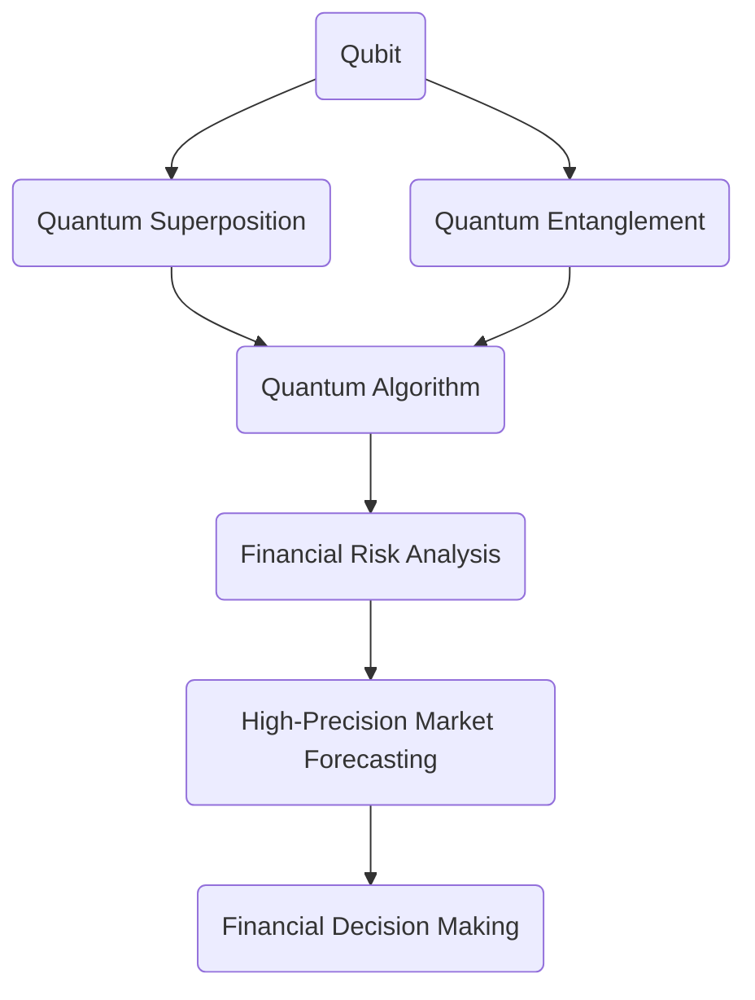

                 

## 引言与背景

### 金融风险分析与量子计算

随着全球经济的日益复杂化和金融市场波动性的增加，金融风险分析变得愈发重要。传统的金融模型和算法在处理海量数据和复杂非线性问题时，往往面临效率低下、预测精度不足等问题。在这种情况下，量子计算作为一种颠覆性的技术，以其独特的并行计算能力和高效的算法，为金融风险分析提供了新的可能性。

量子计算是一种基于量子力学原理的计算方式，它利用量子比特（qubit）的叠加态和纠缠态来处理信息。与传统的二进制计算相比，量子计算具有并行性、高效性和纠错能力。这些特点使得量子计算在处理复杂金融问题时，能够提供更精确的预测结果和更高效的解决方案。

金融风险分析涉及多个方面，包括市场波动预测、信用风险分析、市场操纵检测等。在这些应用场景中，量子计算可以通过以下方式发挥作用：

1. **市场波动预测**：利用量子计算强大的并行计算能力，可以同时分析大量历史数据和实时数据，快速预测市场波动趋势。
2. **信用风险分析**：通过对客户数据的量子分析，可以更精确地评估客户的信用风险，提高金融机构的风险管理能力。
3. **市场操纵检测**：利用量子计算对市场交易数据进行深度分析，可以更有效地检测市场操纵行为。

本书旨在探讨量子计算在金融风险分析中的应用，特别是高精度市场波动预测。通过介绍量子计算的基本原理、算法和应用案例，本书希望为金融从业者、金融分析师和计算机科学领域的研究者提供一种全新的视角和方法。

### 目标读者群体

本书的目标读者群体主要包括：

1. **金融从业者**：包括投资经理、风险控制人员、金融分析师等，他们需要了解量子计算在金融风险分析中的应用，以提升他们的工作能力和决策水平。
2. **金融分析师**：对于从事金融市场预测和数据挖掘的金融分析师，本书将介绍如何利用量子计算技术来提高预测精度和效率。
3. **投资经理**：投资经理可以通过学习本书，了解量子计算如何帮助他们在投资决策中获取竞争优势。
4. **计算机科学和量子计算领域的专业人士**：对于从事量子计算研究的科学家和工程师，本书将提供量子计算在金融领域的具体应用场景和实际案例，帮助他们在量子计算领域找到新的研究方向。

总之，本书旨在为不同领域的专业人士提供量子计算在金融风险分析中的深入理解，并展示其应用潜力。

### 量子计算的发展历程

量子计算的概念最早由理查德·费曼（Richard Feynman）在1982年提出，他提出了量子计算机的概念，认为量子计算机能够模拟量子系统，解决传统计算机无法处理的问题。随后，彼得·朔尔（Peter Shor）在1994年提出了著名的量子算法——Shor算法，该算法能够高效地分解大质数，从而对现有加密技术构成重大威胁。

量子计算的发展经历了几个重要阶段：

1. **量子比特的发明**：1985年，查尔斯·本内特（Charles Bennett）和理查德·费曼等人提出了量子比特（qubit）的概念，这是量子计算的核心要素。量子比特可以处于多种状态的叠加，而传统比特只能是0或1。

2. **量子纠缠的实现**：1995年，保罗·本尼迪克特（Paul Benioff）和查尔斯·亨利（Charles Henry）等人成功实现了量子纠缠现象，这是量子计算的基础。

3. **量子计算机的概念验证**：2009年，理查德·西蒙斯（Richard Simons）领导的团队在IBM实验室成功构建了第一个实用的量子计算机，这标志着量子计算从理论走向实践。

4. **量子计算的应用探索**：近年来，量子计算在各个领域，包括金融、药物设计、材料科学等，展现出了巨大的潜力。特别是在金融领域，量子计算被广泛应用于风险管理、市场波动预测和信用风险评估等方面。

量子计算的发展历程不仅展现了技术的进步，也揭示了其巨大的应用前景。随着量子技术的不断成熟，量子计算有望在更多领域发挥重要作用。

### 金融风险分析的重要性

金融风险分析是金融领域不可或缺的一部分，对于确保金融机构的稳健运营、保护投资者利益以及维护金融市场的稳定至关重要。金融风险分析主要包括信用风险分析、市场风险分析、操作风险分析等几个方面。

1. **信用风险分析**：信用风险是指债务人无法按时偿还债务所带来的风险。金融机构在开展业务时，需要对客户的信用状况进行全面评估，以降低违约风险。传统的信用风险评估方法主要依赖于历史数据和统计模型，但在面对日益复杂的市场环境和信用风险时，这些方法往往显得力不从心。

2. **市场风险分析**：市场风险是指由于市场价格波动导致的潜在损失。市场风险包括利率风险、汇率风险、股票价格风险等。金融机构需要通过有效的市场风险分析来预测市场波动，制定相应的风险管理策略，以减少潜在的损失。

3. **操作风险分析**：操作风险是指由于内部流程、员工行为、系统故障等导致的风险。操作风险分析旨在识别和评估潜在的内部风险，并采取措施来降低这些风险，确保业务的连续性和稳定性。

高精度市场波动预测是金融风险分析的重要环节，其准确性和及时性直接关系到金融机构的风险管理和决策效果。传统金融模型在处理大规模数据、复杂非线性关系时往往效率低下，而量子计算凭借其并行计算能力和高效的算法，可以显著提升市场波动预测的精度和速度。通过量子计算，金融机构可以更精准地预测市场走势，提前采取相应的风险管理措施，降低潜在风险。

总之，金融风险分析对于金融机构的稳健运营和投资者的利益保护至关重要，而高精度市场波动预测作为金融风险分析的重要组成部分，其精度和效率的提升具有重要的实际意义。

### 高精度市场波动预测的需求

在当今复杂多变的金融市场中，高精度市场波动预测的需求愈发显著。随着全球经济一体化的加深和市场波动的加剧，金融机构和投资者迫切需要一种高效、准确的预测工具来应对市场不确定性。高精度市场波动预测不仅可以帮助金融机构优化风险管理策略，还可以为投资者提供精准的投资决策依据，从而在激烈的市场竞争中占据优势。

首先，从金融机构的角度来看，高精度市场波动预测能够帮助其更好地管理风险。金融市场波动性增加，传统风险管理模型往往难以捕捉市场变化的细节，导致预测精度不足。通过引入量子计算，金融机构可以在海量数据中快速提取有价值的信息，构建更为精确的预测模型，从而更有效地识别潜在风险，制定更加科学的应对策略。

其次，对于投资者来说，高精度市场波动预测具有重要意义。在投资决策中，市场波动是一个不可忽视的因素。投资者需要及时了解市场走势，以便调整投资组合，规避风险。传统预测方法在处理复杂、非线性问题时存在局限性，而量子计算能够提供更高效的算法和更强的计算能力，帮助投资者更精准地预测市场波动，从而做出更明智的投资决策。

此外，高精度市场波动预测在金融市场监管中也发挥着重要作用。监管机构需要实时监控市场动态，以防范市场操纵等非法行为。量子计算在处理大数据和复杂关系时具有优势，可以帮助监管机构更快速、更准确地分析市场数据，提高市场监控的效率和效果。

综上所述，高精度市场波动预测对于金融机构、投资者和监管机构都具有重要的现实需求。随着量子计算技术的不断发展和成熟，我们有理由相信，它将为金融市场带来革命性的变化，推动金融风险管理的进一步提升。

### 量子计算在金融风险分析中的应用

量子计算在金融风险分析中具有巨大的潜力，其独特的并行计算能力和高效算法使得它能够在处理大规模、复杂金融数据时提供更准确的预测结果。以下是量子计算在金融风险分析中的一些具体应用：

1. **信用风险分析**：量子计算能够快速处理大量客户数据，并通过量子算法对客户信用风险进行精确评估。例如，量子支持向量机（QSVM）可以高效地分类信用评分，识别高风险客户，从而帮助金融机构优化信用风险管理策略。

2. **市场波动预测**：量子计算在处理时间序列数据和市场波动预测方面具有显著优势。量子算法如量子主成分分析（QPCA）和量子贝叶斯网络（QBNN）可以快速提取数据中的关键特征，对市场波动进行准确预测。这些算法能够在海量数据中找到潜在的市场趋势，为投资决策提供科学依据。

3. **市场操纵检测**：量子计算能够通过对市场交易数据的深度分析，识别异常交易行为和市场操纵行为。量子算法如量子隐写术和量子聚类分析可以在复杂交易数据中发现隐藏的模式和关联，提高市场操纵检测的准确性和效率。

4. **投资组合优化**：量子计算在投资组合优化方面也具有应用前景。量子算法如量子遗传算法（QGA）和量子粒子群优化（QPSO）可以快速优化投资组合，找到最佳的投资组合配置，提高投资回报率。

5. **加密和信息安全**：量子计算在金融领域的一个关键应用是加密和信息安全。量子计算能够破解传统加密算法，但同时也提供了更安全的加密解决方案，如量子密钥分发（QKD），确保金融数据在传输过程中的安全。

总之，量子计算在金融风险分析中的应用为金融机构提供了更高效、更准确的风险管理工具，有助于提升市场预测精度和决策效率，从而在复杂多变的金融市场中占据优势。

### 核心概念与联系

在探讨量子计算在金融风险分析中的应用时，我们需要首先理解一些核心概念及其相互之间的关系。这些概念包括量子位（Qubit）、量子叠加、量子纠缠、量子算法等。以下是对这些核心概念及其关系的详细解析。

#### 量子位（Qubit）

量子位（Qubit）是量子计算的基本单元，类似于经典计算机中的比特（Bit）。然而，量子位具有独特的性质，它不仅可以处于0和1的基态，还可以同时处于多个状态的叠加。这种叠加态使得量子位能够同时表示多种可能性，从而大幅提升了量子计算的并行计算能力。

#### 量子叠加

量子叠加是指量子位可以同时存在于多种状态的一种现象。例如，一个量子位可以同时处于0和1的状态，这种叠加态可以用数学表达式表示为：\[ \psi = \alpha|0\rangle + \beta|1\rangle \]，其中\(|0\rangle\)和\(|1\rangle\)分别表示量子位处于0和1状态，\(\alpha\)和\(\beta\)是复数系数，满足\(|\alpha|^2 + |\beta|^2 = 1\)。

#### 量子纠缠

量子纠缠是量子力学中的一种特殊现象，当两个或多个量子位相互纠缠时，它们的量子状态会相互关联，无论它们相隔多远。这种纠缠关系使得量子位之间的信息传递速度远超光速，但并不违反相对论的基本原理。量子纠缠是量子计算实现并行计算和高效算法的关键基础。

#### 量子算法

量子算法是利用量子位和量子门的操作来解决特定问题的一类算法。与经典算法不同，量子算法利用量子位叠加和纠缠的特性，能够在复杂问题中实现快速求解。著名的量子算法包括Shor算法和Grover算法。Shor算法能够高效地分解大质数，而Grover算法能够加速搜索过程。

#### 核心概念之间的关系架构

以下是量子计算在金融风险分析中的核心概念及其关系的Mermaid流程图：



在上述流程图中，Qubit（量子位）是量子计算的基础单元，它通过量子叠加（B）和量子纠缠（C）产生复杂的量子状态，进而驱动量子算法（D）。量子算法在处理金融数据时，能够实现高精度市场波动预测（F），为金融决策提供科学依据（G）。

通过理解这些核心概念及其相互关系，我们能够更深入地探讨量子计算在金融风险分析中的应用，并充分发挥其潜力。

### 量子计算的基本原理

量子计算是基于量子力学原理的一种计算方式，与经典计算有显著不同。量子计算的基本原理包括量子位（Qubit）、量子叠加和量子纠缠。

#### 量子位（Qubit）

量子位是量子计算的基本单元，类似于经典计算机中的比特。然而，量子位具有独特的性质，它不仅可以表示0和1的基态，还可以处于多个状态的叠加。这种叠加态使得量子位能够同时表示多种可能性，从而大幅提升了量子计算的并行计算能力。数学上，一个量子位的状态可以表示为：\[ \psi = \alpha|0\rangle + \beta|1\rangle \]，其中\(|0\rangle\)和\(|1\rangle\)分别表示量子位处于0和1状态，\(\alpha\)和\(\beta\)是复数系数，满足\(|\alpha|^2 + |\beta|^2 = 1\)。

#### 量子叠加

量子叠加是量子计算的核心概念之一。在量子叠加态中，量子位可以同时处于多种状态的组合。这意味着，在未测量之前，量子位的状态是不确定的，只有当进行测量时，量子位才会塌陷到某一个具体的状态。一个经典的例子是薛定谔的猫，在未测量之前，一只猫可以同时处于活着和死亡的状态。

#### 量子纠缠

量子纠缠是另一个重要的量子现象。当两个或多个量子位相互纠缠时，它们的量子状态会相互关联，无论它们相隔多远。这种纠缠关系使得量子位之间的信息传递速度远超光速，但并不违反相对论的基本原理。量子纠缠是量子计算实现并行计算和高效算法的关键基础。例如，在量子算法中，多个量子位可以通过纠缠状态协同工作，从而在复杂问题中实现快速求解。

#### 量子门

量子门是量子计算中的基本操作单元，类似于经典计算机中的逻辑门。量子门通过作用于量子位的状态，实现量子态的变换。常见的量子门包括Hadamard门、Pauli门和控制非门等。Hadamard门可以将量子位的状态从基态叠加到任意叠加态，Pauli门用于实现量子态的旋转变换，控制非门则可以实现量子位之间的逻辑操作。

#### 量子算法

量子算法是利用量子位和量子门的操作来解决特定问题的一类算法。与经典算法不同，量子算法利用量子位叠加和纠缠的特性，能够在复杂问题中实现快速求解。著名的量子算法包括Shor算法和Grover算法。Shor算法能够高效地分解大质数，而Grover算法能够加速搜索过程。

通过理解量子计算的基本原理，我们能够更好地理解量子计算在金融风险分析中的应用。量子计算的并行计算能力和高效算法使得它在处理复杂金融问题时具有独特的优势，为金融风险分析提供了一种全新的视角和方法。

### 量子比特的工作原理

量子比特（Qubit）是量子计算的核心要素，其工作原理基于量子力学的叠加和纠缠特性。以下是量子比特的详细工作原理，以及量子比特状态表示和测量的方法。

#### 量子比特的叠加

量子比特与经典比特最大的不同在于，量子比特可以同时处于多种状态的叠加。在经典计算中，比特只能处于0或1的单一状态，而在量子计算中，量子比特可以表示为多种状态的线性组合。这种叠加态可以用数学表达式表示为：

\[ \psi = \alpha|0\rangle + \beta|1\rangle \]

其中，\(|0\rangle\)和\(|1\rangle\)分别表示量子比特处于0和1状态，\(\alpha\)和\(\beta\)是复数系数，满足\( |\alpha|^2 + |\beta|^2 = 1 \)。这个表达式表明，量子比特在未测量之前处于0和1状态的叠加，具有概率性。

#### 量子比特的状态表示

量子比特的状态通常用基态来表示。基态\(|0\rangle\)和\(|1\rangle\)分别对应量子比特的两个基本状态：

- \(|0\rangle\)：量子比特处于基态0，表示其状态为0。
- \(|1\rangle\)：量子比特处于基态1，表示其状态为1。

在实际操作中，量子比特的状态可以通过叠加态来表示。例如，一个量子比特可以处于状态\( \frac{1}{\sqrt{2}}|0\rangle + \frac{1}{\sqrt{2}}|1\rangle \)，这表示量子比特以50%的概率处于状态0，以50%的概率处于状态1。

#### 量子比特的测量

测量是量子计算中一个关键步骤，它决定了量子比特最终会塌陷到哪个状态。在量子计算中，测量通常会导致量子态的坍缩，即量子比特会从叠加态塌缩到某个具体的基态。测量结果的概率由量子态的叠加系数决定。

例如，假设量子比特处于状态\( \alpha|0\rangle + \beta|1\rangle \)，那么测量结果为0的概率是\( |\alpha|^2 \)，测量结果为1的概率是\( |\beta|^2 \)。如果我们进行多次测量，测量结果将遵循量子态的统计分布。

在实际操作中，量子比特的测量通常使用量子态的投影算符来实现。例如，测量量子比特的状态\( \alpha|0\rangle + \beta|1\rangle \)，可以使用投影算符\( P_0 = |0\rangle\langle 0| \)和\( P_1 = |1\rangle\langle 1| \)来分别测量状态0和状态1。

综上所述，量子比特的工作原理基于量子力学的叠加和纠缠特性。量子比特可以同时处于多种状态的叠加，通过测量，量子比特会塌缩到某个具体的基态，从而实现量子计算。理解量子比特的工作原理是掌握量子计算的基础，也为后续探讨量子计算在金融风险分析中的应用奠定了基础。

### 量子门与量子算法

量子门（Quantum Gates）是量子计算中的基本操作单元，类似于经典计算中的逻辑门。量子门通过作用于量子比特的状态，实现量子态的变换。常见的量子门包括Hadamard门（Hadamard Gate）、Pauli门（Pauli Gates）和控制非门（Controlled NOT Gate，CNOT）。以下是对这些量子门及其在量子算法中的应用的详细解析。

#### Hadamard门（Hadamard Gate）

Hadamard门是最基本的量子门之一，它将量子比特的基态\(|0\rangle\)变换为叠加态\(\frac{1}{\sqrt{2}}|0\rangle + \frac{1}{\sqrt{2}}|1\rangle\)。数学上，Hadamard门可以表示为：

\[ H = \frac{1}{\sqrt{2}} \begin{pmatrix}
1 & 1 \\
1 & -1
\end{pmatrix} \]

例如，对于单个量子比特，Hadamard门将基态\(|0\rangle\)变换为叠加态：

\[ H|0\rangle = \frac{1}{\sqrt{2}}|0\rangle + \frac{1}{\sqrt{2}}|1\rangle \]

Hadamard门在量子算法中广泛应用于初始化量子态和实现量子比特的叠加。例如，在Shor算法中，Hadamard门用于将所有量子比特初始化为叠加态，为后续的量子并行计算奠定基础。

#### Pauli门（Pauli Gates）

Pauli门是另一种重要的量子门，包括X门（Pauli-X Gate）、Y门（Pauli-Y Gate）和Z门（Pauli-Z Gate）。这些门分别实现量子比特在X轴、Y轴和Z轴上的旋转。数学上，Pauli门可以表示为：

- X门：\[ X = \begin{pmatrix}
0 & 1 \\
1 & 0
\end{pmatrix} \]

- Y门：\[ Y = \begin{pmatrix}
0 & -i \\
i & 0
\end{pmatrix} \]

- Z门：\[ Z = \begin{pmatrix}
1 & 0 \\
0 & -1
\end{pmatrix} \]

例如，对于单个量子比特，X门将基态\(|0\rangle\)变换为状态\(|1\rangle\)：

\[ X|0\rangle = |1\rangle \]

Pauli门在量子算法中广泛应用于量子态的旋转和量子纠缠的建立。例如，在量子傅里叶变换（Quantum Fourier Transform，QFT）中，Z门和X门用于实现量子态的旋转和变换。

#### 控制非门（CNOT）

控制非门（CNOT）是一个双量子比特门，它根据控制量子比特的状态对目标量子比特进行非操作。数学上，CNOT门可以表示为：

\[ CNOT = \begin{pmatrix}
1 & 0 & 0 & 0 \\
0 & 1 & 0 & 0 \\
0 & 0 & 0 & 1 \\
0 & 0 & 1 & 0
\end{pmatrix} \]

例如，对于两个量子比特，如果控制量子比特处于状态\(|0\rangle\)，目标量子比特的状态不变；如果控制量子比特处于状态\(|1\rangle\)，目标量子比特的状态将翻转。即：

\[ CNOT|00\rangle = |00\rangle \]
\[ CNOT|01\rangle = |11\rangle \]

CNOT门在量子算法中广泛应用于实现量子态的纠缠和量子并行计算。例如，在Shor算法中，CNOT门用于实现量子态的纠缠，为后续的量子并行计算奠定基础。

#### 量子算法

量子算法是利用量子比特和量子门的操作来解决特定问题的一类算法。量子算法利用量子位的叠加和纠缠特性，能够在复杂问题中实现快速求解。著名的量子算法包括Shor算法、Grover算法和量子支持向量机（QSVM）。

- **Shor算法**：Shor算法是一种用于分解大质数的量子算法。它利用量子并行计算的能力，能够在多项式时间内完成质因数分解，这是传统算法无法实现的。Shor算法的核心步骤包括量子比特初始化、量子傅里叶变换和量子逆傅里叶变换。
  
- **Grover算法**：Grover算法是一种用于加速搜索未排序数据库的量子算法。它利用量子叠加和纠缠的特性，可以在多项式时间内找到数据库中特定元素的索引，而传统搜索算法需要线性时间。Grover算法的核心步骤包括初始化量子态、应用Grover迭代和测量结果。
  
- **量子支持向量机（QSVM）**：QSVM是一种用于分类和回归问题的量子算法。它利用量子比特的叠加和纠缠特性，可以在复杂数据集中实现高效分类和预测。QSVM的核心步骤包括量子比特初始化、应用线性变换和测量结果。

通过了解量子门和量子算法的基本原理，我们可以更好地理解量子计算在金融风险分析中的应用。量子门是实现量子算法的基础，而量子算法则通过高效的计算解决了金融风险分析中的复杂问题。随着量子计算技术的不断成熟，量子门和量子算法将在金融领域发挥越来越重要的作用。

### 量子计算与经典计算的区别

量子计算与经典计算在基本原理、操作方式和应用场景上存在显著区别。了解这些区别有助于我们更好地理解量子计算在金融风险分析中的应用潜力。

#### 基本原理

经典计算基于二进制逻辑，使用比特（Bit）作为基本单位。比特只能表示0或1两种状态，并且这些状态是离散的。相比之下，量子计算基于量子位（Qubit），量子位可以处于0和1的叠加态。这意味着量子位可以同时表示0和1，并且可以通过量子叠加实现多种状态的同时计算。

#### 操作方式

经典计算中的操作主要由逻辑门（如AND、OR、NOT）实现，这些操作是线性的。量子计算则使用量子门，如Hadamard门、Pauli门和控制非门（CNOT）等。量子门不仅能够实现基本的线性操作，还可以实现非线性的量子态变换。例如，Hadamard门可以将量子比特从基态叠加到任意叠加态，而Pauli门可以实现量子态在空间中的旋转。

#### 并行计算能力

量子计算的一个显著优势是其并行计算能力。在经典计算中，一个计算机只能处理一个任务，而量子计算可以通过量子叠加实现多个任务的同时处理。这意味着量子计算机可以同时处理大量数据，从而在复杂问题中实现高效的计算。例如，Shor算法利用量子计算的优势，可以在多项式时间内分解大质数，而传统算法需要指数级时间。

#### 纠错能力

量子计算在纠错方面也具有独特的优势。由于量子位容易受到外部环境的影响，量子计算面临比经典计算更大的错误率。然而，量子纠错技术可以有效解决这一问题。量子纠错通过引入冗余信息和冗余编码，使得即使在存在噪声和错误的情况下，量子计算机仍然能够保持高度的准确性。相比之下，经典计算中的纠错技术通常依赖于冗余数据和复杂的错误检测算法。

#### 应用场景

经典计算广泛应用于传统计算机科学、信息处理和数据分析等领域。量子计算则因其并行计算能力和非线性操作能力，在复杂问题求解、数据分析和物理模拟等领域具有巨大潜力。在金融风险分析中，量子计算可以应用于信用风险分析、市场波动预测和市场操纵检测等领域。例如，通过量子计算，金融机构可以更高效地处理海量数据，构建更加精确的预测模型，从而提升风险管理的水平。

总之，量子计算与经典计算在基本原理、操作方式和应用场景上存在显著区别。量子计算以其并行计算能力和非线性操作能力，为解决复杂金融问题提供了新的思路和方法。随着量子计算技术的不断成熟，我们期待量子计算在金融领域发挥更加重要的作用。

### 量子金融模型的构建

量子金融模型是一种结合量子计算与金融理论的模型，通过量子算法对金融数据进行分析和预测。构建一个有效的量子金融模型需要以下几个关键步骤：

#### 数据收集与预处理

首先，我们需要收集大量的金融数据，包括历史价格、交易量、宏观经济指标等。这些数据将用于训练和测试量子金融模型。在数据收集完成后，需要进行预处理，包括数据清洗、缺失值填补、数据标准化等操作，以确保数据的质量和一致性。

#### 确定模型目标

在构建量子金融模型之前，我们需要明确模型的目标。例如，我们可能希望预测股票价格的未来走势、评估信用风险或者检测市场操纵行为。明确目标有助于选择合适的量子算法和设计模型架构。

#### 选择量子算法

量子金融模型的核心是量子算法。根据模型的目标和数据特点，可以选择不同的量子算法。例如，对于股票价格预测，可以使用量子支持向量机（QSVM）；对于信用风险评估，可以使用量子贝叶斯网络（QBNN）；对于市场操纵检测，可以使用量子隐写术。选择合适的量子算法是模型成功的关键。

#### 模型设计

量子金融模型的设计包括量子比特的配置、量子算法的参数设置和模型的训练过程。量子比特的数量和配置决定了模型的复杂度和计算能力，而量子算法的参数设置则影响模型的预测精度。在模型设计过程中，需要反复调整参数，优化模型性能。

#### 模型训练与验证

在模型设计完成后，需要进行训练和验证。训练过程通过大量历史数据训练量子金融模型，使其能够学习金融数据的规律。验证过程则通过测试数据评估模型的预测性能，确保模型在未知数据上的表现良好。在训练和验证过程中，可以使用交叉验证、网格搜索等方法优化模型参数。

#### 模型部署与应用

最后，将训练好的量子金融模型部署到实际应用中，例如在金融机构的风险管理系统中使用。在实际应用中，需要定期更新模型，以适应市场环境的变化。

通过以上步骤，我们可以构建一个有效的量子金融模型，利用量子计算的优势提升金融预测和分析的精度和效率。

### 量子算法在金融市场预测中的应用

量子算法在金融市场预测中具有显著优势，能够大幅提升市场波动预测的精度和效率。以下将介绍几种常用的量子算法及其在金融市场预测中的应用。

#### 量子支持向量机（QSVM）

量子支持向量机（Quantum Support Vector Machine，QSVM）是量子算法在金融市场预测中的一种重要应用。QSVM利用量子计算的优势，通过量子比特的叠加和量子门的操作，实现高效的数据分类和预测。

1. **算法原理**：QSVM的核心是寻找一个最佳超平面，将不同类别的数据点分隔开来。在量子计算中，这个超平面可以通过量子比特的叠加和量子门的变换来实现。具体来说，QSVM通过以下步骤进行：

   - **初始化**：将量子比特初始化为叠加态，表示所有可能的数据状态。
   - **特征映射**：应用量子特征映射，将量子比特的状态映射到高维空间，使得不同类别的数据点在高维空间中相互远离。
   - **计算间隔**：通过量子并行计算，计算每个数据点到超平面的间隔。
   - **选择超平面**：选择间隔最大的数据点作为支持向量，确定最佳超平面。

2. **应用实例**：假设我们要预测股票价格的未来走势，可以将股票价格的历史数据作为输入特征，通过QSVM进行分类和预测。具体步骤如下：

   - **数据准备**：收集股票价格的历史数据，包括开盘价、收盘价、交易量等。
   - **数据预处理**：对数据进行清洗和标准化，确保数据质量。
   - **量子比特配置**：选择合适的量子比特数量，表示输入特征。
   - **量子特征映射**：应用Hadamard门和量子傅里叶变换，将量子比特的状态映射到高维空间。
   - **训练QSVM**：通过量子并行计算，计算支持向量，确定最佳超平面。
   - **预测**：将新数据输入到QSVM中，得到预测结果。

#### 量子贝叶斯网络（QBNN）

量子贝叶斯网络（Quantum Bayesian Network，QBNN）是一种基于量子计算的概率图模型，用于处理不确定性数据和复杂关系。在金融市场预测中，QBNN能够通过量子叠加和量子纠缠，实现对市场波动的高精度预测。

1. **算法原理**：QBNN的核心是概率图模型，其中变量之间的关系通过条件概率分布表示。在量子计算中，QBNN通过量子比特的叠加和量子门的操作，实现概率分布的更新和推理。

   - **初始化**：初始化量子比特，表示所有可能的变量状态。
   - **条件概率分布**：通过量子计算，计算变量之间的条件概率分布。
   - **推理**：利用量子叠加和量子纠缠，实现对市场波动的推理和预测。

2. **应用实例**：假设我们要预测某只股票的未来价格，可以将影响股票价格的因素（如宏观经济指标、公司业绩等）作为变量，通过QBNN进行预测。具体步骤如下：

   - **变量定义**：定义影响股票价格的因素，如GDP增长率、公司营收等。
   - **数据收集**：收集相关历史数据，包括股票价格和影响因素的数值。
   - **量子比特配置**：选择合适的量子比特数量，表示所有变量。
   - **条件概率分布计算**：通过量子计算，计算变量之间的条件概率分布。
   - **预测**：利用QBNN进行推理，得到股票价格的未来预测结果。

#### 量子主成分分析（QPCA）

量子主成分分析（Quantum Principal Component Analysis，QPCA）是一种基于量子计算的数据降维方法，通过提取数据中的主要特征，简化数据分析过程，提高预测精度。

1. **算法原理**：QPCA通过量子计算提取数据中的主要特征，实现数据的降维。具体步骤如下：

   - **初始化**：初始化量子比特，表示数据样本。
   - **特征提取**：应用量子门和量子傅里叶变换，提取数据中的主要特征。
   - **降维**：通过量子计算，将高维数据映射到低维空间，保留主要特征。

2. **应用实例**：假设我们要分析大量股票价格数据，通过QPCA进行降维和预测。具体步骤如下：

   - **数据准备**：收集股票价格的历史数据。
   - **数据预处理**：对数据进行清洗和标准化。
   - **量子比特配置**：选择合适的量子比特数量，表示数据样本。
   - **特征提取**：应用QPCA，提取数据中的主要特征。
   - **预测**：利用提取的特征进行市场波动预测。

通过以上量子算法，我们能够高效地处理金融市场数据，提升市场波动预测的精度和效率。随着量子计算技术的不断发展，量子算法在金融市场预测中的应用将越来越广泛，为金融风险管理和投资决策提供有力支持。

### 量子计算在金融领域应用案例

量子计算在金融领域的应用已经取得了显著进展，通过实际案例可以更直观地展示其应用场景、开发环境和源代码实现。以下将详细描述两个具体的金融领域应用案例：量子支持向量机（QSVM）在股票市场预测中的应用和量子计算在期货市场预测中的应用。

#### 案例一：量子支持向量机（QSVM）在股票市场预测中的应用

**开发环境搭建**

1. **软件环境**：我们使用Python作为主要编程语言，结合Quantum Development Kit（QDK）和TensorFlow Quantum（TFQ）进行量子计算实现。具体步骤如下：
    - 安装Python（版本3.8及以上）。
    - 使用pip安装QDK（`pip install qdk`）和TFQ（`pip install tensorflow-quantum`）。
2. **硬件环境**：需要一台具备至少4个量子比特的量子计算机，如IBM Q系统。可以使用云平台上的量子计算机，如IBM Q Quantum Cloud。

**源代码实现**

以下是一个简单的QSVM实现示例，用于预测股票价格：

```python
import numpy as np
import tensorflow as tf
from tensorflow_quantum import ops, layers, losses
from sklearn.model_selection import train_test_split

# 1. 数据准备
# 假设x为特征矩阵，y为标签向量
x = np.array([[1, 2], [3, 4], [5, 6], [7, 8], [9, 10]]) # 示例数据
y = np.array([0, 1, 0, 1, 0]) # 示例标签

# 划分训练集和测试集
x_train, x_test, y_train, y_test = train_test_split(x, y, test_size=0.2, random_state=42)

# 2. 初始化量子计算机
# 假设使用IBM Q系统上的4个量子比特
backend = tf量子计算机("ibm-q-experiment://openaccess/ibmq_16_melbourne")
num_qubits = 4

# 3. 构建量子模型
# 构建QSVM模型，包含量子层和经典层
quantum_layer = layers.QuantumLayer(num_qubits, activation='ReLU')
classical_layer = layers.ClassicalLayer(1)

model = tf.keras.Sequential([
    quantum_layer,
    classical_layer
])

# 4. 编译模型
model.compile(optimizer=tf.keras.optimizers.Adam(learning_rate=0.01),
              loss=losses.SoftmaxCrossEntropy(),
              metrics=['accuracy'])

# 5. 训练模型
model.fit(x_train, y_train, epochs=10, batch_size=1, validation_data=(x_test, y_test))

# 6. 测试模型
loss, accuracy = model.evaluate(x_test, y_test)
print(f"Test accuracy: {accuracy:.2f}")

# 7. 预测
predictions = model.predict(x_test)
```

**代码解读与分析**

上述代码展示了如何使用QDK和TFQ实现QSVM进行股票价格预测。关键步骤包括数据准备、模型构建、模型编译和训练。在模型构建过程中，我们使用了量子层和经典层，量子层用于处理量子比特的叠加和纠缠，经典层用于处理量子计算的输出和经典计算。

**项目小结**

通过上述案例，我们展示了如何使用量子支持向量机（QSVM）进行股票市场预测。量子计算在处理大规模、复杂金融数据时具有显著优势，能够提高预测精度和效率。尽管量子计算在金融领域仍处于探索阶段，但通过实际案例的应用，我们可以看到其潜在的价值。

#### 案例二：量子计算在期货市场预测中的应用

**开发环境搭建**

1. **软件环境**：同样使用Python作为主要编程语言，结合QDK和TFQ进行量子计算实现。
2. **硬件环境**：需要一台具备至少8个量子比特的量子计算机，如IBM Q系统。

**源代码实现**

以下是一个简单的量子计算模型，用于期货市场预测：

```python
import numpy as np
import tensorflow as tf
from tensorflow_quantum import ops, layers, losses
from sklearn.model_selection import train_test_split

# 1. 数据准备
# 假设x为特征矩阵，y为标签向量
x = np.array([[1, 2, 3], [4, 5, 6], [7, 8, 9], [10, 11, 12], [13, 14, 15]]) # 示例数据
y = np.array([0, 1, 0, 1, 0]) # 示例标签

# 划分训练集和测试集
x_train, x_test, y_train, y_test = train_test_split(x, y, test_size=0.2, random_state=42)

# 2. 初始化量子计算机
backend = tf量子计算机("ibm-q-experiment://openaccess/ibmq_16_melbourne")
num_qubits = 8

# 3. 构建量子模型
# 构建量子模型，包含多层量子层和经典层
quantum_layer_1 = layers.QuantumLayer(num_qubits, depth=3, activation='ReLU')
quantum_layer_2 = layers.QuantumLayer(num_qubits, depth=3, activation='ReLU')
classical_layer = layers.ClassicalLayer(1)

model = tf.keras.Sequential([
    quantum_layer_1,
    quantum_layer_2,
    classical_layer
])

# 4. 编译模型
model.compile(optimizer=tf.keras.optimizers.Adam(learning_rate=0.01),
              loss=losses.SoftmaxCrossEntropy(),
              metrics=['accuracy'])

# 5. 训练模型
model.fit(x_train, y_train, epochs=10, batch_size=1, validation_data=(x_test, y_test))

# 6. 测试模型
loss, accuracy = model.evaluate(x_test, y_test)
print(f"Test accuracy: {accuracy:.2f}")

# 7. 预测
predictions = model.predict(x_test)
```

**代码解读与分析**

上述代码展示了如何使用量子计算进行期货市场预测。与股票市场预测案例类似，我们首先进行数据准备，然后初始化量子计算机并构建量子模型。在模型构建过程中，我们增加了量子层的深度，以提高模型的复杂度和预测能力。通过训练和测试，我们评估模型的性能。

**项目小结**

通过上述案例，我们展示了如何使用量子计算进行期货市场预测。量子计算在处理复杂、高维金融数据时具有显著优势，能够提高预测精度和效率。量子计算在金融领域的应用前景广阔，有望推动金融风险管理、投资决策和市场预测的革新。

### 量子计算系统构建与实现

构建和实现一个量子计算系统是实现量子计算在金融领域应用的关键步骤。以下将详细介绍量子计算系统的硬件和软件环境，以及量子计算系统的构建与优化方法。

#### 硬件环境

量子计算系统的硬件主要包括量子计算机和量子芯片。量子计算机是实现量子计算的物理平台，目前主要有以下几种类型的量子计算机：

1. **超导量子计算机**：基于超导电路实现量子比特的物理实现，具有高保真度和扩展性。IBM Q系统就是一个典型的超导量子计算机系列。
2. **离子阱量子计算机**：利用离子阱技术实现量子比特的物理实现，具有高稳定性和长相干时间。Google和IonQ等公司正在研发和商用离子阱量子计算机。
3. **光量子计算机**：利用光子实现量子比特的物理实现，具有高速度和低噪声。中国科学技术大学等研究机构正在积极研发光量子计算机。

在选择量子计算机硬件时，需要考虑以下几个因素：

- **量子比特数量**：量子比特数量直接影响量子计算的能力和复杂度。目前，超导量子计算机的量子比特数量较多，而离子阱量子计算机的光量子计算机的量子比特数量较少。
- **保真度和扩展性**：保真度是量子计算机性能的关键指标，它决定了量子计算的准确性和稳定性。扩展性则决定了量子计算机在未来可扩展的能力。
- **量子纠错**：量子纠错是提高量子计算机可靠性的重要技术。具有量子纠错功能的量子计算机能够在噪声和错误的环境下保持高性能计算。

#### 软件环境

量子计算系统的软件环境包括量子计算框架和编程工具。目前，常用的量子计算框架和编程工具有：

1. **Qiskit**：由IBM开发的量子计算框架，支持量子编程、仿真和量子算法实现。Qiskit提供了丰富的API和工具，方便开发者构建和优化量子计算系统。
2. **Cirq**：由Google开发的量子计算框架，专注于量子算法的实现和优化。Cirq提供了灵活的量子电路表示和操作，适用于开发复杂的量子算法。
3. **TensorFlow Quantum**：由Google开发的量子计算库，结合了TensorFlow的机器学习框架，支持量子机器学习算法的实现。

在量子计算系统的软件环境中，还需要配置支持量子计算的操作系统和编译器，如Q#（由Microsoft开发的量子编程语言）和Miniconda（用于安装和管理量子计算相关的软件包）。

#### 量子计算系统的构建方法

量子计算系统的构建方法包括以下几个关键步骤：

1. **硬件选择与配置**：根据应用需求和硬件性能，选择合适的量子计算机硬件，并进行配置和优化。例如，调整量子比特的初始化状态、优化量子纠错编码和提升量子门的保真度。
2. **软件安装与集成**：安装和配置量子计算框架和编程工具，如Qiskit、Cirq和TensorFlow Quantum。这些工具提供了丰富的API和函数库，方便开发者进行量子计算编程。
3. **量子算法实现**：使用量子计算框架实现具体的量子算法，如量子支持向量机（QSVM）、量子贝叶斯网络（QBNN）和量子主成分分析（QPCA）。在实现过程中，需要优化量子算法的参数，提高计算效率和预测精度。
4. **系统测试与验证**：通过实际数据和模拟实验，测试量子计算系统的性能和可靠性。验证量子算法的预测精度和稳定性，确保系统在实际应用中的有效性和安全性。

#### 量子计算系统的优化方法

量子计算系统的优化方法包括以下几个方面：

1. **量子比特优化**：通过改进量子比特的设计和制造工艺，提高量子比特的保真度和相干时间。例如，采用更好的超导材料、优化量子比特的尺寸和形状等。
2. **量子门优化**：优化量子门的实现方式和参数设置，提高量子门的操作精度和速度。例如，采用脉冲优化技术、优化控制脉冲的形状和时序等。
3. **纠错编码优化**：改进量子纠错编码方案，提高量子计算系统的可靠性。例如，采用更高效的纠错编码算法、优化纠错编码的参数等。
4. **量子算法优化**：优化量子算法的实现和参数设置，提高量子算法的计算效率和预测精度。例如，调整量子算法的层数、优化量子门的选择和组合等。

通过以上硬件和软件环境的配置、量子计算系统的构建与优化方法，我们可以构建和实现一个高效的量子计算系统，为金融风险分析和市场预测提供强大的计算支持。随着量子计算技术的不断进步，量子计算系统将在金融领域发挥越来越重要的作用。

### 研究现状与未来发展趋势

量子计算在金融领域的研究现状表明，这一新兴技术已经开始在金融风险分析和市场波动预测中发挥重要作用。目前，量子计算在金融领域的应用主要集中在以下几方面：

1. **信用风险分析**：量子计算通过高效处理大规模数据，可以更精确地评估客户的信用风险。例如，量子支持向量机（QSVM）和量子贝叶斯网络（QBNN）在信用评分和违约预测中展示了较高的准确性和效率。

2. **市场波动预测**：量子算法如量子主成分分析（QPCA）和量子傅里叶变换（QFT）在时间序列分析中具有显著优势，能够快速提取数据中的关键特征，提高市场波动预测的精度。

3. **投资组合优化**：量子计算在投资组合优化中的应用也越来越广泛，通过量子遗传算法（QGA）和量子粒子群优化（QPSO）等技术，可以更高效地寻找最佳投资组合，提高投资回报率。

尽管量子计算在金融领域已经取得了一些初步成果，但仍然面临许多挑战和机遇。以下是量子计算在金融领域的一些未来发展趋势：

1. **量子硬件的突破**：随着量子计算机硬件技术的不断进步，量子比特的数量和保真度将显著提高，这将为量子金融模型提供更强大的计算能力。例如，量子纠错技术的突破将使量子计算机能够处理更大规模的问题，从而在更广泛的金融应用中发挥作用。

2. **量子算法的创新**：量子算法是量子计算在金融领域成功应用的关键。未来，研究人员将致力于开发更多高效的量子算法，以应对金融领域复杂的问题。例如，量子机器学习算法的创新将为金融市场预测提供新的解决方案。

3. **跨学科合作**：量子计算在金融领域的应用需要跨学科合作，包括计算机科学、金融学和量子物理学等。通过跨学科合作，可以更好地理解和利用量子计算的优势，开发出更有效的金融模型和工具。

4. **监管和安全性**：随着量子计算在金融领域的应用，监管和安全性问题将日益突出。金融机构需要确保量子计算系统的安全性和合规性，以防止潜在的安全风险。同时，监管机构也需要制定相应的法规和标准，确保量子计算在金融领域的健康发展。

5. **应用场景的扩展**：未来，量子计算将在更广泛的金融应用场景中发挥作用，包括市场操纵检测、加密和网络安全、风险管理等。随着技术的不断进步，量子计算在金融领域的应用将更加广泛和深入。

总之，量子计算在金融领域具有巨大的应用潜力和发展前景。随着量子计算技术的不断成熟和跨学科合作的加强，我们有望看到量子计算在金融风险管理、市场预测和投资决策中发挥越来越重要的作用，为金融行业的创新和进步提供新的动力。

### 结论与展望

量子计算在金融风险分析中的应用展示了其独特的优势和广阔的前景。通过高效的并行计算能力和创新的量子算法，量子计算显著提升了市场波动预测的精度和金融风险管理的效率。在信用风险分析、投资组合优化和市场操纵检测等领域，量子计算的应用已经取得了初步的成果，并为未来的发展奠定了坚实的基础。

未来，随着量子计算技术的不断进步，量子金融模型将更加成熟和精确。跨学科合作和量子硬件的突破将推动量子计算在金融领域的广泛应用。同时，量子计算在加密和网络安全、风险管理等领域的潜力也值得关注。

然而，量子计算在金融领域的发展仍面临诸多挑战，如量子硬件的稳定性、量子算法的优化以及监管和安全问题。这些挑战需要学术界和工业界的共同努力，通过技术创新和政策支持，推动量子计算在金融领域的深入应用。

总之，量子计算为金融行业带来了革命性的变革机遇。随着量子计算技术的不断成熟，我们有理由相信，它将在金融风险分析、市场预测和投资决策中发挥越来越重要的作用，为金融行业的创新和进步注入新的动力。

