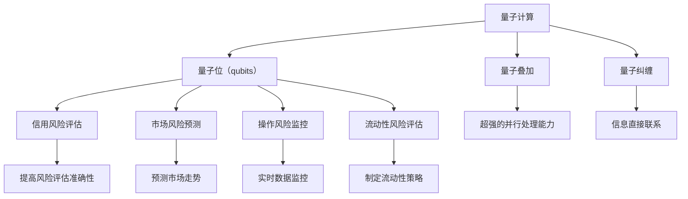

                 

### 量子计算与金融风险分析概述

#### 一、背景介绍

随着全球经济的不断复杂化和金融市场的全球化，金融风险分析变得日益重要。传统金融风险分析方法依赖于大量数据和复杂的数学模型，然而，面对大数据时代的数据量和处理速度要求，这些方法往往显得力不从心。量子计算作为一种颠覆性的计算技术，以其超强的并行处理能力和高效的算法性能，被视为未来解决复杂计算问题的有力工具。

金融风险分析涉及多个领域，包括信用风险、市场风险、操作风险和流动性风险等。这些风险的分析和预测对金融机构的稳健运营和风险管理至关重要。然而，传统方法在处理高度非线性和复杂的金融问题时，往往面临计算瓶颈，难以满足实际需求。量子计算通过其独特的量子位（qubits）和量子叠加原理，能够在极短时间内处理复杂的计算任务，这为其在金融风险分析中的应用提供了广阔的前景。

#### 二、量子计算的核心概念

量子计算的核心在于量子位（qubits）。与传统的二进制位（bits）只能表示0或1不同，量子位可以同时处于0和1的状态，这种现象称为量子叠加。此外，量子位之间可以通过量子纠缠实现信息之间的直接联系，使得量子计算机能够同时处理多个问题。

量子叠加是量子计算的基础，其数学描述可以用希尔伯特空间中的向量表示。一个量子位的状态可以表示为：

$$
|\psi\rangle = a|0\rangle + b|1\rangle
$$

其中，\(a\) 和 \(b\) 是复数，且满足 \(|a|^2 + |b|^2 = 1\)。这个公式表明，量子位可以同时处于0和1的状态。

量子纠缠是另一个重要的量子现象。当两个量子位发生纠缠时，一个量子位的状态会直接影响另一个量子位的状态，无论它们相隔多远。量子纠缠使得量子计算机能够实现超强的并行处理能力，这对于解决复杂问题具有重要意义。

#### 三、金融风险分析中的潜在应用

量子计算在金融风险分析中的潜在应用主要包括以下几个方面：

1. **信用风险评估**：量子计算能够快速处理大量的信用数据，通过量子算法对借款人的信用风险进行评估，提高风险评估的准确性和效率。
   
2. **市场风险预测**：量子计算可以对市场数据进行深度分析，预测市场走势和风险，帮助金融机构制定更科学的投资策略。

3. **操作风险监控**：量子计算能够实时处理金融机构的交易数据，检测潜在的操作风险，提高金融机构的风险管理水平。

4. **流动性风险评估**：量子计算可以快速分析金融机构的流动性状况，帮助制定合理的流动性风险管理策略。

#### 四、核心概念与联系

为了更好地理解量子计算在金融风险分析中的应用，我们可以通过Mermaid流程图来展示核心概念之间的关系架构：

通过这个流程图，我们可以清晰地看到量子计算的核心概念与金融风险分析应用之间的联系，以及量子计算如何通过其独特的特性提高金融风险分析的效率和准确性。

在接下来的章节中，我们将深入探讨量子计算的基本原理、量子算法的应用、实际案例研究以及量子计算在金融风险分析中的未来展望，帮助读者全面理解这一领域的最新进展和潜在影响。

#### 文章摘要

本文深入探讨了量子计算在金融风险分析中的潜在应用。首先，介绍了量子计算的基础知识，包括量子位（qubits）、量子叠加和量子纠缠等核心概念。接着，通过Mermaid流程图展示了量子计算与金融风险分析之间的联系。然后，分析了量子计算在信用风险评估、市场风险预测、操作风险监控和流动性风险评估等方面的应用，并提供了具体的案例研究。最后，展望了量子计算在金融风险分析领域的未来发展趋势和潜在影响。通过本文，读者可以全面了解量子计算在金融风险分析中的重要性和应用前景。

