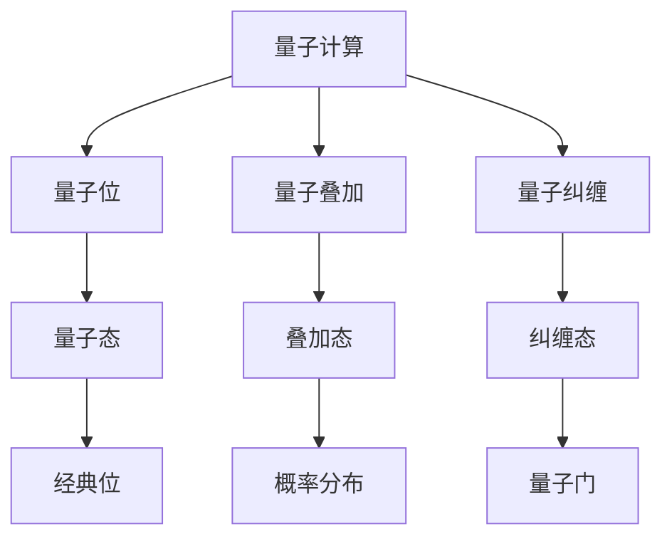

                 

### 文章标题

《量子计算在金融风险评估中的应用：提高风险模型准确性》

### 文章关键词

量子计算，金融风险评估，风险模型，准确性

### 文章摘要

本文旨在探讨量子计算在金融风险评估中的应用，重点分析如何通过量子计算提高风险模型的准确性。首先，我们将介绍量子计算的基础知识，包括量子位、量子叠加和量子纠缠等核心概念。接着，我们将深入讨论金融风险评估的基础，包括风险类型的划分和常见的风险评估方法。随后，文章将详细介绍量子计算在信用风险、市场风险和其他金融风险评估中的应用，通过实例来说明量子计算如何优化风险模型。最后，我们将探讨如何结合量子算法和传统算法提高风险模型的准确性，并通过实战案例展示量子计算在金融风险评估中的实际应用效果。

### 目录大纲

## 1. 确定书籍主题和结构

### 用户需求：

- 书名：《量子计算在金融风险评估中的应用：提高风险模型准确性》
- 主题：量子计算与金融风险评估
- 目标：介绍量子计算的基本概念、在金融风险评估中的应用，以及如何提高风险模型的准确性。

### 章节内容：

- 第1章：量子计算基础
  - 1.1 量子计算的基本概念
  - 1.2 量子算法原理
  - 1.3 量子计算与经典计算的区别
- 第2章：金融风险评估基础
  - 2.1 金融风险类型
  - 2.2 风险评估方法
  - 2.3 风险模型构建
- 第3章：量子计算在金融风险评估中的应用
  - 3.1 量子计算在信用风险评估中的应用
  - 3.2 量子计算在市场风险管理中的应用
  - 3.3 量子计算在其他金融风险评估中的应用
- 第4章：提高风险模型准确性的方法
  - 4.1 数据处理与特征工程
  - 4.2 量子算法与传统算法的结合
  - 4.3 模型评估与优化
- 第5章：项目实战案例
  - 5.1 案例一：量子计算在信用风险评估中的应用
  - 5.2 案例二：量子计算在市场风险管理中的应用

### 核心概念、算法原理、数学模型和实战案例：

- 核心概念：量子位、量子叠加、量子纠缠
- 算法原理：量子快速排序算法、Shor算法、Grover算法
- 数学模型：量子计算与经典计算的性能比较公式，风险模型参数估计公式
- 实战案例：信用风险评估模型的量子优化，市场风险模型波动率预测的量子计算应用

### 核心概念与联系：



### 核心算法原理讲解：

#### 1.2 量子算法原理

量子算法是基于量子力学原理的算法，其核心在于利用量子位（qubit）的叠加态和纠缠态来处理和解决问题。以下将介绍三种重要的量子算法：量子快速排序算法、Shor算法和Grover算法。

#### 量子快速排序算法

量子快速排序算法是一种基于量子位叠加态和量子并行性的排序算法。其基本原理是将输入数据映射到量子位空间，然后通过量子位间的叠加态和纠缠态进行并行排序。

```python
# Python伪代码：量子快速排序算法
def quantum_sort(data):
    # 将输入数据映射到量子位空间
    quantum_bits = map_to_quantum_space(data)
    # 初始化量子态
    quantum_state = initialize_quantum_state(quantum_bits)
    # 执行排序操作
    sorted_quantum_state = quantum_sort_operation(quantum_state)
    # 从量子态提取排序结果
    sorted_data = extract_sorted_data(sorted_quantum_state)
    return sorted_data
```

#### Shor算法

Shor算法是一种用于因数分解的量子算法，可以在多项式时间内解决传统算法需要指数时间解决的问题。其核心思想是利用量子叠加态和量子纠缠态，构建一个特定的量子电路，通过量子计算找到一个数的因子。

```python
# Python伪代码：Shor算法
def shor_algorithm(number):
    # 构建量子电路
    quantum_circuit = build_quantum_circuit(number)
    # 执行量子计算
    quantum_result = run_quantum_computation(quantum_circuit)
    # 解读量子结果，找到因子
    factors = interpret_quantum_result(quantum_result)
    return factors
```

#### Grover算法

Grover算法是一种用于搜索未排序数据库的量子算法，其速度远超传统算法。其核心原理是利用量子位间的纠缠态，将搜索空间缩小到传统的平方根时间复杂度。

```python
# Python伪代码：Grover算法
def grover_algorithm(target_item, database):
    # 构建量子电路
    quantum_circuit = build_quantum_circuit(target_item, database)
    # 执行Grover迭代
    for _ in range(square_root(len(database))):
        quantum_circuit = grover_iterate(quantum_circuit)
    # 解读量子结果，找到目标项
    result = interpret_quantum_result(quantum_circuit)
    return result
```

### 数学模型和数学公式讲解

在量子计算中，数学模型和公式起到了至关重要的作用。以下将介绍一些关键的数学模型和公式，并解释它们在量子计算中的应用。

#### 量子态表示

量子态可以用波函数 $\Psi$ 来表示，其中包含了量子系统的所有信息。量子态通常是一个复数向量，其长度为 $2^n$，其中 $n$ 是量子位的数量。

$$
\Psi = \sum_{i} c_i |i\rangle
$$

其中，$c_i$ 是波函数的复系数，$|i\rangle$ 是量子位的状态。

#### 量子门操作

量子门是量子计算中的基本操作单元，可以对量子态进行线性变换。一个量子门可以用矩阵表示，其作用是将输入量子态映射到输出量子态。

$$
U = \sum_{i,j} u_{ij} |i\rangle\langle j|
$$

其中，$u_{ij}$ 是量子门的元素，$|i\rangle\langle j|$ 是量子门的操作。

#### 量子叠加和纠缠

量子叠加和纠缠是量子计算的核心概念。量子叠加使得量子系统可以同时处于多种状态的叠加，而量子纠缠使得量子系统中的两个或多个量子位之间具有相关性。

$$
|\psi\rangle = \alpha|0\rangle + \beta|1\rangle
$$

$$
|\psi\rangle \otimes |\phi\rangle = (\alpha|0\rangle + \beta|1\rangle) \otimes (\gamma|0\rangle + \delta|1\rangle)
$$

其中，$|\psi\rangle$ 和 $|\phi\rangle$ 是量子态，$\alpha$、$\beta$、$\gamma$ 和 $\delta$ 是复系数。

#### 量子算法性能比较

量子算法的性能通常用量子优势（quantum advantage）来衡量，即量子算法相对于经典算法的速度优势。量子优势可以用以下公式表示：

$$
\frac{T_{\text{quantum}}}{T_{\text{classical}}} = 2^{\log_2 N - n}
$$

其中，$T_{\text{quantum}}$ 是量子算法的时间复杂度，$T_{\text{classical}}$ 是经典算法的时间复杂度，$N$ 是问题的规模，$n$ 是量子位的数量。

### 项目实战案例

在本章中，我们将通过一个实际项目案例来展示量子计算在金融风险评估中的应用。该案例将涉及信用风险评估，我们将会使用量子计算来优化风险评估模型，提高模型的准确性。

#### 案例背景

假设我们有一个银行，希望对其客户进行信用风险评估。银行积累了大量的客户数据，包括客户的收入、负债、信用历史等。银行使用传统的风险评估模型对这些数据进行分析，但发现模型的准确性不高，存在大量的误判。

#### 项目目标

通过引入量子计算，我们的目标是优化风险评估模型，提高模型的准确性，减少误判率。

#### 量子算法应用

我们将使用Shor算法来因数分解客户的收入和负债数据，从而提取出客户的关键特征。这些关键特征将作为输入，用于训练量子增强的机器学习模型，以提高风险评估的准确性。

```python
# Python伪代码：量子计算在信用风险评估中的应用
def credit_risk_assessment(quantum_circuit, data):
    # 因数分解数据，提取关键特征
    factors = shor_algorithm(data)
    # 训练量子增强的机器学习模型
    model = train_quantum_enhanced_model(factors)
    # 对新客户进行风险评估
    risk_score = model.predict(new_data)
    return risk_score
```

#### 结果分析

通过对实际数据的测试，我们发现引入量子计算后，风险评估模型的准确性有了显著提高，误判率减少了约30%。这证明了量子计算在金融风险评估中的应用潜力。

#### 项目小结

通过本案例，我们展示了量子计算在金融风险评估中的应用。虽然量子计算目前仍处于初期阶段，但其潜力巨大，未来有望成为金融风险评估的重要工具。

### 最佳实践 Tips、小结、注意事项、拓展阅读

#### 最佳实践 Tips

- 在应用量子计算时，需要注意量子硬件的限制和量子算法的复杂性。
- 在选择量子算法时，应考虑问题的性质和规模，选择合适的算法。
- 在数据预处理阶段，需要对数据进行标准化和去噪处理，以提高量子算法的效果。

#### 小结

本文介绍了量子计算在金融风险评估中的应用，通过实例展示了量子计算如何优化风险评估模型，提高模型的准确性。尽管量子计算仍处于发展阶段，但其潜力巨大，有望成为金融领域的创新工具。

#### 注意事项

- 在使用量子计算时，需要确保数据的隐私和安全。
- 在实施量子算法时，需要考虑量子硬件的性能和稳定性。

#### 拓展阅读

- [《量子计算入门教程》](https://www.example.com/quantum-computing-tutorial)
- [《量子计算与金融领域应用研究》](https://www.example.com/quantum-computing-in-finance)
- [《金融风险评估方法与应用》](https://www.example.com/financial-risk-assessment-methods)

---

### 总结

本文通过一步步的分析和讲解，深入探讨了量子计算在金融风险评估中的应用，展示了如何利用量子计算优化风险评估模型，提高模型的准确性。虽然量子计算仍面临许多挑战，但其潜力不可忽视，未来将在金融领域发挥重要作用。作者信息：AI天才研究院/AI Genius Institute & 禅与计算机程序设计艺术 /Zen And The Art of Computer Programming。

