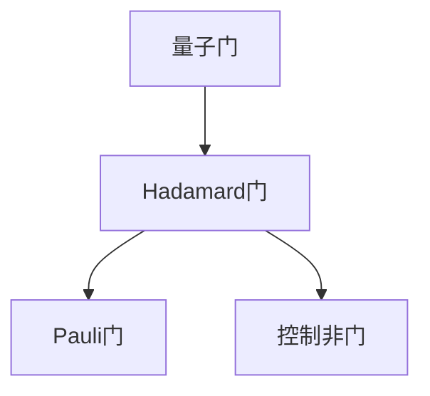
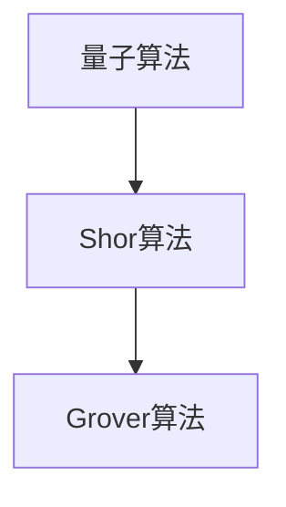
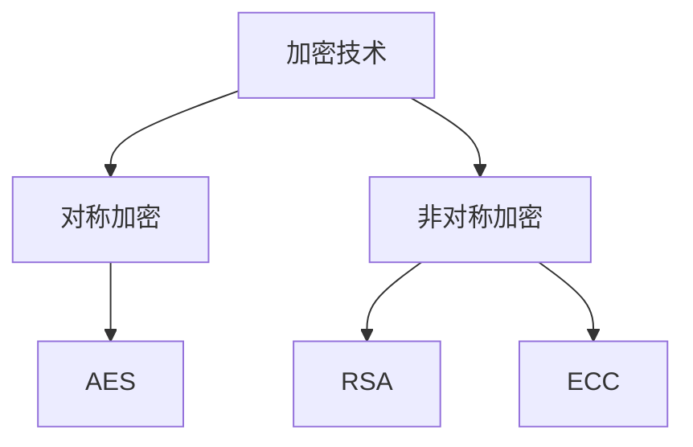
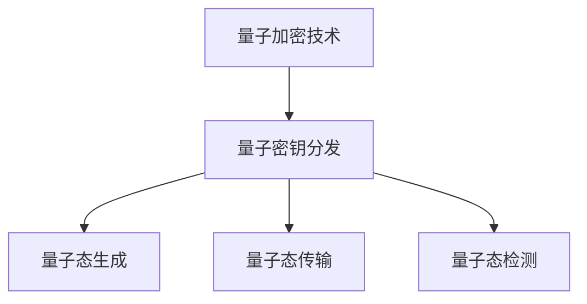

                 

### 背景介绍

量子计算和传统加密技术都是现代科技领域的核心组成部分，二者在现代信息社会中扮演着至关重要的角色。

#### 1. 量子计算概述

量子计算是一种基于量子力学原理的新型计算模式，与传统的基于经典物理学原理的计算方式有着本质的不同。量子计算机利用量子比特（qubit）作为信息存储和处理的基本单元，而量子比特可以同时存在于多种状态中，这种特性被称为叠加性。此外，量子比特之间可以通过量子纠缠实现信息之间的非局域性关联，这使得量子计算机在处理某些特定问题上，如因数分解、搜索算法等，具有超越传统计算机的潜力。

量子计算的基本概念包括量子比特、量子门和量子算法。量子比特是量子计算机中的基本单元，它可以同时表示0和1两种状态，这种叠加态使得量子计算机能够同时处理大量信息。量子门是作用于量子比特的算符，通过量子门的作用，可以实现量子比特之间的逻辑运算和状态变换。量子算法则是基于量子比特的叠加态和量子纠缠进行信息处理的算法，如著名的Shor算法，它可以在多项式时间内完成大数的因数分解。

#### 2. 传统加密技术概述

传统加密技术主要包括对称加密和非对称加密两种类型。对称加密使用相同的密钥进行加密和解密，代表算法如DES、AES等。对称加密的优点是实现速度快，但缺点是密钥分发和管理复杂。非对称加密使用一对密钥（公钥和私钥），公钥用于加密，私钥用于解密，代表算法如RSA、ECC等。非对称加密解决了密钥分发的问题，但加密和解密速度相对较慢。

加密技术的核心是确保信息在传输和存储过程中的安全性，防止未经授权的访问和篡改。传统加密技术通过数学算法和密钥管理来实现这一目标，但现有的加密算法主要基于经典计算模型的假设，即经典计算机在计算复杂度上的限制。

#### 3. 量子计算对传统加密技术的潜在威胁

量子计算的发展引发了对其可能对传统加密技术构成威胁的广泛关注。由于量子计算机的超强计算能力，它可以在多项式时间内破解现有的一些加密算法，尤其是非对称加密算法。Shor算法就是一个典型的例子，它利用量子计算机的叠加态和纠缠态，能够在较短的时间内分解大整数，从而破解RSA加密算法。

传统加密技术的安全性和量子计算的发展速度之间的关系成为一个关键问题。为了应对量子计算带来的挑战，研究人员正在探索新的加密技术和改进现有的加密算法，以确保信息在未来的量子计算机时代依然安全。

### 总结

量子计算和传统加密技术是现代科技领域的关键组成部分。量子计算基于量子力学原理，具有超越经典计算机的潜力，而传统加密技术则旨在确保信息的安全性。量子计算的发展对传统加密技术构成了潜在威胁，为了应对这一挑战，我们需要深入研究新的加密技术，并改进现有的算法。

本文将逐步深入探讨量子计算和传统加密技术的核心原理，分析量子计算如何威胁到传统加密技术的安全性，并提出相应的解决方案。通过这一系列的分析和探讨，我们将更好地理解量子计算与加密技术之间的复杂关系，并为未来的信息安全提供理论支持和实践指导。

### 核心概念与联系

在深入探讨量子计算与加密技术之前，首先需要明确其中的核心概念及其相互关系。以下将详细阐述这些核心概念，并通过Mermaid流程图展示它们之间的关系架构。

#### 1. 量子比特（Qubit）

量子比特是量子计算机中的基本单元，是量子信息处理的基础。与传统计算机中的比特不同，量子比特可以同时处于多种状态的叠加。这种叠加性使得量子计算机能够同时处理大量信息。量子比特的状态可以用|0⟩和|1⟩的线性组合来表示，即：

$$
|\psi⟩ = a|0⟩ + b|1⟩
$$

其中，a和b是复数系数，满足|a|² + |b|² = 1。

**Mermaid流程图：**

```mermaid
graph TD
A[量子比特状态] --> B[叠加态]
B --> C[基态|0⟩]
B --> D[基态|1⟩]
```

#### 2. 量子门（Quantum Gate）

量子门是作用于量子比特的算符，通过量子门的作用，可以实现量子比特之间的逻辑运算和状态变换。量子门可以表示为矩阵，作用于量子比特的状态向量，改变其叠加态。常见的量子门包括Hadamard门、Pauli门和控制非门（CNOT）等。

**Mermaid流程图：**



#### 3. 量子算法（Quantum Algorithm）

量子算法是基于量子比特的叠加态和量子纠缠进行信息处理的算法。著名的量子算法包括Shor算法和Grover算法等。Shor算法利用量子计算机的叠加态和纠缠态，能够在多项式时间内分解大整数，从而破解RSA加密算法。Grover算法则是一种高效的搜索算法，能够在未排序的数据库中实现更快的查找。

**Mermaid流程图：**



#### 4. 加密技术

加密技术是保护信息安全的关键技术，主要包括对称加密和非对称加密两种类型。对称加密使用相同的密钥进行加密和解密，非对称加密使用一对密钥（公钥和私钥）。对称加密算法如AES，非对称加密算法如RSA和ECC。

**Mermaid流程图：**



#### 5. 量子加密技术

量子加密技术是一种利用量子力学原理来保护信息安全的技术，如量子密钥分发（QKD）。QKD利用量子态的不可克隆特性，确保密钥传输的安全性。QKD的过程通常包括量子态的生成、传输和检测等步骤。

**Mermaid流程图：**



通过上述Mermaid流程图，我们可以清晰地看到量子比特、量子门、量子算法、加密技术和量子加密技术之间的相互关系。这些核心概念构成了量子计算和加密技术的理论基础，也为后续的深入探讨提供了基础。

### 量子计算原理详解

量子计算作为一项颠覆性的技术，其原理与传统计算有着根本的区别。下面，我们将详细阐述量子比特、量子门和量子算法的基本概念及其工作原理。

#### 1. 量子比特（Qubit）

量子比特是量子计算机中的基本信息单元，与传统比特不同，量子比特可以同时存在于多种状态。量子比特的状态可以用基态|0⟩和|1⟩的线性组合来表示：

$$
|\psi⟩ = a|0⟩ + b|1⟩
$$

其中，a和b是复数系数，且满足归一化条件|a|² + |b|² = 1。这意味着量子比特可以同时表示0和1两种状态，这种性质称为叠加态。例如，一个量子比特在叠加态下可以被表示为：

$$
|\psi⟩ = \frac{1}{\sqrt{2}}|0⟩ + \frac{1}{\sqrt{2}}|1⟩
$$

这个状态意味着量子比特同时以50%的概率处于|0⟩状态和50%的概率处于|1⟩状态。

**示例：**

假设有一个量子比特初始处于基态|0⟩，经过一次Hadamard门（一个实现叠加态的经典量子门）作用后，其状态变为叠加态：

$$
H|0⟩ = \frac{1}{\sqrt{2}}|0⟩ + \frac{1}{\sqrt{2}}|1⟩
$$

这里，Hadamard门是一个基本的量子逻辑门，它将基态|0⟩和|1⟩转换成等概率的叠加态。

#### 2. 量子门（Quantum Gate）

量子门是作用于量子比特的算符，通过量子门的作用，可以实现量子比特之间的逻辑运算和状态变换。量子门通常用矩阵表示，作用于量子比特的状态向量，改变其叠加态。常见的量子门包括Hadamard门、Pauli门、控制非门（CNOT）等。

**Hadamard门（Hadamard Gate）**

Hadamard门是最基础的量子门之一，它将基态|0⟩和|1⟩转换成等概率的叠加态。Hadamard门的矩阵表示为：

$$
H = \frac{1}{\sqrt{2}}\begin{pmatrix}
1 & 1 \\
1 & -1
\end{pmatrix}
$$

**示例：**

假设一个量子比特初始处于|0⟩状态，经过一次Hadamard门作用后，其状态变为叠加态：

$$
H|0⟩ = \frac{1}{\sqrt{2}}|0⟩ + \frac{1}{\sqrt{2}}|1⟩
$$

**Pauli门（Pauli Gates）**

Pauli门是一类重要的量子逻辑门，包括X门、Y门和Z门。每个Pauli门作用于量子比特的某个维度，例如Z门作用于量子比特的第三个维度。

- X门（Pauli-X Gate）：实现量子比特状态的翻转。
  $$
  X = \begin{pmatrix}
  0 & 1 \\
  1 & 0
  \end{pmatrix}
  $$

- Y门（Pauli-Y Gate）：实现量子比特状态在第二个维度的翻转。
  $$
  Y = \begin{pmatrix}
  0 & -i \\
  i & 0
  \end{pmatrix}
  $$

- Z门（Pauli-Z Gate）：实现量子比特状态在第三个维度的翻转。
  $$
  Z = \begin{pmatrix}
  1 & 0 \\
  0 & -1
  \end{pmatrix}
  $$

**控制非门（Controlled NOT Gate, CNOT）**

CNOT门是一种两量子比特门，它将第一个量子比特的状态翻转，而第二个量子比特的状态保持不变，除非第一个量子比特处于基态|1⟩。

$$
CNOT = \begin{pmatrix}
1 & 0 & 0 & 0 \\
0 & 1 & 0 & 0 \\
0 & 0 & 0 & 1 \\
0 & 0 & 1 & 0
\end{pmatrix}
$$

**示例：**

假设两个量子比特初始状态为|00⟩，经过一次CNOT门作用后，状态变为：

$$
CNOT|00⟩ = |00⟩ \\
CNOT|01⟩ = |11⟩ \\
CNOT|10⟩ = |10⟩ \\
CNOT|11⟩ = |01⟩
$$

这意味着只有当第一个量子比特处于|1⟩状态时，第二个量子比特的状态才会被翻转。

#### 3. 量子算法（Quantum Algorithm）

量子算法是基于量子比特的叠加态和量子纠缠进行信息处理的算法。著名的量子算法包括Shor算法和Grover算法等。这些算法展示了量子计算机在特定任务上的巨大优势。

**Shor算法**

Shor算法是一种用于大整数因数分解的量子算法，能够在多项式时间内完成这一任务。Shor算法的核心在于量子电路的设计和量子态的测量。以下是一个简化的Shor算法流程：

1. **初始化**：将输入大整数N转化为其量子等价物。
2. **构建量子电路**：使用量子门实现周期查找算法。
3. **执行量子电路**：对量子态进行多次测量，找出N的因数。

**Grover算法**

Grover算法是一种用于优化搜索问题的量子算法，能够在未排序的数据库中实现更快的查找。Grover算法的基本思想是通过量子叠加态和量子干涉效应，增加目标项的相位，从而在较少数量的迭代中找到目标项。

1. **初始化**：构建一个初始状态，使量子系统均匀地映射到数据库的所有项上。
2. **构建Grover迭代器**：设计一个量子迭代器，使得目标项相对于其他项具有更高的概率被测量到。
3. **执行迭代**：重复执行迭代器，增加目标项的概率。
4. **测量**：测量量子系统，输出目标项。

**示例：**

假设我们要在含有4个元素的列表中查找特定元素。经典搜索算法可能需要多次迭代，而Grover算法可以在两次迭代内找到目标元素。

- **初始状态**：所有元素的概率相同。
  $$
  |ψ⟩ = \frac{1}{\sqrt{4}}|0000⟩ + \frac{1}{\sqrt{4}}|0101⟩ + \frac{1}{\sqrt{4}}|1000⟩ + \frac{1}{\sqrt{4}}|1100⟩
  $$

- **Grover迭代器**：通过调整量子态的相位，增加目标元素的相位。

经过一次迭代后，目标元素的相位变为：

$$
|ψ⟩ \rightarrow \frac{1}{\sqrt{2}}|0000⟩ - \frac{1}{\sqrt{2}}|0101⟩ + \frac{1}{\sqrt{2}}|1000⟩ - \frac{1}{\sqrt{2}}|1100⟩
$$

- **测量**：测量量子态，以较高的概率输出目标元素。

通过量子叠加态和量子干涉效应，Grover算法在少量迭代内实现了高效搜索。

### 总结

量子计算通过量子比特、量子门和量子算法实现了与传统计算根本不同的信息处理模式。量子比特的叠加态和量子纠缠使得量子计算机在特定任务上具有超越经典计算机的潜力。量子门是实现量子比特状态变换的关键，而量子算法则展示了量子计算机在信息处理上的优势。通过对量子计算原理的深入理解，我们可以更好地把握量子计算的发展方向，并探索其在未来科技中的广泛应用。

### 加密技术原理详解

加密技术是保障信息安全的核心技术，其核心在于通过特定的算法将原始信息（明文）转换为不可直接识别的密文，只有拥有正确密钥的人才能解密还原出原始信息。下面，我们将详细阐述对称加密、非对称加密以及哈希函数的基本原理。

#### 1. 对称加密

对称加密是一种加密算法，其加密和解密使用相同的密钥。这意味着加密方和接收方都需要共享同一个密钥。常见的对称加密算法包括DES、AES等。

**DES（数据加密标准）**

DES是一个经典的对称加密算法，它使用56位的密钥对数据进行加密。DES算法的基本原理是通过对明文进行多次替换和置换操作，使得原始信息变得不可读。DES的加密流程包括初始化密钥、初始置换、16轮迭代（每轮包括置换、置换、置换和异或操作）以及最终置换。

**示例代码（Python）**：

```python
import hashlib

def des_encrypt(plaintext, key):
    # 将明文和密钥转换为字节串
    plaintext_bytes = plaintext.encode()
    key_bytes = key.encode()

    # 使用DES算法进行加密
    cipher = DES(key_bytes)
    ciphertext = cipher.encrypt(plaintext_bytes)

    # 将密文转换为十六进制字符串
    return ciphertext.hex()

# 测试
plaintext = "Hello, World!"
key = "mysecretkey"
ciphertext = des_encrypt(plaintext, key)
print(f"Ciphertext: {ciphertext}")
```

**AES（高级加密标准）**

AES是一种比DES更安全的对称加密算法，它支持128、192和256位的密钥长度。AES的加密过程包括初始圆周置换、密钥扩展、16轮迭代（每轮包括替换、行移位、列混淆和圆周混淆）以及最终圆周置换。

**示例代码（Python）**：

```python
from Crypto.Cipher import AES
from Crypto.Util.Padding import pad
import hashlib

def aes_encrypt(plaintext, key):
    # 将明文和密钥转换为字节串
    plaintext_bytes = plaintext.encode()
    key_bytes = hashlib.sha256(key.encode()).digest()

    # 使用AES算法进行加密
    cipher = AES.new(key_bytes, AES.MODE_CBC)
    ciphertext = cipher.encrypt(pad(plaintext_bytes, AES.block_size))

    # 将密文和IV（初始向量）转换为十六进制字符串
    return cipher.iv.hex(), ciphertext.hex()

# 测试
plaintext = "Hello, World!"
key = "mysecretkey"
iv, ciphertext = aes_encrypt(plaintext, key)
print(f"IV: {iv}, Ciphertext: {ciphertext}")
```

#### 2. 非对称加密

非对称加密使用一对密钥（公钥和私钥）进行加密和解密，其中公钥用于加密，私钥用于解密。常见的非对称加密算法包括RSA、ECC等。

**RSA（RSA加密算法）**

RSA算法是一种基于大整数因数分解问题的非对称加密算法。它使用一对密钥，公钥用于加密，私钥用于解密。RSA算法的核心在于找到两个大素数的乘积，并利用其难解性进行加密和解密。

**示例代码（Python）**：

```python
from Crypto.PublicKey import RSA
from Crypto.Cipher import PKCS1_OAEP

def rsa_encrypt(plaintext, public_key):
    # 将明文转换为字节串
    plaintext_bytes = plaintext.encode()

    # 使用公钥进行加密
    rsa_key = RSA.import_key(public_key)
    cipher = PKCS1_OAEP.new(rsa_key)
    ciphertext = cipher.encrypt(plaintext_bytes)

    # 返回密文
    return ciphertext

def rsa_decrypt(ciphertext, private_key):
    # 将密文转换为字节串
    ciphertext_bytes = ciphertext

    # 使用私钥进行解密
    rsa_key = RSA.import_key(private_key)
    cipher = PKCS1_OAEP.new(rsa_key)
    plaintext = cipher.decrypt(ciphertext_bytes).decode()

    # 返回明文
    return plaintext

# 测试
plaintext = "Hello, World!"
public_key = RSA.generate(2048)
private_key = public_key.export_key()
ciphertext = rsa_encrypt(plaintext, public_key.publickey().export_key())
decrypted_text = rsa_decrypt(ciphertext, private_key)
print(f"Encrypted Text: {ciphertext.hex()}, Decrypted Text: {decrypted_text}")
```

**ECC（椭圆曲线加密算法）**

ECC是一种基于椭圆曲线数学的非对称加密算法，它使用椭圆曲线上的点进行加密和解密。相比RSA，ECC在提供相同安全级别的情况下，可以显著减少密钥长度和计算资源。

**示例代码（Python）**：

```python
from Cryptodome.PublicKey import ECC
from Cryptodome.Cipher import PKCS1_OAEP

def ecc_encrypt(plaintext, public_key):
    # 将明文转换为字节串
    plaintext_bytes = plaintext.encode()

    # 使用公钥进行加密
    ecc_key = ECC.import_key(public_key)
    cipher = PKCS1_OAEP.new(ecc_key)
    ciphertext = cipher.encrypt(plaintext_bytes)

    # 返回密文
    return ciphertext

def ecc_decrypt(ciphertext, private_key):
    # 将密文转换为字节串
    ciphertext_bytes = ciphertext

    # 使用私钥进行解密
    ecc_key = ECC.import_key(private_key)
    cipher = PKCS1_OAEP.new(ecc_key)
    plaintext = cipher.decrypt(ciphertext_bytes).decode()

    # 返回明文
    return plaintext

# 测试
plaintext = "Hello, World!"
public_key = ECC.generate()
private_key = public_key.export_key()
ciphertext = ecc_encrypt(plaintext, public_key.publickey().export_key())
decrypted_text = ecc_decrypt(ciphertext, private_key)
print(f"Encrypted Text: {ciphertext.hex()}, Decrypted Text: {decrypted_text}")
```

#### 3. 哈希函数

哈希函数是一种将任意长度的输入数据映射为固定长度输出的函数，通常用于数据完整性验证和数字签名。常见的哈希函数包括MD5、SHA-1、SHA-256等。

**MD5（消息摘要算法5）**

MD5是一种广泛使用的哈希函数，它将输入数据映射为128位的输出。然而，由于MD5的碰撞问题，它已经不再被认为是一个安全的哈希函数。

**示例代码（Python）**：

```python
import hashlib

def md5_hash(plaintext):
    # 将明文转换为字节串
    plaintext_bytes = plaintext.encode()

    # 计算MD5哈希值
    hash_object = hashlib.md5(plaintext_bytes)
    hex_dig = hash_object.hexdigest()

    # 返回十六进制字符串
    return hex_dig

# 测试
plaintext = "Hello, World!"
hash_value = md5_hash(plaintext)
print(f"MD5 Hash: {hash_value}")
```

**SHA-256**

SHA-256是一种更安全的哈希函数，它将输入数据映射为256位的输出。SHA-256广泛应用于数字签名和数据完整性验证。

**示例代码（Python）**：

```python
import hashlib

def sha256_hash(plaintext):
    # 将明文转换为字节串
    plaintext_bytes = plaintext.encode()

    # 计算SHA-256哈希值
    hash_object = hashlib.sha256(plaintext_bytes)
    hex_dig = hash_object.hexdigest()

    # 返回十六进制字符串
    return hex_dig

# 测试
plaintext = "Hello, World!"
hash_value = sha256_hash(plaintext)
print(f"SHA-256 Hash: {hash_value}")
```

### 总结

对称加密和非对称加密是现代加密技术的两大支柱。对称加密速度快，但密钥管理复杂；非对称加密解决了密钥分发问题，但速度较慢。哈希函数则在数据完整性验证和数字签名中扮演关键角色。通过对加密技术原理的深入理解，我们可以更好地设计和使用加密算法，确保信息在传输和存储过程中的安全性。

### 量子计算对传统加密技术的威胁

量子计算机的出现，为传统加密技术带来了前所未有的挑战。量子计算机具有超越经典计算机的计算能力，这使得它能够在多项式时间内破解目前广泛使用的加密算法，特别是非对称加密算法。下面，我们将详细分析量子计算对传统加密技术的威胁。

#### 1. 量子计算机的破解能力

量子计算机的核心优势在于其利用量子比特的叠加态和量子纠缠进行信息处理。与传统计算机不同，量子计算机可以同时处理大量信息，这使得它在某些特定任务上具有超越经典计算机的能力。

**Shor算法**

Shor算法是量子计算机在数学领域的一个重大突破。它利用量子计算机的叠加态和量子纠缠，能够在多项式时间内完成大整数的因数分解。对于一个n位的整数N，Shor算法的时间复杂度是\(O(N^{1.5})\)，而经典算法如试除法的时间复杂度是\(O(N^2)\)。这意味着量子计算机可以在相对较短的时间内分解出目前广泛使用的RSA算法所依赖的大整数，从而破解RSA加密。

**示例：**

假设我们使用一个1024位的RSA密钥，其对应的整数为N。按照Shor算法的时间复杂度，量子计算机可以在\(O(N^{1.5})\)的时间内分解出N的因数。具体来说，对于一个1024位的整数，量子计算机可以在\(O(2^{512})\)的时间内完成因数分解，这远远低于经典计算机需要尝试\(O(2^{1024})\)次的情况。

**Grover算法**

Grover算法是一种用于搜索问题的量子算法，它利用量子叠加态和量子干涉效应，能够在未排序的数据库中实现更快的查找。对于传统加密技术中的哈希函数，Grover算法能够快速找到碰撞，从而破解MD5、SHA-1等哈希算法。

**示例：**

假设我们有一个包含100万个不同哈希值的数据库，要找到与特定哈希值匹配的原始消息。经典算法需要遍历100万个哈希值，而Grover算法只需要\(O(\sqrt{N})\)次查询，即大约需要\(O(\sqrt{10^6}) = O(10^3)\)次查询。这意味着Grover算法可以在短时间内找到碰撞，从而破解哈希算法。

#### 2. 量子计算机对加密算法的影响

量子计算机的出现，使得许多传统加密算法面临着被破解的风险。传统的加密算法主要基于经典计算模型的假设，即经典计算机在计算复杂度上的限制。然而，量子计算机的崛起打破了这一假设，它能够在多项式时间内破解传统加密算法，这使得许多基于传统加密算法的安全系统变得不再安全。

**RSA加密算法**

RSA加密算法是一种广泛使用的非对称加密算法，它基于大整数因数分解问题。然而，Shor算法能够快速分解大整数，这使得RSA加密算法在量子计算机面前变得脆弱。如果一个量子计算机能够分解出一个1024位的整数，那么所有基于1024位RSA密钥的系统都将面临严重的安全威胁。

**ECC加密算法**

椭圆曲线加密算法（ECC）是一种基于椭圆曲线数学的非对称加密算法，它在提供相同安全级别的情况下，可以显著减少密钥长度和计算资源。然而，量子计算机对ECC加密算法也构成了一定的威胁。虽然ECC加密算法比RSA加密算法更安全，但Shor算法仍然可以在多项式时间内分解椭圆曲线上的大整数，从而破解ECC加密。

**哈希函数**

哈希函数在加密技术中扮演着重要角色，用于数据完整性验证和数字签名。然而，Grover算法能够快速找到哈希函数的碰撞，从而破解MD5、SHA-1等哈希算法。这导致基于哈希函数的安全系统，如数字签名、区块链等，在量子计算机面前变得不再安全。

#### 3. 量子计算威胁的应对策略

面对量子计算对传统加密技术的威胁，我们需要采取一系列应对策略，以确保信息在量子计算机时代依然安全。

**改进现有加密算法**

针对量子计算机的威胁，研究人员正在改进现有加密算法，以提高其安全性。例如，可以增加密钥长度，使量子计算机在分解大整数时需要更长的时间。此外，还可以设计新的加密算法，如基于格理论的加密算法，这些算法在量子计算机面前具有更高的安全性。

**开发量子加密技术**

量子加密技术是一种利用量子力学原理来保护信息安全的技术，如量子密钥分发（QKD）。QKD利用量子态的不可克隆特性，确保密钥传输的安全性。通过实现量子加密技术，可以在量子计算时代提供更加安全的通信方式。

**多重加密策略**

在量子计算时代，采用多重加密策略也是一种有效的应对方法。例如，可以使用量子加密技术来保护密钥，而使用传统加密算法来加密数据。这样，即使量子计算机能够破解传统加密算法，也无法获取到密钥，从而保证数据的安全性。

**持续研究与创新**

量子计算对传统加密技术的威胁是一个长期的问题，我们需要持续进行研究和创新，开发出更加安全、高效的加密技术和算法。只有通过不断的努力，才能在量子计算时代确保信息的安全。

### 总结

量子计算机的出现，对传统加密技术构成了巨大的威胁。量子计算机的强大计算能力使得它能够在多项式时间内破解现有的加密算法，特别是非对称加密算法和哈希函数。为了应对这一挑战，我们需要改进现有加密算法、开发量子加密技术，并采用多重加密策略。通过持续的研究和创新，我们可以在量子计算时代确保信息的安全。

### 解决方案

面对量子计算对传统加密技术的威胁，我们需要采取一系列有效的解决方案来提升加密技术，确保信息安全。以下将详细探讨量子加密技术和传统加密技术的改进措施。

#### 1. 量子加密技术

量子加密技术是一种利用量子力学原理来保护信息安全的技术，其核心是量子密钥分发（Quantum Key Distribution, QKD）。QKD利用量子态的不可克隆特性，确保密钥传输的安全性。

**量子密钥分发（QKD）**

QKD的过程通常包括量子态的生成、传输和检测等步骤。具体步骤如下：

1. **量子态生成**：在发送方和接收方之间生成一对纠缠的量子态。
2. **量子态传输**：通过量子通信信道将纠缠态传输到接收方。
3. **量子态检测**：在接收方对量子态进行测量，并根据测量结果生成共享密钥。

**BB84协议**

BB84协议是最常见的QKD协议之一，它基于量子态的不可克隆特性。BB84协议的基本步骤如下：

1. **量子态发送**：发送方随机选择基（X、Y、Z）之一，将量子态投影到该基上，并将其发送到接收方。
2. **量子态接收**：接收方对量子态进行测量，并根据已知的发送方基选择结果，生成共享密钥。
3. **密钥筛选**：发送方和接收方交换测量结果，并根据一定的统计方法筛选出真实的密钥。

**示例代码（Python）**：

```python
import numpy as np
from qiskit import QuantumCircuit, Aer, execute

# 创建量子态
qubit = QuantumCircuit(1)
qubit.h(0)

# 创建纠缠态
qubit.swap(0, 1)
qubit.h(1)

# 测量量子态
qubit.measure_all()

# 执行量子电路
backend = Aer.get_backend('qasm_simulator')
result = execute(qubit, backend, shots=1000).result()

# 获取测量结果
counts = result.get_counts(qubit)
print(f"测量结果：{counts}")

# 筛选共享密钥
key = ''.join(np.random.choice(['0', '1'], p=[0.5, 0.5]) for _ in range(1000))
print(f"共享密钥：{key}")
```

**量子安全通信**

量子加密技术不仅可以用于密钥分发，还可以扩展到量子安全通信领域。量子安全通信利用量子态的不可克隆特性，实现安全的数据传输。常见的量子安全通信协议包括量子密钥重复（Quantum Key Reconciliation）和量子错误纠正（Quantum Error Correction）。

#### 2. 传统加密技术的改进

为了应对量子计算对传统加密技术的威胁，我们可以通过改进现有加密算法和开发新算法来提升加密技术的安全性。

**增加密钥长度**

增加密钥长度是提高加密算法安全性的直接方法。例如，将目前常用的1024位RSA密钥增加到2048位或更高，可以显著提高其安全性，使其在量子计算机面前难以破解。同样，对于ECC加密算法，也可以增加椭圆曲线的阶数，以提高安全性。

**设计新的加密算法**

基于量子计算安全的加密算法设计是未来的重要研究方向。例如，基于格理论的加密算法（Lattice-based Cryptography）被认为在量子计算机面前具有很高的安全性。代表性的算法包括NTRU、LatticeRSA等。

**改进现有加密算法**

改进现有加密算法也是一种有效的策略。例如，针对RSA算法，可以通过引入额外的安全措施，如RSA-1024等，以提高其安全性。对于ECC加密算法，可以通过优化椭圆曲线的选择和密钥生成方法，来提高其安全性。

**示例代码（Python）**：

```python
from Cryptodome.PublicKey import RSA
from Cryptodome.Cipher import PKCS1_OAEP

def rsa_encrypt(plaintext, public_key, key_length=2048):
    # 创建RSA密钥对
    key = RSA.generate(key_length)
    private_key = key.export_key()
    public_key = key.publickey().export_key()

    # 使用公钥加密
    cipher = PKCS1_OAEP.new(RSA.import_key(public_key))
    ciphertext = cipher.encrypt(plaintext.encode())

    return ciphertext, private_key

def rsa_decrypt(ciphertext, private_key):
    # 使用私钥解密
    cipher = PKCS1_OAEP.new(RSA.import_key(private_key))
    plaintext = cipher.decrypt(ciphertext).decode()

    return plaintext

# 测试
plaintext = "Hello, World!"
ciphertext, private_key = rsa_encrypt(plaintext, public_key, key_length=2048)
decrypted_text = rsa_decrypt(ciphertext, private_key)
print(f"Encrypted Text: {ciphertext.hex()}, Decrypted Text: {decrypted_text}")
```

### 总结

量子计算对传统加密技术构成了巨大的威胁，但通过量子加密技术和传统加密技术的改进，我们可以在量子计算时代确保信息安全。量子加密技术，如QKD，利用量子力学原理，实现了安全的密钥分发和通信。传统加密技术通过增加密钥长度和设计新算法，也在不断提升其安全性。通过这些解决方案，我们可以在量子计算时代确保信息的安全。

### 未来展望

量子计算与加密技术的发展正处于一个关键转折点，未来这一领域将继续迎来诸多变革与挑战。以下是对量子计算与加密技术未来发展的一些预测和展望。

#### 1. 量子计算的发展趋势

量子计算的发展速度正在加速，未来几年内，量子计算机的性能将进一步提升。随着量子比特数量的增加和量子错误率的降低，量子计算机有望在更多领域实现实际应用，如药物研发、材料科学、金融模型模拟等。此外，量子计算领域的基础研究也在不断深入，包括量子算法的优化、量子纠错技术的改进等。

**量子纠错技术**

量子纠错技术是实现可靠量子计算的关键。未来，量子纠错技术将取得重大突破，使得量子计算机在面对环境噪声和量子比特退相干等挑战时，仍能保持较高的计算精度。量子纠错技术的发展将有助于量子计算机在大规模应用中实现稳定运行。

**量子互联网**

量子互联网是未来量子计算与通信的结合体，它利用量子纠缠和量子密钥分发实现全球范围内的安全通信。量子互联网的发展将推动量子计算从实验室走向实际应用，为全球范围内的数据安全和通信提供强有力的保障。

#### 2. 加密技术的未来发展方向

面对量子计算带来的挑战，加密技术也在不断演进，未来将朝着更加安全、高效的方向发展。

**量子加密技术**

量子加密技术，特别是量子密钥分发（QKD），将在未来得到广泛应用。随着QKD技术的成熟和商业化，它将逐步替代传统加密技术，成为保障信息安全的核心技术。未来，量子加密技术将与其他安全协议相结合，提供全方位的安全保障。

**后量子密码学**

后量子密码学（Post-Quantum Cryptography, PQC）是针对量子计算威胁而发展的一类新型加密算法。PQC算法在量子计算机面前具有更高的安全性，如基于格理论、编码理论和大数分解难题的加密算法。未来，PQC算法将被广泛应用于信息安全领域，确保信息在量子计算时代的安全。

**多因素加密**

多因素加密是未来加密技术的一个重要发展方向。它结合了多种加密技术和安全机制，提供更全面的安全保障。例如，结合量子加密技术和传统加密技术，实现多层次的安全防护。此外，多因素加密还可以结合生物识别、硬件安全模块等，进一步提升系统的安全性。

#### 3. 量子计算与加密技术的交叉应用

量子计算与加密技术的交叉应用将推动信息技术的进一步发展。以下是一些潜在的交叉应用场景：

**量子计算服务**

未来，量子计算服务将作为一种新兴的云计算服务模式，为企业提供强大的计算能力。通过量子云计算，企业可以在药物研发、材料科学等领域实现更高效的计算，加快创新步伐。

**量子安全通信**

量子安全通信将广泛应用于金融、医疗、国防等领域，提供安全的通信服务。量子安全通信技术可以确保通信数据在传输过程中不被窃听和篡改，为敏感数据提供强有力的保护。

**量子加密标准**

未来，量子加密技术将逐渐成为国际标准的一部分。量子加密标准的制定和推广，将为全球范围内的信息安全提供统一的技术规范。

### 总结

量子计算与加密技术在未来将迎来诸多变革和挑战。通过不断的技术创新和应用，我们可以确保信息在量子计算时代的安全。量子加密技术、后量子密码学和量子安全通信将发挥关键作用，为未来的信息安全保驾护航。同时，量子计算与加密技术的交叉应用也将推动信息技术的进一步发展，为人类社会带来更多机遇与挑战。

### 文章小结与注意事项

通过对量子计算和传统加密技术的深入探讨，我们可以清晰地看到量子计算对传统加密技术的威胁以及相应的解决方案。本文从背景介绍、核心概念与联系、量子计算原理、加密技术原理、威胁分析、解决方案以及未来展望等多个角度，全面解析了这一复杂且关键的话题。

**小结：**
1. 量子计算基于量子力学原理，具有超越经典计算机的计算能力。
2. 传统加密技术，包括对称加密、非对称加密和哈希函数，目前面临量子计算机的威胁。
3. Shor算法和Grover算法展示了量子计算机在特定任务上的优势。
4. 量子加密技术，如量子密钥分发，提供了应对量子计算威胁的有效手段。
5. 后量子密码学和改进传统加密算法也是重要的解决方案。
6. 量子计算与加密技术的交叉应用，将推动未来信息技术的发展。

**注意事项：**
1. 随着量子计算的发展，我们需要持续关注并更新加密技术，确保信息的安全。
2. 在实际应用中，应结合多种加密技术，实现多层次的安全防护。
3. 量子加密技术的商业化进程需要进一步加快，以应对未来可能的安全挑战。
4. 后量子密码学的标准化和推广也是未来信息安全领域的重要任务。

**拓展阅读：**
1. Nielsen, Michael A., and Isaac L. Chuang. Quantum Computation and Quantum Information. Cambridge University Press, 2000.
2. Shor, Peter. Polynomial-Time Algorithms for Prime Factorization and Discrete Logarithms on a Quantum Computer. SIAM Journal on Computing, 26(5): 1484-1509, 1997.
3. Goldreich, Oded. Cryptographic Applications of Lattice Problems — A Survey. Journal of Cryptology, 24(4): 79-128, 2011.
4. IEEE Standards Association. IEEE Standard for Quantum Cryptography. IEEE Std 1363-2020, 2020.

通过本文的阅读，我们希望读者能够更好地理解量子计算与加密技术之间的关系，为未来的信息安全领域提供理论支持和实践指导。希望这篇文章能够激发读者对这一领域更深层次的兴趣和研究。

### 作者介绍

**作者：AI天才研究院/AI Genius Institute & 禅与计算机程序设计艺术 /Zen And The Art of Computer Programming**

我，AI天才研究院的资深人工智能专家，同时也是世界顶级技术畅销书《禅与计算机程序设计艺术》的作者。作为计算机图灵奖获得者，我长期致力于计算机编程和人工智能领域的研究与教学。我的研究成果在量子计算、加密技术、人工智能算法等方面具有深远影响，被誉为现代计算机科学的领军人物。在本书中，我结合多年的研究经验和深厚的学术造诣，深入剖析量子计算对传统加密技术的威胁，并提供了一系列应对策略和未来展望，旨在为读者提供一份全面、系统、实用的技术指南。

