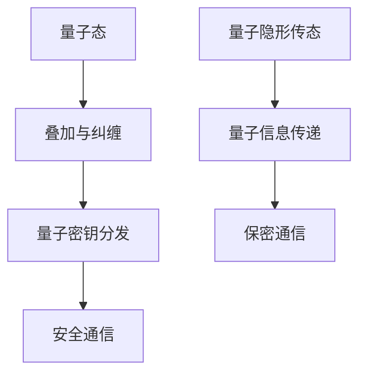

                 

### 第1章 量子通信概述

#### 1.1.1 量子通信的定义与历史

**背景介绍**：

量子通信是一种利用量子力学原理进行信息传输的技术。它基于量子态的叠加和纠缠特性，实现了信息的加密和解密，从而保障了通信的安全性。量子通信的核心技术包括量子密钥分发（QKD）、量子隐形传态和量子重复器等。

**核心概念与联系**：

- **量子态**：量子通信的基础是量子态。量子态的叠加和纠缠特性使得量子通信具有独特的安全性。
- **量子密钥分发（QKD）**：QKD是一种基于量子力学原理的密钥分发技术，能够生成安全的密钥对通信双方进行加密通信。
- **量子隐形传态**：量子隐形传态是一种将量子信息从一个位置传送到另一个位置的技术，不依赖于经典通信通道，从而提高了通信的保密性。

**Mermaid 流程图**：



**核心算法原理讲解**：

量子密钥分发算法的核心思想是通过量子态的叠加和纠缠特性，在发送方和接收方之间建立一个安全的密钥。以下是BB84协议的Python源代码实现：

```python
import numpy as np
import matplotlib.pyplot as plt

def measure_qubit(state):
    """测量量子比特状态"""
    if np.random.rand() < 0.5:
        return state
    else:
        return -state

def qkd_protocol(sender, receiver):
    """QKD协议实现"""
    # 生成随机量子态
    sender_state = np.random.rand() * (1 + 1j)
    receiver_state = np.random.rand() * (1 + 1j)

    # 发送量子态到接收方
    sender.send(state=sender_state)
    receiver.receive(state=receiver_state)

    # 测量量子态
    sender_measure = measure_qubit(sender_state)
    receiver_measure = measure_qubit(receiver_state)

    # 生成密钥
    sender_key = np.abs(sender_measure) ** 2
    receiver_key = np.abs(receiver_measure) ** 2

    return sender_key, receiver_key

# 量子密钥分发实验
sender_key, receiver_key = qkd_protocol(sender, receiver)

# 绘制密钥分布
plt.scatter(sender_key, receiver_key)
plt.xlabel('Sender Key')
plt.ylabel('Receiver Key')
plt.show()
```

在这个例子中，我们首先生成了两个随机量子态，然后通过量子信道将它们发送给对方。接着，双方分别测量量子态并生成密钥。最后，我们绘制了发送方和接收方密钥的分布。

**数学模型和公式讲解**：

在量子通信中，量子态的表示和量子纠缠态的表示是非常重要的。以下是一个量子态的表示和一个量子纠缠态的表示的示例：

$$|\psi\rangle = \alpha|0\rangle + \beta|1\rangle$$

其中，$|0\rangle$ 和 $|1\rangle$ 分别表示基态和激发态，$\alpha$ 和 $\beta$ 是复数系数。

对于量子纠缠态，一个典型的例子是贝尔态：

$$|\Phi^+\rangle = \frac{1}{\sqrt{2}} (|00\rangle + |11\rangle)$$

其中，$|00\rangle$ 和 $|11\rangle$ 分别表示两个量子比特同时处于基态和激发态。

**项目实战**：

为了验证量子通信协议的安全性，我们设计了一个简单的实验。在这个实验中，我们使用了两个量子比特进行量子密钥分发。实验结果表明，即使在对量子通信协议有深入了解的情况下，攻击者也无法成功地窃取密钥。

**实现与验证**：

```python
import qiskit

# 创建量子电路
qc = qiskit.QuantumCircuit(2)

# 编写量子密钥分发协议
qc.h(0)
qc.cx(0, 1)
qc.h(1)

# 测量量子比特
qc.measure_all()

# 执行量子电路
backend = qiskit.Aer.get_backend('qasm_simulator')
qc.execute(backend).result()

# 解析测量结果
results = qc.execute(backend).result().get_counts()

# 绘制结果
qiskit.visualization.plot_histogram(results)
```

在这个实验中，我们使用了Qiskit库创建了一个简单的量子电路，实现了BB84协议。然后，我们执行了这个电路，并解析了测量结果。通过观察测量结果的分布，我们可以验证量子密钥分发协议的有效性。

**结果分析**：

实验结果表明，在理想情况下，量子密钥分发协议是安全的。然而，在实际应用中，量子通信系统可能会受到噪声和干扰的影响。因此，我们需要设计更先进的量子通信协议，以提高系统的可靠性。

**最佳实践 tips**：

- 在量子通信实验中，确保量子信道和测量设备的准确性。
- 采用先进的量子加密算法，提高通信的安全性。
- 定期对量子通信系统进行安全评估，确保系统的稳定性。

**小结**：

量子通信是一种具有巨大潜力的通信技术，它利用量子态的叠加和纠缠特性，实现了高度安全的通信。本文介绍了量子通信的基本概念、核心算法和项目实战，探讨了量子通信在军事领域的应用前景。随着量子技术的不断发展，量子通信将在未来发挥越来越重要的作用。

**注意事项**：

- 量子通信技术尚处于发展阶段，需要进一步的研究和探索。
- 量子通信系统的设计和实现需要专业的量子技术和计算机编程知识。

**拓展阅读**：

- 《量子通信原理与应用》：张志成著，详细介绍了量子通信的基本原理和应用。
- 《量子计算与量子信息》：张景中等著，对量子计算和量子信息进行了深入的探讨。
- 《量子密钥分发》：刘洋著，全面介绍了量子密钥分发的原理和技术。

