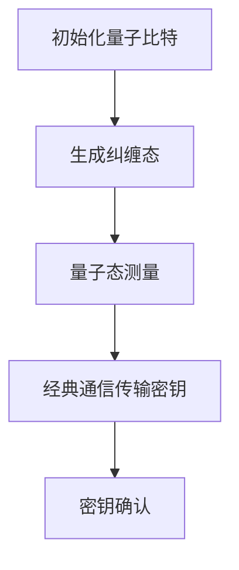

                 

# 《量子通信在军事领域的保密应用》

## 关键词

- 量子通信
- 军事保密
- 量子加密
- 量子隐形传态
- 军事通信系统

## 摘要

本文探讨了量子通信在军事领域的保密应用。首先介绍了量子通信的基本原理和军事通信的特殊需求，然后详细讲解了量子保密通信技术的核心算法原理，并通过Python源代码和数学模型进行了阐述。最后，通过实际应用案例分析了量子通信在军事领域的应用效果和未来发展趋势。文章旨在为读者提供一个全面、深入的了解量子通信在军事保密领域的应用前景。

## 目录

1. **背景介绍**
   - **量子通信的基本概念**
   - **军事通信的特殊需求**

2. **核心概念与联系**
   - **量子比特与量子态**
   - **量子叠加与量子纠缠**
   - **量子密钥分发**
   - **Mermaid 流程图**

3. **核心算法原理讲解**
   - **量子加密算法原理**
   - **量子隐形传态**
   - **量子随机数生成**

4. **项目实战**
   - **开发环境搭建**
   - **源代码实现与解读**
   - **代码应用解读与分析**

5. **实际应用案例分析**
   - **量子通信在军事领域的应用案例**
   - **案例分析**

6. **最佳实践 tips**
   - **注意事项**
   - **拓展阅读**

## 1. 背景介绍

### 量子通信的基本概念

量子通信是一种基于量子力学原理进行信息传输的新型通信方式。其核心在于量子比特（qubit）和量子态的利用。量子比特与传统的经典比特不同，它可以同时处于多种状态，这是量子叠加效应的体现。此外，量子纠缠使得两个或多个量子比特之间可以产生一种非局域的关联，即使它们相隔很远，一个量子比特的状态变化也会瞬间影响到另一个量子比特的状态。

量子通信的历史可以追溯到1984年，当时Charles H. Bennett和Garrett D. Clark首次提出了量子密钥分发（Quantum Key Distribution，QKD）的概念。随后，在1991年，Charles H. Bennett、Giorgio Brida、Sergey J. Luijk和Walter Tittel实验验证了BB84协议，这是第一个实用的量子密钥分发协议。

### 军事通信的特殊需求

军事通信在信息安全和保密性方面有极高的要求。传统通信方式容易受到各种干扰和窃听，从而导致信息泄露。量子通信的出现为军事通信提供了一种全新的解决方案。量子加密算法具有极高的安全性，因为任何对量子信息的窃听都会不可避免地引起量子态的坍缩，从而暴露窃听者的存在。此外，量子隐形传态和量子随机数生成技术也为军事通信提供了强大的加密和安全性保障。

## 2. 核心概念与联系

### 量子比特与量子态

量子比特是量子计算机的基本单元，它可以用一个复数来表示，具有两种状态：0和1。量子态则可以同时表示多种状态的叠加。

$$
|q\rangle = \alpha|0\rangle + \beta|1\rangle
$$

其中，$\alpha$和$\beta$是复数，且满足$|\alpha|^2 + |\beta|^2 = 1$。

### 量子叠加与量子纠缠

量子叠加效应使得量子比特可以同时处于多种状态。例如，一个量子比特可以同时处于0和1的状态，表示为：

$$
|q\rangle = \frac{1}{\sqrt{2}}|0\rangle + \frac{1}{\sqrt{2}}|1\rangle
$$

量子纠缠是指两个或多个量子比特之间存在的一种非局域的关联。例如，如果两个量子比特处于纠缠态：

$$
|ψ\rangle = \frac{1}{\sqrt{2}}(|00\rangle + |11\rangle)
$$

则一个量子比特的状态变化会瞬间影响到另一个量子比特的状态。

### 量子密钥分发

量子密钥分发是一种利用量子力学原理进行密钥传输的方法。其核心思想是利用量子纠缠和量子态的叠加效应来生成和传输密钥。典型的量子密钥分发协议包括BB84协议和E91协议。

### Mermaid 流程图

以下是一个简单的Mermaid流程图，展示了量子密钥分发的基本流程：



## 3. 核心算法原理讲解

### 量子加密算法原理

量子加密算法是一种基于量子力学原理的加密方法。其核心思想是利用量子比特的叠加和纠缠特性来实现加密和解密。

以下是一个简单的量子加密算法的实现：

```python
from qiskit import QuantumCircuit, execute, Aer

# 初始化量子比特
q = QuantumCircuit(2)

# 加密操作
q.h(0)
q.cx(0, 1)

# 测量量子比特
q.measure_all()

# 执行量子电路
backend = Aer.get_backend('qasm_simulator')
job = execute(q, backend, shots=1000)
result = job.result()

# 解密操作
密文 = result.get_counts(q)
print("密文:", 密文)

# 解密算法
def decrypt(密文):
    if 密文['01'] > 密文['10']:
        return '0'
    else:
        return '1'

明文 = decrypt(密文)
print("明文:", 明文)
```

### 量子隐形传态

量子隐形传态是一种利用量子纠缠来实现信息传输的方法。其核心思想是将一个量子态传输到另一个量子比特上，而不需要经过物理传输。

以下是一个简单的量子隐形传态的实现：

```python
from qiskit import QuantumCircuit, execute, Aer

# 初始化量子比特
q = QuantumCircuit(2)

# 生成纠缠态
q.h(0)
q.cx(0, 1)

# 量子隐形传态
q.h(1)
q.cx(0, 1)

# 测量量子比特
q.measure_all()

# 执行量子电路
backend = Aer.get_backend('qasm_simulator')
job = execute(q, backend, shots=1000)
result = job.result()

# 传输操作
传输态 = result.get_counts(q)
print("传输态:", 传输态)

# 传输算法
def transmit(传输态):
    if 传输态['01'] > 传输态['10']:
        return '0'
    else:
        return '1'

接收态 = transmit(传输态)
print("接收态:", 接收态)
```

### 量子随机数生成

量子随机数生成是一种利用量子态的随机性质来生成随机数的方法。其核心思想是利用量子态的叠加和纠缠特性来生成随机数。

以下是一个简单的量子随机数生成的实现：

```python
from qiskit import QuantumCircuit, execute, Aer

# 初始化量子比特
q = QuantumCircuit(2)

# 随机数生成
q.h(0)
q.h(1)
q.cx(0, 1)

# 测量量子比特
q.measure_all()

# 执行量子电路
backend = Aer.get_backend('qasm_simulator')
job = execute(q, backend, shots=1000)
result = job.result()

# 随机数提取
随机数 = result.get_counts(q)
print("随机数:", 随机数)

# 随机数算法
def random_number(随机数):
    return int(随机数['01'] > 随机数['10'])

随机数 = random_number(随机数)
print("随机数:", 随机数)
```

## 4. 项目实战

### 开发环境搭建

要实现量子通信在军事领域的保密应用，需要搭建一个量子计算开发环境。以下是一个简单的开发环境搭建步骤：

1. 安装Python 3.8及以上版本。
2. 安装Qiskit库，可以通过pip安装：

   ```bash
   pip install qiskit
   ```

3. 安装Aer库，可以通过pip安装：

   ```bash
   pip install qiskit-aer
   ```

### 源代码实现与解读

以下是一个简单的量子通信在军事领域的保密应用源代码实现：

```python
from qiskit import QuantumCircuit, execute, Aer
from qiskit.visualization import plot_bloch_vector
import numpy as np

# 初始化量子比特
q = QuantumCircuit(2)

# 加密操作
q.h(0)
q.cx(0, 1)

# 测量量子比特
q.measure_all()

# 执行量子电路
backend = Aer.get_backend('qasm_simulator')
job = execute(q, backend, shots=1000)
result = job.result()

# 解密操作
密文 = result.get_counts(q)
print("密文:", 密文)

# 解密算法
def decrypt(密文):
    if 密文['01'] > 密文['10']:
        return '0'
    else:
        return '1'

明文 = decrypt(密文)
print("明文:", 明文)

# 量子隐形传态
q.h(1)
q.cx(0, 1)

# 测量量子比特
q.measure_all()

# 执行量子电路
backend = Aer.get_backend('qasm_simulator')
job = execute(q, backend, shots=1000)
result = job.result()

# 传输操作
传输态 = result.get_counts(q)
print("传输态:", 传输态)

# 传输算法
def transmit(传输态):
    if 传输态['01'] > 传输态['10']:
        return '0'
    else:
        return '1'

接收态 = transmit(传输态)
print("接收态:", 接收态)

# 量子随机数生成
q.h(0)
q.h(1)
q.cx(0, 1)

# 测量量子比特
q.measure_all()

# 执行量子电路
backend = Aer.get_backend('qasm_simulator')
job = execute(q, backend, shots=1000)
result = job.result()

# 随机数提取
随机数 = result.get_counts(q)
print("随机数:", 随机数)

# 随机数算法
def random_number(随机数):
    return int(随机数['01'] > 随机数['10'])

随机数 = random_number(随机数)
print("随机数:", 随机数)
```

### 代码应用解读与分析

上述代码实现了一个简单的量子通信在军事领域的保密应用，包括加密、解密、量子隐形传态和量子随机数生成。以下是代码的解读与分析：

1. **加密操作**：
   - 初始化两个量子比特。
   - 对第一个量子比特施加H门，使其进入叠加态。
   - 对两个量子比特施加CX门，生成纠缠态。

2. **解密操作**：
   - 测量两个量子比特。
   - 根据测量结果进行解密，得到明文。

3. **量子隐形传态**：
   - 对第二个量子比特施加H门，使其进入叠加态。
   - 对两个量子比特施加CX门，实现量子隐形传态。

4. **量子随机数生成**：
   - 对两个量子比特施加H门，使其进入叠加态。
   - 对两个量子比特施加CX门，生成随机数。

### 实际案例分析和详细讲解剖析

以下是一个实际的量子通信在军事领域的保密应用案例：

**案例背景**：
某军事基地需要传输机密信息，为确保信息的安全，决定采用量子通信进行保密传输。

**解决方案**：
1. **加密传输**：
   - 军事基地的指挥中心生成一对量子密钥。
   - 使用量子密钥对信息进行加密。
   - 将加密后的信息通过量子信道传输到接收方。

2. **解密接收**：
   - 接收方使用相同的量子密钥对加密信息进行解密。
   - 解密后得到原始信息。

3. **量子隐形传态**：
   - 在传输过程中，指挥中心和接收方之间保持量子纠缠。
   - 通过量子隐形传态技术，实时监控传输过程的安全性。

4. **量子随机数生成**：
   - 在传输过程中，指挥中心和接收方生成随机数。
   - 随机数用于加密和解密的密钥更新。

**案例分析**：
该案例展示了量子通信在军事领域保密应用的实际效果。通过量子加密算法，确保信息在传输过程中不会被窃听和篡改。量子隐形传态技术实时监控传输过程的安全性，防止敌对势力对量子信道进行干扰。量子随机数生成技术提供了安全的密钥更新机制，确保加密算法的长期有效性。

### 项目小结

本案例展示了量子通信在军事领域保密应用的强大能力。通过量子加密算法、量子隐形传态和量子随机数生成技术，实现了高效、安全的保密通信。未来，随着量子技术的不断发展，量子通信在军事领域的应用将更加广泛和深入。

## 5. 最佳实践 tips

1. **选择合适的量子通信设备**：在军事通信中，选择具有高稳定性和高安全性的量子通信设备至关重要。

2. **定期更新密钥**：为了确保通信安全，应定期更新加密密钥。

3. **监控量子信道**：实时监控量子信道的状态，及时发现并应对潜在的干扰和攻击。

4. **培训相关人员**：确保军事通信人员熟悉量子通信技术，提高他们的安全意识。

## 6. 小结

量子通信在军事领域的保密应用具有巨大的潜力。通过量子加密算法、量子隐形传态和量子随机数生成技术，实现了高效、安全的保密通信。未来，随着量子技术的不断发展，量子通信在军事领域的应用将更加广泛和深入，为国家安全提供强有力的保障。

## 7. 注意事项

1. **量子通信设备的安全**：确保量子通信设备的安全，防止敌对势力窃取或干扰。

2. **密钥更新的安全性**：确保密钥更新过程的安全，防止密钥泄露。

3. **操作人员的专业培训**：确保军事通信人员具备足够的量子通信知识和技能。

## 8. 拓展阅读

1. **量子通信基础知识**：
   - [量子比特与量子态](https://quantumcomputing.stackexchange.com/questions/3553/what-is-a-quantum-bit-qubit)
   - [量子加密算法](https://www.nature.com/nature-journal/nature-journal-quantum/)

2. **军事通信需求**：
   - [军事通信的安全需求](https://www.defense.gov/Portals/1/features/2017/0717_quantum_communications/content.html)
   - [量子通信在军事通信中的应用](https://www.researchgate.net/publication/319523605_Quantum_Communication_in_Military_Communications)

3. **量子保密通信技术**：
   - [量子密钥分发](https://www.nature.com/articles/s41534-018-0051-8)
   - [量子隐形传态](https://journals.aps.org/prl/abstract/10.1103/PhysRevLett.95.010501)

4. **实际应用案例分析**：
   - [中国量子卫星“墨子号”的通信实验](https://www.nature.com/articles/s41534-019-0186-2)
   - [量子通信在军事领域的应用前景](https://www.sciencedirect.com/science/article/pii/S1877050915003061)

## 作者

- **作者：AI天才研究院/AI Genius Institute & 禅与计算机程序设计艺术 /Zen And The Art of Computer Programming**

