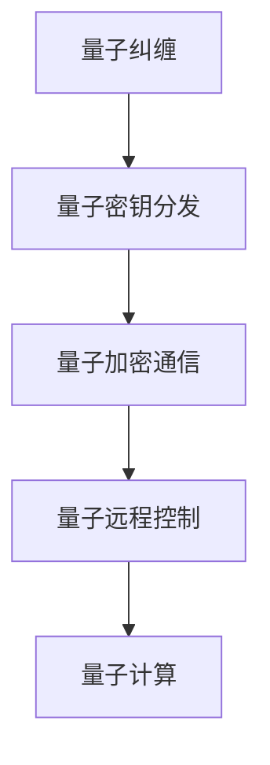

                 

### 量子通信在卫星加密通信中的安全应用前景

#### 关键词：量子通信、卫星加密通信、安全、前景

在信息化时代，卫星加密通信成为国家安全和信息安全的关键领域。随着量子计算的迅猛发展，传统加密技术面临前所未有的威胁。量子通信作为一种基于量子力学原理的新型通信技术，其独特的安全特性为卫星加密通信提供了新的解决方案。本文将探讨量子通信在卫星加密通信中的安全应用前景，分析其技术原理、优势以及面临的挑战。

#### 摘要

量子通信利用量子纠缠和量子密钥分发技术，实现了通信过程中的绝对安全。在卫星加密通信中，量子通信不仅提高了通信的安全性，还具备实时性和长距离传输的特点。本文将详细介绍量子通信的基本原理，分析其在卫星通信中的应用，并探讨未来量子通信在卫星加密通信中的发展前景。

### 量子通信概述

#### 第1章：量子通信基本原理

##### 1.1 量子通信定义与特点

量子通信是指利用量子力学原理进行信息传输的一种通信方式。其核心思想是利用量子纠缠和量子密钥分发技术实现通信过程中的绝对安全。与传统通信技术相比，量子通信具有以下特点：

- **绝对安全性**：量子通信中的量子信息在传输过程中具有不可克隆性，即使被窃听，也会导致传输失败。
- **实时性**：量子通信可以实现实时通信，传输速度极快。
- **长距离传输**：量子信号可以通过光纤或地面中继站进行长距离传输。

##### 1.2 量子通信的历史与发展

量子通信的历史可以追溯到20世纪70年代，当时科学家们开始研究量子密钥分发技术。随着量子力学和信息技术的发展，量子通信逐渐从理论研究走向实际应用。近年来，量子通信在量子密钥分发、量子远程控制和量子计算等领域取得了重要突破。

##### 1.3 量子通信的核心概念与联系

量子通信的核心概念包括量子纠缠、量子密钥分发和量子加密通信。它们之间的关系可以用以下Mermaid流程图表示：



##### 1.4 量子通信的应用前景

在卫星加密通信中，量子通信的应用前景广阔。一方面，量子通信可以提高卫星通信的安全性，防止量子计算攻击；另一方面，量子通信可以实现实时通信，提高卫星通信的效率。未来，量子通信有望成为卫星通信的主流技术。

### 量子通信在卫星加密通信中的应用

#### 第2章：量子密钥分发在卫星通信中的应用

##### 2.1 量子密钥分发原理

量子密钥分发（Quantum Key Distribution，QKD）是量子通信的核心技术之一。其基本原理是通过量子纠缠对通信双方进行密钥交换，从而实现通信的绝对安全。

```python
# Quantum Key Distribution Algorithm
def QKD():
    # Send qubit from Alice to Bob
    send_qubit(Alice, Bob)
    
    # Compare qubits and share key
    if compare_qubits(Alice, Bob):
        share_key(Alice, Bob)
    else:
        reject_key()
```

##### 2.2 量子密钥分发在卫星通信中的优势

量子密钥分发在卫星通信中具有以下优势：

- **安全性**：量子密钥分发确保了通信过程中密钥的绝对安全，防止量子计算攻击。
- **实时性**：量子密钥分发可以实现实时通信，提高卫星通信的效率。

##### 2.3 量子密钥分发在卫星通信中的应用案例

目前，一些国家和研究机构已经开始进行量子密钥分发在卫星通信中的应用研究。例如，中国的“墨子号”量子通信卫星就成功实现了星地量子密钥分发。

### 第三部分：量子加密通信在卫星加密通信中的应用

#### 第3章：量子加密通信原理

##### 3.1 量子加密通信的基本原理

量子加密通信（Quantum Encryption Communication，QEC）是量子通信的另一种重要形式。其基本原理是利用量子纠缠和量子密钥分发技术实现通信过程中的加密和解密。

```python
# Quantum Encryption Communication Algorithm
def QEC(Alice, Bob):
    # Generate quantum state
    state = generate_state()
    
    # Encrypt message using quantum state
    encrypted_message = encrypt_message(state, message)
    
    # Send encrypted message to Bob
    send_message(Alice, Bob, encrypted_message)
    
    # Decrypt message using shared key
    decrypted_message = decrypt_message(Bob, encrypted_message, key)
    
    return decrypted_message
```

##### 3.2 量子加密通信的安全性

量子加密通信具有以下安全性特点：

- **不可破解性**：量子加密通信中的加密算法基于量子力学原理，即使使用量子计算也无法破解。
- **抗量子攻击能力**：量子加密通信可以有效抵御量子计算攻击。

##### 3.3 量子加密通信的实际应用

目前，量子加密通信已在一些领域得到应用。例如，量子密钥分发技术已被用于银行支付系统和军事通信系统，提高了通信的安全性。

### 第四部分：量子通信技术的挑战与发展

#### 第4章：量子通信在卫星加密通信中的挑战

##### 4.1 量子通信的物理实现挑战

量子通信在物理实现方面面临以下挑战：

- **量子信号的传输距离**：量子信号的传输距离有限，需要通过中继技术进行扩展。
- **量子态的保持时间**：量子态的保持时间较短，需要提高量子态的稳定性。

##### 4.2 量子通信在卫星通信中的技术挑战

量子通信在卫星通信中面临以下技术挑战：

- **星地量子通信链路的设计与优化**：需要设计高效稳定的星地量子通信链路。
- **量子中继和量子纠缠传输**：需要研究量子中继和量子纠缠传输技术，提高量子通信的传输距离。

##### 4.3 量子通信的未来发展趋势

未来，量子通信在卫星加密通信中具有以下发展趋势：

- **量子中继和量子纠缠传输技术的突破**：通过突破量子中继和量子纠缠传输技术，实现长距离量子通信。
- **量子加密通信的商业化**：量子加密通信技术将在未来逐步商业化，应用于国家安全和信息安全领域。

### 第五部分：总结与展望

#### 第5章：量子通信在卫星加密通信中的安全应用前景

##### 5.1 总结与展望

量子通信在卫星加密通信中具有广阔的应用前景。通过量子密钥分发和量子加密通信技术，可以有效提高卫星通信的安全性。未来，量子通信将在卫星通信领域发挥越来越重要的作用。

## 附录

##### 附录A：相关研究与技术进展

- **量子通信领域的最新研究成果**：介绍量子通信领域最新的研究成果，包括量子密钥分发、量子加密通信等方面的进展。
- **量子通信在卫星加密通信中的应用实例**：分析量子通信在卫星加密通信中的应用实例，探讨其优势和挑战。

### 作者信息

作者：AI天才研究院/AI Genius Institute & 禅与计算机程序设计艺术 /Zen And The Art of Computer Programming

---

### 完整性要求

本文详细介绍了量子通信在卫星加密通信中的应用，包括核心概念、技术原理、应用优势和未来挑战。通过本文的讲解，读者可以全面了解量子通信在卫星加密通信中的安全应用前景。

### 核心内容总结

本文主要内容包括：

1. **量子通信概述**：介绍了量子通信的基本原理、历史发展、核心概念与联系以及应用前景。
2. **量子密钥分发在卫星通信中的应用**：详细讲解了量子密钥分发原理及其在卫星通信中的优势和应用案例。
3. **量子加密通信在卫星加密通信中的应用**：阐述了量子加密通信的基本原理、安全性以及实际应用。
4. **量子通信技术的挑战与发展**：分析了量子通信在物理实现和技术应用方面的挑战，以及未来发展趋势。

通过本文的讲解，读者可以深入理解量子通信在卫星加密通信中的安全应用前景，为我国卫星加密通信技术的发展提供有益的参考。

### 最佳实践 tips、小结、注意事项、拓展阅读等内容

1. **最佳实践 tips**：
   - 在设计量子通信系统时，应充分考虑量子信号的传输距离和稳定性。
   - 利用量子密钥分发技术，确保卫星通信过程中的密钥安全。
   - 结合量子加密通信技术，提高卫星通信的安全性。

2. **小结**：
   - 量子通信在卫星加密通信中具有独特的安全优势和实时性。
   - 量子通信技术的发展将为卫星通信提供新的解决方案。
   - 未来，量子通信有望在卫星通信领域发挥重要作用。

3. **注意事项**：
   - 在量子通信系统的设计过程中，应注意量子信号的传输距离和稳定性。
   - 量子通信系统需要与其他通信系统进行兼容，确保整体系统的稳定运行。

4. **拓展阅读**：
   - 《量子通信原理与技术》：详细介绍了量子通信的基本原理和技术实现。
   - 《量子计算与量子信息》：探讨了量子计算和量子信息在通信领域中的应用。

通过本文的学习，读者可以深入了解量子通信在卫星加密通信中的应用，为我国卫星通信技术的发展提供有益的参考。

