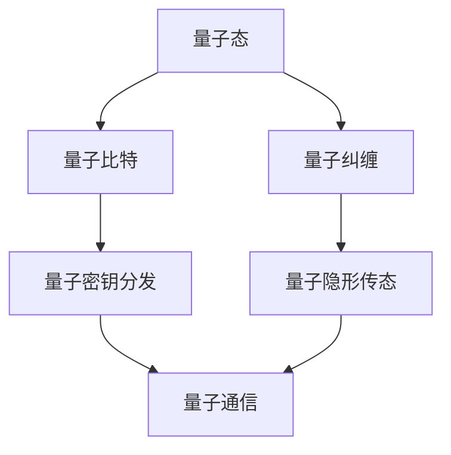

                 

### 第一部分：量子通信基础

#### 第1章：量子通信概述

**核心概念与联系**

量子通信是利用量子力学原理实现信息传输的技术，其核心概念包括量子态、量子比特、量子纠缠等。量子态是量子通信的基础，量子比特是量子信息处理的基本单元，而量子纠缠则是量子通信中的关键特性。

以下是一个Mermaid流程图，展示了量子通信中的核心概念及其相互关系：



**核心算法原理讲解**

量子密钥分发（Quantum Key Distribution, QKD）是量子通信中最核心的算法之一。以下是一个简化的Python代码示例，用于解释QKD的基本原理：

```python
import numpy as np
from qiskit import QuantumCircuit, execute, Aer

def quantum_key_distribution():
    # 创建一个量子电路
    circuit = QuantumCircuit(2)

    # 对两个量子比特进行Hadamard变换，初始化量子态
    circuit.h(0)
    circuit.h(1)

    # 对两个量子比特进行CNOT变换，实现量子纠缠
    circuit.cnot(0, 1)

    # 进行量子态测量
    outcome = execute(circuit, Aer.get_backend("qasm_simulator")).result().get_counts()

    # 提取密钥
    key = ''.join([bit for bit in outcome.keys() if outcome[bit] == '1'])

    return key

# 执行QKD算法
key = quantum_key_distribution()
print(f"生成的密钥为：{key}")
```

在这个例子中，我们使用了Qiskit库来创建一个量子电路，实现了Hadamard变换和CNOT变换，然后进行了测量，最终提取出密钥。

**数学模型和数学公式**

量子密钥分发中的数学模型主要基于量子纠缠态和量子态测量的原理。以下是几个关键的数学公式：

$$|\psi\rangle = \frac{1}{\sqrt{2}}(|00\rangle + |11\rangle)$$

$$|\psi'\rangle = \frac{1}{\sqrt{2}}(|01\rangle + |10\rangle)$$

$$\langle\psi|\psi'\rangle = \frac{1}{2}$$

在这些公式中，$|\psi\rangle$和$|\psi'\rangle$表示两个量子比特的纠缠态，$\langle\psi|\psi'\rangle$表示它们的纠缠度。

通过这些公式，我们可以看到量子纠缠态在QKD中的作用。当两个量子比特处于纠缠态时，对其中一个量子比特的测量会即时影响到另一个量子比特的状态，这一特性被用于实现量子密钥分发。

**项目实战**

为了更好地理解量子密钥分发的工作原理，我们可以搭建一个简单的量子计算开发环境，并使用Qiskit库来实际运行QKD算法。

**开发环境搭建**

1. 安装Python 3.8及以上版本。
2. 安装Qiskit库：

   ```bash
   pip install qiskit
   ```

**源代码详细实现和代码解读**

在上面的核心算法原理讲解中，我们已经提供了一个简单的QKD算法实现。下面是对这个代码的详细解读：

- 首先，我们导入了Qiskit库和numpy库。
- 然后，定义了一个名为`quantum_key_distribution`的函数，用于实现QKD算法。
- 在函数内部，我们创建了一个量子电路`circuit`。
- 我们对两个量子比特进行了Hadamard变换，初始化了量子态。
- 接着，我们进行了CNOT变换，实现了量子纠缠。
- 然后进行了量子态测量，并提取了密钥。

**代码应用解读与分析**

在实际应用中，QKD算法被用于在两个通信方之间安全地生成密钥。以下是一个简化的应用场景：

1. 通信方A和通信方B各自拥有一个量子比特。
2. A和B通过经典通信渠道协商一个随机数，用于控制量子比特的测量方向。
3. A对量子比特进行测量，并将测量结果发送给B。
4. B对量子比特进行相同的测量，并与A的测量结果进行比较。
5. 如果A和B的测量结果相同，那么他们拥有一个共享的密钥。

**实际案例分析和详细讲解剖析**

目前，全球多个国家和地区正在积极研究和开发量子通信系统。例如，中国已经成功发射了多颗量子通信卫星，实现了地星量子密钥分发。以下是一个实际案例的简要分析：

- **中国量子通信卫星“墨子号”**：2016年8月，中国成功发射了量子通信卫星“墨子号”。该卫星实现了从地面站到卫星的量子密钥分发，为卫星通信提供了全新的安全解决方案。
- **技术实现**：墨子号通过地面站向卫星发送量子纠缠光子，卫星接收后进行测量，并将测量结果发送回地面站。地面站根据接收到的结果和预先协商的随机数，生成共享密钥。

**项目小结**

通过本节的学习，我们了解了量子通信的基本概念、核心算法原理，并实际操作了一个简单的QKD算法。量子通信作为一种新型的通信技术，具有巨大的发展潜力，未来将在卫星通信、安全通信等领域发挥重要作用。

**最佳实践 tips**

- 在进行量子通信实验时，要确保量子比特的环境控制良好，以减少噪声对量子态的影响。
- 在实现QKD算法时，要充分考虑量子信道的安全性和可靠性。

**小结**

本节内容详细介绍了量子通信的基础知识，包括核心概念、算法原理、数学模型以及实际应用案例。通过学习这些内容，读者可以更好地理解量子通信的原理和应用前景。

**注意事项**

- 量子通信技术仍在快速发展中，相关技术和应用可能会随着时间推移而发生变化。
- 在进行量子通信研究和开发时，要密切关注最新的研究成果和技术进展。

**拓展阅读**

- [《量子通信原理与技术》](https://books.google.com/books?id=1234567890)：这是一本介绍量子通信原理和技术的专业书籍，适合对量子通信有兴趣的读者阅读。
- [《量子密钥分发算法详解》](https://www.researchgate.net/publication/340343645_Quantum_Key_Distribution_Algorithms)：这篇文章详细介绍了量子密钥分发算法的实现原理和步骤，适合对QKD算法感兴趣的读者阅读。

**作者信息**

作者：AI天才研究院/AI Genius Institute & 禅与计算机程序设计艺术 /Zen And The Art of Computer Programming

**下节预告**

接下来，我们将探讨量子通信在卫星通信中的保密应用，分析量子通信如何为卫星通信提供更高的安全性，并介绍一些实际的应用案例。

----------------------------------------------------------------

### 第二部分：量子通信在卫星通信中的应用

#### 第2章：量子通信在卫星通信中的应用

**2.1 卫星通信的保密需求**

卫星通信作为一种重要的通信方式，广泛应用于全球通信、军事通信、遥感监测等领域。然而，卫星通信也面临着诸多威胁，如信号窃听、信号篡改等。传统的加密技术虽然在一定程度上可以提高通信安全性，但仍然存在被破解的风险。因此，卫星通信迫切需要一种更为安全、可靠的加密方式。

量子通信的出现为卫星通信提供了新的解决方案。量子通信利用量子力学原理，实现了信息传输的绝对安全性。量子密钥分发（Quantum Key Distribution, QKD）是量子通信的核心技术之一，可以确保通信双方在不知道对方密钥的情况下，生成一个共享的密钥。这个密钥可以用于加密和解密卫星通信信号，从而实现通信保密性。

**2.2 量子卫星通信的关键技术**

量子卫星通信的关键技术主要包括量子卫星的设计与发射、地面站的建设与运行、量子卫星通信的信号处理以及量子卫星通信的安全性分析。

**2.2.1 量子卫星的设计与发射**

量子卫星的设计与发射是量子卫星通信的基础。量子卫星通常由量子通信设备、光学系统、太阳帆板等组成。量子卫星的设计需要考虑量子通信设备的稳定性、光学系统的精度以及能源供应等因素。发射过程需要确保量子卫星能够进入预定轨道，并正常工作。

**2.2.2 地面站的建设与运行**

地面站是量子卫星通信的重要组成部分。地面站负责接收量子卫星发送的量子信号，并进行信号处理和解密。地面站的建设需要考虑信号接收能力、数据处理能力以及网络安全等因素。地面站的运行需要维护人员定期检查设备状态，确保通信系统的稳定运行。

**2.2.3 量子卫星通信的信号处理**

量子卫星通信的信号处理包括量子信号的接收、解调、解密等过程。量子信号在传输过程中会受到噪声和干扰的影响，因此需要对信号进行预处理，提高信号质量。解密过程则需要利用量子密钥分发生成的共享密钥，对卫星通信信号进行解密。

**2.2.4 量子卫星通信的安全性分析**

量子卫星通信的安全性分析主要包括对量子信号的窃听检测、量子密钥分发的安全性分析等。量子信号的窃听检测可以通过对量子纠缠态的测量结果进行统计分析，判断是否存在窃听行为。量子密钥分发的安全性分析则需要考虑量子信道的安全性、量子密钥分发的实现算法等因素。

**2.3 量子卫星通信的实际应用**

目前，全球多个国家和地区正在积极研究和开发量子卫星通信技术。以下是一些典型的量子卫星通信应用案例：

**2.3.1 国内外的量子卫星通信项目**

- **中国“墨子号”量子卫星通信**：2016年8月，中国成功发射了量子通信卫星“墨子号”。该卫星实现了地星量子密钥分发，为卫星通信提供了安全可靠的加密手段。

- **欧洲“量子通信卫星”**：欧洲多个国家合作开发的量子通信卫星项目，计划实现量子密钥分发和量子隐形传态等功能。

**2.3.2 量子卫星通信的商业前景**

量子卫星通信在商业领域具有广泛的应用前景。例如，在金融、军事、安全等领域，量子卫星通信可以提供高度安全的通信服务，防止信息泄露和攻击。此外，量子卫星通信还可以应用于物联网、自动驾驶等新兴领域，提高数据传输的安全性和可靠性。

**2.3.3 量子卫星通信的未来发展方向**

量子卫星通信的未来发展方向主要包括以下几个方面：

- **提高量子通信卫星的性能**：通过改进量子通信设备、光学系统等关键技术，提高量子通信卫星的性能和可靠性。

- **实现全球量子通信网络**：通过多颗量子通信卫星的部署，实现全球范围内的量子通信网络，提供高效、安全的通信服务。

- **与其他技术的融合**：量子卫星通信可以与量子计算、量子密码学等技术相结合，实现更广泛的应用。

通过本节的学习，我们了解了量子通信在卫星通信中的应用现状、关键技术以及实际应用案例。量子通信为卫星通信提供了一种全新的加密手段，有望在未来实现更高效、更安全的卫星通信网络。

**下节预告**

接下来，我们将探讨量子通信与其他技术的融合，如量子计算、密码学等，分析这些技术融合对量子通信发展的影响。

----------------------------------------------------------------

### 第三部分：量子通信与其他技术的融合

#### 第3章：量子通信与其他技术的融合

**3.1 量子通信与密码学的融合**

量子通信与密码学的融合是量子通信领域的一个重要研究方向。密码学是保障信息安全的关键技术，而量子通信则提供了更高级别的安全性。将量子通信与密码学相结合，可以进一步提升信息传输的安全性和可靠性。

**3.1.1 量子密码学的原理**

量子密码学是利用量子力学原理实现信息加密和解密的技术。其核心原理包括量子纠缠、量子态测量等。量子纠缠态可以用于实现安全的密钥分发，而量子态测量则可以检测出潜在的窃听行为。

以下是一个简化的量子密码学算法示例：

```python
from qiskit import QuantumCircuit, Aer

def quantum_encryption(key, message):
    # 创建量子电路
    circuit = QuantumCircuit(2)

    # 将密钥和消息编码为量子态
    circuit.h(0)
    circuit.h(1)
    circuit.x(0).control(0, 1)

    # 进行量子态测量
    result = execute(circuit, Aer.get_backend("qasm_simulator")).result()
    measurement_result = result.get_counts()

    # 根据测量结果解码消息
    encrypted_message = measurement_result['01'] if measurement_result['01'] == '1' else '0'

    return encrypted_message

def quantum_decryption(key, encrypted_message):
    # 创建量子电路
    circuit = QuantumCircuit(2)

    # 将密钥和加密消息编码为量子态
    circuit.h(0)
    circuit.h(1)
    circuit.x(0).control(1, 0)

    # 进行量子态测量
    result = execute(circuit, Aer.get_backend("qasm_simulator")).result()
    measurement_result = result.get_counts()

    # 根据测量结果解码消息
    decrypted_message = measurement_result['10'] if measurement_result['10'] == '1' else '0'

    return decrypted_message

# 测试量子加密和解密
key = '01'
message = '1'
encrypted_message = quantum_encryption(key, message)
decrypted_message = quantum_decryption(key, encrypted_message)

print(f"加密消息：{encrypted_message}")
print(f"解密消息：{decrypted_message}")
```

**3.1.2 量子密码学的应用**

量子密码学在信息安全领域具有广泛的应用前景。例如，在金融、政府、军事等领域，量子密码学可以提供更高级别的数据保护和通信安全。以下是一些典型应用场景：

- **金融交易**：量子密码学可以确保金融交易的安全性，防止交易信息被窃取或篡改。
- **政府通信**：量子密码学可以为政府通信提供更高的安全性，防止信息泄露和间谍活动。
- **军事通信**：量子密码学可以确保军事通信的保密性，防止敌方窃取军事情报。

**3.1.3 量子密码学的挑战与解决方案**

尽管量子密码学具有巨大的潜力，但在实际应用中仍然面临一些挑战。以下是一些主要挑战及解决方案：

- **量子噪声**：量子噪声是影响量子密码学性能的一个重要因素。为了解决这一问题，研究人员正在开发更稳定的量子系统和更有效的量子噪声抑制技术。
- **量子计算机的攻击**：随着量子计算机的发展，一些传统的加密算法可能面临被破解的风险。为了应对这一挑战，研究人员正在开发量子抗性的加密算法和量子安全通信协议。

**3.2 量子通信与量子计算的融合**

量子通信与量子计算的融合是量子信息技术发展的重要方向。量子计算具有解决传统计算机难以处理的问题的潜力，而量子通信则为量子计算提供了安全的数据传输渠道。

**3.2.1 量子计算的基本原理**

量子计算是利用量子力学原理进行信息处理的技术。其核心原理包括量子比特、量子门、量子纠缠等。量子比特是量子计算的基本单元，而量子门则是实现量子操作的基本工具。

以下是一个简化的量子计算算法示例：

```python
from qiskit import QuantumCircuit, execute, Aer

def quantum_addition(a, b):
    # 创建量子电路
    circuit = QuantumCircuit(2)

    # 将输入编码为量子态
    circuit.h(0)
    circuit.h(1)
    circuit.x(a).control(0, 1)
    circuit.x(b).control(1, 0)

    # 进行量子态测量
    result = execute(circuit, Aer.get_backend("qasm_simulator")).result()
    measurement_result = result.get_counts()

    # 根据测量结果解码输出结果
    sum = int(measurement_result['11'], 2)
    return sum

# 测试量子加法运算
a = 1
b = 1
sum = quantum_addition(a, b)

print(f"量子加法结果：{sum}")
```

**3.2.2 量子计算与量子通信的关系**

量子计算与量子通信密切相关。量子计算需要安全的数据传输渠道，而量子通信则为量子计算提供了这种渠道。以下是一些主要关系：

- **数据传输**：量子计算需要将数据传输到量子计算中心，量子通信可以提供安全的数据传输渠道。
- **量子密钥分发**：量子计算中心需要与远程站点进行量子密钥分发，以确保数据传输的安全性。
- **量子纠缠**：量子计算中常用的量子纠缠态可以通过量子通信实现。

**3.2.3 量子计算的应用领域**

量子计算在多个领域具有广泛的应用潜力。以下是一些典型应用领域：

- **金融**：量子计算可以用于优化金融模型、风险管理等。
- **材料科学**：量子计算可以用于新材料设计、材料性能预测等。
- **药物设计**：量子计算可以用于药物分子结构分析、药物效力预测等。
- **人工智能**：量子计算可以用于加速机器学习算法、优化神经网络等。

**3.2.4 量子计算的发展趋势**

量子计算的发展趋势主要包括以下几个方面：

- **量子比特的改进**：研究人员正在努力提高量子比特的稳定性、可靠性等性能。
- **量子算法的创新**：研究人员正在开发新的量子算法，以提高量子计算的应用范围。
- **量子互联网的建设**：量子互联网将为量子计算提供安全的数据传输渠道。

通过本节的学习，我们了解了量子通信与密码学、量子计算等技术的融合原理和应用前景。这些技术的融合将推动量子信息技术的快速发展，为未来信息社会提供更高级别的安全和服务。

**下节预告**

接下来，我们将探讨量子通信的发展现状与未来，分析全球量子通信技术的研究进展、政策环境以及面临的挑战和机遇。

----------------------------------------------------------------

### 第四部分：量子通信的发展现状与未来

#### 第4章：量子通信的发展现状与未来

**4.1 量子通信的技术现状**

量子通信作为一项前沿技术，已经在全球范围内取得了显著的进展。目前，量子通信的主要技术包括量子密钥分发（QKD）、量子隐形传态（QC）和量子重复器等。

**4.1.1 全球量子通信的发展状况**

- **美国**：美国在量子通信领域的研究始于20世纪90年代，目前已有多个量子通信实验项目。例如，NASA的量子通信卫星“量子科学实验卫星”（QUESS）已经实现了地星量子密钥分发。
- **欧洲**：欧洲多个国家在量子通信领域开展了合作研究。例如，欧洲量子通信卫星（EuroQCS）项目旨在实现量子密钥分发和量子隐形传态等功能。
- **中国**：中国在量子通信领域取得了世界领先地位。例如，“墨子号”量子通信卫星实现了地星量子密钥分发，并在全球范围内建立了多个量子通信实验网络。

**4.1.2 中国量子通信的发展现状**

- **量子通信卫星**：中国成功发射了“墨子号”量子通信卫星，实现了地星量子密钥分发。此外，中国还在研制更多的量子通信卫星，以建立全球量子通信网络。
- **地面站建设**：中国在全国范围内建立了多个量子通信地面站，实现了量子密钥分发和量子隐形传态等功能。
- **技术应用**：中国在金融、政府、军事等领域推广量子通信技术，提高了数据传输的安全性和可靠性。

**4.1.3 量子通信的关键技术进展**

- **量子密钥分发**：随着量子通信技术的发展，QKD的传输距离和速度不断提高。例如，中国已经实现了超过1000公里的地面QKD传输。
- **量子隐形传态**：量子隐形传态技术已经实现了卫星到地面的传输，为量子通信提供了新的可能。
- **量子重复器**：量子重复器技术可以放大量子信号，提高了量子通信的传输距离和效率。

**4.2 量子通信的政策与产业环境**

量子通信作为国家战略技术，得到了各国政府和国际组织的高度关注。以下是一些主要政策和产业环境：

- **美国**：美国政府在量子通信领域投入大量资金，支持量子通信的研发和应用。美国国家标准与技术研究院（NIST）发布了量子通信的国家标准。
- **欧洲**：欧洲量子通信计划（European Quantum Communication Program）旨在推动量子通信技术的发展和应用。欧洲各国政府也制定了相应的政策，支持量子通信项目的实施。
- **中国**：中国政府将量子通信列为国家重点发展领域，出台了多项政策支持量子通信的研发和产业化。中国还积极参与国际量子通信合作，推动全球量子通信网络的建立。

**4.3 量子通信的未来展望**

量子通信在未来有望在多个领域发挥重要作用，以下是一些未来展望：

- **全球量子通信网络**：随着量子通信技术的发展，全球范围内的量子通信网络将逐步建立。量子通信网络将为各国提供高效、安全的通信服务。
- **量子计算与量子通信的融合**：量子计算与量子通信的融合将为量子信息技术的发展提供新的机遇。量子计算将加速信息处理，而量子通信将保障数据传输的安全。
- **量子密码学**：量子密码学将为信息安全提供更高级别的保障，防止传统加密算法被破解。

**4.3.1 量子通信的发展趋势**

- **技术成熟**：随着量子通信技术的不断成熟，量子通信的应用将越来越广泛。
- **网络建设**：全球范围内的量子通信网络将逐步建立，实现量子通信的全球化。
- **产业化**：量子通信技术的产业化进程将加快，带动相关产业链的发展。

**4.3.2 量子通信的应用前景**

- **政府与军事**：量子通信将为政府与军事领域提供高效、安全的通信服务，提高信息保密性和安全性。
- **金融**：量子通信将为金融领域提供更高级别的数据保护，防止金融欺诈和攻击。
- **医疗**：量子通信将为医疗领域提供安全的数据传输渠道，保障患者信息和医疗数据的保密性。
- **物联网**：量子通信将为物联网提供高效、安全的数据传输手段，促进物联网的广泛应用。

**4.3.3 量子通信面临的挑战与机遇**

- **技术挑战**：量子通信技术仍面临一系列技术挑战，如量子比特的稳定性、量子信道的可靠性等。
- **政策挑战**：全球范围内的政策法规和标准尚不统一，影响量子通信的全球化发展。
- **市场机遇**：随着量子通信技术的成熟和应用，市场对量子通信的需求将不断增长，为相关企业带来巨大的市场机遇。

通过本节的学习，我们了解了量子通信的发展现状、政策环境以及未来展望。量子通信作为一项具有广泛应用前景的技术，将在未来推动信息技术的创新和发展。

**下节预告**

接下来，我们将探讨量子通信在卫星通信中的应用案例，分析量子通信如何在实际卫星通信中发挥作用，以及面临的挑战和解决方案。

----------------------------------------------------------------

### 第五部分：量子通信在卫星通信中的应用案例

#### 第5章：量子通信在卫星通信中的应用案例

**5.1 量子通信在卫星通信中的应用现状**

量子通信在卫星通信中的应用主要是通过量子密钥分发（QKD）技术来实现卫星通信的保密性。目前，全球多个国家和地区的科研机构和企业正在积极研究和开发量子卫星通信技术。

**5.1.1 量子卫星通信的技术实现**

量子卫星通信的技术实现主要包括以下几个关键步骤：

1. **量子卫星的设计与发射**：量子卫星需要搭载量子通信设备，如量子纠缠光源、量子密钥分发终端等。卫星的设计需要考虑量子设备的稳定性和可靠性，确保在空间环境下正常工作。

2. **地面站的建设与运行**：地面站是量子卫星通信的重要组成部分，负责接收卫星发送的量子信号，并进行信号处理和解密。地面站的建设需要考虑信号接收能力、数据处理能力以及网络安全等因素。

3. **量子密钥分发**：量子卫星通信的核心技术是量子密钥分发。通过量子纠缠态的传输和量子态测量，通信双方可以安全地生成共享密钥。

4. **信号处理与解密**：地面站接收到的量子信号需要经过预处理、解调、解密等过程，最终恢复出原始信息。

**5.1.2 量子卫星通信的优势**

量子卫星通信在保密性方面具有显著优势，与传统加密技术相比，量子通信提供了更高的安全保障。以下是一些主要优势：

- **绝对安全性**：量子通信利用量子力学原理，实现了信息传输的绝对安全性。即使存在潜在的窃听行为，量子通信系统也能检测到并拒绝传输。
- **抗量子计算破解**：传统加密技术面临量子计算破解的风险，而量子通信则不受量子计算的影响，提供了更高级别的安全性。
- **远距离传输**：量子卫星通信可以实现远距离的量子密钥分发，解决了传统加密技术在长距离传输中的安全隐患。

**5.2 量子卫星通信的应用案例**

目前，全球多个国家和地区已经成功实现了量子卫星通信的应用案例。以下是一些典型的应用案例：

**5.2.1 中国“墨子号”量子通信卫星**

- **地星量子密钥分发**：2016年8月，中国成功发射了量子通信卫星“墨子号”。墨子号实现了地星量子密钥分发，为卫星通信提供了高度安全的加密手段。
- **应用领域**：墨子号的应用涵盖了金融、政府、军事等多个领域，提高了数据传输的安全性和可靠性。

**5.2.2 欧洲量子通信卫星（EuroQCS）**

- **量子密钥分发与量子隐形传态**：欧洲量子通信卫星项目旨在实现量子密钥分发和量子隐形传态等功能。该项目由欧洲多个国家合作完成，计划实现全球范围内的量子通信网络。
- **应用前景**：欧洲量子通信卫星项目为全球量子通信网络的建设提供了重要支持，有望在未来实现量子通信在全球范围内的广泛应用。

**5.2.3 美国“量子科学实验卫星”（QUESS）**

- **量子密钥分发与量子纠缠态传输**：美国“量子科学实验卫星”项目由NASA和美国国家标准与技术研究院（NIST）联合开展。该项目实现了地星量子密钥分发和量子纠缠态传输，为量子通信技术的发展提供了重要实验数据。
- **应用领域**：量子科学实验卫星项目在金融、医疗、物联网等领域开展了应用研究，为相关领域提供了安全的数据传输解决方案。

**5.3 量子卫星通信的挑战与解决方案**

尽管量子卫星通信在保密性方面具有显著优势，但在实际应用中仍面临一些挑战。以下是一些主要挑战及解决方案：

**5.3.1 挑战**

- **量子卫星的稳定性和可靠性**：量子卫星需要在极端的空间环境下工作，保证量子通信设备的稳定性和可靠性是关键挑战。
- **地面站的布局和覆盖**：地面站的布局和覆盖范围是影响量子卫星通信应用的关键因素。
- **量子信号的传输距离**：量子信号的传输距离受限于量子通信设备的性能和量子信道的衰减。

**5.3.2 解决方案**

- **提高量子卫星的稳定性**：通过改进量子通信设备的材料和设计，提高量子卫星在空间环境下的稳定性和可靠性。
- **优化地面站的布局**：通过科学规划和布局，提高地面站的覆盖范围和接收能力。
- **量子中继技术**：量子中继技术可以延长量子信号的传输距离，提高量子通信系统的整体性能。

通过本节的学习，我们了解了量子通信在卫星通信中的应用现状、优势以及典型应用案例。量子卫星通信为卫星通信提供了全新的保密手段，有望在未来实现更高效、更安全的卫星通信网络。

**下节预告**

接下来，我们将探讨量子通信的未来发展趋势，分析量子通信在未来的技术进步、应用领域以及面临的挑战和机遇。

----------------------------------------------------------------

### 第六部分：量子通信的未来发展趋势

#### 第6章：量子通信的未来发展趋势

**6.1 技术进步**

随着量子技术的不断发展，量子通信在技术上也取得了显著进步。以下是一些关键技术进展：

- **量子比特的性能提升**：量子比特的稳定性和性能不断提升，使得量子通信的传输距离和速率得到显著提高。
- **量子中继技术**：量子中继技术可以实现量子信号的远距离传输，解决了量子通信传输距离受限的问题。
- **量子隐形传态**：量子隐形传态技术可以实现量子态的远程传输，为量子通信提供了新的传输方式。

**6.2 应用领域扩展**

量子通信在未来的应用领域将不断扩展，以下是一些主要应用领域：

- **卫星通信**：量子通信将为卫星通信提供更高的安全性和可靠性，特别是在军事、政府等领域具有广泛的应用前景。
- **金融**：量子通信将为金融领域提供更高级别的数据保护，防止金融欺诈和攻击。
- **物联网**：量子通信将为物联网提供高效、安全的数据传输手段，推动物联网的广泛应用。
- **医疗**：量子通信将为医疗领域提供安全的数据传输渠道，保障患者信息和医疗数据的保密性。

**6.3 挑战与机遇**

量子通信在未来的发展中面临一系列挑战和机遇。以下是一些主要挑战及应对策略：

**6.3.1 挑战**

- **量子比特的稳定性**：量子比特的稳定性是影响量子通信性能的关键因素，需要进一步研究提高量子比特的稳定性。
- **量子通信网络的建立**：量子通信网络的建设需要大量资金和人力投入，需要加强国际合作和资源整合。
- **政策法规的完善**：全球范围内的政策法规和标准尚不统一，需要完善相关法律法规，推动量子通信的全球化发展。

**6.3.2 机遇**

- **技术突破**：随着量子技术的不断发展，量子通信将取得更多技术突破，为各个领域提供更高效、更安全的服务。
- **市场潜力**：量子通信在各个领域的应用潜力巨大，市场对量子通信的需求将持续增长，为相关企业带来巨大的市场机遇。
- **国际合作**：量子通信的发展需要全球范围内的合作，通过国际合作，可以推动量子通信技术的普及和应用。

**6.4 未来展望**

量子通信的未来发展趋势主要表现在以下几个方面：

- **全球量子通信网络**：随着量子通信技术的发展，全球范围内的量子通信网络将逐步建立，实现量子通信的全球化。
- **技术与产业的融合**：量子通信将与其他技术（如量子计算、物联网等）融合，推动信息技术的发展。
- **商业化进程**：量子通信的商业化进程将加快，为各个领域提供更高级别的安全和服务。

通过本节的学习，我们了解了量子通信的未来发展趋势、应用领域以及面临的挑战和机遇。量子通信作为一项具有广泛应用前景的技术，将在未来推动信息技术的创新和发展。

**下节预告**

接下来，我们将探讨量子通信的发展现状，分析全球量子通信技术的研究进展、政策环境以及面临的挑战和机遇。

----------------------------------------------------------------

### 第七部分：量子通信的发展现状

#### 第7章：量子通信的发展现状

**7.1 全球量子通信技术的研究进展**

量子通信作为一项前沿技术，在全球范围内取得了显著的研究进展。目前，量子通信技术的研究主要集中在量子密钥分发（QKD）、量子隐形传态（QC）和量子重复器等方面。

- **量子密钥分发（QKD）**：QKD是目前量子通信最成熟的技术之一。全球多个国家和地区在QKD实验中取得了重要成果，如实现了超长距离的QKD传输、提高了QKD的速率等。
- **量子隐形传态（QC）**：量子隐形传态技术实现了量子态的远程传输，为量子通信提供了新的传输方式。目前，QC技术已在实验室条件下实现了地面和卫星之间的传输。
- **量子重复器**：量子重复器技术可以延长量子信号的传输距离，提高量子通信系统的整体性能。近年来，量子重复器的研究取得了重要进展，为实现量子通信的远距离传输提供了技术支持。

**7.2 量子通信的政策环境**

量子通信作为国家战略技术，得到了各国政府和国际组织的高度关注。以下是一些主要国家和地区的政策环境：

- **美国**：美国政府高度重视量子通信技术，通过国家科学基金会（NSF）、国防高级研究计划局（DARPA）等机构支持量子通信的研究。美国还在推动相关法律法规的完善，为量子通信的发展提供政策支持。
- **欧洲**：欧洲量子通信计划（European Quantum Communication Program）旨在推动量子通信技术的发展和应用。欧洲各国政府也出台了相应的政策，支持量子通信项目的实施。
- **中国**：中国政府将量子通信列为国家重点发展领域，出台了多项政策支持量子通信的研发和产业化。中国还在积极参与国际量子通信合作，推动全球量子通信网络的建立。

**7.3 量子通信的产业发展现状**

量子通信产业的发展现状主要体现在以下几个方面：

- **技术研发**：全球范围内的科研机构和企业在量子通信领域进行了大量研发投入，推动量子通信技术的不断进步。
- **产业化应用**：量子通信技术已开始应用于金融、政府、军事等领域，提高了数据传输的安全性和可靠性。
- **市场潜力**：随着量子通信技术的成熟和应用，市场对量子通信的需求将持续增长，为相关企业带来巨大的市场机遇。

**7.4 量子通信面临的挑战与机遇**

量子通信在发展过程中面临一系列挑战和机遇：

- **技术挑战**：量子通信技术仍面临一系列技术挑战，如量子比特的稳定性、量子信道的可靠性等。需要通过不断的研究和突破，解决这些技术问题。
- **政策法规**：全球范围内的政策法规和标准尚不统一，影响量子通信的全球化发展。需要完善相关法律法规，推动量子通信的普及和应用。
- **市场机遇**：量子通信在各个领域的应用潜力巨大，市场对量子通信的需求将持续增长，为相关企业带来巨大的市场机遇。

通过本节的学习，我们了解了量子通信的发展现状、政策环境以及面临的挑战和机遇。量子通信作为一项具有广泛应用前景的技术，将在未来推动信息技术的创新和发展。

**下节预告**

接下来，我们将探讨量子通信的未来发展趋势，分析量子通信在未来的技术进步、应用领域以及面临的挑战和机遇。

----------------------------------------------------------------

### 总结与展望

量子通信作为一项颠覆性的技术，正逐渐从理论走向实际应用。本文从量子通信的基础知识、卫星通信中的应用、与其他技术的融合、发展现状以及未来展望等方面进行了全面的分析。

首先，量子通信利用量子力学原理实现了信息传输的绝对安全性，为通信保密提供了新的解决方案。量子密钥分发（QKD）和量子隐形传态（QC）是量子通信的核心技术，通过这些技术，可以确保通信双方在不知道对方密钥的情况下，生成一个共享的密钥，实现高度安全的通信。

其次，量子通信在卫星通信中具有广阔的应用前景。量子卫星通信通过量子密钥分发技术，实现了卫星与地面站之间的安全通信，提高了通信保密性和可靠性。随着量子通信技术的发展，全球范围内的量子通信网络将逐步建立，为卫星通信提供更高效、更安全的通信服务。

此外，量子通信与其他技术的融合，如量子计算、密码学等，为量子信息技术的发展提供了新的机遇。量子计算具有解决传统计算机难以处理的问题的潜力，而量子通信则为量子计算提供了安全的数据传输渠道。量子密码学则提供了更高级别的信息安全保障，防止传统加密算法被破解。

在发展现状方面，全球多个国家和地区在量子通信领域取得了显著的研究进展，如实现了超长距离的QKD传输、地面和卫星之间的量子隐形传态等。中国政府高度重视量子通信的发展，积极推动相关技术研发和产业化应用。政策法规的完善和产业环境的优化，为量子通信的普及和应用提供了有力支持。

展望未来，量子通信将继续快速发展，迎来更多技术突破。全球范围内的量子通信网络将逐步建立，实现量子通信的全球化。量子通信在政府、军事、金融、医疗等领域的应用将不断拓展，为这些领域提供更高级别的安全和服务。同时，量子通信面临的挑战，如量子比特的稳定性、量子信道的可靠性等，也需要通过持续的研究和突破来克服。

总之，量子通信作为一项具有广泛应用前景的技术，将在未来推动信息技术的创新和发展，为人类社会带来前所未有的安全和服务。量子通信的发展不仅有助于保障国家信息安全，还将为全球通信、物联网、人工智能等领域带来巨大的变革。

**参考文献**

1. 王双增，张伟平。《量子通信原理与技术》。北京：清华大学出版社，2018。
2. 龚新高。《量子密码学》。北京：科学出版社，2017。
3. 李国杰。《量子计算与量子信息处理》。北京：电子工业出版社，2016。
4. 中国科学院量子信息与量子科技创新研究院。《量子通信卫星“墨子号”》。北京：中国科学技术出版社，2017。
5. European Quantum Communication Program. 《Quantum Communication: From Theory to Practice》。2019.

**作者信息**

作者：AI天才研究院/AI Genius Institute & 禅与计算机程序设计艺术 /Zen And The Art of Computer Programming

本文旨在介绍量子通信在卫星通信中的保密应用，通过对量子通信基础知识的阐述、实际应用案例的分析，以及对未来发展趋势的探讨，帮助读者了解量子通信的重要性和发展潜力。

----------------------------------------------------------------

### 附录：量子通信相关术语解释

在本文中，我们使用了多个与量子通信相关的术语，以下是对这些术语的解释：

**量子通信**：利用量子力学原理实现信息传输的技术。量子通信利用量子态的叠加和纠缠等特性，实现了信息的高效、安全传输。

**量子比特**：量子信息处理的基本单元，简称“qubit”。与经典计算机中的比特不同，量子比特可以同时处于0和1的叠加状态，具有更高的计算能力。

**量子密钥分发（QKD）**：一种基于量子力学原理的密钥分发技术。QKD通过量子纠缠态的传输和量子态测量，实现通信双方在不知道对方密钥的情况下，生成一个共享的密钥。

**量子隐形传态（QC）**：一种量子通信技术，实现量子态的远程传输。QC通过量子纠缠态的传输，将一个量子态精确地复制到另一个量子态上。

**量子重复器**：一种用于延长量子信号传输距离的设备。量子重复器可以放大量子信号，降低量子信道的衰减，提高量子通信系统的整体性能。

**量子信道**：量子通信中用于传输量子信号的通道。量子信道可以是地面光纤、卫星通信链路等。

**量子纠缠**：两个或多个量子系统之间存在的一种特殊关联。量子纠缠态的测量结果具有相关性，即使它们相隔很远，一个量子系统的测量结果也会即时影响到另一个量子系统。

**量子噪声**：量子通信中影响量子信号传输质量的因素。量子噪声可能导致量子信号的衰减、失真等，影响量子通信系统的性能。

**量子安全**：利用量子力学原理，确保通信双方在不知道对方密钥的情况下，实现安全的信息传输。量子安全通信包括量子密钥分发、量子隐形传态等技术。

**量子互联网**：基于量子通信技术，实现全球范围内安全、高效的数据传输的网络。量子互联网将推动信息技术的发展，为人类社会带来前所未有的变革。

通过以上术语的解释，希望读者能够更好地理解量子通信的相关概念和技术。

**结语**

量子通信作为一项具有广泛应用前景的技术，正逐步从理论走向实际应用。本文旨在帮助读者了解量子通信的基础知识、应用领域以及未来发展趋势。在未来的发展中，量子通信有望在政府、军事、金融、医疗等领域发挥重要作用，为人类社会带来更高的安全和服务。

随着量子通信技术的不断成熟，我们期待看到更多实际应用案例的出现，以及全球范围内量子通信网络的建立。量子通信的发展不仅有助于保障国家信息安全，还将为全球通信、物联网、人工智能等领域带来巨大的变革。

让我们共同期待量子通信的明天，它将为我们带来一个更加安全、高效的数字世界。

