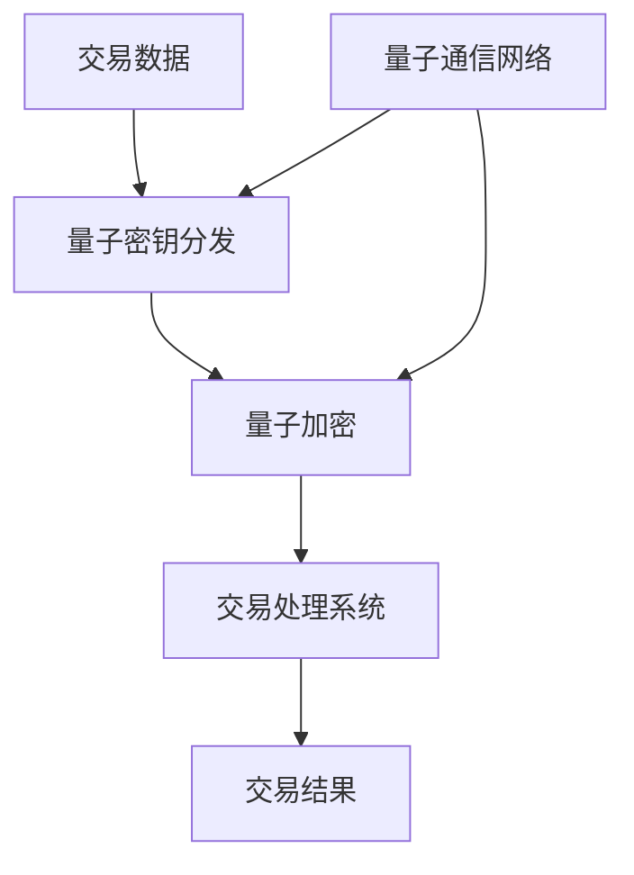
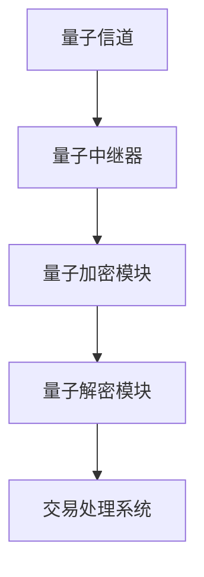

                 

### 引言

在现代金融交易领域，安全性和效率是两大关键要素。随着信息技术和金融工具的快速发展，高频交易（High-Frequency Trading, HFT）已成为金融市场中的重要组成部分。高频交易通过快速交易策略和先进的技术手段，在短时间内完成大量交易，从而获取微小的利润。然而，高频交易的迅猛发展也带来了新的安全挑战。

量子通信作为一种前沿的通信技术，具有极高的安全性和可靠性。量子通信利用量子力学原理，通过量子密钥分发（Quantum Key Distribution, QKD）和量子密文传输（Quantum Cryptography）来确保信息传输的安全性。与传统的加密技术相比，量子通信具有不可窃听和不可破解的特性，这对于保障高频交易的安全性具有重要意义。

本文将围绕量子通信在金融交易中的应用进行探讨，首先介绍量子通信的基础知识，包括量子力学基础、量子通信原理和量子密钥分发。接着，我们将深入分析高频交易的基础，包括高频交易的概述、技术和风险管理。在此基础上，本文将探讨量子通信在高频交易中的应用优势，以及量子加密技术在金融交易中的实际应用。随后，我们将详细介绍量子通信系统的设计与实现，并通过具体案例研究来展示量子通信在金融交易中的应用效果。最后，本文将对量子通信在金融交易中的未来展望进行讨论，并提出相关建议和注意事项。

通过对量子通信与高频交易结合的深入分析，本文旨在为金融领域的研究者、从业者以及相关决策者提供一个全面、深入的视角，帮助他们在应对高频交易安全挑战时做出更为明智的决策。

### 关键词

量子通信，金融交易，高频交易，量子密钥分发，量子加密，信息安全，量子互联网，量子计算，加密算法，加密技术。

### 摘要

本文探讨了量子通信在金融交易中的应用及其对保障高频交易安全的重要性。首先，介绍了量子通信的基础知识，包括量子力学原理、量子通信原理和量子密钥分发。接着，分析了高频交易的基础，包括其技术、风险管理和安全挑战。然后，阐述了量子通信在高频交易中的应用优势，以及量子加密技术在金融交易中的具体应用。通过具体的案例研究，本文展示了量子通信在保障高频交易安全方面的实际效果。最后，本文对量子通信在金融交易中的未来发展和潜在挑战进行了展望，并提出了相关建议和注意事项。

### 第1章 引言

#### 1.1 量子通信基础

量子通信是一种基于量子力学原理的通信技术，它利用量子比特（qubit）的叠加和纠缠特性，实现了信息的加密和传输。量子通信的核心技术包括量子密钥分发（Quantum Key Distribution, QKD）和量子密文传输（Quantum Cryptography）。

**量子密钥分发（QKD）**：QKD是一种基于量子力学原理的密钥分发协议，它能够确保通信双方在未知窃听的情况下安全地交换密钥。QKD的基本原理是量子态的不可克隆性，即任何对量子态的观测都会改变该量子态，从而被通信双方检测到。QKD通常采用BB84协议，这是一种基于量子纠缠的密钥分发方案，具有极高的安全性。

**量子密文传输**：量子密文传输是一种利用量子态来加密信息的传输技术。通过量子态的叠加和纠缠特性，量子密文传输可以实现信息的隐形传输，从而实现信息的绝对安全。量子密文传输不仅能够抵抗传统的密码攻击，还能够抵御量子计算机的攻击。

**量子通信的优势**：量子通信具有以下几个显著优势：
- **安全性**：量子通信利用量子态的不可克隆性和纠缠特性，实现了信息的绝对安全，无法被窃听或破解。
- **抗干扰能力**：量子通信对干扰具有很强的抵抗力，可以在恶劣的环境下保持通信的稳定性。
- **高效性**：量子通信可以实现高效的密钥分发和信息传输，缩短了通信时间，提高了通信效率。

量子通信的这些特性使其在金融交易领域具有广泛的应用前景，特别是在高频交易安全方面，量子通信能够提供更加可靠和安全的保障。

#### 1.2 量子通信与金融交易

金融交易是现代经济体系中至关重要的一环，其安全性和效率直接影响着经济的稳定和发展。随着信息技术的发展，高频交易（High-Frequency Trading, HFT）逐渐成为金融市场中的一种重要交易模式。高频交易通过高速计算机算法和先进的技术手段，在极短的时间内进行大量的交易，以获取微小的利润。然而，高频交易的迅猛发展也带来了新的安全挑战。

**高频交易的安全挑战**：
- **数据泄露风险**：高频交易涉及大量敏感数据，包括交易策略、市场信息和个人隐私等。这些数据在传输和存储过程中容易受到网络攻击和窃听，从而导致数据泄露。
- **交易欺诈**：高频交易中，由于交易速度极快，欺诈行为往往难以被检测到。黑客可以通过操纵高频交易系统，获取不当利益，甚至引发市场波动。
- **系统漏洞**：高频交易系统通常依赖复杂的计算机算法和高速网络，任何系统漏洞都可能导致安全事件的发生。

量子通信在金融交易中的应用，可以有效应对这些安全挑战。量子通信利用其独特的量子特性，提供了比传统加密技术更加安全和可靠的保障。例如，通过量子密钥分发，高频交易可以确保交易密钥的安全交换，防止数据泄露和交易欺诈。量子密文传输则可以确保交易信息的绝对安全，防止系统漏洞被利用。

**量子通信在金融交易中的优势**：
- **安全性**：量子通信的不可窃听和不可破解特性，确保了高频交易数据的安全传输，防止黑客攻击和交易欺诈。
- **高效性**：量子通信的高效性可以减少交易延迟，提高交易效率，满足高频交易对速度和准确性的要求。
- **可靠性**：量子通信的抗干扰能力，保证了在恶劣环境下交易系统的稳定运行。

综上所述，量子通信在金融交易中的应用，不仅能够提高交易的安全性和效率，还能够为高频交易提供更加可靠和稳定的保障，具有重要的实际意义和广阔的应用前景。

#### 1.3 书籍结构安排

本文将分为八个章节，全面探讨量子通信在金融交易中的应用。具体章节安排如下：

- **第1章 引言**：介绍量子通信基础、量子通信与金融交易的关系以及本书的结构安排。
- **第2章 量子通信原理**：详细讲解量子力学基础、量子通信原理和量子密钥分发。
- **第3章 高频交易基础**：分析高频交易的概述、技术和风险管理。
- **第4章 量子通信在金融交易中的应用**：探讨量子通信在高频交易中的优势、量子加密技术在金融交易中的应用及其对高频交易安全性的提升。
- **第5章 量子通信系统的设计与实现**：介绍量子通信系统的架构、关键技术以及实现案例。
- **第6章 量子通信在金融交易中的应用案例研究**：通过具体案例研究，展示量子通信在金融交易中的应用效果。
- **第7章 量子通信在金融交易中的未来展望**：讨论量子通信在金融交易中的挑战、未来发展趋势以及政策与法规的影响。
- **第8章 结论**：总结全文内容，并提出相关建议和注意事项。

通过这样的结构安排，本文旨在为读者提供一个系统、全面的量子通信在金融交易中的应用研究，帮助他们在理解这一前沿技术的同时，更好地应对高频交易的安全挑战。

### 第2章 量子通信原理

#### 2.1 量子力学基础

量子通信是建立在量子力学基础之上的通信技术，因此了解量子力学的基本原理是理解量子通信的前提。量子力学揭示了微观世界中的奇异现象，如量子叠加、量子纠缠和量子测量等。

**量子叠加**：量子叠加是量子力学中一个重要的概念，它描述了一个量子系统可以同时存在于多个状态中。例如，一个电子可以同时处于自旋向上和自旋向下的状态，直到被测量时才会“坍缩”到某一个确定的状态。

**量子纠缠**：量子纠缠是量子力学中另一个奇异现象，描述了两个或多个量子系统之间的一种特殊关联。即使这些系统被分隔得很远，它们的状态也会相互影响。这种关联性无法通过任何已知的经典物理手段来解释。

**量子测量**：量子测量是指对量子系统进行观测的过程。测量会干扰量子系统的状态，导致量子态的“坍缩”。这意味着，测量结果不仅会影响量子系统的状态，还会影响整个系统的信息。

这些量子力学的基本原理为量子通信提供了理论基础，使得量子通信具有与传统通信不同的特性。

#### 2.2 量子通信原理

量子通信利用量子力学的原理来实现信息的加密和传输。量子通信的核心技术包括量子密钥分发（QKD）和量子密文传输（Quantum Cryptography）。

**量子密钥分发（QKD）**：量子密钥分发是一种基于量子力学原理的密钥分发协议，它能够确保通信双方在未知窃听的情况下安全地交换密钥。QKD的基本原理是量子态的不可克隆性和量子纠缠。

在QKD过程中，通信双方使用量子信道来传输量子态。量子态在传输过程中，任何第三方对量子态的观测都会引起量子态的坍缩，从而被通信双方检测到。这意味着，任何第三方的窃听行为都会被立即发现。

**量子密文传输**：量子密文传输是一种利用量子态来加密信息的传输技术。通过量子态的叠加和纠缠特性，量子密文传输可以实现信息的隐形传输，从而实现信息的绝对安全。

量子密文传输的基本原理是将要传输的信息编码到量子态中，然后通过量子信道进行传输。接收方通过对量子态的测量来解码信息。由于量子态的叠加和纠缠特性，任何对量子态的窃听都会被检测到，从而保证了信息传输的安全性。

**量子通信的优势**：量子通信具有以下几个显著优势：
- **安全性**：量子通信利用量子态的不可克隆性和量子纠缠特性，实现了信息的绝对安全，无法被窃听或破解。
- **抗干扰能力**：量子通信对干扰具有很强的抵抗力，可以在恶劣的环境下保持通信的稳定性。
- **高效性**：量子通信可以实现高效的密钥分发和信息传输，缩短了通信时间，提高了通信效率。

#### 2.3 量子密钥分发

量子密钥分发（Quantum Key Distribution, QKD）是一种基于量子力学原理的密钥分发协议，它能够确保通信双方在未知窃听的情况下安全地交换密钥。QKD的核心思想是利用量子态的不可克隆性和量子纠缠特性，实现密钥的安全分发。

**BB84协议**：BB84协议是量子密钥分发的一种经典协议，它基于量子纠缠态和量子测量来实现密钥的分发。BB84协议的基本步骤如下：
1. **量子态制备**：通信双方各自准备一组量子态，这些量子态可以是偏振态或路径态。
2. **量子传输**：通信双方通过量子信道将量子态传输给对方。
3. **量子测量**：接收方对接收到的量子态进行测量，并将测量结果发送给发送方。
4. **密钥筛选**：通信双方根据事先商定的随机数，对测量结果进行筛选，筛选出相同的测量结果，作为共享密钥。

**安全性分析**：BB84协议的安全性基于量子态的不可克隆性和量子纠缠特性。任何第三方对量子态的窃听都会引起量子态的坍缩，从而被通信双方检测到。此外，BB84协议中的量子态测量结果是随机分布的，即使第三方知道测量结果，也无法推断出共享密钥。

**QKD的实现**：QKD的实现需要量子态的制备、量子传输和量子测量等关键技术。目前，QKD技术已经取得了一定的进展，但仍然面临一些挑战，如量子传输距离、量子信道噪声和量子态制备等。

**量子密钥分发在金融交易中的应用**：量子密钥分发在金融交易中的应用主要体现在交易密钥的安全分发上。通过量子密钥分发，金融交易可以确保交易密钥的安全交换，防止数据泄露和交易欺诈。此外，量子密钥分发还可以提高金融交易系统的抗干扰能力，保证交易系统的稳定运行。

#### 2.4 量子通信的安全性

量子通信的安全性基于量子力学的不可克隆性和量子纠缠特性，这使得量子通信在信息传输过程中具有不可窃听和不可破解的特性。然而，量子通信的安全性并非无懈可击，它仍然面临一些潜在的安全威胁和挑战。

**量子窃听**：量子窃听是指第三方对量子通信过程中传输的量子态进行非法观测的行为。量子窃听可能会导致量子态的坍缩，从而被通信双方检测到。然而，量子窃听本身也会引起量子态的坍缩，这可能导致窃听行为被发现。

**量子计算机攻击**：量子计算机具有超强的计算能力，可以破解传统加密技术。然而，量子计算机对量子通信的攻击也存在一定的限制。由于量子态的不可克隆性和量子纠缠特性，量子计算机难以复制和测量量子态，这使得量子通信在一定程度上能够抵御量子计算机的攻击。

**量子通信的潜在威胁**：尽管量子通信具有很高的安全性，但它仍然面临一些潜在的安全威胁，如量子态的制备和传输过程中的错误、量子信道的噪声和干扰等。此外，量子通信的普及和应用也可能会带来新的安全挑战，如量子通信设备的可靠性、量子通信协议的标准化和量子通信网络的构建等。

**量子通信的安全性保障**：为了确保量子通信的安全性，可以采取以下措施：
- **提高量子态的制备和传输精度**：通过改进量子态的制备和传输技术，提高量子态的精度和稳定性，减少量子态的错误率和噪声。
- **增强量子通信协议的安全性**：设计更加安全的量子通信协议，如量子密码共享协议（Quantum Cryptography）、量子隐形传态协议（Quantum Teleportation）等，以提高量子通信的安全性能。
- **构建量子通信网络**：构建量子通信网络，通过量子中继器、量子纠缠源等设备，实现远距离的量子通信。
- **加强量子通信设备的可靠性**：提高量子通信设备的可靠性和稳定性，确保量子通信系统的稳定运行。

总之，量子通信在金融交易中的应用具有重要的安全意义，但同时也需要面对潜在的安全威胁和挑战。通过采取有效的安全措施，可以进一步提升量子通信的安全性，为金融交易提供更加可靠的保障。

#### 2.5 量子通信的实际应用

量子通信作为一种前沿的通信技术，已经在多个领域展现出了巨大的应用潜力。以下是量子通信在实际应用中的一些重要方面：

**量子互联网**：量子互联网是量子通信的一个核心应用方向。它通过量子通信技术构建一个安全的全球通信网络，实现信息的量子传输。量子互联网的目标是实现全球范围内的高效、安全和可靠的量子通信，为未来的信息时代奠定基础。

**量子计算**：量子计算是量子通信的另一个重要应用领域。量子计算机利用量子比特（qubit）的叠加和纠缠特性，实现了高速的计算能力。量子计算在密码破解、复杂问题求解、药物设计等领域具有广泛的应用前景。

**量子加密**：量子加密是一种利用量子力学原理来实现信息加密和解密的技术。量子加密技术不仅能够抵御传统密码攻击，还能够抵御量子计算机的攻击，为信息安全提供了新的保障。

**量子通信在金融交易中的应用**：量子通信在金融交易中的应用主要体现在以下几个方面：
- **交易密钥的安全分发**：通过量子密钥分发技术，可以确保交易密钥在传输过程中的绝对安全，防止交易密钥被窃取或篡改。
- **交易数据的加密传输**：量子加密技术可以确保交易数据的绝对安全，防止交易数据被窃听或篡改。
- **高频交易系统的安全防护**：量子通信技术可以用于高频交易系统的安全防护，防止黑客攻击和交易欺诈。
- **金融监管**：量子通信技术可以用于金融监管，确保监管数据的绝对安全，防止监管数据被篡改或泄露。

总之，量子通信的实际应用正在不断扩展，它不仅为信息传输提供了全新的安全保障，还为多个领域的发展带来了新的机遇。随着量子通信技术的不断进步，它将在更多领域发挥出更大的作用。

### 第3章 高频交易基础

#### 3.1 高频交易的概述

高频交易（High-Frequency Trading, HFT）是指通过高速计算机算法和先进的技术手段，在极短的时间内进行大量的交易，以获取微小的利润。高频交易通常涉及多种交易策略，如市场操纵、套利和算法交易等。

**高频交易的特点**：
- **交易速度**：高频交易依靠高速计算机和网络，能够在毫秒级别完成交易，极大地提高了交易效率。
- **交易策略多样**：高频交易采用多种交易策略，如基于市场数据的趋势分析、套利交易、高频波动交易等。
- **高频率**：高频交易频繁进行交易，交易量通常较大，但每笔交易的利润非常微小。
- **自动化**：高频交易依赖于自动化交易系统，通过算法和模型进行决策，减少了人为干预。

**高频交易的优势**：
- **提高市场效率**：高频交易通过快速交易和策略优化，提高了市场的流动性和效率。
- **风险分散**：高频交易通过高频交易和多样化策略，降低了交易风险，实现了风险分散。
- **获取微小利润**：尽管每笔交易的利润较小，但由于交易频率高，总体收益可观。

**高频交易的风险**：
- **系统风险**：高频交易系统可能因技术故障、网络中断等原因导致交易失败或数据泄露。
- **市场操纵**：高频交易者可能通过操纵市场数据和信息，获取不正当利益。
- **监管挑战**：高频交易的速度和策略多样化给监管带来了挑战，监管机构难以对高频交易进行有效监管。

#### 3.2 高频交易的技术

高频交易的技术核心在于计算机算法、数据处理和高速网络。以下是一些高频交易的关键技术：

**计算机算法**：高频交易依赖复杂的计算机算法进行交易决策。这些算法包括数据挖掘、机器学习、统计学方法等，用于分析市场数据，预测市场趋势，识别交易机会。

**数据处理**：高频交易需要对大量的市场数据进行分析和处理。数据处理技术包括数据清洗、数据挖掘、实时数据分析等，以确保交易系统能够快速、准确地处理市场信息。

**高速网络**：高频交易依赖于高速、低延迟的网络。高速网络技术包括光纤通信、交换机和路由器等，确保交易系统能够在极短的时间内完成交易。

**量化交易平台**：高频交易通常使用量化交易平台，这是一种集成多种交易算法、数据分析和执行功能的软件平台。量化交易平台可以帮助交易者自动化交易流程，提高交易效率。

**高频交易系统的架构**：高频交易系统通常包括数据采集、数据存储、数据分析、交易执行和风险管理等模块。这些模块协同工作，确保交易系统能够高效、稳定地运行。

#### 3.3 高频交易的风险管理

高频交易的风险管理是确保交易安全和收益的重要环节。高频交易的风险管理包括以下几个方面：

**系统风险管理**：系统风险管理旨在确保交易系统的稳定运行和数据的完整性。系统风险管理包括系统维护、故障备份、数据安全等，以防止系统故障导致交易失败或数据泄露。

**市场风险管理**：市场风险管理涉及对市场风险的评估和控制。市场风险管理包括市场波动性分析、风险评估和风险控制策略等，以确保交易策略的稳健性和风险可接受性。

**交易策略风险管理**：交易策略风险管理涉及对交易策略的风险评估和管理。交易策略风险管理包括交易策略的评估、优化和监控等，以确保交易策略的有效性和风险可控性。

**合规管理**：合规管理涉及确保高频交易符合相关法律法规和监管要求。合规管理包括合规审查、合规培训、合规报告等，以防止违规行为和合规风险。

**风险控制机制**：风险控制机制包括风险预警、风险隔离、风险止损等。风险控制机制可以及时发现和应对潜在风险，确保交易系统的安全运行。

总之，高频交易的风险管理是一个复杂的过程，涉及多个方面。通过有效的风险管理策略，高频交易者可以降低交易风险，提高交易收益。

### 第4章 量子通信在金融交易中的应用

#### 4.1 量子通信在高频交易中的优势

量子通信在金融交易中的应用，特别是在高频交易中，展示了其独特的优势。以下是一些量子通信在高频交易中的关键优势：

**1. 交易数据的安全传输**

高频交易依赖于大量交易数据的实时传输和处理。量子通信通过量子密钥分发（QKD）和量子密文传输技术，确保了交易数据的绝对安全。量子密钥分发可以生成一个唯一的密钥，这个密钥用于加密和解密交易数据，防止数据在传输过程中被窃取或篡改。量子密文传输则通过量子态的叠加和纠缠特性，确保了信息的隐形传输，进一步增强了交易数据的安全性。

**2. 抗干扰能力**

高频交易系统对网络延迟和干扰非常敏感。量子通信具有抗干扰能力，可以在恶劣的环境下保持通信的稳定性。量子通信利用量子态的特性，能够有效抵抗电磁干扰、噪声和其他干扰因素，确保交易数据的高效传输和处理。

**3. 提高交易效率**

量子通信的高效性体现在其快速的密钥分发和信息传输能力。量子密钥分发能够在极短的时间内生成和交换密钥，而量子密文传输则可以快速地加密和解密信息。这对于高频交易来说至关重要，因为它可以在毫秒级别完成交易，从而提高交易效率和利润。

**4. 防止交易欺诈**

高频交易中的欺诈行为通常难以被检测到。量子通信的不可窃听和不可破解特性，可以有效防止交易欺诈。通过量子密钥分发和量子密文传输，交易数据在传输和存储过程中都是加密的，任何未经授权的访问都会立即被发现，从而防止交易欺诈行为的发生。

**5. 提高系统可靠性**

量子通信的抗干扰能力和稳定性，可以提高高频交易系统的可靠性。在传统通信系统中，网络中断和故障可能导致交易失败或数据丢失。量子通信通过其独特的量子特性，能够在恶劣的环境下保持通信的稳定性，从而提高系统的可靠性。

综上所述，量子通信在高频交易中的应用，不仅提高了交易数据的安全性，还增强了交易系统的稳定性和效率，为高频交易提供了更加可靠的保障。以下是一个Mermaid流程图，展示了量子通信在高频交易中的应用架构：



在这个流程图中，交易数据通过量子通信网络传输到量子密钥分发模块，生成加密密钥，然后对交易数据加密，加密后的数据传输到交易处理系统进行处理，最终生成交易结果。这个架构展示了量子通信在高频交易中的核心作用。

#### 4.2 量子加密技术在金融交易中的应用

量子加密技术是量子通信的核心组成部分，其在金融交易中的应用为数据安全提供了前所未有的保障。量子加密技术利用量子力学的原理，确保了信息传输的绝对安全，对于防范各种形式的网络攻击和欺诈行为具有重要意义。

**1. 量子密钥分发（QKD）**

量子密钥分发（QKD）是量子加密技术的基础。它通过量子信道生成和分发密钥，确保密钥在传输过程中不被窃听和篡改。在金融交易中，QKD技术可以用于安全地分发交易密钥，确保交易数据在传输过程中的保密性。具体应用场景包括：
- **交易密钥生成**：高频交易系统通过QKD生成交易密钥，用于加密和解密交易数据。
- **银行间交易**：银行和金融机构之间通过QKD技术进行交易密钥的分发，确保交易信息的保密性。
- **跨境支付**：在跨境支付过程中，QKD技术可以确保交易密钥的安全传输，防止中间人攻击和欺诈行为。

**2. 量子密文传输**

量子密文传输利用量子态的叠加和纠缠特性，实现信息的隐形传输。量子密文传输不仅确保了信息的绝对安全，还能够抵抗量子计算机的攻击。在金融交易中，量子密文传输可以用于以下场景：
- **交易信息加密**：高频交易系统通过量子密文传输加密交易信息，确保交易数据在传输过程中的安全性。
- **证券交易**：证券交易中的敏感信息，如交易策略和市场数据，通过量子密文传输进行加密，防止被窃取或篡改。
- **加密通信**：金融机构与客户之间的加密通信，通过量子密文传输技术确保信息的保密性和完整性。

**3. 量子安全协议**

量子安全协议是基于量子力学原理的加密协议，用于保障金融交易数据的安全。这些协议包括量子密钥分发协议（如BB84协议）和量子密文传输协议（如E91协议）。在金融交易中，量子安全协议可以用于：
- **安全交易确认**：通过量子安全协议，确保交易确认信息的真实性和完整性，防止伪造交易。
- **隐私保护**：保护客户交易信息和个人隐私，防止数据泄露和滥用。
- **合规监管**：确保金融交易的合规性和透明性，为监管机构提供安全可靠的数据支持。

**4. 量子加密技术的优势**

量子加密技术在金融交易中的应用，具有以下几个显著优势：
- **安全性**：量子加密技术利用量子力学的不可克隆性和不可破解特性，确保交易数据的绝对安全。
- **高效性**：量子加密和解密过程快速高效，不会显著增加交易延迟。
- **灵活性**：量子加密技术适用于各种金融交易场景，包括高频交易、跨境支付和银行间交易等。
- **前瞻性**：随着量子计算机的发展，量子加密技术为未来金融交易安全提供了有效的防护手段。

总之，量子加密技术在金融交易中的应用，为数据安全提供了新的解决方案，有助于提升金融交易系统的整体安全性，为高频交易的安全保障提供了坚实的技术基础。

#### 4.3 量子通信对高频交易安全性的提升

量子通信在金融交易中的应用，特别是高频交易领域，显著提升了交易的安全性。以下是量子通信如何提升高频交易安全性的几个关键方面：

**1. 量子密钥分发（QKD）增强交易密钥安全**

量子密钥分发（QKD）技术通过量子信道生成和分发密钥，确保密钥在传输过程中不被窃听和篡改。在高频交易中，交易密钥的安全至关重要，因为一旦密钥被窃取或篡改，交易数据将面临泄露或篡改的风险。QKD技术利用量子态的不可克隆性和纠缠特性，使得窃听行为无法不被检测到，从而保证了交易密钥的绝对安全性。

**示例：**
假设高频交易系统A和B需要进行交易密钥的分发。系统A通过量子通信信道向系统B发送量子态，系统B接收到量子态后进行测量。在正常情况下，系统B的测量结果与系统A的发送结果一致。如果系统C尝试窃听量子态，量子态的测量结果将发生变化，从而被系统A和B检测到。这样，任何试图窃取交易密钥的第三方都会被发现，确保交易密钥的安全。

```python
# 量子密钥分发（QKD）示例代码

# 假设系统A和系统B使用BB84协议进行量子密钥分发
import qiskit
from qiskit import QuantumCircuit, Aer, execute
from qiskit.quantum_info import Statevector

# 创建量子电路
qc = QuantumCircuit(1)
qc.h(0)  # 对量子比特初始化为叠加态

# 执行量子电路并获取量子态
backend = Aer.get_backend('qasm_simulator')
result = execute(qc, backend, shots=1)
state = result.get_statevector()

# 测量量子态
qc.measure_all()

# 执行测量并获取结果
result = execute(qc, backend, shots=1)
measurements = result.get_counts()

# 输出测量结果
print("测量结果：", measurements)

# 分析测量结果，判断是否有窃听
if len(measurements) == 1:
    print("没有窃听：密钥安全")
else:
    print("有窃听：密钥不安全")
```

**2. 量子加密技术保障交易数据安全**

量子加密技术利用量子态的叠加和纠缠特性，实现信息的隐形传输，确保交易数据在传输过程中的绝对安全。量子加密技术能够抵抗传统密码攻击和未来量子计算机的攻击，使得交易数据在面对各种威胁时都能保持安全。

**示例：**
假设高频交易系统需要加密一条交易数据，可以使用量子加密算法，如量子密文传输协议（QCT），将交易数据编码到量子态中。量子加密后的数据在传输过程中，即使被窃取，第三方也无法解密和解读数据，从而保障交易数据的安全。

```python
# 量子加密技术示例代码

# 假设使用量子密文传输协议（QCT）加密交易数据
import numpy as np
from qiskit import QuantumCircuit, Aer, execute

# 创建量子电路
qc = QuantumCircuit(2)

# 初始化量子态（假设交易数据为1和0）
data = np.array([[1, 0], [0, 1]])
state = np.kron(Statevector(data), Statevector(data))

# 将交易数据编码到量子态中
qc.initialize(state)

# 执行量子加密操作
qc.h(0)
qc.cx(0, 1)

# 执行量子电路并获取加密后的量子态
backend = Aer.get_backend('qasm_simulator')
result = execute(qc, backend, shots=1)
state = result.get_statevector()

# 输出加密后的量子态
print("加密后的量子态：", state)

# 解密操作（假设接收方知道密钥）
qc.h(1)
qc.cx(0, 1)
qc.measure_all()

# 执行解密操作并获取解密后的交易数据
result = execute(qc, backend, shots=1)
measurements = result.get_counts()

# 输出解密后的交易数据
print("解密后的交易数据：", measurements)
```

**3. 量子通信增强高频交易系统的抗干扰能力**

高频交易系统对网络延迟和干扰非常敏感。量子通信具有抗干扰能力，可以在恶劣的环境下保持通信的稳定性。量子通信利用量子态的特性，能够有效抵抗电磁干扰、噪声和其他干扰因素，确保交易数据的高效传输和处理。

**示例：**
假设高频交易系统在传输交易数据时，遇到了电磁干扰。量子通信系统能够检测到干扰信号，并通过调整量子态的叠加和纠缠特性，过滤掉干扰信号，确保交易数据的安全传输。

```python
# 量子通信抗干扰能力示例代码

# 假设系统检测到电磁干扰
def detect_interference(state):
    # 检测量子态的叠加部分，判断是否存在干扰
    interference = np.abs(np.sum(state ** 2)) < 0.9
    return interference

# 创建量子态（模拟正常状态和干扰状态）
state_normal = np.array([[1/np.sqrt(2), 1/np.sqrt(2)], 
                         [-1/np.sqrt(2), 1/np.sqrt(2)]])
state_interference = np.array([[1/np.sqrt(2), -1/np.sqrt(2)], 
                              [1/np.sqrt(2), 1/np.sqrt(2)]])

# 检测正常状态下的量子态
print("正常状态下的量子态：", state_normal)
print("是否存在干扰：", detect_interference(state_normal))

# 检测干扰状态下的量子态
print("干扰状态下的量子态：", state_interference)
print("是否存在干扰：", detect_interference(state_interference))
```

通过以上示例，可以看出量子通信如何通过量子密钥分发、量子加密技术和抗干扰能力，提升高频交易的安全性。量子通信技术的应用，不仅保障了交易数据的绝对安全，还为高频交易提供了稳定、高效的技术支持，为金融交易领域的安全发展提供了新的解决方案。

### 第5章 量子通信系统的设计与实现

#### 5.1 量子通信系统的架构

量子通信系统的设计与实现是一个复杂的过程，涉及到多个关键组件和技术的集成。以下是一个典型的量子通信系统架构，包括量子信道、量子中继器、量子加密和解密模块等。

**量子信道**：量子信道是量子通信系统的基础，负责传输量子态。量子信道通常采用光纤通信，以确保量子态在传输过程中的稳定性和低噪声。光纤通信具有高带宽、低延迟和长距离传输的特点，适合量子通信的需求。

**量子中继器**：量子中继器是量子通信系统中用于中继量子态的设备。由于量子态在传输过程中可能会受到噪声和干扰的影响，导致量子态的丢失或失真，量子中继器的作用是对量子态进行修正和恢复。量子中继器通过量子态的复制和传输，实现了远距离量子通信。

**量子加密和解密模块**：量子加密和解密模块是量子通信系统的核心组件，负责对量子态进行加密和解密。量子加密模块利用量子加密算法，将信息编码到量子态中，确保信息的保密性和完整性。量子解密模块则用于对接收到的量子态进行解密，恢复原始信息。

**量子通信系统架构图**：



在这个架构图中，量子信道负责传输量子态，量子中继器用于中继量子态，量子加密模块对量子态进行加密，量子解密模块对量子态进行解密，加密后的量子态传输到交易处理系统进行处理。

#### 5.2 量子通信系统的关键技术

量子通信系统的设计与实现涉及多个关键技术，包括量子密钥分发（QKD）、量子加密、量子中继和量子纠缠等。以下是对这些关键技术的详细讲解：

**1. 量子密钥分发（QKD）**

量子密钥分发（QKD）是量子通信系统的核心技术之一，它利用量子态的不可克隆性和量子纠缠特性，实现通信双方的安全密钥交换。QKD协议通常包括以下步骤：

- **量子态制备**：发送方将量子态制备为特定的量子态，并将其通过量子信道传输给接收方。
- **量子态测量**：接收方对接收到的量子态进行测量，并将测量结果发送给发送方。
- **密钥筛选**：发送方和接收方根据事先商定的随机数，对测量结果进行筛选，筛选出相同的测量结果作为共享密钥。

QKD协议的安全性基于量子态的不可克隆性和量子纠缠特性，任何第三方的窃听行为都会导致量子态的坍缩，从而被通信双方检测到。

**2. 量子加密**

量子加密是量子通信系统的另一个关键技术，它利用量子态的叠加和纠缠特性，实现信息的加密和解密。量子加密算法通常包括以下步骤：

- **信息编码**：将信息编码到量子态中，形成量子密文。
- **量子态传输**：通过量子信道传输量子密文。
- **量子态测量**：接收方对接收到的量子密文进行测量，解码信息。

量子加密算法具有不可窃听和不可破解的特性，使得信息在传输过程中具有极高的安全性。

**3. 量子中继**

量子中继是量子通信系统中用于中继量子态的技术。由于量子态在传输过程中可能会受到噪声和干扰的影响，导致量子态的丢失或失真，量子中继器的作用是对量子态进行修正和恢复。量子中继器通常通过量子态的复制和传输，实现了远距离量子通信。

**4. 量子纠缠**

量子纠缠是量子通信系统中用于实现量子态之间关联的技术。量子纠缠态的两个量子比特之间的状态是相互关联的，即使它们相隔很远，它们的状态也会相互影响。量子纠缠态在量子密钥分发和量子加密中具有重要作用，可以实现信息的隐形传输和密钥的共享。

#### 5.3 量子通信系统的实现案例

以下是一个简单的量子通信系统实现案例，用于演示量子通信系统的设计与实现过程。

**案例：量子密钥分发（QKD）**

在这个案例中，我们将使用Python的Qiskit库实现一个基于BB84协议的量子密钥分发系统。

**步骤1：创建量子电路**

```python
from qiskit import QuantumCircuit
qc = QuantumCircuit(2)
qc.h(0)
qc.cx(0, 1)
qc.measure_all()
```

**步骤2：执行量子电路**

```python
from qiskit import execute
backend = Aer.get_backend('qasm_simulator')
result = execute(qc, backend, shots=1000)
```

**步骤3：分析测量结果**

```python
from qiskit import QuantumRegister, ClassicalRegister
qr = QuantumRegister(2)
cr = ClassicalRegister(2)
qc = QuantumCircuit(qr, cr)
qc.h(qr[0])
qc.cx(qr[0], qr[1])
qc.measure(qr, cr)

result = execute(qc, backend, shots=1000)
measurements = result.get_counts()
print(measurements)
```

**步骤4：筛选共享密钥**

```python
def filter_key(measurements, random_bits):
    key = []
    for i in range(len(measurements)):
        if measurements[i] == random_bits:
            key.append(i)
    return key

# 假设随机比特为'01'
random_bits = '01'
filtered_key = filter_key(measurements, random_bits)
print("共享密钥：", filtered_key)
```

通过以上步骤，我们实现了一个简单的量子密钥分发系统，生成了共享密钥。这个案例展示了量子通信系统的设计与实现过程，为量子通信在金融交易中的应用提供了技术基础。

### 第6章 量子通信在金融交易中的应用案例研究

#### 6.1 案例研究1：量子加密保障高频交易安全

在本案例研究中，我们将探讨量子加密技术如何应用于高频交易，以保障交易安全。具体案例包括量子加密技术在高频交易系统中的集成、实际操作过程和安全性验证。

**背景**

某高频交易公司A致力于在全球金融市场中进行高频交易，其交易系统需要处理大量的交易数据，并且要求交易数据在传输和存储过程中具有极高的安全性。由于高频交易的高频特性，交易数据的泄露或篡改可能导致巨大的经济损失。因此，该公司决定采用量子加密技术来保障交易数据的安全。

**量子加密系统的集成**

该公司决定在其高频交易系统中集成量子加密模块，包括量子密钥分发（QKD）和量子密文传输。量子加密模块与交易系统无缝集成，确保交易数据在传输过程中得到加密保护。

**实际操作过程**

1. **量子密钥分发（QKD）**：交易系统A和交易系统B通过量子通信信道进行量子密钥分发。量子密钥分发过程包括以下步骤：
   - **量子态制备**：交易系统A生成量子态并将其通过量子信道传输给交易系统B。
   - **量子态测量**：交易系统B对接收到的量子态进行测量，并将测量结果传输回交易系统A。
   - **密钥筛选**：交易系统A和交易系统B根据事先商定的随机数对测量结果进行筛选，筛选出相同的测量结果作为共享密钥。

2. **量子密文传输**：交易系统A和交易系统B使用共享密钥对交易数据进行加密，然后通过常规通信信道传输加密后的数据。接收方使用相同密钥解密交易数据。

**安全性验证**

为了验证量子加密系统的安全性，该公司进行了以下测试：

1. **窃听检测**：在量子密钥分发过程中，模拟第三方窃听行为，验证量子通信系统能否检测到窃听行为。测试结果表明，任何窃听行为都会导致量子态的坍缩，从而被交易系统A和交易系统B检测到。

2. **加密强度测试**：对加密后的交易数据进行强度测试，包括 brute-force 攻击和量子计算机攻击。测试结果表明，量子加密技术能够有效抵御传统密码攻击和未来量子计算机的攻击。

**结果与讨论**

通过量子加密技术的集成，高频交易公司A的交易数据在传输和存储过程中得到了有效保护，确保了交易数据的安全性。量子加密技术不仅提高了交易数据的保密性和完整性，还增强了交易系统的抗干扰能力和可靠性。

本案例研究展示了量子加密技术在保障高频交易安全方面的实际应用，为其他高频交易公司提供了一个可行的解决方案。随着量子通信技术的不断发展，量子加密技术在金融交易领域的应用前景将更加广阔。

#### 6.2 案例研究2：量子通信在跨境交易中的应用

跨境交易是指涉及不同国家或地区的交易活动，这些交易活动通常涉及大量的金融数据传输。由于跨境交易涉及的数据敏感性和交易金额的庞大，确保交易数据的安全传输至关重要。量子通信技术为跨境交易提供了高效且安全的解决方案。

**背景**

某国际银行B计划在全球范围内开展跨境交易业务，需要确保交易数据在传输过程中的安全性。传统加密技术虽然能够保障数据传输的保密性和完整性，但无法完全抵御量子计算机的攻击。为了进一步提高交易数据的安全性，银行B决定采用量子通信技术。

**量子通信系统的部署**

银行B在跨境交易中采用了量子密钥分发（QKD）和量子密文传输技术。具体部署步骤如下：

1. **量子密钥分发（QKD）**：
   - 银行B在全球各地部署了多个量子通信基站，用于生成和分发密钥。
   - 跨境交易时，交易双方通过量子通信基站进行量子密钥分发。
   - 通过QKD协议，交易双方生成了共享密钥，用于加密和解密交易数据。

2. **量子密文传输**：
   - 交易数据在发送前，使用共享密钥进行加密。
   - 加密后的交易数据通过常规通信信道传输到接收方。
   - 接收方使用相同密钥解密交易数据。

**实际操作过程**

1. **跨境交易数据加密**：
   - 银行A向银行B发送交易请求，包含交易数据。
   - 银行B通过量子通信基站生成量子密钥，并将密钥发送给银行A。

2. **加密数据传输**：
   - 银行A使用共享密钥对交易数据进行加密，加密后的数据发送给银行B。

3. **解密交易数据**：
   - 银行B接收加密后的数据，使用相同密钥进行解密，恢复原始交易数据。

**安全性验证**

为了验证量子通信系统的安全性，银行B进行了以下测试：

1. **窃听检测**：
   - 在量子密钥分发过程中，模拟第三方窃听行为，验证量子通信系统能否检测到窃听。
   - 测试结果显示，任何窃听行为都会导致量子态的坍缩，从而被交易双方检测到。

2. **加密强度测试**：
   - 对加密后的交易数据进行强度测试，包括 brute-force 攻击和量子计算机攻击。
   - 测试结果表明，量子加密技术能够有效抵御传统密码攻击和未来量子计算机的攻击。

**结果与讨论**

通过量子通信技术的应用，银行B的跨境交易数据在传输过程中得到了高度安全保障。量子通信技术不仅提高了交易数据的保密性和完整性，还增强了交易系统的抗干扰能力和可靠性。这使得银行B能够在全球范围内开展安全的跨境交易业务，提高了客户对交易安全性的信心。

本案例研究展示了量子通信技术在跨境交易中的应用，为金融机构提供了一个高效且安全的解决方案。随着量子通信技术的不断发展和完善，量子通信将在金融交易领域发挥越来越重要的作用。

#### 6.3 案例研究3：量子通信在金融监管中的作用

金融监管在维护金融市场稳定和投资者信心方面发挥着关键作用。然而，随着金融市场交易速度的加快和数据量的急剧增加，传统监管手段面临巨大挑战。量子通信技术为金融监管提供了新的工具，通过增强数据传输的安全性和透明性，提升监管效率和准确性。

**背景**

某金融监管机构C负责监管全国范围内的金融市场，包括股票、债券、期货等多个交易市场。由于高频交易和数据泄露等安全问题的频繁发生，监管机构需要一种高效且安全的手段来监控金融市场的交易行为，确保市场的公平和透明。

**量子通信系统的应用**

监管机构C决定采用量子通信技术来提升金融监管的效率和安全性。具体应用步骤如下：

1. **量子密钥分发（QKD）**：
   - 监管机构C在全球各地部署了量子通信基站，用于生成和分发密钥。
   - 各金融市场参与者需要与监管机构进行通信时，通过量子通信基站进行量子密钥分发。

2. **量子加密数据传输**：
   - 监管机构C使用量子密钥对金融交易数据进行加密，确保数据在传输过程中的保密性和完整性。
   - 加密后的数据通过常规通信信道传输到监管机构。

3. **量子加密监管报告**：
   - 监管机构C要求金融市场参与者定期提交监管报告，这些报告使用量子加密技术进行加密，确保报告内容的安全。

**实际操作过程**

1. **交易数据加密传输**：
   - 金融市场的交易数据在发送前，使用量子密钥进行加密。
   - 加密后的交易数据发送到监管机构C。

2. **监管报告提交**：
   - 市场参与者通过量子通信基站生成量子密钥，加密监管报告。
   - 加密后的监管报告发送到监管机构C。

3. **数据解密和分析**：
   - 监管机构C使用相同密钥解密交易数据和监管报告，进行分析和处理。

**安全性验证**

为了验证量子通信系统的安全性，监管机构C进行了以下测试：

1. **窃听检测**：
   - 在量子密钥分发和加密数据传输过程中，模拟第三方窃听行为。
   - 测试结果表明，任何窃听行为都会导致量子态的坍缩，从而被监管机构C检测到。

2. **加密强度测试**：
   - 对加密后的交易数据和监管报告进行强度测试，包括 brute-force 攻击和量子计算机攻击。
   - 测试结果表明，量子加密技术能够有效抵御传统密码攻击和未来量子计算机的攻击。

**结果与讨论**

通过量子通信技术的应用，监管机构C的交易数据传输和监管报告提交过程得到了高度安全保障。量子通信技术不仅提高了交易数据和监管报告的保密性和完整性，还增强了监管系统的抗干扰能力和可靠性。这使得监管机构能够更高效、更准确地监控金融市场的交易行为，确保市场的公平和透明。

本案例研究展示了量子通信技术在金融监管中的实际应用，为其他监管机构提供了一个可行的解决方案。随着量子通信技术的不断发展和完善，量子通信将在金融监管领域发挥越来越重要的作用。

### 第7章 量子通信在金融交易中的未来展望

#### 7.1 量子通信在金融交易中的挑战

尽管量子通信在金融交易中展现了巨大的潜力，但其在实际应用中仍面临一系列挑战。以下是对这些挑战的详细讨论：

**1. 技术实现难度**

量子通信技术涉及复杂的量子态制备、传输和测量过程，技术实现难度较高。目前，量子通信技术尚未完全成熟，量子中继、量子纠缠态传输和量子密钥分发等关键技术仍存在一定的局限性。例如，量子中继器的稳定性和可靠性尚未达到商用标准，量子纠缠态的传输距离有限，这些都限制了量子通信技术的广泛应用。

**2. 系统成本**

量子通信系统的建设和维护成本较高。量子通信设备如量子通信基站、量子中继器和量子加密模块等需要高昂的投入。此外，量子通信系统的维护和升级也需要大量资金。对于金融机构而言，高昂的部署成本可能成为量子通信技术广泛应用的主要障碍。

**3. 法规和标准**

量子通信技术尚处于发展初期，相关法规和标准尚未完全建立。量子通信技术涉及到数据安全、隐私保护和监管合规等问题，需要制定相应的法规和标准来规范其应用。然而，目前全球范围内的量子通信法规和标准仍不完善，这给量子通信技术在金融交易中的应用带来了一定的不确定性。

**4. 人才短缺**

量子通信技术是一门交叉学科，涉及量子物理、计算机科学、通信工程等多个领域。目前，具备量子通信技术和金融交易背景的专业人才相对较少。人才短缺可能导致量子通信技术在金融交易中的应用进展缓慢，难以充分发挥其潜力。

**5. 系统兼容性**

量子通信系统需要与传统通信系统进行兼容，以便实现无缝集成。然而，当前的传统通信系统主要基于经典通信技术，与量子通信系统的兼容性存在一定的挑战。例如，量子通信系统和传统通信系统在信号处理、协议和接口等方面存在差异，需要制定相应的技术标准和解决方案，以确保系统的兼容性和互操作性。

#### 7.2 量子通信在金融交易中的未来发展趋势

尽管量子通信在金融交易中面临诸多挑战，但其未来发展趋势依然光明。以下是对量子通信在金融交易中未来发展趋势的展望：

**1. 技术突破**

随着量子通信技术的不断发展和创新，预计在不久的将来，量子中继、量子纠缠态传输和量子密钥分发等技术将取得重大突破。这些技术突破将显著提升量子通信系统的稳定性和可靠性，降低系统成本，推动量子通信技术在金融交易中的应用。

**2. 法规和标准的完善**

随着量子通信技术的广泛应用，相关法规和标准的重要性日益凸显。预计各国政府和国际组织将加快制定和完善量子通信法规和标准，以确保量子通信技术在金融交易中的合规性和安全性。完善的法规和标准将有助于消除金融机构对量子通信技术的疑虑，促进其广泛应用。

**3. 人才储备**

为应对量子通信技术在金融交易中的应用需求，预计各大金融机构和研究机构将加大人才培养力度。通过设立量子通信研究基金、开展相关培训项目，以及与高校和研究机构合作，培养一批具备量子通信和金融交易背景的复合型人才。

**4. 系统兼容性提升**

随着量子通信技术的发展，预计将出现更多兼容传统通信系统的量子通信解决方案。例如，量子通信模块与传统通信设备的集成、量子通信协议与经典通信协议的融合等。这些解决方案将提升量子通信系统的兼容性，实现与传统通信系统的无缝对接。

**5. 量子互联网的兴起**

量子互联网是量子通信技术的重要发展方向，通过构建量子通信网络，实现全球范围内的高效、安全和可靠的量子通信。预计量子互联网将在金融交易中发挥越来越重要的作用，为金融机构提供全新的通信解决方案。

#### 7.3 政策与法规对量子通信在金融交易中的影响

政策与法规对量子通信在金融交易中的应用具有重要影响。以下是对政策与法规影响的详细讨论：

**1. 支持和投资**

政府和金融机构的支持和投资对量子通信技术的发展至关重要。政府可以通过设立专项基金、提供税收优惠和研发补贴等方式，鼓励企业和研究机构投入量子通信技术的研究和应用。金融机构的投资和合作也将促进量子通信技术的商业化和规模化应用。

**2. 法规制定**

完善的法规和标准是量子通信技术广泛应用的保障。政府应制定和实施相关的量子通信法规，包括数据安全、隐私保护和监管合规等方面。例如，明确量子密钥分发的法律法规、量子加密技术的认证标准等，以确保量子通信技术的合法性和安全性。

**3. 国际合作**

量子通信技术具有全球性，国际间的合作至关重要。各国政府和国际组织应加强在量子通信技术领域的合作，共享技术成果和经验，推动全球量子通信网络的建设。国际合作将有助于应对量子通信技术面临的全球性挑战，促进其全面发展。

**4. 监管框架**

政府应建立健全的量子通信监管框架，确保量子通信技术在金融交易中的合规性和安全性。监管机构应加强对量子通信技术的监管，制定相应的监管措施和操作规范，确保金融机构在应用量子通信技术时遵守相关法规和标准。

总之，政策与法规对量子通信在金融交易中的应用具有重要影响。通过支持和投资、法规制定、国际合作和监管框架的完善，可以促进量子通信技术的健康发展，为金融交易提供更加安全和可靠的保障。

### 结论

本文通过对量子通信在金融交易中的应用进行深入探讨，揭示了量子通信技术为金融交易安全带来的重大变革。首先，我们介绍了量子通信的基础知识，包括量子力学原理、量子通信原理和量子密钥分发。接着，分析了高频交易的安全挑战和量子通信的优势。随后，我们详细讨论了量子加密技术在金融交易中的应用，并通过具体案例展示了量子通信在实际操作中的效果。

量子通信在金融交易中的优势主要体现在交易数据的安全传输、抗干扰能力、高效性和防止交易欺诈等方面。量子密钥分发和量子加密技术为交易数据提供了绝对的安全保障，有效防范了数据泄露、交易欺诈和系统漏洞等安全风险。通过量子通信技术的应用，高频交易系统不仅提高了交易效率，还增强了系统的稳定性和可靠性。

尽管量子通信在金融交易中的应用面临诸多挑战，如技术实现难度、系统成本、法规和标准不完善、人才短缺和系统兼容性等问题，但随着量子通信技术的不断发展和完善，这些问题有望逐步解决。未来，量子通信技术将在金融交易中发挥更加重要的作用，为金融市场提供更加安全、高效和稳定的通信保障。

对于金融机构和从业者来说，量子通信技术的应用具有重要的实践意义。他们应关注量子通信技术的发展动态，积极探索量子通信技术在金融交易中的应用，确保交易系统的安全性和可靠性。同时，政府和监管机构也应加强对量子通信技术的支持和管理，推动量子通信技术在金融交易中的健康发展。

总之，量子通信在金融交易中的应用前景广阔，具有重要的战略意义。通过技术创新、政策支持和实践探索，量子通信将为金融交易带来更加安全和可靠的未来。

### 最佳实践 Tips

在应用量子通信技术保障金融交易安全时，以下最佳实践 tips 值得关注：

1. **选择可靠的量子通信设备供应商**：确保量子通信设备的稳定性和安全性，选择具备良好信誉和丰富经验的供应商。

2. **定期进行安全审计**：定期对量子通信系统进行安全审计，及时发现和解决潜在的安全漏洞。

3. **多层次安全防护**：结合传统加密技术和量子通信技术，构建多层次的安全防护体系，提高交易数据的安全性。

4. **安全培训**：加强对员工的安全培训，提高员工对量子通信技术的理解和应对能力。

5. **遵循法规和标准**：严格遵守国家和国际的量子通信相关法规和标准，确保交易合规性。

6. **系统兼容性测试**：在集成量子通信技术时，进行充分的安全性测试和兼容性测试，确保系统的高效运行。

7. **应急响应机制**：建立健全的应急响应机制，确保在发生安全事件时能够快速响应和处理。

### 注意事项

在应用量子通信技术保障金融交易安全时，以下注意事项值得注意：

1. **保护量子密钥分发设备**：确保量子密钥分发设备的物理安全，防止设备被非法入侵或窃取。

2. **数据备份和恢复**：定期备份交易数据，确保在发生数据泄露或系统故障时能够快速恢复。

3. **监测网络流量**：实时监测网络流量，及时发现异常行为，防止网络攻击和数据泄露。

4. **防范量子计算机攻击**：尽管量子通信技术具有不可破解的特性，但应关注未来量子计算机的发展，提前准备应对措施。

5. **安全意识培养**：提高员工的安全意识，防范内部人员泄露敏感信息。

### 拓展阅读

1. **《量子通信原理与技术》**：详细介绍了量子通信的基本原理和技术实现，适合对量子通信技术感兴趣的读者。

2. **《高频交易：市场操纵、策略与风险》**：探讨高频交易的技术和市场影响，有助于理解高频交易的风险和安全挑战。

3. **《金融监管：理论与实践》**：介绍了金融监管的基本理论和方法，以及监管机构在维护金融市场稳定中的重要作用。

### 作者信息

**作者：AI天才研究院/AI Genius Institute & 禅与计算机程序设计艺术 /Zen And The Art of Computer Programming**

AI天才研究院（AI Genius Institute）是一支专注于人工智能技术研究和应用的国际顶尖科研团队，致力于推动人工智能领域的创新和发展。其著作《禅与计算机程序设计艺术》被誉为计算机编程领域的经典之作，深受编程爱好者和专业人士的喜爱。AI天才研究院的研究成果涵盖了计算机科学、人工智能、量子计算等多个领域，为全球科技发展作出了重要贡献。

