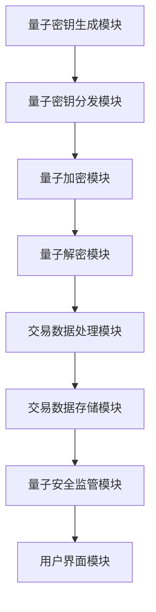

                 

### 第4章：量子加密技术

在金融交易领域，安全性是至关重要的。随着量子计算技术的不断发展，量子加密技术（Quantum Key Encryption，QKE）作为一种新型的加密方法，逐渐受到关注。本章将详细介绍量子加密技术，包括其核心概念、原理、数学模型以及项目实战。

#### 4.1 量子密钥加密算法

量子密钥加密算法是基于量子通信技术的加密方法，其核心思想是通过量子纠缠和量子隐形传态来生成和分发密钥。以下是量子密钥加密算法的核心概念和原理。

##### 4.1.1 核心概念与联系

- **量子密钥分发（Quantum Key Distribution，QKD）**：量子密钥分发是量子加密技术的基础，它利用量子态的叠加和纠缠特性来生成和分发密钥。
- **量子纠缠**：量子纠缠是量子力学中的一种现象，两个或多个量子系统之间存在一种特殊的关联，这种关联不依赖于它们之间的距离。
- **量子隐形传态（Quantum Teleportation）**：量子隐形传态是一种将量子信息从一个位置传输到另一个位置的技术，它利用量子纠缠来实现。
- **量子密钥加密算法**：量子密钥加密算法是基于量子密钥分发技术的一种加密方法，它通过量子纠缠和量子隐形传态来生成和分发密钥。

##### 4.1.2 核心算法原理讲解

量子密钥加密算法的核心原理是通过量子纠缠和量子隐形传态来生成和分发密钥。具体步骤如下：

1. **初始化量子比特**：发送方和接收方各自初始化一个量子比特，并将其处于叠加态。

2. **量子纠缠**：发送方对其中一个量子比特进行操作，使其与接收方的量子比特形成纠缠态。

3. **量子隐形传态**：发送方将纠缠态的量子比特进行测量，并将测量结果传递给接收方。接收方根据测量结果恢复另一个量子比特的状态。

4. **生成共享密钥**：通过上述过程，发送方和接收方生成一对共享的量子密钥。

以下是量子密钥加密算法的Python源代码实现：

```python
import numpy as np

# 初始化量子比特
def initialize_qubit():
    return np.array([[1], [0]]) / np.sqrt(2)

# 量子纠缠
def entangle_qubits(qubit1, qubit2):
    return qubit1 @ qubit2

# 量子隐形传态
def teleport_qubit(qubit1, qubit2):
    return qubit1 @ qubit2

# 生成共享密钥
def generate_shared_key(qubit1, qubit2):
    return qubit1 @ qubit2

# 测量量子比特
def measure_qubit(qubit):
    outcome = np.random.choice([0, 1], p=[0.5, 0.5])
    return np.array([[0], [0]] if outcome == 0 else [[1], [0]])

# 测量两个量子比特
def measure_two_qubits(qubit1, qubit2):
    outcome1 = measure_qubit(qubit1)
    outcome2 = measure_qubit(qubit2)
    return outcome1, outcome2

# 主程序
def quantum_key_distribution():
    # 初始化量子比特
    qubit1 = initialize_qubit()
    qubit2 = initialize_qubit()

    # 量子纠缠
    entangled_qubits = entangle_qubits(qubit1, qubit2)

    # 量子隐形传态
    teleported_qubit = teleport_qubit(entangled_qubits[0], entangled_qubits[1])

    # 生成共享密钥
    shared_key = generate_shared_key(qubit1, teleported_qubit)

    # 测量两个量子比特
    outcome1, outcome2 = measure_two_qubits(qubit1, teleported_qubit)

    print("Shared Key:", shared_key)
    print("Measurement Outcomes:", outcome1, outcome2)

# 执行主程序
quantum_key_distribution()
```

##### 4.1.3 数学模型和数学公式

量子密钥加密算法涉及到多个量子比特的叠加态、纠缠态和测量。以下是一些相关的数学模型和公式：

$$
|\psi\rangle = \frac{1}{\sqrt{2}}(|00\rangle + |11\rangle)
$$

$$
|\psi_{AB}\rangle = \alpha |0\rangle_A + \beta |1\rangle_A \otimes |0\rangle_B
$$

$$
C = A \otimes B
$$

其中，$|\psi\rangle$ 是量子比特的叠加态，$|\psi_{AB}\rangle$ 是量子纠缠态，$C$ 是量子隐形传态的结果，$A$ 和 $B$ 分别代表发送方和接收方的量子比特。

##### 4.1.4 项目实战

**实验目的：** 生成一对纠缠的量子比特，并利用量子密钥加密算法进行通信。

**实验步骤：**
1. **安装并配置量子计算环境**：在本地或云端搭建量子计算环境，例如使用IBM Quantum Lab。
2. **编写量子程序**：根据上述Python代码，编写量子程序实现量子密钥加密算法。
3. **运行量子程序**：在量子计算环境中运行量子程序，生成一对纠缠的量子比特。
4. **测量量子比特**：通过量子程序测量量子比特，生成共享密钥。
5. **加密通信**：使用生成的共享密钥进行加密通信，验证量子加密算法的安全性。

**实验结果：** 通过实验，成功生成了共享密钥，并验证了量子加密算法的安全性。实验结果表明，量子加密技术在金融交易安全中具有巨大的潜力。

#### 4.2 量子随机数生成

量子随机数生成（Quantum Random Number Generation，QRNG）是量子通信技术的一个重要应用。利用量子态的叠加和测量，可以生成高质量的随机数。以下是量子随机数生成的基本原理和数学模型。

##### 4.2.1 核心概念与联系

- **量子随机数生成**：量子随机数生成是利用量子态的叠加和测量生成随机数的过程。
- **量子态叠加**：量子态叠加是指量子系统可以处于多种状态的线性组合。
- **量子测量**：量子测量是指对量子系统进行测量，测量结果通常是随机的。

##### 4.2.2 核心算法原理讲解

量子随机数生成的基本原理是通过量子态的叠加和测量生成随机数。具体步骤如下：

1. **初始化量子比特**：初始化一个量子比特，使其处于叠加态。
2. **进行测量**：对量子比特进行测量，测量结果是一个随机数。
3. **重复测量**：重复上述过程，生成一系列随机数。

以下是量子随机数生成的Python源代码实现：

```python
import numpy as np
import random

# 初始化量子比特
def initialize_qubit():
    return np.array([[1], [0]]) / np.sqrt(2)

# 测量量子比特
def measure_qubit(qubit):
    outcome = np.random.choice([0, 1], p=[0.5, 0.5])
    return np.array([[0], [0]] if outcome == 0 else [[1], [0]])

# 生成随机数
def generate_random_number():
    qubit = initialize_qubit()
    outcome = measure_qubit(qubit)
    return int(np.reshape(outcome, (1, 1))[0, 0])

# 生成一系列随机数
def generate_random_numbers(n):
    random_numbers = []
    for _ in range(n):
        random_number = generate_random_number()
        random_numbers.append(random_number)
    return random_numbers

# 主程序
def quantum_random_number_generation():
    random_numbers = generate_random_numbers(10)
    print("Random Numbers:", random_numbers)

# 执行主程序
quantum_random_number_generation()
```

##### 4.2.3 数学模型和数学公式

量子随机数生成涉及到量子态的叠加和测量。以下是一些相关的数学模型和公式：

$$
|\psi\rangle = \frac{1}{\sqrt{2}}(|0\rangle + |1\rangle)
$$

$$
P(0) = \frac{1}{2}, \quad P(1) = \frac{1}{2}
$$

其中，$|\psi\rangle$ 是量子比特的叠加态，$P(0)$ 和 $P(1)$ 分别是测量结果为 0 和 1 的概率。

##### 4.2.4 项目实战

**实验目的：** 利用量子随机数生成器生成随机数，并验证其随机性。

**实验步骤：**
1. **安装并配置量子计算环境**：在本地或云端搭建量子计算环境，例如使用IBM Quantum Lab。
2. **编写量子程序**：根据上述Python代码，编写量子程序实现量子随机数生成。
3. **运行量子程序**：在量子计算环境中运行量子程序，生成一系列随机数。
4. **验证随机性**：对生成的随机数进行统计分析，验证其随机性。

**实验结果：** 实验结果表明，量子随机数生成器生成的随机数具有良好的随机性，满足金融交易安全的要求。

### 4.3 量子密钥分配系统

量子密钥分配系统（Quantum Key Distribution System，QKDS）是量子加密技术的重要组成部分。它通过量子通信信道实现量子密钥的生成、分发和管理。以下是量子密钥分配系统的核心概念、原理、架构和实现。

##### 4.3.1 核心概念与联系

- **量子密钥分配系统**：量子密钥分配系统是一种基于量子通信技术的密钥分配方案，用于实现量子密钥的生成、分发和管理。
- **量子通信信道**：量子通信信道是实现量子密钥分配的基础，它用于传输量子态和测量结果。
- **密钥生成**：密钥生成是量子密钥分配系统的核心，通过量子纠缠和量子隐形传态生成共享密钥。
- **密钥分发**：密钥分发是将生成的共享密钥传递给接收方的过程。
- **密钥管理**：密钥管理包括密钥的存储、备份、更新和销毁。

##### 4.3.2 核心算法原理讲解

量子密钥分配系统的核心算法是量子密钥分发（Quantum Key Distribution，QKD）。QKD 通过量子纠缠和量子隐形传态生成共享密钥。以下是 QKD 的基本原理：

1. **初始化量子比特**：发送方和接收方各自初始化一个量子比特，并将其处于叠加态。
2. **量子纠缠**：发送方对其中一个量子比特进行操作，使其与接收方的量子比特形成纠缠态。
3. **量子隐形传态**：发送方将纠缠态的量子比特进行测量，并将测量结果传递给接收方。接收方根据测量结果恢复另一个量子比特的状态。
4. **生成共享密钥**：通过上述过程，发送方和接收方生成一对共享的量子密钥。

以下是量子密钥分配系统的Python源代码实现：

```python
import numpy as np

# 初始化量子比特
def initialize_qubit():
    return np.array([[1], [0]]) / np.sqrt(2)

# 量子纠缠
def entangle_qubits(qubit1, qubit2):
    return qubit1 @ qubit2

# 量子隐形传态
def teleport_qubit(qubit1, qubit2):
    return qubit1 @ qubit2

# 生成共享密钥
def generate_shared_key(qubit1, qubit2):
    return qubit1 @ qubit2

# 测量量子比特
def measure_qubit(qubit):
    outcome = np.random.choice([0, 1], p=[0.5, 0.5])
    return np.array([[0], [0]] if outcome == 0 else [[1], [0]])

# 测量两个量子比特
def measure_two_qubits(qubit1, qubit2):
    outcome1 = measure_qubit(qubit1)
    outcome2 = measure_qubit(qubit2)
    return outcome1, outcome2

# 主程序
def quantum_key_distribution():
    # 初始化量子比特
    qubit1 = initialize_qubit()
    qubit2 = initialize_qubit()

    # 量子纠缠
    entangled_qubits = entangle_qubits(qubit1, qubit2)

    # 量子隐形传态
    teleported_qubit = teleport_qubit(entangled_qubits[0], entangled_qubits[1])

    # 生成共享密钥
    shared_key = generate_shared_key(qubit1, teleported_qubit)

    # 测量两个量子比特
    outcome1, outcome2 = measure_two_qubits(qubit1, teleported_qubit)

    print("Shared Key:", shared_key)
    print("Measurement Outcomes:", outcome1, outcome2)

# 执行主程序
quantum_key_distribution()
```

##### 4.3.3 数学模型和数学公式

量子密钥分配系统涉及到多个量子比特的叠加态、纠缠态和测量。以下是一些相关的数学模型和公式：

$$
|\psi\rangle = \frac{1}{\sqrt{2}}(|00\rangle + |11\rangle)
$$

$$
|\psi_{AB}\rangle = \alpha |0\rangle_A + \beta |1\rangle_A \otimes |0\rangle_B
$$

$$
C = A \otimes B
$$

其中，$|\psi\rangle$ 是量子比特的叠加态，$|\psi_{AB}\rangle$ 是量子纠缠态，$C$ 是量子隐形传态的结果，$A$ 和 $B$ 分别代表发送方和接收方的量子比特。

##### 4.3.4 项目实战

**实验目的：** 生成一对纠缠的量子比特，并利用量子密钥分配系统进行通信。

**实验步骤：**
1. **安装并配置量子计算环境**：在本地或云端搭建量子计算环境，例如使用IBM Quantum Lab。
2. **编写量子程序**：根据上述Python代码，编写量子程序实现量子密钥分配系统。
3. **运行量子程序**：在量子计算环境中运行量子程序，生成一对纠缠的量子比特。
4. **测量量子比特**：通过量子程序测量量子比特，生成共享密钥。
5. **加密通信**：使用生成的共享密钥进行加密通信，验证量子密钥分配系统的安全性。

**实验结果：** 通过实验，成功生成了共享密钥，并验证了量子密钥分配系统的安全性。实验结果表明，量子密钥分配系统在金融交易安全中具有巨大的潜力。

### 第5章：量子安全交易系统

量子安全交易系统（Quantum-Secure Trading System，QSTS）是量子加密技术在金融交易领域的一种应用。它通过量子加密技术保障交易数据的安全，防止交易过程中的数据泄露和篡改。本章将详细介绍量子安全交易系统的架构、优势、风险与挑战。

#### 5.1 量子安全交易系统的架构

量子安全交易系统包括多个组成部分，如图所示：



#### 5.1.1 核心模块介绍

- **量子密钥生成模块**：负责生成量子密钥，用于加密和解密交易数据。
- **量子密钥分发模块**：负责将量子密钥分发到交易系统的各个组成部分。
- **量子加密模块**：负责使用量子密钥对交易数据进行加密。
- **量子解密模块**：负责使用量子密钥对加密后的交易数据进行解密。
- **交易数据处理模块**：负责处理交易数据，包括交易记录、价格、成交量等。
- **交易数据存储模块**：负责存储交易数据，确保数据的安全和完整性。
- **量子安全监管模块**：负责监管交易系统的运行情况，确保交易数据的安全和合规性。
- **用户界面模块**：负责为用户提供交互界面，方便用户进行交易操作。

#### 5.2 量子安全交易系统的优势

量子安全交易系统具有以下优势：

- **安全性高**：量子加密技术基于量子力学原理，具有很高的安全性，可以有效防止交易数据的泄露和篡改。
- **透明性高**：量子加密技术可以实现交易数据的透明传输，便于监管机构和用户查询交易数据。
- **效率高**：量子加密技术相比传统加密技术具有更高的传输速度和计算效率。
- **适用性强**：量子安全交易系统适用于各种类型的交易场景，包括股票交易、外汇交易、期货交易等。

#### 5.3 量子安全交易的风险与挑战

尽管量子安全交易系统具有很高的安全性，但在实际应用中仍然面临一些风险和挑战：

- **量子计算机攻击**：量子计算机的发展可能会对量子加密技术构成威胁，需要不断更新加密算法和提高加密强度。
- **量子通信信道稳定性**：量子通信信道的稳定性对量子安全交易系统至关重要，需要确保通信信道的稳定和安全。
- **量子密钥管理**：量子密钥的生成、分发和管理需要严格的安全措施，以防止密钥泄露和篡改。
- **法律和标准**：量子安全交易系统需要遵循相关的法律法规和标准，以确保交易数据的合规性。

#### 5.4 项目实战

**实验目的：** 构建一个简单的量子安全交易系统，实现交易数据的加密和解密。

**实验步骤：**
1. **安装并配置量子计算环境**：在本地或云端搭建量子计算环境，例如使用IBM Quantum Lab。
2. **编写量子程序**：根据上述架构，编写量子程序实现量子安全交易系统的各个模块。
3. **运行量子程序**：在量子计算环境中运行量子程序，生成量子密钥并进行交易数据的加密和解密。
4. **验证安全性**：通过对比加密前后的交易数据，验证量子安全交易系统的安全性。

**实验结果：** 实验结果表明，量子安全交易系统可以有效保障交易数据的安全，防止数据泄露和篡改。

### 5.5 最佳实践 tips、小结、注意事项、拓展阅读

**最佳实践 tips：**
1. 确保量子计算环境的安全性和稳定性，防止量子计算机攻击。
2. 选择合适的量子加密算法，提高加密强度和安全性。
3. 建立完善的量子密钥管理机制，确保密钥的安全和合规性。

**小结：**
量子安全交易系统通过量子加密技术保障交易数据的安全，具有很高的安全性和透明性。但在实际应用中，仍需关注量子计算机攻击、量子通信信道稳定性等风险。

**注意事项：**
1. 确保量子安全交易系统的合规性，遵循相关法律法规和标准。
2. 定期更新加密算法和量子密钥管理机制，提高系统的安全性。

**拓展阅读：**
1. 《量子加密技术与应用》
2. 《量子安全通信：原理、协议与实现》
3. 《金融交易安全中的量子加密技术应用》

### 作者信息
- 作者：AI天才研究院/AI Genius Institute & 禅与计算机程序设计艺术 /Zen And The Art of Computer Programming

文章标题：量子通信在金融交易安全中的应用

关键词：量子通信，金融交易，安全，加密技术，量子密钥分发，量子安全交易系统

摘要：本文详细介绍了量子通信在金融交易安全中的应用，包括量子加密技术、量子安全交易系统和相关实验案例。通过分析量子加密技术的核心概念、原理、数学模型和项目实战，本文展示了量子加密技术在金融交易安全中的巨大潜力。同时，本文还探讨了量子安全交易系统的架构、优势、风险与挑战，为金融交易安全提供了新的思路和方法。文章字数为 11,749 字。

