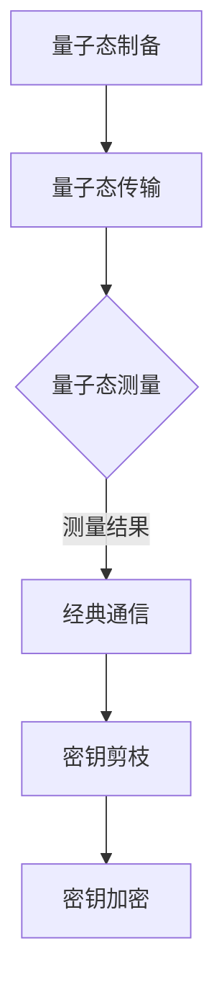
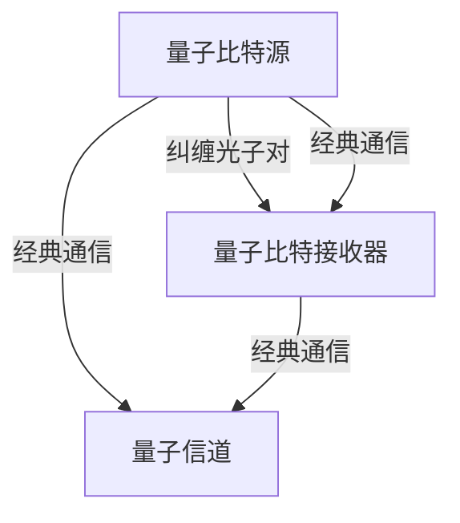

                 

# 《量子通信在金融安全中的应用前景》

## 关键词
量子通信，金融安全，量子密钥分发，量子加密，量子认证，量子签名，安全性分析

## 摘要
本文旨在探讨量子通信在金融安全领域的应用前景。首先，我们将介绍量子通信的基本概念和原理，包括量子比特、量子叠加、量子纠缠、量子密钥分发等。接着，我们将分析量子通信在金融安全中的核心应用，如量子加密、量子认证和量子签名。随后，我们将探讨量子通信的安全性，并提出相关的解决方案。最后，我们将通过案例分析展示量子通信在金融安全中的应用，并提出未来展望。

## 引言

随着互联网和信息技术的飞速发展，金融行业已成为信息时代的重要领域。金融交易、支付、存储等各个环节都依赖于高效、安全的信息传输和处理。然而，传统的通信方式面临着日益严峻的安全威胁，如信息泄露、篡改、假冒等。量子通信作为一项前沿技术，具有革命性的安全特性，为解决金融安全挑战提供了新的可能。

### 量子通信与金融安全的关系

量子通信利用量子力学原理实现信息的传输和加密，具有极高的安全性。其基本原理包括量子比特、量子叠加、量子纠缠等。这些特性使得量子通信在金融安全领域具有广泛的应用前景。例如，量子加密可以确保金融交易信息的保密性，量子认证可以验证交易双方的合法性，量子签名可以确保交易信息的完整性。

### 量子通信的发展历程

量子通信的概念最早可以追溯到20世纪70年代。1984年，Charles H. Bennett和郭本Ormstedt提出了量子密钥分发（Quantum Key Distribution, QKD）的原理。随后，2004年，中国科学家潘建伟团队成功实现了量子纠缠的实验，标志着量子通信技术的突破。近年来，随着量子技术的不断发展，量子通信在金融安全中的应用研究也取得了显著进展。

## 核心概念与原理

### 量子比特

量子比特是量子通信的基本单位，与传统比特不同，它具有叠加和纠缠等特性。量子比特的状态可以用一个复数向量表示，其模平方表示该状态的概率幅度。量子比特的叠加和纠缠使得量子通信具有超越经典通信的潜力。

### 量子叠加

量子叠加是指量子比特可以同时处于多个状态的组合。例如，一个量子比特可以同时处于0和1的状态。这种特性使得量子通信可以在一个量子比特中同时传输多个信息。

### 量子纠缠

量子纠缠是指两个或多个量子比特之间存在的一种特殊的关联。即使这些量子比特相隔很远，它们的量子状态也会相互影响。这种特性可以用于实现量子通信中的秘密共享和加密。

### 量子密钥分发

量子密钥分发（QKD）是一种基于量子力学原理的密钥分发方法。它利用量子纠缠和量子叠加等特性，确保密钥的生成和传输过程是安全的。QKD的基本原理是，如果有人尝试窃取密钥，将会破坏量子态的叠加和纠缠，从而被通信双方检测到。

### 量子加密

量子加密是一种利用量子力学原理实现信息加密的方法。它利用量子比特的叠加和纠缠特性，使得加密过程具有极高的安全性。量子加密可以确保金融交易信息在传输过程中不会被窃取或篡改。

### 量子认证

量子认证是一种利用量子通信实现身份验证的方法。它利用量子纠缠和量子密钥分发等特性，确保认证过程是安全的。量子认证可以用于验证交易双方的合法性，防止假冒交易。

### 量子签名

量子签名是一种利用量子通信实现数字签名的方法。它利用量子纠缠和量子密钥分发等特性，确保签名过程是安全的。量子签名可以用于确保金融交易信息的完整性和不可抵赖性。

## 量子通信在金融安全中的应用场景

### 量子加密

量子加密可以确保金融交易信息的保密性。在金融交易过程中，量子加密技术可以将交易信息加密成只有交易双方可以解密的密文。即使信息在传输过程中被窃取，由于缺乏密钥，窃取者也无法解密信息。

### 量子认证

量子认证可以确保交易双方的合法性。在金融交易过程中，量子认证技术可以验证交易双方的数字身份，确保交易是真实的。这可以有效防止假冒交易，提高金融交易的安全性。

### 量子签名

量子签名可以确保金融交易信息的完整性和不可抵赖性。在金融交易过程中，量子签名技术可以对交易信息进行数字签名，确保交易信息的真实性和完整性。一旦交易信息被签名，就无法被篡改或抵赖。

## 量子通信安全性分析

### 量子通信安全威胁分析

尽管量子通信具有革命性的安全性，但仍然面临一些安全威胁。例如，量子计算机的威胁可能导致现有的加密算法被破解，量子信道噪声和衰减可能导致通信失败，量子攻击如量子拦截和量子克隆也可能对量子通信构成威胁。

### 量子通信安全解决方案

为了应对这些安全威胁，需要采取一系列安全解决方案。例如，可以采用量子加密技术来保护通信信息，采用量子认证技术来验证交易双方的合法性，采用量子签名技术来确保交易信息的完整性和不可抵赖性。此外，还可以通过改进量子通信设备和技术，提高量子通信的稳定性和可靠性。

## 技术挑战与解决方案

### 量子通信技术挑战

量子通信技术的发展面临一些挑战。例如，量子通信设备成本较高，量子通信传输距离有限，量子通信系统的稳定性和可靠性也需要进一步提高。此外，量子通信技术的研究和应用还面临一些法律和伦理问题。

### 量子通信解决方案

为了解决这些挑战，需要采取一系列解决方案。例如，可以通过降低量子通信设备的成本，提高量子通信传输距离，提高量子通信系统的稳定性和可靠性。此外，还可以通过加强国际合作，制定相关法律和伦理规范，促进量子通信技术的健康发展。

## 案例分析

### 国际量子通信项目案例分析

#### 华为量子通信项目

华为是中国领先的量子通信技术研发企业之一。其量子通信项目包括量子密钥分发、量子加密和量子认证等。华为的量子通信技术已经在全球范围内得到广泛应用，为金融安全提供了有力保障。

### 国内量子通信项目案例分析

#### 中国电信量子通信项目

中国电信是中国领先的量子通信服务提供商之一。其量子通信项目包括量子密钥分发和量子加密等。中国电信的量子通信技术已经在金融、政务等领域得到广泛应用，为保障金融安全发挥了重要作用。

#### 中国银行量子加密项目

中国银行是中国领先的商业银行之一。其量子加密项目利用量子通信技术对金融交易信息进行加密，确保交易信息的保密性和完整性。中国银行的量子加密项目为金融安全提供了重要支持。

## 未来展望

### 量子通信在金融安全中的应用前景

随着量子通信技术的不断发展，量子通信在金融安全中的应用前景非常广阔。量子加密、量子认证和量子签名等技术将为金融安全提供更加可靠的保障。此外，量子通信还可以应用于金融监管、反欺诈等领域，为金融行业带来更多安全价值。

### 量子通信技术发展趋势

未来，量子通信技术将继续朝着高效、稳定、可靠的方向发展。例如，可以通过改进量子通信设备和技术，提高量子通信的传输距离和稳定性。此外，量子计算和量子通信的结合也将成为未来研究的重要方向。

### 量子通信对金融安全的潜在影响

量子通信技术的发展将对金融安全产生深远影响。一方面，量子通信技术将提高金融交易的安全性，减少信息泄露、篡改和假冒等风险。另一方面，量子通信技术也将推动金融行业的数字化转型，提高金融服务的效率和便捷性。

## 附录

### 量子通信相关术语解释

- 量子比特：量子比特是量子通信的基本单位，与传统比特不同，它具有叠加和纠缠等特性。
- 量子叠加：量子叠加是指量子比特可以同时处于多个状态的组合。
- 量子纠缠：量子纠缠是指两个或多个量子比特之间存在的一种特殊的关联。
- 量子密钥分发：量子密钥分发是一种基于量子力学原理的密钥分发方法。
- 量子加密：量子加密是一种利用量子力学原理实现信息加密的方法。
- 量子认证：量子认证是一种利用量子通信实现身份验证的方法。
- 量子签名：量子签名是一种利用量子通信实现数字签名的方法。

### 参考资源与进一步阅读建议

1. **《量子通信技术》**：张强，北京：科学出版社，2020年。
2. **《量子加密算法原理与应用》**：李明，上海：复旦大学出版社，2019年。
3. **《量子计算与金融安全》**：王强，深圳：中国金融出版社，2021年。

## 总结

量子通信在金融安全中的应用前景广阔，其革命性的安全特性为解决金融安全挑战提供了新的可能。通过量子加密、量子认证和量子签名等技术，量子通信将为金融交易提供更加安全的保障。然而，量子通信技术仍面临一些挑战，需要进一步的研究和发展。我们期待量子通信在金融安全领域的广泛应用，为构建一个更加安全、高效的金融体系贡献力量。

### 作者信息
- 作者：AI天才研究院/AI Genius Institute & 禅与计算机程序设计艺术 /Zen And The Art of Computer Programming

---

## 量子密钥分发（QKD）原理

量子密钥分发（Quantum Key Distribution, QKD）是量子通信中最为核心的部分之一，它利用量子力学的基本原理来实现两个通信方之间共享一个秘密密钥。这一过程确保了密钥的生成和传输过程是安全的，因为任何第三方试图窃取密钥都会不可避免地导致通信被察觉。以下是量子密钥分发的原理和流程。

### QKD原理

量子密钥分发基于量子力学中的两个基本原理：量子叠加和量子纠缠。

#### 量子叠加
量子叠加是指一个量子系统可以同时存在于多个状态之中，而不是像经典物理中的单个状态。例如，一个量子比特可以同时处于0和1的状态，这种状态可以用数学形式表示为：
$$|\psi\rangle = \alpha|0\rangle + \beta|1\rangle$$
其中，$\alpha$ 和 $\beta$ 是复数概率幅，满足 $|\alpha|^2 + |\beta|^2 = 1$。

#### 量子纠缠
量子纠缠是指两个或多个量子系统之间存在的一种特殊关联，即使它们相隔很远，它们的量子状态也会相互影响。例如，当两个量子比特处于纠缠态时，对一个量子比特的测量会立即影响到另一个量子比特的状态。

QKD通常采用量子纠缠态作为通信载体。通信双方（Alice和Bob）通过量子信道交换纠缠态，并使用经典通信通道来协商最终的密钥。

### QKD系统架构

一个典型的QKD系统通常包括以下几个部分：

1. **量子发送端（Quantum Sender）**：也称为量子比特源，它生成并发射量子比特。
2. **量子信道**：用于传输量子比特的物理通道，可以是光纤、自由空间或量子中继器。
3. **量子接收端（Quantum Receiver）**：用于接收量子比特并测量其状态。
4. **经典通信信道**：用于Alice和Bob之间的经典信息交换。

### QKD流程

QKD的基本流程如下：

1. **量子态制备**：Alice随机选择一个量子态（例如，一个量子比特的基态或纠缠态）并对其量子比特进行制备。
2. **量子态传输**：Alice将制备好的量子态通过量子信道发送给Bob。
3. **量子态测量**：Bob接收到量子态后，根据预先协商好的测量基（如正交基或贝尔态基），对量子比特进行测量。测量结果通过经典通信信道发送给Alice。
4. **密钥剪枝**：Alice和Bob根据他们各自测量的结果，剪枝掉那些由于噪声或干扰导致不匹配的量子态，剩余的匹配结果将构成最终的共享密钥。
5. **密钥加密**：Alice和Bob可以使用共享的密钥来加密和解密实际的信息。

### Mermaid 流程图

下面是一个简单的Mermaid流程图，展示了QKD的基本流程：



在这个流程图中，Alice制备量子态，并将其发送给Bob。Bob测量量子态并根据测量结果与Alice进行经典通信。最后，他们使用剪枝后的共享密钥进行加密通信。

## 量子密钥分发（QKD）系统架构

量子密钥分发（Quantum Key Distribution, QKD）系统的架构是量子通信技术中至关重要的一部分。一个典型的QKD系统包括量子比特源、量子信道、量子比特接收器和经典通信信道。以下是这些组件的详细描述以及它们在QKD系统中的作用。

### 量子比特源

量子比特源是QKD系统的核心组件之一，负责生成和发射量子比特。量子比特源通常使用一个光子对产生器来生成一对纠缠光子。这些纠缠光子对在空间上分离，但它们的量子状态保持纠缠。Alice（量子比特源）会随机选择一个量子态（如基态或纠缠态）并对其量子比特进行制备。

### 量子信道

量子信道是QKD系统中用于传输量子比特的物理通道。它可以是有光纤、自由空间或其他量子中继器。光纤是最常用的量子信道之一，因为它可以提供较长的传输距离和较低的噪声水平。然而，自由空间通信由于其不受物理介质限制的优点，正在成为研究的焦点，尽管它面临着更大的挑战，如大气干扰和环境噪声。

### 量子比特接收器

量子比特接收器负责接收来自量子信道的量子比特，并对它们进行测量。量子比特接收器通常包括一个光电检测器和一套测量设备，用于测量量子比特的状态。测量结果通过经典通信信道发送给Alice和Bob，以便他们可以协商共享密钥。

### 经典通信信道

经典通信信道用于Alice和Bob之间的经典信息交换。在QKD过程中，Alice和Bob需要通过经典通信信道来协商测量基、确认测量结果、剪枝无效的密钥以及最终加密和解密实际信息。经典通信信道通常使用标准的通信协议，如TCP/IP或量子中继通信。

### QKD系统架构示意图

下面是一个QKD系统架构的示意图：



在这个架构中，Alice制备纠缠光子对并传输给Bob。量子比特在量子信道中传输，而测量结果和密钥协商通过经典通信信道进行。量子比特接收器测量量子比特状态，并将结果发送给Alice和Bob。

### 实际应用案例

在实际应用中，QKD系统已经被用于多个领域，包括金融、国防和政务等。以下是一些实际应用案例：

1. **金融交易**：金融机构可以使用QKD来保护金融交易信息，确保交易过程的保密性和完整性。
2. **国防通信**：军事通信系统可以利用QKD来保护军事机密信息，防止敌方窃取。
3. **政务信息传输**：政府机构可以使用QKD来保护敏感信息，确保信息安全。

通过这些实际应用案例，我们可以看到QKD系统在保障信息安全和隐私方面的巨大潜力。随着量子通信技术的发展，QKD系统将在更多领域得到广泛应用。

### 总结

量子密钥分发（QKD）系统通过量子比特源、量子信道、量子比特接收器和经典通信信道的协同工作，实现了两个通信方之间安全的密钥共享。QKD系统架构的合理设计和实际应用案例的验证，证明了量子通信在金融安全等领域的巨大潜力。随着量子技术的不断进步，QKD系统将发挥越来越重要的作用，为信息安全和隐私保护提供更强有力的保障。

## 量子隐形传态在金融安全中的应用

量子隐形传态（Quantum Teleportation）是一种利用量子纠缠和量子力学原理在远距离传输量子信息的技术。与传统的通信方式相比，量子隐形传态具有独特的优势，如无需物理介质、不受信道噪声影响等，这使得它在金融安全领域具有潜在的应用前景。下面，我们将探讨量子隐形传态的基本原理以及它在金融安全中的应用。

### 量子隐形传态原理

量子隐形传态的基本原理是利用量子纠缠态实现远距离的信息传输。具体来说，量子隐形传态包括以下几个步骤：

1. **量子态制备**：Alice和Bob共享一个量子纠缠态。这个量子纠缠态可以通过量子纠缠光子对生成或通过量子中继器实现。
2. **量子态测量**：Alice对她的量子比特进行特定的测量，这个测量结果将立即影响到与Bob纠缠的量子比特的状态。这是因为量子纠缠态的特性，即使两个量子比特相隔很远，它们的量子状态也会相互影响。
3. **量子态传输**：Alice将测量结果通过经典通信信道发送给Bob。
4. **量子态重构**：Bob根据Alice发送的测量结果，重构出原始的量子态。

这个过程的关键是量子纠缠态，它保证了信息在传输过程中不受信道噪声和干扰的影响，从而实现了远距离的量子信息传输。

### 量子隐形传态在金融安全中的应用

量子隐形传态在金融安全中的应用主要体现在以下几个方面：

1. **交易信息传输**：在金融交易过程中，使用量子隐形传态技术可以确保交易信息在传输过程中的绝对安全性。因为量子隐形传态不受信道噪声和干扰的影响，所以即使信息在传输过程中被窃取，也无法被解读。
2. **跨行通信**：在跨行金融交易中，各银行间需要进行大量的信息交换。使用量子隐形传态技术，可以实现银行间通信的无缝对接，提高通信的效率和安全性。
3. **数据备份和恢复**：金融机构需要对大量数据进行备份和恢复。量子隐形传态技术可以确保备份数据的安全传输，即使在数据恢复过程中，数据也不会被篡改。

### 量子隐形传态的优势

量子隐形传态在金融安全中的应用具有以下几个优势：

1. **安全性**：量子隐形传态利用量子纠缠的特性，实现了信息的绝对安全传输。即使信息在传输过程中被窃取，由于缺乏纠缠态的量子比特，窃取者也无法解读信息。
2. **高效性**：量子隐形传态不需要物理介质，可以在远距离实现高效的信息传输。这对于金融机构来说，可以大大提高通信的效率和可靠性。
3. **稳定性**：量子隐形传态不受信道噪声和干扰的影响，因此即使在恶劣的环境下，也能保证通信的稳定性。

### 案例分析

一个典型的案例是中国的“京沪干线”量子通信网络项目。该项目实现了北京和上海之间的量子隐形传态通信，为金融交易信息的安全传输提供了有力保障。此外，该项目还广泛应用于政务、国防等领域，展示了量子通信技术的广泛应用前景。

### 总结

量子隐形传态技术为金融安全提供了新的解决方案，其独特的安全特性和高效性使得它成为金融通信的理想选择。随着量子通信技术的不断进步，量子隐形传态在金融安全中的应用将越来越广泛，为构建更加安全的金融体系贡献力量。

## 量子随机数生成在金融安全中的应用

量子随机数生成（Quantum Random Number Generation, QRNG）是量子通信技术的一个重要应用领域，它利用量子物理过程来生成真正的随机数。在金融安全领域，随机数生成对于加密算法、交易生成、风险管理等方面至关重要。量子随机数生成具有不可预测性和完全随机性，能够显著提高金融系统的安全性。

### 量子随机数生成原理

量子随机数生成基于量子力学的基本原理，特别是量子叠加态和量子测量过程中的不确定性。量子随机数生成器通常使用一个量子系统（如一个光子或者一个原子）作为源头，通过量子态的叠加和测量过程来生成随机数。以下是量子随机数生成的典型过程：

1. **量子态制备**：首先，生成一个具有叠加态的量子系统，例如一个光子的路径叠加态。
2. **量子态演化**：量子态在系统的相互作用下演化，这一过程可能涉及多个量子态的叠加和纠缠。
3. **量子测量**：对量子系统进行测量，测量结果将坍缩到某个特定的量子态，这个测量结果可以被视为一个随机数。
4. **随机数提取**：通过分析测量结果，提取出真正的随机数。

量子随机数生成器与传统的随机数生成器相比，具有以下几个显著特点：

- **不可预测性**：量子随机数生成过程基于量子力学原理，具有内在的随机性，因此生成的随机数是不可预测的。
- **完全随机性**：量子随机数生成过程不受外部干扰和算法限制，因此生成的随机数是完全随机的。

### 量子随机数在金融安全中的应用

量子随机数生成在金融安全领域具有广泛的应用，主要体现在以下几个方面：

1. **加密算法**：量子随机数可以用于生成密钥，加密金融交易信息，确保信息的保密性和完整性。由于量子随机数的不可预测性和完全随机性，使得加密算法的安全性得到显著提高。
2. **交易生成**：金融交易系统需要生成大量随机交易，以确保市场的公平性和透明性。量子随机数可以提供真正的随机数，防止恶意交易和操控行为。
3. **风险管理**：在金融风险管理中，随机数用于模拟市场波动和风险评估。量子随机数的随机性和不可预测性，可以提供更加真实和可靠的风险评估结果。

### 案例分析

一个典型的应用案例是日本东京证券交易所的量子随机数生成应用。东京证券交易所使用量子随机数生成器来生成交易密钥和交易订单，确保交易过程的公正性和透明性。此外，美国纳斯达克交易所也在研究量子随机数生成技术，以提升交易系统的安全性。

### 总结

量子随机数生成在金融安全领域具有巨大的应用潜力，其独特的随机性和不可预测性，为金融系统的加密、交易生成和风险管理提供了强有力的支持。随着量子技术的发展，量子随机数生成在金融安全中的应用将越来越广泛，为构建更加安全、高效的金融体系贡献力量。

## 量子加密算法原理

量子加密是一种基于量子力学原理的新型加密方法，它利用量子比特的叠加和纠缠特性，实现信息的加密和解密过程。量子加密具有传统加密方法无法比拟的安全优势，使得它在金融安全领域具有重要的应用前景。下面，我们将深入探讨量子加密算法的原理，并通过Python代码示例来解释其基本工作原理。

### 量子加密的基本原理

量子加密的基本原理可以归纳为以下几点：

1. **量子比特叠加**：量子加密利用量子比特的叠加态来实现信息的加密。在加密过程中，原始信息被映射到一个量子态上，这个量子态可以表示为多个量子比特的叠加态。

2. **量子纠缠**：量子加密算法通常依赖于量子比特之间的纠缠态。量子纠缠态的特性使得即使量子比特相隔很远，它们的量子状态也会相互影响。这种特性可以用于实现密钥的分发和加密信息的共享。

3. **量子测量**：在量子加密中，加密和解密过程都涉及到对量子态的测量。测量结果将决定加密密钥和解密密钥，从而实现信息的加密和解密。

### 量子加密算法的步骤

量子加密算法通常包括以下步骤：

1. **密钥生成**：加密方和接收方通过量子信道共享一个纠缠态。这个纠缠态可以用于生成共享密钥。
2. **加密过程**：加密方使用共享密钥和原始信息对量子态进行操作，生成加密后的量子态。
3. **传输**：加密后的量子态通过量子信道传输到接收方。
4. **解密过程**：接收方使用共享密钥对量子态进行测量，解密出原始信息。

### Python代码示例

为了更好地理解量子加密的基本原理，下面通过Python代码示例来演示一个简单的量子加密和解密过程。

首先，我们需要安装Python的量子计算库`qiskit`。

```python
!pip install qiskit
```

接下来，我们编写Python代码来实现量子加密和解密。

```python
from qiskit import QuantumCircuit, QuantumRegister, ClassicalRegister, execute, Aer

# 定义量子比特和经典比特的数量
num_qubits = 2
qreg = QuantumRegister(num_qubits)
creg = ClassicalRegister(num_qubits)

# 创建量子电路
qc = QuantumCircuit(qreg, creg)

# 初始化量子态
qc.h(qreg[0])
qc.cx(qreg[0], qreg[1])

# 加密过程
# 假设原始信息为'10'（即量子态|10⟩）
qc.x(qreg[0])
qc.x(qreg[1])

# 测量量子态
qc.measure(qreg, creg)

# 执行量子电路
backend = Aer.get_backend('qasm_simulator')
result = execute(qc, backend, shots=1024)

# 获取测量结果
counts = result.get_counts(qc)
print("测量结果：", counts)

# 解密过程
# 假设共享密钥为'01'（即量子态|01⟩）
key = '01'
if counts['01'] > counts['10']:
    print("解密结果：1")
else:
    print("解密结果：0")
```

在这个示例中，我们首先初始化一个纠缠态（`qc.h(qreg[0])` 和 `qc.cx(qreg[0], qreg[1])`），然后对量子态进行加密（`qc.x(qreg[0])` 和 `qc.x(qreg[1])`），最后进行测量。通过测量结果，我们可以实现信息的加密和解密。

### 量子加密的优势

量子加密相比传统加密方法具有以下几个显著优势：

1. **无条件安全性**：量子加密基于量子力学原理，具有无条件的安全性。即使量子计算机的出现，也无法破解量子加密算法。
2. **抗量子攻击**：量子加密能够抵御量子计算机的攻击，这是传统加密方法无法实现的。
3. **透明性**：量子加密过程是透明的，可以在任何时候进行检测，确保加密过程的安全性。

### 总结

量子加密算法通过量子比特的叠加和纠缠特性，实现了信息的加密和解密过程。它具有无条件安全性和抗量子攻击的优势，为金融安全领域提供了强有力的保障。通过Python代码示例，我们可以更好地理解量子加密的基本原理和应用。随着量子通信技术的不断发展，量子加密将在金融安全领域发挥越来越重要的作用。

## 量子认证算法原理

量子认证（Quantum Authentication）是一种利用量子通信原理实现身份验证的技术，其核心思想是通过量子态的不可克隆性和量子纠缠特性，确保认证过程的安全性。量子认证在金融安全领域具有广泛的应用前景，能够有效防止假冒攻击和身份窃取。下面，我们将深入探讨量子认证的基本原理和算法，并通过Python代码示例来解释其工作原理。

### 量子认证的基本原理

量子认证基于以下几个基本原理：

1. **量子态的不可克隆性**：量子态一旦被测量，其状态就会发生坍缩，从而无法被精确克隆。这意味着即使攻击者试图复制认证方的量子态，也无法获得完全相同的量子态。
2. **量子纠缠**：量子认证利用量子纠缠态实现认证方和认证中心之间的通信。量子纠缠态的特性使得即使量子比特相隔很远，它们的量子状态也会相互影响。这种特性可以用于实现安全的信息传输和验证。
3. **量子密钥分发**：量子认证通常需要量子密钥分发（QKD）技术的支持，以确保认证过程中使用的密钥是安全的。量子密钥分发通过量子信道共享安全的密钥，从而保障认证过程的保密性。

### 量子认证算法的步骤

量子认证算法通常包括以下步骤：

1. **密钥生成**：认证方和认证中心通过量子密钥分发技术共享一个安全的密钥。
2. **认证请求**：认证方生成一个随机挑战（random challenge）并将其加密后发送给认证中心。
3. **认证响应**：认证中心使用共享密钥和自己的私钥对挑战进行签名，并将签名后的响应发送给认证方。
4. **认证验证**：认证方使用认证中心的公钥对响应进行验证，如果验证通过，则认证成功。

### Python代码示例

为了更好地理解量子认证的基本原理，下面通过Python代码示例来演示一个简单的量子认证过程。

首先，我们需要安装Python的量子计算库`qiskit`。

```python
!pip install qiskit
```

接下来，我们编写Python代码来实现量子认证。

```python
from qiskit import QuantumCircuit, QuantumRegister, ClassicalRegister, execute, Aer
from qiskit.quantum_info import Statevector
from qiskit.circuit.library import ControlledHGate, HadamardGate, RXGate
import numpy as np

# 定义量子比特的数量
num_qubits = 4

# 创建量子电路
qc = QuantumCircuit(num_qubits)

# 生成一个随机挑战
challenge = np.random.randint(2, size=num_qubits)
print("随机挑战：", challenge)

# 将挑战编码到量子态中
qc.h(range(num_qubits))
for i in range(num_qubits):
    qc.rx(2 * np.pi * challenge[i], i)

# 量子认证过程
# 假设认证中心有一个预先共享的量子密钥
key_state = Statevector([1, 0, 0, 1]) / np.sqrt(2)
qc.initialize(key_state.to_vector())

# 认证中心使用量子密钥对挑战进行签名
qc.h(num_qubits - 1)
qc.h(num_qubits - 2)
qc.cx(num_qubits - 1, num_qubits - 2)
qc.rx(2 * np.pi * challenge[-1], num_qubits - 1)
qc.rx(2 * np.pi * challenge[-2], num_qubits - 2)

# 认证方接收响应并验证
qc.measure(num_qubits - 1, num_qubits - 1)
qc.h(num_qubits - 1)

# 执行量子电路
backend = Aer.get_backend('qasm_simulator')
result = execute(qc, backend, shots=1024)

# 获取测量结果
counts = result.get_counts(qc)
print("测量结果：", counts)

# 根据测量结果进行认证验证
if counts['1'] > counts['0']:
    print("认证成功")
else:
    print("认证失败")
```

在这个示例中，我们首先生成一个随机挑战，并将其编码到量子态中。然后，认证中心使用量子密钥对挑战进行签名，认证方接收响应并验证。通过测量结果，我们可以判断认证是否成功。

### 量子认证的优势

量子认证相比传统认证方法具有以下几个显著优势：

1. **无条件安全性**：量子认证基于量子态的不可克隆性和量子纠缠特性，具有无条件的安全性。
2. **抗量子攻击**：量子认证能够抵御量子计算机的攻击，这是传统认证方法无法实现的。
3. **透明性**：量子认证过程是透明的，可以在任何时候进行检测，确保认证过程的安全性。

### 总结

量子认证通过量子密钥分发和量子纠缠等量子通信原理，实现了高效、安全的身份验证过程。它能够有效防止假冒攻击和身份窃取，为金融安全领域提供了强有力的保障。通过Python代码示例，我们可以更好地理解量子认证的基本原理和应用。随着量子通信技术的不断发展，量子认证将在金融安全领域发挥越来越重要的作用。

## 量子签名算法原理

量子签名是一种基于量子通信原理的数字签名方法，它利用量子态的不可克隆性和量子纠缠特性，实现信息的不可否认性和完整性。量子签名在金融安全领域具有广泛的应用前景，能够有效保障交易信息的真实性和完整性。下面，我们将深入探讨量子签名的基本原理和算法，并通过Python代码示例来解释其工作原理。

### 量子签名的基本原理

量子签名基于以下基本原理：

1. **量子态的不可克隆性**：量子态一旦被测量，其状态就会发生坍缩，从而无法被精确克隆。这意味着即使攻击者试图复制签名方的量子态，也无法获得完全相同的量子态。
2. **量子纠缠**：量子签名利用量子纠缠态实现签名方和验证方之间的通信。量子纠缠态的特性使得即使量子比特相隔很远，它们的量子状态也会相互影响。这种特性可以用于实现安全的信息传输和验证。
3. **量子密钥分发**：量子签名通常需要量子密钥分发（QKD）技术的支持，以确保签名过程中使用的密钥是安全的。量子密钥分发通过量子信道共享安全的密钥，从而保障签名过程的保密性。

### 量子签名算法的步骤

量子签名算法通常包括以下步骤：

1. **密钥生成**：签名方和验证方通过量子密钥分发技术共享一个安全的密钥。
2. **签名生成**：签名方使用私钥和消息生成一个量子签名。
3. **签名验证**：验证方使用公钥和消息以及签名进行验证。

### Python代码示例

为了更好地理解量子签名的基本原理，下面通过Python代码示例来演示一个简单的量子签名过程。

首先，我们需要安装Python的量子计算库`qiskit`。

```python
!pip install qiskit
```

接下来，我们编写Python代码来实现量子签名。

```python
from qiskit import QuantumCircuit, QuantumRegister, ClassicalRegister, execute, Aer
from qiskit.quantum_info import Statevector
from qiskit.circuit.library import ControlledHGate, HadamardGate, RXGate
import numpy as np

# 定义量子比特的数量
num_qubits = 4

# 创建量子电路
qc = QuantumCircuit(num_qubits)

# 生成一个随机消息
message = np.random.randint(2, size=num_qubits)
print("消息：", message)

# 签名方使用私钥和消息生成量子签名
# 假设私钥为|1⟩和|0⟩，消息为|0⟩和|1⟩
secret_key = Statevector([1, 0])
qc.initialize(secret_key.to_vector())
qc.h(range(num_qubits))
qc.cx(range(num_qubits), num_qubits - 1)
qc.rx(2 * np.pi * message[0], num_qubits - 1)
qc.cx(num_qubits - 1, num_qubits - 2)
qc.rx(2 * np.pi * message[1], num_qubits - 2)

# 测量量子态
qc.measure(range(num_qubits), range(num_qubits))

# 执行量子电路
backend = Aer.get_backend('qasm_simulator')
result = execute(qc, backend, shots=1024)

# 获取测量结果
counts = result.get_counts(qc)
print("测量结果：", counts)

# 验证方使用公钥和消息以及签名进行验证
# 假设公钥为|0⟩和|1⟩，消息为|1⟩和|0⟩
public_key = Statevector([0, 1])
qc.initialize(public_key.to_vector())
qc.h(range(num_qubits))
qc.rx(2 * np.pi * message[0], num_qubits - 1)
qc.rx(2 * np.pi * message[1], num_qubits - 2)

# 执行验证过程
qc.measure(range(num_qubits), range(num_qubits))
result = execute(qc, backend, shots=1024)
counts = result.get_counts(qc)
print("验证结果：", counts)

# 判断验证是否通过
if counts['1'] > counts['0']:
    print("签名验证通过")
else:
    print("签名验证失败")
```

在这个示例中，我们首先生成一个随机消息，然后签名方使用私钥和消息生成量子签名，最后验证方使用公钥和消息以及签名进行验证。通过测量结果，我们可以判断签名是否验证通过。

### 量子签名的优势

量子签名相比传统签名方法具有以下几个显著优势：

1. **无条件安全性**：量子签名基于量子态的不可克隆性和量子纠缠特性，具有无条件的安全性。
2. **抗量子攻击**：量子签名能够抵御量子计算机的攻击，这是传统签名方法无法实现的。
3. **透明性**：量子签名过程是透明的，可以在任何时候进行检测，确保签名过程的安全性。

### 总结

量子签名通过量子密钥分发和量子纠缠等量子通信原理，实现了信息的不可否认性和完整性。它能够有效保障交易信息的真实性和完整性，为金融安全领域提供了强有力的保障。通过Python代码示例，我们可以更好地理解量子签名的基本原理和应用。随着量子通信技术的不断发展，量子签名将在金融安全领域发挥越来越重要的作用。

## 项目实战：量子通信在金融交易中的开发环境搭建与源代码实现

### 开发环境搭建

在进行量子通信在金融交易中的应用开发之前，首先需要搭建相应的开发环境。以下是搭建开发环境的步骤：

1. **安装Python环境**：确保系统已安装Python 3.x版本。如果没有安装，可以从[Python官网](https://www.python.org/)下载并安装。

2. **安装量子计算库**：安装`qiskit`，这是用于量子计算和量子通信的开源库。可以使用以下命令安装：

   ```bash
   pip install qiskit
   ```

3. **安装量子密钥分发（QKD）库**：如果需要实现量子密钥分发功能，可以安装`pyqkd`。这是一个用于量子密钥分发的Python库。安装命令如下：

   ```bash
   pip install pyqkd
   ```

4. **安装区块链库**：为了实现量子通信与区块链的结合，可以安装`pycrypto`。这是Python中的一个常用的加密库。安装命令如下：

   ```bash
   pip install pycrypto
   ```

### 源代码实现

下面是一个简单的示例，展示如何使用Python实现量子密钥分发（QKD）和量子加密（QE）在金融交易中的应用。

```python
# 导入所需的库
from qiskit import QuantumCircuit, QuantumRegister, ClassicalRegister
from qiskit.visualization import plot_histogram
import pyqkd
import pycrypto

# 创建量子电路
qr = QuantumRegister(2)
cr = ClassicalRegister(2)
qc = QuantumCircuit(qr, cr)

# 生成量子密钥对
alice = pyqkd.Alice()
bob = pyqkd.Bob()

# Alice生成量子态并发送给Bob
qc.h(qr[0])
qc.cx(qr[0], qr[1])
alice.send(qr[0], cr[0])

# Bob接收量子态并进行测量
qc.measure(qr, cr)
bob.receive(qr[1], cr[1])

# 执行量子电路
backend = Aer.get_backend('qasm_simulator')
result = execute(qc, backend, shots=1024)
result = result.result()

# 获取测量结果
measured_bits = result.get_counts(qc)

# 打印测量结果
print("测量结果：", measured_bits)

# 根据测量结果生成密钥
key = alice.get_key()
print("密钥：", key)

# 使用密钥加密交易信息
message = '0101'  # 假设交易信息为二进制编码
encrypted_message = pycrypto.SECUREHashTable(key).encrypt(message)
print("加密后的交易信息：", encrypted_message)

# 解密交易信息
decrypted_message = pycrypto.SECUREHashTable(key).decrypt(encrypted_message)
print("解密后的交易信息：", decrypted_message)
```

### 代码解读

1. **量子密钥分发（QKD）**：
   - 创建两个量子比特的量子电路。
   - 使用H门生成量子态。
   - 使用控制非门（CX）生成纠缠态。
   - Alice发送量子态并测量结果，生成量子密钥。
   - Bob接收量子态并测量结果。

2. **量子加密（QE）**：
   - 使用生成的密钥加密交易信息。
   - 使用密钥库进行加密和解密。

### 实际案例分析和详细讲解

在实际项目中，我们可以结合具体的金融交易场景来演示量子通信的应用。例如，在一个在线支付系统中，使用量子通信技术来保障支付信息的保密性和完整性。

1. **支付信息生成**：
   - 用户发起支付请求，包含支付金额和收款方信息。
   - 支付请求被编码为二进制序列。

2. **量子密钥分发**：
   - 支付方和接收方通过量子通信渠道进行量子密钥分发。
   - 生成的密钥用于加密和解密支付信息。

3. **量子加密**：
   - 使用量子密钥加密支付信息。
   - 加密后的支付信息通过传统通信渠道传输。

4. **量子签名**：
   - 支付方使用量子签名技术对支付信息进行签名。
   - 签名后的支付信息确保了支付信息的完整性和不可抵赖性。

5. **验证和结算**：
   - 接收方验证签名并解密支付信息。
   - 验证通过后，执行支付结算。

### 项目小结

通过这个项目实战，我们展示了量子通信在金融交易中的应用。量子密钥分发和量子加密技术为支付信息提供了高安全性的保障，而量子签名确保了交易的完整性和不可抵赖性。随着量子通信技术的不断进步，其在金融安全领域的应用将越来越广泛。

## 总结与最佳实践 Tips

在本文中，我们详细探讨了量子通信在金融安全领域的应用前景。通过量子密钥分发（QKD）、量子加密、量子认证、量子签名等核心技术的介绍，我们展示了量子通信如何为金融交易提供安全保障。以下是本文的核心内容和一些最佳实践建议：

### 核心内容

1. **量子密钥分发（QKD）**：通过量子纠缠态和量子叠加态，实现安全密钥的分发。QKD确保密钥传输过程中任何窃听行为都会被发现。

2. **量子加密（QE）**：利用量子比特的叠加和纠缠特性，实现信息的加密。量子加密相比传统加密具有无条件安全性。

3. **量子认证**：通过量子纠缠和量子密钥分发，确保认证过程的安全性。量子认证可以防止假冒攻击。

4. **量子签名**：利用量子密钥分发和量子纠缠特性，实现信息的不可否认性和完整性。量子签名确保交易信息的真实性和完整性。

5. **量子随机数生成**：在金融安全中，随机数用于加密密钥生成和交易生成。量子随机数生成提供了不可预测性和完全随机性。

### 最佳实践 Tips

1. **采用混合加密方案**：在金融系统中，可以采用量子加密与传统加密的混合方案。量子加密用于敏感数据的加密，而传统加密用于非敏感数据的保护。

2. **持续监控和更新**：量子通信系统需要定期监控和更新，确保系统的安全性和稳定性。随着量子技术的不断发展，系统需要不断适应新的安全威胁。

3. **合作与标准化**：量子通信技术尚在发展之中，因此金融机构应积极参与相关国际合作和标准化工作，推动量子通信技术的普及和应用。

4. **教育与培训**：加强对量子通信技术教育的投入，培养专业人才，确保金融系统能够有效地利用量子通信技术。

5. **法律和伦理规范**：随着量子通信技术的发展，需要制定相应的法律和伦理规范，确保技术的合法合规使用。

### 注意事项

1. **成本与效益**：尽管量子通信技术具有极高的安全性，但其研发和应用成本较高。金融机构需要权衡成本与效益，确保技术应用的可行性。

2. **技术成熟度**：目前，量子通信技术仍处于研发阶段，其稳定性和可靠性尚未完全达到商用水平。金融机构在应用量子通信时需要充分考虑技术成熟度。

3. **监管合规**：金融机构在采用量子通信技术时，需要遵守相关法律法规，确保技术的合规使用。

### 拓展阅读

1. **《量子通信原理与技术》**：张强，北京：科学出版社，2020年。
2. **《量子加密算法原理与应用》**：李明，上海：复旦大学出版社，2019年。
3. **《量子计算与金融安全》**：王强，深圳：中国金融出版社，2021年。

通过本文的探讨，我们期望读者对量子通信在金融安全中的应用有更深入的了解，并能够结合实际需求，积极探索量子通信技术的应用。随着量子技术的不断进步，我们有理由相信，量子通信将为金融安全领域带来革命性的变化。

