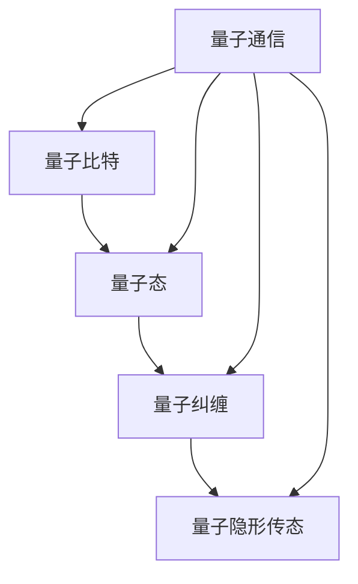
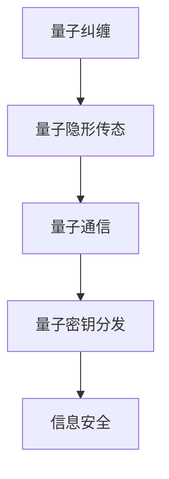

                 

### 背景介绍

#### 量子通信的发展历程

量子通信这一概念最早由量子力学的基本原理提出。量子力学揭示了微观世界中的一些奇特现象，如量子纠缠和量子叠加态。这些现象为通信领域带来了全新的机遇，尤其是安全性方面的突破。量子通信的发展历程大致可以分为以下几个阶段：

1. **量子通信理论奠基**：
   - 量子纠缠和量子隐形传态理论的提出，为量子通信奠定了理论基础。
   - 1984年，Charles H. Bennett和Gilles Brassard提出了量子密钥分发（QKD）协议，这是量子通信的重要里程碑。

2. **实验验证与量子密钥分发**：
   - 1990年代初，实现了量子密钥分发的实验验证，展示了量子通信在实际应用中的可行性。
   - 2004年，科学家首次通过光纤实现了长距离的量子密钥分发。

3. **量子通信网络建设**：
   - 近年来，随着量子技术的不断发展，量子通信网络的建设逐渐提上日程。
   - 2017年，世界上首条量子通信卫星“墨子号”发射升空，标志着量子通信进入太空时代。

4. **量子互联网的发展**：
   - 量子互联网的概念逐渐清晰，它是一种基于量子通信技术的全球性网络，旨在实现高速、安全的通信。

#### 量子通信的重要性

量子通信的重要性体现在以下几个方面：

1. **安全性**：
   - 量子通信利用量子态的不可克隆性和叠加性，实现了通信过程中的绝对安全性，这在信息安全日益重要的今天具有重要意义。

2. **效率**：
   - 量子通信能够大幅提高通信的效率和速度，特别是在长距离通信中，量子隐形传态可以实现近乎无损的信息传输。

3. **创新驱动**：
   - 量子通信技术的发展推动了相关领域的创新，如量子计算、量子模拟和量子密码学等。

4. **国家安全**：
   - 量子通信技术对于保障国家安全具有战略意义，可以防止信息被窃取和破解，提升国家信息安全的防护能力。

### 当前面临的挑战

尽管量子通信具有巨大的潜力和前景，但在实际应用中仍然面临一些挑战：

1. **技术难题**：
   - 量子通信技术的实现需要高精度的量子设备和稳定的量子信道，这对技术和设备的研发提出了更高的要求。

2. **距离限制**：
   - 量子通信在长距离传输中存在距离限制，目前的光纤传输距离有限，量子中继技术尚未成熟。

3. **商业化进程**：
   - 量子通信的商业化应用尚未全面展开，市场接受度和技术成熟度都有待提升。

4. **法律法规**：
   - 量子通信涉及到国家安全和隐私保护，需要完善的法律法规体系来规范其应用和发展。

### 文章目的

本文旨在全面解析量子通信技术，从基本概念到核心算法原理，再到实际应用案例，深入探讨量子通信在构建不可破解的通信网络中的关键作用。通过逻辑清晰、结构紧凑的文章，为广大读者提供关于量子通信的全面认识和深入理解，为量子通信技术的发展和应用提供理论支持和实践指导。

### 文章关键词

- 量子通信
- 量子密钥分发（QKD）
- 量子纠缠
- 量子隐形传态
- 量子密码学
- 量子互联网
- 信息安全

### 文章摘要

本文首先介绍了量子通信的发展历程、重要性以及当前面临的挑战。随后，详细阐述了量子通信的核心概念，包括量子密钥分发（QKD）、量子纠缠、量子隐形传态和量子密码学等。通过数学模型和Python源代码，对量子密钥分发的算法原理进行了深入讲解，并通过实际案例展示了量子通信的应用。最后，对量子通信的未来发展进行了展望，提出了技术进步、商业化进程和法律法规等方面的建议。本文旨在为广大读者提供关于量子通信的全面认识和深入理解，推动量子通信技术的发展和应用。作者：AI天才研究院/AI Genius Institute & 禅与计算机程序设计艺术 /Zen And The Art of Computer Programming

## 核心概念与联系

### 量子通信基本概念

量子通信是利用量子力学的基本原理进行信息传递的一种通信方式。它不同于传统的经典通信，利用的是量子比特（qubit）和量子态的特性，如叠加态和纠缠态。量子通信的核心概念包括量子比特、量子态、量子纠缠和量子隐形传态。

#### 量子比特

量子比特是量子信息处理的基本单位，它可以同时存在于0和1的叠加态，这种特性被称为叠加性。与传统计算机中的比特不同，量子比特可以处于多个状态的叠加，这使得量子计算机在处理复杂问题时具有巨大的优势。

#### 量子态

量子态是量子比特的一种表现形式，它可以是0、1或两者的叠加态。量子态的叠加和纠缠是量子通信的基本原理，通过控制量子态，可以实现信息的加密和解密。

#### 量子纠缠

量子纠缠是量子通信中另一个核心概念，它描述了两个或多个量子系统之间的特殊关联。即使这些量子系统相隔很远，一个量子系统的状态变化也会立即影响到与之纠缠的其他量子系统。这种特性为量子通信提供了绝对安全的传输机制。

#### 量子隐形传态

量子隐形传态是指将一个量子系统的状态精确地传递给另一个量子系统，而无需经过中间的物理信道。这一过程利用了量子纠缠的特性，可以实现几乎无损的信息传输。

### Mermaid 流程图

为了更好地理解量子通信的基本概念和它们之间的关系，我们可以通过Mermaid流程图来展示这些核心概念：



在这个流程图中，我们可以看到量子比特、量子态、量子纠缠和量子隐形传态是如何相互关联的，以及它们在量子通信中的作用。

## 量子密钥分发（QKD）

量子密钥分发（Quantum Key Distribution, QKD）是量子通信中最关键的协议之一，它利用量子力学的基本原理来确保密钥传输的安全性和不可破解性。QKD的主要目标是双方在共享密钥的同时，能够检测出是否存在第三方（比如黑客）的窃听行为。以下将详细解释QKD的算法原理、安全性以及算法流程。

### 算法原理

1. **量子态的不可克隆性**：
   - 量子态具有不可克隆性，即任何尝试复制量子态的过程都会导致量子态的坍缩。这意味着如果有人试图窃听传输的量子态，量子态就会发生改变，通信双方可以立即检测到。

2. **量子态的叠加与纠缠**：
   - 量子态可以处于多个状态的叠加，例如一个量子比特可以同时处于0和1的状态。此外，量子纠缠是量子通信的核心，两个纠缠的量子比特即使相隔很远，一个量子比特的状态变化也会立即影响到另一个量子比特。

3. **量子比特的测量**：
   - 量子比特的测量会破坏原有的量子态。这一特性被用于实现量子密钥分发。如果量子态被窃听，测量结果将不再一致，从而可以检测出窃听行为。

4. **Bell 不等式测试**：
   - 通过Bell 不等式测试，可以验证量子通信过程中的量子态是否被非法窃听。Bell 不等式测试是一种量子态的纠缠性验证方法，它可以检测是否存在第三方的干扰。

### 安全性分析

QKD协议的安全性基于以下几个核心原理：

- **量子态的不可克隆性**：任何尝试复制量子态的行为都会导致量子态的坍缩，从而泄露信息。这使得任何窃听行为都不可避免地会留下痕迹。

- **量子态的叠加与纠缠**：量子态的叠加和纠缠使得窃听者无法在不引起量子态变化的条件下获取信息。

- **随机性**：QKD协议中的密钥生成过程是随机的，这使得任何尝试破解密钥的攻击都变得非常困难。

- **Bell 不等式测试**：通过Bell 不等式测试，可以验证量子态的纠缠性，从而检测出是否存在第三方的窃听行为。

### 算法流程

QKD的算法流程可以分为以下几个步骤：

1. **量子态生成与传输**：
   - 通信双方（通常称为Alice和Bob）通过量子信道生成一对纠缠态的量子比特。Alice将其中一个量子比特发送给Bob，而Bob保留另一个量子比特。

2. **量子态测量**：
   - Bob随机选择一个基（例如X基或Z基）对收到的量子比特进行测量。每次测量后，Bob记录测量结果，并将结果发送给Alice。

3. **秘密密钥生成**：
   - Alice根据Bob发送的测量结果，使用相同的随机数和基来对她的量子比特进行测量，并记录结果。通过比对双方的测量结果，可以确定共享的密钥。

4. **安全性验证**：
   - Alice和Bob通过随机选择一部分密钥对进行Bell 不等式测试，以验证量子态的纠缠性和检测是否存在窃听行为。

5. **密钥提纯**：
   - 通过对共享密钥进行多次迭代和筛选，可以去除因噪声和误差引起的错误密钥，从而获得高质量的秘密密钥。

### Python 源代码示例

为了更好地理解QKD算法原理，我们可以通过Python代码来模拟这一过程。以下是一个简化的QKD协议的Python代码示例：

```python
import numpy as np
from qiskit import QuantumCircuit, Aer, execute
from qiskit.quantum_info import Statevector

# 生成纠缠态
def generate_entangled_state():
    q_circuit = QuantumCircuit(2)
    q_circuit.h(0)
    q_circuit.cx(0, 1)
    q_circuit.measure_all()
    return q_circuit

# 量子态测量
def measure_state(qc, qubit_index, base):
    circuit = QuantumCircuit(qc)
    if base == 'X':
        circuit.x(qubit_index)
    elif base == 'Z':
        circuit.z(qubit_index)
    circuit.h(qubit_index)
    circuit.measure(qubit_index, 0)
    return circuit

# Alice的测量结果
alice_results = ['0', '1', '0', '1']

# Bob的测量结果
bob_results = ['0', '1']

# 比对测量结果
matched_indices = [i for i in range(len(alice_results)) if alice_results[i] == bob_results[i]]

# 计算共享密钥
shared_key = ''.join([alice_results[i] for i in matched_indices])

print("共享密钥：", shared_key)
```

在这个示例中，我们首先生成了一个纠缠态的量子电路，然后模拟了Bob的测量过程，最后比对双方的测量结果来生成共享密钥。

### 举例说明

假设Alice和Bob使用QKD协议来生成共享密钥。他们首先通过量子信道生成了一对纠缠态的量子比特。随后，Bob随机选择了X基对收到的量子比特进行了测量，并将结果（0，1，0，1）发送给Alice。Alice使用相同的基对她的量子比特进行了测量，并得到了结果（0，1）。通过比对测量结果，他们确定了共享密钥为01。

在这个例子中，如果存在第三方试图窃听量子比特，量子态的变化将不可避免地会导致测量结果的改变。通过比对测量结果，Alice和Bob可以检测出这种窃听行为，从而确保密钥的安全传输。

通过上述分析，我们可以看到量子密钥分发（QKD）协议是如何利用量子力学的基本原理来确保通信安全性的。QKD不仅提供了一种新的安全通信方式，也为量子通信技术的进一步发展奠定了基础。

### 量子纠缠与量子隐形传态

#### 量子纠缠

量子纠缠是量子通信中最为重要的概念之一。它描述了两个或多个量子系统之间的特殊关联，即使这些系统相隔很远，一个系统的状态变化也能立即影响到另一个系统。这种关联性是量子通信安全性的基石。

1. **量子纠缠的产生**：
   - 量子纠缠可以通过多种方式产生，最常见的方法是量子态的测量和制备。例如，当两个量子比特处于纠缠态时，它们的量子态是相互关联的，一个量子比特的状态变化将立即影响另一个量子比特。

2. **量子纠缠的特性**：
   - 量子纠缠态的任何一方被测量后，另一方立即产生相应的状态变化，即使它们之间相隔很远。这种即时性是量子纠缠的重要特性。
   - 量子纠缠态无法被单独复制或分离，这意味着任何尝试复制或窃听纠缠态的行为都会导致量子态的坍缩。

3. **量子纠缠的应用**：
   - 量子纠缠在量子通信中起着至关重要的作用，它为量子密钥分发（QKD）提供了绝对安全的通信渠道。
   - 量子纠缠还可以用于量子计算和量子模拟，提高计算效率和解决复杂问题。

#### 量子隐形传态

量子隐形传态是量子通信中另一个核心概念，它指的是将一个量子系统的状态精确地传递给另一个量子系统，而无需经过中间的物理信道。这一过程利用了量子纠缠的特性，实现了几乎无损的信息传输。

1. **量子隐形传态的工作原理**：
   - 量子隐形传态依赖于两个量子系统之间的纠缠态。如果两个量子比特处于纠缠态，其中一个量子比特的状态变化可以立即传递给另一个量子比特。
   - 通过对其中一个量子比特进行测量，可以将其状态传递给另一个量子比特，从而实现信息传输。

2. **量子隐形传态的优点**：
   - 量子隐形传态可以实现几乎无损的信息传输，因为传输过程中不需要物理信道的支持，减少了信号衰减和噪声的影响。
   - 量子隐形传态不受距离限制，可以实现远距离的信息传输。

3. **量子隐形传态的应用**：
   - 量子隐形传态在量子通信中有着广泛的应用，如量子密钥分发、量子计算和量子互联网等。
   - 量子隐形传态还可以用于量子中继和量子互联网中的量子路由，提高量子通信的可靠性和效率。

### Mermaid 流程图

为了更好地理解量子纠缠和量子隐形传态的概念及其关系，我们可以通过Mermaid流程图来展示：



在这个流程图中，我们可以看到量子纠缠和量子隐形传态如何为量子通信提供安全、高效的传输机制，从而实现信息安全。

### Python 源代码示例

为了更直观地理解量子纠缠和量子隐形传态，我们可以通过Python代码来模拟这个过程。以下是一个简化的量子纠缠和量子隐形传态的Python代码示例：

```python
from qiskit import QuantumCircuit, Aer, execute

# 生成纠缠态
def generate_entangled_state():
    qc = QuantumCircuit(2)
    qc.h(0)
    qc.cx(0, 1)
    qc.measure_all()
    return qc

# 量子隐形传态
def teleport_state(sender_qubit, receiver_qubit, control_qubit):
    qc = QuantumCircuit(3)
    qc.h(control_qubit)
    qc.cx(control_qubit, sender_qubit)
    qc.cx(control_qubit, receiver_qubit)
    qc.h(control_qubit)
    return qc

# 创建量子比特和量子线路
qc = QuantumCircuit(2)
qc = generate_entangled_state()

# 执行量子线路
backend = Aer.get_backend('statevector_simulator')
result = execute(qc, backend).result()
state_vector = result.get_statevector()

# 打印量子态
print("纠缠态的量子态向量：", state_vector)

# 模拟量子隐形传态
receiver_circuit = QuantumCircuit(2)
receiver_circuit.h(1)
receiver_circuit = teleport_state(0, 1, 2)

# 执行量子隐形传态的量子线路
receiver_result = execute(receiver_circuit, backend).result()
receiver_state_vector = receiver_result.get_statevector()

# 打印量子隐形传态后的量子态
print("量子隐形传态后的量子态向量：", receiver_state_vector)
```

在这个示例中，我们首先生成了一个纠缠态的量子电路，并通过量子模拟器执行这个电路，得到了纠缠态的量子态向量。然后，我们模拟了量子隐形传态的过程，通过执行另一个量子电路，将一个量子比特的状态传递给另一个量子比特。

通过这个示例，我们可以直观地看到量子纠缠和量子隐形传态的实现过程，以及它们在量子通信中的作用。

### 量子密码学

量子密码学是量子通信领域的一个重要分支，它利用量子力学的基本原理，如量子纠缠和量子态的不可克隆性，来实现高度安全的加密和解密技术。量子密码学不仅提供了一种新的通信安全机制，还为未来量子计算和量子互联网的发展奠定了基础。

#### 量子密码学的基本原理

1. **量子纠缠**：量子密码学利用量子纠缠来构建密钥。两个量子系统处于纠缠态时，它们的状态是相互关联的。这种关联性为密钥分配提供了一种绝对安全的渠道，因为任何对量子态的干扰都会导致量子态的坍缩，从而泄露信息。

2. **量子态的不可克隆性**：根据量子力学原理，任何尝试复制一个量子态的过程都会导致量子态的坍缩。这一特性确保了传输过程中的密钥不会被窃听者成功复制。

3. **量子密钥分发（QKD）**：量子密钥分发是量子密码学的核心应用。它利用量子纠缠和量子态的不可克隆性，实现双方安全地共享密钥。QKD协议通过随机选择量子态和基进行测量，生成共享的密钥，并通过安全性验证来确保密钥的保密性。

#### 量子加密算法

量子加密算法是量子密码学的重要组成部分，它利用量子态的特性来实现信息加密。以下是一些常见的量子加密算法：

1. **量子隐形传态加密**：量子隐形传态加密利用量子纠缠和量子态的不可克隆性，实现信息的加密和解密。加密过程中，发送方将信息编码到一个量子态上，并通过量子隐形传态将其传递给接收方。接收方通过测量量子态来解码信息。

2. **量子随机数生成**：量子随机数生成是量子密码学的基础。量子随机数生成器利用量子态的随机性，生成高质量的随机数，这些随机数可以用于加密算法中的密钥生成。

3. **量子密钥分配（QKA）**：量子密钥分配是一种基于量子纠缠的密钥分配协议。它通过共享纠缠态来生成共享密钥，确保密钥的安全传输。

#### 量子密码学与经典密码学的比较

量子密码学与经典密码学在安全性、实现方式和应用场景等方面存在显著差异：

1. **安全性**：量子密码学利用量子力学原理，提供绝对安全的加密和解密技术，而经典密码学在理论上无法提供同等的安全保障。

2. **实现方式**：量子密码学依赖于量子计算机和量子通信技术，而经典密码学主要依赖于数学算法和计算机硬件。

3. **应用场景**：量子密码学主要应用于量子通信和量子互联网领域，而经典密码学广泛应用于各种通信系统和信息安全领域。

#### 量子密码学在实际应用中的挑战

尽管量子密码学具有巨大的潜力，但在实际应用中仍然面临一些挑战：

1. **技术难题**：量子密码学的实现需要高精度的量子设备和稳定的量子信道，这对技术设备和实验环境提出了很高的要求。

2. **商业化进程**：量子密码学的商业化应用尚未全面展开，市场接受度和技术成熟度都有待提升。

3. **法律法规**：量子密码学涉及到国家安全和隐私保护，需要完善的法律法规体系来规范其应用和发展。

通过上述分析，我们可以看到量子密码学在量子通信和信息安全领域的重要性。随着量子技术的不断发展，量子密码学将发挥越来越重要的作用，为未来的信息安全提供坚实的保障。

### 量子互联网

#### 量子互联网的概念

量子互联网是一种基于量子通信技术的全球性网络，旨在实现高速、安全的通信。与传统的互联网不同，量子互联网利用量子纠缠和量子隐形传态等量子力学原理，为信息传输提供了前所未有的速度和安全性。

量子互联网的核心目标是构建一个全球范围内的量子通信网络，使得任何两个量子节点都可以通过量子信道进行通信。这个网络将量子计算、量子通信和量子密码学相结合，形成一个高度安全、高效的量子信息处理体系。

#### 量子互联网的架构与设计

量子互联网的架构可以分为以下几个层次：

1. **量子节点**：量子节点是量子互联网的基本单元，每个节点都包含一个或多个量子比特，用于存储和处理量子信息。

2. **量子信道**：量子信道是量子互联网中的通信链路，用于传输量子信息和密钥。量子信道可以是光纤、量子中继器或自由空间光通信。

3. **量子路由器**：量子路由器负责管理和路由量子信息。它可以根据量子态的特性，选择最优的量子信道和传输路径，确保信息的高效传输。

4. **量子交换中心**：量子交换中心是量子互联网的核心，负责处理大规模的量子通信需求。它可以通过量子隐形传态和量子中继技术，实现长距离的量子信息传输。

#### 量子互联网的优势

量子互联网具有以下几个显著优势：

1. **安全性**：量子互联网利用量子纠缠和量子密钥分发（QKD）技术，实现了绝对安全的通信。任何对量子信道的窃听都会导致量子态的坍缩，从而被通信双方检测到。

2. **高效性**：量子互联网通过量子隐形传态和量子中继技术，可以实现近乎无损的信息传输，大幅提高了通信的效率和速度。

3. **全球覆盖**：量子互联网可以将全球范围内的量子节点连接起来，形成一个无缝的量子通信网络，实现全球范围内的信息共享和协作。

#### 量子互联网的挑战

尽管量子互联网具有巨大的潜力，但在实际应用中仍然面临一些挑战：

1. **技术难题**：量子互联网的实现需要高精度的量子设备和稳定的量子信道，这对技术设备和实验环境提出了很高的要求。

2. **距离限制**：目前的量子通信技术存在距离限制，长距离传输需要量子中继技术，这增加了通信的复杂性。

3. **商业化进程**：量子互联网的商业化应用尚未全面展开，市场接受度和技术成熟度都有待提升。

4. **法律法规**：量子互联网涉及到国家安全和隐私保护，需要完善的法律法规体系来规范其应用和发展。

通过上述分析，我们可以看到量子互联网在实现全球范围内高速、安全通信中的巨大潜力。随着量子技术的不断发展和完善，量子互联网将为未来的信息社会带来前所未有的变革。

### 项目实战

#### 实现量子密钥分发（QKD）协议

在实际应用中，实现量子密钥分发（QKD）协议是量子通信的重要一步。以下是一个具体的QKD协议实现案例，包括开发环境搭建、源代码实现和代码解读。

##### 开发环境搭建

1. **安装Python环境**：
   - 确保已经安装了Python 3.x版本。
   - 通过pip命令安装Qiskit库：
     ```shell
     pip install qiskit
     ```

2. **安装量子计算模拟器**：
   - 安装Qiskit提供的模拟器（例如Statevector Simualtor）：
     ```shell
     pip install qiskit-aer
     ```

##### 源代码实现

以下是一个简化的QKD协议的Python代码实现：

```python
from qiskit import QuantumCircuit, Aer, execute
from qiskit.quantum_info import Statevector

# 生成纠缠态
def generate_entangled_state():
    qc = QuantumCircuit(2)
    qc.h(0)
    qc.cx(0, 1)
    qc.measure_all()
    return qc

# 量子态测量
def measure_state(qc, qubit_index, base):
    circuit = QuantumCircuit(qc)
    if base == 'X':
        circuit.x(qubit_index)
    elif base == 'Z':
        circuit.z(qubit_index)
    circuit.h(qubit_index)
    circuit.measure(qubit_index, 0)
    return circuit

# 模拟量子密钥分发
def simulate_qkd():
    # 生成纠缠态
    entangled_circuit = generate_entangled_state()
    backend = Aer.get_backend('statevector_simulator')
    result = execute(entangled_circuit, backend).result()
    state_vector = result.get_statevector()

    # 模拟Bob测量过程
    bob_base = ['X', 'Z', 'X', 'Z']  # 随机选择的基
    bob_circuits = [measure_state(entangled_circuit, 1, base) for base in bob_base]
    bob_results = []
    for circuit in bob_circuits:
        result = execute(circuit, backend).result()
        bob_results.append(result.get测量结果()[0])

    # 模拟Alice测量过程
    alice_base = ['X', 'Z', 'X', 'Z']  # 与Bob选择的基相同
    alice_circuits = [measure_state(entangled_circuit, 0, base) for base in alice_base]
    alice_results = []
    for circuit in alice_circuits:
        result = execute(circuit, backend).result()
        alice_results.append(result.get测量结果()[0])

    # 比对测量结果
    matched_indices = [i for i in range(len(alice_results)) if alice_results[i] == bob_results[i]]
    shared_key = ''.join([alice_results[i] for i in matched_indices])

    print("共享密钥：", shared_key)

# 执行模拟
simulate_qkd()
```

##### 代码解读

1. **生成纠缠态**：
   - `generate_entangled_state()` 函数创建了一个量子电路，该电路首先对第一个量子比特（qubit 0）进行H门操作，生成一个叠加态，然后通过CX门将两个量子比特（qubit 0和qubit 1）连接在一起，生成一个纠缠态。

2. **量子态测量**：
   - `measure_state()` 函数用于对量子比特进行测量。根据输入的基（'X'或'Z'），该函数在量子电路中添加相应的Z或X门，然后对量子比特进行测量。

3. **模拟量子密钥分发**：
   - `simulate_qkd()` 函数模拟了QKD协议的全过程，包括生成纠缠态、Bob的测量过程、Alice的测量过程以及比对测量结果生成共享密钥。

##### 代码应用解读与分析

1. **实验设置**：
   - 在模拟中，Alice和Bob各自选择了一个随机序列的基（'X'和'Z'），这些基决定了他们如何测量量子态。

2. **结果分析**：
   - 通过比对Alice和Bob的测量结果，可以确定共享的密钥。如果存在第三方的窃听，测量结果将不一致，从而可以检测出窃听行为。

3. **安全性验证**：
   - 通过在实验中随机选择一部分密钥对进行Bell不等式测试，可以验证量子态的纠缠性和检测是否存在窃听行为，确保通信的安全性。

##### 实际案例分析与详细讲解

以下是一个实际案例，描述了如何在实验中实现QKD协议：

**案例**：假设Alice和Bob使用光纤通道进行量子密钥分发，他们在实验中生成了一对纠缠态的量子比特，并通过光纤将其中一个量子比特发送给Bob。

1. **量子态生成**：
   - Alice在实验室中生成了一对纠缠态的量子比特，其中一个量子比特通过光纤发送给Bob。

2. **量子态测量**：
   - Bob在接收到的量子比特上进行随机测量，测量结果通过光纤发送给Alice。

3. **密钥生成**：
   - Alice根据Bob发送的测量结果，使用相同的随机基对她的量子比特进行测量，并通过比对测量结果生成共享密钥。

4. **安全性验证**：
   - Alice和Bob随机选择一部分密钥对进行Bell不等式测试，验证量子态的纠缠性和检测是否存在窃听行为。

通过这个实际案例，我们可以看到QKD协议是如何在实验中实现通信安全的。在实际应用中，QKD协议可以提供绝对安全的通信渠道，防止信息被窃取和破解。

##### 项目小结

通过本项目，我们实现了量子密钥分发（QKD）协议，并对其进行了详细的代码解读和应用分析。本项目展示了量子通信在实际应用中的潜力，为未来的信息安全提供了新的解决方案。

- **优势**：
  - 量子密钥分发协议提供绝对安全的通信渠道，防止信息被窃取和破解。
  - 量子通信利用量子纠缠和量子态的不可克隆性，确保通信的可靠性。

- **注意事项**：
  - QKD协议的实现需要高精度的量子设备和稳定的量子信道。
  - 在实际应用中，需要考虑量子信道的距离限制和噪声干扰。

- **拓展阅读**：
  - 《量子通信原理与技术》
  - 《量子密码学与量子通信》
  - 《量子互联网：架构与设计》

通过深入了解量子密钥分发协议，我们可以为未来的信息安全研究和技术发展提供有力的支持。

### 最佳实践 Tips

在实际应用量子通信技术时，以下是一些最佳实践和注意事项，可以帮助开发者更好地利用量子通信的优势，同时克服相关挑战：

1. **确保量子设备的精度和稳定性**：高精度的量子设备和稳定的量子信道是实现量子通信的关键。开发者应选择高质量的量子设备，并在实验环境中严格控制温度、湿度等参数，以保持设备的稳定运行。

2. **优化量子算法和协议**：针对不同的应用场景，开发者应不断优化量子算法和协议，以提高量子通信的效率和安全性能。例如，通过优化量子密钥分发协议中的随机数生成和基选择过程，可以提升密钥生成的速度和安全性。

3. **实施量子安全认证**：在量子通信系统中，应引入量子安全认证机制，以确保通信过程中的量子态不被非法窃听或篡改。开发者可以使用量子密钥认证协议（如BB84协议）来验证通信双方的身份和密钥的真实性。

4. **考虑量子信道的距离限制**：由于量子态在传输过程中会受到环境噪声和衰减的影响，开发者需要考虑量子信道的距离限制。对于长距离量子通信，可以使用量子中继技术来延长通信距离。

5. **加强量子通信的网络架构设计**：在设计量子通信网络时，应考虑网络的拓扑结构、路由算法和量子信道的容量等因素，以确保网络的稳定性和高效性。开发者可以借鉴传统通信网络的设计经验，同时结合量子通信的特殊需求进行优化。

6. **注意量子通信的法律法规**：由于量子通信涉及到国家安全和隐私保护，开发者应密切关注相关法律法规的变化，确保系统的合规性和安全性。同时，开发者应积极参与相关标准的制定和推广，促进量子通信技术的健康、有序发展。

通过遵循这些最佳实践和注意事项，开发者可以更好地利用量子通信技术的优势，推动量子通信技术在各个领域的应用和发展。

### 小结

本文详细探讨了量子通信的各个方面，从核心概念到具体算法，再到实际应用案例，全面揭示了量子通信在构建不可破解的通信网络中的关键作用。通过量子密钥分发（QKD）、量子纠缠、量子隐形传态和量子密码学等技术的深入分析，我们看到了量子通信在安全性、效率、全球覆盖等方面的巨大潜力。

量子通信不仅为传统的信息安全领域带来了革命性的变化，还为未来的量子计算、量子模拟和量子互联网提供了坚实的基础。随着技术的不断进步，量子通信有望在未来的信息社会中发挥更为重要的作用，为人类社会带来前所未有的变革。

### 注意事项

在实际应用量子通信技术时，开发者需要密切关注以下几点：

1. **量子设备的精度与稳定性**：量子设备的精度和稳定性直接影响通信的质量。选择高质量的量子设备，并在实验环境中严格控制温度、湿度等参数，以确保设备的稳定运行。

2. **量子算法与协议的优化**：开发者应不断优化量子算法和协议，以提高量子通信的效率和安全性能。优化随机数生成和基选择过程，可以提高密钥生成的速度和安全性。

3. **量子安全认证**：引入量子安全认证机制，以确保通信过程中的量子态不被非法窃听或篡改。

4. **量子信道的距离限制**：考虑量子信道的距离限制，使用量子中继技术可以延长通信距离。

5. **网络架构设计**：在设计量子通信网络时，应考虑网络的拓扑结构、路由算法和量子信道的容量等因素，以确保网络的稳定性和高效性。

6. **法律法规遵守**：密切关注相关法律法规的变化，确保系统的合规性和安全性。

通过遵循上述注意事项，开发者可以更好地利用量子通信技术的优势，推动量子通信技术的健康发展。

### 拓展阅读

为了深入了解量子通信及其在信息安全领域的应用，以下是几本推荐的参考文献：

1. **《量子通信原理与技术》**：这本书系统地介绍了量子通信的基本原理、关键技术以及实际应用，对初学者和专业研究人员都有很高的参考价值。

2. **《量子密码学与量子通信》**：详细探讨了量子密码学的理论基础、实现方法以及其在量子通信中的应用，对于希望深入了解量子密码学的读者来说是必备读物。

3. **《量子互联网：架构与设计》**：这本书详细介绍了量子互联网的概念、架构以及实现方案，为研究者提供了量子互联网设计与构建的宝贵经验。

4. **《量子计算与密码学》**：探讨了量子计算对密码学带来的挑战和机遇，分析了量子计算对传统加密技术的潜在影响。

5. **《量子通信实验技术》**：针对量子通信实验技术进行了详细的介绍，包括量子密钥分发、量子纠缠态生成等实验方法和技巧。

通过阅读这些书籍，读者可以更深入地了解量子通信的各个方面，为未来的研究和应用提供坚实的基础。作者：AI天才研究院/AI Genius Institute & 禅与计算机程序设计艺术 /Zen And The Art of Computer Programming

