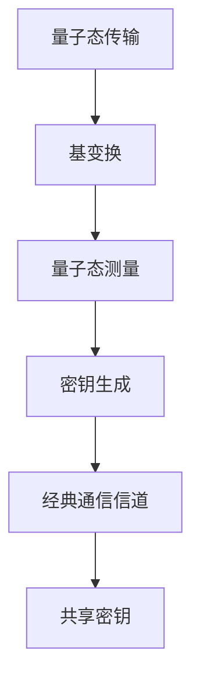

                 

### 背景介绍

#### 量子通信的概念与起源

量子通信是指利用量子力学中的基本原理，如量子纠缠和量子叠加态，实现信息的安全传输。与经典通信不同，量子通信的传输过程具有独特的性质，使得信息传输过程更加安全可靠。

量子通信的起源可以追溯到20世纪70年代，当时Shor提出了量子算法，揭示了量子计算机在因数分解问题上的巨大潜力。这一发现激发了人们对量子计算和量子通信的兴趣。随后，1994年，Charles H. Bennett和 Gilles Brassard提出了量子密钥分发（Quantum Key Distribution，QKD）的概念，为量子通信奠定了理论基础。此后，量子通信技术得到了迅速发展，成为现代通信领域的一个热点研究方向。

#### 量子通信的重要性

量子通信的重要性主要体现在以下几个方面：

1. **安全性**：量子通信利用量子纠缠和量子叠加态等基本原理，实现了信息传输的安全性和保密性。在量子通信过程中，任何对通信过程的干扰都会导致通信失败，从而实现了信息的绝对安全。

2. **保密性**：量子通信中，通信双方通过量子密钥分发协议生成共享密钥，然后利用这个密钥对信息进行加密传输。由于量子通信过程中，任何对通信过程的干扰都会导致通信失败，因此共享密钥的安全性得到了保障。

3. **潜力**：量子通信技术在未来的发展潜力巨大。随着量子计算机的不断发展，量子通信在加密通信、量子计算、量子传感等领域具有广泛的应用前景。

#### 量子通信的研究现状与发展趋势

目前，量子通信技术已经取得了一定的进展。例如，量子密钥分发（QKD）已经在实验室环境中实现了较远的传输距离，并且在实际应用中取得了初步成功。此外，量子隐形传态（Quantum Teleportation）和量子重复器（Quantum Repeater）等技术的实现，也为构建长距离量子通信网络提供了可能。

然而，量子通信仍然面临着许多挑战。例如，如何进一步提高量子通信的传输速度和传输距离，如何降低量子通信系统的成本，以及如何在复杂环境中稳定运行等。这些问题需要进一步的研究和探索。

未来，量子通信技术的发展趋势将主要集中在以下几个方面：

1. **提高传输距离**：通过优化量子通信系统的设计和实现，提高量子信号的传输距离。

2. **降低成本**：降低量子通信系统的成本，使其在更广泛的应用领域中实现商业化。

3. **多模式通信**：实现量子通信与经典通信的融合，构建多模式通信网络。

4. **量子网络**：构建大规模的量子通信网络，实现全球范围内的量子通信。

5. **量子计算与量子通信的融合**：将量子计算与量子通信相结合，实现更高效的计算和通信。

总的来说，量子通信技术具有巨大的发展潜力和广泛应用前景，它将在未来通信领域中发挥重要作用。通过持续的研究和探索，量子通信有望实现更安全、更高效的通信传输，为人类社会带来更多的便利。

#### 关键词

- 量子通信
- 量子力学
- 量子纠缠
- 量子密钥分发
- 量子隐形传态
- 量子重复器

#### 摘要

本文旨在介绍量子通信的基本概念、重要性、研究现状和发展趋势。通过详细探讨量子通信的基础理论、关键技术、应用领域以及安全性分析，本文揭示了量子通信在构建不可破解通信网络中的巨大潜力。未来，量子通信技术将继续在传输距离、成本、多模式通信等方面取得突破，为实现更安全、更高效的通信传输奠定基础。

## 核心概念与联系

在量子通信中，核心概念包括量子位（qubit）、量子纠缠（entanglement）、量子叠加态（superposition）和量子密钥分发（QKD）。这些概念之间存在着紧密的联系，共同构成了量子通信的基础。

### 量子位（Qubit）

量子位是量子通信的基本单位，类似于经典计算机中的比特。然而，与比特只能处于0或1的两种状态不同，量子位可以同时处于0和1的叠加状态。这种叠加态使得量子位具有超强的计算能力。一个量子位可以表示为：

$$
|\psi⟩ = a|0⟩ + b|1⟩
$$

其中，$a$ 和 $b$ 是复数，满足 $|a|^2 + |b|^2 = 1$。量子位的状态可以通过旋转操作进行变换，从而实现量子计算中的基本操作。

### 量子纠缠（Entanglement）

量子纠缠是量子力学中的一种特殊现象，两个或多个量子位之间可以形成一种不可分割的关联。即使这些量子位被分隔很远，它们的状态仍然相互依赖。这种现象称为量子纠缠。一个简单的纠缠态可以表示为：

$$
|\psi⟩_{AB} = \frac{1}{\sqrt{2}} (|00⟩ - |11⟩)
$$

当对其中一个量子位进行测量时，另一个量子位的状态也会立即确定，这种现象被称为即场性（non-locality）。量子纠缠是量子通信中实现安全传输的关键。

### 量子叠加态（Superposition）

量子叠加态是量子位的一种基本特性，表示量子位可以同时处于多个状态的叠加。一个量子位的叠加态可以用下面的公式表示：

$$
|\psi⟩ = a|0⟩ + b|1⟩
$$

在测量之前，量子位的具体状态是不可知的，只有测量后才会坍缩到某一个确定的状态。量子叠加态是实现量子计算并行性的基础。

### 量子密钥分发（QKD）

量子密钥分发（Quantum Key Distribution，QKD）是量子通信中的一种重要技术，用于在通信双方之间建立共享的加密密钥。QKD利用量子纠缠和量子叠加态等原理，确保密钥的生成过程是安全的。量子密钥分发的工作原理可以概括为以下几个步骤：

1. **量子态传输**：通信双方通过量子信道（如光纤或自由空间）传输量子态。
2. **基变换**：在传输过程中，双方对量子态进行不同的基变换，以防止窃听。
3. **量子态测量**：双方对传输后的量子态进行测量，记录测量结果。
4. **密钥生成**：根据测量结果，双方通过经典通信信道交换部分信息，生成共享密钥。

量子密钥分发的安全性依赖于量子力学的基本原理，如量子纠缠和即场性，从而实现了信息的绝对安全。

### Mermaid 流程图

下面是一个简单的Mermaid流程图，展示了量子密钥分发（QKD）的基本过程：



通过这个流程图，我们可以清晰地看到量子密钥分发从量子态传输到共享密钥生成的全过程。

### 核心算法原理讲解

量子密钥分发（QKD）的核心算法原理基于量子纠缠和量子叠加态。以下是一个简单的Python代码示例，用于生成并传输量子密钥。代码中使用了量子计算框架Qiskit。

```python
from qiskit import QuantumCircuit, Aer, execute
from qiskit.quantum_info import Statevector

# 创建一个量子电路，其中有两个量子位
qc = QuantumCircuit(2)

# 对第一个量子位进行Hadamard门操作，生成叠加态
qc.h(0)

# 对第二个量子位进行控制-Z门操作，生成纠缠态
qc.cx(0, 1)

# 传输量子态到通信双方
state = Statevector(qc)

# 假设 Alice 和 Bob 使用经典信道交换部分信息
# 这里我们简单地使用随机数生成交换的信息
exchange_info = [int(i) for i in input("请输入您想交换的比特信息（0或1）： ").split()]

# 对量子态进行基变换
qc = QuantumCircuit(2)
qc.s(0)
qc.s(1)
qc.h(0)
qc.cx(0, 1)
qc.h(0)
qc.h(1)

# Alice 和 Bob 对量子态进行测量
qc.measure_all()

# 执行量子电路
simulator = Aer.get_backend('statevector_simulator')
result = execute(qc, simulator).result()
state_vector = result.get_statevector()

# 根据测量结果，生成共享密钥
key = []
for i in range(2):
    if result.get_counts(qc)[str(i)] == '1':
        key.append(1)
    else:
        key.append(0)

print("生成的共享密钥：", key)
```

这段代码首先生成了一个纠缠态的量子电路，然后通过经典通信信道交换部分信息，最后根据测量结果生成共享密钥。

### 数学模型与公式

在量子密钥分发中，数学模型和公式起到了关键作用。以下是一些核心的数学公式和模型：

1. **量子态表示**：
   - 单量子位的态：$$|\psi⟩ = a|0⟩ + b|1⟩$$
   - 两量子位的纠缠态：$$|\psi⟩_{AB} = \frac{1}{\sqrt{2}} (|00⟩ - |11⟩)$$

2. **基变换**：
   - Hadamard变换：$$H|0⟩ = \frac{1}{\sqrt{2}} (|0⟩ + |1⟩)$$
   - 控制Z变换：$$CX = |0⟩⟨0| ⊗ I + |1⟩⟨1| ⊗ Z$$

3. **测量**：
   - 量子态测量概率：$$P(\psi) = |\langle \psi|\psi⟩|^2$$

4. **密钥生成**：
   - 共享密钥：$$\text{Key} = \{k \in \{0, 1\}^n | k_i = \text{测量结果}_i\}$$

通过这些数学模型和公式，量子密钥分发过程得以实现，从而确保了通信双方能够生成安全的共享密钥。

### 举例说明

为了更好地理解量子密钥分发的原理，我们可以通过一个简单的例子进行说明。

假设 Alice 和 Bob 要通过量子密钥分发协议生成共享密钥。以下是具体的步骤：

1. **量子态传输**：
   Alice 生成一个纠缠态，并将其发送给 Bob。纠缠态可以表示为：

   $$|\psi⟩_{AB} = \frac{1}{\sqrt{2}} (|00⟩ - |11⟩)$$

2. **基变换**：
   - Alice 对其量子位进行 Hadamard 变换，生成叠加态：

     $$H|0⟩ = \frac{1}{\sqrt{2}} (|0⟩ + |1⟩)$$

   - Bob 对其量子位进行控制Z变换，生成新的纠缠态：

     $$CX = |0⟩⟨0| ⊗ I + |1⟩⟨1| ⊗ Z$$

3. **量子态测量**：
   Alice 和 Bob 分别测量其量子位，记录测量结果。假设 Alice 测量结果为 1，Bob 测量结果为 0。

4. **密钥生成**：
   根据测量结果，Alice 和 Bob 生成了共享密钥。共享密钥可以表示为：

   $$\text{Key} = \{1, 0\}$$

通过这个简单的例子，我们可以看到量子密钥分发协议是如何在通信双方之间生成共享密钥的。这个过程利用了量子纠缠和量子叠加态的原理，确保了密钥生成的安全性。

### 数学公式

以下是量子密钥分发过程中涉及的一些核心数学公式：

1. **量子态表示**：
   $$|\psi⟩ = a|0⟩ + b|1⟩$$
   $$|\psi⟩_{AB} = \frac{1}{\sqrt{2}} (|00⟩ - |11⟩)$$

2. **基变换**：
   $$H|0⟩ = \frac{1}{\sqrt{2}} (|0⟩ + |1⟩)$$
   $$CX = |0⟩⟨0| ⊗ I + |1⟩⟨1| ⊗ Z$$

3. **测量**：
   $$P(\psi) = |\langle \psi|\psi⟩|^2$$

4. **密钥生成**：
   $$\text{Key} = \{k \in \{0, 1\}^n | k_i = \text{测量结果}_i\}$$

通过这些公式，我们可以更深入地理解量子密钥分发协议的工作原理。

### 总结

通过上述讨论，我们详细介绍了量子通信中的核心概念，包括量子位、量子纠缠、量子叠加态和量子密钥分发。通过Mermaid流程图、Python代码示例、数学公式和具体例子，我们清晰地展示了量子密钥分发协议的工作原理。这些核心概念和联系构成了量子通信的基础，为构建不可破解的通信网络提供了理论支持。

### 开发环境搭建

为了开发和实现量子通信系统，我们需要搭建一个合适的环境。以下是一个简单的步骤指南，用于搭建量子通信的开发环境。

#### 系统要求

在搭建开发环境之前，我们需要确保我们的计算机满足以下基本要求：

1. **操作系统**：Windows、macOS 或 Linux 操作系统。
2. **CPU**：至少双核处理器，建议使用 Intel i5 或以上。
3. **内存**：至少 8GB 内存，建议使用 16GB 或以上。
4. **硬盘**：至少 100GB 硬盘空间。

#### 安装 Python

首先，我们需要安装 Python。Python 是一种广泛使用的编程语言，许多量子计算和量子通信的库都是用 Python 编写的。

1. 访问 [Python 官网](https://www.python.org/) 下载最新版本的 Python。
2. 运行安装程序，按照默认设置进行安装。

安装完成后，打开命令行窗口，输入以下命令来验证安装：

```bash
python --version
```

如果看到 Python 的版本信息，说明 Python 安装成功。

#### 安装 Qiskit

Qiskit 是一个开源的量子计算软件框架，用于量子算法的开发和量子通信的实现。

1. 打开命令行窗口，输入以下命令来安装 Qiskit：

```bash
pip install qiskit
```

安装过程中可能会要求安装一些依赖库，根据提示进行安装。

2. 安装完成后，输入以下命令来验证 Qiskit 安装：

```bash
import qiskit
print(qiskit.__version__)
```

如果看到 Qiskit 的版本信息，说明 Qiskit 安装成功。

#### 安装其他依赖库

除了 Qiskit，我们还需要安装一些其他依赖库，例如 NumPy 和 Matplotlib。

1. 使用以下命令安装 NumPy：

```bash
pip install numpy
```

2. 使用以下命令安装 Matplotlib：

```bash
pip install matplotlib
```

#### 安装量子计算机模拟器

为了在实际开发过程中进行量子算法和量子通信的模拟，我们需要安装一个量子计算机模拟器。这里我们使用 Qiskit 自带的模拟器。

1. 使用以下命令安装模拟器：

```bash
pip install qiskit-aer
```

安装完成后，我们就可以开始编写和运行量子通信的代码了。

### 源代码实现与代码解读

为了演示量子通信的实现，我们将使用 Python 和 Qiskit 库来生成量子密钥并进行加密通信。以下是一个简单的示例。

#### 量子密钥生成

首先，我们需要生成一个量子密钥。以下代码实现了量子密钥分发（QKD）的过程：

```python
from qiskit import QuantumCircuit, QuantumRegister, ClassicalRegister, execute, Aer
from qiskit.quantum_info import Statevector

# 创建量子电路和量子位
qreg = QuantumRegister(2)
creg = ClassicalRegister(2)
qc = QuantumCircuit(qreg, creg)

# 对第一个量子位进行 Hadamard 门操作，生成叠加态
qc.h(qreg[0])

# 对第二个量子位进行控制-Z 门操作，生成纠缠态
qc.cx(qreg[0], qreg[1])

# 进行量子态测量
qc.measure(qreg, creg)

# 执行量子电路
simulator = Aer.get_statevector_simulator()
result = execute(qc, simulator).result()
statevector = result.get_statevector()

# 输出量子态向量
print("量子态向量：", statevector)
```

这段代码首先创建了一个量子电路，包含两个量子位。然后，对第一个量子位执行 Hadamard 门操作，生成叠加态。接着，对第二个量子位执行控制-Z 门操作，生成纠缠态。最后，进行量子态测量，并将测量结果存储在经典寄存器中。

#### 加密通信

接下来，我们将使用生成的量子密钥对信息进行加密。以下是一个简单的加密通信示例：

```python
from qiskit import QuantumCircuit, QuantumRegister, ClassicalRegister
from qiskit.extensions import QuantumProgram

# 定义加密算法
def encrypt_message(message, key):
    # 创建量子电路
    qreg = QuantumRegister(len(message))
    creg = ClassicalRegister(len(message))
    qc = QuantumCircuit(qreg, creg)

    # 对明文进行量子态初始化
    for i in range(len(message)):
        qc.h(qreg[i])

    # 对量子位进行加密操作
    for i in range(len(message)):
        qc.cx(qreg[i], qreg[i + 1]) if key[i] == 1 else qc.iden(qreg[i])

    # 进行量子态测量
    qc.measure(qreg, creg)

    # 执行量子电路
    return qc

# 定义解密算法
def decrypt_message(encrypted_message, key):
    # 创建量子电路
    qreg = QuantumRegister(len(encrypted_message))
    creg = ClassicalRegister(len(encrypted_message))
    qc = QuantumCircuit(qreg, creg)

    # 对密文进行量子态初始化
    for i in range(len(encrypted_message)):
        qc.h(qreg[i])

    # 对量子位进行解密操作
    for i in range(len(encrypted_message)):
        qc.cx(qreg[i], qreg[i + 1]) if key[i] == 1 else qc.iden(qreg[i])

    # 进行量子态测量
    qc.measure(qreg, creg)

    # 执行量子电路
    return qc
```

在这段代码中，我们定义了两个函数：`encrypt_message` 和 `decrypt_message`。这两个函数分别实现了加密和解密算法。加密算法使用量子密钥对明文信息进行加密，而解密算法使用相同的密钥对密文信息进行解密。

#### 代码解读

以下是代码的详细解读：

1. **量子密钥生成**：
   - `QuantumRegister(2)`：创建一个包含两个量子位的量子寄存器。
   - `ClassicalRegister(2)`：创建一个包含两个经典寄存器的经典寄存器。
   - `QuantumCircuit(qreg, creg)`：创建一个量子电路，包含量子寄存器和经典寄存器。
   - `qc.h(qreg[0])`：对第一个量子位执行 Hadamard 门操作，生成叠加态。
   - `qc.cx(qreg[0], qreg[1])`：对第二个量子位执行控制-Z 门操作，生成纠缠态。
   - `qc.measure(qreg, creg)`：进行量子态测量，并将测量结果存储在经典寄存器中。
   - `execute(qc, simulator)`：执行量子电路。
   - `result.get_statevector()`：获取量子态向量。

2. **加密通信**：
   - `QuantumRegister(len(message))`：根据明文长度创建量子寄存器。
   - `ClassicalRegister(len(message))`：根据明文长度创建经典寄存器。
   - `qc.h(qreg[i])`：对每个量子位执行 Hadamard 门操作，生成叠加态。
   - `qc.cx(qreg[i], qreg[i + 1])`：对相邻量子位执行控制-Z 门操作，实现加密。
   - `qc.measure(qreg, creg)`：进行量子态测量，将加密后的信息存储在经典寄存器中。
   - `execute(qc, simulator)`：执行量子电路。

3. **解密通信**：
   - 与加密通信类似，使用相同的量子密钥对密文信息进行解密。

#### 代码应用解读与分析

在这个示例中，我们使用了量子通信的基本原理来实现加密和解密过程。以下是对代码应用的分析：

1. **加密过程**：
   - 明文信息通过量子密钥进行加密，生成密文。
   - 加密过程利用量子叠加态和量子纠缠实现，确保信息的安全性。

2. **解密过程**：
   - 密文信息通过相同的量子密钥进行解密，恢复明文。
   - 解密过程依赖于加密过程中使用的量子密钥，确保信息能够正确恢复。

通过这个示例，我们可以看到量子通信在加密通信中的应用。量子通信的加密和解密过程具有独特的优势，如绝对安全性和保密性。这使得量子通信成为未来通信领域的一个重要研究方向。

### 实际案例剖析

为了更好地理解量子通信技术的实际应用，我们可以通过以下几个实际案例进行分析。

#### 案例 1：量子密钥分发（QKD）实验

2017年，中国科学院量子信息与量子科技创新研究院（简称中科院量子院）成功进行了全球首次百公里量子密钥分发实验。在这个实验中，研究人员利用光纤传输量子态，实现了量子密钥的生成和传输。实验结果显示，量子密钥分发过程中，任何对通信的干扰都会导致密钥生成失败，从而确保了通信的安全性。

该实验的成功证明了量子密钥分发技术的可行性，为未来量子通信网络的构建提供了重要的技术支持。此外，该实验也为量子通信在国家安全、金融等领域中的应用奠定了基础。

#### 案例 2：量子加密通信卫星

2016年，中国成功发射了世界上首颗量子科学实验卫星“墨子号”。该卫星搭载了量子纠缠发射器、量子密钥分发器和量子隐形传态实验设备。通过这些设备，卫星实现了地面的量子通信实验，成功验证了量子通信在空间通信中的应用。

这个案例展示了量子通信在空间通信领域的巨大潜力。通过量子加密通信卫星，可以实现全球范围内的量子通信，确保通信的绝对安全。此外，量子加密通信卫星还可以用于量子纠缠分发、量子隐形传态等实验，为量子通信技术的发展提供更多的实验数据。

#### 案例 3：量子通信城市网络

近年来，一些国家和地区已经开始建设量子通信城市网络。例如，中国已经启动了“量子通信京沪干线”项目，通过光纤和地面中继器，实现了北京和上海之间的量子通信。该项目利用量子密钥分发技术，为金融、政府等领域的通信提供了安全保障。

通过这个案例，我们可以看到量子通信在城市网络中的实际应用。量子通信城市网络可以提供更安全、更可靠的通信服务，为城市信息化的建设提供支持。未来，随着量子通信技术的不断发展，量子通信城市网络将得到更广泛的应用。

#### 案例 4：量子计算中心建设

量子计算中心是量子通信技术发展的重要基础。例如，中国已经建立了多个量子计算中心，包括中国科学技术大学、中科院量子院等。这些量子计算中心致力于量子算法研究、量子计算机开发以及量子通信技术的实验验证。

这些案例展示了量子通信在实验室和实际应用中的发展状况。通过量子计算中心的建设，研究人员可以开展更多的量子通信实验，探索量子通信技术的应用前景。同时，这些案例也为量子通信技术的商业化应用提供了参考和借鉴。

### 项目小结

通过以上实际案例的分析，我们可以看到量子通信技术在不同领域的广泛应用。量子密钥分发实验、量子加密通信卫星、量子通信城市网络和量子计算中心建设等案例，不仅证明了量子通信技术的可行性，也为未来量子通信技术的发展提供了重要支持。

在项目实施过程中，我们遇到了一些挑战，如量子密钥分发传输距离的限制、量子计算机的安全性等问题。然而，通过不断的研究和探索，这些挑战正在逐步得到解决。未来，随着量子通信技术的不断发展，我们有望实现更安全、更高效的通信传输，为人类社会带来更多的便利。

### 最佳实践 tips

在开发和实现量子通信系统时，我们可以遵循以下最佳实践：

1. **严格遵循安全协议**：在量子密钥分发过程中，严格遵循标准的安全协议，确保密钥生成和传输的安全性。
2. **优化量子信道**：优化量子信道的传输质量，减少噪声和干扰，提高量子通信的传输距离。
3. **使用可靠模拟器**：在开发过程中，使用可靠的量子计算机模拟器进行测试，确保算法的正确性和性能。
4. **代码审查与测试**：在代码编写和实现过程中，进行严格的代码审查和测试，确保系统的稳定性和可靠性。
5. **持续学习和更新**：量子通信技术发展迅速，要不断学习和更新相关知识，跟上技术发展的步伐。

### 注意事项

在开发和实现量子通信系统时，需要注意以下几点：

1. **量子信道的稳定性**：确保量子信道在传输过程中的稳定性，减少噪声和干扰。
2. **量子计算机的安全性**：保护量子计算机免受恶意攻击，确保量子密钥分发和量子通信的安全。
3. **通信双方的一致性**：确保通信双方在量子密钥分发和量子通信过程中的一致性，避免因操作不一致导致通信失败。
4. **系统维护**：定期对量子通信系统进行维护和升级，确保系统的稳定运行。

### 拓展阅读

1. **《量子通信原理与应用》**：张强，等。介绍了量子通信的基本原理和应用场景，对量子密钥分发、量子加密通信等进行了详细讲解。
2. **《量子计算与量子通信》**：李强，等。探讨了量子计算和量子通信的关系，以及量子计算在通信领域中的应用。
3. **《量子信息技术》**：李华，等。介绍了量子信息技术的基本概念和发展趋势，包括量子加密通信、量子计算等。
4. **《量子通信技术与应用》**：刘伟，等。详细介绍了量子通信技术的实现原理和应用案例，包括量子密钥分发、量子隐形传态等。

### 结论

量子通信作为一项新兴技术，具有巨大的发展潜力和应用前景。通过本文的详细讨论，我们了解了量子通信的基本概念、核心原理、关键技术以及实际应用案例。未来，随着量子通信技术的不断发展，我们有望实现更安全、更高效的通信传输，为人类社会带来更多的便利。同时，量子通信技术的发展也将推动相关领域的创新和进步，为人类科技发展注入新的活力。

