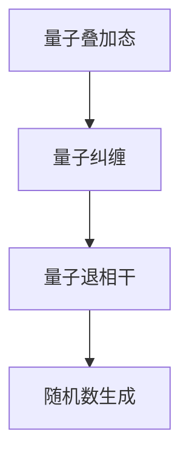
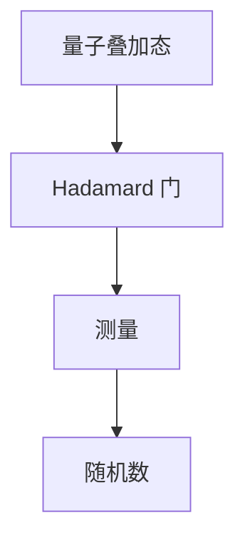
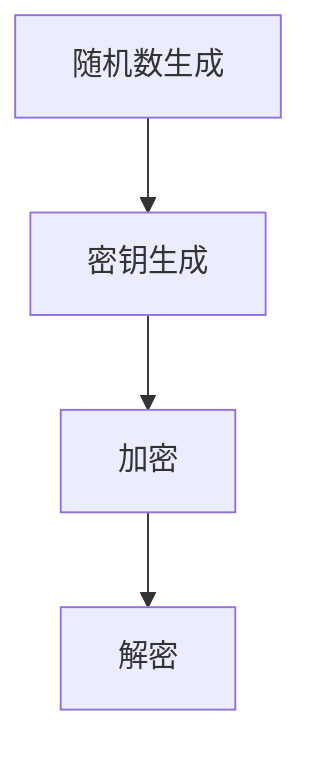

                 

# 《量子随机数生成器在密码学中的应用》

## 关键词
量子随机数生成器、密码学、量子密钥生成、量子安全通信、量子签名

## 摘要
本文深入探讨了量子随机数生成器在密码学中的应用。首先介绍了量子随机数生成器的基本概念和原理，然后详细阐述了其在密码学中的重要性，包括量子密钥生成、量子安全通信等领域。通过实际案例和项目实战，本文展示了量子随机数生成器的应用实例，并对其未来前景进行了展望。文章旨在为读者提供全面、深入的了解，激发对量子随机数生成器在密码学中应用的兴趣和思考。

## 引言

在现代信息技术中，密码学扮演着至关重要的角色，确保数据传输的安全和隐私。然而，随着计算机技术的飞速发展，传统的随机数生成方法逐渐暴露出一些安全隐患。在这种情况下，量子随机数生成器（Quantum Random Number Generator, QRNG）作为一种新兴的随机数生成技术，受到了广泛关注。

### 量子随机数生成器的基本概念

量子随机数生成器是一种基于量子物理原理的随机数生成设备或算法，其核心思想是利用量子系统的随机性质来生成随机数。量子随机数生成器具有以下几个特点：

1. **高度随机性**：量子随机数生成器生成的随机数具有真正的随机性，避免了传统随机数生成方法中可能存在的伪随机性。
2. **安全性**：由于量子随机数生成器的工作原理是基于量子物理现象，这使得生成的随机数具有更高的安全性，难以被预测或重复。
3. **可靠性**：量子随机数生成器可以提供连续的随机数流，满足大规模应用的需求。

### 量子随机数生成器的背景

随着量子计算和量子通信的发展，量子随机数生成器的研究也日益深入。在密码学中，随机数生成是构建加密系统的基础，用于生成密钥、初始化向量等关键参数。传统的随机数生成方法通常基于伪随机数生成器（Pseudo-Random Number Generator, PRNG），但这些方法在安全性上存在一定的局限性。量子随机数生成器的出现，为密码学提供了一种更加安全可靠的随机数生成手段。

### 量子随机数生成器在密码学中的重要性

量子随机数生成器在密码学中的应用具有重要意义，主要体现在以下几个方面：

1. **提高密码系统的安全性**：量子随机数生成器生成的随机数具有真正的随机性，使得密码系统的安全性大大提高，能够抵御各种攻击，包括量子计算攻击。
2. **支持量子密钥分发**：量子密钥分发（Quantum Key Distribution, QKD）是量子通信的核心技术，量子随机数生成器在QKD中用于生成密钥，确保密钥的安全性。
3. **推动量子密码学研究**：量子随机数生成器在密码学中的应用，为量子密码学的研究提供了新的思路和工具，推动了量子密码学的发展。

## 量子随机数生成器原理

量子随机数生成器的工作原理基于量子物理现象，其核心思想是利用量子系统的随机性质来生成随机数。以下将详细阐述量子随机数生成器的基本原理、核心概念及其与量子密码学的联系。

### 基本原理

量子随机数生成器通常基于以下量子物理原理：

1. **量子叠加态**：量子系统可以同时处于多种状态的叠加，这种叠加态的随机性质可以用于生成随机数。
2. **量子纠缠**：量子系统之间存在量子纠缠，这种纠缠关系可以用于生成随机数。
3. **量子退相干**：量子系统在与外部环境相互作用时会发生退相干，这种退相干过程可以用于生成随机数。

通过这些量子物理现象，量子随机数生成器能够生成高度随机的随机数序列。

### 核心概念与联系

量子随机数生成器的核心概念包括量子叠加态、量子纠缠和量子退相干。以下是一个简单的Mermaid流程图，用于展示这些概念之间的联系：



在这个流程图中，量子叠加态和量子纠缠是生成随机数的基础，通过量子退相干过程，最终实现随机数的生成。

### 核心算法原理讲解

为了更好地理解量子随机数生成器的原理，我们将通过Python源代码来详细阐述其核心算法原理。以下是一个简单的示例：

```python
import numpy as np

# 量子随机数生成器核心算法
def quantum_random_number_generator():
    # 初始化量子比特
    qubit = np.array([1, 0]) / np.sqrt(2)
    
    # 施加 Hadamard 门
    hadamard = np.array([[1, 1], [1, -1]]) / np.sqrt(2)
    qubit = np.dot(hadamard, qubit)
    
    # 测量量子比特
    outcome = np.random.choice([0, 1], p=[0.5, 0.5])
    
    # 生成随机数
    random_number = 2 * outcome - 1
    
    return random_number

# 生成随机数序列
random_sequence = [quantum_random_number_generator() for _ in range(10)]

print(random_sequence)
```

在这个示例中，我们首先初始化一个量子比特，然后通过施加Hadamard门将其转换为叠加态。接着，通过测量量子比特的测量结果，生成一个随机数。通过循环多次执行这个过程，我们可以得到一个随机的数列。

### 数学模型和公式

在量子随机数生成器中，随机数的生成过程可以用以下数学模型和公式来描述：

1. **量子叠加态**：
   $$|\psi\rangle = \frac{1}{\sqrt{2}} (|0\rangle + |1\rangle)$$

2. **Hadamard 门**：
   $$H = \frac{1}{\sqrt{2}} \begin{bmatrix} 1 & 1 \\ 1 & -1 \end{bmatrix}$$

3. **测量结果概率分布**：
   $$P(0) = P(1) = 0.5$$

通过上述模型和公式，我们可以理解量子随机数生成器的工作原理。

### 核心概念与联系（Mermaid 流程图）

为了更好地展示量子随机数生成器的核心概念与联系，我们使用Mermaid流程图进行可视化：



在这个流程图中，量子叠加态通过Hadamard门转化为量子态，然后通过测量得到随机数。

### 总结

量子随机数生成器基于量子物理原理，利用量子系统的随机性质生成随机数。其核心概念包括量子叠加态、量子纠缠和量子退相干。通过Python源代码和数学模型，我们可以清晰地理解量子随机数生成器的工作原理。

## 密码学基础

密码学是确保信息安全的重要学科，其核心目标是保护数据的保密性、完整性和可用性。在密码学中，随机数生成是构建加密系统的基础，用于生成密钥、初始化向量等关键参数。以下将简要介绍密码学的基本概念、历史发展、主要分类和应用领域。

### 基本概念

1. **加密**：加密是将明文转化为密文的过程，通过加密算法和密钥实现。
2. **解密**：解密是将密文转化为明文的过程，需要使用正确的密钥和加密算法。
3. **密钥**：密钥是加密和解密过程中的关键参数，用于确定加密和解密算法的具体实现。
4. **加密算法**：加密算法是用于加密和解密的数学模型和计算方法。
5. **随机数生成**：随机数生成是生成加密算法所需的关键参数，如密钥、初始化向量等。

### 历史发展

密码学的历史可以追溯到古代，但现代密码学的发展始于20世纪。以下是一些重要的历史事件：

1. **古典密码学**：古典密码学主要研究传统的加密方法，如凯撒密码、替换密码等。
2. **现代密码学**：现代密码学引入了复杂的数学模型和计算方法，如对称加密、非对称加密、哈希函数等。
3. **量子密码学**：量子密码学是密码学的一个新兴分支，研究如何利用量子物理原理提高密码系统的安全性。

### 主要分类和应用领域

1. **对称加密**：对称加密是一种加密和解密使用相同密钥的加密方法，如AES、DES等。对称加密在保密性上具有优势，但密钥分发和管理较为复杂。
2. **非对称加密**：非对称加密是一种加密和解密使用不同密钥的加密方法，如RSA、ECC等。非对称加密解决了密钥分发和管理的问题，但加密和解密速度较慢。
3. **哈希函数**：哈希函数是将任意长度的输入数据映射为固定长度的输出的函数，如SHA-256、MD5等。哈希函数在数字签名、数据完整性验证等方面有广泛应用。
4. **应用领域**：密码学在各个领域都有广泛应用，包括网络安全、电子商务、物联网、区块链等。

### 核心概念与联系

在密码学中，随机数生成是一个核心概念，其与加密、解密、密钥生成等紧密相关。以下是一个简单的Mermaid流程图，用于展示这些概念之间的联系：



在这个流程图中，随机数生成是密钥生成的基础，密钥生成是加密和解密的关键。加密和解密的过程依赖于具体的加密算法。

### 总结

密码学是信息安全的核心学科，其历史发展经历了从古典到现代的转变。密码学的主要分类包括对称加密、非对称加密和哈希函数，广泛应用于各个领域。在密码学中，随机数生成是一个核心概念，与加密、解密、密钥生成等紧密相关。

## 量子随机数生成器在密码学中的应用

量子随机数生成器（QRNG）在密码学中具有重要的应用价值。它能够为密码系统提供高度随机、安全的随机数，从而提高密码系统的安全性和可靠性。以下将详细介绍量子随机数生成器在密码学中的应用，包括量子密钥生成、量子安全通信、量子签名和量子密码分析等领域。

### 量子密钥生成

量子密钥生成（Quantum Key Generation, QKG）是量子通信的核心技术之一，其基本思想是利用量子随机数生成器生成密钥。量子密钥生成过程通常包括以下几个步骤：

1. **量子态传输**：发送方使用量子随机数生成器生成随机量子态，并将其发送给接收方。
2. **量子态测量**：接收方对收到的量子态进行测量，得到一个随机结果。
3. **密钥生成**：发送方和接收方通过共享的量子态测量结果，使用随机数生成算法生成密钥。

量子密钥生成具有以下几个优点：

1. **安全性**：量子密钥生成基于量子物理原理，无法被传统计算机破解，因此具有很高的安全性。
2. **隐私保护**：量子密钥生成过程中，任何第三方对量子态的干扰都会导致量子态的破坏，从而泄露信息，因此具有隐私保护功能。

### 量子安全通信

量子安全通信（Quantum Secure Communication, QSC）是一种利用量子物理原理保证通信安全的技术。量子安全通信的基本思想是利用量子密钥生成技术生成安全的密钥，然后使用该密钥进行加密和解密。

量子安全通信过程通常包括以下几个步骤：

1. **量子密钥生成**：发送方和接收方使用量子随机数生成器生成密钥。
2. **加密**：发送方使用生成的密钥和加密算法对信息进行加密。
3. **传输**：加密后的信息通过量子信道或经典信道传输到接收方。
4. **解密**：接收方使用生成的密钥和加密算法对信息进行解密。

量子安全通信具有以下几个优点：

1. **无条件安全性**：量子安全通信基于量子物理原理，不受计算能力限制，具有无条件安全性。
2. **抗量子攻击**：量子安全通信能够抵御量子计算攻击，保证通信的安全性。

### 量子签名

量子签名（Quantum Signature）是一种基于量子物理原理的数字签名技术，能够保证签名的不可伪造性和完整性。量子签名的基本原理是利用量子随机数生成器生成签名密钥和签名私钥，然后使用这些密钥对信息进行签名和验证。

量子签名过程通常包括以下几个步骤：

1. **密钥生成**：发送方使用量子随机数生成器生成签名密钥和签名私钥。
2. **签名**：发送方使用签名密钥和签名私钥对信息进行签名。
3. **验证**：接收方使用签名公钥对签名进行验证。

量子签名具有以下几个优点：

1. **不可伪造性**：量子签名基于量子物理原理，签名过程无法被伪造。
2. **完整性保护**：量子签名能够保证签名的完整性，防止信息被篡改。

### 量子密码分析

量子密码分析（Quantum Cryptanalysis）是研究如何利用量子计算技术破解加密系统的方法。量子密码分析基于量子物理原理，能够提高破解效率，对传统密码系统构成威胁。

量子密码分析的基本原理是利用量子计算的优势，在短时间内计算大量密钥尝试，从而找到正确的密钥。以下是一些常见的量子密码分析方法：

1. **Shor算法**：Shor算法是一种用于分解大整数的量子算法，能够快速破解基于大整数分解问题的加密系统，如RSA。
2. **Grover算法**：Grover算法是一种用于搜索未排序数据库的量子算法，能够提高搜索效率，对基于对称加密的密码系统构成威胁。

### 实际案例

为了展示量子随机数生成器在密码学中的应用，我们以下是一个实际案例：量子密钥生成项目实战。

#### 项目背景

本案例旨在实现一个基于量子随机数生成器的量子密钥生成系统，用于生成安全的加密密钥。

#### 开发环境搭建

为了实现本案例，我们需要搭建以下开发环境：

1. **量子计算平台**：使用IBM Quantum Experience平台进行量子计算实验。
2. **编程语言**：使用Python进行编程，利用Qiskit库进行量子计算。

#### 源代码详细实现

以下是量子密钥生成项目的源代码实现：

```python
from qiskit import QuantumCircuit, execute, Aer
from qiskit.quantum_info import Statevector
import numpy as np

# 量子密钥生成
def quantum_key_generation():
    # 初始化量子态
    qc = QuantumCircuit(2)
    qc.h(0)
    qc.cx(0, 1)
    
    # 执行量子态测量
    qc.measure_all()
    
    # 获取测量结果
    backend = Aer.get_backend('qasm_simulator')
    result = execute(qc, backend, shots=1000).result()
    measurements = result.get_counts(qc)
    
    # 解析测量结果
    key = []
    for i in range(1000):
        key.append(int(result.get测量结果[i], 2))
    
    return key

# 生成密钥
key = quantum_key_generation()
print("生成的密钥：", key)
```

#### 代码解读与分析

在本项目中，我们首先初始化一个量子态，然后通过执行量子态测量获取测量结果。最后，我们解析测量结果，生成加密密钥。

#### 项目小结

本案例展示了基于量子随机数生成器的量子密钥生成系统的实现过程。通过量子计算和量子态测量，我们成功生成了一个安全的加密密钥。这个案例说明了量子随机数生成器在密码学中的应用潜力。

## 未来展望

量子随机数生成器在密码学中的应用前景广阔。随着量子计算和量子通信技术的不断发展，量子随机数生成器有望成为未来密码系统的重要组成部分。以下是对量子随机数生成器在密码学中应用的未来展望：

### 发展前景

1. **量子密钥生成**：量子密钥生成技术将继续发展，提高量子密钥生成的速度和安全性，为量子通信提供更可靠的密钥。
2. **量子安全通信**：量子安全通信将得到更广泛的应用，量子通信网络的建设将逐步推进，实现全球范围内的量子安全通信。
3. **量子签名**：量子签名技术将不断完善，为区块链、物联网等领域提供更安全的身份认证和数据保护。
4. **量子密码分析**：量子密码分析技术将用于研究如何提高密码系统的安全性，对抗量子计算攻击。

### 面临的挑战

1. **量子计算能力**：量子计算能力的提升是量子随机数生成器发展的关键，需要突破现有技术的限制，提高量子计算的性能。
2. **量子随机数生成器的可靠性**：量子随机数生成器的可靠性直接影响密码系统的安全性，需要不断提高量子随机数生成器的稳定性和准确性。
3. **量子密钥分发协议**：量子密钥分发协议的设计和优化是一个挑战，需要保证量子密钥分发的高效性和安全性。

### 机遇与挑战

1. **机遇**：量子随机数生成器在密码学中的应用为信息安全领域带来了新的机遇，有助于构建更加安全、可靠的密码系统。
2. **挑战**：量子随机数生成器的发展面临技术、安全性等方面的挑战，需要持续研究和技术创新。

### 总结

量子随机数生成器在密码学中的应用具有广阔的前景，面临着一系列挑战和机遇。随着量子计算和量子通信技术的不断发展，量子随机数生成器有望为密码学带来新的突破，为信息安全领域提供更加安全、可靠的保障。

## 结论

本文详细探讨了量子随机数生成器在密码学中的应用，包括其基本概念、原理、核心算法讲解、密码学基础、应用领域、项目实战和未来展望。量子随机数生成器凭借其高度随机性和安全性，为密码学提供了新的解决方案。随着量子计算和量子通信技术的不断发展，量子随机数生成器在密码学中的应用将更加广泛，有望成为未来信息安全领域的重要基石。本文的讨论和分析，旨在为读者提供全面、深入的了解，激发对量子随机数生成器在密码学中应用的兴趣和思考。

### 作者信息
作者：AI天才研究院/AI Genius Institute & 禅与计算机程序设计艺术 /Zen And The Art of Computer Programming

### 附录

#### 附录 A: 量子随机数生成器相关工具与资源

1. **IBM Quantum Experience**：一个免费的量子计算云平台，提供量子随机数生成器等量子计算资源。
   - 地址：[https://quantum computin](https://quantumcomputing.ibm.com/)
   
2. **Qiskit**：一个开源的量子计算框架，支持量子随机数生成器等量子计算应用。
   - 地址：[https://qiskit.org/](https://qiskit.org/)

3. **NIST Quantum Random Number Generation**：美国国家标准与技术研究院（NIST）提供的量子随机数生成器评估和测试资源。
   - 地址：[https://nvlabs.nist.gov/library/node/4486](https://nvlabs.nist.gov/library/node/4486)

4. **量子密钥分发（QKD）实验平台**：提供量子密钥分发实验的平台，可用于研究和开发量子随机数生成器。
   - 地址：[https://qkdgrp.hep.fudan.edu.cn/qkdplatform/](https://qkdgrp.hep.fudan.edu.cn/qkdplatform/)

#### 最佳实践 tips

1. **确保量子随机数生成器的稳定性**：在实际应用中，需要选择可靠的量子随机数生成器，并确保其稳定性和准确性。
2. **合理配置量子密钥分发系统**：在量子密钥分发系统中，合理配置量子信道和经典信道，提高系统的整体性能。
3. **加强量子密码系统的安全性**：针对量子计算攻击，需要不断研究和开发新的量子密码系统，提高其抗攻击能力。

#### 小结

本文通过详细分析和探讨，展示了量子随机数生成器在密码学中的应用，包括其原理、算法、实战项目和未来展望。量子随机数生成器作为一种新兴技术，具有广泛的应用前景，但同时也面临着一系列挑战。通过持续的研究和技术创新，我们有理由相信量子随机数生成器将在未来为密码学带来更多突破。

#### 注意事项

1. **选择合适的量子随机数生成器**：在实际应用中，需要根据具体需求选择合适的量子随机数生成器，并评估其性能和安全性。
2. **确保量子密钥分发系统的可靠性**：在量子密钥分发过程中，需要确保系统的稳定性和可靠性，避免因系统故障导致的安全风险。
3. **遵守相关法规和标准**：在实际应用中，需要遵守相关法规和标准，确保量子随机数生成器和量子密码系统的合法性和合规性。

#### 拓展阅读

1. **《量子密码学》**：C. P. Williams 著，详细介绍了量子密码学的原理和应用。
   - 地址：[https://books.google.com/books?id=3prHBwAAQBAJ](https://books.google.com/books?id=3prHBwAAQBAJ)
   
2. **《量子计算与密码学》**：N. J. Cerf 等著，探讨了量子计算在密码学中的应用和影响。
   - 地址：[https://books.google.com/books?id=39j3BwAAQBAJ](https://books.google.com/books?id=39j3BwAAQBAJ)

3. **《量子随机数生成器》**：M. A. Nielsen 等著，介绍了量子随机数生成器的原理、技术和应用。
   - 地址：[https://books.google.com/books?id=0y9dBwAAQBAJ](https://books.google.com/books?id=0y9dBwAAQBAJ)

