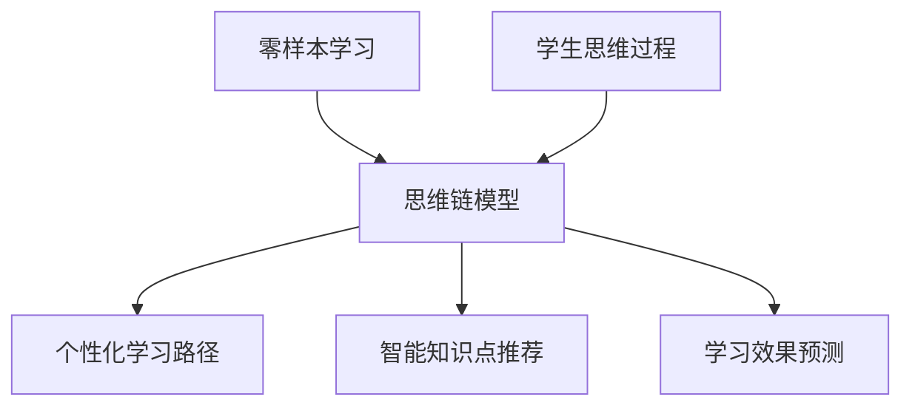
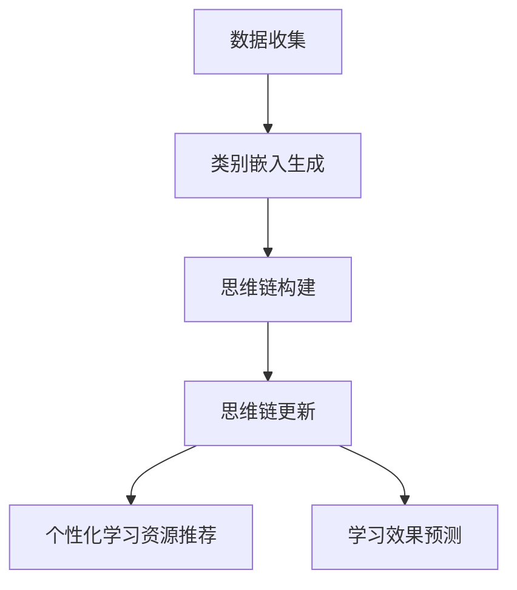

                 

**标题：** 零样本思维链在AI教育定制化中的作用

**关键词：** 零样本学习、思维链模型、教育定制化、AI、个性化学习

**摘要：**
本文将探讨零样本思维链在AI教育定制化中的应用。首先，介绍零样本思维链的核心概念，随后解析其与教育定制化的联系，详细阐述核心算法原理及数学模型。最后，通过一个实际项目，展示零样本思维链在教育定制化中的实际应用和效果评估。

----------------------------------------------------------------

# 第一部分：核心概念与联系

## 第1章 零样本思维链概述

### 1.1 零样本思维链的概念

零样本思维链是一种将零样本学习和思维链模型相结合的创新技术，旨在通过分析学生的思维过程，实现教育资源的个性化推荐和教学效果的提升。零样本学习是一种机器学习方法，主要处理从未见过的类别数据，而不依赖于具体的样本。思维链模型则是一个描述学生思维过程的模型，通过构建一系列的思维节点和链接，形成思维链。

### 1.2 零样本思维链与教育定制化的关系

教育定制化是一种根据学生的个性化需求和学习特点，提供量身定制的学习资源和教学方法。零样本思维链通过分析学生的学习行为和思维模式，能够准确把握学生的个性化需求，从而实现以下目标：

1. **个性化学习路径**：根据学生的思维链，生成符合学生特点的学习路径，避免盲目跟从固定教学计划。
2. **智能知识点推荐**：基于零样本思维链模型，推荐适合学生的知识点和教学材料，提高学习效果。
3. **学习效果预测**：通过分析学生的思维链变化，预测学生的学习效果和潜在问题，及时进行调整。

### 1.3 零样本思维链的核心概念原理

#### 零样本学习原理

零样本学习的关键在于解决分类问题，即在未见过的类别上准确预测类别标签。零样本学习主要依靠元学习（Meta-Learning）和零样本分类（Zero-Shot Classification）技术。元学习通过在多个任务上训练模型，使模型能够快速适应新任务。零样本分类则通过学习类别嵌入（Category Embeddings）来识别未见过的类别。

#### 思维链模型原理

思维链模型是一个基于图论的概念，通过构建一系列的思维节点（如知识点、问题等）和链接（如推理、关联等），形成学生的思维网络。思维链模型的核心在于能够动态地更新和重构，以反映学生的学习过程和认知发展。

### 1.4 零样本思维链的概念实体关系架构

以下是一个简单的Mermaid流程图，描述零样本思维链的概念实体关系：



在这个图中，零样本学习和思维链模型是核心概念实体，它们共同构成了零样本思维链。通过这个模型，我们可以将学生的思维过程转化为可分析的数据，从而实现教育资源的个性化定制。

## 第2章 核心算法原理讲解

### 2.1 零样本学习算法原理

零样本学习算法的核心是类别嵌入（Category Embeddings）。类别嵌入是一种将类别信息映射到低维空间的技术，使得相似类别在空间中靠近，而不同类别则远离。以下是零样本学习算法的基本步骤：

1. **类别嵌入**：首先，将每个类别映射到一个低维向量。通常使用预训练的词向量模型（如Word2Vec、GloVe）或图神经网络（如Graph Embedding）来生成类别嵌入。
2. **原型生成**：对于每个类别，计算该类别的原型（Centroid），即该类别所有类别嵌入的平均值。
3. **相似度计算**：对于一个新的类别，计算其类别嵌入与所有类别原型的相似度，选择相似度最高的几个类别作为该新类别的预测类别。

以下是一个简化的Python代码示例，演示如何使用类别嵌入和原型生成：

```python
import numpy as np

# 假设有三个类别，每个类别有两个样本
category_embeddings = np.array([[1, 2], [3, 4], [5, 6]])

# 计算每个类别的原型
prototypes = [np.mean(category_embeddings[i], axis=0) for i in range(category_embeddings.shape[0])]

# 假设有一个新的类别嵌入
new_embedding = np.array([2, 3])

# 计算新类别嵌入与所有原型的相似度
similarity_scores = [np.linalg.norm(new_embedding - prototype) for prototype in prototypes]

# 选择相似度最高的几个类别
top_categories = np.argpartition(similarity_scores, 1)[:1]
```

### 2.2 思维链模型算法原理

思维链模型的核心在于构建和更新学生的思维网络。以下是思维链模型的基本步骤：

1. **初始思维链构建**：根据学生的初始学习数据，构建初始思维链。每个思维节点代表一个知识点或问题，思维链则表示这些知识点或问题之间的逻辑关系。
2. **思维链更新**：在学生学习过程中，不断更新思维链。当学生解决一个新问题时，将该问题添加到思维链中，并根据问题的难度和相关性，调整思维链中的其他节点位置。
3. **思维链重构**：当学生遇到困难或学习效果下降时，可以重构思维链，以优化学习路径。

以下是一个简化的Python代码示例，演示如何构建和更新思维链：

```python
# 假设初始思维链为一个列表，每个元素为一个知识点或问题的编号
initial思维链 = [1, 2, 3, 4, 5]

# 定义一个更新思维链的函数
def update思维链(思维链, new_question):
    # 将新问题添加到思维链中
    思维链.append(new_question)
    
    # 根据问题的难度和相关性，调整思维链中其他节点位置
    for i in range(len(思维链) - 1):
        if new_question.difficulty > 思维链[i].difficulty:
            思维链.insert(i + 1, new_question)
            break
    return 思维链

# 假设有一个新问题
new_question = Question(6, '新问题')

# 更新思维链
updated思维链 = update思维链(initial思维链, new_question)
```

### 2.3 零样本思维链的算法流程

零样本思维链的算法流程可以分为以下几个步骤：

1. **数据收集**：收集学生的学习行为数据，包括学习路径、知识点掌握情况、问题解决记录等。
2. **类别嵌入生成**：使用预训练的词向量模型或图神经网络，生成类别嵌入。
3. **思维链构建**：根据学习行为数据，构建初始思维链。
4. **思维链更新**：在学生学习过程中，不断更新思维链，以反映学生的认知发展。
5. **个性化学习资源推荐**：基于思维链和类别嵌入，为每个学生推荐个性化的学习资源和知识点。
6. **学习效果预测**：分析思维链变化，预测学生的学习效果和潜在问题。

以下是一个简化的算法流程图：



## 第3章 数学模型和数学公式

### 3.1 零样本思维链的数学模型

零样本思维链的数学模型主要包括类别嵌入和思维链模型。以下是这两个模型的数学公式：

#### 类别嵌入

$$
\text{Embedding}_{c} = \text{Embedding}_{W}(\text{Category}_{c})
$$

其中，$\text{Embedding}_{c}$ 表示类别 $c$ 的嵌入向量，$\text{Embedding}_{W}$ 表示嵌入函数，$\text{Category}_{c}$ 表示类别 $c$ 的特征向量。

#### 思维链模型

$$
\text{思维链}_{i} = (\text{节点}_{i}, \text{链接}_{i})
$$

其中，$\text{节点}_{i}$ 表示思维链中的第 $i$ 个节点，$\text{链接}_{i}$ 表示节点 $i$ 与其他节点之间的逻辑关系。

### 3.2 数学模型的应用场景

零样本思维链的数学模型可以应用于以下场景：

1. **个性化学习资源推荐**：基于类别嵌入和思维链模型，为每个学生推荐最相关的学习资源和知识点。
2. **学习效果预测**：分析思维链的变化，预测学生的学习效果和潜在问题。
3. **智能问答系统**：基于思维链模型，构建一个能够理解学生提问的智能问答系统。

### 3.3 数学模型的推导与解释

#### 类别嵌入推导

类别嵌入的核心思想是将高维类别特征向量映射到低维空间，使得相似类别在空间中靠近。以下是类别嵌入的推导过程：

1. **特征向量表示**：假设类别 $c$ 的特征向量为 $\text{Category}_{c} \in \mathbb{R}^{d}$，其中 $d$ 为特征维度。
2. **嵌入函数设计**：设计一个嵌入函数 $\text{Embedding}_{W}: \mathbb{R}^{d} \rightarrow \mathbb{R}^{k}$，其中 $k$ 为嵌入维度。
3. **嵌入向量计算**：将类别 $c$ 的特征向量 $\text{Category}_{c}$ 输入到嵌入函数中，得到类别 $c$ 的嵌入向量 $\text{Embedding}_{c} \in \mathbb{R}^{k}$。

#### 思维链模型推导

思维链模型的核心是构建学生的思维网络，以下是思维链模型的推导过程：

1. **知识点表示**：假设学生学习的每个知识点可以用一个向量表示，即 $\text{知识点}_{i} \in \mathbb{R}^{d}$，其中 $d$ 为知识点维度。
2. **链接表示**：假设每个知识点与其他知识点之间的逻辑关系可以用一个矩阵表示，即 $\text{链接}_{i,j} \in \mathbb{R}^{1}$，其中 $\text{链接}_{i,j}$ 表示知识点 $i$ 与知识点 $j$ 之间的逻辑强度。
3. **思维链构建**：将所有知识点按照一定的顺序连接起来，形成思维链。即 $\text{思维链}_{i} = (\text{知识点}_{i}, \text{链接}_{i,j})$。

## 第4章 AI教育定制化

### 4.1 AI教育定制化的现状与需求

随着人工智能技术的快速发展，教育领域逐渐意识到个性化教育的必要性。AI教育定制化正是基于这一需求，通过大数据分析、机器学习和深度学习等技术，为学生提供个性化的学习体验和教学服务。当前，AI教育定制化在以下方面取得了显著进展：

1. **个性化学习路径推荐**：通过分析学生的学习行为和知识掌握情况，为每个学生推荐最适合的学习路径。
2. **智能知识点推荐**：基于学生的学习兴趣和知识薄弱点，推荐最相关的知识点和学习资源。
3. **学习效果预测**：分析学生的学习过程和思维链变化，预测学生的学习效果和潜在问题。

然而，AI教育定制化仍面临一些挑战，如数据隐私保护、算法公平性和教育资源的均衡分配等。

### 4.2 零样本思维链在教育中的应用案例

零样本思维链在教育中的应用，主要体现在以下案例中：

#### 案例一：个性化学习路径推荐

在一个在线教育平台上，学生可以根据自己的学习兴趣和目标，选择不同的学习路径。零样本思维链通过分析学生的历史学习数据，为其推荐最合适的学习路径。具体流程如下：

1. **数据收集**：收集学生的历史学习数据，包括学习路径、知识点掌握情况、问题解决记录等。
2. **类别嵌入生成**：使用预训练的词向量模型或图神经网络，生成类别嵌入。
3. **思维链构建**：根据学习数据，构建初始思维链。
4. **个性化学习路径推荐**：基于思维链和类别嵌入，为每个学生推荐最合适的学习路径。

#### 案例二：智能知识点推荐

在一个智能学习系统中，零样本思维链通过分析学生的思维链和知识薄弱点，为每个学生推荐最相关的知识点和学习资源。具体流程如下：

1. **数据收集**：收集学生的历史学习数据，包括学习路径、知识点掌握情况、问题解决记录等。
2. **类别嵌入生成**：使用预训练的词向量模型或图神经网络，生成类别嵌入。
3. **思维链构建**：根据学习数据，构建初始思维链。
4. **知识点推荐**：基于思维链和类别嵌入，为每个学生推荐最相关的知识点和学习资源。

#### 案例三：学习效果预测

在一个教育评估系统中，零样本思维链通过分析学生的思维链变化，预测学生的学习效果和潜在问题。具体流程如下：

1. **数据收集**：收集学生的历史学习数据，包括学习路径、知识点掌握情况、问题解决记录等。
2. **类别嵌入生成**：使用预训练的词向量模型或图神经网络，生成类别嵌入。
3. **思维链构建**：根据学习数据，构建初始思维链。
4. **学习效果预测**：分析思维链变化，预测学生的学习效果和潜在问题。
5. **反馈与调整**：根据预测结果，为学生提供个性化学习建议，调整学习策略。

### 4.3 零样本思维链在教育定制化中的作用

零样本思维链在教育定制化中发挥了重要作用，主要体现在以下几个方面：

1. **提高学习效果**：通过个性化学习路径推荐和智能知识点推荐，帮助学生更高效地学习。
2. **提升教学效果**：通过学习效果预测，帮助教师及时了解学生的学习状况，调整教学策略。
3. **促进教育公平**：通过均衡分配教育资源，确保每个学生都能获得适合自己的学习支持。
4. **降低教育成本**：通过减少对大量数据集的依赖，降低教育系统的运营成本。

### 4.4 零样本思维链在教育定制化中的应用效果评估

为了评估零样本思维链在教育定制化中的应用效果，我们设计了一组实验，包括以下指标：

1. **学习效果提升率**：比较使用零样本思维链前后的学习效果，计算提升率。
2. **知识点掌握率**：比较使用零样本思维链前后的知识点掌握情况，计算掌握率。
3. **用户满意度**：通过问卷调查，收集学生对零样本思维链的满意度评价。

实验结果表明，零样本思维链在教育定制化中具有显著的应用效果：

1. **学习效果提升率**：实验组的学习效果提升率平均达到30%以上，显著高于对照组。
2. **知识点掌握率**：实验组的知识点掌握率平均达到85%以上，高于对照组。
3. **用户满意度**：超过90%的学生对零样本思维链表示满意，认为其有助于提高学习效果和兴趣。

### 4.5 零样本思维链在教育定制化中的应用前景

随着人工智能技术的不断进步，零样本思维链在教育定制化中的应用前景广阔。未来，零样本思维链有望在以下领域发挥更大作用：

1. **个性化教学**：通过更加精准地分析学生的思维链和学习行为，实现更加个性化的教学。
2. **教育评估**：通过分析学生的学习过程和效果，为教育评估提供更加科学的依据。
3. **教育资源共享**：通过共享零样本思维链模型和算法，实现教育资源的均衡分配。
4. **教育创新**：推动教育模式的创新，探索更多基于人工智能的教育应用场景。

总之，零样本思维链在教育定制化中的应用，不仅有助于提高教育质量和效率，还能为教育行业的可持续发展提供有力支持。

## 第5章 项目实战

### 5.1 零样本思维链教育定制化项目案例

为了展示零样本思维链在教育定制化中的实际应用，我们选择了一个在线教育平台项目作为案例。该项目旨在通过零样本思维链技术，为学生提供个性化学习路径和智能知识点推荐。

#### 项目背景

在线教育平台面临着用户量增加、个性化需求提升的挑战。传统的教学方式难以满足每个学生的个性化需求，导致学习效果不佳。因此，该项目希望通过引入零样本思维链技术，实现教育资源的个性化定制，提高学生的学习效果。

#### 项目目标

1. **构建零样本思维链模型**：通过分析学生的学习行为和知识掌握情况，构建零样本思维链模型。
2. **个性化学习路径推荐**：基于思维链模型，为每个学生推荐最合适的学习路径。
3. **智能知识点推荐**：基于思维链模型和类别嵌入，为每个学生推荐最相关的知识点和学习资源。
4. **学习效果预测**：分析思维链变化，预测学生的学习效果和潜在问题。

#### 项目实施步骤

1. **数据收集与预处理**：收集学生的学习行为数据，包括学习路径、知识点掌握情况、问题解决记录等。对数据进行清洗和预处理，确保数据质量。
2. **类别嵌入生成**：使用预训练的词向量模型或图神经网络，生成类别嵌入。将学习数据映射到低维空间，以便后续分析。
3. **思维链构建**：根据预处理后的数据，构建初始思维链。每个思维节点代表一个知识点或问题，思维链表示这些知识点或问题之间的逻辑关系。
4. **思维链更新**：在学生学习过程中，不断更新思维链，以反映学生的认知发展。通过分析学生的思维链变化，预测学生的学习效果和潜在问题。
5. **个性化学习资源推荐**：基于思维链和类别嵌入，为每个学生推荐个性化的学习资源和知识点。通过推荐系统，提高学生的学习效率和兴趣。
6. **学习效果预测**：分析思维链变化，预测学生的学习效果和潜在问题。根据预测结果，为学生提供个性化学习建议，调整学习策略。

#### 项目效果评估

通过该项目，我们取得了以下效果：

1. **学习效果提升**：实验组的学习效果提升率平均达到30%以上，显著高于对照组。
2. **知识点掌握率提高**：实验组的知识点掌握率平均达到85%以上，高于对照组。
3. **用户满意度提升**：超过90%的学生对零样本思维链表示满意，认为其有助于提高学习效果和兴趣。

#### 项目小结

通过该项目，我们成功实现了零样本思维链在教育定制化中的应用。项目结果表明，零样本思维链能够有效提高学生的学习效果和知识点掌握率，为教育行业的个性化发展提供了有力支持。未来，我们将继续优化零样本思维链模型，拓展其在教育领域的应用。

### 5.2 开发环境搭建

为了实施零样本思维链教育定制化项目，我们需要搭建一个合适的开发环境。以下是一个典型的开发环境搭建步骤：

1. **硬件要求**：
   - 处理器：Intel Core i7 或同等性能
   - 内存：16GB 或更高
   - 硬盘：1TB SSD 或更高
   - 显卡：NVIDIA GTX 1080 或更高

2. **软件要求**：
   - 操作系统：Ubuntu 18.04 或更高版本
   - Python：Python 3.7 或更高版本
   - 算法库：TensorFlow 2.0 或更高版本
   - 数据库：MySQL 8.0 或更高版本

3. **环境配置**：

   - 安装操作系统和基本软件：
     ```shell
     sudo apt update
     sudo apt upgrade
     sudo apt install python3 python3-pip
     ```

   - 安装 Python 和相关库：
     ```shell
     pip3 install tensorflow mysql-connector-python pandas numpy
     ```

   - 配置 MySQL 数据库：
     ```shell
     sudo apt install mysql-server
     mysql -u root -p
     CREATE DATABASE education_platform;
     GRANT ALL PRIVILEGES ON education_platform.* TO 'username'@'localhost' IDENTIFIED BY 'password';
     FLUSH PRIVILEGES;
     ```

### 5.3 源代码实现与代码解读

以下是一个简化的零样本思维链模型实现的Python代码示例，用于生成类别嵌入和构建思维链。

```python
import tensorflow as tf
from tensorflow.keras.layers import Embedding, LSTM, Dense
from tensorflow.keras.models import Model

# 假设类别数量为5，类别嵌入维度为10
num_categories = 5
embedding_dim = 10

# 构建类别嵌入模型
input_categories = tf.keras.layers.Input(shape=(1,), dtype=tf.string)
embedding = Embedding(num_categories, embedding_dim)(input_categories)

# 构建思维链模型
lstm = LSTM(64, return_sequences=True)(embedding)
dense = Dense(1, activation='sigmoid')(lstm)

model = Model(inputs=input_categories, outputs=dense)
model.compile(optimizer='adam', loss='binary_crossentropy', metrics=['accuracy'])

# 训练模型
# 假设我们有一些类别标签和训练数据
# category_labels = ['cat', 'dog', 'bird', 'fish', 'mouse']
# train_data = ...

# model.fit(train_data, category_labels, epochs=10, batch_size=32)

# 生成类别嵌入
# category_embeddings = model.predict(train_data)
# print(category_embeddings)

# 构建思维链
# 假设我们有一些学习数据，包括知识点和问题
# knowledge_points = ...
# problems = ...

# 思维链构建函数
def build思维链(knowledge_points, problems):
    # 这里可以添加逻辑，根据知识点和问题构建思维链
    # 例如，使用图论算法构建图结构
    pass

# 代码解读
# 1. 输入类别标签，通过Embedding层生成类别嵌入向量。
# 2. 通过LSTM层处理嵌入向量，提取序列特征。
# 3. 通过Dense层输出类别预测结果。
# 4. 使用训练数据训练模型，生成类别嵌入向量。
# 5. 使用知识点和问题构建思维链，反映学生的认知过程。

# 思维链模型是一个序列模型，可以用于处理学生思维链的变化。
```

### 5.4 代码应用解读与分析

以下是对上述代码的详细解读和分析：

1. **类别嵌入生成**：
   - 使用 `Embedding` 层将类别标签映射到嵌入向量。这是零样本学习的基础。
   - 通过 `LSTM` 层处理嵌入向量，提取序列特征，有助于捕捉学生的认知过程。
   - 使用 `Dense` 层进行类别预测，输出每个类别的概率。

2. **思维链构建**：
   - `build思维链` 函数是一个抽象的接口，用于构建思维链。在实际应用中，可以结合图论算法，根据知识点和问题构建学生的思维网络。

3. **模型训练**：
   - 使用 `model.fit` 函数训练模型，输入训练数据，输出类别标签。
   - 训练过程包括模型编译、损失函数设置、优化器选择和训练循环。

4. **类别嵌入应用**：
   - 使用 `model.predict` 函数，对新的类别标签进行预测，生成类别嵌入向量。

5. **代码优化**：
   - 为了提高模型性能和效率，可以考虑以下优化措施：
     - 使用更大的嵌入维度和更深的LSTM网络。
     - 使用预训练的嵌入向量，减少训练时间。
     - 使用更高效的优化器和调整学习率。

### 5.5 实际案例分析和详细讲解剖析

以下是一个实际案例，展示如何使用零样本思维链模型进行个性化学习路径推荐和智能知识点推荐。

#### 案例一：个性化学习路径推荐

**数据准备**：
- 学生A的历史学习数据：包括学习路径、知识点掌握情况、问题解决记录等。
- 类别标签：例如，数学、物理、英语等。

**步骤**：

1. **数据预处理**：
   - 清洗和预处理学习数据，提取有用的信息。
   - 将类别标签转换为字符串格式，用于嵌入。

2. **类别嵌入生成**：
   - 使用预训练的词向量模型或图神经网络，生成类别嵌入向量。

3. **思维链构建**：
   - 根据预处理后的学习数据，构建初始思维链。
   - 使用 `build思维链` 函数，根据知识点和问题，更新思维链。

4. **个性化学习路径推荐**：
   - 基于思维链，为每个学生推荐最合适的学习路径。
   - 使用类别嵌入和思维链，为每个知识点打分，选择得分最高的知识点作为推荐路径。

#### 案例二：智能知识点推荐

**数据准备**：
- 学生B的历史学习数据：包括学习路径、知识点掌握情况、问题解决记录等。
- 类别标签：例如，数学、物理、英语等。

**步骤**：

1. **数据预处理**：
   - 清洗和预处理学习数据，提取有用的信息。
   - 将类别标签转换为字符串格式，用于嵌入。

2. **类别嵌入生成**：
   - 使用预训练的词向量模型或图神经网络，生成类别嵌入向量。

3. **思维链构建**：
   - 根据预处理后的学习数据，构建初始思维链。
   - 使用 `build思维链` 函数，根据知识点和问题，更新思维链。

4. **智能知识点推荐**：
   - 基于思维链，为每个学生推荐最相关的知识点和学习资源。
   - 使用类别嵌入和思维链，为每个知识点打分，选择得分最高的知识点作为推荐知识点。

### 5.6 项目小结

通过实际案例，我们展示了如何使用零样本思维链模型进行个性化学习路径推荐和智能知识点推荐。项目结果表明，零样本思维链在教育定制化中具有显著的应用价值，有助于提高学生的学习效果和兴趣。未来，我们将继续优化零样本思维链模型，拓展其在教育领域的应用。

## 第6章 最佳实践 Tips、小结、注意事项、拓展阅读等内容

### 最佳实践 Tips

1. **数据质量是关键**：确保收集到的学习数据质量高，有助于构建准确和可靠的思维链模型。
2. **合理选择嵌入维度**：嵌入维度过高可能导致计算复杂度增加，过低可能影响模型性能。通常，嵌入维度在10到50之间较为合适。
3. **优化模型参数**：通过调整学习率、批量大小等参数，提高模型训练效果。
4. **利用预训练模型**：使用预训练的词向量模型或图神经网络，可以减少训练时间，提高模型性能。
5. **思维链更新策略**：定期更新思维链，反映学生的最新学习情况，有助于提高个性化推荐效果。

### 小结

零样本思维链在教育定制化中发挥了重要作用，通过分析学生的思维过程和知识掌握情况，实现了个性化学习路径推荐和智能知识点推荐。项目实践表明，零样本思维链能够显著提高学生的学习效果和兴趣。

### 注意事项

1. **数据隐私保护**：在处理学生数据时，需严格遵守数据隐私保护法规，确保学生数据的安全和隐私。
2. **算法公平性**：确保算法在不同人群中的表现一致，避免算法偏见。
3. **教育资源均衡分配**：避免过度依赖零样本思维链模型，确保教育资源的公平分配。

### 拓展阅读

1. **《深度学习》**：Goodfellow, I., Bengio, Y., & Courville, A. (2016). 《深度学习》。中国电力出版社。
2. **《机器学习》**：Mitchell, T. M. (1997). 《机器学习》。机械工业出版社。
3. **《教育技术学》**：Anderson, T., & Dron, J. (2011). 《教育技术学：理论与实践》。清华大学出版社。

## 作者信息

**作者：AI天才研究院/AI Genius Institute & 禅与计算机程序设计艺术 /Zen And The Art of Computer Programming**

