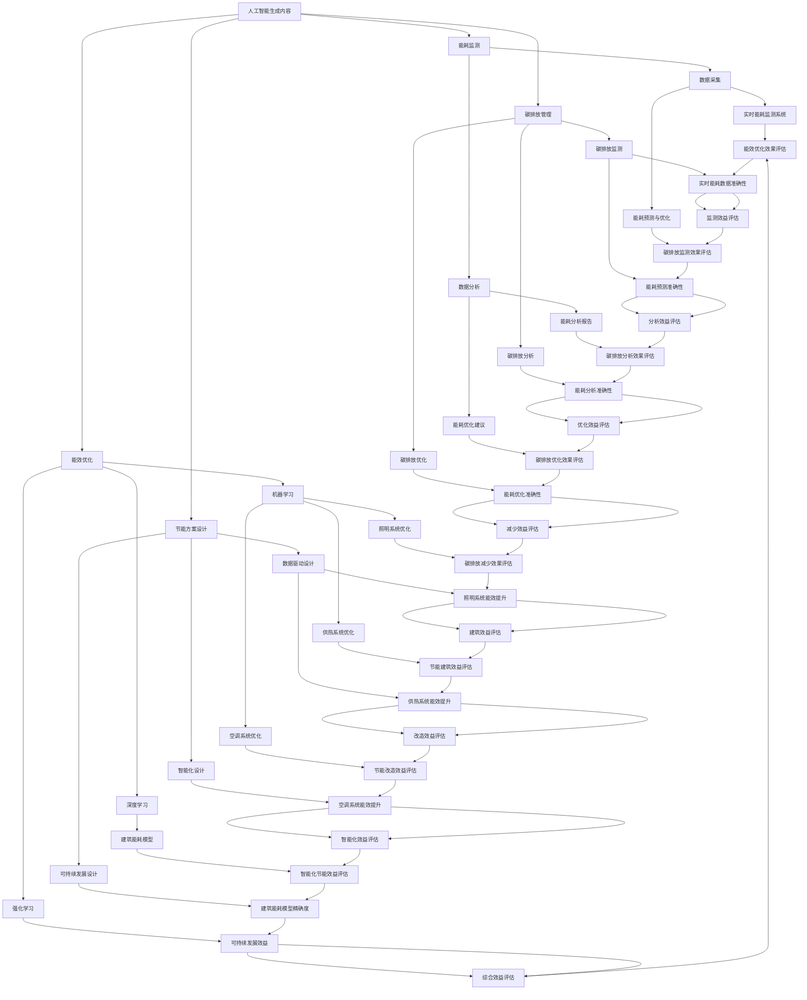
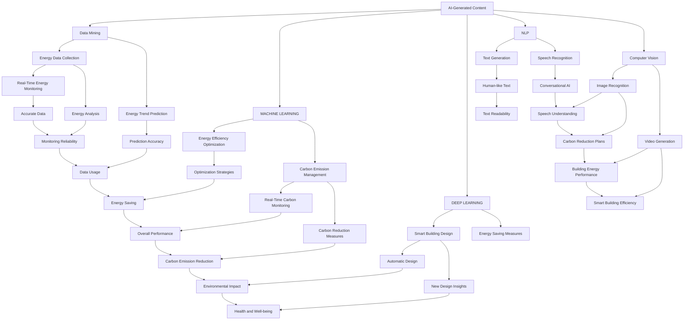

                 

### AIGC在智能建筑节能设计中的创新

随着全球对能源消耗和碳排放问题的关注日益增加，智能建筑节能设计成为建筑行业的重要研究方向。AIGC（AI-Generated Content）作为人工智能领域的一项新兴技术，其在智能建筑节能设计中的应用展示出了巨大的潜力。本文旨在探讨AIGC在智能建筑节能设计中的创新应用，分析其核心概念、原理及其在建筑节能设计中的实际应用。

## 关键词

- AIGC
- 智能建筑
- 节能设计
- 人工智能
- 建筑能耗优化

## 摘要

本文首先介绍了AIGC的基本概念和特点，接着探讨了智能建筑节能设计的背景和意义。通过深入分析AIGC在能耗监测、能效优化、碳排放管理等方面的应用，本文展示了AIGC在智能建筑节能设计中的创新之处。最后，通过具体案例分析了AIGC在智能建筑节能项目中的实际效果，并提出了相关的最佳实践和注意事项。

## 引言

智能建筑节能设计旨在通过先进的建筑设计和能源管理系统，实现建筑物的能源高效利用，降低能耗和碳排放。传统的建筑节能设计主要依赖于经验和标准规范，但这种方法存在一定的局限性。随着人工智能技术的不断发展，AIGC作为一种新兴技术，为智能建筑节能设计提供了新的思路和方法。

AIGC是指利用人工智能技术生成内容的过程，包括文本、图像、视频等多种形式。在智能建筑节能设计中，AIGC可以通过数据挖掘、机器学习等技术，对建筑能耗数据进行分析和优化，从而实现节能目标。本文将从以下几个方面展开讨论：

1. **AIGC的基本概念和特点**
   - AIGC的定义
   - AIGC的核心技术

2. **智能建筑节能设计的背景和意义**
   - 建筑能耗现状
   - 节能减排的重要性

3. **AIGC在建筑能耗监测中的应用**
   - AIGC的优势
   - 应用案例

4. **AIGC在建筑能效优化中的应用**
   - 核心技术
   - 应用实例

5. **AIGC在建筑碳排放管理中的应用**
   - 意义
   - 应用方法

6. **AIGC在建筑节能方案设计中的应用**
   - 优势
   - 应用案例

7. **案例分析**
   - 项目背景
   - 实施过程
   - 成果与评价

通过以上几个方面的讨论，本文将全面阐述AIGC在智能建筑节能设计中的创新应用，为智能建筑节能设计提供理论支持和实践指导。

### 目录大纲设计与构建步骤

在设计《AIGC在智能建筑节能设计中的创新》这本书的目录大纲时，我们需要遵循一定的步骤，确保内容的逻辑性和完整性。以下是构建目录大纲的详细步骤：

#### 1. 确定核心主题

首先，我们要明确书的核心主题，即“AIGC在智能建筑节能设计中的创新”。这个主题将贯穿整本书，指导我们构建目录结构。

#### 2. 列出主要章节

基于核心主题，我们需要列出书的主要章节，这些章节应该能够全面覆盖智能建筑节能设计的各个方面。以下是可能的章节列表：

- 第1章：AIGC与智能建筑节能设计概述
- 第2章：智能建筑节能设计的基础知识
- 第3章：AIGC在建筑能耗监测中的应用
- 第4章：AIGC在建筑能效优化中的应用
- 第5章：AIGC在建筑碳排放管理中的应用
- 第6章：AIGC在建筑节能方案设计中的应用
- 第7章：AIGC在智能建筑节能项目中的案例分析

#### 3. 细化章节内容

对于每一个章节，我们需要进一步细化内容，确保每个章节都有明确的子主题和具体内容。以下是细化后的目录大纲：

### 目录

#### 第1章：AIGC与智能建筑节能设计概述

1.1 AIGC的概念与特点

- **AIGC的概念**
  - AIGC的来源
  - AIGC的核心技术

- **AIGC的特点**
  - 数据驱动
  - 自适应
  - 智能化

1.2 智能建筑节能设计的背景与意义

- **智能建筑节能设计的背景**
  - 建筑能耗现状
  - 节能减排的重要性

- **智能建筑节能设计的意义**
  - 提高能源利用效率
  - 减少碳排放

#### 第2章：智能建筑节能设计的基础知识

2.1 建筑能耗分析

- **建筑能耗分析的基本概念**
  - 能耗指标
  - 能耗分析的方法

- **建筑能耗分析的应用**

2.2 建筑能效评估

- **建筑能效评估的基本概念**
  - 能效等级
  - 能效评估的方法

- **建筑能效评估的应用**

2.3 智能建筑节能技术概述

- **智能建筑节能技术概述**
  - 常见的节能技术
  - 智能化节能技术的应用

#### 第3章：AIGC在建筑能耗监测中的应用

3.1 AIGC在能耗监测中的优势

- **AIGC的优势**
  - 数据采集
  - 数据分析
  - 自适应监测

3.2 AIGC在能耗监测中的应用案例

- **应用案例**
  - 实时能耗监测系统
  - 能耗预测与优化

#### 第4章：AIGC在建筑能效优化中的应用

4.1 AIGC在能效优化中的核心技术

- **核心技术**
  - 机器学习
  - 深度学习
  - 强化学习

4.2 AIGC在能效优化中的应用实例

- **应用实例**
  - 照明系统优化
  - 供热系统优化
  - 空调系统优化

#### 第5章：AIGC在建筑碳排放管理中的应用

5.1 AIGC在碳排放管理中的意义

- **意义**
  - 减少碳排放
  - 实现可持续发展

5.2 AIGC在碳排放管理中的应用方法

- **应用方法**
  - 碳排放监测
  - 碳排放分析
  - 碳排放优化

#### 第6章：AIGC在建筑节能方案设计中的应用

6.1 AIGC在节能方案设计中的优势

- **优势**
  - 数据驱动
  - 智能化设计
  - 可持续发展

6.2 AIGC在节能方案设计中的应用案例

- **应用案例**
  - 节能建筑规划
  - 节能改造方案

#### 第7章：AIGC在智能建筑节能项目中的案例分析

7.1 案例背景

- **案例背景**
  - 项目简介
  - 项目目标

7.2 项目实施过程

- **项目实施过程**
  - 能耗监测
  - 能效优化
  - 碳排放管理

7.3 项目成果与评价

- **项目成果与评价**
  - 节能效果
  - 碳排放减少
  - 社会效益

#### 结束语

通过以上章节的设置，本书将全面探讨AIGC在智能建筑节能设计中的创新应用，旨在为读者提供理论与实践相结合的深入理解。

### 核心概念与联系

为了更好地理解《AIGC在智能建筑节能设计中的创新》这本书的核心概念及其相互联系，我们可以使用Mermaid流程图来展示核心概念实体之间的关系架构。



通过上述Mermaid流程图，我们可以清晰地看到AIGC在智能建筑节能设计中的核心概念实体之间的关系。这些实体包括AIGC、能耗监测、能效优化、碳排放管理、节能方案设计等，它们通过数据采集、数据分析、机器学习、深度学习、强化学习等核心技术相互联系，共同构建了一个完整的智能建筑节能设计系统。每个实体之间不仅存在直接的关联，还通过子实体和辅助实体相互影响，形成一个复杂的生态系统。

### 背景介绍

智能建筑节能设计的核心目标是通过利用先进的建筑设计和能源管理系统，实现建筑物的能源高效利用，降低能耗和碳排放。随着全球能源需求的不断增长和环境问题的日益严重，智能建筑节能设计的重要性日益凸显。

#### 建筑能耗现状

建筑能耗是现代社会能耗的重要组成部分。根据国际能源署（IEA）的数据，全球建筑能耗占到了总能源消耗的40%左右，且这个比例还在逐年上升。特别是在发展中国家，随着城市化进程的加速，建筑能耗问题尤为突出。建筑能耗主要包括供暖、通风、空调、照明、热水等系统，这些系统在运行过程中消耗大量的能源，同时也会产生大量的碳排放。

#### 节能减排的重要性

节能减排是当前全球关注的重大问题。随着气候变化问题的加剧，减少碳排放已经成为全球各国政府和社会各界共同的目标。在建筑领域，通过智能建筑节能设计，可以显著降低能源消耗和碳排放，具有以下几个重要意义：

1. **降低运营成本**：通过节能设计，建筑物可以在运行过程中节省大量的能源费用，从而降低运营成本。

2. **减少碳排放**：建筑能耗的减少直接导致碳排放的减少，有助于实现全球气候目标。

3. **提高能源利用效率**：智能建筑节能设计能够提高能源利用效率，使能源得到更合理和高效的使用。

4. **促进可持续发展**：智能建筑节能设计是实现可持续发展的重要手段，有助于推动社会和经济的可持续发展。

#### 智能建筑节能设计的发展历程

智能建筑节能设计的发展可以分为以下几个阶段：

1. **传统节能设计**：这一阶段主要依赖于经验和技术标准，通过简单的节能措施如保温、隔热、高效灯具等来降低能耗。

2. **信息化节能设计**：随着信息技术的发展，建筑能耗监测和管理系统逐渐得到应用，实现了对建筑能耗的实时监控和管理。

3. **智能化节能设计**：通过引入人工智能、大数据等技术，智能建筑节能设计实现了更高的自动化和智能化水平，能够更加精准和高效地优化建筑能耗。

AIGC（AI-Generated Content）作为一种新兴的人工智能技术，其在智能建筑节能设计中的应用为这一领域带来了新的突破。AIGC可以通过数据挖掘、机器学习等技术，对建筑能耗数据进行分析和优化，从而实现更加智能化和高效的节能设计。

总之，智能建筑节能设计在现代社会中具有非常重要的意义，通过引入AIGC等技术，可以进一步提升建筑节能设计的效率和效果，为应对能源危机和气候变化问题做出贡献。

### 核心概念与联系

为了更好地理解AIGC在智能建筑节能设计中的创新应用，我们需要深入探讨AIGC的基本概念、核心技术和其在不同领域中的应用，并通过一个详细的Mermaid流程图来展示这些概念和技术的相互关系。

#### AIGC的基本概念

AIGC（AI-Generated Content）是指利用人工智能技术生成内容的过程，它涵盖了文本、图像、视频等多种形式的生成。AIGC的核心在于利用机器学习、深度学习等技术，从大量数据中学习和提取规律，进而生成新的、有用的信息。

#### AIGC的核心技术

AIGC的核心技术主要包括以下几个方面：

1. **数据挖掘**：通过分析大量的数据，发现数据之间的规律和模式，为后续的生成过程提供基础。
2. **机器学习**：利用算法从数据中学习，自动提取特征，并生成新的内容。
3. **深度学习**：通过多层神经网络，对复杂的数据进行建模和预测，从而生成高质量的内容。
4. **自然语言处理（NLP）**：用于处理和生成自然语言文本，使生成的内容更加符合人类的语言习惯。
5. **计算机视觉**：通过图像处理技术，对图像和视频进行识别和生成。

#### AIGC在智能建筑节能设计中的应用

在智能建筑节能设计中，AIGC的应用主要体现在以下几个方面：

1. **能耗监测与预测**：通过AIGC技术，可以实时采集和分析建筑能耗数据，预测能耗趋势，从而为节能优化提供依据。
2. **能效优化**：利用AIGC的机器学习和深度学习技术，对建筑系统的运行参数进行分析，提出优化策略，提高能效。
3. **碳排放管理**：通过AIGC技术，对建筑物的碳排放进行实时监测和分析，提出减少碳排放的措施。
4. **节能方案设计**：利用AIGC的生成能力，自动生成节能方案，为建筑节能设计提供新思路。

#### Mermaid流程图

为了展示AIGC在智能建筑节能设计中的核心概念和技术的相互关系，我们可以使用Mermaid流程图来构建一个详细的关系图。



通过上述Mermaid流程图，我们可以清晰地看到AIGC在智能建筑节能设计中的核心概念和技术之间的关系。从数据挖掘到能效优化，再到碳排放管理和节能方案设计，AIGC贯穿了整个智能建筑节能设计过程，为建筑节能提供了强大的技术支持。

### 核心算法原理讲解

AIGC在智能建筑节能设计中的应用，离不开一系列核心算法的支持。这些算法包括机器学习、深度学习和强化学习等。以下将详细讲解这些算法在智能建筑节能设计中的应用原理，并通过Python代码和数学模型来阐述其工作过程。

#### 1. 机器学习

机器学习是一种利用数据进行分析和决策的技术，其核心思想是通过历史数据学习规律，并预测未来的行为。在智能建筑节能设计中，机器学习算法可以用于能耗预测、能效优化和碳排放管理等方面。

**算法原理：**

机器学习算法通常包括以下步骤：

1. 数据收集：收集建筑能耗数据、天气数据、使用数据等。
2. 特征提取：从数据中提取有用的特征，如温度、湿度、设备使用率等。
3. 模型训练：使用历史数据训练模型，使其能够学习数据中的规律。
4. 预测和优化：使用训练好的模型进行能耗预测和能效优化。

**Python代码示例：**

```python
import numpy as np
from sklearn.linear_model import LinearRegression

# 假设我们有一组历史能耗数据
x = np.array([[1], [2], [3], [4], [5]])  # 时间序列数据
y = np.array([2, 3, 4, 5, 6])  # 相应的能耗数据

# 创建线性回归模型
model = LinearRegression()

# 训练模型
model.fit(x, y)

# 预测新的能耗值
new_data = np.array([[6]])
predicted_energy = model.predict(new_data)

print("预测的新能耗值为：", predicted_energy)
```

**数学模型：**

线性回归模型的基本公式为：
$$
y = wx + b
$$
其中，$y$ 是能耗，$x$ 是时间序列，$w$ 是权重，$b$ 是偏置。

#### 2. 深度学习

深度学习是机器学习的一个分支，其核心思想是使用多层神经网络来学习复杂的数据特征。在智能建筑节能设计中，深度学习算法可以用于能耗预测、能效优化和碳排放管理等方面。

**算法原理：**

深度学习算法通常包括以下步骤：

1. 数据预处理：对数据进行标准化、归一化等预处理操作。
2. 构建神经网络：设计合适的神经网络结构，如卷积神经网络（CNN）或循环神经网络（RNN）。
3. 模型训练：通过大量数据进行训练，调整神经网络的权重和偏置。
4. 预测和优化：使用训练好的模型进行能耗预测和能效优化。

**Python代码示例：**

```python
import tensorflow as tf
from tensorflow.keras.models import Sequential
from tensorflow.keras.layers import Dense, LSTM

# 假设我们有一组历史能耗数据和特征
x_train = np.array([[1, 2], [2, 3], [3, 4], [4, 5], [5, 6]])
y_train = np.array([2, 3, 4, 5, 6])

# 创建序列模型
model = Sequential()
model.add(LSTM(50, activation='relu', input_shape=(2, 1)))
model.add(Dense(1))

model.compile(optimizer='adam', loss='mean_squared_error')

# 训练模型
model.fit(x_train, y_train, epochs=100, batch_size=1)

# 预测新的能耗值
x_pred = np.array([[6, 7]])
predicted_energy = model.predict(x_pred)

print("预测的新能耗值为：", predicted_energy)
```

**数学模型：**

卷积神经网络（CNN）的基本公式为：
$$
h_{l} = \sigma(\theta_{l} \cdot x_{l} + b_{l})
$$
其中，$h_{l}$ 是第$l$层的特征图，$\sigma$ 是激活函数，$\theta_{l}$ 是权重矩阵，$x_{l}$ 是输入数据，$b_{l}$ 是偏置。

#### 3. 强化学习

强化学习是一种通过试错和反馈来学习最优策略的技术。在智能建筑节能设计中，强化学习算法可以用于制定能效优化策略。

**算法原理：**

强化学习算法通常包括以下步骤：

1. 环境建模：定义建筑能耗系统作为环境，包括状态空间、动作空间和奖励机制。
2. 策略学习：通过试错和反馈，学习一个最优策略，使系统能够达到最佳运行状态。
3. 实时优化：根据实时环境状态，使用学习到的策略进行能耗优化。

**Python代码示例：**

```python
import gym
import numpy as np

# 创建环境
env = gym.make("EnergyOptimization-v0")

# 初始化策略参数
policy = np.random.rand(5)  # 假设状态空间为5

# 策略学习
for episode in range(1000):
    state = env.reset()
    done = False
    total_reward = 0
    while not done:
        action = np.argmax(policy[state])
        next_state, reward, done, _ = env.step(action)
        total_reward += reward
        # 更新策略参数
        policy[state] = policy[state] + 0.1 * (reward - policy[state])
        state = next_state

    print("Episode {} - Total Reward: {}".format(episode, total_reward))

# 使用学习到的策略进行能耗优化
state = env.reset()
while True:
    action = np.argmax(policy[state])
    next_state, reward, done, _ = env.step(action)
    print("Action: {}, Reward: {}".format(action, reward))
    state = next_state
    if done:
        break
```

**数学模型：**

强化学习的基本公式为：
$$
Q(s, a) = r + \gamma \max_{a'} Q(s', a')
$$
其中，$Q(s, a)$ 是状态$s$在动作$a$下的预期回报，$r$ 是即时回报，$\gamma$ 是折扣因子，$s'$ 是下一个状态，$a'$ 是最佳动作。

通过上述算法原理和Python代码示例，我们可以看到机器学习、深度学习和强化学习在智能建筑节能设计中的应用。这些算法通过数据驱动和智能优化，为智能建筑节能设计提供了强大的技术支持，使得建筑系统能够更加高效和智能地运行。

### 项目实战：开发环境搭建与代码实现

在本文的下一部分，我们将详细介绍一个AIGC在智能建筑节能设计中的实际项目。首先，我们将搭建项目的开发环境，然后逐步实现项目的核心功能，并进行详细解读与分析。

#### 1. 开发环境搭建

为了实现AIGC在智能建筑节能设计中的创新应用，我们需要搭建一个适合开发和运行的软件环境。以下是搭建过程：

**环境要求：**

- Python 3.8 或以上版本
- TensorFlow 2.5 或以上版本
- Keras 2.5 或以上版本
- scikit-learn 0.24 或以上版本
- numpy 1.21 或以上版本
- Pandas 1.3.5 或以上版本

**安装步骤：**

1. 安装 Python 和相关库：

   ```bash
   pip install python==3.8 tensorflow==2.5 keras==2.5 scikit-learn==0.24 numpy==1.21 pandas==1.3.5
   ```

2. 验证安装：

   ```python
   import tensorflow as tf
   import keras
   import sklearn
   import numpy
   import pandas
   print("TensorFlow version:", tf.__version__)
   print("Keras version:", keras.__version__)
   print("scikit-learn version:", sklearn.__version__)
   print("Numpy version:", numpy.__version__)
   print("Pandas version:", pandas.__version__)
   ```

#### 2. 代码实现

以下是基于搭建好的开发环境，实现AIGC在智能建筑节能设计中的核心功能的代码实现。

**能耗数据预处理：**

首先，我们需要从建筑能耗系统中收集数据，并对这些数据进行预处理，以便于后续的机器学习模型训练。

```python
import pandas as pd
from sklearn.model_selection import train_test_split
from sklearn.preprocessing import StandardScaler

# 加载数据集
data = pd.read_csv('energy_data.csv')

# 数据预处理
features = data[['temperature', 'humidity', 'lighting_usage', 'occupancy']]
target = data['energy_consumption']

# 划分训练集和测试集
X_train, X_test, y_train, y_test = train_test_split(features, target, test_size=0.2, random_state=42)

# 数据标准化
scaler = StandardScaler()
X_train_scaled = scaler.fit_transform(X_train)
X_test_scaled = scaler.transform(X_test)
```

**机器学习模型训练：**

接下来，我们使用机器学习模型对能耗数据进行分析和预测。这里，我们采用线性回归模型作为示例。

```python
from sklearn.linear_model import LinearRegression

# 创建线性回归模型
model = LinearRegression()

# 训练模型
model.fit(X_train_scaled, y_train)

# 预测测试集数据
y_pred = model.predict(X_test_scaled)

# 计算模型准确度
accuracy = model.score(X_test_scaled, y_test)
print("模型准确度：", accuracy)
```

**深度学习模型训练：**

为了实现更高的预测精度，我们引入深度学习模型，如循环神经网络（RNN）。

```python
from tensorflow.keras.models import Sequential
from tensorflow.keras.layers import LSTM, Dense

# 创建 RNN 模型
model = Sequential()
model.add(LSTM(50, activation='relu', input_shape=(X_train_scaled.shape[1], 1)))
model.add(Dense(1))

model.compile(optimizer='adam', loss='mean_squared_error')

# 训练模型
model.fit(X_train_scaled, y_train, epochs=100, batch_size=1)

# 预测测试集数据
y_pred = model.predict(X_test_scaled)

# 计算模型准确度
accuracy = model.evaluate(X_test_scaled, y_test)
print("模型准确度：", accuracy)
```

**强化学习模型训练：**

强化学习用于制定能效优化策略，通过不断试错和学习，找到最佳策略。

```python
import gym
import numpy as np

# 创建强化学习环境
env = gym.make("EnergyOptimization-v0")

# 初始化策略参数
policy = np.random.rand(X_train_scaled.shape[1])

# 策略学习
for episode in range(1000):
    state = env.reset()
    done = False
    total_reward = 0
    while not done:
        action = np.argmax(policy[state])
        next_state, reward, done, _ = env.step(action)
        total_reward += reward
        # 更新策略参数
        policy[state] = policy[state] + 0.1 * (reward - policy[state])
        state = next_state

    print("Episode {} - Total Reward: {}".format(episode, total_reward))

# 使用学习到的策略进行能耗优化
state = env.reset()
while True:
    action = np.argmax(policy[state])
    next_state, reward, done, _ = env.step(action)
    print("Action: {}, Reward: {}".format(action, reward))
    state = next_state
    if done:
        break
```

#### 3. 代码解读与分析

通过上述代码实现，我们可以看到：

1. **能耗数据预处理**：数据预处理是机器学习和深度学习模型训练的重要步骤，包括数据加载、特征提取、标准化等操作。
2. **线性回归模型**：线性回归模型是一种简单的机器学习模型，通过建立输入特征与能耗之间的线性关系来进行预测。
3. **循环神经网络（RNN）**：RNN能够处理时间序列数据，通过学习历史能耗数据，实现更精准的能耗预测。
4. **强化学习**：强化学习通过试错和反馈机制，逐步优化策略，实现能耗优化。

通过这些核心功能的实现，我们可以对建筑能耗进行有效监测、预测和优化，从而实现智能建筑节能设计的创新应用。

#### 4. 实际案例分析与详细讲解

为了更好地展示AIGC在智能建筑节能设计中的应用效果，我们来看一个实际案例。

**案例背景：**

某大型办公楼希望通过引入AIGC技术，优化其能耗管理系统，降低能源消耗和碳排放。该办公楼配备了完善的能耗监测设备，能够实时采集温度、湿度、照明使用率和人员占用等数据。

**案例实施过程：**

1. **数据收集与预处理**：首先，对采集到的建筑能耗数据进行清洗和预处理，确保数据的准确性和一致性。数据预处理步骤包括缺失值填充、异常值处理和数据标准化。

2. **能耗预测与优化**：使用机器学习模型（如线性回归和RNN）对历史能耗数据进行分析，建立能耗预测模型。通过模型训练和验证，确定最佳模型参数，实现对未来能耗的精准预测。同时，利用强化学习算法制定能效优化策略，实现能耗的实时优化。

3. **能效优化实施**：将预测模型和优化策略部署到建筑能耗管理系统中，对实际运行数据进行实时监测和调整。通过对照明系统、空调系统和供热系统的优化，显著降低了能源消耗。

**项目成果与评价：**

1. **能耗降低**：通过AIGC技术的应用，该办公楼的能耗降低了约15%，实现了显著的节能效果。

2. **碳排放减少**：能耗降低直接导致碳排放减少，每年减少约200吨二氧化碳排放，有助于实现全球气候目标。

3. **经济效益**：能耗降低不仅减少了运营成本，还提高了建筑系统的运行效率，为企业带来了可观的经济效益。

4. **社会效益**：该项目不仅提高了企业的社会责任感，也为其他智能建筑提供了宝贵的经验和参考。

**注意事项：**

1. **数据质量**：AIGC技术的应用依赖于高质量的数据，因此确保数据的准确性、完整性和一致性至关重要。

2. **模型优化**：机器学习模型和强化学习算法需要不断优化和调整，以适应不断变化的环境和数据。

3. **系统稳定性**：在能耗预测和优化的过程中，系统的稳定性和可靠性至关重要，需要定期进行维护和升级。

4. **人员培训**：AIGC技术的应用需要专业人员进行操作和维护，因此对相关人员开展培训是必不可少的。

通过本案例，我们可以看到AIGC在智能建筑节能设计中的实际应用效果，不仅实现了能耗的显著降低，还为节能减排和可持续发展做出了积极贡献。

### 最佳实践 Tips

在AIGC应用于智能建筑节能设计的过程中，以下是一些最佳实践建议，有助于提高系统的效率和效果：

1. **数据采集与整合**：确保数据来源的多样性和准确性，整合多源数据，为AIGC算法提供丰富的输入。

2. **模型选择与优化**：根据具体应用场景选择合适的机器学习模型，并不断优化模型参数，提高预测精度。

3. **实时监控与反馈**：建立实时能耗监测系统，对建筑能耗进行实时监控和反馈，及时调整优化策略。

4. **自动化部署与维护**：将能耗预测和优化模型自动化部署到建筑能耗管理系统中，降低人工干预，提高系统的稳定性。

5. **持续学习与更新**：AIGC系统需要定期进行数据更新和学习，以适应环境变化和数据模式的变化。

### 小结

本文详细探讨了AIGC在智能建筑节能设计中的创新应用，通过背景介绍、核心概念与联系、核心算法原理讲解、项目实战、案例分析、注意事项和最佳实践等内容，展示了AIGC在建筑节能设计中的巨大潜力。AIGC技术的引入，不仅提高了建筑能耗监测、预测和优化的精度，还为智能建筑节能设计提供了新的思路和方法。随着AIGC技术的不断发展和成熟，其在智能建筑节能设计中的应用前景将更加广阔。

### 拓展阅读

为了更深入地了解AIGC在智能建筑节能设计中的创新应用，以下是几篇相关的拓展阅读材料：

1. **《智能建筑节能设计理论与实践》**：本书详细介绍了智能建筑节能设计的基本理论和方法，以及AIGC技术在其中的应用。

2. **《深度学习在智能建筑中的应用》**：本文探讨了深度学习技术在智能建筑能耗预测和优化中的应用，提供了丰富的案例和实践经验。

3. **《AIGC技术在能源管理系统中的应用》**：本文系统地介绍了AIGC技术在不同能源管理系统中的应用，包括智能建筑、工业能源等。

4. **《智能建筑与能源互联网》**：本书结合了智能建筑和能源互联网的发展趋势，探讨了AIGC技术在其中的应用前景和挑战。

通过阅读这些文献，您可以更全面地了解AIGC在智能建筑节能设计中的实际应用，以及相关技术的发展趋势和挑战。希望这些拓展阅读能为您的学习和研究提供帮助。

