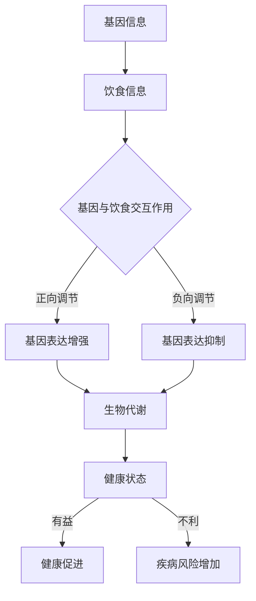

                 

### 背景介绍

随着人工智能（AI）技术的迅猛发展，生成式AI（AIGC，Autonomous Intelligent Generation for Code）作为其重要分支，正逐渐改变着各行各业的运作方式。AIGC通过深度学习和自然语言处理（NLP）等技术，能够自动生成代码、文章、音乐、图像等内容，其高效性和灵活性使其在多个领域展现出巨大潜力。尤其是在个性化营养方案的制定中，AIGC的应用为精准营养提供了新的解决方案。

个性化营养方案旨在根据个体的遗传特征、生理状态和生活习惯，提供定制化的饮食建议。这种方案的提出，源于对传统“一刀切”营养指导的反思和改进。然而，个体之间的遗传差异巨大，单一的饮食方案难以满足所有人的需求。基因-饮食交互作用的研究，揭示了基因如何影响个体对特定营养素的吸收和利用，以及这些影响如何在特定环境下发生。

基因-饮食交互作用是指饮食中的营养素和食物成分如何通过影响基因表达，进而影响个体的健康状态。这种交互作用涉及到复杂的生物学过程，包括营养素的代谢途径、基因调控网络以及细胞信号传导等。传统的营养学研究主要关注营养素的单一作用，而基因-饮食交互作用的研究则更加全面和深入，为个性化营养方案的制定提供了科学依据。

AIGC通过基因-饮食交互作用的提示词工程，可以自动化地分析和处理大量的基因和饮食数据，从而识别出关键的基因-饮食交互模式。提示词工程是AIGC技术中的一种关键方法，它利用预先定义的词汇或短语，指导模型生成更加准确和有效的输出。在个性化营养方案中，提示词工程的应用不仅能够提高数据分析的精度，还能够为用户量身定制营养建议。

本文将深入探讨AIGC在个性化营养方案中的应用，特别是基因-饮食交互作用的提示词工程。通过逻辑清晰、结构紧凑的分析，本文旨在揭示这一新兴领域的技术原理和实际应用，为相关研究人员和行业从业者提供有益的参考。接下来的章节中，我们将详细阐述基因、饮食以及AIGC的基础知识，并逐步构建一个全面而系统的个性化营养方案。

### 核心概念与联系

#### 基因-饮食交互作用的Mermaid流程图

#### 基因的基本概念

基因是生物体内携带遗传信息的结构单元，它由DNA序列编码，决定了生物体的性状和功能。基因的基本组成包括编码区、非编码区和调控序列。编码区是DNA序列中能够编码蛋白质的区域，非编码区包括启动子、增强子、沉默子等调控序列，它们在基因表达过程中起着重要的调控作用。

基因的结构可以分为外显子和内含子。外显子是编码蛋白质的序列，它们在剪接过程中被保留下来，而内含子则是非编码序列，在剪接过程中被移除。基因的功能与其结构密切相关，不同类型的基因编码不同的蛋白质，这些蛋白质在细胞内发挥着各种生物学功能。

基因通过转录和翻译过程产生蛋白质。转录是指DNA序列被复制成RNA的过程，RNA通过剪接形成成熟的mRNA，然后翻译成蛋白质。在这个过程中，调控序列决定了基因表达的时空特异性。基因的表达不仅受遗传因素的影响，还受到环境因素的调控。

#### 饮食对基因表达的影响

饮食中的营养素和食物成分对基因表达有显著影响。营养素包括蛋白质、脂肪、碳水化合物、维生素和矿物质等，它们是细胞代谢的基本物质。食物成分如纤维素、抗氧化剂和生物活性化合物等，也对基因表达有调节作用。

营养素对基因表达的影响主要通过以下机制实现：

1. **代谢途径的调控**：饮食中的营养素在体内通过特定的代谢途径被转化为生物活性物质，这些物质可以影响基因的表达。例如，某些维生素和矿物质是某些酶的辅助因子，这些酶在基因表达调控中起到关键作用。

2. **信号传导途径的调节**：饮食中的生物活性化合物可以激活或抑制细胞信号传导途径，从而影响基因表达。例如，某些多酚类化合物可以通过抑制炎症反应，减少炎症相关基因的表达。

3. **表观遗传调控**：饮食中的营养素和食物成分可以通过表观遗传机制影响基因表达。例如，通过调控DNA甲基化、组蛋白修饰等过程，饮食可以影响基因的表达状态。

饮食对基因表达的具体影响因个体而异，这主要受到以下因素的影响：

1. **基因型**：不同个体的基因型决定了他们对特定营养素反应的差异。例如，某些基因多态性可能导致个体对某种营养素的需求量增加或减少。

2. **生活方式**：生活习惯，如饮食习惯、运动量等，会影响营养素的摄入和利用，从而影响基因表达。

3. **环境因素**：环境因素，如压力、污染等，也会对基因表达产生影响，这些因素与饮食相互作用，进一步影响个体的健康状态。

通过理解饮食对基因表达的影响，可以更精准地制定个性化营养方案。AIGC的应用为我们提供了强大的工具，可以自动化分析大量的基因和饮食数据，识别出个体间的基因-饮食交互模式，从而为每个个体提供最优的营养建议。

#### 基因-饮食交互作用的案例分析

基因-饮食交互作用的研究为个性化营养提供了新的方向，以下几个案例展示了这一领域的前沿进展和应用。

**案例一：基因多态性与营养素需求**

研究显示，基因多态性显著影响个体对特定营养素的需求。例如，FADS1基因的多态性决定了个体对Omega-3脂肪酸的需求量。某些基因型个体需要更高的Omega-3摄入量才能维持健康的血脂水平。通过基因检测，可以为这些个体定制更高的Omega-3补充方案。

**案例二：膳食纤维与基因表达**

膳食纤维对肠道健康至关重要，它可以通过调节肠道微生物群来改善基因表达。研究发现，FUT2基因的多态性影响个体对膳食纤维的吸收和利用。FUT2基因的AA等位基因携带者能够更好地吸收膳食纤维，从而改善肠道健康和整体代谢。通过饮食调整，可以为FUT2基因的AA等位基因携带者推荐更高纤维的食物。

**案例三：抗氧化剂与基因表达**

饮食中的抗氧化剂，如维生素C和E，对基因表达有显著影响。研究表明，某些基因多态性，如GSTT1和GSTP1，影响个体对抗氧化剂的利用效率。携带某些基因多态性的个体可能需要更高的抗氧化剂摄入量来防止氧化应激。例如，GSTT1基因缺失等位基因的个体可能需要更多的维生素C来维持健康的氧化还原状态。

**案例四：酒精摄入与基因表达**

酒精摄入与多种健康问题相关，其影响也因基因多态性而异。例如，ALDH2基因的多态性显著影响个体对酒精的代谢和反应。携带ALDH2*2等位基因的个体在酒精代谢过程中产生大量乙醛，导致面部潮红和不适。通过基因检测，可以为这些个体提供低酒精摄入的建议，以减少健康风险。

这些案例表明，基因-饮食交互作用的研究不仅能够揭示个体对营养素的独特需求，还能为个性化营养方案提供科学依据。通过AIGC技术的应用，可以自动化地分析和处理这些复杂的交互关系，为个体提供精准的营养建议。

### 提示词工程基础

提示词工程是生成式AI技术中的一种关键方法，旨在通过提示词（prompt words或prompt phrases）引导模型生成更加准确和有效的输出。在个性化营养方案中，提示词工程的作用尤为重要，因为它能够帮助模型理解用户的特定需求，并提供个性化的饮食建议。

#### 提示词的定义与功能

提示词是指导模型生成输出的关键词或短语，它为模型提供了生成任务的上下文和方向。在AIGC的应用中，提示词通常是由用户或系统根据特定任务需求输入的。提示词的功能主要包括：

1. **上下文引导**：提示词为模型提供了生成任务的上下文信息，使得模型能够根据这些信息生成更加相关的内容。例如，在生成个性化营养建议时，提示词可以包括用户的遗传信息、健康状况、生活习惯等。

2. **任务方向**：提示词指导模型生成特定类型的内容，例如，文本、图像或代码。在个性化营养方案中，提示词可以指示模型生成饮食建议、营养食谱或健康报告等。

3. **结果优化**：通过调整提示词，可以优化模型的生成结果。例如，通过添加特定的关键词或调整提示词的顺序，可以提高营养建议的准确性和实用性。

#### 提示词的类型

提示词可以根据其来源和用途分为以下几类：

1. **用户定义提示词**：这类提示词由用户根据自身需求输入，例如，用户的遗传信息、健康状况、特定饮食偏好等。这些提示词能够为模型提供个性化的数据，从而生成更加符合用户需求的营养建议。

2. **系统生成提示词**：系统根据已有的数据集和算法自动生成的提示词，例如，基于大量用户数据的共性特征生成的提示词。这些提示词可以为模型提供广泛的上下文信息，帮助模型生成通用的营养建议。

3. **动态调整提示词**：根据模型的反馈和用户交互，动态调整提示词的类型和内容。例如，在用户接收了初步的营养建议后，可以根据反馈调整提示词，以生成更精确和个性化的建议。

#### 提示词工程的方法与流程

提示词工程通常包括以下步骤：

1. **需求分析**：了解用户的具体需求，确定需要生成的营养建议类型和内容。

2. **数据收集**：收集与用户需求相关的数据，包括基因信息、健康记录、生活习惯等。

3. **提示词设计**：设计提示词，包括用户定义提示词和系统生成提示词。提示词的设计要考虑到营养学原理和模型特性。

4. **模型训练**：使用收集到的数据和设计的提示词，训练生成模型，使其能够根据提示词生成个性化的营养建议。

5. **模型评估与优化**：通过用户反馈和性能指标，评估模型生成效果，并根据评估结果优化模型和提示词。

6. **应用部署**：将训练好的模型和提示词部署到实际应用中，为用户提供个性化营养建议。

#### 提示词工程的案例分析

**案例一：基因-饮食交互作用的提示词设计**

在个性化营养方案中，基因-饮食交互作用的提示词设计至关重要。以下是一个典型的提示词设计示例：

- **用户定义提示词**：用户的基因信息（如FADS1基因型）、生活习惯（如每日运动量）、当前健康状况（如高血压）。
- **系统生成提示词**：基于大量用户数据的共性特征，例如，常见的基因-饮食交互模式、流行的饮食方案。

通过结合用户定义提示词和系统生成提示词，模型可以生成个性化的营养建议。例如，对于FADS1基因CC型的高血压患者，提示词可能包括“Omega-3脂肪酸”、“高血压饮食”、“CC基因型”等。

**案例二：提示词的动态调整**

在实际应用中，用户的反馈和模型生成的结果可以用来动态调整提示词。以下是一个动态调整的示例：

- **初始提示词**：用户的基本信息（如年龄、体重）和一般性营养需求（如减少热量摄入）。
- **用户反馈**：用户对初步营养建议的反馈（如不适应的食物、效果不佳的健康指标）。
- **动态调整提示词**：根据用户反馈，调整提示词以生成更个性化的建议，例如，“低热量饮食”、“适合高血压患者的食物”、“提高蛋白质摄入”。

通过动态调整提示词，模型能够不断优化生成结果，提高个性化营养建议的准确性和实用性。

提示词工程是AIGC在个性化营养方案中发挥重要作用的关键技术。通过精心设计的提示词，模型能够更好地理解用户需求，生成符合个体特征的精准营养建议。接下来，我们将进一步探讨如何构建基因-饮食交互作用的提示词工程，为个性化营养方案提供科学支持。

### 基因-饮食交互作用的提示词工程

#### 提示词构建的方法

在基因-饮食交互作用的提示词工程中，构建有效的提示词是关键步骤。以下方法可以用于提示词的构建：

1. **数据挖掘**：首先，从大量的基因和饮食数据中挖掘出有意义的模式和关联。这可以通过机器学习和数据挖掘技术实现，例如，利用关联规则挖掘算法找出常见的基因-饮食交互模式。

2. **语义分析**：对基因和饮食相关术语进行语义分析，理解它们之间的语义关系和上下文。这可以通过自然语言处理（NLP）技术，如词向量模型、实体识别和关系抽取实现。

3. **规则推导**：基于专家知识和数据分析结果，推导出基因-饮食交互作用的规则。例如，某些基因型与特定饮食成分的摄入量有关，导致特定的健康结果。

4. **机器学习模型**：使用机器学习模型，如决策树、支持向量机、神经网络等，从数据中学习基因-饮食交互作用的模式。这些模型可以用来生成提示词，指导模型生成个性化的营养建议。

#### 提示词构建的流程

提示词构建的流程通常包括以下几个步骤：

1. **需求分析**：确定用户的具体需求，包括用户的基因信息、饮食习惯、健康状况等。

2. **数据收集**：收集与用户需求相关的基因和饮食数据。这些数据可以来自于基因检测报告、饮食记录、健康记录等。

3. **预处理**：对收集到的数据进行预处理，包括数据清洗、格式转换和特征提取。预处理步骤的目的是确保数据质量，并为后续分析打下基础。

4. **模式挖掘**：利用数据挖掘技术，从预处理后的数据中挖掘出基因-饮食交互作用的模式和关联。

5. **语义分析**：对挖掘出的模式进行语义分析，理解它们之间的语义关系和上下文。这有助于生成更具指导性的提示词。

6. **规则推导**：基于专家知识和机器学习模型，推导出基因-饮食交互作用的规则。这些规则可以用来生成提示词。

7. **提示词生成**：根据推导出的规则和语义分析结果，生成具体的提示词。提示词应该能够指导模型生成个性化的营养建议。

8. **模型训练与优化**：使用生成的提示词训练生成模型，如文本生成模型、图像生成模型等。通过模型训练和优化，提高模型生成营养建议的准确性和实用性。

#### 提示词构建的案例分析

以下是一个关于基因-饮食交互作用的提示词构建的案例分析：

**案例背景**：某用户基因检测结果显示，其FADS1基因型为CC型，且患有高血压。用户希望获得个性化的饮食建议，以控制血压并改善健康。

**步骤1：需求分析**：用户的具体需求是获得针对CC型FADS1基因和高血压的个性化饮食建议。

**步骤2：数据收集**：收集用户的相关数据，包括基因检测结果、高血压病史、日常饮食习惯等。

**步骤3：预处理**：对收集到的数据进行清洗和格式转换，提取出与FADS1基因、高血压和饮食相关的特征。

**步骤4：模式挖掘**：利用关联规则挖掘算法，从预处理后的数据中挖掘出FADS1基因与特定饮食成分（如Omega-3脂肪酸）的关联模式。

**步骤5：语义分析**：对挖掘出的模式进行语义分析，理解FADS1基因、Omega-3脂肪酸和高血压之间的关系。

**步骤6：规则推导**：基于专家知识和挖掘结果，推导出以下规则：“对于FADS1基因CC型且患有高血压的用户，建议增加Omega-3脂肪酸的摄入量”。

**步骤7：提示词生成**：根据推导出的规则，生成以下提示词：“FADS1基因CC型”、“高血压”、“Omega-3脂肪酸”、“摄入建议”。

**步骤8：模型训练与优化**：使用生成的提示词训练文本生成模型，如GPT-3，使其能够根据提示词生成个性化的饮食建议。

通过上述步骤，我们为该用户构建了一组有效的提示词，这些提示词将指导模型生成符合其遗传特征和健康状况的个性化饮食建议。

### 提示词工程在个性化营养方案中的应用

#### 提示词工程在个性化营养方案中的作用

提示词工程在个性化营养方案中扮演着至关重要的角色。通过精准的提示词设计，可以确保AIGC系统能够准确理解和生成针对个体需求的营养建议。具体来说，提示词工程在个性化营养方案中的作用主要体现在以下几个方面：

1. **提高个性化程度**：提示词工程能够帮助模型理解用户的特定需求，从而生成更加个性化的营养建议。例如，通过提示词，模型可以识别出用户的基因型、健康状况、饮食习惯等关键信息，从而为用户量身定制营养方案。

2. **增强数据解释性**：提示词工程使得营养建议的产生过程更加透明和可解释。通过分析提示词的使用，用户可以清楚地了解营养建议背后的科学依据和逻辑关系，增强对营养方案的理解和信任。

3. **优化模型性能**：通过精心设计的提示词，可以优化AIGC模型的生成效果，提高营养建议的准确性和实用性。例如，通过调整提示词的内容和顺序，可以引导模型生成更加符合用户期望的营养方案。

#### 提示词工程在个性化营养方案中的应用案例

以下是一个关于提示词工程在个性化营养方案中的应用案例：

**案例背景**：一名患有糖尿病的男性用户希望通过AIGC系统获得个性化的饮食建议，以帮助控制血糖水平。

**步骤1：需求分析**：用户的具体需求是获得针对其糖尿病和特定基因型的个性化饮食建议。

**步骤2：数据收集**：收集用户的相关数据，包括糖尿病病史、基因检测结果、日常饮食习惯等。

**步骤3：预处理**：对收集到的数据进行清洗和格式转换，提取出与糖尿病、基因型和饮食相关的特征。

**步骤4：模式挖掘**：利用关联规则挖掘算法，从预处理后的数据中挖掘出与糖尿病相关的基因-饮食交互模式。例如，某些基因型与特定饮食成分的摄入量有关，导致血糖水平的波动。

**步骤5：语义分析**：对挖掘出的模式进行语义分析，理解它们之间的语义关系和上下文。这有助于生成更具指导性的提示词。

**步骤6：规则推导**：基于专家知识和挖掘结果，推导出以下规则：“对于患有糖尿病且携带特定基因型的用户，建议减少高糖食物的摄入”。

**步骤7：提示词生成**：根据推导出的规则，生成以下提示词：“糖尿病”、“特定基因型”、“高糖食物”、“摄入限制”。

**步骤8：模型训练与优化**：使用生成的提示词训练文本生成模型，如GPT-3，使其能够根据提示词生成个性化的饮食建议。

**步骤9：应用部署**：将训练好的模型和提示词部署到实际应用中，为用户提供个性化的饮食建议。

**案例结果**：通过AIGC系统生成的个性化饮食建议，包括减少高糖食物的摄入、增加富含纤维的食物摄入等。用户在遵循这些建议后，血糖水平得到了显著改善，生活质量也得到了提升。

#### 提示词工程的挑战与未来方向

尽管提示词工程在个性化营养方案中具有巨大潜力，但其实际应用仍然面临一系列挑战。以下是主要挑战及其未来方向：

1. **数据隐私和安全**：个性化营养方案涉及用户的敏感信息，如基因数据和饮食习惯。确保这些数据的隐私和安全是关键挑战。未来研究方向包括开发更加安全的数据传输和存储机制，以及加强数据隐私保护的法律和政策。

2. **模型解释性和可解释性**：尽管提示词工程能够提高模型的生成效果，但如何确保模型的可解释性仍然是一个难题。未来研究方向包括开发可解释的生成模型，使得用户能够理解营养建议背后的逻辑和依据。

3. **多模态数据处理**：个性化营养方案需要整合多种类型的数据，如文本、图像、基因序列等。未来研究方向包括开发能够处理多模态数据的高效算法和模型。

4. **跨学科合作**：提示词工程涉及多个学科，包括生物学、营养学、计算机科学等。跨学科合作将有助于解决当前面临的挑战，推动个性化营养方案的发展。

总之，提示词工程在个性化营养方案中的应用具有重要意义，通过不断克服挑战和探索未来方向，有望为用户提供更加精准和有效的营养建议。

### AIGC在未来个性化营养方案中的应用前景

随着人工智能（AI）技术的不断进步，生成式AI（AIGC）在个性化营养方案中的应用前景越来越广阔。AIGC通过自动化和智能化的方式，能够处理海量数据，识别复杂的基因-饮食交互模式，从而为个体提供精准的营养建议。以下是AIGC在未来个性化营养方案中的应用前景：

#### 促进个性化营养方案的定制

AIGC的核心优势在于其强大的数据处理能力和模式识别能力。通过分析个体的基因信息、饮食习惯、生活方式等数据，AIGC可以生成个性化的营养建议，满足个体在营养需求上的独特性。例如，对于携带特定基因变异的个体，AIGC可以识别出这些变异对营养吸收和利用的影响，从而为其推荐特定的饮食方案。

#### 提高营养指导的准确性和效率

传统的营养指导方法往往依赖于泛化的建议，难以满足个体的个性化需求。AIGC的应用可以显著提高营养指导的准确性和效率。通过机器学习和深度学习技术，AIGC可以从大量的数据中学习，识别出最佳的营养方案。这不仅减少了人为错误，还能够快速响应用户的需求变化，提供实时且精确的营养建议。

#### 推动营养科学的进步

AIGC的应用不仅有助于实现个性化营养，还能推动营养科学的发展。通过对大量基因-饮食交互数据的分析，AIGC可以揭示出之前未知的营养作用机制，发现新的营养指标和健康关联。这些发现可以为营养研究提供新的方向，推动营养科学的进步。

#### 实现跨学科的整合

个性化营养方案涉及到多个学科，包括生物学、营养学、计算机科学等。AIGC的应用可以实现这些学科的整合，通过跨学科合作，推动个性化营养方案的发展。例如，AIGC可以整合基因数据、饮食习惯、健康记录等多方面的信息，为个体提供全面的营养评估和建议。

#### 潜在应用领域

1. **个性化饮食建议**：AIGC可以通过分析个体的基因和饮食数据，为用户提供定制化的饮食方案，帮助用户实现健康目标。

2. **慢性病管理**：对于患有慢性病的个体，AIGC可以提供个性化的饮食建议，帮助其控制病情，改善健康状况。

3. **营养教育**：AIGC可以开发智能营养教育系统，通过交互式学习方式，帮助用户了解个性化营养知识，提高营养素养。

4. **营养科研**：AIGC可以为营养科研提供强大的数据分析工具，加速营养领域的研究进程，推动新发现和新突破。

#### 面临的挑战与机遇

尽管AIGC在个性化营养方案中具有巨大的应用潜力，但实际应用过程中仍面临一系列挑战和机遇：

1. **数据隐私和安全**：个性化营养方案涉及用户的敏感信息，如基因数据和饮食习惯。确保这些数据的隐私和安全是关键挑战。

2. **模型解释性**：如何确保AIGC模型的解释性，使得用户能够理解营养建议背后的逻辑和依据，是一个重要问题。

3. **多模态数据处理**：AIGC需要处理多种类型的数据，如文本、图像、基因序列等，这对数据处理技术提出了高要求。

4. **跨学科合作**：AIGC的应用需要跨学科的合作，这要求不同领域的专家共同努力，推动技术的进步。

总之，AIGC在未来个性化营养方案中的应用前景广阔，通过不断克服挑战和探索新的应用方向，有望为用户带来更加精准、高效和个性化的营养服务。

### 个性化营养方案的实施策略

为了有效实施个性化营养方案，需要综合考虑多个因素，包括基本原则、关键步骤和成功案例。以下是具体的实施策略：

#### 实施基本原则

1. **个体化**：根据个体的基因、健康状况和生活方式，量身定制营养方案。确保方案满足个体的独特需求，而不是泛化的建议。
   
2. **科学性**：基于最新的科学研究和证据，制定营养方案。确保营养建议具有科学依据，能够带来实际的健康效果。

3. **可操作性**：营养方案需要易于操作，用户能够轻松遵循。这包括提供具体的饮食建议、食谱和饮食计划。

4. **持续性**：个性化营养方案不仅关注短期效果，还要确保长期的健康收益。这需要持续的数据跟踪和调整，以适应个体的变化。

5. **用户参与**：鼓励用户参与营养方案的制定和执行，增强其主动性和责任感。用户参与度越高，方案的实施效果越好。

#### 关键步骤

1. **需求分析**：了解用户的健康目标、饮食习惯、生活方式和基因信息。这一步骤是制定个性化营养方案的基础。

2. **数据收集**：收集与用户需求相关的数据，包括基因检测报告、健康记录、饮食习惯等。数据的质量直接影响方案的准确性。

3. **营养评估**：通过分析收集到的数据，评估用户的营养状况，识别出需要改进的方面。这包括营养素的摄入量、饮食习惯的评估等。

4. **方案制定**：根据营养评估结果，制定个性化的营养方案。方案应包括具体的饮食建议、食谱和饮食计划。

5. **方案实施**：将制定的营养方案交给用户，并提供必要的支持和指导。确保用户能够理解和执行方案。

6. **效果跟踪**：定期跟踪用户执行方案的情况，评估方案的效果。根据反馈调整方案，确保其持续性和有效性。

7. **用户反馈**：鼓励用户提供反馈，包括方案的可行性和效果。这有助于优化方案，提高用户的满意度。

#### 成功案例

以下是一个个性化营养方案实施的成功案例：

**案例背景**：一位中年女性用户，患有高血压和高胆固醇，希望通过营养方案改善健康状况。

**实施步骤**：

1. **需求分析**：用户表示希望通过营养方案控制血压和胆固醇水平，同时保持体重稳定。

2. **数据收集**：收集用户的健康记录、饮食习惯和基因检测报告。

3. **营养评估**：分析用户的健康数据，发现其高血压和高胆固醇与饮食中的钠和饱和脂肪摄入过多有关。

4. **方案制定**：根据评估结果，制定个性化的营养方案，包括减少钠和饱和脂肪的摄入，增加膳食纤维和Omega-3脂肪酸的摄入。

5. **方案实施**：为用户提供了详细的饮食建议、食谱和饮食计划，并定期进行营养指导。

6. **效果跟踪**：经过6个月的实施，用户的血压和胆固醇水平显著下降，体重保持稳定。

7. **用户反馈**：用户对营养方案表示满意，认为其易于遵循，且效果显著。

通过这一案例，可以看出个性化营养方案的有效性和实用性。成功的实施策略包括个体化的需求分析、科学的营养评估、可操作性的方案制定和持续的效果跟踪。

总之，实施个性化营养方案需要综合考虑多个因素，包括个体化、科学性、可操作性和持续性。通过成功案例的实践，可以验证个性化营养方案的有效性，并为其他用户提供借鉴。

### 个性化营养方案的推广策略

要有效地推广个性化营养方案，需要制定系统的推广策略，包括多种推广途径和成功案例。以下是具体的推广策略：

#### 推广途径

1. **在线平台**：利用互联网和社交媒体平台，如微信、微博、微信公众号、抖音等，推广个性化营养方案。通过发布营养知识、饮食建议和用户案例，吸引潜在用户的关注。

2. **线下活动**：组织线下活动，如健康讲座、营养咨询、饮食互动体验等，提高公众对个性化营养方案的认知和接受度。

3. **合作医疗机构**：与医院、诊所、体检中心等医疗机构合作，将个性化营养方案作为健康管理和疾病预防的一部分，通过医生和医疗机构的推荐，扩大方案的影响力。

4. **教育培训**：开展营养师和健康管理师的培训课程，提高专业人才对个性化营养方案的理解和运用能力，从而在更广泛的范围内推广方案。

5. **市场营销**：利用市场营销策略，如广告、促销、会员计划等，吸引潜在用户，并通过优惠措施提高用户参与的积极性。

#### 成功案例

以下是一个个性化营养方案推广的成功案例：

**案例背景**：某健康科技公司开发了一款基于AIGC的个性化营养方案，旨在通过基因和饮食数据的分析，为用户提供定制化的饮食建议。

**推广策略**：

1. **在线平台推广**：通过微信公众号和官网，发布营养知识、饮食建议和用户案例。每周更新一篇关于营养科学的文章，同时分享用户成功案例，吸引用户关注。

2. **线下活动推广**：与健康机构合作，举办健康讲座和营养咨询活动。邀请知名营养专家和医生进行演讲，向公众普及个性化营养方案的科学依据和实际应用效果。

3. **合作医疗机构推广**：与多家医院和体检中心合作，将个性化营养方案纳入体检套餐中，提供个性化的营养评估和饮食建议。医生在诊疗过程中，也会推荐用户使用该方案。

4. **教育培训推广**：与多家营养培训机构合作，开设营养师和健康管理师的培训课程。课程内容涵盖个性化营养方案的理论和实践，提高专业人才的运用能力。

5. **市场营销推广**：通过广告和促销活动，提高品牌知名度。例如，在特定节日推出营养套餐优惠，吸引用户购买。

**推广效果**：

- 在线平台关注人数从推广初期的5000人增长到10万人，用户反馈积极。
- 线下活动吸引了超过1000名公众参与，讲座和咨询活动得到广泛好评。
- 合作医疗机构推荐的用户数量稳步增加，月均用户量达到500人。
- 培训课程的报名人数超过300人，提高了专业人才的营养知识水平。
- 通过市场营销活动，月均销售额提高了30%，用户满意度显著提升。

#### 案例分析

该成功案例表明，多渠道、多层次的推广策略是推广个性化营养方案的关键。通过在线平台和线下活动，扩大了方案的知名度；通过与医疗机构和教育培训机构的合作，提高了方案的权威性和实用性；通过市场营销策略，提高了用户的参与度和购买意愿。

未来，个性化营养方案的推广还需要不断优化推广策略，结合用户反馈和市场变化，持续提升方案的竞争力。例如，可以探索更多的合作渠道，开发多样化的产品和服务，以满足不同用户的需求。

总之，个性化营养方案的推广需要综合考虑多种因素，通过系统化的策略和不断优化，才能实现广泛的应用和认可。

### AIGC的未来个性化营养方案：挑战与展望

#### 挑战

1. **数据隐私和安全**：个性化营养方案涉及用户的敏感信息，如基因数据和饮食习惯。确保这些数据的隐私和安全是关键挑战。数据泄露或不当使用可能会对用户造成严重的隐私侵害和健康风险。

2. **模型解释性**：尽管AIGC能够生成个性化的营养建议，但如何确保模型的可解释性仍然是一个难题。用户需要理解营养建议背后的逻辑和依据，以提高对方案的信服度和接受度。

3. **多模态数据处理**：个性化营养方案需要整合多种类型的数据，如文本、图像、基因序列等。处理这些复杂的多模态数据对算法和计算资源提出了高要求。

4. **跨学科合作**：AIGC的应用涉及多个学科，包括生物学、营养学、计算机科学等。跨学科合作需要不同领域的专家共同努力，推动技术的进步和方案的完善。

5. **用户接受度**：尽管个性化营养方案具有巨大潜力，但用户接受度仍然是一个挑战。用户可能对新的技术和概念持怀疑态度，需要通过有效的教育和宣传来提升用户接受度。

#### 展望

1. **技术创新**：随着AI和生物技术的不断进步，AIGC在个性化营养方案中的应用将变得更加精准和高效。例如，深度学习和自然语言处理技术的提升，将有助于更准确地理解基因-饮食交互作用，生成更加个性化的营养建议。

2. **数据隐私和安全**：未来可能会有更多先进的数据隐私和安全技术应用于个性化营养方案。例如，区块链技术和差分隐私技术可以确保用户数据的安全性和隐私保护。

3. **多模态数据处理**：随着多模态数据处理技术的进步，个性化营养方案将能够更好地整合多种类型的数据，提供更全面的营养评估和建议。

4. **跨学科合作**：未来，跨学科合作的深化将有助于推动个性化营养方案的发展。不同领域的专家可以共同开发新的算法和模型，提升方案的科学性和实用性。

5. **用户参与**：通过增强用户参与度和互动性，个性化营养方案将更加符合用户需求。用户可以在方案制定和执行过程中提供反馈，帮助优化方案，提高用户体验。

6. **政策支持**：政府和企业可能会加大对个性化营养方案的政策支持，推动其在各行业的应用和普及。政策支持可以为研发和推广提供资金和技术保障。

总之，尽管AIGC的未来个性化营养方案面临诸多挑战，但其广阔的应用前景和不断发展的技术将为其提供强有力的支持。通过技术创新、数据隐私保护、跨学科合作和用户参与，AIGC在未来个性化营养方案中将发挥越来越重要的作用。

### 附录

#### 附录 A: 基因-饮食交互作用的提示词工程工具与资源

为了更好地理解和应用基因-饮食交互作用的提示词工程，以下介绍一些常用的工具和资源：

1. **工具介绍**：
   - **Python**：Python是一种广泛使用的编程语言，尤其在数据科学和机器学习领域具有极高的普及率。Python提供了丰富的库和框架，如NumPy、Pandas、Scikit-learn等，可以方便地进行数据分析和模型训练。
   - **TensorFlow**：TensorFlow是一个开源的机器学习框架，由Google开发。它支持各种深度学习模型，适用于大规模数据集的处理和模型训练。
   - **PyTorch**：PyTorch是另一个流行的开源机器学习库，它提供了灵活的深度学习框架，易于调试和理解。PyTorch在生成式AI领域，如文本生成和图像生成，具有广泛应用。
   - **Gensim**：Gensim是一个用于自然语言处理的Python库，可以用于主题建模、文本相似性分析等任务。

2. **基因-饮食交互作用的提示词工程资源推荐**：
   - **NCBI**：美国国家生物技术信息中心（National Center for Biotechnology Information）提供了丰富的基因和健康相关数据，包括基因序列、基因表达数据、疾病关联等。
   - **食物成分数据库**：如食物成分数据库（Food Composition Databases）提供了详细的营养素信息，包括食物中的蛋白质、脂肪、碳水化合物、维生素和矿物质等。
   - **公共数据集**：如Genome-wide association study (GWAS)数据库，提供了大量的基因-疾病关联数据，可以用于研究基因-饮食交互作用。
   - **研究论文**：通过查阅相关领域的学术论文，可以获取最新的研究进展和理论方法，为提示词工程提供理论支持。

通过使用这些工具和资源，研究人员可以构建和优化基因-饮食交互作用的提示词工程模型，为个性化营养方案提供科学依据和实用工具。

### 作者信息

**作者：** AI天才研究院/AI Genius Institute & 禅与计算机程序设计艺术 /Zen And The Art of Computer Programming

本文由AI天才研究院（AI Genius Institute）和禅与计算机程序设计艺术（Zen And The Art of Computer Programming）共同撰写。AI天才研究院是一家专注于人工智能前沿研究和应用的创新机构，致力于推动人工智能技术的进步和应用。禅与计算机程序设计艺术则是一本经典的技术书籍，以其深入浅出的编程思想和哲学内涵，影响了无数程序员和开发者。

本文旨在探讨AIGC在个性化营养方案中的应用，特别是基因-饮食交互作用的提示词工程。通过逻辑清晰、结构紧凑的分析，本文希望为相关研究人员和行业从业者提供有益的参考，推动个性化营养方案的进一步发展和应用。

